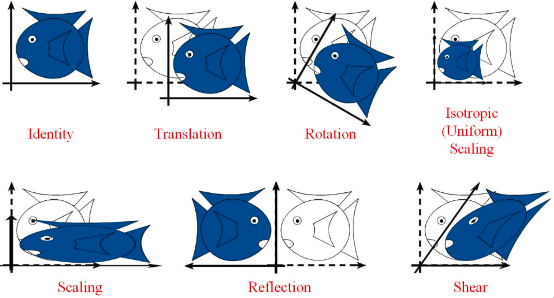
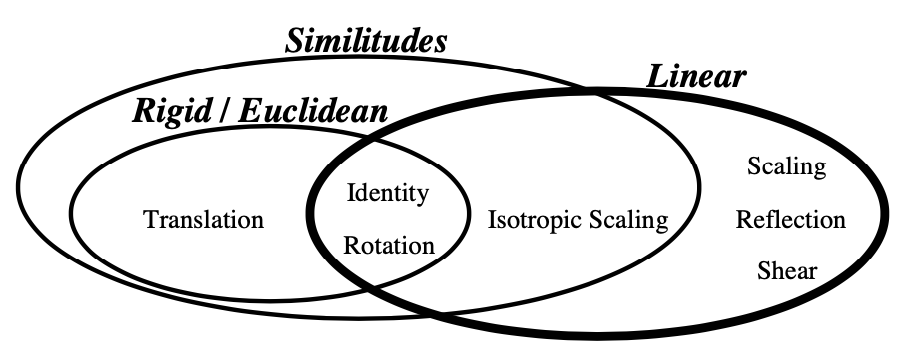
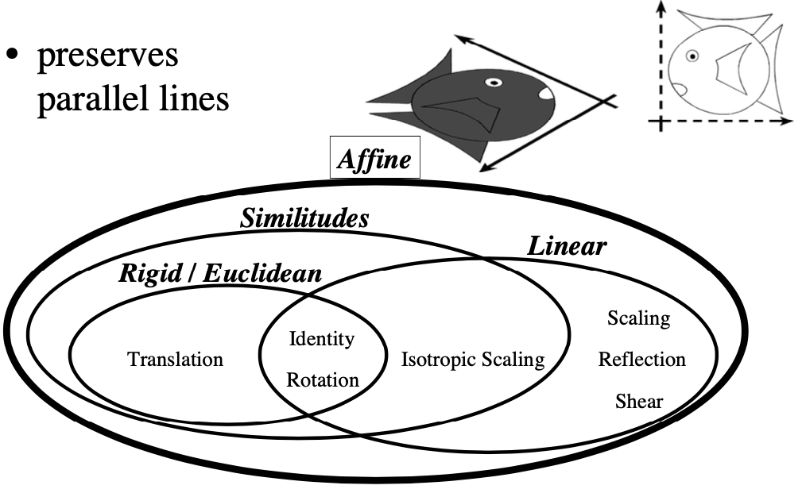
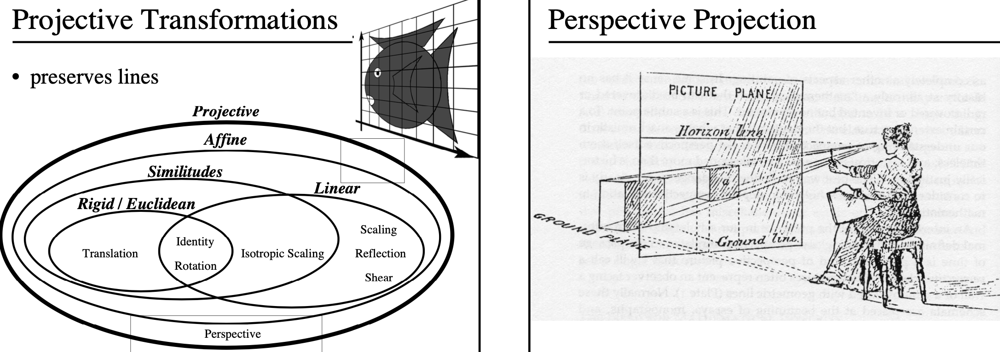

# 仿射变换

本文是对《机器学习数学基础》第2章2.2.4节齐次坐标系的内容拓展。

## 名称的来源

**仿射**，是英文单词 **affine** 的中文翻译。

单词 affine，读音：[ə'faɪn]。来自于英语 affinity。英语词根 fin 来自于拉丁语 finis，表示“边界，末端”，例如finish、final 等单词。词头 ad 表示“去，往”，拼出名词 affinity，本意为“接壤，结合”，用来指“姻亲，由于婚姻而产生的亲戚关系”，引申为“亲密关系，相似性”等$$^{[1]}$$。

中文名称“仿射”，有一种观点是**音译**，来自“affine geometry”中的“fine”和“geo”两部分，于是“仿射几何”就翻译出来了$$^{[2]}$$。

## 变换

对于几何图形，经常会有一些平移、旋转、缩放等形式的变换，如下图所示$$^{[3]}$$ ：



- 平移，translation
- 旋转，rotation

平移和旋转，图形的形状（面积或体积）不变，也称为刚体变换（rigid transformation）或欧几里得变换（Euclidean transformation）。

- 缩放，scaling。如果每个坐标方向的缩放系数相同（即各向同性，isotropic），则为 uniform scaling
- 反射，reflection，关于某坐标轴对称。反射也可以看成是缩放的一个特例。

平移、旋转和各向同性的缩放，统称为相似变换（similarity transformation）。

- 剪切变换，shear mapping

下图显示了相似变换、线性变换的概念所涵盖的变换方式$$^{[4]}$$ 。



在线性代数中所研究的线性变换（参阅《机器学习数学基础》第2章2.2节），包括：

- 旋转
- 反射
- 剪切
- 各向同性或者不同性的缩放

以上变换的组合，也是线性变换。线性变换遵循着加法和乘法封闭原则，即：

$$
\begin{split}&L(p+q)=L(p)+L(q)\\&L(\alpha p)=\alpha L(p)\end{split}
$$
但是，平移不是线性变换（《机器学习数学基础》第2章2.2.1节）。如果将上述的线性变换与平移合并起来，则称为 affine transformation，翻译为仿射变换$$^{[4]}$$。



变换的范围还可继续扩大，那就是射影变换（projective transformation）$$^{[4]}$$。



本文重点探讨仿射变换。

## 仿射空间

**仿射空间**（affine space)，又称线性流形，是数学中的几何结构，这种结构是欧式空间的仿射特性的推广$$^{[5]}$$。

在仿射空间中，点与点之间的差即为向量，点与向量的加法可以得到另一个点，但是点与点之间不可以相加。

仿射空间中没有特定的原点，因此不能将空间中的每一点和特定的向量对应起来。仿射空间中只有从一个点到另一个点的位移向量，或称平移向量。

如果 $\mathbb X$ 是仿射空间，$\pmb{a},\pmb{b}\in\mathbb{X}$ ，那么从 $\pmb{a}$ 到 $\pmb{b}$ 的位移向量为 $\pmb{b} − \pmb{a}$ 。

**所有向量空间都可看作仿射空间。**

若 $\mathbb{X}$ 是向量空间，$\pmb{L}\in\mathbb{X}$ 是向量子空间，$\pmb{a}\in\mathbb{X}$ ，则 $\pmb{a}+\pmb{L}=\{a+l:l\in\pmb{L}\}$ 是仿射空间。这里的 $\pmb{a}$ 也称为平移向量。

若向量空间 $\mathbb{X}$ 的维度是 $n\lt\infty$ ，那么 $\mathbb{X}$ 的仿射子空间也可看作一组非齐次线性方程的解；而齐次方程的解永远是线性子空间，也就是说齐次方程的解永远包含零解。维度为 $$n − 1$$ 的仿射空间也叫做仿射超平面。 

## 仿射变换

**仿射变换**（affine transformation），又称**仿射映射**，是对一个向量空间进行一次线性变换并接上一个平移，变换为另一个向量空间。即：
$$
\pmb{y}=\pmb{Ax}+\pmb{b}
$$
平移变换不能用矩阵表示，为此使用齐次坐标系（《机器学习数学基础》第2章2.2.4节）。

### 仿射变换的性质

设 $f(\pmb{x})=\pmb{Ax}+\pmb{b}$ 是一个仿射变换，则 $f$ 具有：

1. 直线到直线的映射
2. 原来平行的直线变换之后仍然平行

**证明**

1. 设直线 $l:\pmb{p}+t\pmb{u},t\in\mathbb{R}$ ，则：

   $$
   f(\pmb{p}+t\pmb{u})=\pmb{A}(\pmb{p}+t\pmb{u})+\pmb{b}=(\pmb{Ap}+\pmb{b})+t(\pmb{Au})=\pmb{p}_1+t\pmb{u}_1
   $$
   其中 $\pmb{p}_1=\pmb{Ap}+\pmb{b}$ ，$\pmb{u_1}=\pmb{Au}$ ，则 $f(l)=l_1, l_1:\pmb{p}_1+t\pmb{u}_1,t\in\mathbb{R}$ 仍然是直线。

2. 设 $l:\pmb{p}+t\pmb{u}$ 和 $m:\pmb{q}+t\pmb{v}$ 是平行线，则 $\pmb{v}=k\pmb{u},k\in\mathbb{R}$ ，所以：

   $$
   \begin{split}
   f(\pmb{p}+t\pmb{u})&=\pmb{A}(\pmb{p}+t\pmb{u})+\pmb{b}=(\pmb{Ap}+\pmb{b})+t(\pmb{Au})=\pmb{p}_1+t\pmb{u}_1
   \\
   f(\pmb{q}+t\pmb{v})&=f(\pmb{q}+t(k\pmb{u}))\\&=\pmb{A}(\pmb{q}+t(k\pmb{u}))+\pmb{b}\\&=(\pmb{Aq}+\pmb{b})+t(\pmb{A}k\pmb{u)}\\&=\pmb{q}_1+t(k\pmb{u}_1)
   \end{split}
   $$
   故，变换之后所得 $l_1:\pmb{p}_1+t\pmb{u}_1$ 与 $m_1:\pmb{q}_1+t(k\pmb{u}_1)$ 仍然平行。

### 计算工具

如果对图形进行仿射变换，以下列举两个示例。

**1. OpenCV**

```python
import cv2 
import numpy as np 
from matplotlib import pyplot as plt 
  
  
img = cv2.imread('headpic.png') 
rows, cols, ch = img.shape 
  
pts1 = np.float32([[50, 50], 
                   [200, 50],  
                   [50, 200]]) 
  
pts2 = np.float32([[10, 100], 
                   [200, 50],  
                   [100, 250]]) 

# 构造对应点变换矩阵
M = cv2.getAffineTransform(pts1, pts2) 
dst = cv2.warpAffine(img, M, (cols, rows)) 
  
plt.subplot(121) 
plt.imshow(img) 
plt.title('Input') 
  
plt.subplot(122) 
plt.imshow(dst) 
plt.title('Output') 
  
plt.show() 
```

输出图像


**2. 仿射变换模块**

- Affine_transform：`pip install affine-transform`
- Affine：`pip install affine`，github仓库地址：https://github.com/sgillies/affine


## 参考文献

[1]. tetradecane. https://www.zhihu.com/question/345279684/answer/819134982

[2]. 关于仿射这个词有什么通俗易懂的解释吗？. https://www.zhihu.com/question/368556037/answer/990194830

[3]. https://www.cnblogs.com/shine-lee/p/10950963.html

[4]. http://www.cs.tau.ac.il/~dcor/Graphics/cg-slides/trans3d.pdf

[5]. [https://zh.wikipedia.org/wiki/仿射空间](https://zh.wikipedia.org/wiki/%E4%BB%BF%E5%B0%84%E7%A9%BA%E9%97%B4)

