# 01 函数

从初中代数，就已经引入了函数这个概念，其英文单词是 **function**，中文翻译为**函数**，这个词语是由大清朝数学家[李善兰](https://zh.wikipedia.org/wiki/李善兰)所翻译，他在所著的《代数学》书中解释：“凡此变数中函（包含）彼变数者，则此为彼之函数”（台湾省的有关资料中，常将变量称为“变数”）。

函数这个数学名词是莱布尼兹在 1694 年开始使用的，当时他用这个名词描述与曲线相关的量，如曲线的斜率等。现在，我们将莱布尼兹所说的函数称为函数的导数。此后，很多数学家对函数做了深入研究，并且给出了不同的定义，例如：

- 1718年，约翰·伯努利把函数定义为“一个变量的函数是指由这个变量和常量以任何一种方式组成的一种量。”
- 1748年，伯努利的学生[欧拉](https://zh.wikipedia.org/wiki/欧拉)在《无穷分析引论》一书中说：“一个变量的函数是由该变量和一些数或常量以任何一种方式构成的解析表达式”，例如 $f(x)=\sin(x)+x^{2}$ 。
- 1775年，欧拉在《微分学原理》一书中又提出了函数的一个定义：“如果某些量以如下方式依赖于另一些量，即当后者变化时，前者本身也发生变化，则称前一些量是后一些量的函数。”
- 到19世纪末，数学家开始尝试利用集合论来进行数学的形式化。他们试图将每一个数学对象都定义为集合。[狄利克雷](https://zh.wikipedia.org/wiki/狄利克雷)给出了现代正式的函数定义。

## 函数及其图像

函数是一种用以描述世界的工具。一个函数，可以用表达式、图像、表格或者语言进行描述。

### 函数及其定义域和值域

**定义**  函数是从一个实数集合 $\mathbb{D}$ 到另一个实数集合 $\mathbb{Y}$ 间的变换规则，通常记作记作 $f:\mathbb{X}\to\mathbb{Y}$ ，其中 $f$ 表示对变换规则。

更一般的写法：

$
y=f(x)
$

符号 $f$ 表示**函数**；$x$ 叫做**自变量**（independent variable），是函数 $f$ 的输入；$y$ 是**因变量**（dependent variable），是函数 $f$ 关于 $x$ 的输出。如下图所示。

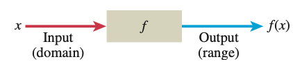

函数的执行过程

显然，$x\in\mathbb{D}$ ，集合 $\mathbb{D}$ 中所有可以作为自变量的元素构成了函数的**定义域**（domain）；$f(x)$ 的所有输出所构成的集合称为**值域**（range），值域则必然是集合 $\mathbb{Y}$ 中的元素，即 $y\in\mathbb{Y}$ 。

一个函数必须给定每一个有效的输入指定唯一的输出。

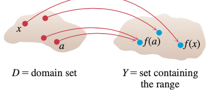

函数中定义域集合与值域集合的元素对应关系

例如函数 $y=\sqrt{x}$ 的定义域是 $[0,\infty)$ ，值域是 $[0,\infty)$ 。

**注意：**例如 $f(x)=x^2$ ，其中 $f$ 是函数，即一个变换规则，$f(x)$ 是把这个变换规则应用于变量 $x$ 后得到的结果。因此，说“ $f(x)$ 是一个函数”是不正确的，应该说“ $f$ 是一个函数”。

### 函数图像

除了用表达式表示函数之外，还会用图像表示函数。以二维的为例，函数的每个自变量与因变量可以构成笛卡尔直角坐标系中的一个点。

$
\{(x,f(x)|x\in\mathbb{D}\}
$

按照上式，将所有点连成线，即为函数图像。例如 $y=x^2$ 的图像：

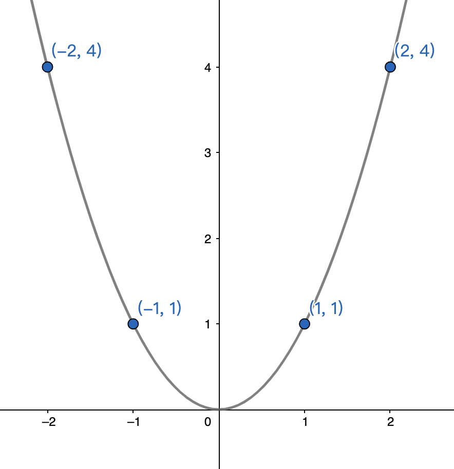

函数图像

### 分段函数

有时一个函数别划分为几部分，各个部分的函数形式不同，例如：

$
f(x)=\begin{cases}-x,\quad&{x\lt{0}}\\x^2,\quad&{0\le{x}\le{1}}\\1,\quad&{x\gt{1}}\end{cases}
$

### 增函数和减函数

**定义**  令区间 $\mathbb{I}$ 上的函数为 $f$ ，$x_1$ 和 $x_2$ 是这个区间上两个不同的点，且 $x_1\lt{x_2}$ ：

- 如果 $f(x_1)\gt{f(x_2)}$ ，则函数 $f$ 称为区间 $\mathbb{I}$ 上的**减函数**（decreasing function）
- 如果 $f(x_1)\lt{f(x_2)}$ ，则函数 $f$ 称为区间 $\mathbb{I}$ 上的**增函数**（increasing function）

### 函数的奇偶性

**定义**  设 $y=f(x)$ ，$x$ 在函数定义域内：

- 若 $f(-x)=f(x)$ ，则函数 $f$ 是**偶函数**（even function）
- 若 $f(-x)=-f(x)$ ，则函数 $f$ 是**奇函数**（odd function）

例如：函数 $f(x)=x^2+1$ ，$f(-x)=(-x)^2+1=x^2+1=f(x)$ ，故为偶函数。如果将 $y=x^2$ 与 $y=x^2+1$ 相比较，如下图所示，即是 $y=x^2$ 沿 $y$ 轴向上移动一个单位得到了 $y=x^2+1$ 。

函数平移比较

并且，从图像中可以看出来，**偶函数的图像是关于 $y$ 轴镜像对称**，这个结论可以推广到所有的偶函数中。

再如：函数 $f(x)=x$ ，显然是一个奇函数，如下图所示，奇函数图像的特点是关于坐标原点对称——原来奇函数图像围绕原点旋转180°。但是，函数 $f(x)=x+1$ ，虽然也可以看做是函数 $f(x)=x$ 向上移动一个单位，但 $f(-x) = -x+1\ne-(x+1)=-f(x)$ ，故它不是奇函数，也不是偶函数——由此可知，函数并非是奇函数和偶函数的并集——“不是奇函数，就是偶函数”，这句话是错误的。

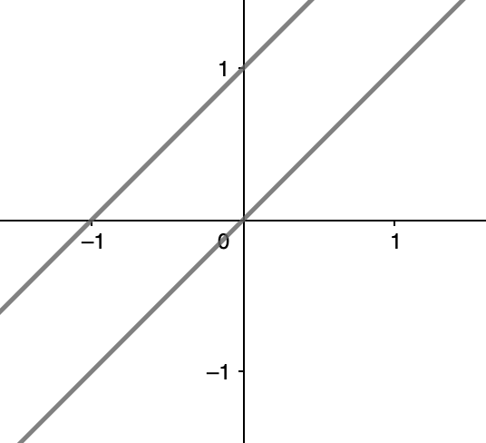

奇函数和 y=x+1 比较

一般而言，一个函数可能是奇函数，可能是偶函数，也可能非奇非偶函数。从一般经验角度说，大多数函数是非奇非偶的。

**结论1** 只有一个函数既是奇函数又是偶函数： $f(x)=0$ ，称之为**零函数**。

**证明**

若函数 $f$ 是偶函数，则对所有 $x$ 有：$f(-x)=f(x)$ ；

同时，此函数还是奇函数，则：$f(-x)=-f(x)$ 。

两式相减，得：$0=2f(x)$ ，即 $f(x)=0$。

证毕。

**结论2**  如果一个函数是奇函数，并且 $0$ 在其定义域内，则 $f(0)=0$ 。

**证明**

设 $f$ 是奇函数，$f(-x)=-f(x)$ ，$0$ 在其定义域内，则 $f(-0)=-f(0)$ ，又因为 $-0=0$ ，所以 $f(0)=-f(0)$ ，即 $2f(0)=0$ 。所以：

$
f(0)=0
$

证毕。

**结论3**  奇函数、偶函数的积

- 两个奇函数之积是偶函数
- 两个偶函数之积是偶函数
- 奇函数和偶函数之积是奇函数

**证明**（以下证明结论中第一条为例）

设两个奇函数 $f$ 和 $g$ ，它们的积 $h$ 定义为 $h(x)=f(x)g(x)$ 。

因为 $f(-x)=-f(x), g(-x)=-g(x)$ ，所以：

$
h(-x)=f(-x)g(-x)=-f(x)\cdot(-g(x))=f(x)g(x)=h(x)
$

即 $h$ 是偶函数。

证毕。

### 常见函数

1. 线性函数：$f(x)=mx+b$ （注意，要区分此处的“线性函数”和“线性空间”，具体请参阅《机器学习数学基础》一书中的详细内容）。

2. 反比例函数：$f(x)=\frac{1}{x}$

3. 指数函数：$f(x)=x^a$ ，其中 $a$ 是常数。

   1. $f(x)=x^n$ ，$n$ 是正整数，下图分别表示了 $n=1,2,3,4,5$ 的函数图像。

      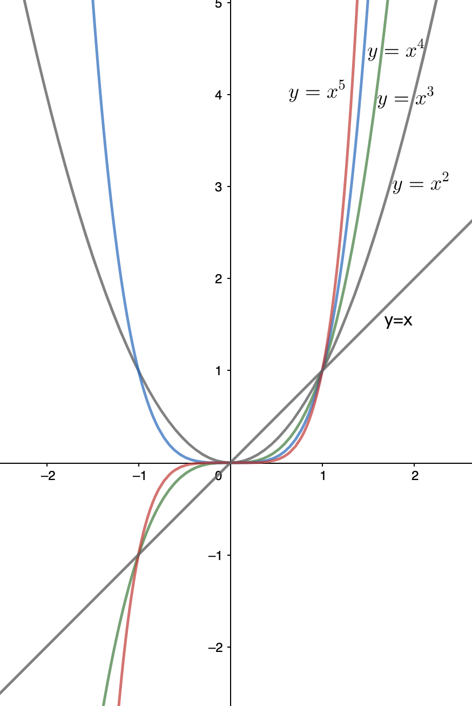

      
指数是正整数的指数函数比较

   2. $f(x)=x^a$ ，$a=-1$ 或 $a=-2$

      当 $a=-1$ 时，即 $f(x)=x^{-1}=\frac{1}{x}$ ，是反比例函数，其图像如下。此函数等效于 $xy=1$ ，注意 $x\ne{0}$ 。并且是奇函数。

      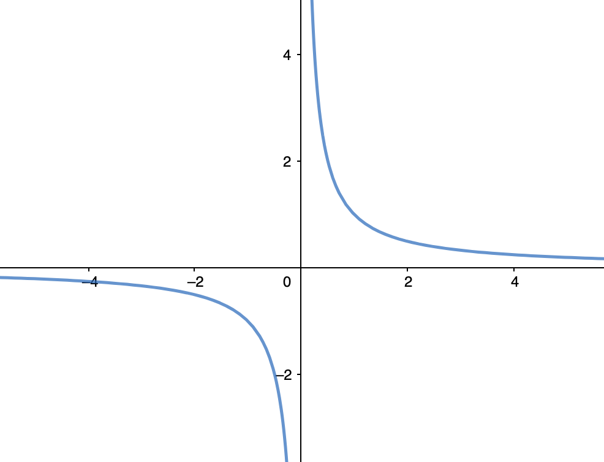

      
反比例函数

      当 $a=-2$ 时，即 $f(x)=x^{-2}=\frac{1}{x^2}$ ，且为偶函数。其图像如下所示：

      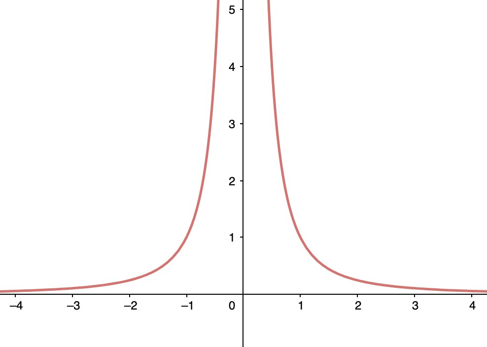

      
a=-2 时的函数图像

   3. $a=\frac{1}{2},\frac{1}{3},\frac{3}{2},\frac{2}{3}$

      这几种结果，分别对应常用的函数，其图像如下所示：

      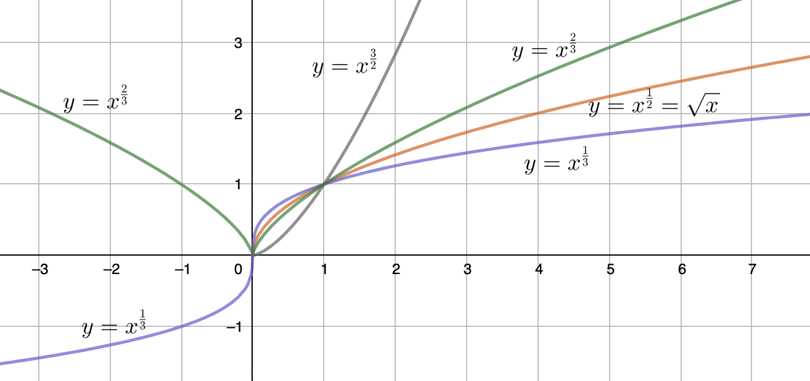

      
几种常见指数函数比较

4. 多项式：$p(x)=a_nx^n+a_{n-1}x^{n-1}+\cdots+a_1x+a_0$ ，其中 $n$ 为非负整数，$a_0,a_1,\cdots,a_n$ 是实数，称为多项式的系数。多项式的定义域为 $(-\infty,\infty)$ 。若系数 $a_n$ 不为零，则最大的幂 $n$ 称为多项式的**次数**。前面所说的线性函数 $f(x)=mx+b$ ，若 $x\ne{0}$ ，则为 $1$ 次多项式；如果多项式的次数（阶数）是 $2$ ，即为二次函数，常表示为 $p(x)=ax^2+bx+c$ 。

5. 有理函数：$f(x)=\frac{p(x)}{q(x)}$ ，其中 $p$ 和 $q$ 分别是多项式，$q(x)\ne{0}$ 。例如：

   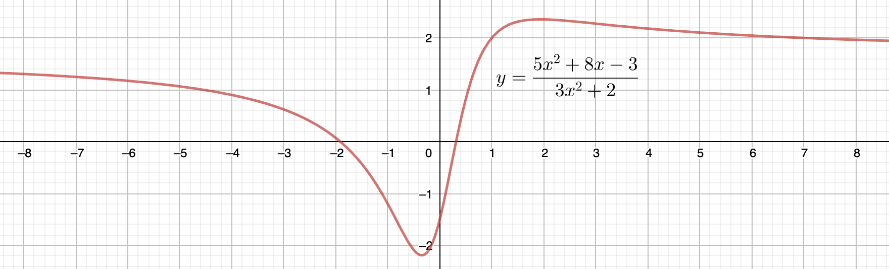

   
一个有理函数

6. 代数函数：对多项式利用代数运算符（加减乘除和幂运算）进行组合。所有的有理函数都是代数函数，但代数函数的范畴比有理函数更大。例如下图所示就是代数函数 $y=x^{\frac{1}{3}}(x-4)$ 的图像。

   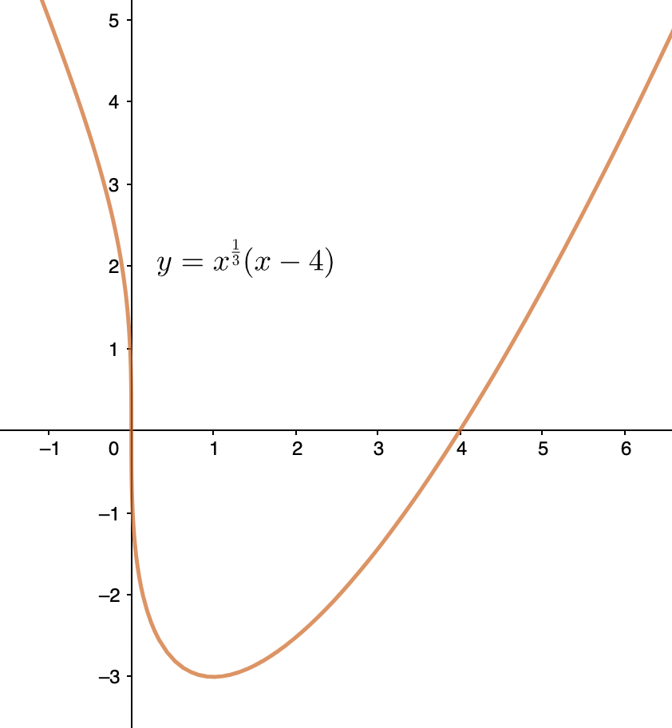

   
代数函数图像

7. 三角函数：例如 $y=\sin(x)$ ，后续内容会专门介绍常用的6个三角函数。

8. 指数函数：$f(x)=a^x$ ，其中 $a\gt{0}$ 且 $a\ne{1}$ ，称作底。定义域 $(-\infty,\infty)$ ，值域 $(0,\infty)$ 。后续会专门探讨。

9. 对数函数：$f(x)=\log_ax$ ，其中 $a\ne{1}$ 是正数，它的反函数是幂函数。在后续内容中会专门对此进行探讨。

10. 超越函数：其形式不是代数的，包括三角函数、反三角函数等。例如悬线就是一种超越函数。后续内容中也会专门对此进行研究。

## 复合函数及图像变换

### 函数的加减乘除

设 $f$ 和 $g$ 分别为两个函数，若自变量 $x$ 属于两个函数定义域的交集，即 $x\in\mathbb{D}(f)\cap\mathbb{D}(g)$ ，则定义：

- $(f+g)(x) = f(x)+g(x)$
- $(f-g)(x)=f(x)-g(x)$
- $(fg)(x)=f(x)g(x)$
- $\left(\frac{f}{g}\right)(x)=\frac{f(x)}{g(x)},\quad(g(x)\ne{0})$

注意，在$(f+g)(x) = f(x)+g(x)$ 中，等号左边的加法符号，表示的是两个函数相加；等号右边的加法符号，表示的是 $f(x)$ 和 $g(x)$ 两个函数输出值相加。

### 复合函数

设函数 $f$ 和 $g$ ，**复合函数**（composite function） $f\circ{g}$ 定义为：

$
(f\circ{g})(x)=f(g(x))
$

在复合函数中，$g(x)$ 是第一个函数 $g$ 的输出，也是第二个函数 $f$ 的输入，其运算流程如下图所示：

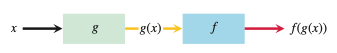

复合函数运算流程

由此流程可知，复合函数的自变量 $x$ 首先在函数 $g$ 的定义域内，$g(x)$ 的值又在函数 $f$ 的定义域内，如此才能得到两者的符合函数 $(f\circ{g})(x)$ 的输出。定义域的演示如下图所示。

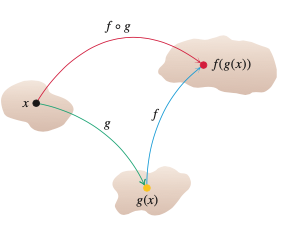

定义域关系

一般情况，$f\circ{g}$ 和 $g\circ{f}$ 是两个不同的函数。

### 平移

对一个已知的函数，通过加、减一个常数，就可以得到一个新的函数；或者让自变量加减一个常数，也可以得到新的函数。新函数相对于原来的函数，会在水平、竖直方向上发生平移。

- 垂直平移：$y=f(x)+k$ 
  - $k\gt{0}$ ，则向着 $y$ 轴正方向平移 $k$ 个单位
  - $k\lt{0}$ ，则向着 $y$ 轴负方向平移 $|k|$ 个单位
- 水平平移：$y=f(x+h)$
  - $h\gt{0}$ ，则向着 $x$ 轴负方向平移 $h$ 个单位
  - $h\lt{0}$ ，则向着 $x$ 轴正方向平移 $|h|$ 个单位

如下图所示，是基于函数 $f(x)=x^2$ ，按照上述原则进行平移，分别得到相应的函数。

- 向着 $y$ 轴正方向平移 $1$ 个单位：$y=x^2+1$
- 向着 $y$ 轴负方向平移 $2$ 个单位：$y=x^2-2$
- 向着 $x$ 轴负方向平移 $3$ 个单位：$y=(x+3)^2$

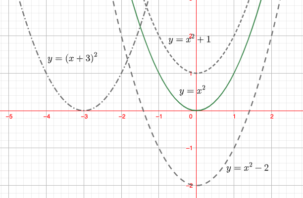

函数平移

### 压缩和拉伸

如果对函数或者自变量乘以一个常数，能够实现函数图像的压缩和拉伸效果。

设常数 $c\gt{1}$ ，对于函数 $f(x)$ ：

- $y=cf(x)$ ，将函数 $f$ 的图像沿 $y$ 轴拉伸为 $c$ 倍
- $y=\frac{1}{c}f(x)$ ，将函数 $f$ 的图像沿 $y$ 轴压缩为 $\frac{1}{c}$ 倍
- $y=f(cx)$ ，将函数 $f$ 的图像沿 $x$ 轴压缩为 $\frac{1}{c}$ 倍
- $y=f(x/c)$ ，将函数 $f$ 的图像沿 $x$ 轴拉伸为 $c$ 倍

如果 $c=-1$ ，则：

- $y=-f(x)$ ，相对 $x$ 轴镜像变换
- $y=f(-x)$ ，相对 $y$ 轴镜像变换

如下图所示，演示了图像压缩、拉伸和镜像变换。

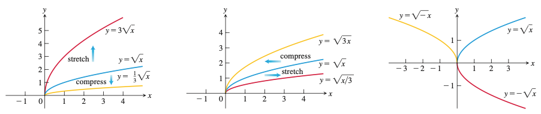

函数图像变换

## 三角函数

### 角和弧度

设 $s$ 为弧长，$r$ 为半径，$\theta$ 是以弧度为单位的角，则：$s=r\theta$

弧度和角度之间的换算关系：$\pi=180^{\circ}$ 。

下表对应着换算关系。

| 角度 | -180     | -135                | -90                | -45                | 0    | 30                | 45                | 60                | 90                | 120                | 135                | 150                | 180     | 270                | 360      |
| ---- | -------- | ------------------- | ------------------ | ------------------ | ---- | ----------------- | ----------------- | ----------------- | ----------------- | ------------------ | ------------------ | ------------------ | ------- | ------------------ | -------- |
| 弧度 | $-\pi$ | $-\frac{3\pi}{3}$ | $-\frac{\pi}{2}$ | $-\frac{\pi}{4}$ | 0    | $\frac{\pi}{6}$ | $\frac{\pi}{4}$ | $\frac{\pi}{3}$ | $\frac{\pi}{2}$ | $\frac{2\pi}{3}$ | $\frac{3\pi}{4}$ | $\frac{5\pi}{6}$ | $\pi$ | $\frac{3\pi}{2}$ | $2\pi$ |

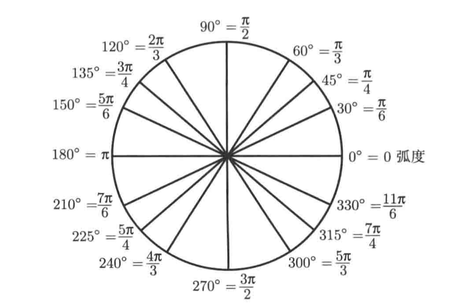

一般公式：

$$
\text{radian}=\frac{\pi}{180}\times angle
$$

例如 $\frac{5\pi}{12}$ 对应的角度是：$\frac{180}{\pi}\times\frac{5\pi}{12}=75^\circ$ 。

### 常用三角函数

参考下图，列出常用的三角函数：

- $\sin\theta=\frac{y}{r}, \quad\csc\theta=\frac{r}{y}$
- $\cos\theta=\frac{x}{r}, \quad \sec\theta=\frac{r}{x}$
- $\tan\theta=\frac{y}{x},\quad \cot\theta=\frac{x}{y}$

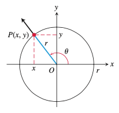

三角函数之间的关系：

- $\tan\theta=\frac{\sin\theta}{\cos\theta},\quad \cot\theta=\frac{1}{\tan\theta}$
- $\sec\theta=\frac{1}{\cos\theta},\quad \csc\theta=\frac{1}{\sin\theta}$

$\sin(x),\tan(x),\cot(x),\csc(x)$ 都是 $x$ 的奇函数；$\cos(x),\sec(x)$ 都是 $x$ 的偶函数。

### 三角函数的周期

**定义** 设函数 $f(x)$ ，有正数 $p$ ，使得 $f(x+p)=f(x)$ 对任何 $x$ 成立，则其中最小的数值 $p$ 即为函数 $f(x)$ 的**周期**（period）。

对于三角函数而言，有的周期是 $\pi$ ，有的周期是 $2\pi$ ，如下图所示，常用的三角函数图像，从中可以观察到其周期。

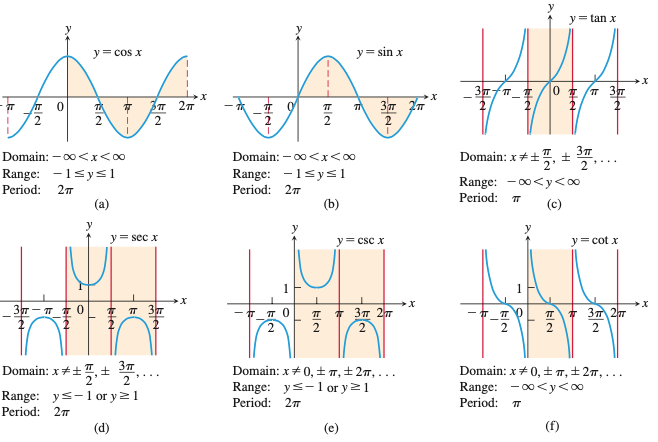

常用三角函数图像和周期

- 周期为 $\pi$ ：
  - $\tan(x+\pi)=\tan{x}$
  - $\cot(x+\pi)=\cot{x}$
- 周期为 $2\pi$ ：
  - $\sin(x+2\pi)=\sin{x}$
  - $\cos(x+2\pi)=\cos{x}$
  - $\sec(x+2\pi)=\sec{x}$
  - $\csc(x+2\pi)=\csc{x}$
- 偶函数：
  - $\cos(-x)=\cos{x}$
  - $\sec(-x)=\sec{x}$
- 奇函数：
  - $\sin(-x)=-\sin{x}$
  - $\tan(-x)=-\tan{x}$
  - $\csc(-x)=-\csc{x}$
  - $\cot(-x)=-\cot{x}$

### 重要关系式和定理

- $\cos^2\theta + \sin^2\theta=1$

  - $1+\tan^2\theta=\sec^2\theta$
  - $1+\cot^2\theta=\csc^2\theta$

- 加法公式：

  - $\cos(A+B)=\cos{A}\cos{B}-\sin{A}sin{B}$
  - $\sin(A+B)=\sin{A}\cos{B}+\cos{A}\sin{B}$

- 倍角公式：

  - $\cos(2\theta)=\cos^2\theta-\sin^2\theta$
  - $\sin(2\theta)=2\sin\theta\cos\theta$

- 半角公式：

  - $\cos^2\theta=\frac{1+\cos(2\theta)}{2}$
  - $\sin^2\theta=\frac{1-\cos(2\theta)}{2}$

- 余弦定理：

  - $c^2=a^2+b^2-2ab\cos\theta$ ，其中 $a,b,c$ 为三角形三条边，$\theta$ 为边 $c$ 的对角。

- 特殊不等式：

  - $-|\theta|\le\sin\theta\le|\theta|$

  - $-|\theta|\le1-\cos\theta\le|\theta|$

    证明：如下图所示，$P$ 是单位圆上的一点，$PO$ 与 $x$ 轴之间的夹角为 $\theta$ 。

    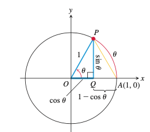

    
单位圆

    在直角三角形 $APQ$ 中，

    $QP=|\sin\theta|,\quad AQ=1-\cos\theta$

    因为单位圆的半径是 $1$​ ，即弧长 $\overset{\frown}{AP}=\theta$​ ，显然 $\overset{\frown}{AP}$​ 大于线段 $AP$​ 的长度，即 $AP\lt|\theta|$​ 。由勾股定理可得：

    $\sin^2\theta+(1-\cos\theta)^2=(AP)^2\le\theta^2$

    上式等号左侧两项都大于 $0$ ，所以可得：

    $\sin^2\theta\le\theta^2, \quad{and}\quad (1-\cos\theta)^2\le\theta^2$

    $|\sin\theta|\le|\theta|, \quad{and}\quad |1-\cos\theta|\le|\theta|$

    故：

    $$
    -|\theta|\le\sin\theta\le|\theta| \quad{and}\quad -|\theta|\le1-\cos\theta\le|\theta|
    $$
    
  
- 互余关系

  在三角函数的名称中，比如 $\cos,\cot$ 中的 “co” 是英文单词 “complementary” 的字头，这个单词的意思是**互余** 。如果两个角互余，则它们的和是 $\frac{\pi}{2}$ （或 $90^\circ$ ）。

  $$
  三角函数(x)=co-三角函数\left(\frac{\pi}{2}-x\right)
  $$
  
  
  如：$\sin(x)=\cos\left(\frac{\pi}{2}-x\right), \tan(x)=\cot\left(\frac{\pi}{2}-x\right),\sec(x)=\csc\left(\frac{\pi}{2}-x\right)$

### 三角函数图像变换

根据前述函数图像变换知识，可以总结如下：

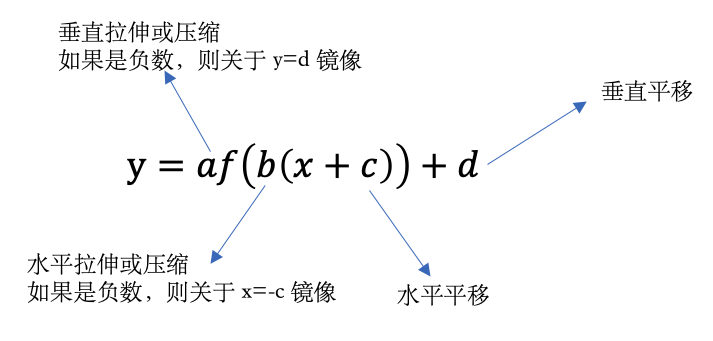

以正弦为例，如下函数可以通过对 $y=\sin(x)$ 的变换得到：

$$
f(x)=A\sin\left(\frac{2\pi}{B}(x-C)\right)+D
$$

其中 $|A|$ 为振幅， $|B|$ 为周期，$C$ 为水平偏移， $D$ 为垂直偏移，最终图像为：

  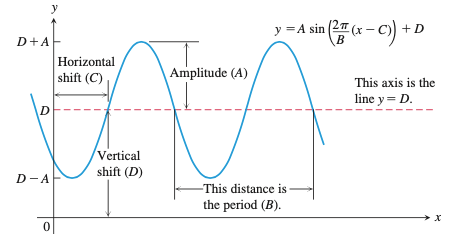

## 用Python实现计算

  在Pyhton语言中，内置函数能够实现初等代数中的常见函数（具体用法，请参阅《Python大学实用教程》或《跟老齐学Python：轻松入门》，电子工业出版社出版）。

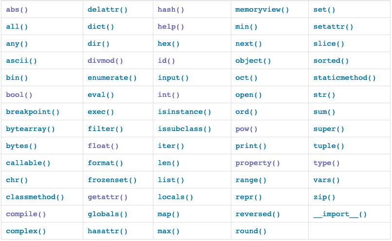

Python内置函数

此外，如果进行复杂的函数运算，还可以使用scipy库提供的各种函数，比如统计学或者线性代数中的函数，在《机器学习数学基础》中对此有较为详细的说明。

  

## 参考文献

1. Thomas Calculus(fourteenth edition).  George B. Thomas, Joel R. Hass, Christopher Heil, Maurice D. Weir .  Pearson Education, Inc.  
2. 普林斯顿微积分读本. 阿德里安·班纳著，杨爽等译. 北京：人民邮电出版社，2016.10

