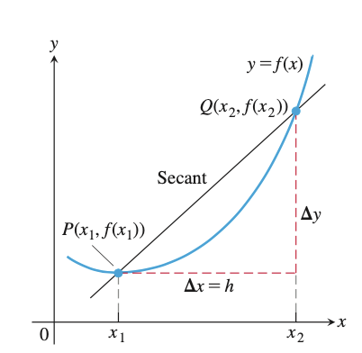
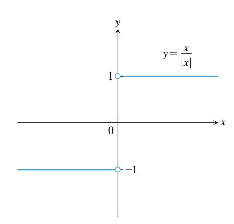
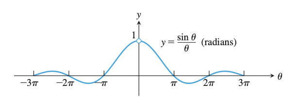
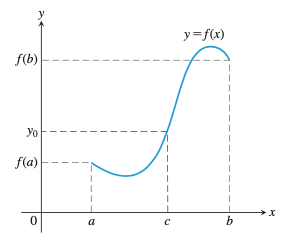

# 02 极限和连续

> 在一切理論成果中，未必再有什麼像 17 世紀後半葉微積分的發明那樣被看作人類精神的最高勝利了。只有微積分學才 能使自然科學有可能用數學來不僅僅表 明狀態，並且也能表明過程。
>
> ——恩格斯

## 变化率和曲线的切线

伟大的物理学家伽利略（Galileo Galilei）发现了自由落体运动的规律——传说他在比萨斜塔上做了“两个铁球同时落地”的实验。这个故事是他的学生记载的，其真实性，还有争议。但是，不论他是否真的做过那个实验，都不影响伽利略首先正确地研究出自由落体运动规律这个事实。

伽利略

如果用现代物理学的方式表示，自由落体运动的规律是：

$$
y = \frac{1}{2}gt^2
$$

其中 $g$ 表示重力加速度，$t$ 表示物体下落时间。如果 $g=9.8m/s^2$ ，则上面的表达式可以写成：

$$
y=4.9t^2
$$

假设某时刻 $t_0$ ，下一个时刻为 $t_0+h$ ，要考察在时间间隔 $\Delta{t}=(t_0+h)-t_0=h$ 内物体运动的平均速度，即：

$$
\frac{\Delta{y}}{\Delta{t}}=\frac{4.9(t_0+h)^2-4.9t_0^2}{h}
$$

- 如果 $t_0=1$ ，则上式为：
  $$
  \frac{\Delta{y}}{\Delta{t}}=\frac{4.9(1+h)^2-4.9(1)^2}{h}=9.8 + 4.9h
  $$
  

当 $h$ 很小——你说多小，比你说的还小，或者说 $h\to{0}$ 时，$\frac{\Delta{y}}{\Delta{t}}\to{9.8}$ 。

- 如果 $t_0=2$ ，则：
  $$
  \frac{\Delta{y}}{\Delta{t}}=\frac{4.9(2+h)^2-4.9(2)^2}{h}=19.6+4.9h
  $$
  

同样，当 $h\to{0}$ 时，$\frac{\Delta{y}}{\Delta{t}}\to{19.6}$

如果将上面的计算抽象为数学问题，即为：

> 对于函数 $y=f(x)$ ，$x$ 在区间 $[x_1, x_2]$ 内：
>
> $$
> \frac{\Delta{y}}{\Delta{x}} = \frac{f(x_2)-f(x_1)}{x_2-x_1}=\frac{f(x_1+h)-f(x_1)}{h}
> $$
> 
>
> 其中，$h\ne{0}$ ，且 $x_2=x_1+h$ 。称 $\frac{\Delta{y}}{\Delta{x}}$ 为 $y=f(x)$ 在区间 $[x_1, x_2]$ 上的**变化率**。

如下图所示，区间 $[x_1, x_2]$ 对应的坐标系中的两个点 $P,Q$ ，过这两个点的直线斜率即为 $\frac{\Delta{y}}{\Delta{x}}$ 。这条直线是 $y=f(x)$ 曲线的**割线**。根据图示，可以想象，如果 $h$ 越来越小，那么 $P, Q$ 两点就越来越靠近，直到 $h\to{0}$ ，则 $Q$ 点会无限接近于 $P$ 点。此时，割线就逐渐演变为**切线**。

割线

## 数列的极限

**数列极限定义**

>  若 $n$ 越来越大，以至于无穷大时，$a_n$ 便跟着越来越靠近 $L$ 。那么我们说，当 $x\rightarrow\infty$ 时，$a_n\rightarrow L$ 。若以极限式的写法，即为：
>
>  $$
>  \lim_{x\rightarrow\infty}a_n=L
>  $$
>  

当数列的趋势是越来越趋近一个定值时，我们说它的极限存在，则称这个数列是**收敛**的；否则，没有趋近一个定值，则极限不存在，则该数列是**发散**的。所谓发散，就是不收敛，有两种情况：

- 例如：$a_n=(-1)^n$ ，数列的取值在 $1$ 和 $-1$ 两个数上更换，并不趋近一个定值；
- 趋近无穷大，即：$\lim\limits_{x\to\infty}a_n=\infty$

**收敛极限的基本性质**

若 $\lim\limits_{n\to\infty}a_n=\alpha,\lim\limits_{n\to\infty}b_n=\beta$ ，及 $c\in\mathbb{R}$ ，则：

- 相加：$\lim\limits_{n\to\infty}(a_n\pm b_n)=\lim\limits_{n\to\infty}a_n\pm\lim\limits_{n\to\infty}b_n=\alpha\pm\beta$
- 常倍数：$\lim\limits_{n\to\infty}c\cdot a_n=c\cdot\lim\limits_{n\to\infty}a_n=c\cdot\alpha$
- 相乘：$\lim\limits_{n\to\infty}(a_n\cdot b_n)=\lim\limits_{n\to\infty}a_n\cdot\lim\limits_{n\to\infty}b_n=\alpha\cdot\beta$
- 相除：$\lim\limits_{n\to\infty}\frac{a_n}{b_n}=\frac{\lim\limits_{n\to\infty}a_n}{\lim\limits_{n\to\infty}b_n}=\frac{\alpha}{\beta},(\beta\ne0)$

**夹逼（挤）定理**

> 若数列 $<a_n>,<b_n>,<c_n>$ 在 $n\ge k$ （$k$ 为某正整数）时，恒满足：
>
> $$
> a_n\le b_n\le c_n
> $$
> 且
>
> $$
> \lim_{n\to\infty}a_n=\lim_{n\to\infty}c_n=L
> $$
> 则有：
>
> $$
> \lim_{n\to\infty}b_n=L
> $$

举例：

- 求极限 $\lim\limits_{n\to\infty}\frac{n!}{n^n}$

  解：

  $$
  \frac{n!}{n^n}=\frac{1}{n}\times\frac{2}{n}\times\frac{3}{n}\times\cdots\times\frac{n-1}{n}\times\frac{n}{n}
  $$
  

  显然，展开式的每一项都小于 1，大于 0，故：

  $$
  0\le\frac{1}{n}\times\frac{2}{n}\times\frac{3}{n}\times\cdots\times\frac{n-1}{n}\times\frac{n}{n}\le\frac{1}{n}
  $$
  

  由于 $\lim\limits_{n\to\infty}0=0=\lim\limits_{n\to\infty}\frac{1}{n}$

  由“夹逼定理”得：$\lim\limits_{n\to\infty}\frac{n!}{n^n}=0$

- 求极限 $\lim\limits_{n\to\infty}\frac{\sin(n)}{n}$

  解：

  $$
  \begin{aligned}
  &-1\le\sin(n)\le1\Rightarrow-\frac{1}{n}\le\frac{\sin(n)}{n}\le\frac{1}{n}
  \\&\text{lim}_{n\to\infty}-\frac{1}{n}=0=\text{lim}_{n\to\infty}\frac{1}{n}
  \\&\text{lim}_{n\to\infty}\frac{\sin(n)}{n}=0
  \end{aligned}
  $$
  
- 求极限 $\lim\limits_{n\to\infty}\left(\frac{1}{\sqrt{n^2+1}}+\frac{1}{\sqrt{n^2+2}}+\cdots+\frac{1}{\sqrt{n^2+n}}\right)$

  解：

  $$
  \frac{1}{\sqrt{n^2+n}}+\cdots+\frac{1}{\sqrt{n^2+n}}\le\frac{1}{\sqrt{n^2+1}}+\cdots+\frac{1}{\sqrt{n^2+n}}\le\frac{1}{\sqrt{n^2+1}}+\cdots+\frac{1}{\sqrt{n^2+1}}
  $$
  
  
  因为：
  
  $$
  \begin{aligned}
  &\text{lim}_{n\to\infty}\left(\frac{1}{\sqrt{n^2+n}}+\cdots+\frac{1}{\sqrt{n^2+n}}\right)=\text{lim}_{n\to\infty}\frac{n}{\sqrt{n^2+n}}=1
  \\&\text{lim}_{n\to\infty}\left(\frac{1}{\sqrt{n^2+1}}+\cdots+\frac{1}{\sqrt{n^2+1}}\right)=\text{lim}_{n\to\infty}\frac{n}{\sqrt{n^2+1}}=1
  \end{aligned}
  $$
  
  
  故：
  
  $$
  \text{lim}_{n\to\infty}\left(\frac{1}{\sqrt{n^2+1}}+\frac{1}{\sqrt{n^2+2}}+\cdots+\frac{1}{\sqrt{n^2+n}}\right)=1
  $$
  
  
  注意：无穷多个无穷小项之和，不一定就是无穷小。
  
  

## 函数的极限

极限的符号为 $\lim$ ，它出自拉丁文limit（界限）的前三个字母。德国人浏伊连（S. L'Huilier）在1786年出版的书中，首次使用这个符号。不过，当时把“ $x$ 趋于 $a$ ”记作了“$x=a$”，直到20世纪人们才逐渐用“ $\to$ ”替代“ $=$ ”。英国近代数学家[哈代](https://zh.wikipedia.org/wiki/戈弗雷·哈罗德·哈代)是第一个使用现代极限符号的人。

$$
\lim_{x\to{c}}f(x)=L
$$

### 定理1：极限运算法则

设 $L,M, c, k$ 为实数，并且函数 $f(x)$ 和 $g(x)$ 的极限分为别：

$$
\lim_{x\to{c}}f(x) = L,\quad \lim_{x\to{c}}g(x)=M
$$

则：

- 加法：$\lim\limits_{x\to{c}}(f(x)+g(x))=L+M$
- 减法：$\lim\limits_{x\to{c}}(f(x)-g(x))=L-M$
- 数量乘法：$\lim\limits_{x\to{c}}(k\cdot{f(x)})=k\cdot{L}$
- 乘法：$\lim\limits_{x\to{c}}(f(x)\cdot{g(x)})=L\cdot{M}$
- 商：$\lim\limits_{x\to{c}}\frac{f(x)}{g(x)}=\frac{L}{M},M\ne{0}$
- 指数：$\lim\limits_{x\to{c}}[f(x)]^n=L^n, n是正整数$
- 开方：$\lim\limits_{x\to{c}}\sqrt[n]{f(x)}=\sqrt[n]{L}=L^{1/n}$

### 定理2：多项式的极限

设多项式 $P(x)=a_nx^n+a_{n-1}x^{n-1}+\cdots+a_0$ ，则其极限：

$$
\lim_{x\to{c}}P(x)=P(c)=a_nc^n+a_{n-1}c^{n-1}+\cdots+a_0
$$

### 定理3：多项式商的极限

设 $P(x)$ 和 $Q(x)$ 分别是两个多项式，且 $Q(c)\ne{0}$ ，则：

$$
\lim_{x\to{c}}\frac{P(x)}{Q(x)}=\frac{P(c)}{Q(c)}
$$

### 定理4：三明治定理

也称为**夹逼定理**。是一种计算极限的方法。

设 $x$ 的区间内，$g(x)\le{f(x)}\le{h(x)}$ ，并且常数 $c$ 也在此区间内，若：

$$
\lim_{x\to{c}}g(x)=\lim_{x\to{c}}h(x)=L
$$

则：$\lim\limits_{x\to{c}}f(x)=L$

**例**：（1）$\lim\limits_{x\to0}\sin\theta=0$ （2）$\lim\limits_{x\to0}\cos\theta=1$

**证明**

（1）在上一节得到了结论：$-|\theta|\le\sin\theta\le|\theta|$ ，因为 $\lim\limits_{\theta\to0}(-|\theta|)=\lim\limits_{\theta\to0}(|\theta|)=0$ ，根据三明治定理，所以：

$$
\lim_{\theta\to0}\sin\theta=0
$$

（2）因为 $0\le{1-\cos\theta}\le|\theta|$ ，所以 $\lim\limits_{\theta\to0}(1-\cos\theta)=0$ ，则：

$$
\begin{aligned}
&\lim_{\theta\to0}(1-(1-\cos\theta))=1-\lim_{\theta\to0}(1-\cos\theta)=1-0
\\&\lim_{\theta\to0}\cos\theta=1
\end{aligned}
$$

### 极限定义

设函数 $f(x)$ ，对于任何数 $\epsilon\gt{0}$ ，存在一个数 $\delta\gt{0}$ ，当 $0\lt|x-c|\lt\delta$ 时，下式成立：

$$
|f(x)-L|\lt\epsilon
$$

则：$\lim\limits_{x\to{c}}f(x)=L$ ，即：函数 $f(x)$ 在 $x$ 趋近于 $c$ 时的极限是 $L$ 。

#### 例题 

已知 $\lim\limits_{x\to{c}}f(x)=L, \lim\limits_{x\to{c}}g(x)=M$ ，求证 $\lim\limits_{x\to{c}}(f(x)+g(x))=L+M$

**证明**

因为：

$$
\begin{split}|f(x)+g(x)-(L+M)| &= |(f(x)-L)+(g(x)+M)|\\&\le|f(x)-L|+|g(x)-M| \quad(根据三角不等式\quad |a+b|\le|a|+|b|)\end{split}
$$

又因为 $\lim\limits_{x\to{c}}f(x)=L$ ，则存在 $\delta_1\gt{0}$ ，对 $\epsilon\gt{0}$ ，当 $0\lt|x-c|\lt\delta_1$ 时，下式成立：

$$
|f(x)-L|\lt\frac{\epsilon}{2}
$$

同理，存在存在 $\delta_2\gt{0}$ ，对 $\epsilon\gt{0}$ ，当 $0\lt|x-c|\lt\delta_2$ 时，下式成立：

$$
|g(x)-M|\lt\frac{\epsilon}{2}
$$

令 $\delta=\min\{\delta_1,\delta_2\}$ ，如果 $0\lt|x-c|\lt\delta$ ，则 $|x-c|\lt\delta_1$ ，故 $|f(x)-L|\lt\frac{\epsilon}{2}$ 成立；同样，在此条件下，也有 $|x-c|\lt\delta_2$ ，故 $|g(x)-M|\lt\frac{\epsilon}{2}$ 成立。

所以：$|f(x)+g(x)-(L+M)|\lt\frac{\epsilon}{2}+\frac{\epsilon}{2}=\epsilon$

即：$\lim\limits_{x\to{c}}(f(x)+g(x))=L+M$ 成立。

证毕。

## 左极限和右极限

设函数 $f$ ，有 $x\to{c}$ 时其极限为 $L$ 。通常，不论是 $x$ 从 $c$ 的左侧，还是右侧趋近于 $c$ ，都能得到 $f(x)$ 的值 $L$ 。我们称这种极限为**双侧极限**。

在有的情况下，从不同方向趋近 $c$ 所得极限不同，这样的称为单侧极限，如果从左边趋近，即为**左极限**；从右边趋近，即为**右极限**。例如下图所示函数 $f(x)=\frac{x}{|x|}$ ，如果 $x$ 从 $0$ 的右侧趋近于 $0$ （记作：$x\to{0}^+$ ），则极限为 $1$ ；从左侧趋近于 $0$ （记作：$x\to{0}^-$ ），则极限为 $-1$ 。

左极限和右极限的不同值

更一般表示：

- 左极限：$\lim\limits_{x\to{c}^-}f(x)=M$
- 右极限：$\lim\limits_{x\to{c}^+}f(x)=L$
- 双侧极限：$\lim\limits_{x\to{c}}f(x)=L\quad\Leftrightarrow\quad \lim\limits_{x\to{c}^-}f(x)=L \quad{and}\quad \lim\limits_{x\to{c}^+}f(x)=L$

### 证明：$(\sin\theta)/\theta$ 的极限

函数 $f(\theta)=\frac{\sin\theta}{\theta},(\theta\ne{0})$ 的图像如下图所示：

θ从双侧趋近0，函数极限都是1

**求证**  当 $\theta\to{0}$ 时，$\lim\limits_{\theta\to{0}}\frac{\sin\theta}{\theta} =1$

其中 $\theta$ 以弧度为单位。

**证明**

首先证明右极限是 $1$ 。如下图所示，设 $\theta\lt\frac{\pi}{2}$ ，$OA=1$  ，易知：

$\Delta{OAP}的面积\lt扇形OAP的面积\lt\Delta{OAT}的面积$

面积与边、角的关系

又因为：

$$
\begin{split}\Delta{OAP}的面积=&S_{\Delta{OAP}}=\frac{1}{2}|OA||PQ|=\frac{1}{2}\sin\theta\\扇形OAP的面积=&S_{\overset{\frown}{OAP}}=\frac{1}{2}r^2\theta=\frac{\theta}{2}\\\Delta{OAT}的面积=&S_{\Delta{OAT}}=\frac{1}{2}|OA||TA|=\frac{1}{2}\tan\theta\end{split}
$$

所以：

$$
\frac{1}{2}\sin\theta\lt\frac{1}{2}\theta\lt\frac{1}{2}\tan\theta
$$

因为 $0\lt\theta\frac{\pi}{2}$ ，所以 $\sin\theta\gt{0}$ ，上式各项除以 $\frac{1}{2}\sin\theta$ ，得：

$$
1\lt\frac{\theta}{\sin\theta}\lt\frac{1}{\cos\theta}
$$

即：

$$
1\gt\frac{\sin\theta}{\theta}\gt\cos\theta
$$

因为 $\lim\limits_{\theta\to{0}}\cos\theta=1$ ，所以 $\lim\limits_{\theta\to{0}^+}\cos\theta=1$ ，结合上式，根据三明治定理，可得：

$$
\lim_{\theta\to{0}^+}\frac{\sin\theta}{\theta}=1
$$

再证明左极限也是 $1$ 。

因为 $\sin\theta$ 和 $\theta$ 都是奇函数，所以 $f(\theta)=\frac{\sin\theta}{\theta}$ 是偶函数，则它的图像关于 $y$ 轴对称。于是其左极限与右极限对称，故：

$$
\lim_{\theta\to{0}^-}\frac{\sin\theta}{\theta}=1=\lim_{\theta\to{0}^+}\frac{\sin\theta}{\theta}
$$

所以：$\lim\limits_{\theta\to{0}}\frac{\sin\theta}{\theta}=1$ 。

证毕。

## 连续

**定义**  设 $c$ 为实数，并且在函数 $f$ 定义域内，

- 如果 $\lim\limits_{x\to{c}}f(x)=f(c)$ ，则函数 $f$ 在 $c$ 连续；
- 如果 $\lim\limits_{x\to{c}^+}f(x)=f(c)$ ，则函数 $f$ 在 $c$ 右连续；
- 如果 $\lim\limits_{x\to{c}^-}f(x)=f(c)$ ，则函数 $f$ 在 $c$ 左连续。

### 连续性检验

函数 $f(x)$ 在 $x=c$ 点连续，当且仅当满足如下三个条件：

1. $f(c)$ 存在（ $c$ 在 $f$ 的定义域内）
2. $\lim\limits_{x\to{c}}f(x)$ 存在（当 $x\to{c}$ 时 $f$ 有极限）
3. $\lim\limits_{x\to{c}}f(x)=f(c)$ （极限等于函数值 $f(c)$ ）

### 连续函数

所谓连续函数，即在函数定义域上每个点都连续的函数。

如果函数 $f$ 和 $g$ 在 $x=c$ 上连续，它们在此遵循如下运算规则：

- 加法：$f+g$
- 减法：$f-g$
- 数乘：$k\cdot{f}$ ，$k$ 是任意一个数
- 乘积：$f\cdot{g}$
- 相除：$\frac{f}{g},g\ne{0}$
- 幂运算：$f^n$ ，$n$ 是正整数
- 开方：$\sqrt[n]{f}$

如果 $f$ 在 $c$ 连续，且 $g$ 在 $f(c)$ 连续，则复合函数 $g\circ{f}$ 在 $c$ 也连续。

如果 $\lim\limits_{x\to{c}}f(x)=b$ ，且 $g$ 在 $b$ 点连续，则 $\lim\limits_{x\to{c}}g(f(x))=g(b)$

如果函数 $f$ 在闭区间 $[a, b]$ 连续，又若 $y_0$ 在 $f(a)$ 和 $f(b)$ 之间，则存在 $[a, b]$ 内的数 $c$ ，使 $y_0=f(c)$ 成立（如下图所示）。

### 中值定理

**定理**  如果函数 $f(x)$ 在闭区间 $[a,b]$ 上连续，并且 $f(a)\ne{f(b)}$ ，那么，对于在 $f(a)$ 与 $f(b)$ 之间的任意实数 $\mu$ ，存在使得

$$
f(c)=\mu,\quad a\lt{c}\lt{b}
$$

成立的实数 $c$ 。

**证明**  因为 $f(a)\lt{f(b)}$ 或 $f(a)\gt{f(b)}$ ，所以下面仅就 $f(a)\lt{f(b)}$ 情况进行证明。

此时：$f(a)\lt\mu\lt{f(b)}$ 。

设 $S$ 是满足 $f(x)\lt\mu, a\le{x}\lt{b}$ 的实数 $x$ 的全体集合。

$$
\because{f(a)}\lt\mu,\quad\therefore a\in S
$$

设 $S$ 的上确界为 $c$ ，如果 $c\notin S$ ，则存在收敛于 $c$ 的数列 $\{x_n\}, x_n\in S$ ，因此 $f(c)=\lim\limits_{x\to\infty}f(x_n)\le\mu$ ，从而 $c\in S$ 且 $f(c)\le\mu$ 。这里若假设 $f(c)\lt\mu$ ，因为 $f(x)$ 是连续函数，所以满足条件 $|x-c|\lt\delta, f(x)\lt\mu$ 的正实数 $\delta$ 一定存在。因此，如果 $c\lt x\lt c+\delta$ ，则 $x\in S$ 。这与 $c$ 是 $S$ 的上确界矛盾。

所以 $f(c)=\mu$ 。

证毕。

## 趋近无穷的极限

无穷 $\infty$ 不是一个实数。函数定义域或值域中的值超过有限范围的时候，我们会用 $\infty$ 描述该函数的变化。

**定义** 

1. 对任意数 $\epsilon\gt{0}$ ，有相应的数 $M$ ，使得函数 $f$ 对于定义域内的 $x$ ，当 $x\gt{M}$ 时，有：$|f(x)-L|\lt\epsilon$

   则 $x$ 趋近无穷时 $f(x)$ 的极限是 $L$ ，记作：$\lim\limits_{x\to\infty}f(x)=L$

2. 对任意数 $\epsilon\gt{0}$ ，有相应的数 $N$ ，使得函数 $f$ 对于定义域内的 $x$ ，当 $x\gt{N}$ 时，有：$|f(x)-L|\lt\epsilon$

   则 $x$ 趋近负无穷时 $f(x)$ 的极限是 $L$ ，记作：$\lim\limits_{x\to-\infty}f(x)=L$

## 函数的极值

微分学$^{[3]}$的一个重要应用，就是求极值。

**费马极值定理**

> $a$ 为函数 $f(x)$ 定义域中的一点，若函数 $f(x)$ 在 $x=a$ 处取得极值，并且在 $x=a$ 处可导，则必有 $f'(a)=0$

## 参考文献

1. Thomas Calculus(fourteenth edition).  George B. Thomas, Joel R. Hass, Christopher Heil, Maurice D. Weir .  Pearson Education, Inc.  
2. 普林斯顿微积分读本. 阿德里安·班纳著，杨爽等译. 北京：人民邮电出版社，2016.10
3. [导数](./b01-03.md)