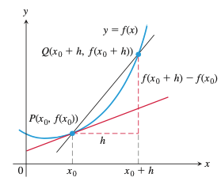
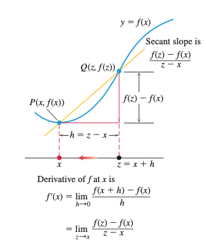

# 导数

## 导数 VS 导函数 VS 微分

導數是一個數值，意義是切線斜率;導函數是一個函數，意義上來說可稱之「切線斜率函數」。如果我們想求函數 $$y=x^2+2$$ 在 $$x=2$$ 處的切線斜率，那就是求函數 $$y=x^2+2$$ 在 $$x = 2$$ 處的導數。我們可以先求出它的導函數 $$y = 2x$$ ，再代入 $$x = 2$$ ，得到 $$4$$ ，便得到我們要的導數。不過，有時還是會將「導函數」 簡稱為「導數」，或許這種簡稱方式是害初學者搞混的原因吧!

至於求出導函數這個動作，則叫求導(differientiate )，我們也常稱之為「微分」。不過，「微分」這個詞，在中文口語中實在有點用途太廣:求導這個動作，我們可以說是微分，將 $$y = x^2 + 2$$ 微分後得到導函數 $$y = 2x$$ ；我們也會將導函數說是微分，$$y = x^2 + 2$$ 的微分是 $$y = 2x$$ ；還會把導數說是微分，$$y = x^2 + 2$$ 在 $$x = 2$$ 處的微分是 $$4$$ ；甚至，還有另一個概念，英文叫 differential，中文也叫微分！

由於中文不分詞性，當你說「微分」的時候，我們須藉由上下文，來得知你意指為何。

## 切线和某点的导数

**定义**  如下图所示，曲线 $$y=f(x)$$ 过点 $$P(x_0, f(x_0))$$ 的切线的斜率是：

$$\lim_{h\to{0}}\frac{f(x_0+h)-f(x_0)}{h}$$

**定义**  函数 $$f$$ 在 $$x_0$$ 的导数，记作：$$f'(x_0)$$

$$f'(x_0)=\lim_{h\to{0}}\frac{f(x_0+h)-f(x_0)}{h}$$

导数的含义不仅仅一种，在上述定义中，它表示曲线上某点的切线斜率。对 $$\lim_{h\to{0}}\frac{f(x_0+h)-f(x_0)}{h}$$ 可以有不同的理解：

- $$y=f(x)$$ 的图像上，在 $$x=x_0$$ 点的切线斜率
- $$f(x)$$ 在 $$x=x_0$$ 附近的变化率
- 导数 $$f'(x_0)$$

## 函数的导数

### 导数定义

**定义**    $$f'(x)=\lim_{h\to{0}}\frac{f(x+h)-f(x)}{h}$$

此处不再强调针对某点，而是对于函数 $$f$$ 定义域上的任何一点。

对于定义域中的 $$x$$ ，如果存在 $$f'$$ ，则称 $$f$$ 可导或可微。

如下图所示，令 $$z=x+h$$ ，则导数的另外一种定义为： $$f'(x)=\lim_{z\to{x}}\frac{f(z)-f(x)}{z-x}$$

### 切线方程

当 $$y=f(x)$$ 时，也可以用 $$\frac{dy}{dx}$$ 表示 $$f'(x)$$ ，有时也称 $$\frac{dy}{dx}$$ 为**微商**（differentiable quotient）——不是在微信上开店。

令 $$\Delta x=h, \Delta{y}=f(x+\Delta{x})-f(x)$$ ，则：

$$\frac{dy}{dx}=f'(x)=\lim_{\Delta{x}\to0}\frac{\Delta{y}}{\Delta{x}}$$

$$f(x)$$ 在 $$x$$ 点可微时，设：

$$\frac{f(x+h)-f(x)}{h}=f'(x)+\epsilon(h,x)$$

则 $$\epsilon(h,x)$$ 是满足 $$h\ne0$$ 的 $$h$$ 的函数，并且 $$\lim_{h\to0}\epsilon(h,x)=0$$ 。

再定义，当 $$h=0$$ 时，$$\epsilon(0,x)=0$$ 。

于是，对有所 $$h$$ ，下式成立：

$$f(x+h)-f(x)=f'(x)h+\epsilon(h,x)h,\quad \lim_{h\to0}\epsilon(h,x)=0$$

若 $$y=f(x)$$ ，则：

$$\Delta{y}=\frac{dy}{dx}\Delta{x}+\epsilon(\Delta{x},x)\Delta{x}$$

**定义**  一般地，若 $$\lim_{x\to0}\alpha(x)=\alpha(0)=0$$ ，则称函数 $$\alpha(x)$$ 为**无穷小量**。

当 $$\epsilon(x), \alpha(x)$$ 是无穷小量时，无穷小量 $$\epsilon(x)\alpha(x)$$ 用符号 $$o(\alpha(x))$$ 表示，即小写字母 $$o$$ 来代表 $$\epsilon(x)$$ 。

于是：

$$\Delta{y}=\frac{dy}{dx}\Delta{x}+o(\Delta{x})$$

$$f(x+h)-f(x)=f'(x)h+o(h)$$

如果用 $$x$$ 替换 $$x+h$$ ，用 $$a$$ 替换 $$x$$ ，则上式改写为：

$$f(x) = f(a)+f'(a)(x-a)+o(x-a)$$

由此得到在 $$a$$ 点的函数 $$f(x)$$ 曲线的**切线方程**：

$$y=f(a) + f'(a)(x-a)$$

### 符号

由于历史原因，导数或者微分系数，有多种符号记法，除了前面使用的 $$f'(x)$$ 和 $$\frac{dy}{dx}$$ 之外，还有 $$y',\dot{y},\frac{d}{dx}f(x),Df(x)$$ 等。

**定理**  如果函数 $$f$$ 在 $$x=c$$ 可微，则 $$f$$ 在 $$x=c$$ 连续。

**证明**  若 $$f$$ 可微，即 $$f'(c)$$ 存在，则 $$\lim_{x\to{c}}f(x)=f(c)$$ ，即：

$$\lim_{h\to{0}}f(c+h)=f(c), h\ne{0}$$

$$\begin{split}f(c+h)&=f(c)+[f(c+h)-f(c)]\\&=f(c)+\frac{f(c+h)-f(c)}{h}\cdot{h}\end{split}$$

$$\begin{split}\lim_{h\to{0}}f(c+h) &= \lim_{h\to0}f(c)+\lim_{h\to0}\frac{f(c+h)-f(c)}{h}\cdot\lim_{h\to0}h\\&=f(c)+f'(c)\cdot0=f(c)\end{split}$$

所以，$$f$$ 在 $$x=c$$ 连续。

证毕。

## 微分法则

1. $$f(x)=c$$ ，$$\frac{df}{dx}=\frac{d}{dx}(c)=0$$

   **证明** $$f'(x)=\lim_{h\to{0}}\frac{f(x+h)-f(x)}{h}=\lim_{h\to0}\frac{c-c}{h}=0$$

2. $$\frac{d}{dx}x^n=nx^{n-1}, n是正整数$$

   **证明**  因为：$$z^n-x^n=(z-x)(z^{n-1}+z^{n-2}x+\cdots+zx^{n-2}+x^{n-1})$$

   则：

   $$\begin{split}f'(x)&=\lim_{z\to{x}}\frac{f(z)-f(x)}{z-x}=\lim_{z\to{x}}\frac{z^n-x^n}{z-x}\\&=\lim_{z\to{x}}(z^{n-1}+z^{n-2}x+\cdots+zx^{n-2}+x^{n-1})\\&=nx^{n-1}\end{split}$$

   将上述结果可以推广到 $$n$$ 为实数

   多项式：$$f(x)=a_0x^n+a_1x^{n-1}+\cdots+a_{n-1}x+a_n$$ 的导数为：

   $$f'(x)=na_0x^{n-1}+(n-1)a_1x^{n-2}+\cdots+a_{n-1}$$

3. 设 $$u$$ 可微，$$c$$ 是常数，则：$$\frac{d}{dx}(cu)=c\frac{du}{dx}$$

   **证明**  

   $$\begin{split}\frac{d}{dx}cu&=\lim_{h\to{0}}\frac{cu(x+h)-cu(x)}{h}\\&=c\lim_{h\to{0}}\frac{u(x+h)-u(x)}{h}\\&=c\frac{du}{dx}\end{split}$$

4. 设 $$u$$ 和 $$v$$ 在 $$x$$ 是可微函数，则 $$u+v$$ 也可微，且 $$\frac{d}{dx}(u+v)=\frac{du}{dx}+\frac{dv}{dx}$$

   **证明**

   $$\begin{split}\frac{d}{dx}[u(x)+v(x)]&=\lim_{h\to0}\frac{[u(x+h)+v(x+h)]-[u(x)+v(x)]}{h}\\&=\lim_{h\to{0}}\left[\frac{u(x+h)-u(x)}{h}+\frac{v(x+h)-v(x)}{h}\right]\\&=\lim_{h\to0}\frac{u(x+h)-u(x)}{h}+\lim_{h\to0}\frac{v(x+h)-v(x)}{h}\\&=\frac{du}{dx}+\frac{dv}{dx}\end{split}$$

   令 $$c_1,c_2$$ 为常数，则线性组合 $$c_1u+c_2v$$ 也可微，且：

   $$\frac{d}{dx}(c_1u+c_2v)=c_1u'+c_2v'$$

5. $$\frac{d}{dx}(uv)=u\frac{dv}{dx}+\frac{du}{dx}v$$

   **证明**  因为：$$\frac{d}{dx}(uv)=\lim_{h\to0}\frac{u(x+h)v(x+h)-u(x)v(x)}{h}$$

   分子先减、后加 $$u(x+h)v(x)$$ ，得：

   $$\begin{split}\frac{d}{dx}(uv)&=\lim_{h\to0}\frac{u(x+h)v(x+h)-u(x+h)v(x)+u(x+h)v(x)-u(x)v(x)}{h}\\&=\lim_{h\to0}\left[u(x+h)\frac{v(x+h)-v(x)}{h}+v(x)\frac{u(x+h)-u(x)}{h}\right]\\&=\lim_{h\to0}u(x+h)\cdot\lim_{h\to0}\frac{v(x+h)-v(x)}{h}+v(x)\cdot\lim_{h\to0}\frac{u(x+h)-u(x)}{h}\end{split}$$

   因为 $$u$$ 在 $$x$$ 连续，所以 $$\lim_{h\to0}u(x+h)=u(x)$$ 。上式即为：

   $$\frac{d}{dx}(uv)=u\frac{dv}{dx}+v\frac{du}{dx}$$

6. $$u,v$$ 可微，且 $$v(x)\ne{0}$$ ，则：$$\frac{d}{dx}\left(\frac{u}{v}\right)=\frac{v\frac{du}{dx}-u\frac{dv}{dx}}{v^2}$$ [1]。如果用函数表示：$$\frac{d}{dx}\left(\frac{f(x)}{g(x)}\right)=\frac{f'(x)g(x)-f(x)g'(x)}{g(x)^2}$$

7. 函数 $$f$$ 在定义域 $$\mathbb{I}$$ 上关于 $$x$$ 可微，$$g$$ 在定义域 $$\mathbb{J}$$ 上关于 $$y$$ 可微，则复合函数 $$g(f(x))$$ 在 $$\mathbb{I}$$ 上关于 $$x$$ 可微，且 $$\frac{d}{dx}g(f(x))=g'(f(x))f'(x)$$ [3] 。

   **证明**  设 $$y=f(x), z=g(y)=g(f(x))$$ ，对应于 $$x,y,z$$ 的增量分别为 $$\Delta{x}, \Delta{y}, \Delta{z}$$ ，则：

   $$\Delta{y}=f'(x)\Delta{x}+o(\Delta{x}), \quad \Delta{z}=g'(y)\Delta{y}+o(\Delta{y})$$

   其中

   $$\begin{split}&o(\Delta{x})=\epsilon_1(\Delta{x})\Delta{x}, \lim_{\Delta{x}\to0}\epsilon_1(\Delta{x})=\epsilon_1(0)=0\\&o(\Delta{y})=\epsilon_2(\Delta{y})\Delta{y}, \lim_{\Delta{y}\to0}\epsilon_2(\Delta{y})=\epsilon_2(0)=0\end{split}$$

   所以：

   $$\begin{split}\Delta{z}&=(g'(y)+\epsilon_2(\Delta{y}))\Delta{y}\\&=(g'(y)+\epsilon_2(\Delta{y}))(f'(x)+\epsilon_1(\Delta{x}))\Delta{x}\\&=\left[(g'(y)+\epsilon_2(\Delta{y}))f'(x)+(g'(y)+\epsilon_2(\Delta{y}))\epsilon_1(\Delta{x})\right]\Delta{x}\\&=g'(y)f'(x)\Delta{x}+[\epsilon_2(\Delta{y})f'(x)+(g'(y)+\epsilon_2(\Delta{y}))\epsilon_1(\Delta{x})]\Delta{x}\end{split}$$

   令 $$\epsilon(\Delta{x})=\epsilon_2(\Delta{y})f'(x)+(g'(y)+\epsilon_2(\Delta{y}))\epsilon_1(\Delta{x})$$ ，则上式变为：

   $$\Delta{z}=g'(y)f'(x)\Delta{x}+\epsilon(\Delta{x})\Delta{x}$$

   当 $$\Delta{x}\to0$$ 时，$$\Delta{y}\to0, \epsilon_1(\Delta{x})\to0$$ ；

   当 $$\Delta{y}\to0$$ 时，$$\epsilon_2(\Delta{y})\to0$$ 。从而 $$\lim_{\Delta{x}\to0}\epsilon(\Delta{x})=0$$ ，所以：

   $$\lim_{\Delta{x}\to0}\frac{\Delta{z}}{\Delta{x}}=g'(y)f'(x)$$

   即：$$\frac{d}{dx}g(f(x))=g'(y)f'(x), y=f(x)$$

   证毕。

8. 对数的导数：$$\frac{d}{dx}\log_ax=(\log_ae)\frac{1}{x}$$ ，$$\frac{d}{dx}lnx=\frac{1}{x}$$ 。证明参阅：[关于自然常数](aboute.md)
9. 指数函数的导数：$$\frac{d}{dx}a^x=(lna)a^x$$ ，$$\frac{d}{dx}e^x=e^x$$

## 三角函数的导数

1. $$\frac{d}{dx}(\sin x)=\cos x$$

   **证明**

   

   

   

## 参考文献

1. Thomas Calculus(fourteenth edition).  George B. Thomas, Joel R. Hass, Christopher Heil, Maurice D. Weir .  Pearson Education, Inc.  
2. 普林斯顿微积分读本. 阿德里安·班纳著，杨爽等译. 北京：人民邮电出版社，2016.10
3. 微积分入门(I)一元微积分. [日]小平邦彦. 北京：人民邮电出版社，2008.4.第1版

   