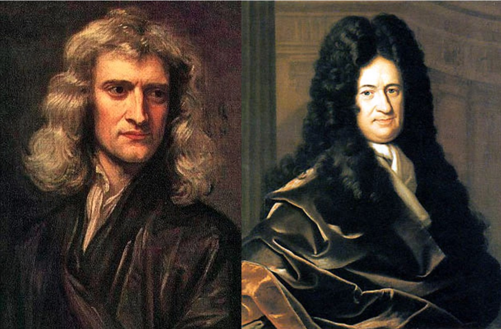

# 补充1：微积分

*打开本页，如果没有显示公式，请刷新页面。*

**微积分**（Calculus，在拉丁语中意为计数用的小石头）是研究极限、微分学、积分学和无穷级数等的一个数学分支。（参阅：[维基百科中的“微积分”词条](https://zh.wikipedia.org/wiki/%E5%BE%AE%E7%A7%AF%E5%88%86%E5%AD%A6)）

- 几何学研究的是形状
- 代数学研究代数运算和解方程
- 微积分研究不变化的量。

微积分，也称为“初等数学分析”。

正是因为微积分研究的是变化的量的计算，所以它在科学、工程、经济等领域有着广泛的应用，能够解决代数学、几何学所不能解决的问题。

一般认为，现代微积分是在17世纪由[艾萨克·牛顿](https://zh.wikipedia.org/wiki/艾萨克·牛顿)和[戈特弗里德·萊布尼茨](https://zh.wikipedia.org/wiki/戈特弗里德·萊布尼茨)（相互独立，在同一时间首次出版）发展起来的。

艾萨克·牛顿爵士（左）与戈特弗里德·萊布尼茨（右）

本章是配合《机器学习数学基础》一书，为已经把微积分知识遗忘较多的读者提供参考，包括如下内容：

- [理解微积分概念，必不可少](https://mp.weixin.qq.com/s?__biz=MzA3ODE4NzExOA==&mid=2657729513&idx=1&sn=cbd01ccb995596261bbd328e7d34acfe&chksm=84db84e8b3ac0dfefa2486c6b9ad567c433c228bcb8594521aac155940b9f599cadbc8edd154&scene=21#wechat_redirect)
- [函数](b01-01.md)
- [极限和连续](b01-02.md)
- [导数](b01-03.md)
- [定理和证明](theorem.md)

