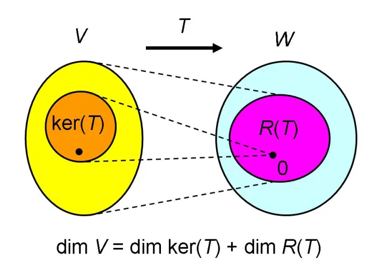
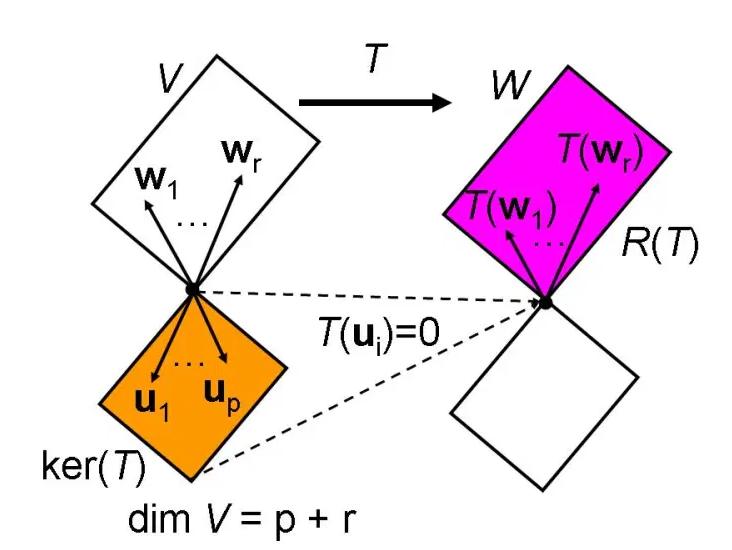
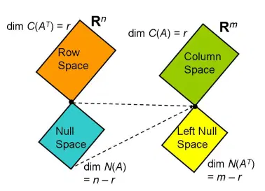
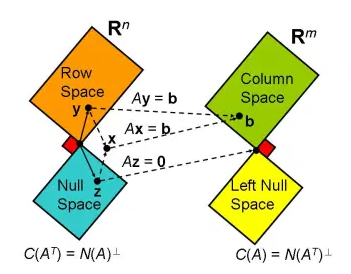

# 线性代数基本定理

*打开本页面，如果不显示公式，请刷新。*

Gilbert Strang认为线性代数有四个基本定理$$^{[1]}$$。

线性代数的核心问题是向量空间的线性变换，向量空间是线性代数的研究对象，线性变换是研究向量空间的基本方法。线性变换将一个向量空间的子空间映射到另一个向量空间中的子空间。

## 定理1：秩-零化度定理

以下关于“秩-零化度定理”（rank-nullity theorem）的阐述。以下内容主要参考文献[2]和[3]。

如下图所示，线性变换 $$\pmb{T}:\mathbb{V}\to\mathbb{W}$$ ，$$\mathbb{V}$$ 是有限维向量空间，称为**定义域**；$$\pmb{T}$$ 的**值域**，记作：$$ran(\pmb{T})$$ 或 $$R(\pmb{T})$$ ，是 $$\mathbb{W}$$ 的子集。$$ran({\pmb{T}})=\{\pmb{T}(\pmb{v})|\pmb{v}\in\mathbb{V}\}$$

- **核**：若 $$\mathbb{V}$$ 里面有一个向量集合，其中每个向量 $$\pmb{u}$$ 经 $$\pmb{T}$$ 映射之后为零向量，即 $$\pmb{T}(\pmb{u})=\pmb{0}$$ ，则此向量集合称为 $$\pmb{T}$$ 的**核**（kernel），记作：$$\ker(\pmb{T})$$ 。$$ker(\pmb{T})$$ 满足向量加法和数量乘法封闭性，是 $$\mathbb{V}$$ 的一个子空间。核也称为零空间（nullspace），$$\ker(\pmb{T})=\{\pmb{v}\in\mathbb{V}|\pmb{T}(\pmb{v})=\pmb{0}\}$$ 。

- **零化度**：核的维度（dimension），称为**零化度**（nullity），记作：$$\dim\ker(\pmb{T})$$ 。可以度量核的大小。
- **秩**：线性变换 $$\pmb{T}$$ 的值域的维度，称为**秩**（rank），记作：$$rank\pmb{T}=\dim R(\pmb{T})$$ 。

### 秩—零化度定理

$$\dim\mathbb{V}=\dim\ker(\pmb{T})+rank\pmb{T}$$

其中： $$\dim\mathbb{V}$$ 是线性变换 $$\pmb{T}$$ 的定义域、向量空间 $$\mathbb{V}$$ 的维度；$$\dim\ker(\pmb{T})$$ 是核的维度，即零化度；$$rank\pmb{T}$$ 是值域的维度，即秩。

### 证明

**证明1：通过矩阵**

将线性变换 $$\pmb{T}:\mathbb{V}\to\mathbb{W}$$ 用 $$m\times n$$ 的矩阵 $$\pmb{A}$$ 表示，其中：$$n = \dim\mathbb{V}, m=\dim\mathbb{W}$$ 。

线性变换 $$\pmb{T}$$ 的核 $$\ker(\pmb{T})$$ 即为矩阵的零空间（null space）$$N(\pmb{A})$$ ，它的维度即矩阵的零化度，记作 $$\dim N(\pmb{A})$$ 。关于零空间的详细内容，参阅[4]。

值域 $$ran(\pmb{T})$$ 即为矩阵的列空间（column space）$$C(\pmb{A})$$ 。

将矩阵 $$\pmb{A}$$ 化简为行梯形形式，用分块矩阵表示为：

$$\pmb{R}=\begin{bmatrix}\pmb{I}_r&\pmb{F}\\\pmb{0}&\pmb{0}\end{bmatrix}$$

其中 $$\pmb{R}$$ 的秩 $$r=rank\pmb{R}$$ ，$$\pmb{F}$$ 是 $$r\times(n-r)$$ 阶矩阵。

因为矩阵行运算不改变轴数量，也不改变零空间，所以：$$rank\pmb{A}=rank\pmb{R}=r$$ 且 $$N(\pmb{A})=N(\pmb{R})$$ 。

根据 $$\pmb{R}$$ 的形状，写出 $$n\times(n-r)$$ 阶零空间矩阵 $$\pmb{P}$$ ：

$$\pmb{P} = \begin{bmatrix}-\pmb{F}\\\pmb{I}_{n-r}\end{bmatrix}$$

用上述结果可以计算得到 $$\pmb{RP}=0$$ ，故确认 $$\pmb{P}$$ 是零空间矩阵。

$$\pmb{RP}=\begin{bmatrix}\pmb{I}_r&\pmb{F}\\\pmb{0}&\pmb{0}\end{bmatrix}\begin{bmatrix}-\pmb{F}\\\pmb{I}_{n-r}\end{bmatrix}=\begin{bmatrix}-\pmb{F}+\pmb{F}\\\pmb{0}+\pmb{0}\end{bmatrix}=0$$

设 $$\pmb{x}=\begin{bmatrix}\pmb{x}_1\\\pmb{x}_2\end{bmatrix}$$ ，其中 $$\pmb{x}_1$$ 是 $$r$$ 维向量，$$\pmb{x}_2$$ 是 $$n-r$$ 维向量，欲使 $$\pmb{Rx}=\pmb{0}$$ 成立，即：

$$\pmb{Rx}=\begin{bmatrix}\pmb{I}_r&\pmb{F}\\\pmb{0}&\pmb{0}\end{bmatrix}\begin{bmatrix}\pmb{x}_1\\\pmb{x}_2\end{bmatrix}=\begin{bmatrix}\pmb{x}_1+\pmb{Fx}_2\\\pmb{0}\end{bmatrix}=\pmb{0}$$

所以：$$\pmb{x}_1=-\pmb{Fx}_2$$ ，

于是：$$\pmb{x}=\begin{bmatrix}-\pmb{Fx}_2\\\pmb{x}_2\end{bmatrix}=\begin{bmatrix}-\pmb{F}\\\pmb{I}_{n-r}\end{bmatrix}\pmb{x}_2=\pmb{Px}_2$$

所以：$$C(\pmb{P})=N(\pmb{R})$$

即：$$\dim N(\pmb{R})=\dim C(\pmb{P})=n-r$$ 。从而证明：

$$n = \dim N(\pmb{A}) + rank\pmb{A}$$

$$m\times n$$ 的矩阵 $$\pmb{A}$$ 的秩 $$rank\pmb{A}$$ 和零化度 $$\dim N(\pmb{A})$$ 之和等于 $$n$$ 

**证明2：线性变换的向量空间分析**

令 $$\dim\mathbb{V} = n,\dim\ker(\pmb{T})=p,p\le n$$ 。

设 $$\ker(\pmb{T})$$ 的一组基底为 $$\{\pmb{u}_1,\cdots,\pmb{u}_p\}$$ ，扩充此基底为向量空间 $$\mathbb{V}$$ 的基底 $$\{\pmb{u}_1,\cdots,\pmb{u}_p,\pmb{w}_1,\cdots,\pmb{w}_r\}$$ 且 $$n=p+r$$。

向量空间 $$\mathbb{V}$$ 中任一向量 $$\pmb{v}$$ 可表示为基底向量的唯一线性组合：

$$\pmb{v}=a_1\pmb{u}_1+\cdots+a_p\pmb{u}_p+b_1\pmb{w}_1+\cdots+b_r\pmb{w}_r$$

因为 $$\pmb{T}(\pmb{u})=\pmb0$$ ，即 $$\pmb{T}(\pmb{u}_1)=\cdots=\pmb{T}(\pmb{u}_p)=\pmb0$$ （如下图所示）

所以：

$$\begin{split}\pmb{T}(\pmb{v})&=\pmb{T}(a_1\pmb{u}_1+\cdots+a_p\pmb{u}_p+b_1\pmb{w}_1+\cdots+b_r\pmb{w}_r)\\&=a_1\pmb{T}(\pmb{u}_1)+\cdots+a_p\pmb{T}(\pmb{u}_p)+b_1\pmb{T}(\pmb{w}_1)+\cdots+b_r\pmb{T}(\pmb{w}_r)\\&=b_1\pmb{T}(\pmb{w}_1)+\cdots+b_r\pmb{T}(\pmb{w}_r)\end{split}$$

$$\pmb{T}(\pmb{w}_1),\cdots,\pmb{T}(\pmb{w}_r)$$ 张成了值域空间 $$ran(\pmb{T})$$ 。

设：$$c_1\pmb{T}(\pmb{w}_1)+\cdots+c_r\pmb{T}(\pmb{w}_r)=0$$ ，也可以写成：$$\pmb{T}(c_1\pmb{w}_1+\cdots+c_r\pmb{w}_r)=0$$ ，所以 $$c_1\pmb{w}_1+\cdots+c_r\pmb{w}_r$$ 属于零空间 $$\ker(\pmb{T})$$ 。

因为 $$\{\pmb{u}_1,\cdots,\pmb{u}_p\}$$ 是 $$\ker(\pmb{T})$$ 的基底，故可以有如下表达式：

$$c_1\pmb{w}_1+\cdots+c_r\pmb{w}_r=d_1\pmb{u}_1+\cdots+d_p\pmb{u}_p$$

又因为 $$\{\pmb{u}_1,\cdots,\pmb{u}_p,\pmb{w}_1,\cdots,\pmb{w}_r\}$$ 是 $$\mathbb{V}$$ 的基，也就是各个向量之间线性无关，所以上式中的系数都是 $$0$$ 。

故 $$\pmb{T}(\pmb{w}_1),\cdots,\pmb{T}(\pmb{w}_r)$$ 是线性无关的向量集合，是 $$ran(\pmb{T})$$ 的基。

所以：$$r=\dim ran(\pmb{T})=rank\pmb{T}$$

由 $$n=p+r$$ 以及前面的假设，可得：

$$\dim\mathbb{V}=\dim\ker(\pmb{T})+rank\pmb{T}$$

### 推论

- 若 $$\dim\mathbb{V}\gt\dim\mathbb{W}$$ ，则：

  $$\dim\ker(\pmb{T})=\dim\mathbb{V}-\dim ran(\pmb{T})\ge\dim\mathbb{V}-\dim\mathbb{W}\gt0$$

  即存在非零向量 $$\pmb{x}\in\mathbb{V}$$ 使得 $$\pmb{T}(\pmb{x})=\pmb{0}$$ ，或曰 $$\pmb{T}$$ 不是一对一（因为 $$\pmb{T}(\pmb{0})=\pmb{0}$$ ）。

- 若 $$\dim\mathbb{V}\lt\dim\mathbb{W}$$ ，则：

  $$\dim ran(\pmb{T})=\dim\mathbb{V}-\dim\ker(\pmb{T})\le\dim\mathbb{V}\lt\dim\mathbb{W}$$

  即存在非零向量 $$y\in\mathbb{W}$$ 使得 $$\pmb{y}\notin ran(\pmb{T})$$ ，或曰 $$\pmb{T}$$ 不是满射。

如果用矩阵表述：将线性变换 $$\pmb{T}:\mathbb{V}\to\mathbb{W}$$ 用 $$m\times n$$ 的矩阵 $$\pmb{A}$$ 表示，其中：$$n = \dim\mathbb{V}, m=\dim\mathbb{W}$$ 。

- $$n\gt m$$ ，则：$$\dim N(\pmb{A})=n-\dim C(\pmb{A})\ge n-m \gt 0$$ 。即零空间 $$N(\pmb{A})$$ 包含非零向量，或者说 $$\pmb{Ax}=0$$ 有无穷多组解。
- $$n\lt m$$ ，则：$$\dim C(\pmb{A})=n-\dim N(\pmb{A})\le n \lt m$$ 。即列空间 $$C(\pmb{A})$$ 未能充满整个 $$\mathbb{R}^m$$ （或 $$\mathbb{C}^m$$），或者说 $$\pmb{Ax}=\pmb{b}$$ 不总是有解。

**进一步理解**

此定理说明了线性变换前后的空间维数变化。变换后的空间维数如果相对变换前的空间维数减少了——不可能增加，说明变换前的空间经过变换之后出现了“零输出”，零空间 $$\ker(\pmb{T})\in\mathbb{V}$$ 就是产生“零输出”（即零向量）的变换前的向量集合。

“秩—零化度定理”即“维数守恒定律”，

> 变换前的空间维数 = 零空间的维数 + 变换后的空间维数

## 定理2：矩阵基本子空间

对于 $$m\times n$$ 的矩阵 $$\pmb{A}$$ （仅讨论实数矩阵），用线性变换表示 $$\pmb{A}:\mathbb{R}^n\to\mathbb{R}^m$$，用如下符号表示不同空间：

- **列空间**（column space）：$$C(\pmb{A})=\{\pmb{Ax}|\pmb{x}\in\mathbb{R}^n\}$$ ，即矩阵的值域（range）。将矩阵用列向量的方式表示 $$\pmb{A}=\begin{bmatrix}\pmb{a}_1&\cdots&\pmb{a}_n\end{bmatrix}$$ ，其中 $$\pmb{a}_j\in\mathbb{R}^m$$ ，$$C(\pmb{A})$$ 是列向量的线性组合。
- **零空间**（nullspace）：$$N(\pmb{A})=\{\pmb{x}\in\mathbb{R}^n|\pmb{Ax}=\pmb{0}\}$$
- **行空间**（row space）：是转置矩阵 $$\pmb{A}^T$$ 的列空间，$$C(\pmb{A}^T)$$

因为矩阵的行秩等于列秩，即 $$rank\pmb{A}=\dim C(\pmb{A})=\dim C(\pmb{A}^T)$$ ，于是“秩—零化度定理”可以写成：

$$n = \dim N(\pmb{A}) + \dim C(\pmb{A}^T)$$

将原矩阵转置，即得：

$$m=\dim N(\pmb{A}^T)+\dim C(\pmb{A})$$

- **左零空间**（left nullspace）：$$N(\pmb{A}^T)$$

$$C(\pmb{A}^T),N(\pmb{A})$$ 是 $$\mathbb{R}^n$$ 的子空间，$$C(\pmb{A}),N(\pmb{A}^T)$$ 是 $$\mathbb{R}^m$$ 的子空间。

**定理1已经说明了矩阵基本子空间的维数关系。**

以上四个矩阵的基本子空间如下图所示$$^{[5]}$$：

在《机器学习数学基础》第3章3.4节“正交和投影”中，专门介绍了向量和向量空间的正交概念。此处就探讨矩阵的四个子空间的正交关系，这些关系就构成了线性代数的一个基本定理，即说明**矩阵四个基本子空间的正交补的关系**。

设 $$\pmb{S}$$ 和 $$\pmb{T}$$ 是向量空间 $$\mathbb{R}^p$$ 的两个子空间，若它们正交，记作 $$\pmb{S}\bot\pmb{T}$$ 。

在向量空间 $$\mathbb{R}^p$$ 中所有与 $$\pmb{S}$$ 正交的向量称为**正交补**（orthogonal complement），记作 $$\pmb{S}^{\bot}$$ 。

$$p=\dim{\pmb{S}} + \dim\pmb{S}^{\bot}$$ 且 $$\pmb{S}\cap\pmb{S}^{\bot}=\{\pmb{0}\}$$ 。

### 基本子空间的正交关系

$$N(\pmb{A})=C(\pmb{A}^T)^{\bot}$$

$$N(\pmb{A}^T)=C(\pmb{A})^{\bot}$$

下图显示了四个基本子空间之间的正交关系：

### 证明

由矩阵 $$\pmb{A}_{m\times n}$$ 的零空间定义（参考文献[4]）可知：

$$\pmb{Ax}=0 \Longrightarrow \pmb{Ax}=\begin{bmatrix}A的第1行(row_1)\\\vdots\\A的第m行(row_m)\end{bmatrix}\pmb{x}=\begin{bmatrix}0\\\vdots\\0\end{bmatrix}$$

每个行向量与 $$\pmb{x}$$ 的内积都是 $$0$$ ，所以 $$\pmb{x}$$ 与所有行向量的线性组合正交，即 $$N(\pmb{A})\bot C(\pmb{A}^T)$$ 。

 又因为 $$n = \dim N(\pmb{A}) + \dim C(\pmb{A}^T)$$ ，

所以：$$N(\pmb{A})=C(\pmb{A}^T)^{\bot}$$

同样思路，对 $$\pmb{A}$$ 转置，有：

$$\pmb{A}^T\pmb{y}=\begin{bmatrix}A的第1列(col_1)\\\vdots\\A的第n列(col_n)\end{bmatrix}\pmb{y}=\begin{bmatrix}0\\\vdots\\0\end{bmatrix}$$

矩阵 $$\pmb{A}$$ 的每个列向量都与 $$\pmb{y}$$ 正交，即 $$N(\pmb{A}^T)=C(\pmb{A})^{\bot}$$ 。

**为什么称为左零空间？**

$$\pmb{A}^T\pmb{y}=0$$ ，左右都取转置，$$\pmb{y}^T\pmb{A}=\pmb{0}^T$$ ，$$\pmb{y}^T$$ 位于 $$\pmb{A}$$ 的左边，故称 $$N(\pmb{A}^T)$$ 为左零空间。

## 定理3：正交基$$^{[6]}$$

设 $$m\times n$$ 矩阵 $$\pmb{A}$$ ，$$r=rank\pmb{A}\le\min\{m,n\}$$ 。$$\{\pmb{v}_1,\cdots,\pmb{v}_r\}$$ 是 $$\pmb{A}$$ 的行空间 $$C(\pmb{A}^T)$$ 的一组基，$$\{\pmb{u}_1,\cdots,\pmb{u}_r\}$$ 是列空间 $$C(\pmb{A})$$ 的一组基。

令 $$\sigma_1^2,\cdots,\sigma_n^2$$ （ $$\sigma_i\ge0$$ ）是 $$n\times n$$ 的矩阵 $$\pmb{A}^T\pmb{A}$$ 的特征值，$$\pmb{e}_1,\cdots,\pmb{e}_n$$ 为相应的单位特征向量，则有：

$$\pmb{A}^T\pmb{Ae}_i=\sigma_i^2\pmb{e}_i,\quad i=1,\cdots,n \tag{3.1}$$

其中，$$\begin{cases}\pmb{e}^T_i\pmb{e}_i=1,\quad i=j\\\pmb{e}^T_i\pmb{e}_i=0,\quad i\ne j\end{cases}$$ 。

将（3.1）式写成矩阵相乘的形式：

$$\pmb{A}^T\pmb{A}\begin{bmatrix}\pmb{e}_1&\cdots&\pmb{e}_n\end{bmatrix}=\begin{bmatrix}\pmb{e}_1&\cdots&\pmb{e}_n\end{bmatrix}\begin{bmatrix}\sigma^2_1&\cdots&0\\\vdots&\ddots&\vdots\\0&\cdots&\sigma^2_n\end{bmatrix}$$

令 $$\pmb{E}=\begin{bmatrix}\pmb{e}_1&\cdots&\pmb{e}_n\end{bmatrix}$$ ，则 $$\pmb{E}^T\pmb{E}=\pmb{I}$$ ，故 $$\pmb{E}^T=\pmb{E}^{-1}$$ ，则 $$\pmb{E}$$ 是正交矩阵。对上式右乘 $$\pmb{E}^T$$ 后，得：

$$\pmb{A}^T\pmb{A}=\pmb{E}\begin{bmatrix}\sigma^2_1&\cdots&0\\\vdots&\ddots&\vdots\\0&\cdots&\sigma^2_n\end{bmatrix}\pmb{E}^T$$

所以，$$rank(\pmb{A}^T\pmb{A})=rank(diag(\sigma^2_1,\cdots,\sigma^2_n))$$ 。

根据前面的假设 $$r=rank\pmb{A}$$ ，可以假设 $$\sigma_1\ge\sigma_2\ge\cdots\sigma_r\gt0$$ ，且 $$\sigma+{r+1}=\cdots=\sigma_n=0$$ ，则 $$rank(\pmb{A}^T\pmb{A})=r$$ 。

根据定理1，$$\dim N(\pmb{A})=n-rank\pmb{A}=n-r$$ 。

另外：$$\begin{Vmatrix}\pmb{Ae}_i\end{Vmatrix}^2=\pmb{e}_i^T\pmb{A}^T\pmb{Ae}_i=\sigma_i^2\pmb{e}^T_i\pmb{e}_i=\sigma_i^2$$

所以，$$\begin{Vmatrix}\pmb{Ae}_i\end{Vmatrix}=\sigma_i,(1\le i\le n)$$ 。

若 $$i=r+1,\cdots,n$$ ，$$\begin{Vmatrix}\pmb{Ae}_i\end{Vmatrix}=0$$ ，即 $$\pmb{Ae}_i=\pmb{0}$$ 。

因为 $$\{\pmb{e}_1,\cdots,\pmb{e}_n\}$$ 线性独立，且 $$\dim N(\pmb{A})=n-r$$ ，所以 $$\{\pmb{e}_{r+1},\cdots,\pmb{e}_n\}$$ 是 $$\pmb{A}$$ 的零空间 $$N(\pmb{A})$$ 的基。

根据定理2，从子空间的正交补可知，$$\{\pmb{e}_1,\cdots,\pmb{e}_r\}$$ 为 $$\pmb{A}$$ 的行空间 $$C(\pmb{A}^T)$$ 的基。

 将（3.1）式左乘 $$\pmb{A}$$ ，得：

$$\pmb{AA}^T\pmb{Ae}_i=\sigma_i^2\pmb{Ae}_i,i=1,\cdots,n$$

则 $$m\times m$$ 矩阵 $$\pmb{AA}^T$$ 有非零特征值 $$\sigma_1^2,\cdots,\sigma_r^2$$ ，对应特征向量为 $$\pmb{Ae}_i,i=1,\cdots,r$$ 。

令：$$\pmb{u}_i=\frac{\pmb{Ae}_i}{\sigma_i},i=1,\cdots,r$$

对于 $$1\le{i,j}\le{r}$$ ，

$$\pmb{u_i}^T\pmb{u}_j=\left(\frac{\pmb{Ae}_i}{\sigma_i}\right)^T\left(\frac{\pmb{Ae}_j}{\sigma_j}\right)=\frac{\pmb{e}_i^T\pmb{A}^T\pmb{Ae}_j}{\sigma_i\sigma_j}=\begin{cases}1\quad(i=j)\\0\quad(i\ne j )\end{cases}$$

则 $$\{\pmb{u}_1,\cdots,\pmb{u}_r\}$$ 构成了 $$\pmb{A}$$ 的列空间 $$C(\pmb{A})$$ 的一组单位正交基。

因为 $$\pmb{AA}^T$$ 和 $$\pmb{A}^T\pmb{A}$$ 有相同的非零特征值，$$\pmb{AA}^T$$ 另有 $$m-r$$ 个零特征值。

根据格拉姆-施密特正交化方法（参阅《机器学习数学基础》第3章3.5.1节），得左零空间 $$N(\pmb{A}^T)=N(\pmb{AA}^T)$$ 的单位正交基 $$\{\pmb{u}_{r+1},\cdots,\pmb{u}_m\}$$ 。

因为 $$N(\pmb{A}^T)=C(\pmb{A})^{\bot}$$ （定理2），$$\{\pmb{u}_1,\cdots,\pmb{u}_m\}$$ 是 $$\mathbb{R}^m$$ 的单位正交基。

综上可得：

对于 $$m\times n$$ 矩阵 $$\pmb{A}$$ ，秩为 $$r$$ ，则：

- $$r=rank\pmb{A}=rank\pmb{A}^T=rank(\pmb{A}^T\pmb{A})=rank(\pmb{AA}^T)$$
- $$C(\pmb{A}^T)=C(\pmb{A}^T\pmb{A}), C(\pmb{A})=C(\pmb{AA}^T)$$
- $$N(\pmb{A})=N(\pmb{A}^T\pmb{A}), N(\pmb{A}^T)=N(\pmb{AA}^T)$$
- $$\pmb{A}^T\pmb{A}$$ 的特征值为 $$\sigma_1^2,\cdots,\sigma_n^2$$ ，对应单位正交的特征向量 $$\pmb{e}_1,\cdots,\pmb{e}_n$$
- $$\pmb{AA}^T$$ 的特征值为 $$\sigma_1^2,\cdots,\sigma_m^2$$ ，对应单位正交的特征向量 $$\pmb{u}_1,\cdots,\pmb{u}_m$$
- $$\pmb{Ae}_i=\sigma_i\pmb{u}_i,\sigma_i\gt0,i=1,\cdots,r$$ ，且 $$\pmb{Ae}_i=\pmb{0},i=r+1,\cdots,n$$
- $$\pmb{A}^T\pmb{u}_j=\sigma\pmb{e}_j,\sigma_j\gt0,j=1,\cdots,r$$ ，且 $$\pmb{A}^T\pmb{u}_j=\pmb{0},j=r+1,\cdots,m$$

### 基本子空间的单位正交基

- 行空间 $$C(\pmb{A}^T)$$ 的基：$$\{\pmb{e}_1,\cdots,\pmb{e}_r\}$$ ，$$\dim C(\pmb{A}^T)=r$$
- 零空间 $$N(\pmb{A})$$ 的基：$$\{\pmb{e}_{r+1},\cdots,\pmb{e}_n\}$$，$$\dim N(\pmb{A})=n-r$$
- 列空间 $$C(\pmb{A})$$ 的基：$$\{\pmb{u}_1,\cdots,\pmb{u}_r\}$$ ，$$\dim C(\pmb{A}) = r$$
- 左零空间 $$N(\pmb{A}^T)$$ 的基：$$\{\pmb{u}_{r+1},\cdots,\pmb{u}_m\}$$ ，$$\dim N(\pmb{A}^T)=m-r$$

## 定理4：奇异值分解

详见《机器学习数学基础》第3章3.5.3节。

## 术语比较$$^{[7]}$$

| $$\pmb{T}:\mathbb{V}\to\mathbb{W}$$ 线性变换                   | $$m\times n$$ 矩阵 $$\pmb{A}:\mathbb{R}^n\to\mathbb{R}^m$$       |
| ------------------------------------------------------------ | ------------------------------------------------------------ |
| 值域：$$ran(\pmb{T})=\{\pmb{T}(\pmb{x})|\pmb{x}\in\mathbb{V}\}\subseteq\mathbb{W}$$ | 列空间：$$C(\pmb{A})=\{\pmb{Ax}|\pmb{x}\in\mathbb{R}^n\}\subseteq\mathbb{R}^m$$ |
| 核：$$\ker(\pmb{T})=\{\pmb{x}\in\mathbb{V}+\pmb{T}(\pmb{x})=\pmb{0}\}\subseteq\mathbb{V}$$ | 零空间：$$N(\pmb{A})=\{\pmb{x}\in\mathbb{R}^n|\pmb{Ax}=\pmb{0}\}\subseteq\mathbb{R}^n$$ |
| 秩：$$rank\pmb{T}=\dim ran(\pmb{T})$$                          | 秩：$$rank\pmb{A}=\dim C(\pmb{A})$$                            |
| 零化度：$$nullity\pmb{T}=\dim\ker(\pmb{T})$$                   | 零化度：$$nullity\pmb{A}=\dim N(\pmb{A})$$                     |
| 满射：$$ran(\pmb{T})=\mathbb{W}$$ ，即 $$rank\pmb{T}=\dim\pmb{T}$$ | 满行秩：$$C(\pmb{A})=\mathbb{R}^m$$ ，即 $$rank\pmb{A}=m$$       |
| 单射：$$\ker(\pmb{T})=\{\pmb{0}\}$$ ，即 $$rank\pmb{T}=\dim\mathbb{V}$$ | 满列秩：$$N(\pmb{A})=\{\pmb{0}\}$$ ，即 $$rank\pmb{A}=n$$        |
| 同构：$$rank\pmb{T}=\dim\mathbb{W}=\dim\mathbb{V}$$            | 满秩：$$rank\pmb{A}=m=n$$                                      |

## 参考文献

[1]. Gilbert Strang, The Fundamental Theorem of Linear Algebra, *American Mathematical Monthly*, 100, 1993, 848-855.

[2]. [https://ccjou.wordpress.com/2009/03/23/線性代數基本定理-一/](https://ccjou.wordpress.com/2009/03/23/%e7%b7%9a%e6%80%a7%e4%bb%a3%e6%95%b8%e5%9f%ba%e6%9c%ac%e5%ae%9a%e7%90%86-%e4%b8%80/)

[3]. [https://zh.wikipedia.org/wiki/秩－零化度定理](https://zh.wikipedia.org/wiki/%E7%A7%A9%EF%BC%8D%E9%9B%B6%E5%8C%96%E5%BA%A6%E5%AE%9A%E7%90%86)

[4]. [零空间](./rank.html)

[5]. [https://ccjou.wordpress.com/2009/05/06/線性代數基本定理-二/](https://ccjou.wordpress.com/2009/05/06/%E7%B7%9A%E6%80%A7%E4%BB%A3%E6%95%B8%E5%9F%BA%E6%9C%AC%E5%AE%9A%E7%90%86-%E4%BA%8C/)

[6]. [https://ccjou.wordpress.com/2009/05/15/線性代數基本定理-三/](https://ccjou.wordpress.com/2009/05/15/%E7%B7%9A%E6%80%A7%E4%BB%A3%E6%95%B8%E5%9F%BA%E6%9C%AC%E5%AE%9A%E7%90%86-%E4%B8%89/)

[7]. [https://ccjou.wordpress.com/2012/11/12/線性變換與矩陣的用語比較/](https://ccjou.wordpress.com/2012/11/12/%E7%B7%9A%E6%80%A7%E8%AE%8A%E6%8F%9B%E8%88%87%E7%9F%A9%E9%99%A3%E7%9A%84%E7%94%A8%E8%AA%9E%E6%AF%94%E8%BC%83/)

