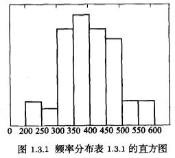
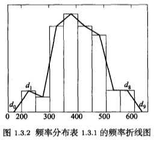

# 描述性统计

*打开本页，如果没有显示公式，请刷新页面。*

## 用样本估计总体分布$$^{[1]}$$

### 频率分布表

先将数据从小到大排列，然后将排列后的数据分段，每段中的数据被称为一组，故分段也称为**分组**。

设样本量 $$n$$ ，分组经验公式：$$K=1+4\lg{(n)}$$ ，分成 $$K$$ 组。

然后计算每组的发生次数和发生频率。

### 频率分布直方图

直方图在1895年由英国统计学家皮尔逊首先使用。

计算数据落入各组的频率 $$f_i$$ ，将隔断的端点在直角坐标系横轴标出，用 $$g_i=\frac{f_i}{本段区间长度}$$ 作为纵坐标的高度，就得到了由相连接长方形构成的图像，即频率分布直方图，简称直方图（histogram）。



*利用matplotlib等Python中的数据可视化库，能够绘制直方图，请参阅[《跟老齐学Python：数据分析》](https://www.itdiffer.com/data.html)*

### 频率折线图

用 $$d_1, \cdots, d_k$$ 表示频率分布直方图中各矩形上边的重点，在直方图的左边延长出一个分段，其重点用 $$d_0$$ 表示；在右边延长出一个分段，其重点用 $$d_{k+1}$$ 表示。将 $$d_0,d_1,\cdots,d_k,d_{k+1}$$ 用折线链接，得到了频率折线图。频率折线图也反映出数据频率的分布规律。



**说明：** 在经典统计学中，由于统计手段的限制，统计图的数量有限。如果使用matplotlib、seaborn等Python语言的库，可以绘制出更多的统计图$$^{[2]}$$。

## 众数和中位数

众数和中位数，是两个代表数据特征的统计量。

### 众数

观测数据中出现次数最多的数是**众数**（mode），用 $$M_0$$ 表示。

如果观测数据中每个数出现的次数都相同，则无众数；若有两个或以上的数出现次数相同，且超过其他数的出现次数，则这几个数都是众数。

众数受数据中极大或极小值的变化影响较小，出现的频率最高。

在统计学中，将数据中最大值和最小值的差，称为**级差**。

```python
a = np.array([[6, 8, 3, 0],
              [3, 2, 1, 7],
              [8, 1, 8, 4],
              [5, 3, 0, 5],
              [4, 7, 5, 9]])

# 统计数据中的众数
from scipy import stats
stats.mode(a)

# 输出
ModeResult(mode=array([[3, 1, 0, 0]]), count=array([[1, 1, 1, 1]]))
```

### 中位数

设观测数据已经从小到大排列为 $$x_1\le x_2\le\cdots\le x_n$$ :

1. 样本量 $$n$$ 为奇数，称中间的数据是**中位数**（median），记作 $$M_d$$ 。

   $$M_d=x_m, m=\frac{n+1}{2}$$

2. 样本量 $$n$$ 为偶数，称中间两个数据的平均值是中位数：

   $$M_d=\frac{x_m+x_{m+1}}{2}, m=\frac{n}{2}$$

```python
a = np.array([[10, 7, 4], [3, 2, 1]])
a
# 输出
array([[10,  7,  4],
       [ 3,  2,  1]])

# 计算全部数据的中位数
np.median(a)
# 输出
3.5

# 计算0轴方向的中位数
np.median(a, axis=0)
# 输出
array([6.5, 4.5, 2.5])

# 计算1周方向的中位数
np.median(a, axis=1)
# 输出
array([7.,  2.])
```

此外，在Pandas中提供了DataFrame对象的方法`describe()`，能够得到数据的常用统计量，详情参阅参考文献[2]。


## 参考文献

[1]. 数理统计. 何书元. 北京：高等教育出版社. 2012.1，第1版

[2]. 跟老齐学Python：数据分析. 齐伟. 北京：电子工业出版社. 图书链接：https://www.itdiffer.com/data.html