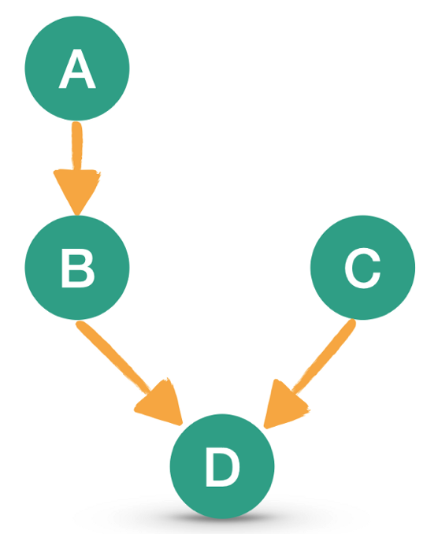
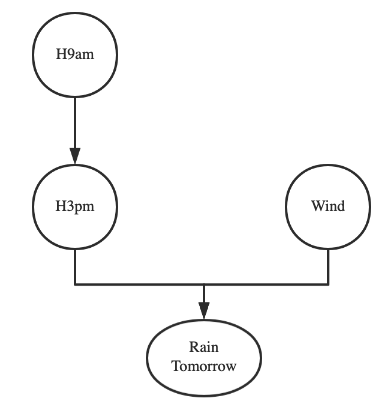
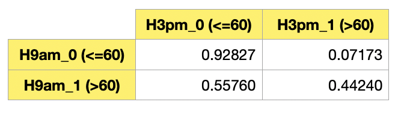
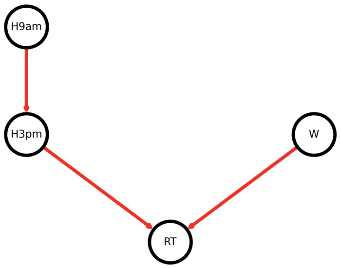
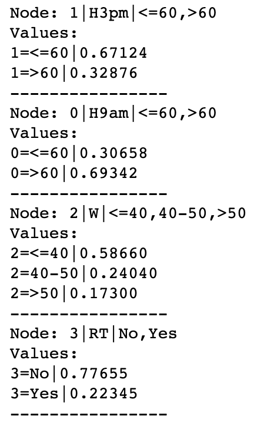
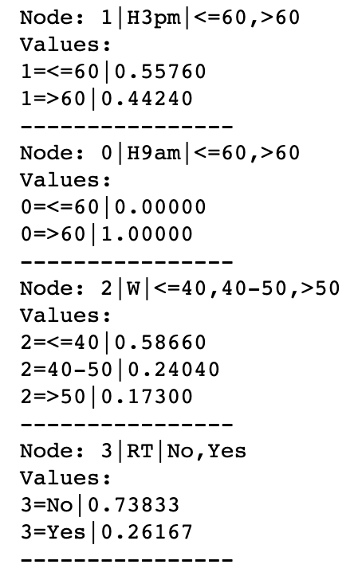
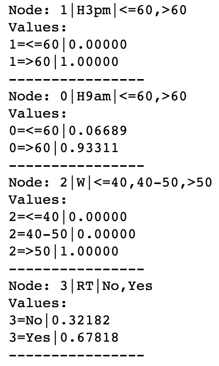

# 贝叶斯网络

## 基本概念

在贝叶斯分类器中$$^{[1]}$$ ，以朴素贝叶斯为代表，假设特征是彼此独立的。但是，在实际问题中，这种假设较少出现，或者只能做近似处理。更多的情况则是特征之间彼此相关。这种关系可以用下图表示：



图中每个点表示一个特征，那么：

- 无关（独立）：A 和 C，B 和 C
- 相关：A → B ，B 是以 A 为“因”，或者为“父结点”。这个关系可以用条件概率表示：$$P(B|A)$$ ，即在 A 发生的条件下 B 发生。D 则以 B 、C 两个为“因”，于是可以表示为：$$P(D|B, C)$$ 。
- 条件无关（独立）：D 被认为是有条件地独立于 A 。一旦知道事件 B 是否发生，从 D 的角度来看，A 就变得无关紧要。或者表示为：$$P(D|B,A) = P (D|B)$$ 。

上面那样的图，称为：概率图模型（Probabilistic Graphical Model , PGM），它是一个有向无环图（Directed Acyclic Graph ，DAG）。

此概率图模型，就构成了贝叶斯网络（Bayesian Networks，NBs），或称为**贝叶斯信念网络**（Bayesian Belief Network，BBN）。

在概率图模型中，每个结点表示一个随机变量，结点之间的边表示各随机变量的依赖关系。所以，图表示联合概率分布。

贝叶斯网络满足**局部马尔可夫性**，即结点在给定其父结点的情况下条件独立于其非后代。

例如上图中：$$P(B|A, C)=P(B|A)$$ ，结点 B 条件独立于结点 C——这是 B 的非后代。

由此，联合概率可以简化为所有结点的 $$P(node|parents(node))$$ 的乘积，即：
$$
P(X_1,\cdots,X_n)=\prod\limits_{i=1}^nP(X_i|X_1,\cdots,X_{i-1})=\prod\limits_{i=1}^nP(X_i|Parents(X_i))\tag{1}
$$
在较大的网络中，此属性能够大大减少所需的计算量，因为通常，相对于网络的整体规模，大多数节点的父节点很少。

例如，下图所示的贝叶斯网络结构$$^{[4]}$$：


（sprinkler：洒水器（S）； rain：下雨（R）； grass wet：草湿（G））

假设每个结点有两个状态：T、F。如果 R=T，则会大概率转化为 G=T；而 S 则大概率的值是 F。

根据（1）式，联合概率分布为：

$$P(G,S,R)=P(G|S,R)P(S|R)P(R)$$

用这个模型可以回答某个条件下的相关结果概率。例如：“如果草是湿的，下雨的概率是多少？”

$$P(R=T|G=T)=\frac{P(G=T,R=T)}{P(G=T)}=\frac{\sum\limits_{x\in{T,F}}P(G=T,S=x,R=T)}{\sum\limits_{x,y\in{T,F}}P(G=T,S=x,R=y)}$$

利用图中的条件概率表（conditional probability tables, CPTs）以及联合概率分布，计算上式中分子和分母的每一项。例如分子中的一项：

$$\begin{split}P(G=T,S=T,R=T)&=P(G=T|S=T,R=T)P(S=T|R=T)P(R=T)\\&=0.99\times0.01\times0.02=0.00198\end{split}$$

最终，得到 $$P(R=T|G=T)$$ 的值：

$$P(R=T|G=T)=\frac{0.00198_{TTT}+0.1584_{TFT}}{0.00198_{TTT}+0.288_{TTF}+0.1584_{TFT}+0.0_{TFF}}=\frac{891}{2491}\approx35.77\%$$


## 推理方法
上述示例，是一个非常简单的贝叶斯网络，如果模型复杂了，如果还使用上面的方法，求解过程的计算难度就会很大，因此就出现了其他替代方法。常见的有以下几种方法$$^{[3,5]}$$：

- 精确推理
  - 枚举推理法（如上例）
  - 变量消元算法（variable elimination）
- 随机推理（蒙特卡洛方法）
  - 直接取样算法
  - 拒绝取样算法
  - 似然加权算法
  - 马尔科夫链蒙特卡洛算法（Markov chain Monte Carlo algorithm）（参考资料 [5] 中列出了此算法的示例）

## 特点分析

- 一般情况下，贝叶斯网络的计算开销比较大。
- 当数据的维度增加，贝叶斯网络的表现会下降。这在目前数据体量庞大的一般条件下是个很大的缺点。
- 贝叶斯网络是有向图，因此其描述变量间的因果关系，而不是其他统计方法中的相关关系。

在机器学习领域，比较常见的研究课题是将贝叶斯理论与神经网络结合在一起，从而结合两种方法的优点，比如训练后的神经网络的权重不再是单独的数值，而是一个分布，推断可以根据参数的后验分布来进行，这同时也意味着在参数空间中，我们可以推导出神经网络所学到的参数的性质和形状$$^{[6]}$$。

## 用贝叶斯网络预测天气$$^{[2]}$$

- 数据集：澳大利亚天气数据（https://www.kaggle.com/datasets/jsphyg/weather-dataset-rattle-package）
- 贝叶斯网络框架：py-bbn：https://py-bbn.readthedocs.io/index.html
- 用于显示图的工具：NetworkX 和 Matplotlib

1. 引入所有的库和模块

   ```python
   import pandas as pd 
   import networkx as nx 
   import matplotlib.pyplot as plt 
   
   # 用于创建贝叶斯网络
   from pybbn.graph.dag import Bbn
   from pybbn.graph.edge import Edge, EdgeType
   from pybbn.graph.jointree import EvidenceBuilder
   from pybbn.graph.node import BbnNode
   from pybbn.graph.variable import Variable
   from pybbn.pptc.inferencecontroller import InferenceController
   ```

2. 加载数据，并实施数据清洗

   ```python
   # 读入天气数据的 CSV 文件
   df=pd.read_csv('./data/weatherAUS.csv', encoding='utf-8')
   df.head()
   ```

   数据准备和特征工程

   初步查看数据统计信息

   ```python
   df.describe()
   ```

   通过下面的方法，查看各个属性的有关统计信息，可以初步判断，标签“RainTomorrow”中有缺失值。

   ```python
   df.info()
   ```

   但是缺失值量不大，所以可以将含有缺失值的样本删除

   ```python
   # 删除标签是 RainTomorrow=NaN 的样本
   df=df[pd.isnull(df['RainTomorrow'])==False]
   df.info()
   ```

   还有列有缺失值，处理方法就是用该列的均值填充

   ```python
   # 每列都有缺失值，用该列的均值填充之
   df=df.fillna(df.mean())
   df.info()
   ```

   后面不会用到所有特征，选择几个。

   将 `"WindGustSpeed"` 特征（记录风速）中的数据转化为等级（离散化），并创建新的特征`"WindGustSpeedCat"` 。

   ```python
   df['WindGustSpeedCat']=df['WindGustSpeed'].apply(lambda x: '0.<=40' if x<=40 else '1.40-50' 
                                                                       if 40<x<=50 else '2.>50')
   df['WindGustSpeedCat'].head()
   ```

   同样方法，对早晨 9 点的湿度 `"Humidity9am"` 和下午 3 点的湿度 `"Humidity3pm" 都做类似处理。`

   ```python
   # 创建早晨9点和下午3点的湿度特征，即将原有的两个湿度特征离散化
   df['Humidity9amCat']=df['Humidity9am'].apply(lambda x: '1.>60' if x>60 else '0.<=60')
   df['Humidity3pmCat']=df['Humidity3pm'].apply(lambda x: '1.>60' if x>60 else '0.<=60')
   ```

   显示部分数据

   ```python
   df.sample(10)
   ```

3. 创建贝叶斯网络

   从数据集中选择三个特征，作为预测明天是否下雨的因素，构建一个简单的贝叶斯网络，即：

   `H9am:Humidity9amCat; H3pm:Humidity3pmCat; Wind:WindGustSpeedCat`

   

   特征 `"Humidity9amCat"` ，其值有两种，即：`1.>60` 或者 `0.<=60` 。分别统计这两个值的数量，进而计算各自在整个数据集中所占比例。

   下面的计算，只对每个数值进行了计数（`.sort_index()` 的作用是把结果按照索引升序排列，即 `0.<=60` 排在前面。

   ```python
   df['Humidity9amCat'].value_counts().sort_index()
   ```

   如果对函数 `.value_counts()` 使用参数 `normalize=True` ，即将结果归一化，计算 $$\frac{n_i}{N}$$ ，每个数据的样本占总样本数量的比例：

   ```python
   df['Humidity9amCat'].value_counts(normalize=True).sort_index()
   ```

   如果将特征 `"Humidity9amCat"` 看做一个结点，那么在贝叶斯网络中，就可以利用上述的归一化的比例，创建该结点实例。方法如下：

   ```python
   H9am = BbnNode(Variable(0, 'H9am', ['<=60', '>60']), [0.30658, 0.69342])
   H9am
   ```

   另外一个关注的特征是 `"Humidity3pmCat"` ，如果把它也视为一个结点，则此结点应该是以上面的节点 `H9am` 为父结点。此特征下的数值，也只有两个。以 `H9am` 为父结点，需要计算如下概率：

   $$\begin{split}&P(\text{H3pm}(\le60)|\text{H9am}(\le60)),~P(\text{H3pm}(\gt60)|\text{H9am}(\le60));\\&P(\text{H3pm}(\le60)|\text{H9am}(\gt60)),~P(\text{H3pm}(\gt60)|\text{H9am}(\gt60))\end{split}$$

   如果按照上面的要求，将各个比例计算出来，可以用下面的表格形式表示（每行的和是 1 ）。

   

   据此，可以创建子结点 `H3pm`：

   ```python
   H3pm = BbnNode(Variable(1, 'H3pm', ['<=60', '>60']), [0.92827, 0.07173, 
                                                         0.55760, 0.44240])
   H3pm
   ```

   同样道理，也计算 `WindGustSpeedCat` 特征下各个数值出现的比例，用同样方法创建贝叶斯网络中的节点。

   将上述计算每个特征下数值比例的过程，写成一个函数，如下：

   ```python
   # 这个函数最多许可两个父结点
   def probs(data, child, parent1=None, parent2=None):
       if parent1==None:
           # Calculate probabilities 计算概率
           prob=pd.crosstab(data[child], 'Empty', margins=False, normalize='columns').sort_index().to_numpy().reshape(-1).tolist()
       elif parent1!=None:
               # 检查字节点有1个还是2个父结点
               if parent2==None:
                   # 计算概率
                   prob=pd.crosstab(data[parent1],data[child], margins=False, normalize='index').sort_index().to_numpy().reshape(-1).tolist()
               else:    
                   # 计算概率
                   prob=pd.crosstab([data[parent1],data[parent2]],data[child], margins=False, normalize='index').sort_index().to_numpy().reshape(-1).tolist()
       else: print("Error in Probability Frequency Calculations")
       return prob  
   ```

   使用此函数创建结点：

   ```python
   H9am = BbnNode(Variable(0, 'H9am', ['<=60', '>60']), probs(df, child='Humidity9amCat'))
   H3pm = BbnNode(Variable(1, 'H3pm', ['<=60', '>60']), probs(df, child='Humidity3pmCat', parent1='Humidity9amCat'))
   W = BbnNode(Variable(2, 'W', ['<=40', '40-50', '>50']), probs(df, child='WindGustSpeedCat'))
   RT = BbnNode(Variable(3, 'RT', ['No', 'Yes']), probs(df, child='RainTomorrow', parent1='Humidity3pmCat', parent2='WindGustSpeedCat'))
   ```

   结点对象创建完毕，创建贝叶斯网络实例：

   ```python
   # 创建网络
   bbn = Bbn() \
       .add_node(H9am) \
       .add_node(H3pm) \
       .add_node(W) \
       .add_node(RT) \
       .add_edge(Edge(H9am, H3pm, EdgeType.DIRECTED)) \
       .add_edge(Edge(H3pm, RT, EdgeType.DIRECTED)) \
       .add_edge(Edge(W, RT, EdgeType.DIRECTED))
   
   # Convert the BBN to a join tree
   # 
   join_tree = InferenceController.apply(bbn)
   ```

   注意，如果使用的是小数据样本，则存在某些事件组合不存在的风险。 在这种情况下，会出现“list index out of range”（列表索引超出范围）错误。 解决方案可能是扩展数据以包含所有可能的事件组合，或者识别缺失的组合并将它们添加进去。

4. 绘制图，以检查是否已按预期设置了。

   ```python
   # 设置结点位置
   pos = {0: (-1, 2), 1: (-1, 0.5), 2: (1, 0.5), 3: (0, -1)}
   
   # 图的显示配置 
   options = {
       "font_size": 16,
       "node_size": 4000,
       "node_color": "white",
       "edgecolors": "black",
       "edge_color": "red",
       "linewidths": 5,
       "width": 5,}
       
   # 生成图
   n, d = bbn.to_nx_graph()
   nx.draw(n, with_labels=True, labels=d, pos=pos, **options)
   
   # 更新边缘 并打印图
   ax = plt.gca()
   ax.margins(0.10)
   plt.axis("off")
   plt.show()
   ```

   结果如下：

   

5. 用贝叶斯网络预测

   首先，绘制每个节点的概率，而不向图中传递任何额外信息。 请注意，已经设置了一个简单的函数，因此我们以后不必重新输入相同的代码，因为我们需要多次重新生成结果。

   ```python
   # Define a function for printing marginal probabilities
   # 定义函数，用于打印边缘概率（边际概率）
   def print_probs():
       for node in join_tree.get_bbn_nodes():
           potential = join_tree.get_bbn_potential(node)
           print("Node:", node)
           print("Values:")
           print(potential)
           print('----------------')
           
   # Use the above function to print marginal probabilities
   # 用上面的函数打印边缘概率
   print_probs()
   ```

   下面是输出结果：

   

   从上面结果可知，根据图，之前每个事件发生，最终“明天下雨 (RT)”的发生概率为 0.22。

   是不是很了不起？实则不然，通过查看数据集中“RainTomorrow”标签中的每个值的频率，也可以获得相同的 22% 概率。

   可以说，以上贝叶斯网络做的事情，基本上是没有特别价值。

   但，不要急躁，小孩子刚出生，也看不到什么用途。

   接下来的步骤是将**证据**传给 BBN，看看它如何影响网络中每个节点的概率。

   假设上午 9 点，测量的湿度是 72，显然属于“>60”范围。将此**证据**传给 BBN，看看会发生什么。 请注意，再创建了另一个函数。

   ```python
   # To add evidence of events that happened so probability distribution can be recalculated
   # 增加证据，再计算概率分布
   def evidence(ev, nod, cat, val):
       ev = EvidenceBuilder() \
       .with_node(join_tree.get_bbn_node_by_name(nod)) \
       .with_evidence(cat, val) \
       .build()
       join_tree.set_observation(ev)
       
   # Use above function to add evidence
   # 用上述函数，增加证据
   evidence('ev1', 'H9am', '>60', 1.0)
   
   # Print marginal probabilities
   # 打印边缘概率
   print_probs()
   ```

   输出结果：

   

   上述结果显示，“Humidity9am>60” 的概率是 100%，似然 “Huminidity3pm>60” 的概率从 32.8% 提升到 44.2% 。同时，明天下雨的概率“RainTomorrow” 也提升到 26.1% 。

   注意比较，“WindGustSpeed” 风速的概率没有变化，因为“W”和“H9am”是相互独立的。

   您可以再次运行相同的证据代码以从网络中删除证据。 之后，让我们为“H3pm”和“W”传递两条证据。

   ```python
   # Add more evidence
   evidence('ev1', 'H3pm', '>60', 1.0)
   evidence('ev2', 'W', '>50', 1.0)
   # Print marginal probabilities
   print_probs()
   ```

   

   明天下雨的概率已经上升到 67.8%。 

   

​      


## 参考资料

[1] 贝叶斯分类器[DB/OL]. http://math.itdiffer.com/bayes-classifier.html

[2] Saul Dobilas. BBN: Bayesian Belief Networks — How to Build Them Effectively in Python[DB/OL]. https://towardsdatascience.com/bbn-bayesian-belief-networks-how-to-build-them-effectively-in-python-6b7f93435bba, 2022.09.23 

[3] Devin Soni. Introduction to Bayesian Networks[DB/OL]. https://towardsdatascience.com/introduction-to-bayesian-networks-81031eeed94e, 2022.09.23

[4] Wikipedia:Bayesian network[DB/OL]. https://en.wikipedia.org/wiki/Bayesian_network, 2022.09.23

[5] 维基百科：贝叶斯网络[DB/OL]. https://zh.wikipedia.org/zh-my/貝氏網路, 2022.09.23

[6] 贝叶斯（信念）网络[DB/OL]. https://www.jiqizhixin.com/graph/technologies/72d0a84a-8b87-4d33-afee-531439de3e0d. 2022.09.23