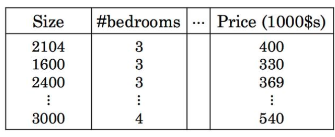
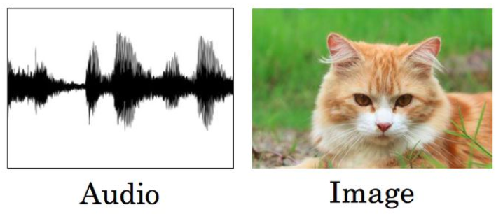
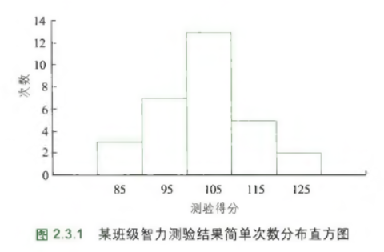
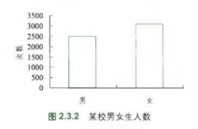
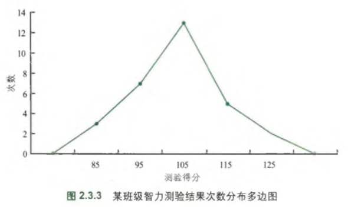
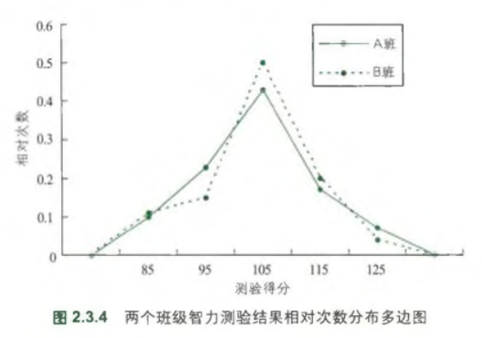
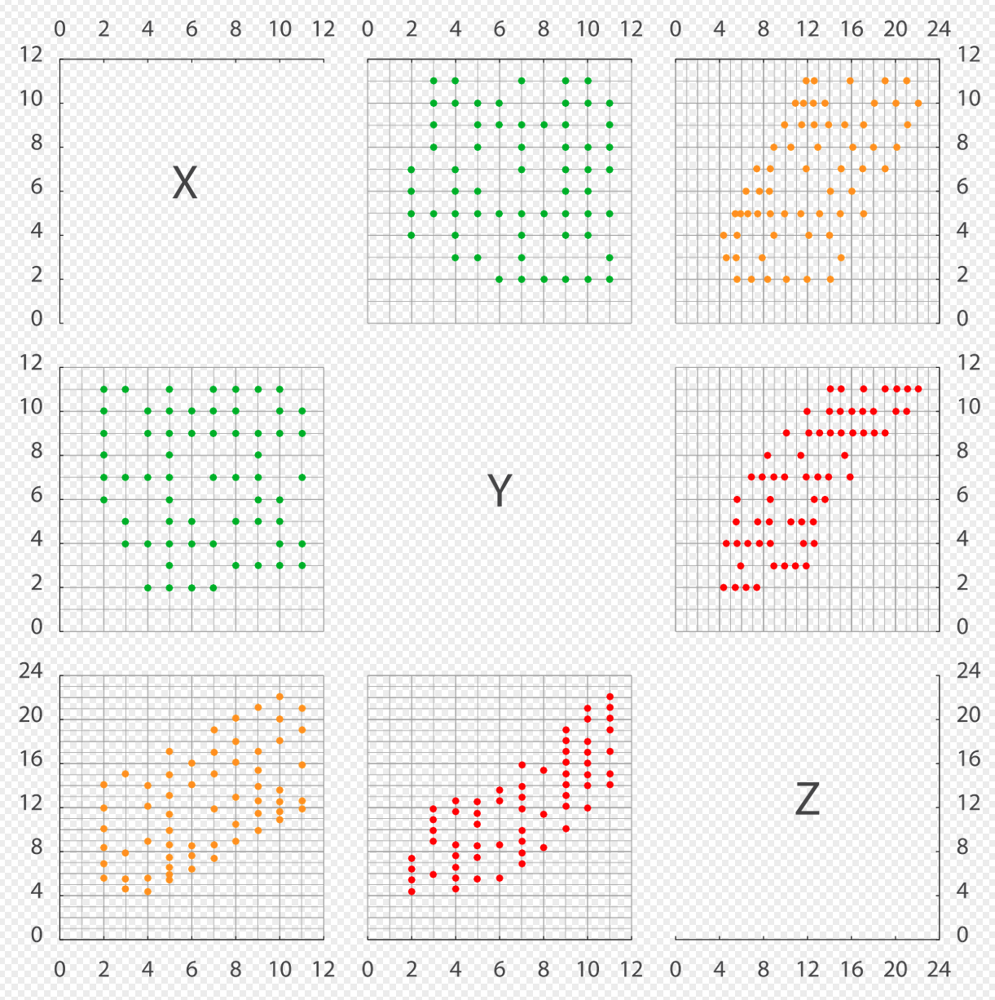
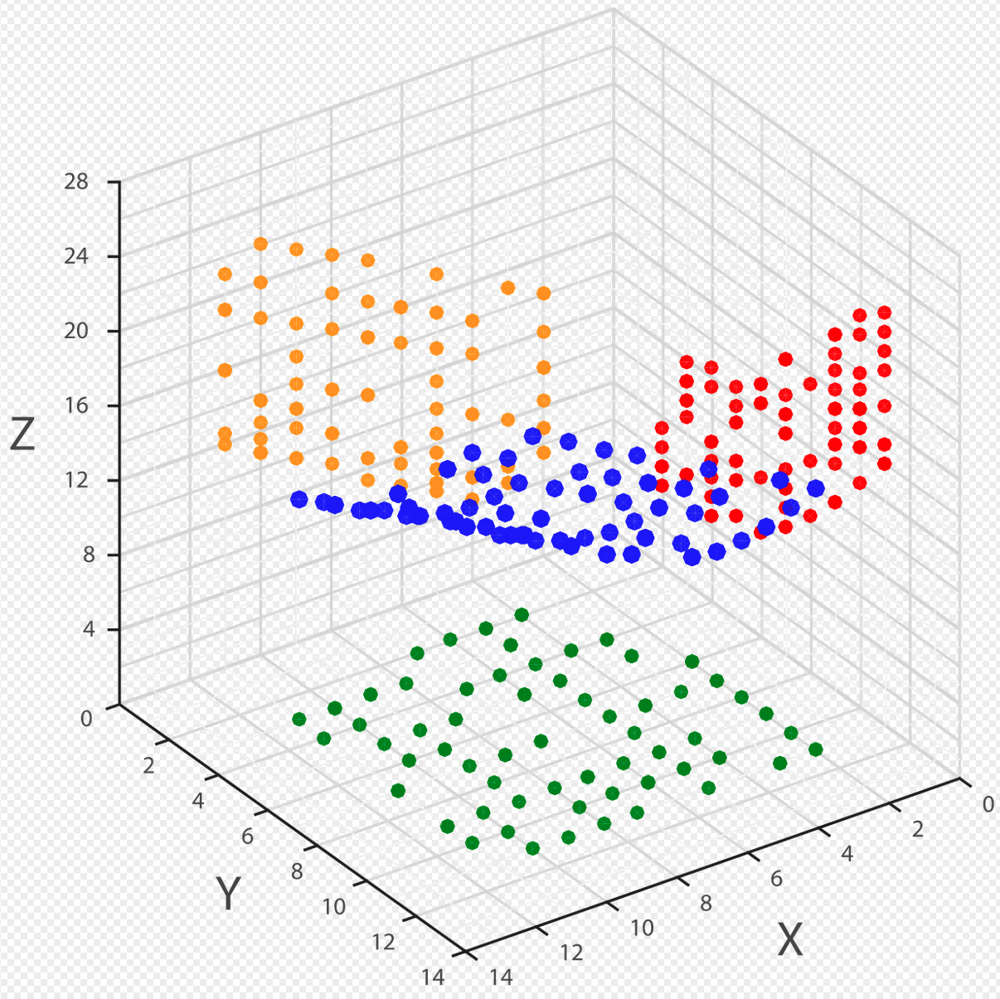

# 01 统计学和心理学

## 统计学

统计学可以划分为应用统计学和理论统计学两部分：

- 理论统计学，即数理统计。本网站中对《机器学习数学基础》一书所提供的补充资料：[第 5 章 概率](./05.html) 和 [第 6 章 数理统计](./06.html) 均侧重于理论统计学的内容，也包含应用统计学的内容。
- 应用统计学，顾名思义，强调的是统计学知识和方法在某些具体学科、业务中的应用。另外，“应用统计”也是普通高等学校的一个本科专业，以及研究生教育序列中一级学科经济学下面的专硕之一。

心理统计学是应用统计学中的一类。

统计学在以人工智能技术中占有重要地位，学好统计学，哪怕是心理学专业的同学，就相当于为硕士之后的发展方向多铺垫了一种选择。

## 心理统计学起源和发展$$^{[3]}$$

在心理统计学早期的理论和应用之中，重点集中在测量人的智力。弗朗西斯·高尔顿经常被认为是心理统计学之父。他设计和应用了一系列的心理测试。但是，心理统计学的起源经常和心理物理学联系到一起。心理统计学的先驱 Charles Spearman 曾经从师于心理物理学家 Wilhelm Wundt 。Spearman 设计了测量智力的早期方法之一。著名的心理统计学家L. L. Thurstone 曾经发展了后来被称为“比较判断法则”的测量方法，这个方法被认为和由恩斯特·海因里希·韦伯与 Gustav Fechner 这两位心理物理学家所发明的测量方法有紧密联系。他们所发展的统计测量方法现在也在心理统计学界广泛应用。

近几十年，心理统计学被广泛应用于测量人的性格、态度和信仰、教育产出、以及健康相关的领域。测量这些不可观察的特征是非常困难的，在理论界，许多的研究都致力于准确的定义这些概念并且把他们量化。于是对此的评批也聚集于对于这些定义和量化工作的怀疑。很多批评来自于物理学界以及社会科学的激进分子，他们认为很多时候这种测量是不准确的，而且被滥用了。但心理统计学的倡导者认为这些滥用数据往往来自于对于心理统计学准则的忽视。他们也反驳到，物理学所研究的很多无法被观测到的属性比如力的作用和热能，也是依靠推断它们的表现才得以被研究的。

## 1 心理现象是随机现象

### 1.1 确定与随机

- 确定现象：只要知道一些必要的已知条件，总可以得到确定的结果。

  在生活、科学研究中，确定现象很常见。比如 $$2+1=3$$ ，在数学中就是确定现象；再如“生命体受到刺激后一定有反应”。

- 随机现象（random phenomenon）：在一定的条件下，可能出现也可能不出现，或者可能这样出现也可能那样出现的一类现象。

  比如：每次考试的成绩。物理学有一门专门研究微观粒子的学科，“量子力学”，就是专门研究微观粒子的各种随机现象。不熟悉量子力学没关系，“薛定谔的猫”，这个由物理学家薛定谔提出的思想实验中的动物，会经常出现在科普文中。这只猫是死是活，就是一种随机现象（见下述补充内容）。

  - 随机现象有数量上的规律，统计学就是研究随机现象的数量规律的应用数学分支。

    比如考试成绩，虽然每次考试成绩具有随机性，但是，经过多次考试之后，会发现一些规律，有的同学经常考 90 到 98 分，有的同学的分数则基本上稳定在 60 分上下。

  - 个别试验或观察的结果不确定，大量试验或观察有规律

统计学建立在大量试验和观察的基础上——大数定理（law of large numbers），或大数法则，是统计学的理论基础。

对于随机现象，通常无法无法精确地预测准确结果，比如考研中英语这个学科的成绩，但是可以根据经验、或者计算判断预测结果出现的可能性，也就是概率有多大。在英语考完之后，可能自己就会预测一下，过线的把握有多大，达到70分的可能性多大。

### 1.2 心理现象

心理统计学，是将统计用之于心理学。那么，心理现象是确定的还是随机的呢？

我们可以做一个简单的测试，我问你，请你不要思考，越快越好，随口说出一种水果的名称。或许有人说“苹果”、有人说“橘子”、有人说“葡萄”等等，找几个人来，会发现各有不同。但是，如果找很多人，比如 30 人以上——在心理统计学中，我们通常用 30 作为样本量大小的阈值。分别统计一下大家所说的水果名称，一定有规律。

用这个简单的示例，说明：

- 心理现象是随机现象
- 可以用统计方法定量地研究心理现象
- 能够总结出心理现象的数量规律

再如**智能商数**（德語：**I**ntelligenz **q**uotient，简称**智商**（德語：**IQ**）——电影《天下无贼》中，范伟打劫的时候说：“IQ卡、IP卡、IC卡，通通告诉我密码”）测量。一般认为法国人比奈是较早的研究者，不过当时并没有引起人们关注。直到二十世纪初，他的研究才被重视起来，据说是因为要实施义务教育，要区分正常儿童和智力有障碍的儿童。现代的智商测试，有很多测试量表，比如瑞文氏标准推理测验、韦克斯勒成人智力量表、韦克斯勒儿童智力量表、斯坦福-比奈智力量表等。虽然不同的受试者之间，所测得的智商数值之间会有差异，但是，整个人群的智商分布是呈正态分布的。一般量表常模的 IQ 分数的平均值为 100 分，标准差是 15 分。即 68.2% 的人的智商在 85-115 之间、95.4% 的人的智商在 70-130 之间、99.6% 的人的智商在 55-145 之间。


[“IC、IP、IQ 卡，统统告诉我密码”](https://v.qq.com/x/page/u0957k5aw25.html)

诚然，上面的图如果表示整个人群的智商分布的，其数据来源，肯定不是测量了地球上的所有人，而是通过对部分人的测量后，得到了这些人的智商分布，并用它推测全体人群的智商分布亦如此。

- 心理研究（心理与教育科学）的目标是通过部分数据来推测总体特征

智商高低，是否意味着事业或者学业的成败？至少目前的研究，对正常人群而言，尚未严格支持高智商与高成就的正相关性。

### 补充内容：薛定谔猫$$^{[1]}$$

**薛定谔猫**（英語：Schrödinger's cat）是奥地利物理學者埃尔温·薛定谔於1935年提出的思想实验。通過此思想实验，薛定諤指出應用量子力學哥本哈根詮釋於宏觀物體會產生的問題，以及其與物理常識間的矛盾。在此思想實驗裏，由於先前發生事件的隨機性質，貓會處於生存與死亡的疊加態。

根據退相干理論，貓不可能永遠處於生存與死亡的疊加態，由於環境影響，會很快產生退相干效應，貓改而處於生存或死亡的經典統計學狀態，因此一般而言，絕對無法觀察到生存與死亡的疊加態。至今為止，物理學者只能精心製備出一些介觀物體的疊加態。

薛定格貓雖然是思想實驗，但類似原理已應用於實際領域。在理論上研討量子力學詮釋問題時，薛定格貓也時常會被提出，以作爲試金石。

薛定諤如此描述這實驗：

> 實驗者甚至可以設置出相當荒謬的案例来。把一只猫關在一個封闭的鐵容器裏面，並且裝置以下仪器（注意必須確保這儀器不被容器中的貓直接干擾）：在一台蓋格計數器內置入極少量放射性物質，在一小時內，這个放射性物質至少有一個原子衰變的機率為50%，它沒有任何原子衰變的機率也同樣為50%；假若衰變事件發生了，則蓋革计数管會放電，通過繼電器啟動一個榔頭，榔头会打破裝有氰化氫的燒瓶。經過一小時以後，假若沒有發生衰變事件，則貓仍舊存活；否則发生衰变，這套機構被觸發，氰化氫揮發，導致貓随即死亡。用以描述整個事件的波函數竟然表達出了活貓與死貓各半糾合在一起的狀態。
>
> 類似這典型案例的眾多案例裏，原本只局限於原子領域的不明確性被以一種巧妙的機制變為宏觀不明確性，只有通過打開這個箱子來直接觀察才能解除这样的不明確性。它使得我們難以如此天真地接受採用這種籠統的模型來正確代表實體的量子特性。就其本身的意義而言，它不會蘊含任何不清楚或矛盾的涵義。但是，在一張搖晃或失焦的圖片與雲堆霧層的快照之間，實則有很大的不同之處。
>
> ——埃尔温·薛定谔，*Die gegenwärtige Situation in der Quantenmechanik (The present situation in quantum mechanics)*

## 2 统计学分类

### 描述统计学

描述统计学是阐述搜集资料、提炼和描述资料的方法，是推断统计学的基础。

常用的特征量：

- 集中量：描述数据的典型水平或集中趋势，包括算术平均数、加权平均数、几何平均数、中位数、众数
- 差异量：描述数据分散的程度，包括全距、平均差、方差、标准差、差异系数
- 地位量：描述数据在全体数据中所处的地位，包括百分位数、百分等级
- 相关量：描述两个或多个变量之间的关联程度，包括积差相关系数、等级相关系数、质与量的相关系数和品质相关系数
- 偏态量和峰态量：描述数据的分布特征——偏离正态的程度和高低宽窄的程度

### 推断统计学

推断统计学是运用概率论研究如何根据样本信息推断样本来自的总体的相应信息，其两种形式：

- 参数估计：根据样本的特征量（统计量）来估计总体的相应特征量（参数）
- 假设检验：对总体的参数或分布形态的假设做出保留或拒绝的决策

## 3 基本概念

心理现象是随机现象，并且可以用统计方法找出其中的数量规律。为了能定量化地研究这些现象，统计学中引入了一些概念，在心理统计学中会经常使用这些概念。

- 观察

  观察，并不是一个非常严格的统计学概念，有时候也称为“观测”、“测量”。这是一个操作动作，意思是通过人通过感觉器官（比如眼睛、耳朵）或者借助某些设备，记录对象的某个特质。观察的对象可以是人、动物、物体。可以记录对象的长度、时间、重量、颜色、气味、分数等等各类量化后的指标。

- 自变量和因变量

- 随机变量：表示随机现象的各种可能结果的变量
  - 随机现象和随机变量只是表述上的不同
  - 随机变量的取值：
    - 不同质：可以用数字表示、也可以用文字符号表示
    - 不同量：用数字表示
- 个体：是随机现象的载体，具有我们感兴趣的某种共同特性，是组成总体的基本单
- 总体：具有某（些）共同特征的个体的总和
- 样本：从总体中抽取的作为观测对象的一部分个体
  - 样本容量（n）：样本中包含的个体数量
    - 大样本：n ≥ 30
    - 小样本：n ＜30
- 抽样、样本 
- 数据：（data）是通过观测得到的数字性的特征或信息。更专业地说，数据是一组关于一个或多个人或对象的定性或定量变量。
  - 数据 ≠ 信息：“数据”和“信息”这两个术语经常互相替换使用，但是它们的含义完全不同。在一些流行出版物中，当数据被置于情境之下审视或经过分析之后，“数据”就会变为“信息”。然而在学术课题论述中，数据只是信息的单元。$$^{[2]}$$

为了便于分析和处理数据，通常建立**数据模型**（data model），这是一种对数据的抽象，用于组织数据元素并标准化它们之间的相互关系以及与现实世界实体的属性的关系。例如，数据模型可以指定表示汽车的数据元素由许多其他元素组成，这些元素依次表示汽车的颜色和大小并定义其所有者。

结合计算机科学，可以将数据划分为以下三种数据模型：

- 结构化数据：指可以使用关系型数据库表示和存储，表现为二维形式的数据。一般特点是：数据以行为单位，一行数据表示一个实体的信息；不同行的属性（即列）是相同的。

  

- 半结构化数据：是结构化数据的一种形式，它并不符合关系型数据库或其他数据表的形式关联起来的数据模型结构，但包含相关标记，用来分隔语义元素以及对记录和字段进行分层。因此，它也被称为自描述的结构。例如 XML 和 JSON  即为典型的半结构化数据。

  ```xml
  <person>
      <name>A</name>
      <age>13</age>
      <gender>female</gender>
  </person>
  ```

- 非结构化数据：数据结构不规则或不完整，没有预定义的数据模型，不方便用数据库二维逻辑表来表现的数据。包括所有格式的办公文档、文本、图片、各类报表、图像和音频/视频信息等等。

  

在“心理统计学”中，传统教材所讲授的数据，通常是结构化数据（如果使用现代技术研究心理学对象，也会涉及到半结构化数据和非结构化数据，但目前考研试题中不会涉及，从应试的角度，掌握教材中所讲解即可。若从长远来看，仅仅掌握教材中的内容，是不足以支撑未来科研或实际工作的）。

**根据随机变量是否连续：**

- 间断变量（discontinuous variable）：其可能取值在数轴上不连续的变量。
- 连续变量（continuous variable）：其可能的取值在数轴上连续地充满某一区间的变量。

**根据随机变量的数学运算水平：**

- 称名数据：数据表示的是观察值的不同质别，起到名称的作用，数据之间不可以进行任何数学运算。
- 顺序数据：数据表示的是个体某方面特征所对应的名次或等级；数据之间可以进行比较运算。
- 等距数据：数据表示测量上具有相等单位的观察值，而且有一个相对零点；数据之间可以进行加减法运算。
- 比率数据：数据表示测量上具有相等单位的观察值，而且有一个绝对零点：数据之间可以进行乘除法运算。

| 类型   | 比较 | 加减 | 乘除 | 作用和性质                   |
| ------ | ---- | ---- | ---- | ---------------------------- |
| 称名型 | ×    | ×    | ×    | 观察值的质别或名称           |
| 顺序型 | √    | ×    | ×    | 名次或等级                   |
| 等距型 | √    | √    | ×    | 观察值有相等单位，但零点相对 |
| 比率型 | √    | √    | √    | 观察值有相等单位，且零点绝对 |

## 4 次数分布

### 次数分布

**次数分布**（frequency distribution）：按照一定的标准将观察值分组后，各组观察值个数的分布情况：又称为频数分布。

- 用符号 $$f$$ 表示
- 在统计次数的时候，要将数据进行分组，可以按照品质不同分组，也可以按照数值或数值范围进行分组。

### 简单次数和简单次数分布表

- 次数未经转换（如计算比例、累加等），称为**简单次数**。

- 简单次数分布表的编制方法：

  1. 求全距（R）：全部观察值中最大值与最小值之差

  2. 决定组数和组距

     - 组数要适中，一般范围：5 ≤ n≤15

     - 组距：次数分布中每一个组内包含的间距（用 $$i$$​ 表示），是每组的终点值和起点值之差。斯特奇斯（H.A.Sturges）提出的计算组距的经验公式：

       $$i=\frac{max-min}{1+3.322\lg N}$$

       其中：

       - $$max$$ 表示最大观察值；
       - $$min$$ 表示最小观察值；
       - $$N$$ 表示观察值或数据个数，即总次数。

     - 分组的时候，组距可以相等，也可以不等，分别称为“等组距”、“不等组距”分组。

   3. 决定组限

     - 组限：每一组的起点值和终点值。起点值为下限；终点值为上限。
     
     - 组值（组中值）：上限和下限的中间值
     
  4. 记录次数

**扩展：次数在 NLP 中**

统计次数，是自然语言处理（NLP）中常见的操作，即统计各个文档中词汇出现的次数（或频数）。在《机器学习数学基础》一书中对此有详细介绍，并演示了如何用向量表示统计结果以及进行文本相似度的比较。

### 相对次数和相对次数分布表

- 相对次数（relative frequency）：次数分布中各组的次数 $$f$$ 与总次数 $$N$$ 之间的比值（ $$f/N$$ ）.
  - 相对次数反映各组数据的比例结构

根据相对次数编制相对次数分布表。

### 累积次数和累积次数分布表

- 累积次数（cumulative frequency）：各个组限以上或以下的各组次数总和。
  - 大于制：大于等于各组下限的累积次数
  - 小于制：小于等于各组上限的累积次数

根据累积次数编制累积次数分布表，分大于制和小于制两种。

### 累积相对次数和累积相对次数分布表

累积次数与总次数的比值，称为**累积相对次数**。据此编制累积相对次数分布表。

## 5 统计图

统计图，即将数据图像化或可视化，通常根据图形的形状命名，例如饼图、直方图、折线图等。

统计图是用图示化的方式表达数据以及它们之间的关系，帮助阅读者理解数据。不同的统计图分别适用于不同类型的数据或者展示不同的特征。例如，饼图适合呈现不同对象的百分比，而折线图适合呈現有时间概念的数据。

统计图的一般组成：

- 标题：以简洁的文字描述统计图的数据特征。通常位于主图的上方。
- 坐标系：用较小的文字标示横轴（X 轴）和纵轴（Y 轴），如果有单位则需要标示单位。
- 数据：根据坐标系中的坐标变量，确定数据在坐标系中的位置。
- 图例：如果图中有两组以上的数据，常常通过图例说明对应组数据，比如用颜色区分。

参考资料 [4] 中列出了更多统计图的有关内容，供参阅。

### 次数分布图

次数分布图能更直观地表达次数分布的结构形态和特征，比次数分布表的直观性更强。

**1. 直方图**（histogram）：由若干直方条排列在横坐标上构成，直方条的高度表示次数 $$f$$ 。

- 纵坐标（直方条的高度）：次数 $$f$$ 
- 横坐标：组值（组中值）



**2. 直条图**（bar graph）：称名量表的次数分布图，即横坐标上的取值是质性的。各个直方条之间空开一定的距离，其高度表示次数 $$f$$ 。



**3. 多边图**（line graph）：以一条连续的折线表示各组的次数 $$f$$ 。

- 纵坐标：次数 $$f$$
- 横坐标：组值
- 折线的两段延伸至外侧一组（空组，$$f=0$$ ）的中点，与横轴相交。



上图中的次数是简单次数，该多边图可称为简单次数分布的多变图。

**相对次数分布的多边图**

- 纵坐标：相对次数
- 横坐标：组值



**累积次数分布的多边图**

- 纵坐标：累积次数

- 横坐标：
  - 小于制（常见）：该组上限，最低组的折线延伸到 0
  - 大于制：该组下限，最高组的折线延伸到 0

**4. 茎叶图**：一种既能表现次数分布，又能保留原始数据的数据表示方式。它是探索数据规律的极有用方式。


### 散点图

散点图（scatter diagram）：在直角坐标系中，以个体在两个变量上的观察值为点的坐标绘制而成的图，常常用于观察两个变量间有无相关。

通过散点图，可以发现两个变量之间的相关关系（正相关、负相关、无关）。

此外，还可以绘制通用散点图矩阵$$^{[5]}$$ ，表示多个变量之间的相关关系。



随着技术的发展，除了二维散点图之外，还可以绘制三维散点图$$^{[5]}$$。



### 轮廓图

轮廓图（profile diagram）：以若干个平行的纵坐标代表各个变量，以个体的各变量的观察值在坐标上的点的连线表示数据的图，又称剖面图。

### 雷达图

雷达图（radar chart）：以一个圆中的若干个半径作为变量的坐标轴，以个体的各变量的观察值在坐标上的点的连线来表示数据的图，又称为星图或蜘蛛网图。

画法：假设有 p 个变量

1. 画一个圆，并 p 等分，连接圆心和 p 个点，这 p 条半径分别表示 p 个变量的坐标
2. 根据所有变量的取值范围，合理设置坐标轴的刻度
3. 将个体变量观察值在坐标轴上描点
4. 将各个点依次连接起来，得到 p 边形，即得雷达图

## 参考资料

[1]. [维基百科：薛定谔猫](https://zh.wikipedia.org/wiki/%E8%96%9B%E5%AE%9A%E8%B0%94%E7%8C%AB)

[2]. [维基百科：数据](https://zh.wikipedia.org/wiki/%E6%95%B0%E6%8D%AE)

[3]. [维基百科：心理统计学](https://zh.wikipedia.org/wiki/%E5%BF%83%E7%90%86%E7%BB%9F%E8%AE%A1%E5%AD%A6)

[4]. [维基百科：统计图表](https://zh.wikipedia.org/wiki/%E7%B5%B1%E8%A8%88%E5%9C%96%E8%A1%A8)

[5]. [齐伟，跟老齐学Python：数据分析，北京：电子工业出版社](http://www.itdiffer.com/data.html)

