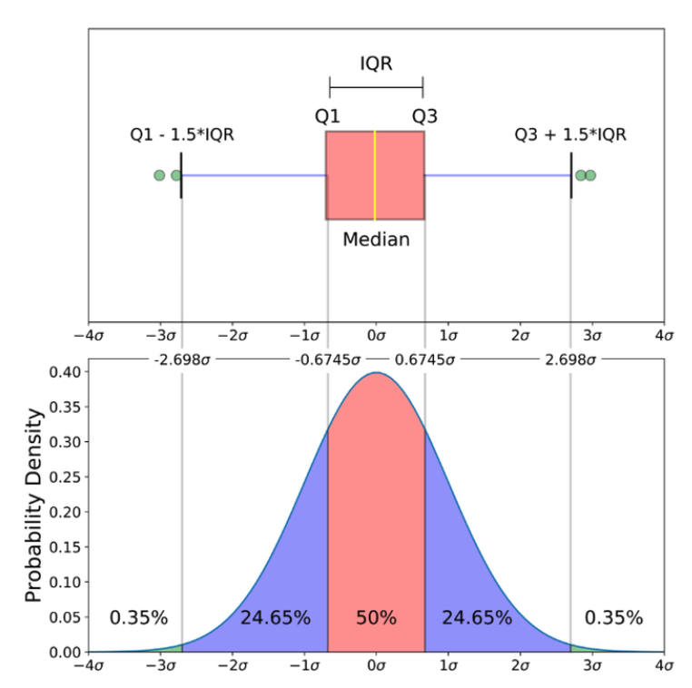

#  常用特征量

## 集中量

### 算术平均数

算术平均数（arithmetic mean）：所有观察值的总和除以总次数所得之商。

**性质1：**各观察值与算术平均数之差（离差）的总和等于零，即：$$\sum_{i=1}^n(X_i-\overline{X})=0$$

**证明**

算术平均数据定义： $$\overline{X}=\frac{1}{n}\sum_{i=1}^nX_i$$

则：

$$\begin{split}\sum_{i=1}^n(X_i-\overline{X})&=\sum_{i=1}^n(X_i-\frac{1}{n}\sum_{i=1}^nX_i)\\&=\left(X_1-\frac{1}{n}(X_1+X_2+\cdots+X_n)\right)\\+&\left(X_2-\frac{1}{n}(X_1+X_2+\cdots+X_n)\right)\\+&\cdots\\+&\left(X_n-\frac{1}{n}(X_1+X_2+\cdots+X_n)\right)\quad(共计 n 项相加)\\&=(X_1+X_2+\cdots+X_n)+n\cdot\frac{1}{n}(X_1+X_2+\cdots+X_n)\\&=0\end{split}$$

证毕。

**性质2：**离均差的平方和最小，即：$$\sum_{i=1}^n(X_i-\overline{X})^2\le\sum_{i=1}^n(X_i-X_0)^2$$

**证明**

设 $$X_0$$ 为任意值，则：

$$\begin{split}\sum_{i=1}^n(X_i-X_0)^2&=\sum_{i=1}^n\left[(X_i-\overline{X})+(\overline{X}-X_0)\right]^2\\&=\sum_{i=1}^n\left[(X_i-\overline{X})^2+2(X_i-\overline{X})(\overline{X}-X_0)+(\overline{X}-X_0)^2\right]\\&=\sum_{i=1}^n(X_i-\overline{X})^2+2(\overline{X}-X_0)\sum_{i=1}^n(X_i-\overline{X})+\sum_{i=1}^n(\overline{X}-X_0)^2\end{split}$$

由性质 1 可知： $$2(\overline{X}-X_0)\sum_{i=1}^n(X_i-\overline{X})=0$$ ，则：

$$\sum_{i=1}^n(X_i-X_0)^2=\sum_{i=1}^n(X_i-\overline{X})^2+\sum_{i=1}^n(\overline{X}-X_0)^2$$

又因为 $$\sum_{i=1}^n(\overline{X}-X_0)^2\ge0$$ ，当 $$X_0=\overline{X}$$ 时取等号，所以：

$$\sum_{i=1}^n(X_i-X_0)^2\ge\sum_{i=1}^n(X_i-\overline{X})^2$$

当 $$X_0=\overline{X}$$ 时取等号。

证毕

### 中位数

中位数（median）：数据按照大小顺序排列后位于最中间的数值。

**补充：**以下资料来自于《机器学习数学基础》（电子工业出版社）

[为什么听到平均工资之后会感到又拖后腿了](https://mp.weixin.qq.com/s/AzFwjqNiPefFDJTvtr7dWA)

### 众数

众数（mode）：数据中出现次数最多的数值。

**扩展**

用程序寻找众数的代码示例

```python
>>> datas
[103, 114, 129, 105, 103, 97, 102, 108, 102, 87, 107, 85, 110, 94, 108, 92, 113, 108, 122, 107, 119, 98, 95, 118, 88, 94, 105, 102, 97, 108]
>>> len(datas)
30
>>> times = {}
>>> for i in datas:
...     if i in times:
...         times[i] += 1
...     else:
...         times[i] = 1
...
>>> times
{103: 2, 114: 1, 129: 1, 105: 2, 97: 2, 102: 3, 108: 4, 87: 1, 107: 2, 85: 1, 110: 1, 94: 2, 92: 1, 113: 1, 122: 1, 119: 1, 98: 1, 95: 1, 118: 1, 88: 1}

# 对上述统计结果进行排序
>>> dict(sorted(times.items(), key=lambda item:item[1]))
{114: 1, 129: 1, 87: 1, 85: 1, 110: 1, 92: 1, 113: 1, 122: 1, 119: 1, 98: 1, 95: 1, 118: 1, 88: 1, 103: 2, 105: 2, 97: 2, 107: 2, 94: 2, 102: 3, 108: 4}

# 除了上述方法之外，还可以用下面的方式，适用于大数据
>>> import numpy as np
>>> from scipy import stats
>>> datas_array = np.array(datas)
>>> mode = stats.mode(datas_array)
>>> mode
ModeResult(mode=array([108]), count=array([4]))
>>> mode[0]
array([108])   # 众数：108
```

### 加权平均

加权平均数（weighted mean）：具有不同权重的数据的平均数。

### 几何平均数

几何平均数（geometric mean）：$$\overline{x}_g=\sqrt[n]{x_1x_2\cdots x_n}$$

将几何平均，用用于按照某个比例增长，并计算平均增长率，其公式为：

$$\overline{r}=\sqrt[n]{(1+r_1)(1+r_2)\cdots(1+r_n)}-1$$

其中 $$\overline{r}$$ 是平均增长率，$$r_1,r_2,\cdots,r_n$$ 是每个阶段（比如每个时间周期）的增长率。

**证明**

设初始值是 $$a$$ ，各个阶段的增长率依次是：$$r_1,r_2,\cdots,r_n$$ ，则：

- 阶段 1 后达到的值是：$$a(1+r_1)$$
- 阶段 2 后达到的值是：$$a(1+r_1)(1+r_n)$$
- $$\vdots$$
- 阶段 n 后达到的值是：$$a(1+r_1)(1+r_n)\cdots(1+r_n)$$

假设每个阶段平均的增长率是 $$\overline{n}$$ ，则阶段 n 后达到的值是：$$a(1+\overline{r})(1+\overline{r})\cdots(1+\overline{r})=a(1+\overline{r})^n$$

所以：

$$\begin{split}a(1+r_1)(1+r_n)\cdots(1+r_n)=a(1+\overline{r})^n\\\overline{r}=\sqrt[n]{(1+r_1)(1+r_n)\cdots(1+r_n)}-1\end{split}$$

证毕。

## 差异量

差异量（measures of dispersion）：描述一组数据离中趋势或离散程度的指标。

### 全距

全距 $$i$$（range）：观察值中最大值与最小值之差。

### 平均差

平均差（average deviation）：所有观察值与算术平均数之差的绝对值的算术平均数。

### 方差和标准差

方差（variance）：离差平方的算术平均数。

标准差（standard deviation）：方差的平方根。

### 变异系数/差异系数

变异系数、差异系数（coefficient of variation）：标准差与其算术平均数的百分比率。

## 地位量

地位量（measures of position）：描述特定的观察值在整个次数分布中所占等级位置的指标。

### 百分位数

百分位数（percentile）：在以一定顺序排列的一组观察值中，某个百分位置所对应的数值。

四分位数（quartile)：将一组已排序的数据按个数四等分的百分位数，分别是位于25%、50%和75%的百分位数。

**补充：**箱线图

在参考资料 [1] 中，对箱线图做了简单介绍，但其中所述并不严谨，下面的资料协助学习者纠偏。

箱线图组成部分说明：

1. 中位数（Q2 / 50th百分位数）：数据集的中间值；
2. 第一四分位数（Q1 / 25百分位数）：最小数（不是“最小值”）和数据集的中位数之间的中间数；
3. 第三四分位数（Q3 / 75th Percentile）：数据集的中位数和最大数之间的中间值（不是“最大值”）；
4. 四分位间距（IQR）：第25至第75个百分点的距离；
5. 晶须（蓝色显示）
6. 离群值（显示为绿色圆圈）
7. “最大”：Q3 + 1.5 * IQR
8. “最低”：Q1 -1.5 * IQR



利用 matplotlib 和 seaborn 等 Python 语言的库可以很方便地绘制箱线图，并且用箱线图也能识别数据集中的离群值。关于这方面的内容请参考 [2] 。

## 偏态量和峰态量

### 偏态量

- 偏态量、偏度（measures of skew）：描述次数分布偏态方向和程度的指标。

- 偏度系数（skew coefficient）：利用算术平均数、中位数和众数的关系来计算的偏态量，一般以算术平均数与众数（或中位数）之差除以标准差作为偏度系数。

  $$SK=\frac{\overline{x}-Mo}{s}$$

- 中心动差（central moments）：离差的k次方的算术平均数。分一级动差（为零）、二级动差（方差）、三级动差（作为偏态量）和四级动差（作为峰态量）。

  $$\mu_k=\frac{1}{n}\sum_{i=1}^n(x_i-\overline{x})^k,\quad(k=1,2,3,4)$$

  - 偏度：$$\gamma_3=\frac{\mu_3}{s^3}$$ ，如果是样本偏度，则 $$s=\sqrt{\frac{1}{n}\sum_{i=1}^n(x_i-\overline{x})^2}$$

- 峰态量（measures of kurtosis）：描述次数分布的陡峭程度（高低宽窄特征）的指标。

  - 四级动差衡量：$$\gamma_4=\frac{\mu_4}{s_4}-3$$ ，所使用样本标准差，则 $$s=\sqrt{\frac{1}{n}\sum_{i=1}^n(x_i-\overline{x})^2}$$

## 参考资料

[1]. 邵志芳，心理统计学，轻工业出版社

[2]. 齐伟，[跟老齐学 Python：数据分析](http://www.itdiffer.com/data.html)，北京：电子工业出版社