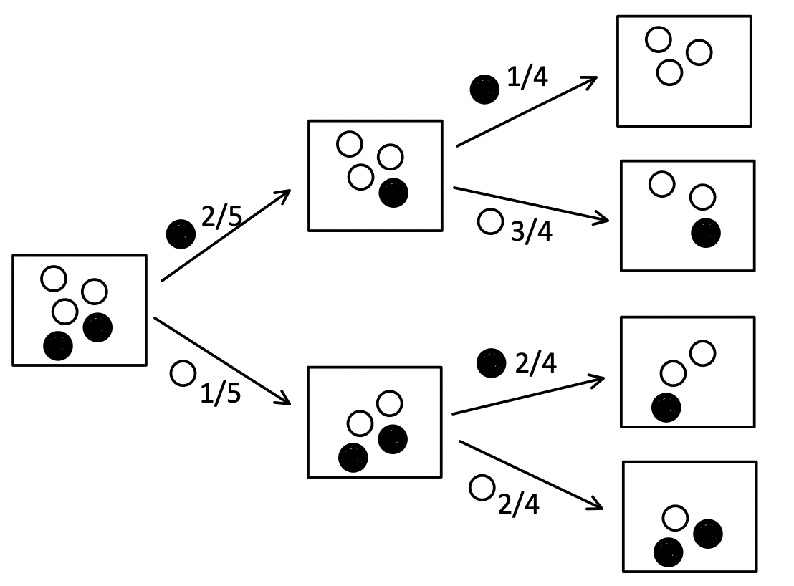

# 概率基础

## 概率

前苏联数学家柯尔莫哥洛夫（Andrey Nikolaevich Kolmogorov）提出的概率公理化体系，他通过三条公理定义了概率：

> 设样本空间 $$\Omega$$ ，对任一事件 $$A$$ 赋予一个实数函数 $$P$$，记作 $$P(A)$$，如果 $P(A)$ 满足：
>
> 1. 非负性：对于任何事件 $$A$$，有 $$P(A) \ge 0$$ 。
> 2. 规范性：对于必然事件 $$\Omega$$，有 $$P(\Omega)=1$$。 
> 3. 可加性：设 $$A_1, A_2, \cdots$$ 是两两互斥的事件（ 即 $$A_i \cap A_j=\phi,(i\ne j,\quad i,j=1,2,\cdots)$$ ），有 $$P(A_1 \cup A_2 \cup \cdots)=P(A_1)+P(A_2)+\cdots$$ ，即若干个互斥事件之和的概率等于各事件概率的和。
>
> 则为 $$P(A)$$ 为事件 $$A$$ 的**概率** $$^{[1]}$$

在[《机器学习数学基础》](http://math.itdiffer.com) $$^{[1]}$$ 中，对概率的定义有完整的阐述，其他与概率基本概念相关的内容，可以参考本网站的：[概率基础](./probability_space.html)有关内容。

将一枚硬币抛 $10$ 次，会不会 $H、T$ 各出现 $5$ 次？“实践是检验真理的唯一标准”，历史上真的有不少人做了这个“实验”，如表5-1-1所示：

表5-1-1

| 实验者     | $n$   | $n_H$ | $f_n(H)$ |
| ---------- | ----- | ----- | -------- |
| 得摩根     | 2048  | 1061  | 0.5181   |
| 蒲丰       | 4040  | 2048  | 0.5069   |
| K · 皮尔逊 | 12000 | 6019  | 0.5016   |
| K · 皮尔逊 | 24000 | 12012 | 0.5005   |

（数据来源：《概率论与数理统计》，盛骤等编著，高等教育出版社，2008.6）

其中 $n$ 表示试验次数，$n_H$ 表示出现 $H$ 的次数，$f_n(H) = \frac{n_H}{n}$ 表示 $H$ 发生的**频率**——注意，不是概率。对于抛硬币这个试验，还可以重复更多次数，结果都显示为频率 $f_n(H)$ 的值趋近于 $0.5$ 。类似这样的情况，不仅仅在抛硬币试验上，人们在长期实践中认识到频率具有稳定性，或者说这是“全人类多年的集体经验”（陈希孺《概率论与数理统计》），即试验次数不断增大时，频率稳定在一个数的附近。所以，可以用这个数表征事件发生的可能性，它就被人们定义为**概率**（probability），例如刚才提到的 $0.5$ 。由于概率是基于大量事件结果而来，所以它是**概率的统计定义**。$$^{[1]}$$

在历史上，较早对概率进行系统研究的，是大名鼎鼎的帕斯卡（Blaise Pascal，有一种编程语言Pascal，就是为了向这位大师致敬而命名）和费马（Pierre de Fermat），他们两个是以通信的方式就“掷骰子和比赛奖金分配”问题进行了研究，这还起源于一个狂热的赌徒向帕斯卡的提问。

“频率的稳定性”不仅仅是经验总结，概率论中的“大数定理”（或“大数定律”）从理论上对此也做出了解释。雅各布·伯努利（Jacob Bernoulli，伯努利家族在数学、科学上名人辈出，图5-1-3是其中的代表人物）所提出的被后世称为“伯努利大数定理”，即“频率收敛于概率”，是最早的理论证明。此后，对大数定理的研究成为了概率论中一个很重要的课题，有许多深刻的研究成果（请参阅陈希孺《概率论与数理统计》。这些理论研究成果，支撑我们在实际应用中，当实验次数很大时，可以用事件的频率来代替事件的概率，这就是生产实际中估计概率的方法。$$^{[1]}$$

在心理统计学教材中，对概率基本知识的介绍较为简单，主要是基于概率的统计定义进行介绍。

- 概率（probability）：某随机事件出现的可能性的大小。
- 随机试验（random experiment）：对随机现象（或随机变量）的观察。
- 随机事件（random event）：随机试验的可能结果。
- 基本空间（fundamental space）：由所有可能发生的试验结果所构成的集合。
- 后验概率（posterior probability）：在大量试验中随机事件出现次数的稳定比率。
- 古典概型（classical probability model）：该模型必须满足两个条件：（a）可能结果的数目是有限的；（b）各个结果出现的可能性被认为是相等的。
- 先验概率（prior probability）：在古典概型中，随机事件的概率为该事件所包含可能结果个数m与所有可能结果的总数n的比值。

**补充**

根据概率的公理，可以得出如下性质$$^{[1]}$$：

- （A1）：$$P(\phi)=0$$

- （A2）：若 $$A_1,A_2, \cdots, A_n$$ 是两两互斥的事件，则：$$P(A_1 \cup A_2 \cup \cdots \cup A_n) = P(A_1)+P(A_2)+\cdots+P(A_n) $$

- （A3）：设 $$A、B$$ 是两个事件，若 $$A \subset B$$ ，则：$$P(B-A) = P(B)-P(A) $$ ，$$P(B)\ge P(A) $$

- （A4）：对任一事件 $$A$$ ，$$P(A) \le 1$$ 。

- （A5）：对任一事件 $$A$$ ，$$P(\overline A )=1 - P(A)$$ 。

- （A6）：对任意两事件 $$A、B$$ ，有 $$P(A\cup B) = P(A) + P(B)-P(A\cap B)$$ 。

## 概率的运算

- 不可能事件（impossible event）：在一定条件下必然不会发生的事件。
- 必然事件（certain event）：在一定条件下必然会发生的事件。
- 事件的和（并）（sum of events）：若干个事件至少有一个发生。
- 事件的积（交）（product of events）：若干个事件同时发生。
- 对立事件（complementary events）：如果在试验中事件A和事件B必有一个发生且仅有一个发生，则称这两个事件互为对立事件。
- 互斥事件（exclusive events）：在一次试验中不可能同时出现的若干个事件。
- 独立事件（independent events）：一个事件是否发生不会影响另一事件，它们就是相互独立的，称为独立事件。
- 小概率事件（small probability event）：发生概率非常小的事件，被认为是在一次试验中实际上不可能发生的事件。
- 条件概率（conditional probability）：如果 $$A$$ 和 $$B$$ 是一定条件组下的两个随机事件，且 $$P(B) \ne0$$ ，则称在 $$B$$ 发生的前提下 $$A$$ 发生的概率为条件概率。

**补充**（以下内容来自参考资料 [1] 的 5.1.3 节）

在概率论中，除了“抛硬币”和“掷骰子”两个典型试验外，“随机取球”也是常常被使用的案例。

例如：一个口袋中有 $$5$$ 个同样的球（颜色、体积、质量、材料等都一样），随机从口袋中取出一个球的事件发生概率就是 $$\frac 1 5$$ 。取出一个球之后，如果把这个球放回袋中，搅匀后再取一个球，这种取球的方式叫做**放回抽样**；取出一个球后，如果不把球放回袋中，第二次从剩余的球中取球，这种取球方式叫做**不放回抽样**。

在这个示例，如果采用放回取样，每次取球的事件之间互不影响，称之为**独立事件**（参阅5.2.1事件的独立性）。如果采用不放回取样，发生在后面的取球事件会受到前面的取球事件影响，即各次事件是**相关的**。在相关事件中，计算每次随机取球的概率就不得不考虑前面的结果了。

依然使用“随机取球”的示例，不过现在假设口袋中的 5 个球是由 $$3$$ 个白球和 $$2$$ 个黑球组成（除了颜色之外，球的体积、质量、材料等都一样），以不放回抽样的方式取球，图5-1-5所示的树状图显示了每次取球的概率。

图 5-1-5 

如果连续取到两个黑球，结合图5-1-5，其概率：

- 用 $$A$$ 表示第一次取到黑球事件，其概率为 $$P(A) = \frac{2}{5}$$ ；
- 在第二次取黑球之前，袋子里面还有 $$3$$ 个白球 $$1$$ 个黑球，用 $$B$$ 表示第二次取到黑球事件，但此事件是以 $$A$$ 为前提条件的，用 $$P(B|A) = \frac{1}{4}$$ 表示；
- 连续取到两个黑球的概率为 $$\frac{2}{5} \times \frac{1}{4} = \frac{1}{10}$$ 。

以 $$P(B|A)$$ 形式所表示的概率，就是**条件概率**（conditional probability）：

> 事件 $$B$$ 在事件 $$A$$ 发生的条件下发生的概率，称为**条件概率**，记作 $$P(B|A)$$，读作 “ $$B$$ 在 $$A$$ 发生的条件下发生的概率”，或者 “ $$B$$ given $$A$$ ”。

当事件 $$A$$ 和事件 $$B$$ 都发生时，就实现了连续取到两个黑球，记作 $$P(A \cap B)$$ 或者 $$P(AB)$$ ，由上面的示例可知：

$$P(A \cap B) = P(A) \cdot P(B|A)  $$        （5.1.3）

由（5.1.3）式可以得到条件概率的定义式：

$$P(B|A)=\frac{P(A \cap B)}{P(A)}   $$        （5.1.4）

其中，$$P(A) \ne 0$$ 。根据（5.1.4）式可得到条件概率如下性质：

- （B1）：若 $$A \cap B = \phi$$ ，则 $$P(B|A)=0$$  。
- （B2）：若 $$A \subset B$$ ，则 $$A \cap B = A$$ ，故 $$P(B|A)=\frac{P(A)}{P(A)}=1$$ 。
- （B3）：若 $$B \subset A$$ ，则 $$A \cap B = B$$ ，故 $$P(B|A)=\frac{P(B)}{P(A)} \ge 1$$  （注：根据5.1.2节中概率性质（A4）， $$P(A) \le 1$$ ）。

## 参考资料

[1]. 齐伟，[机器学习数学基础](http://math.itdiffer.com)，北京：电子工业出版社

