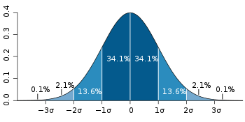

# 概率分布

## 二项分布

二项试验（binomial experiment）：满足以下条件的试验：

- （a）一次试验只有两种可能的结果（“成功”和“失败”）；
- （b）试验可以在同样的条件下重复进行；
- （c）可以用计数来表示成功或失败的次数；
- （d）各次试验中成功的概率 $$p$$ 相同，失败的概率 $$q$$ 也相同，且 $$p+q=1$$
- （e）各次试验的结果相互独立。

二项分布（binomial distribution）：重复进行 $$n$$ 次二项试验后不同的成功次数所对应的概率分布。它是用 $$n$$ 次方的二项展开式来表达在 $$n$$ 次二项试验中不同的成功次数（ $$x=0,1,\cdots,n$$ ）的概率分布。

## 正态分布

概率密度函数（probability density function）：如果函数 $$f(x)$$ 的曲线与 $$x$$ 轴围成的面积等于 $$1$$ ，则称 $$f(x)$$ 为连续型随机变量 $$X$$ 的概率密度函数。

- 正态分布（normal distribution）：如果随机变量 $$X$$ 的概率密度函数为 $$f(x)=\frac{1}{\sqrt{2\pi}\sigma}e^{-\frac{(x-\mu)^2}{2\sigma^2}}$$ ，则称 $$X$$ 服从正态分布。记作：$$X\sim N(\mu, \sigma^2)$$ 
- 标准正态分布（standard normal distribution）：如果随机变量X的概率密度函数为 $$\varphi(x)=\frac{1}{\sqrt{2\pi}}e^{-\frac{x^2}{2}}$$ ，则称 $$X$$ 服从标准正态分布。记作：$$X\sim N(0, 1^2)$$
- 标准分数（standard score,Z-score）：服从正态分布的 $$X$$ 变量用 $$Z=\frac{X-\mu}{\sigma}$$ 或 $$Z=\frac{X-\overline{X}}{S}$$进行 转换得到的 Z 值。
- T分数（T-score）：将 Z 分数进行线性转换所获得的分数，转换公式为 $$T=KZ+C$$ 。

**补充**

深藍色區域是距平均值小於一個標準差之內的數值範圍。在正态分布中，此範圍所佔比率為全部數值之**68%**，根據正态分布，兩個標準差之內的比率合起來為**95%**；三個標準差之內的比率合起來為**99%**。

在實際應用上，常考慮一組數據具有近似於正态分布的概率分布。若其假設正確，則約**68.3%**數值分布在距離平均值有 1 個標準差之內的範圍，約**95.4%**數值分布在距離平均值有 2 個標準差之內的範圍，以及約**99.7%**數值分布在距離平均值有3個標準差之內的範圍。稱為「**[68-95-99.7法則](https://zh.wikipedia.org/wiki/68–95–99.7原則)**」或「**經驗法則**」。$$^{[3]}$$ 

| 標準差值                                                  | 機率              | 包含之外比例     |                                          |
| --------------------------------------------------------- | ----------------- | ---------------- | ---------------------------------------- |
|                                                           | 百分比            | 百分比           | 比例                                     |
| 0.318639*σ*                                               | 25%               | 75%              | 3 / 4                                    |
| 0.674490*σ*                                               | 50%               | 50%              | 1 / 2                                    |
| 0.994458*σ*                                               | 68%               | 32%              | 1 / 3.125                                |
| 1*σ*                                                      | 68.2689492%       | 31.7310508%      | 1 / 3.1514872                            |
| 1.281552*σ*                                               | 80%               | 20%              | 1 / 5                                    |
| 1.644854*σ*                                               | 90%               | 10%              | 1 / 10                                   |
| 1.959964*σ*                                               | 95%               | 5%               | 1 / 20                                   |
| 2*σ*                                                      | 95.4499736%       | 4.5500264%       | 1 / 21.977895                            |
| 2.575829*σ*                                               | 99%               | 1%               | 1 / 100                                  |
| 3*σ*                                                      | 99.7300204%       | 0.2699796%       | 1 / 370.398                              |
| 3.290527*σ*                                               | 99.9%             | 0.1%             | 1 / 1000                                 |
| 3.890592*σ*                                               | 99.99%            | 0.01%            | 1 / 10000                                |
| 4*σ*                                                      | 99.993666%        | 0.006334%        | 1 / 15787                                |
| 4.417173*σ*                                               | 99.999%           | 0.001%           | 1 / 100000                               |
| 4.5*σ*                                                    | 99.9993204653751% | 0.0006795346249% | 1 / 147159.5358 3.4 / 1000000 (*每一邊*) |
| 4.891638*σ*                                               | 99.9999%          | 0.0001%          | 1 / 1000000                              |
| 5*σ*                                                      | 99.9999426697%    | 0.0000573303%    | 1 / 1744278                              |
| 5.326724*σ*                                               | 99.99999%         | 0.00001%         | 1 / 10000000                             |
| 5.730729*σ*                                               | 99.999999%        | 0.000001%        | 1 / 100000000                            |
| [6*σ*](https://zh.wikipedia.org/wiki/六標準差#西格玛等级) | 99.9999998027%    | 0.0000001973%    | 1 / 506797346                            |
| 6.109410*σ*                                               | 99.9999999%       | 0.0000001%       | 1 / 1000000000                           |
| 6.466951*σ*                                               | 99.99999999%      | 0.00000001%      | 1 / 10000000000                          |
| 6.806502*σ*                                               | 99.999999999%     | 0.000000001%     | 1 / 100000000000                         |
| 7*σ*                                                      | 99.9999999997440% | 0.000000000256%  | 1 / 390682215445                         |

## t 分布和泊松分布、指数分布

- t 分布（t-distribution）：又称“学生 t 分布”，如果随机变量 t 的概率密度函数为 $$f(t)=\frac{\Gamma\left(\frac{n+1}{2}\right)}{\sqrt{n\pi}\Gamma\left(\frac{n}{2}\right)}\left(1+\frac{t^2}{n}\right)^{-\frac{n+1}{2}}$$ ，则称 t 服从 t 分布。
- 自由度（degree of freedom）：总体参数估计量中变量值独立自由变化的个数。
- 泊松分布（Poisson distribution）：若随机变量 $$X$$ 的概率分布为 $$P\{X=x\}=\frac{\lambda ^x}{x!}e^{-\lambda}$$ 其中，$$x=0,1,2,\cdots; \lambda>0$$ ，则称随机变量 $$X$$ 服从参数为$$\lambda$$ 的泊松分布。
- 指数分布（exponential distribution）：若随机变量 $$t$$ 的概率密度函数为 $$f(t) = \begin{cases}\lambda e^{-\lambda t} \quad &(t \gt 0,\lambda>0)\\0 &(t \le 0)\end{cases}  $$，则称 $$t$$ 服从参数为 $$\lambda$$ 的指数分布。

## 参考资料

[1]. 邵志芳，心理统计学，轻工业出版社

[2]. 齐伟，[机器学习数学基础](http://math.itdiffer.com)，北京：电子工业出版社

[3]. [维基百科：正态分布](https://zh.wikipedia.org/wiki/%E6%AD%A3%E6%80%81%E5%88%86%E5%B8%83)