# 聚类

对于现实世界的数据而言，一类是有标签，另外一类就是没有标签的。对于没有标签的数据，我们采用“无监督学习”，借以揭示这些数据的内在规律。比如某公司有100名程序员，记录了若干天内他们提交代码的行数和提交次数。这些数据并没有标明哪个人是什么级别的开发者。通过“无监督学习”的某种算法，能够将从这些数据中发现某些内在的或潜藏的规律。当然，到底是什么规律，在结果揭示之前是无法得知的。甚至于当得到了某种结果之后，也还要有关人员对结果进行解读，才能表述为某种规律。

常见的无监督学习包括：密度估计（density estimation）、异常检测（anomaly detection）、聚类（clustering）。其中聚类是研究和应用最广泛的。$$^{[2]}$$

## 基本概念

聚类，即将数据集中的样本划分为若干个不相交的子集，每个子集称为一个“簇”（cluster）。

目标是簇内样本相似度高、簇间相似度低；簇和簇之间的距离尽可能大，簇内样本与簇中心的距离尽可能小。

聚类所得到的簇，可以用下列术语描述：

- **聚类质心（中心）**：一个簇所有样本点的均值（或质心）
- **簇大小**：簇中所含样本的数量
- **簇密度**：簇中样本点的分布
- **簇描述**：簇中样本的业务特征

聚类算法在工程（如机器学习、人工智能、机械工程、电子工程）、计算机科学、生物医学 、地球科学（如遥感 )、社会科学 (如心理学 )、经济学等领域都有广泛的应用 。聚类算法和模式识别、模式分类密切相关 ，是模式识别和模式分类的基础。

> **聚类不是分类**
>
> 分类是根据已有的标准对样本进行判断划分。在分类之前，已经有了对数据的划分标准。
>
> 聚类则不然，在得出结论之前，并不知道每一类有什么特点。必须要根据聚类的结果再结合人的经验，才能阐述其特点。

聚类可以有两个应用场景：

- 作为单独的过程，用于发现数据内部的结构和特点
- 作为“有监督学习”的前置过程

导致聚类结果好坏的因素主要有以下三个：

- 聚类数目
- 数据点之间的距离函数
- 聚类算法

### 聚类的算法

聚类算法比较多，是机器学习中“新算法”出现最多、最快的领域。一个重要原因是聚类不存在客观标准，给定数据集，总能从某个角度找到以往算法未覆盖的某种标准，从而设计出新算法。而且聚类的知识目前还不系统化$$^{[2]}$$。以下列出目前常见的几类$$^{[9]}$$：

1. 基于划分的方法

   - k 均值算法
   - K-modes
   - PAM(Partitioning Around Medoids)
   - CLARA (Clustering Large Applications)
   - AP (Affinity Propagation Clustering)
   - SPEA (Spectral Analysis，谱分析方法)
2. 基于层次的方法
3. 基于密度的方法

   - Mean shift 算法

   - DBSCAN 算法

   - OPTICS 算法
   
   - DENCLUE 算法
4. 基于网格的方法
5. 基于模型的方法
6. 模糊聚类方法
7. 基于图论的方法
8. 基于分形的方法
9. 复杂网络聚类方法
10. 仿生法
11. 核聚类方法

此处抽取上述的几种算法，给予简要介绍。

## K-均值（K-Means）算法

这是一种基于划分的算法。所谓“划分”，就是将训练集的样本分为若干部分，每一部分称为“一个划分”。通常这些部分是互斥的，每一个部分就是以“簇”。

### 基本原理

K-均值（K-Means）算法是由 MacQueen 于 1967 年提出的，它的基本思想是：找出数据集的 k 个质心，把数据集划分为 k 个簇，使得数据集中的数据点与所属簇的质心的距离平方和最小。

给定数据集样本 $$D=\{\pmb{x}_1,\pmb{x}_2,\cdots,\pmb{x}_N\}$$ ，用 $$\pmb{x}_n$$ 表示其中任一样本，则此数据集可以写成 $$\{\pmb{x}_n\}_{n=1}^N$$ 。并假设通过聚类算法，将每个样本都划分到了 $$\pmb{C}=\{C_1,C_2,\cdots,C_K\}$$ 中的某一个簇。用 $$\pmb{\mu}_k$$ 表示某个簇的质心。

样本与质心之间的距离用欧几里得距离计算：$$\begin{Vmatrix}\pmb{x}_n-\pmb{\mu}_k\end{Vmatrix}_2$$ ，为了避免开方，通常使用距离的平方 $$\begin{Vmatrix}\pmb{x}_n-\pmb{\mu}_k\end{Vmatrix}_2^2$$ 进行计算$$^{[1]}$$ 。

于是可以写出目标函数$$^{[4]}$$：
$$
J(\{\pmb{r}_n\}_{n=1}^N,\{\pmb{\mu}_k\}_{k=1}^K)=\sum_{n=1}^N\sum_{k=1}^Kr_{nk}\begin{Vmatrix}\pmb{x}_n-\pmb{\mu}_k\end{Vmatrix}_2^2\tag{1}
$$
其中 $$\pmb{r}_n$$ 是一个指示向量，如果样本 $$\pmb{x}_n$$ 属于簇 $$k$$ ，则可以设置为 $$r_{nk}=1$$ ，其它的则都是 $$0$$ ：
$$
r_{nk}=\begin{cases}1,\quad \pmb{x}_n\in C_k\\0,\quad \text{otherwise}\end{cases}\tag{2}
$$
K-均值算法就是对（1）最小化。其中涉及到两个变量：$$\pmb{r}_n$$ 和 $$\pmb{\mu}_k$$ 。

根据（2）式可知，$$\pmb{r}_n$$ 仅会影响数据集中一个样本的值，如果选用（2）式，则对该样本的距离影响最小化了。

关键是如何找到代表每个簇的质心。

如果 $$\pmb{r}_n$$ 按照（2）式取值，对于簇 $$k$$ ，质心 $$\pmb{\mu}_k$$ 则仅与该簇内的样本相关，由（1）式得：
$$
\begin{split}
J(\pmb{u}_k)&=\sum_{n=1}^Nr_{nk}\begin{Vmatrix}\pmb{x}_n-\pmb{\mu}_k\end{Vmatrix}_2^2
\\&=\sum_{n=1}^Nr_{nk}(\pmb{x}_n-\pmb{\mu}_k)^{\text{T}}(\pmb{x}_n-\pmb{\mu}_k)
\end{split}\tag{3}
$$
要让（1）式最小化，也就是（3）式最小化，则要对（3）式对 $$\pmb{\mu}_k$$ 求梯度，并令梯度为零。
$$
\begin{split}
\nabla_{\pmb{\mu}_k}J(\pmb{\mu}_k)&=\nabla_{\pmb{\mu}_k}\sum_{n=1}^Nr_{nk}(\pmb{x}_n-\pmb{\mu}_k)^{\text{T}}(\pmb{x}_n-\pmb{\mu}_k)
\\&=\sum_{n=1}^Nr_{nk}\nabla_{\pmb{\mu}_k}(\pmb{x}_n-\pmb{\mu}_k)^{\text{T}}(\pmb{x}_n-\pmb{\mu}_k)
\\&=-2\sum_{n=1}^Nr_{nk}(\pmb{x}_n-\pmb{\mu}_k)\quad(\because\nabla_{\pmb{a}}\pmb{a}^\text{T}\pmb{a}=2\pmb{a})^{[1]}
\\&=0
\end{split}\tag{4}
$$
则：
$$
\begin{split}
\sum_{n=1}^Nr_{nk}\pmb{x}_n&=\pmb{u}_k\sum_{n=1}^Nr_{nk}
\\\pmb{\mu}_k&=\frac{\sum\limits_{n=1}^Nr_{nk}\pmb{x}_n}{\sum\limits_{n=1}^Nr_{nk}}
\end{split}\tag{5}
$$
由此可知，对于（1）式，使用欧几里得距离的情况下，当每个簇的质心 $$\pmb{u}_k$$ 是该簇内的样本均值时，（1）式最小化。“K-means”（K-	均值）中的 “means”（均值）就是（5）所得。

（1）式结果越小，则说明簇内的样本相似度越高，亦即簇内样本点与质心的距离和的平方最小（最小化平方误差）：
$$
\sum_{n=1}^N\min_{\pmb{\mu}_k\in C_k}(\begin{Vmatrix}\pmb{x}_n-\pmb{\mu}_k\end{Vmatrix}_2^2)\tag{6}
$$
在 sklearn 的官方文档以及其他一些资料中，将（6）式称为“inertia”，暂时翻译为“惯性”$$^{[7]}$$ 。

> 可以将每一簇看做类似物理中的有质量的物体，每个物体有一个质心。（6）式的含义就好比找到一个合适的质心，将一定范围内的同类物质最低限度地包含进来，也就是质量最小。而物理学中，惯性是质量的度量。所以将（6）式称为“惯性”。
>
> 牵强吗？

基于上述结果，可以得到 K-均值的算法过程，如下：

1. 在训练集中，随机选择 k 个初始质心（k 是超参数），即设定 k 个簇
2. 计算训练集中其他样本点与上述质心的距离，并该样本点归入到相距最小的质心所在的簇；
3. 重新计算每个簇的质心。
4. 迭代计算各个样本到上述新的质心距离，对样本重新划分。
5. 重复2-4，直到质心不再变化或者达到最大迭代次数。

下图直观地显示了 K-均值的迭代过程，其中 $$k=3$$ ，特别要观察每个簇的质心变化以及样本点的所属簇的变化。

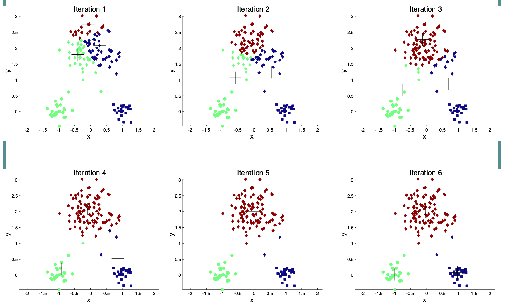

### 实践案例

对于 K-均值算法，在实际的计算中，（1）式的最小化是一个NP困难问题（NP-hard）。就如同上述算法过程描述那样，通常要首先随机指定初始质心，然后通过迭代方式近似求解。近几年，有研究者对初始质心提出改进，并形成了 “K-Means++ 算法”$$^{[5]}$$ 。

另外，对于数据而言，不同特征的数据，会由于单位（量纲）等的差异，其分布范围相差很大。显然需要对它们进行“标准差标准化变换”$$^{[6]}$$ ，从而能够实现每个特征的数据平均数是 $$0$$ ，标准差是 $$1$$ 。

（1）导入必要的模块

```python
import pandas as pd
import numpy as np
import matplotlib.pyplot as plt
from sklearn.cluster import KMeans
from sklearn.preprocessing import StandardScaler
```

（2）创建数据集

假设一个数据集，记录了篮球运动员的得分（points）、助攻（assists）和篮板球（rebounds）数量。

```python
df = pd.DataFrame({'points': [18, np.nan, 19, 14, 14, 11, 20, 28, 30, 31,
                              35, 33, 29, 25, 25, 27, 29, 30, 19, 23],
                   'assists': [3, 3, 4, 5, 4, 7, 8, 7, 6, 9, 12, 14,
                               np.nan, 9, 4, 3, 4, 12, 15, 11],
                   'rebounds': [15, 14, 14, 10, 8, 14, 13, 9, 5, 4,
                                11, 6, 5, 5, 3, 8, 12, 7, 6, 5]})
print(df.head())
```

（3）数据清洗

很显然，在上述创建数据的时候，已经引入了缺失值。对于缺失值，可以实施填充、删除等操作，具体内容见参考资料 [6] 。此处删除含有缺失值的样本。

```python
df = df.dropna()
```

再查看对数据集各个特征的统计：

```python
df.describe()
```

输出：

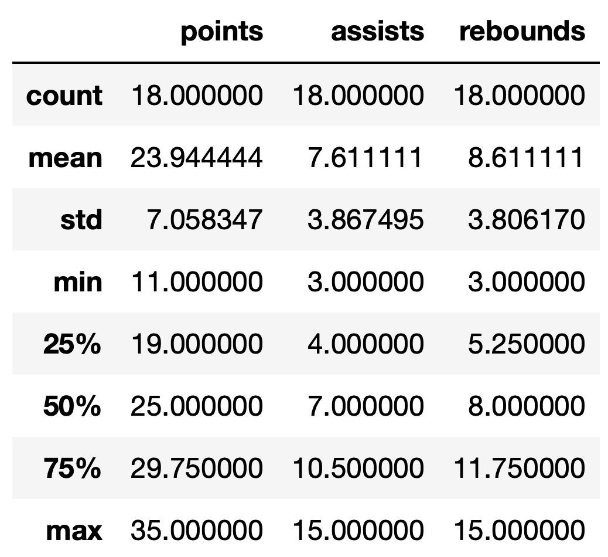

从输出结果可知，各个特征之间的方差有明显差距，故需要进行标准差标准化变换。

```python
scaled_df = StandardScaler().fit_transform(df)

# 显示前五条记录
print(scaled_df[:5])
```

（4）寻找最优的聚类数量，即 k 值

`sklearn` 中的 `KMeans` 模型参数如下：

```python
class sklearn.cluster.KMeans(n_clusters=8, *, init='k-means++', n_init=10, max_iter=300, tol=0.0001, verbose=0, random_state=None, copy_x=True, algorithm='lloyd')
```

参数说明：

- `n_clusters` ：指定簇的数量。但这个值需要通过下述的方式找到最合适的。
- `init`：指定初始质心的策略。可以取如下值：
  - `k-means++`：根据数据点对所有簇的全部惯性的贡献的经验概率分布，选择簇的初始质心。这种技术加快了收敛速度，理论证明是最优的。
  - `random`：从数据集中随机选择 `n_clusters` 所设定的样本作为初始质心。
  - 也可以用 `(n_clusters, n_features)` 的形式提供一个数组，用以作为初始质心。
- `n_init=10`：K-均值算法以不同的质心运行的次数，每一次都会更新质心，最终算法选择能令惯性最优的 `n_init` 值作为输出。
- `max_iter=300` ：在单轮 K-均值算法中，最大的迭代次数。算法的总的最大迭代次数是 `max_iter * n_init`。

重要的属性：

- `cluster_centers_` ：给出簇的质心（以 `(n_clusters, n_features)` 的数组形式）。
- `labels_`：每个样本所属的簇的标记。
- `inertia_`：样本到最近簇的质心的距离平方之和，如果提供了样本权重，则按样本权重加权。即（6）式的惯性。

```python
# 初始化 kmeans 的参数
kmeans_kwargs = {
    "init": "random",
    "n_init": 10,
    "random_state": 1,
}

# 创建列表，用于保存模型的属性 inertia_ 的值，即 sum of squared errors，误差平方的总和
sse = []
for k in range(1, 11):
    kmeans = KMeans(n_clusters=k, **kmeans_kwargs)
    kmeans.fit(scaled_df)
    sse.append(kmeans.inertia_)

# 将 sse 的结果可视化
plt.plot(range(1, 11), sse)
plt.xticks(range(1, 11))
plt.xlabel("Number of Clusters")
plt.ylabel("SSE")
plt.show()
```

输出：

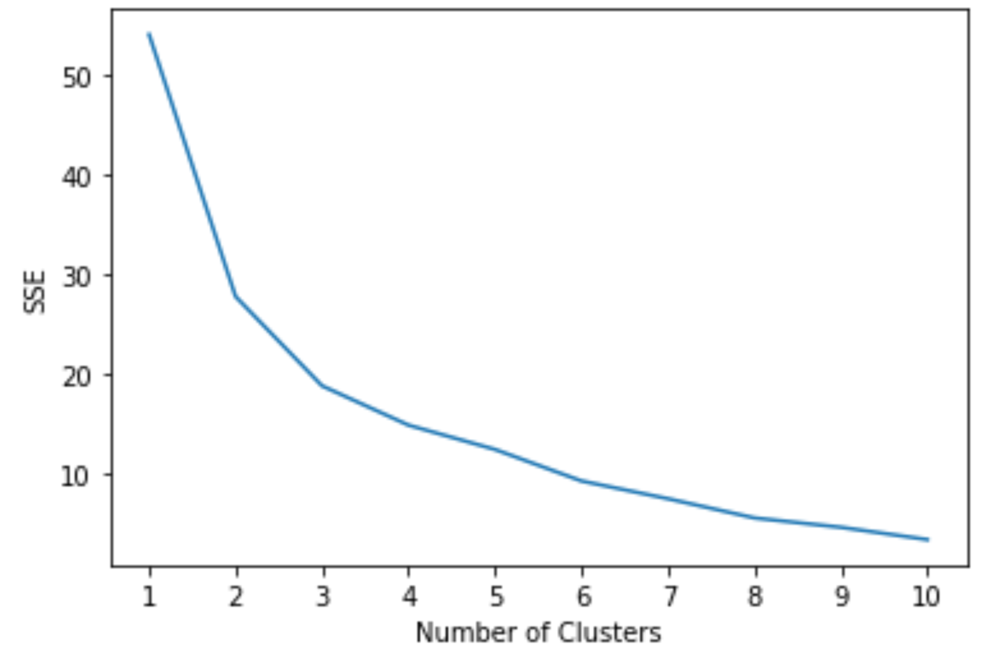

一般，要根据图示，寻找“拐点”，即误差的平方和（惯性）开始变得弯曲或者平缓的位置，该位置的值就是最佳簇数，即 k 值。由上图可知：k=3 ，即参数 `n_culusters=3` 最佳。

（5）创建模型

```python
kmeans = KMeans(init="random", n_clusters=3, n_init=10, random_state=1)

# 训练模型
kmeans.fit(scaled_df)

# 输出每个样本的簇标记
kmeans.labels_
```

将上述的每个样本所属簇的标记作为一个特征，加入到原数据集中，即得到了原数据集中每个样本的标签。

```python
df['cluster'] = kmeans.labels_

print(df)
```

### K-均值算法评析

- 算法原理简单，容易实现，且运行效率比较高
- 聚类结果容易解释，适用于高维数据的聚类
- 对（1）式的最小化，采用贪心策略，通过迭代优化求近似解，这样容易导致局部收敛，在大规模数据集上求解速度较慢。
- 对离群值和噪声敏感，少量的离群值和噪声可能会对算法中的平均值产生极大影响，从而影响聚类结果。
- （6）式的惯性（inertia）假设簇是凸的和各向同性的，但情况并非总是如此。它对细长的或形状不规则的有多个分支形状的簇，表现会很差。
- 惯性不是一个标准化的度量：我们只知道值越低越好，而零是最佳的。但在高维空间中，欧氏距离往往会膨胀（这是所谓的“维数诅咒”、“维数灾难”的一个例子）。通常在 K-均值聚类之前通过主成分分析（PCA）等降维算法可以缓解此问题并加快计算速度。
- 初始聚类质心对结果影响较大，不同的初始质心可能导致不同的聚类结果。对于初始质心的设置问题，如果将 `sklearn` 的 `KMeans` 模型的参数 `init='k-means++'` 则使用了改进的 K-均值算法 “K-Means++”。

### K-Means++

`sklearn` 中可以用两种方式实现 `K-Means++` 算法，除了上述在 `KMeans` 中的参数设置之外，还可以用：

 ```python
 sklearn.cluster.kmeans_plusplus(X, n_clusters, *, x_squared_norms=None, random_state=None, n_local_trials=None)
 ```

K-Means++ 算法提高了收敛速度，但相比之前随机选择质心，计算量变大了。

### 小批量 K-均值

在 `sklearn` 中，除了 `KMeans` 模型之外，还提供了 `MiniBatchKMeans` 模型，它是 `KMeans` 的变体，使用小批量来减少计算时间，同时仍优化相同的目标函数（1）式。它的主要变化在于：对于每次迭代训练的数据集，从中随机提取其子集，即所谓的“小批量”（Mini-batch）。这样做能够减少达到收敛的计算量。`MiniBatchKMeans` 的收敛速度比 `KMeans` 快，但结果的质量会降低。在实践中，这种质量差异可能非常小。

下面的案例，比较 `KMeans` 和 `MiniBatchKMeans` 两个模型$$^{[8]}$$。

（1）围绕三个质心创建数据

```python
import numpy as np
from sklearn.datasets import make_blobs

np.random.seed(0)

batch_size = 45
centers = [[1, 1], [-1, -1], [1, -1]]
n_clusters = len(centers)
X, labels_true = make_blobs(n_samples=3000, centers=centers, cluster_std=0.7)
```

（2）用 `KMeans` 模型聚类，并记录训练时间间隔

```python
import time
from sklearn.cluster import KMeans

k_means = KMeans(init="k-means++", n_clusters=3, n_init=10)
t0 = time.time()  # 开始
k_means.fit(X)
t_batch = time.time() - t0  # 时间间隔
print(t_batch)

# 输出
0.07724308967590332
```

（3）用 `MiniBatchKMeans` 模型聚类，并记录训练时间间隔

```python
from sklearn.cluster import MiniBatchKMeans

mbk = MiniBatchKMeans(
    init="k-means++",
    n_clusters=3,
    batch_size=batch_size,
    n_init=10,
    max_no_improvement=10,
    verbose=0,
)
t0 = time.time()
mbk.fit(X)
t_mini_batch = time.time() - t0
print(t_mini_batch)

# 输出
0.07477903366088867
```

（4）为可视化做准备

在可视化图中，将两种模型聚类得到的数据点，对应的簇中的数据，用同样的颜色标示。因此，要将两个模型所得的簇以及其中的数据点对应起来。

```python
# 显示两个模型聚类结果的质心
print("K-Means centers:")
print(k_means.cluster_centers_)
print("MiniBatchMeans centers:")
print(mbk.cluster_centers_)

# output
K-Means centers:
[[-1.07262225 -1.00554224]
 [ 1.07510478 -1.06937206]
 [ 0.96786467  1.0173955 ]]
MiniBatchMeans centers:
[[ 0.97209774  1.02960668]
 [-1.03319086 -0.96876381]
 [ 1.09657842 -1.06909628]]
```

将两个聚类结果的质心对应起来，为了达到这个目的，使用 `sklearn.metrics.pairwise_distances_argmin(X, Y, *, axis=1, metric='euclidean', metric_kwargs=None)` ，此函数返回 `X` 的一行与 `Y` 中相对应的行的索引（都是从 $$0$$ 开始计数，`X` 和 `Y` 是二维数组）。实则是通过计算两个参数的每一行之间的距离得出的。

```python
from sklearn.metrics.pairwise import pairwise_distances_argmin
order = pairwise_distances_argmin(k_means.cluster_centers_, mbk.cluster_centers_)
print(order)

# output
[1 2 0]
```

这说明，`k_means.cluster_centers_` 的第一行与 `mbk.cluster_centers_` 的第二行（索引是 $$1$$）对应；前者第二行与后者第三行对应；前者第三行与后者第一行对应。亦即找到了两个模型所得的质心向量之间的对应结果。

```python
k_means_cluster_centers = k_means.cluster_centers_       # K-Means 质心
mbk_means_cluster_centers = mbk.cluster_centers_[order]  # MiniBatchMeans 质心，并且顺序与前者对应

# 得到样本点与质心的对应关系
k_means_labels = pairwise_distances_argmin(X, k_means_cluster_centers)       
mbk_means_labels = pairwise_distances_argmin(X, mbk_means_cluster_centers)
```

（5）可视化

```python
import matplotlib.pyplot as plt

fig = plt.figure(figsize=(8, 3))
fig.subplots_adjust(left=0.02, right=0.98, bottom=0.05, top=0.9)
colors = ["#4EACC5", "#FF9C34", "#4E9A06"]

# KMeans
ax = fig.add_subplot(1, 3, 1)
for k, col in zip(range(n_clusters), colors):
    my_members = k_means_labels == k
    cluster_center = k_means_cluster_centers[k]
    ax.plot(X[my_members, 0], X[my_members, 1], "w", markerfacecolor=col, marker=".")
    ax.plot(
        cluster_center[0],
        cluster_center[1],
        "o",
        markerfacecolor=col,
        markeredgecolor="k",
        markersize=6,
    )
ax.set_title("KMeans")
ax.set_xticks(())
ax.set_yticks(())
plt.text(-3.5, 1.8, "train time: %.2fs\ninertia: %f" % (t_batch, k_means.inertia_))

# MiniBatchKMeans
ax = fig.add_subplot(1, 3, 2)
for k, col in zip(range(n_clusters), colors):
    my_members = mbk_means_labels == k
    cluster_center = mbk_means_cluster_centers[k]
    ax.plot(X[my_members, 0], X[my_members, 1], "w", markerfacecolor=col, marker=".")
    ax.plot(
        cluster_center[0],
        cluster_center[1],
        "o",
        markerfacecolor=col,
        markeredgecolor="k",
        markersize=6,
    )
ax.set_title("MiniBatchKMeans")
ax.set_xticks(())
ax.set_yticks(())
plt.text(-3.5, 1.8, "train time: %.2fs\ninertia: %f" % (t_mini_batch, mbk.inertia_))

# Initialize the different array to all False
different = mbk_means_labels == 4
ax = fig.add_subplot(1, 3, 3)

for k in range(n_clusters):
    different += (k_means_labels == k) != (mbk_means_labels == k)

identic = np.logical_not(different)
ax.plot(X[identic, 0], X[identic, 1], "w", markerfacecolor="#bbbbbb", marker=".")
ax.plot(X[different, 0], X[different, 1], "w", markerfacecolor="m", marker=".")
ax.set_title("Difference")
ax.set_xticks(())
ax.set_yticks(())

plt.show()
```

输出结果


从图中可以清晰看出来，两者的聚类结果，差距很小。

## AP 算法

### 基本原理$$^{[9]}$$

> 假设到了一个全新的群体中，没有一个人是你认识的，此时只有你自己可以代表自己。然后，经过与他人交流，发现有的人跟你三观相近，有的人则完全不同，于是经过不断的沟通，就找到了与自己三观相合的小团体，这个小团体中会有一个代表（不一定是某个人，也可能是大家公认的思想等），你也认同它能够代表你自己了。

AP 算法，即 Affinity Propagation Clustering，通常译为“亲密度传播聚类”。这种算法是由 Frey 等人在 2007 年提出的。算法特点：快速、有效。AP 算法经过人脸图像聚类、文本中关键词句子选择、基因片段聚类以及航空线路规划等试验中的测试，证明其不仅聚类效果更好，而且对于大规模数据集而言，花费时间只有其他聚类方法的百分之一。对于小规模的数据集，该算法聚类结果的正确性与效率和其他方法相当或略优，偶尔会有不及。

AP 算法初始时将所有的数据点都视为潜在的聚类中心（质心），将两个点之间的欧氏距离的负值作为度量它们相似度的方法：
$$
s(i,k)=-\begin{Vmatrix}\pmb{x}_i-\pmb{x}_k\end{Vmatrix}_2^2\tag{7}
$$
这种相互间的相似度，可以作为彼此的**吸引度**或**归属度**，如果点 $$k$$ 对较近的点 $$i$$ 的吸引力比较大，同样点 $$i$$ 认同点 $$k$$ 为其质心的归属感也较强。这样，数据点 $$k$$ 对其他数据点的吸引力之和越大 ，成为质心的可能性也越大 ，反之可能性就越小 。

以此原理出发，AP 算法为了能选出合适的质心，需要不断从数据集中搜集和传递有关的消息 (Message)：

- 为候选的质心 $$k$$ 从数据集中每个数据点 $$i$$ 搜集消息 $$r(i,k)$$ （称为点 $$k$$ 对点 $$i$$ 的 **responsibility** 或**吸引度**）来描述数据点 $$k$$ 作为数据点 $$i$$ 的质心的适合程度；
- 同时收集消息 $$a(i，k)$$ （称为点 $$i$$ 对点 $$k$$ 的 **availability** 或**归属度**）来描述数据点 $$i$$ 选择数据点 $$k$$ 作为其质心的适合程度 。

$$r(i，k)$$ 与 $$a(i，k)$$ 越大，点 $$k$$ 作为最终聚类质心的可能性就越大。

用公式表示，则为$$^{[8]}$$：
$$
\begin{split}
r(i,k)\leftarrow s(i,k)-\max[a(i,k^\prime)+s(i,k^\prime)\forall k'\neq k]
\\
r(i, k) \leftarrow \min[0, r(k, k) + \sum_{i'~s.t.~i' \notin \{i, k\}}{r(i', k)}]
\end{split}\tag{8}
$$
其中，$$s(i,k)$$ 是数据点 $$i$$ 和 $$k$$ 的相似度。$$r(i，k)$$ 与 $$a(i，k)$$ 的初始值均设置为 $$0$$ ，然后迭代计算直到收敛。 为了避免在更新消息时出现数值振荡，在迭代过程中引入了阻尼因子：
$$
r_{t+1}(i, k) = \lambda\cdot r_{t}(i, k) + (1-\lambda)\cdot r_{t+1}(i, k)\\
a_{t+1}(i, k) = \lambda\cdot a_{t}(i, k) + (1-\lambda)\cdot a_{t+1}(i, k)\tag{9}
$$
AP 算法通过迭代，循环不断地进行消息的搜集和传递，以产生 $$m$$ 个高质量的聚类质心，同时聚类的目标函数（1）式也得到了最优化 ，数据集中各个数据点也最终归类于各个以质心为代表的所属的簇。

AP 算法并不明确要求指定簇的数目。

AP 算法与 K-Means 算法等同属于 K 中心聚类方法 。二者的区别在于：

- 经典的 K-Means 算法的优点是简单 、快速而且能有效处理大规模数据集 ，然而算法对初始聚类质心的选择敏感且容易陷入局部极值 ，因此，需要在不同初始化下运行很多次，以寻找一个相对较好的聚类结果。但这种策略也只有在非海量数据和较小的簇数及某次初始化靠近好的结果时才有效。另外，它要求用户必须事先给出聚类个数 $$k$$。
- AP 算法部分地克服了这些缺点 ，其迭代过程不断搜索合适的聚类质心，同时使得聚类的目标函数最优化 。
  - 若各个簇的结构比较紧密，算法则容易保证各个簇的吸引度和归属度均比较大 ，从而能给出比较正确的聚类结果 ；
  - 但对于比较松散的聚类结构 ，算法倾向于产生较多的簇来实现目标函数的最优化，这使得算法产生的聚类簇数过多 ，而不能给出准确的聚类结果 。这种不足在很大程度上会限制其应用范围 。

### 实践案例

在 `sklearn` 中有专门实现 AP 算法的模型：

```python
class sklearn.cluster.AffinityPropagation(*, damping=0.5, max_iter=200, convergence_iter=15, copy=True, preference=None, affinity='euclidean', verbose=False, random_state=None)
```

（1）创建数据集

```python
from sklearn.cluster import AffinityPropagation
from sklearn import metrics
from sklearn.datasets import make_blobs

centers = [[1, 1], [-1, -1], [1, -1]]
X, labels_true = make_blobs(
    n_samples=300, centers=centers, cluster_std=0.5, random_state=0
)
```

（2）AP 算法模型

```python
af = AffinityPropagation(preference=-50, random_state=0).fit(X)  # 创建并训练

cluster_centers_indices = af.cluster_centers_indices_    # 各簇的质心在原始数据集中的索引
labels = af.labels_                                      # 每个点所属簇的标签
n_clusters_ = len(cluster_centers_indices)               # 聚类数目
```

（3）打印评估结果

```python
print(f"Estimated number of clusters: {n_clusters_}")
print(f"Homogeneity: {metrics.homogeneity_score(labels_true, labels):0.3f}")
print(f"Completeness: {metrics.completeness_score(labels_true, labels):0.3f}")
print(f"V-measure: {metrics.v_measure_score(labels_true, labels):0.3f}")
print(f"Adjusted Rand Index: {metrics.adjusted_rand_score(labels_true, labels):0.3f}")
print(f"Adjusted Mutual Information: {metrics.adjusted_mutual_info_score(labels_true, labels):0.3f}")
print(f"Silhouette Coefficient: {metrics.silhouette_score(X, labels, metric="sqeuclidean"):0.3f}")
```

输出：

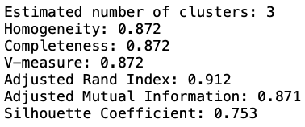

上面结果显示了几种对聚类结果的评估方法，下面依次解释：

- `metrics.homogeneity_score(labels_true, labels_pred)` ：根据样本的真实标签和预测标签，评估聚类的**同质性**。如果每个簇中只包含一类样本，则聚类的结果满足同质性。

- `metric.completeness_score(labels_true, labels_pred)` ：根据样本的真实标签和预测标签，评估聚类的**完整性**。如果给定类的所有数据点都属于同一簇，则聚类的结果满足完整性。

- `metric.vmeasure_score(labels_true, labels_pred, beta=1.0)` ：V-measure 是**同质性和完整性的调和平均**，即：

  ```shell
  v = (1 + beta) * homogeneity * completeness
       / (beta * homogeneity + completeness)
  ```

- `metric.adjusted_rand_score(labels_true, labels_pred)` ：**调整过的 Rand 指数**（兰德指数），即 ARI，常简称为“调整兰德指数”。反映了 `labels_pred` 和 `labels_true` 的重叠程度，值越大越好。

  设 C 表示实际的类别标签，K 表示聚类结果。$$a$$ 表示在 C 中是同一类，在 K 中也被划分为同一簇的样本对的数量；$$b$$ 表示在 C 中不是同一类，在 K 中也不是同一簇的样本对的数量。由此定义兰德指数（Rand Index）$$^{[10]}$$:
  $$
  RI = \frac{a+b}{\binom{n}{2}}\tag{10}
  $$
  其中，$$n$$ 是样本总数，$$\binom{n}{2}=C_n^2=\frac{n(n-1)}{2}$$ 。

  显然，$$RI$$ 的取值范围为 $$[0, 1]$$ ，值越大，说明聚类效果越好。

  但是，对于随机划分的聚类结果，无法保证 $$RI$$ 接近 $$0$$ ，于是提出了“Adjusted Rand Index”（调整过的兰德指数）：
  $$
  ARI=\frac{RI-E(RI)}{\max(RI)-E(RI)}\tag{11}
  $$
  $$E(RI)$$ 为 $$RI$$ 均值。

- `metric.adjusted_mutual_info_score(labels_true, labels_pred, avaerage_method='arithmetic')` ：两个聚类之间的**调整互信息** 。关于“互信息”，请参考《机器学习数学基础》$$^{[1]}$$ 。在互信息的基础上定义的**调整互信息**（AMI，Adjusted Mutual Information）定义如下：
  $$
  AMI(U,V)=\frac{MI(U,V)-E[MI(U,V)]}{f(H(U),H(V))-E[MI(U,V)]}\tag{12}
  $$
  其中 $$MI(U,V)$$ 表示互信息，$$E[MI(U,V)]$$ 表示互信息的均值，$$f(H(U),H(V))$$ 是待定函数（$$H(U),H(V)$$ 分为为信息熵）：

  - 如果选用 max 函数，则：
    $$
    AMI(U,V)=\frac{MI(U,V)-E[MI(U,V)]}{\max(H(U),H(V))-E[MI(U,V)]}\tag{13}
    $$

  - 如果选用几何平均，则：
    $$
    AMI(U,V)=\frac{MI(U,V)-E[MI(U,V)]}{\sqrt{(H(U)\cdot H(V)}-E[MI(U,V)]}\tag{14}
    $$

  - 如果选用算术平均，则：
    $$
    AMI(U,V)=\frac{MI(U,V)-E[MI(U,V)]}{\frac{1}{2}(H(U)+H(V))-E[MI(U,V)]}\tag{15}
    $$

- `metrics.silhouette_score(X, labels, metric='euclidean')` ：计算所有样本的**轮廓系数平均值**。

  **轮廓**（Silhouette）是一种反映数据聚类结果一致性的方法，可以用于评估聚类后簇与簇之间的离散程度。取值范围为 $$[-1,  +1]$$ ，如果某一样本的轮廓接近 1，则说明样本聚类结果合理；如果接近 -1，则说明其更应该分类到其他的簇；如果轮廓近似为 0，则说明该样本在两个簇的边界上。所有样本轮廓的均值称为聚类结果的**轮廓系数**（Silhouette Coefficiency），是该聚类是否合理、有效的度量。

  设聚类结果有 $$k$$ 个簇，样本 $$i\in C_i$$ ，设样本 $$i$$ 和 $$j$$ 之间的距离为 $$d(i,j)$$ ，则样本 $$i$$ 与其他样本之间的平均距离公式为（由于不计算样本与自身的距离 $${\displaystyle d(i,i)}$$ ，故计算平均值时样本总数为 $${\displaystyle |C_{i}|-1}$$ ）：
  $$
  a(i)=\frac{1}{|C_i|-1}\sum_{j\in C_i,i\neq j}d(i,j)\tag{16}
  $$
  $$a(i)$$ 反应了样本 $$i$$ 在当前聚类结果中的优劣，值越小，聚类效果越好。

  再定义样本与某簇 $$C_k$$ 的平均相异性，即样本 $$i\in C_i$$ 与其他簇中的样本 $$j\in C_k$$ 的平均距离的最小值：
  $$
  b(i)=\min_{k\neq i}\frac{1}{|C_k|}\sum_{j\in C_k}d(i,j)\tag{17}
  $$
  由上述两个值，定义样本 $$i$$ 的轮廓系数：
  $$
  s(i)=\frac{b(i)-a(i)}{\max(a(i),b(i))}\tag{18}
  $$
  如果数据集划分为 $$k$$ 个簇，则其轮廓系数为平均 $$s(i)$$ 的最大值：
  $$
  SC = \max_{k}~\overline{s(k)}\tag{19}
  $$
  $$\overline{s(k)}$$ 表示划分为 $$k$$ 个簇后数据集的每个样本的 $$s(i)$$ 的平均值$$^{[11]}$$。

## Mean Shift 算法

Mean Shift 直译为“平均值移动”，算法本身也体现了名称的含义，中文译为“均值漂移”算法。

Mean Shift 算法是基于密度的非参数聚类算法。

### 基本原理

设数据集 $$\pmb{D}=\{\pmb{x}_1,\cdots,\pmb{x}_n\}$$ ， $$\pmb{x}_i\in\mathbb{R}^d$$ ，即有 $$d$$ 个维度（特征），

（1）均值向量

若设每个样本的权重是 $$w_i(\pmb{x}_i)$$ ，则可以计算数据集中所有样本点的均值（向量）：
$$
\pmb{M}=\frac{\sum\limits_{i=1}^Nw(\pmb{x}_i)\pmb{x}_i}{\sum\limits_{i=1}^Nw(\pmb{x}_i)}\tag{20}
$$
（2）漂移向量

如下图所示，假设向量空间中有两个样本点，用向量表示为 $$\pmb{x}_1,\pmb{x}_2$$ ，在该向量空间中任选一个点 $$\pmb{c}_0$$ 。则分别计算两个样本点与 $$\pmb{c}_0$$ 的差，并求和：
$$
\pmb{s}=(\pmb{x}_1-\pmb{c}_0)+(\pmb{x}_2-\pmb{c}_0)\tag{21}
$$
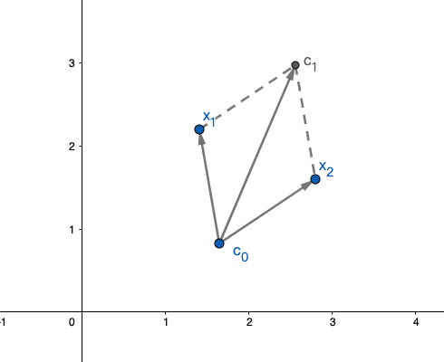

由图示可知，所得向量 $$\pmb{s}$$ 即可以认为将点 $$\pmb{c}_0$$ 移动到了 $$\pmb{c}_1$$ ，这个向量就称为令所选择的点实现移动的“漂移向量”。

如下图所示，如果在某一范围内的数据点很多（下图空心圆圈所示），记作 $$\pmb{x}_i,i=1,\cdots,n$$ ，任选一个数据点 $$\pmb{x}$$ （图中的实心圆所示，称为“中心”），则可以计算：
$$
\pmb{s}=\sum_{i=1}^n(\pmb{x}_i-\pmb{x})\tag{22}
$$
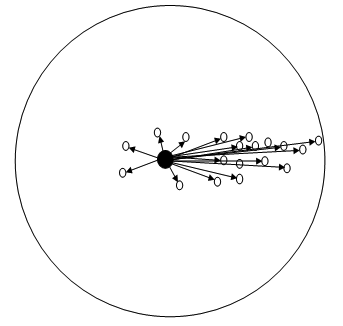

如上图所示，如果数据点的分布不均匀，显然，（22）式中的向量 $$\pmb{s}$$ 指向数据点密度较高的区域，即“中心”点会向数据点密度增加的区域“漂移”。

（3）均值漂移向量（Mean Shift 向量）

假设上图中所示范围内的数据点有 $$m$$ 个，该范围用 $$S_h$$ 表示，可以理解为是一个高维球区域，其半径为 $$h$$ （在 Mean Shift 算法中称为“带宽”（bandwidth））。即：
$$
S_h(\pmb{x})=(\pmb{y}|(\pmb{y}-\pmb{x})(\pmb{y}-\pmb{x})^\text{T}\le h^2)\tag{23}
$$
则可以计算所有样本点相对中心的向量差的均值，即：
$$
\pmb{m}_h(x)=\frac{1}{m}\sum_{\pmb{x}_i\in S_h}(\pmb{x}_i-\pmb{x})\tag{24}
$$
如果考虑每个样本的权重，仿照（20）式，则样本点相对中心的向量差的均值可以写成：
$$
\pmb{m}_h(x)=\frac{\sum\limits_{\pmb{x}_i\in S_h}w(\pmb{x}_i)(\pmb{x}_i-\pmb{x})}{\sum\limits_{\pmb{x}_i\in S_h}w(\pmb{x}_i)}\tag{25}
$$
而（25）式中的样本点 $$\pmb{x}_i$$ 必须是（23）式所表示的范围 $$S_h$$ 之内的，这个范围可以用一个函数表示，此函数即为核函数：$$K\left(\pmb{x}_i-\pmb{x}\right)$$ 。例如，此核函数的具体形式可以是：
$$
K\left(\pmb{x}_i-\pmb{x}\right)=\begin{cases}1,\quad~if~\begin{Vmatrix}\pmb{x}_i-\pmb{x}\end{Vmatrix}\le h\\0,\quad~if~\begin{Vmatrix}\pmb{x}_i-\pmb{x}\end{Vmatrix}\gt h\end{cases}\tag{26}
$$
于是，对于数据集中的所有样本点，可以用核函数将（25）式改写为：
$$
\pmb{m}_h(x)=\frac{\sum\limits_{i=1}^nK\left(\frac{\pmb{x}_i-\pmb{x}}{h}\right)w(\pmb{x}_i)(\pmb{x}_i-\pmb{x})}{\sum\limits_{i=1}^nK\left(\frac{\pmb{x}_i-\pmb{x}}{h}\right)w(\pmb{x}_i)}\tag{27}
$$
（27）式即为 **Mean Shift 向量**（漂移向量）。

在（27）式中引入了核函数，（26）式仅仅是此处核函数的一种形式。

### 漂移向量中的核函数

在 $$d$$ 维欧几里得空间 $$\mathbb{R}^d$$ 中，向量 $$\pmb{x}$$ 表示一个样本点，则其大小 $$\begin{Vmatrix}\pmb{x}\end{Vmatrix}$$ 是非负数，即 $$\begin{Vmatrix}\pmb{x}\end{Vmatrix}^2=\sum\limits_{i=1}^d|x_i|^2$$ 。当存在映射 $$k:[0,\infty]\to\mathbb{R}$$ 时，则函数 $$K:\pmb{X}\to\mathbb{R}$$ 为**核函数**，即$$^{[12]}$$：
$$
K(\pmb{x})=k\left(\begin{Vmatrix}\pmb{x}\end{Vmatrix}^2\right)\tag{28}
$$
其中 $$K$$ 径向对称，$$k$$ 具有如下性质：

- 非负；
- 非增函数：若 $$a\lt b$$ ，则 $$k(a)\ge k(b)$$；
- 且分段连续，$$\int_0^\infty k(r)dr\lt\infty$$ 。 

考虑到 $$K(\pmb{x})$$ 归一化，即其积分等于 1，通常给（28）式增加一个归一化常数，即：
$$
K(\pmb{x})=c_{k,d}k\left(\begin{Vmatrix}\pmb{x}\end{Vmatrix}^2\right)\tag{28}
$$
（26）式是（28）式的一种常见的具体形式，此外还有高斯核函数：
$$
K(\pmb{x}_i-\pmb{x})=\frac{1}{\sqrt{2\pi}h}\text{exp}\left(-\frac{\begin{Vmatrix}\pmb{x}_i-\pmb{x}\end{Vmatrix}^2}{2h^2}\right)\tag{29}
$$
其中的带宽 $$h$$ 即为高斯分布中的标准差 $$\sigma$$ 。

**3. 算法原理**

设 $$d$$ 维空间 $$\mathbb{R}^d$$ 中的数据点 $$\{\pmb{x}_i\}_{i=1}^n$$ ，用 $$d\times d$$ 的正定对称矩阵 $$\pmb{H}$$ 表示带宽，则 $$\pmb{x}$$ 的概率密度估计为$$^{[13]}$$：
$$
\hat{f}(\pmb{x})=\frac{1}{n}\sum_{i=1}^nK_{\pmb{H}}(\pmb{x}_i-\pmb{x})\tag{30}
$$
在实践中，一般将带宽矩阵  $$\pmb{H}$$ 设定为对角矩阵 $$\text{diag}(h_1^2,\cdots,h_n^n)$$ ，不妨令对角元素都相等，即 $$\pmb{H}=h^2\pmb{I},h\gt0$$ ，则有 $$\sqrt{|\pmb{H}|}=h^d$$ 。于是 （30）式中的核函数 $$K_{\pmb{H}}(x)=\frac{1}{\sqrt{|\pmb{H}|}}K(\frac{x}{h})$$ 。那么，（30）式的概率密度估计可以写成：
$$
\hat{f}(\pmb{x})=\frac{1}{nh^d}\sum_{i=1}^nK\left(\frac{\pmb{x}_i-\pmb{x}}{h}\right)\tag{31}
$$
根据（28）式，（31）式转化为：
$$
\hat{f}_{h,K}(\pmb{x})=\frac{c_{k,d}}{nh^d}\sum_{i=1}^nk\left(\begin{Vmatrix}\frac{\pmb{x}_i-\pmb{x}}{h}\end{Vmatrix}^2\right)\tag{32}
$$
在（22）式中，我们已经知道，均值漂移向量的方向指向密度增加的方向，而根据 [1] 中梯度的知识可知（梯度是函数增加最快的方向），（32）式的梯度方向，就是密度增加最快的方向。于是计算 $$\nabla \hat{f}$$ ：

因为：
$$
\begin{split}
\left(k\left(\begin{Vmatrix}\frac{\pmb{x}_i-\pmb{x}}{h}\end{Vmatrix}^2\right)\right)^{\prime}&=k^\prime\left(\begin{Vmatrix}\frac{\pmb{x}_i-\pmb{x}}{h}\end{Vmatrix}^2\right)\cdot2\cdot\left(\frac{\pmb{x}_i-\pmb{x}}{h}\right)\cdot\left(-\frac{1}{h}\right)
\\&=\frac{2}{h^2}(\pmb{x}-\pmb{x}_i)k^\prime\left(\begin{Vmatrix}\frac{\pmb{x}_i-\pmb{x}}{h}\end{Vmatrix}^2\right)
\end{split}\tag{33}
$$
所以，有：
$$
\hat{\nabla}f_{h,K}(\pmb{x})\equiv\nabla\hat{f}_{h,K}(\pmb{x})=\frac{2c_{k,d}}{nh^{d+2}}\sum_{i=1}^n(\pmb{x}-\pmb{x}_i)k^{\prime}\left(\begin{Vmatrix}\frac{\pmb{x}_i-\pmb{x}}{h}\end{Vmatrix}^2\right)\tag{34}
$$
若定义函数：
$$
g(x)=-k^\prime(x)\tag{35}
$$
对应核函数为：
$$
G(\pmb{x})=c_{g,d}g\left(\begin{Vmatrix}\pmb{x}\end{Vmatrix}^2\right)\tag{36}
$$
在参考资料 [12] 中称核函数 $$K(\pmb{x})$$ 为此函数的“影子”（shadow of a kernel) ，具有（28）式核函数同样的性质。

将（35）式带入到（34）式，得：
$$
\begin{split}
\hat{\nabla}f_{h,K}(\pmb{x})&=\frac{2c_{k,d}}{nh^{d+2}}\sum_{i=1}^n(\pmb{x}-\pmb{x}_i)\left[-g\left(\begin{Vmatrix}\frac{\pmb{x}_i-\pmb{x}}{h}\end{Vmatrix}^2\right)\right]

\\&=\frac{2c_{k,d}}{nh^{d+2}}\sum_{i=1}^n(\pmb{x}_i-\pmb{x})g\left(\begin{Vmatrix}\frac{\pmb{x}_i-\pmb{x}}{h}\end{Vmatrix}^2\right)

\\&=\frac{2c_{k,d}}{nh^{d+2}}\left(\sum_{i=1}^n\pmb{x}_ig\left(\begin{Vmatrix}\frac{\pmb{x}_i-\pmb{x}}{h}\end{Vmatrix}^2\right)-\sum_{i=1}^n\pmb{x}g\left(\begin{Vmatrix}\frac{\pmb{x}_i-\pmb{x}}{h}\end{Vmatrix}^2\right)\right)

\\&=\frac{2c_{k,d}}{nh^{d+2}}\left(\sum_{i=1}^n\pmb{x}_ig\left(\begin{Vmatrix}\frac{\pmb{x}_i-\pmb{x}}{h}\end{Vmatrix}^2\right)-\pmb{x}\sum_{i=1}^ng\left(\begin{Vmatrix}\frac{\pmb{x}_i-\pmb{x}}{h}\end{Vmatrix}^2\right)\right)

\\&=\frac{2c_{k,d}}{nh^{d+2}}\left[\sum_{i=1}^ng\left(\begin{Vmatrix}\frac{\pmb{x}_i-\pmb{x}}{h}\end{Vmatrix}^2\right)\right]\left[\frac{\sum_{i=1}^n\pmb{x}_ig\left(\begin{Vmatrix}\frac{\pmb{x}_i-\pmb{x}}{h}\end{Vmatrix}^2\right)}{\sum_{i=1}^ng\left(\begin{Vmatrix}\frac{\pmb{x}_i-\pmb{x}}{h}\end{Vmatrix}^2\right)}-\pmb{x}\right]
\end{split}\tag{37}
$$
其中第一个方括号中的 $$\sum\limits_{i=1}^ng\left(\begin{Vmatrix}\frac{\pmb{x}_i-\pmb{x}}{h}\end{Vmatrix}^2\right)$$ 是正数（参考（28）式的说明），参考（32）式，利用核函数 $$G$$ 写出概率密度估计：
$$
\hat{f}_{h,G}(\pmb{x})=\frac{c_{g,d}}{nh^d}\sum\limits_{i=1}^ng\left(\begin{Vmatrix}\frac{\pmb{x}_i-\pmb{x}}{h}\end{Vmatrix}^2\right)\tag{38}
$$
第二个方括号中的，即为**Mean Shift 向量**（漂移向量）：
$$
\pmb{m}_{h,G}(\pmb{x})=\frac{\sum_{i=1}^n\pmb{x}_ig\left(\begin{Vmatrix}\frac{\pmb{x}_i-\pmb{x}}{h}\end{Vmatrix}^2\right)}{\sum_{i=1}^ng\left(\begin{Vmatrix}\frac{\pmb{x}_i-\pmb{x}}{h}\end{Vmatrix}^2\right)}-\pmb{x}\tag{39}
$$
（27）式与（39）式本质一样，如果（39）式也考虑样本的权重的话，或者将权重考虑到核函数 $$G$$ 内。

由（37）（38）（39）式可得：
$$
\hat{\nabla}f_{h,K}(\pmb{x})=\hat{f}_{h,G}(\pmb{x})\frac{2c_{k,d}}{h^2c_{g,d}}\pmb{m}_{h,G}(\pmb{x})\tag{40}
$$
则：
$$
\pmb{m}_{h,G}(\pmb{x})=\frac{1}{2}h^2c\frac{\hat{\nabla}f_{h,K}(\pmb{x})}{\hat{f}_{h,G}(\pmb{x})},\quad(c=\frac{c_{g,d}}{c_{k,d}},是归一化因子)\tag{41}
$$
（41）式表明，在 $$\pmb{x}$$ 处，用核函数 $$G$$ 计算的 Mean Shift 向量（$$\pmb{m}_{h,G}(\pmb{x})$$）与由核函数 $$K$$ 所得的归一化后的概率密度估计的梯度（$$\hat{\nabla}f_{h,K}(\pmb{x})$$）方向相同，即 Mean Shift 向量的方向总是指向密度增加最快的方向。此结论首先由 Fukunaga 和 Hostetler 在 1975 年提出$$^{[14]}$$ ，并在参考资料 [12] 中进行了深入讨论。

于是可以按照下面的方法，迭代计算中心的位置：

（1）根据（39）式计算当前位置 $$\pmb{x}^{t}$$ 的漂移向量，记作 $$\pmb{m}_{h}(\pmb{x}^t)=\frac{\sum\limits_{i=1}^n\pmb{x}_ig\left(\begin{Vmatrix}\frac{\pmb{x}_i-\pmb{x}^t}{h}\end{Vmatrix}^2\right)}{\sum\limits_{i=1}^ng\left(\begin{Vmatrix}\frac{\pmb{x}_i-\pmb{x}^t}{h}\end{Vmatrix}^2\right)}-\pmb{x}^t$$ 。

（2）下一个中心位置：
$$
\pmb{x}^{t+1}=\pmb{x}^t+\pmb{m}_h(\pmb{x}^t)=\frac{\sum\limits_{i=1}^n\pmb{x}_ig\left(\begin{Vmatrix}\frac{\pmb{x}_i-\pmb{x}^t}{h}\end{Vmatrix}^2\right)}{\sum\limits_{i=1}^ng\left(\begin{Vmatrix}\frac{\pmb{x}_i-\pmb{x}^t}{h}\end{Vmatrix}^2\right)}\tag{42}
$$
（3）重复（1）（2）步骤，直到收敛，即 $$\begin{Vmatrix}\pmb{m}_h(\pmb{x})-\pmb{x}\end{Vmatrix}\lt\epsilon$$ （$$\epsilon$$ 是人为设定的一个很小的值）或者达到设定的迭代次数。

（4）收敛到相同中心的样本都被认为是同一簇的成员。

### 实践案例

1. 引入相关模块，并创建数据集

   ```python
   import numpy as np
   from sklearn.cluster import MeanShift, estimate_bandwidth
   from sklearn.datasets import make_blobs
   
   centers = [[1, 1], [-1, -1], [1, -1]]
   X, _ = make_blobs(n_samples=10000, centers=centers, cluster_std=0.6)
   ```

2. 估计带宽

   ```python
   bandwidth = estimate_bandwidth(X, quantile=0.2, n_samples=500)
   ```

   `estimeate_bandwidth()` 的官方文档：https://scikit-learn.org/stable/modules/generated/sklearn.cluster.estimate_bandwidth.html#sklearn.cluster.estimate_bandwidth

3. 训练模型

   ```python
   ms = MeanShift(bandwidth=bandwidth, bin_seeding=True)
   ms.fit(X)
   
   labels = ms.labels_
   cluster_centers = ms.cluster_centers_
   
   labels_unique = np.unique(labels)
   n_clusters_ = len(labels_unique)
   
   print("number of estimated clusters : %d" % n_clusters_)
   ```

   对于 `MeanShift` 中的参数 `bin_seeding` ，其值默认为 `False` 。如果是 `True`，则初始核位置不是所有点的位置，而是对应带宽将所有数据点离散化的位置。为 `True` 可以加速算法。

   以上输出聚类的簇数量。

4. 结果可视化

   ```python
   import matplotlib.pyplot as plt
   from itertools import cycle
   
   plt.figure(1)
   plt.clf()
   
   colors = cycle("bgrcmykbgrcmykbgrcmykbgrcmyk")
   for k, col in zip(range(n_clusters_), colors):
       my_members = labels == k
       cluster_center = cluster_centers[k]
       plt.plot(X[my_members, 0], X[my_members, 1], col + ".")
       plt.plot(
           cluster_center[0],
           cluster_center[1],
           "o",
           markerfacecolor=col,
           markeredgecolor="k",
           markersize=14,
       )
   plt.title("Estimated number of clusters: %d" % n_clusters_)
   plt.show()
   ```

   输出结果：

   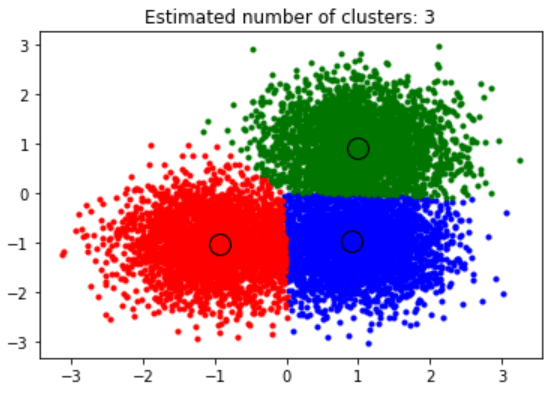

   

### 算法评析

- 优点
  - 与基于距离的聚类算法不同，可以实现任意形状的族（例如 K-均值，簇只能是凸形状或圆形，对于有分支的细长形则失效）。
  - 不需要指定簇的数量。
  - 可以利用 KNN 算法估计比较适合的“带宽”参数（bandwidth）。
- 不足：
  - 计算复杂度为 $$O(kn^2)$$ ，$$n$$ 为数据集大小，$$k$$ 为每个样本的平均迭代次数。
  - 对离群值敏感，无法判定其所述簇。

## DBSCAN 算法

DBSCAN，全称：Density-Based Spatial Clustering of Application with Noise，直译为“具有噪声的基于密度的空间聚类方法”）。这种方法是在 1996 年由 Martin Ester, Hans-Peter Kriegel, Jörg Sander 及 Xiaowei Xu 提出的$$^{[16]}$$ 。

前述各种聚类算法，比如 K-Means ，都是适用于凸样本集的情形，如下图所示。

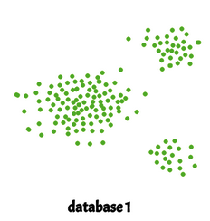

而现实的数据，不一定都是凸样本集，也可能出现如下图所示的情形。另外，下图中还显示，有一些离群值（noise，或者称之为“噪音数据、噪声”等）。对于下图的样本，就不能再使用之前的算法进行聚类了。

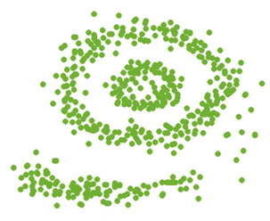

 这里所介绍的 DBSCAN 算法，不仅适用于凸样本集，也能适用于上图所示的非凸样本集。

**1. 两个基本参数**

DBSCAN 算法需要两个基本参数：

- $$\epsilon$$ ：用它定义了数据点周围的邻域，即如果两点之间的距离小于或等于 $$\epsilon$$，则它们被视为“邻居”。 如果 $$\epsilon$$ 的值选择得太小，那么大部分数据将被视为离群值；如果选择太大，则聚类的不同簇会被合并，致使大多数数据点被聚类到同一个簇中。
- MinPts：以 $$\epsilon$$ 为半径的范围内数据点的最小数量（称为**邻域**）。数据集越大，必须设置更大的 MinPts 值。 作为一般规则，可以根据数据集的维数（D）设置最小 MinPts ：MinPts >= D+1，根据经验，通常设置为 MinPts = 2 * D。 MinPts 的最小值必须至少选择 3。

**2. DBSCAN 算法将数据点分为三类**

- 核心点（core points）：若以某数据点为中心，在半径 $$\epsilon$$ 范围内的数据点的数量最小值是 MinPts，则该数据点称为**核心点**。如下图所示，设 $$\epsilon =2,\text{MinPts}=5$$ ，则图示中圆圈的圆心点（蓝色点）就是核心点。

  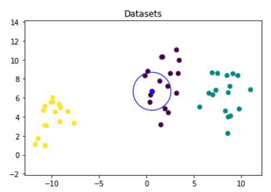

- 边界点（border points）：若以某数据点为中心，在半径 $$\epsilon$$ 范围内的数据点的数量小于 MinPts，但该点在核心点的邻域内，则称其为**边界点**。如下图所示，设 $$\epsilon =2,\text{MinPts}=5$$ ，则图示中以绿色点为圆心，半径为 $$\epsilon$$ 的范围内有 4 个数据点，并且绿色点也在蓝色点作为核心点的邻域内，则绿色点即为边界点。

  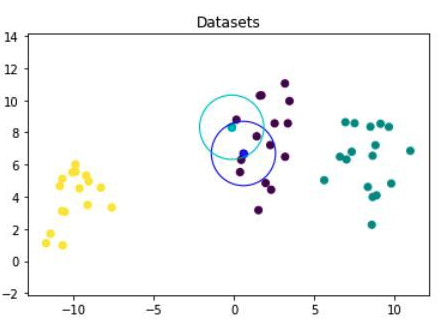

- 离群值（noise，或“噪音”）：既不属于核心点，也不属于边界点，则称为离群值。如下图所示的红色点（ $$\epsilon =2,\text{MinPts}=5$$）。

  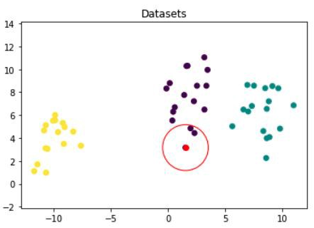

**3. 术语定义**

设数据集 $$D=\{x_1,\cdots,x_n\}$$ 。

- $$\epsilon$$ 邻域（epsilon-neighborhood）：数据点 $$p$$ 的邻域记作 $$N_{\epsilon}(p)$$ ，其定义为：
  $$
  N_{\epsilon}(p)=\{q\in D|\text{dist}(p,q)\le\epsilon\}
  $$
  
  即与给定点 $$p$$ 的距离小于等于 $$\epsilon$$ 的所有点的集合。$$\text{dist}(p,q)$$ 表示 $$p$$ 和 $$q$$ 两点的距离。用 $$|N_{\epsilon}(p)|$$ 表示 $$p$$ 点的 $$\epsilon$$ 邻域内数据点的数量。
  
  显然，边界点的 $$\epsilon$$ 邻域内的数据点数量要小于核心点 $$\epsilon$$ 邻域内数据点的数量。
  
- 直接密度可达（directly density-reachable，或“密度直达”）：若点 $$p$$ 在点 $$q$$ 的 $$\epsilon$$ 邻域内，且包含的数据点数量超过 MinPts，则称点 $$p$$ 是从点 $$q$$ 出发直接密度可达的。用公式表示为：
  $$
  \begin{split}
  &(1)~p\in N_{\epsilon}(q)\quad(点~p~可能是核心点或边界点)
  \\
  &(2)~|N_{\epsilon}(q)|\ge\text{MinPts}\quad(点~q~属于核心点)
  \end{split}
  $$
  显然，对于两个核心点，直接密度可达是对称的。然而一般情况下，是不对称的，比如 $$q$$ 是核心点，而 $$p$$ 是边界点，$$q\to p$$ 是直接密度可达的，但 $$q\leftarrow p$$ 则不是。

  如下图所示，蓝色点是核心点，绿色点是边界点，从蓝色点出发到绿色点，是直接密度可达。

  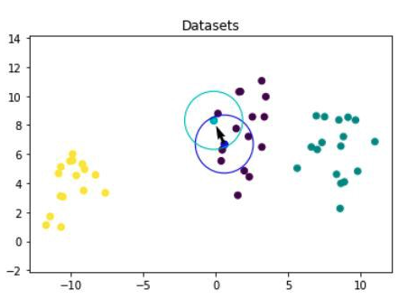

  

- 密度可达（density-reachable）：假设有一系列的数据点：$$p_1,\cdots,p_n$$ ，令起始点 $$p_1=q$$ ，终点 $$p_n=p$$ ，若任意点（$$p_{i+1}$$）从其前面的点（$$p_i$$）出发都是直接密度可达的，则称点 $$p$$ 是从点 $$q$$ 出发**密度可达**。如下图所示，从蓝色点到绿色点，过程中任意点从前一个点到当前点，都是直接密度可达，则绿色点即为从蓝色点出发的密度可达。

  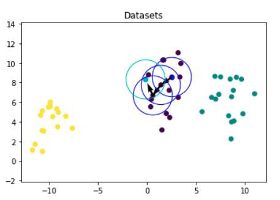

  一般而言，密度可达不是对称的，除非都是核心点。

- 密度相连（density-connected）：假设从 $$o$$ 点出发，到 $$p$$ 和 $$q$$ 点都是密度可达，那么 $$p$$ 点就与 $$q$$ 点密度相连。显然，密度相连是对称的。

如果某个点不能由任何点密度可达，则该点是**离群值**（noise, outlier）。

**3. DBSCAN 基本思想**

如果 $$p$$ 是核心点，则它与所有由它密度可达的数据点（包括核心点和边界点）形成一个簇，每个簇至少有一个核心点。

- 如果只有一个核心点，则簇里的任意一个数据点都在该核心点的 $$\epsilon$$ 邻域内。
- 如果有多个核心点，则簇里的任意一个核心点的 $$\epsilon$$ 邻域中一定有另外一个核心点，否则两个核心点无法密度可达。
- 边界点也是簇的一部分，但它是在簇的“边缘”位置，因为它不能密度可达至更多的数据点。
- 如果某数据点不在任何核心点的 $$\epsilon$$ 邻域，则将其作为离群值。

在实现上述思想的过程中，必须要计算两点之间的距离 $$\text{dist}(p,q)$$ ，在 DBSCAN 算法中，一般采用最近邻思想，通过某种距离来度量两个数据点之间的距离，另外，针对大样本数据集，也会采用 k-近邻学习中的 KD-Tree 和 Ball-Tree 算法$$^{[17]}$$ 。

DBSCAN 算法的基本流程如下$$^{[18]}$$：

- 输入：数据集 D，半径 $$\epsilon$$ ，给定点在 $$\epsilon$$ 邻域内成为核心点的最小数据点数量 MinPts
- 输出：簇集合
  1. 将所有的数据点分别标记为核心点、边界点和离群值。
  2. 排除离群值。
  3. 将距离小于 $$\epsilon$$ 的核心点划为同一个簇（直接密度可达）。
  4. 将边界点划分到距离小于 $$\epsilon$$ 的邻近核心点所在簇（将密度可达的数据点都划为同一个簇）。

**4. 实践案例**

以下案例中使用一组基因数据，来源于：https://reneshbedre.github.io/assets/posts/tsne/tsne_scores.csv

1. 读入数据集

   ```python
   import pandas as pd
   df = pd.read_csv("./data/tsne_scores.csv")
   df.head()
   ```

   输出：

   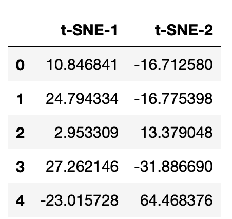

   ```python
   # 输出数据集的形状
   df.shape
   ```

2. 确定 $$\epsilon$$ 和 $$\text{MinPts}$$

   （1）一般经验，`MinPts = 2 * D` 。本例中数据集是 2 维的，所以可以设置 `MinPts = 2 * 2` 。

   （2）确定 $$\epsilon$$ ，通常使用最近邻思想，在此使用 `sklearn` 中的 `NearestNeighbors()` 模型$$^{[19]}$$：

   ```python
   class sklearn.neighbors.NearestNeighbors(*, n_neighbors=5, radius=1.0, algorithm='auto', leaf_size=30, metric='minkowski', p=2, metric_params=None, n_jobs=None)
   ```

   这是一个用于搜索指定数据点邻居的非监督学习模型。先简单了解如何应用此模型。

   如下所示的示例，创建一个简单的数据集 `samples` 。在 `NearestNeighbors` 模型实例的参数中，设置 `n_neighbors=2` ，意味着要用针对新的数据点，从这个模型中找出 `2` 个邻居。

   ```python
   from sklearn.neighbors import NearestNeighbors
   samples = [[0, 0, 2], [1, 0, 0], [0, 0, 1]]
   neigh = NearestNeighbors(n_neighbors=2)
   neigh.fit(samples)
   ```

   然后找新的数据点 `[0,0,1.3]` 在上述模型 `neigh` 中的邻居：

   ```python
   neigh.kneighbors([[0, 0, 1.3]])
   
   # 输出：(array([[0.3, 0.7]]), array([[2, 0]]))
   ```

   输出结果显示，模型 `neigh` 中与数据点 `[0, 0, 1.3]` 最近的两个邻居分别是 `samples` 中索引为 `2` 和索引为 `0` 的样本点（返回值中的 `array([[2, 0]])` 为最近邻居的索引），并且按照距离从小到大排列，返回值中的 `array[[0.3, 0.7]]` 是与邻居的距离。这里使用的是欧几里得距离，通过计算，也能显然地看出来：

   - `[0, 0, 1.3]` 与样本 `[0, 0, 1]` （索引是 `2`）的欧氏距离是 `0.3` 。
   - `[0, 0, 1.3]` 与样本 `[0, 0, 2]` （索引是 `0`）的欧氏距离是 `0.7` 。

   下面就使用 `NearestNeighbors` 模型确定 $$\epsilon$$ 的值。

   ```python
   nbrs = NearestNeighbors(n_neighbors=5).fit(df)
   ```

   在这里，设置 `n_neighbors=5` （这也是默认值），即要为目标数据从模型中找最近的 5 个邻居。

   ```python
   neigh_dist, neigh_ind = nbrs.kneighbors(df)
   neigh_dist
   ```

   这里返回的 `neigh_dist` 即为 `df` 中每个样本与模型 `nbrs` 的数据集样本中距离最近的 5 个邻居。由于用的都是 `df` 数据集，最近的就是自己和自己，距离为 `0` 。

   将 `neigh_dist` 按照 0 轴方向排序。

   ```python
   import numpy as np
   sort_neigh_dist = np.sort(neigh_dist, axis=0)
   sort_neigh_dist
   ```

   下面通过对与 `df` 中每个样本的上述邻居中最远的（即 `sort_neight_dist` 中列索引是 `4` 的第五列）距离画图，近似地找出 $$\epsilon$$ 的值。

   ```python
   import matplotlib.pyplot as plt
   k_dist = sort_neigh_dist[:, 4]    # 获取第5列，列索引为 4 的数据
   plt.plot(k_dist)
   plt.axhline(y=2.5, linewidth=1, linestyle='dashed', color='k')
   plt.ylabel("k-NN distance")
   plt.xlabel("Sorted observations (4th NN)")
   plt.show()
   ```

   输出：

   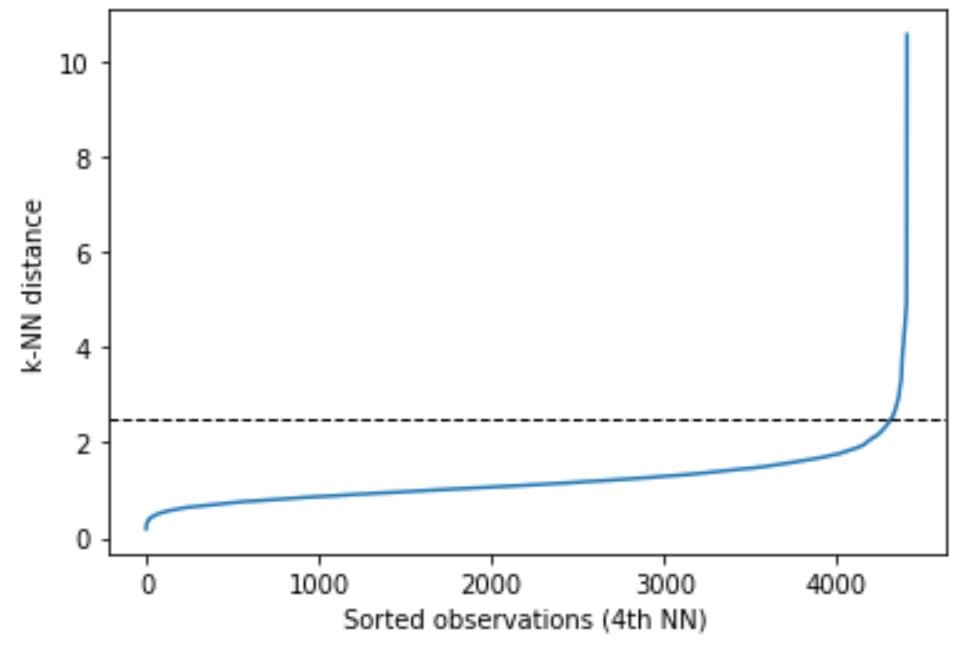

   从图像中，可以大约地看出来，样本之间的距离拐点是 `2.5` 。如果超过了 `2.5` ，距离会陡增，那么，那些值可以视为离群值。

   所以，可以设置：$$\epsilon=2.5$$ 。

3. 使用 `sklearn` 的 `DBSCAN` 实现聚类

   ```python
   class sklearn.cluster.DBSCAN(eps=0.5, *, min_samples=5, metric='euclidean', metric_params=None, algorithm='auto', leaf_size=30, p=None, n_jobs=None)
   ```

   根据前述计算，参数设置：`eps=2.5` ，`min_samples=4` 。

   ```python
   from sklearn.cluster import DBSCAN
   clusters = DBSCAN(eps=2.5, min_samples=4).fit(df)
   # 输出聚类标签
   clusters.labels_
   
   # 输出：
   array([0, 0, 1, ..., 1, 1, 1])
   ```

   如果查看无重复类别标签，可以用 `set()` 函数去重。

   ```python
   set(clusters.labels_)
   
   # 输出
   {0, 1, 2, 3, 4, 5, 6, 7, 8, 9, 10, 11, 12, 13, 14, 15, 16, 17, 18, 19, 20, 21, 22, -1}
   # -1 标签表示的是离群值，没有聚类到任何簇
   ```

   得到了上述结果显示的那么多个簇。进一步，可以输出每个标签，也就每簇的样本数量。

   ```python
   from collections import Counter
   Counter(clusters.labels_)
   ```

4. 将每个样本所在的簇，即标签，与原始数据结合，进行可视化显示。

   ```python
   import seaborn as sns
   
   p = sns.scatterplot(data=df, x="t-SNE-1", y="t-SNE-2", 
                       hue=clusters.labels_, legend="full", palette="deep")
   sns.move_legend(p, "upper right", bbox_to_anchor=(1.17, 1.2), title='Clusters')
   plt.show()
   ```

   输出：

   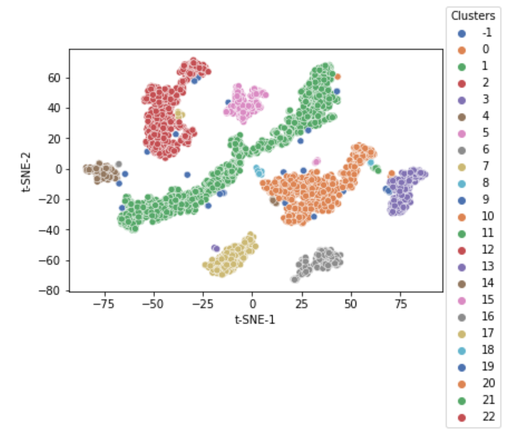

**5. 评析**$$^{[20]}$$

1. 相比 K-Means 算法，DBSCAN 不需要预先声明聚类数量。
2. DBSCAN 可以找出任何形状的聚类。
3. DBSCAN 能分辨离群值。
4. DBSCAN 只需两个参数，且对数据集内的点的次序几乎不敏感。
5. DBSCAN  不是完全决定性的：在两个聚类交界边缘的点会视它在数据集的次序决定加入哪个聚类，不过，这种情况并不常见，而且对整体的聚类结果影响不大——DBSCAN 对核心点和离群值都是决定性的。
6. DBSCAN 聚类的结果受距离函数里影响较大，最常用的是欧几里得距离，尤其在高维度数据中，由于受所谓“维数灾难”影响，很难找出一个合适的 $$\epsilon$$ ，事实上所有使用欧几里得距离的算法都受维数灾难影响。
7. 如果数据集里的样本点有不同的密度，且差异很大，DBSCAN 将不能提供一个好的聚类结果，因为不能选择一个适用于所有聚类的 $$MinPts-\epsilon$$ 参数组合。

## 参考资料

[1] 齐伟. 机器学习数学基础[M]. 北京:电子工业出版社, 2022.

[2] 周志华. 机器学习[M]. 北京:清华大学出版社,2018.

[3] 聚类分析[DB/OL]. https://blog.csdn.net/weixin_43584807/article/details/105539675 ,2022.10.12.

[4] Ryan P. Adams. K-Means Clustering and Realted Algorithms[DB/OL]. https://www.cs.princeton.edu/courses/archive/fall18/cos324/files/kmeans.pdf ,2020.10.12.

[5] Kmeans++聚类算法原理与实现[DB/OL]. https://zhuanlan.zhihu.com/p/152286357 ,2022.10.13.

[6] 齐伟. 数据准备和特征工程[M]. 北京:电子工业出版社.

[7] K-means[DB/OL]. https://scikit-learn.org/stable/modules/clustering.html#k-means ,2022.10.13.

[8] Comparison of the K-Means and MiniBatchKMeans clustering algorithms[DB/OL]. https://scikit-learn.org/stable/auto_examples/cluster/plot_mini_batch_kmeans.html#sphx-glr-auto-examples-cluster-plot-mini-batch-kmeans-py ,2022.10.13.

[9] 金建国. 聚类方法综述[J]. 计算机科学,2014,第41卷第11A期:288-293.

[10] 聚类性能评估—ARI（调兰德指数）[DB/OL]. https://zhuanlan.zhihu.com/p/145856959 , 2022.10.16.

[11] 轮廓（聚类）[DB/OL]. https://zh.wikipedia.org/wiki/轮廓_(聚类) , 2022.10.16.

[12] Yizong Chen. Mean Shift, Mode Seeking and Clustering[J]. IEEE TRANSACTIONS ON PATTERN ANALYSIS AND MACHINE INTELLIGENCE, VOL. 17, NO. 8, AUGUST 1995. http://home.ku.edu.tr/mehyilmaz/public_html/mean-shift/00400568.pdf , 2022.10.16.

[13] Dorin Comaniciu, Peter Meer. Mean Shift: A Robust Approach Toward Feature Space Analysis[J]. IEEE TRANSACTIONS ON PATTERN ANALYSIS AND MACHINE INTELLIGENCE, VOL. 24, NO. 5, MAY 2002.  https://courses.csail.mit.edu/6.869/handouts/PAMIMeanshift.pdf . 2022.10.16.

[14] K. Fukunaga and L.D. Hostetler. The Estimation of the Gradient of a Density Function,with Applications in Pattern Recognition, IEEE Trans. Information Theory, vol. 21,pp. 32-40,1975.

[15] K 近邻学习[DB/OL]. http://math.itdiffer.com/knn.html , 2022.10.16.

[16]. Martin Ester, Hans-Peter Kriegel, Jörg Sander, Xiaowei Xu. A Density-Based Algorithm for Discovering Clusters in Large Spatial Databaseswith Noise[DB/OL]. https://www.aaai.org/Papers/KDD/1996/KDD96-037.pdf , 2022.10.26.

[17] 齐伟. K 近邻学习[DB/OL]. http://math.itdiffer.com/knn.html , 2022.10.26.

[18] Yuki Liu. Clustering method 1: DBSCAN. https://medium.com/ai-academy-taiwan/clustering-method-1-11bcbe0fb12f , 2022.10.26.

[19] sklearn.neighbors.NearestNeighbors[DB/OL]. https://scikit-learn.org/stable/modules/generated/sklearn.neighbors.NearestNeighbors.html , 2022.10.26.

[20] DBSCAN[DB/OL]. https://zh.wikipedia.org/zh-sg/DBSCAN , 2022.10.26.


