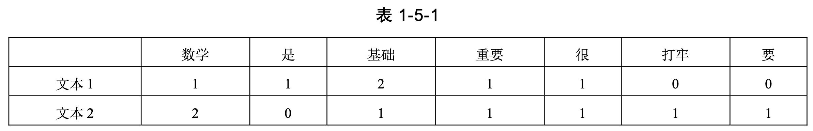

# 勘误和修改

百度网盘下载 PDF 文档：链接: https://pan.baidu.com/s/1OOimHFaTJ-CxmeCvnADFPQ 提取码: d3a5

说明：

- 阅读2022年3月第1次印刷的读者，请参考以下勘误中的所有内容。
- 阅读2022年9月第2次印刷的读者，请参考**2022年9月第2次印刷**之后的所有勘误。
- 阅读2023年1月第3次印刷的读者，请参考**2023年1月第3次印刷**之后的所有勘误。

## 一、勘误

### 2022年3月第1次印刷

1. 位置：29页，正文倒数第3行至最后

   - 原文：

     $$\begin{cases}\begin{split}\pmb{\beta}_1 &= b_{11}\pmb{\alpha}_1 + \cdots + b_{1n}\pmb{\alpha}_n \\ \vdots  \\\pmb{\beta}_n &= b_{n1}\pmb{\alpha}_1 + \cdots + b_{nn}\pmb{\alpha}_n \end{split}\end{cases}$$

   - 修改为：

     $$\begin{cases}\begin{split}\pmb{\beta}_1 &= b_{11}\pmb{\alpha}_1 + \cdots + b_{n1}\pmb{\alpha}_n \\ \vdots  \\\pmb{\beta}_n &= b_{1n}\pmb{\alpha}_1 + \cdots + b_{nn}\pmb{\alpha}_n \end{split}\end{cases}$$

2. 位置：30页，正文第3行至第5行

   - 原文：

     $$\begin{bmatrix}\pmb{\beta}_1\\\vdots\\\pmb{\beta}_n\end{bmatrix} = \begin{bmatrix}b_{11} & \cdots & b_{1n}\\\vdots\\b_{n1} & \cdots &b_{nn}\end{bmatrix}\begin{bmatrix}\pmb{\alpha}_1\\\vdots\\\pmb{\alpha}_n\end{bmatrix}$$

   - 修改为：

     $$\begin{bmatrix}\pmb{\beta}_1&\cdots&\pmb{\beta}_n\end{bmatrix} = \begin{bmatrix}\pmb{\alpha}_1&\cdots&\pmb{\alpha}_n\end{bmatrix}\begin{bmatrix}b_{11} & \cdots & b_{1n}\\\vdots\\b_{n1} & \cdots &b_{nn}\end{bmatrix}$$

3. 位置：30页，正文第11行至第13行

   - 原文：

     在同一个向量空间，由基 $[\pmb\alpha]$ 向基 $[\pmb\beta]$ 的过渡矩阵是 $\pmb{P}$ ，则：

     $$[\pmb\beta] = \pmb P[\pmb\alpha]$$

     注意：$[\pmb\alpha]$ 和 $[\pmb\beta]$ 分别用行向量方式表示此向量空间的不同的基。

   - 修改为：

     在同一个向量空间，由基 $\{\pmb{\alpha}_1\quad\cdots\quad\pmb{\alpha}_n\}$ 向基 $\{\pmb{\beta}_1\quad\cdots\quad\pmb{\beta}_n\}$ 的过渡矩阵是 $\pmb{P}$ ，则：
     
     $$[\pmb{\beta}_1\quad\cdots\quad\pmb{\beta}_n] = [\pmb{\alpha}_1\quad\cdots\quad\pmb{\alpha}_n]\pmb P$$

4. 位置：30页，正文第13行

   - 原文：注意：$[\pmb{\alpha}]$ 和 $[\pmb{\beta}]$ 分别用列向量方式表示此向量空间的不同的基。
   - 修改说明：删除原文中的那一行。

5. 位置：30页，正文第15至第7行

   - 原文：

     $$\begin{split}x_1'\pmb{\beta}_1 + \cdots + x_n'\pmb{\beta}_n &= x_1'b_{11}\pmb{\alpha}_1 + \cdots + x_1'b_{1n}\pmb{\alpha}_n \\ & \quad + \cdots \\ & \quad + x_n'b_{n1}\pmb{\alpha}_1 + \cdots + x_n'b_{nn}\pmb{\alpha}_n \end{split}$$

   - 修改为：

     $$\begin{split}x_1'\pmb{\beta}_1 + \cdots + x_n'\pmb{\beta}_n =& x_1'b_{11}\pmb{\alpha}_1 + \cdots + x_1'b_{n1}\pmb{\alpha}_n \\ +& \cdots \\  + &x_n'b_{1n}\pmb{\alpha}_1 + \cdots + x_n'b_{nn}\pmb{\alpha}_n \end{split}$$

6. 位置：31页，正文第1行至第3行

   - 原文

     在某个向量空间中，由基 $[\pmb\alpha]$ 向基 $[\pmb\beta]$ 的过渡矩阵是 $\pmb{P}$ 。某向量在基 $[\pmb\alpha]$ 的坐标是 $\pmb x $，在基 $[\pmb\beta]$ 的坐标是 $\pmb x^\prime$，这两组坐标之间的关系是：

     $$\pmb x = \pmb P \pmb x'$$

   - 修改为：

     在某个向量空间中，由基 $\{\pmb{\alpha}_1\quad\cdots\quad\pmb{\alpha}_n\}$ 向基 $\{\pmb{\beta}_1\quad\cdots\quad\pmb{\beta}_n\}$ 的过渡矩阵是 $\pmb{P}$ 。某向量在基 $\{\pmb{\alpha}_1\quad\cdots\quad\pmb{\alpha}_n\}$ 的坐标是 $\pmb{x}=\begin{bmatrix}x_1\\\vdots\\x_n\end{bmatrix} $，在基 $\{\pmb{\beta}_1\quad\cdots\quad\pmb{\beta}_n\}$ 的坐标是 $\pmb x'=\begin{bmatrix}x_1'\\\vdots \\x_n'\end{bmatrix}$，这两组坐标之间的关系是：
     
     $$\pmb x = \pmb P \pmb x'$$

   - 修改说明：从29页到31页，对过渡矩阵和坐标变换的推导中，有上述错误，更详细的说明请见文章：[重要更正第1号：过渡矩阵和坐标变换推导](./big_bug01.md)

7. 位置：31页，正文，倒数第2行

   - 原文：同样，在 $x'Oy'$ 中，分别以基向量的 $\overrightarrow{Oi}$ 和 $\overrightarrow{Oj}$ 的长度为单位长度并建立 $x'$ 和 $y'$ 坐标轴。
   - 同样，在 $x'Oy'$ 中，分别以基向量的 $\overrightarrow{Oi'}$ 和 $\overrightarrow{Oj'}$ 的长度为单位长度并建立 $x'$ 和 $y'$ 坐标轴。
   - 致谢：此错误由读者**李韬**指出，非常感谢。

8. 位置：36页，正文第2行

   - 原文：设内积空间中的两个向量……
   - 修改为：设向量空间中的两个向量……
   - 说明：将原文中的“内积”，修改为“向量”。

9. 位置：39页，正文第1行

   - 原文：$d(\pmb{u},\pmb{v})=\pmb{u}-\pmb{v}$

   - 修改为：$d(\pmb{u},\pmb{v})=\begin{Vmatrix}\pmb{u}-\pmb{v}\end{Vmatrix}$

10. 位置：39页，正文第2行

   - 原文：$\pmb u - \pmb v  = \sqrt{\langle (\pmb u - \pmb v), (\pmb u - \pmb v)\rangle}$
   - 修改为：$\begin{Vmatrix}\pmb u - \pmb v \end{Vmatrix} = \sqrt{\langle (\pmb u - \pmb v), (\pmb u - \pmb v)\rangle}$

11. 位置：41页，图1-5-4下第4行

    - 原文：$d(\pmb u, \pmb v) = u_1 - v_1 + \cdots + u_n - v_n = \sum_{i=1}^n |u_i - v_i|$
    - 修改为：$d(\pmb u, \pmb v) = \begin{vmatrix}u_1 - v_1\end{vmatrix} + \cdots + \begin{vmatrix}u_n - v_n\end{vmatrix} = \sum_{i=1}^n |u_i - v_i|$
    - 修改说明：原文中的 $u_1-v_1$ 和 $u_n-v_n$ 应该加上绝对值符号

12. 位置：46页，倒数第5行

    - 原文：$\begin{Vmatrix} \pmb u \end{Vmatrix}_1 = u_1 + \cdots + u_n = \sum_{r=1}^{r=n}|u_i|$
    - 修改为：$\begin{Vmatrix} \pmb u \end{Vmatrix}_1 = |u_1| + \cdots + |u_n| = \sum_{r=1}^{r=n}|u_i|$

13. 位置：49页，图1-5-9下的第1行

    - 原文：对于 $\Delta ABC$ ，
    - 修改为：对于 $\Delta OAB$ ，

14. 位置：51页，表1-5-1

    - 原文：

      

    - 修改说明：将“文本2”中的“数学”项下的数字修改为“1”，“要”项下的数字修改为“2”

15. 位置：51页，表1-5-1之下的第 2 行

    - 原文：$\pmb{d}_2=\begin{bmatrix}2\\0\\1\\1\\1\\1\\1\end{bmatrix}$
    - 修改为：$\pmb{d}_2=\begin{bmatrix}1\\0\\1\\1\\1\\1\\2\end{bmatrix}$

16. 位置：52页，正文第4行

    - 原文：在 1.4.1 中曾有一个这样的内积函数： $\langle\pmb{u},\pmb{v}\rangle=x_1y_1+4x_2y_2$ ，
    - 修改为：设内积函数：$\langle\pmb{u},\pmb{v}\rangle=x_1x_2+4y_1y_2$ ，

17. 位置：58页，正文第1行

    - 原文：

      $$\pmb{A} = \begin{bmatrix}a_{11} & 0 & ... & 0 \\ 0 & a_{22} & ... & 0 \\ ... & ... & ... & ... \\ 0 & 0 & ... & a_{nn}\end{bmatrix}$$

    - 修改为：

      $$\pmb{A} = \begin{bmatrix}a_{11} & 0 &\cdots& 0 \\ 0 & a_{22} &\cdots& 0 \\\vdots&\vdots&\ddots&\vdots\\ 0 & 0 &\cdots& a_{nn}\end{bmatrix}$$

    - 修改说明：对矩阵的排版样式给予修改。

18. 位置：64页，正文，倒数第5行

    - 原文：如果用一个标量 $c$ 乘以矩阵，此计算结果仍然是与原矩阵形状一样的矩阵，遵从乘法封闭的原则。
    - 修改为：如果用一个标量 $c$ 乘以矩阵，此计算结果仍然是与原矩阵形状一样的矩阵，遵从数量乘法封闭的原则。
    - 修改说明：将“遵从乘法封闭的原则”，修改为“遵从数量乘法封闭的原则”。

19. 位置：71页，正文第10行、第11行

    - 原文：但另一个被称为“线性函数”的 $f(x) = kx + b$ 不符合上述规定的第二条（$f(cx) = kcx + b, c(fx) = ckx + cb$ ，得：$f(cx) \ne cf(x)$ ），
    - 修改为：但另一个被称为“线性函数”的 $f(x) = kx + b$ 仅以上述规定的第二条考察（$f(cx) = kcx + b, c(fx) = ckx + cb$，得：$f(cx) \ne cf(x)$ ），就明显不符合，
    - 修改说明：表述方式进行修改

20. 位置：97页，正文第2行至第4行

    - 原文：

      性质

      矩阵列向量线性无关 $\Longleftrightarrow$ $\begin{vmatrix}\pmb{A}\end{vmatrix}\ne 0$

      矩阵列向量线性相关 $\Longleftrightarrow$ $\begin{vmatrix}\pmb{A}\end{vmatrix}= 0$ 

    - 修改为：

      性质

      - 矩阵列向量线性无关 $\Longleftrightarrow$ $\begin{vmatrix}\pmb{A}\end{vmatrix}\ne 0$

      - 矩阵列向量线性相关 $\Longleftrightarrow$ $\begin{vmatrix}\pmb{A}\end{vmatrix}= 0$ 

    - 修改说明：

      - 原文中的“性质”二字是宋体字，应该修改为楷体字。
      - 在“性质”下面的两条性质前面，增加项目符号（小圆点，类似于97页底部所列其他性质那样）

21. 位置：102页，正文第1行

    - 原文：观察可知，原线性方程组有解，又因为 $m=3$ ，$n=4$ ，$m<n$ ，所以原线性方程组有无穷多个解。
    - 修改为：观察可知，原线性方程组有解；又因为阶梯形矩阵的非零行数量 $r=3$ ，未知量个数 $n=4$ ，$r<n$ ，所以原线性方程组有无穷多个解。

22. 位置：107页，正文，倒数第3行

    - 原文：除在上述统计词频时生成稀疏矩阵之外，
    - 修改为：除在上述统计字词频率时生成稀疏矩阵之外，
    - 修改说明：将原文中的“词频”，修改为“字词频率”

23. 位置：114页，图2-7-4上面的第1行

    - 原文：从 $C$ 到 $A$ 。
    - 修改为：从 $C$ 到 $B$ 。
    - 致谢：此错误由读者西交利物浦大学的周若骏同学指出，非常感谢。

24. 位置：115页，正文（不含代码），倒数第3行

    - 原文：可以使用 NexworkX
    - 修改为：可以使用 NetworkX
    - 修改说明：将原文的“NexworkX”，修改为“NetworkX”

25. 位置：116页，正文，第4行

    - 原文：利用 NexworkX 中的函数`adjacency_matrix()`可以得到图`G`的邻接矩阵。
    - 修改为：利用 NetworkX 中的函数`adjacency_matrix()`可以得到图`G`的邻接矩阵。
    - 修改说明：修改内容同上一条

26. 位置：120页，正文（不含代码）第1行

    - 原文：依然使用 NetworkX 库中的方法创建图 2-7-2 对应的图`D` ，
    - 修改为：依然使用 NetworkX 库中的方法创建图 2-7-7 对应的图`D` ，

27. 位置：125页，正文，第14行

    - 原文：$\begin{vmatrix}\pmb{A}-\lambda \pmb{I}_n \end{vmatrix}= \begin{vmatrix}-4-\lambda&-6\\3&5-\lambda\end{vmatrix}=(-4-\lambda)(5-\lambda)+1$
    - 修改为：$\begin{vmatrix}\pmb{A}-\lambda \pmb{I}_n \end{vmatrix}= \begin{vmatrix}-4-\lambda&-6\\3&5-\lambda\end{vmatrix}=(-4-\lambda)(5-\lambda)+18$

28. 位置：125页，正文，第15行

    - 原文：即：$(-4-\lambda)(5-\lambda)+1=0$，
    - 修改为：即：$(-4-\lambda)(5-\lambda)+18=0$，

29. 位置：132页，第1个代码段

    - 原文：

      ```python
      import numpy as np
      np.set_printoptions(precision=3, suppress=True)
      u0 = np.mat("0.21;0.68;0.11")
      ```

    - 修改为：

      ```python
      import numpy as np
      np.set_printoptions(precision=3, suppress=True)
      P = np.mat("0.65 0.15 0.12;0.28 0.67 0.36;0.07 0.18 0.52")
      u0 = np.mat("0.21;0.68;0.11")
      ```

    - 修改说明：在原代码段的第 2 行和第 3 行之间插入一行：`P = np.mat("0.65 0.15 0.12;0.28 0.67 0.36;0.07 0.18 0.52")` 

30. 位置：133页，正文，倒数第1行公式：

    - 原文：$\begin{bmatrix}a_{11}&\cdots&a_{1n}\\\vdots&\vdots&\vdots\\a_{n1}&\cdots&a_{nn}\end{bmatrix}-\begin{bmatrix}1\\\vdots\\1\end{bmatrix}=\begin{bmatrix}a_{11}-1&\cdots&a_{1n}\\\vdots&a_{ij}-1&\vdots\\a_{n1}&\cdots&a_{nn}-1\end{bmatrix}$
    - 修改为：$\begin{bmatrix}a_{11}&\cdots&a_{1n}\\\vdots&\ddots&\vdots\\a_{n1}&\cdots&a_{nn}\end{bmatrix}-\begin{bmatrix}1&\cdots&0\\\vdots&\ddots&\vdots\\0&\cdots&1\end{bmatrix}=\begin{bmatrix}a_{11}-1&\cdots&a_{1n}\\\vdots&a_{ij}-1&\vdots\\a_{n1}&\cdots&a_{nn}-1\end{bmatrix}$

31. 位置：134页，正文，第3行，公式：

    - 原文：$\begin{vmatrix}\pmb{A}-\pmb{1}\end{vmatrix}=0$
    - 修改为：$\begin{vmatrix}\pmb{A}-1\cdot\pmb{I}_n\end{vmatrix}=0$ 

32. 位置：137页，正文，3.3.1节的标题之下第4行

    - 原文：设极大线性无关向量组 $\{\pmb{\alpha}_1, \cdots, \pmb{\alpha}_2\}$ 和 $\{\pmb{\beta}_1, \cdots, \pmb{\beta}_n\}$ 分别作为两个向量空间的基
    - 修改为：设极大线性无关向量组 $\{\pmb{\alpha}_1, \cdots, \pmb{\alpha}_2\}$ 和 $\{\pmb{\beta}_1, \cdots, \pmb{\beta}_n\}$ 分别作为向量空间的两个基
    - 修改说明：“两个向量空间的基”改为“向量空间的两个基”

33. 位置：137页，正文，3.3.1节的标题之下第9行

    - 原文：$[\pmb\alpha]=\pmb{P}^{-1}[\pmb\beta]$
    - 修改为：$[\pmb\alpha]=[\pmb\beta]\pmb{P}^{-1}$

34. 位置：137页，正文，倒数第1行

    - 原文：$\overrightarrow{OM} = \pmb{Av}_\alpha$
    - 修改为：$\overrightarrow{ON} = \pmb{Av}_\alpha$
    - 致谢：此错误由读者**李韬**指出，非常感谢。

35. 位置：154页，正文，第二行

    - 原文：$\pmb{a}_i=\begin{bmatrix}a_{i1}\\\vdots\\a_{im}\end{bmatrix},(i=1,2,\cdots,n)$
    - 修改为：$\pmb{a}_i=\begin{bmatrix}a_{1i}\\\vdots\\a_{mi}\end{bmatrix},(i=1,2,\cdots,n)$
    - 致谢：此错误由读者西交利物浦大学的周若骏同学指出，非常感谢。

36. 位置：160页，倒数第7行末尾和倒数第6行开头部分

    - 原文：它是向量 $\pmb{a}$ 的 $l_2$ 范数，
    - 修改为：它是向量 $\pmb{a}$ 的 $l_2$ 范数平方，

37. 位置：161页，正文，第1行

    - 原文：再观察（3.4.6）是，
    - 修改为：再观察（3.4.6）式，

38. 位置：162页，正文，第14行

    - 原文：由（3.4.9）可得
    - 修改为：由（3.4.11）可得

39. 位置：164页，正文，倒数第 2 行

    - 原文：……正交投影量之后的残余量（在平面空间中即图3-4-4中所示的 $\pmb{x}-\pmb{y}$ ）。
    - 修改为：……正交投影量之后的残余量。

40. 位置：168页，正文，第20行

    - 原文：即 $\pmb{v}_i=\pmb{v}_i\cdot\pmb{v}_i=\pmb{v}^{\rm{T}}\pmb{v}_i=1$
    - 修改为：即 $\begin{Vmatrix}\pmb{v}_i\end{Vmatrix}^2=\pmb{v}_i\cdot\pmb{v}_i=\pmb{v}^{\rm{T}}\pmb{v}_i=1$  

41. 位置：194页，图4-1-3之上的第三行

    - 原文：$\pmb{a} \times \pmb{b}=\begin{Vmatrix}\pmb{a} \end{Vmatrix}\begin{Vmatrix}\pmb{b}\end{Vmatrix}\sin\theta $
    - 修改为：$\begin{Vmatrix}\pmb{a} \times \pmb{b}\end{Vmatrix}=\begin{Vmatrix}\pmb{a} \end{Vmatrix}\begin{Vmatrix}\pmb{b}\end{Vmatrix}\sin\theta $

42. 位置：216页，正文，第4行

    - 原文： $8x+10\le2800$
    - 修改为：$8x+10y\le2800$

43. 位置：224页，正文，第4行

    - 原文：然后根据（4.3.8）式编写计算 ……
    - 修改为：然后根据（4.3.13）式编写计算 ……
    - 修改说明：将原文中的“（4.3.8）”修改为“（4.3.13）”

44. 位置：224页，正文，导数第 2 行

    - 原文：（4.3.8）式中的 ……
    - 修改为：（4.3.13）式中的 ……
    - 修改说明：将原文中的“（4.3.8）”修改为“（4.3.13）”

45. 位置：242页，公式（4.4.23-3）下的第 1 行

    - 原文：根据（4.4.9）式可知，
    - 修改为：根据（4.4.13）式可知，

46. 位置：250页，正文，第 2 行

    - 原文：$L_{\delta} = \begin{cases}\frac{1}{2}(y_i -\hat y_i)^2,\quad if \quad |y_i -\hat y|\le \delta\\\delta| y_i -\hat y_i|-\frac{1}{2}\delta^2,\quad 其他 \end{cases}$
    - 修改为：$L_{\delta} = \begin{cases}\frac{1}{2}(y_i -\hat y_i)^2,\quad if \quad |y_i -\hat{y}_i|\le \delta\\\delta| y_i -\hat y_i|-\frac{1}{2}\delta^2,\quad 其他 \end{cases}$
    - 修改说明：将原文中的“ $|y_i -\hat{y}_i|\le \delta$ ”修改为“ $|y_i -\hat{y}_i|\le \delta$ ”

47. 位置：250页，正文，第 3 行

    - 原文：如果 $|\hat y_i - y_i| \le \delta$ ，
    - 修改为：如果 $|y_i - \hat{y}_i| \le \delta$ ，

48. 位置：254页，图4-4-4-14

    - 修改说明：将图4-4-14中的纵坐标名称 $f(x)$ 修改为 $f'(x)$

49. 位置：264页，倒数第 3 行

    - 原文：例如 $\{H\}$ 就是
    - 修改为：例如 $H$ 就是

50. 位置：270页，正文，倒数第 9 行

    - 原文：（B3）：若 $B \subset A$ ，则 $A \cap B = B$ ，故 $P(B|A)=\frac{P(B)}{P(A)} \ge 1$
    - 修改为：（B3）：若 $B \subset A$ ，则 $A \cap B = B$ ，故 $P(B|A)=\frac{P(B)}{P(A)} \le 1$
    - 致谢：本错误是由读者“开花一季”指出，非常感谢。  

51. 位置：273页，倒数第 4 行

    - 原文：$P(B|A)=P(A)$ 同样说明两个事件相互对立。
    - 修改为：$P(B|A)=P(A)$ 同样说明两个事件相互独立。
    - 修改说明：将原文中的“对立”修改为“独立”。

52. 位置：277页，正文，第7行

    - 原文：…… 取出 2 给黑球事件，
    - 修改为：…… 取出 2 个黑球事件，

53. 位置：287页，正文，第 4 行

    - 原文：（5.3.17）式就可以表示为 $p_i=f(\pmb{\theta}^{\text{T}},\widetilde{\pmb{x}})$
    - 修改为：（5.3.17）式就可以表示为 $p_i=f(\pmb{\theta}^{\text{T}},\widetilde{\pmb{x}}_i)$

54. 位置：287页，正文，（5.3.18）式：

    - 原文：$p_i=\frac{1}{1+\text{exp}(-\pmb{\theta}^{\text{T}}\widetilde{\pmb{x}})}$
    - 修改为：$p_i=\frac{1}{1+\text{exp}(-\pmb{\theta}^{\text{T}}\widetilde{\pmb{x}}_i)}$

55. 位置：287页，正文，第6行（式（5.3.18）下一行）

    - 原文：写出似然函数（参阅5.2.3节）：
    - 修改为：写出似然函数（参阅6.2.1节）：

56. 位置：287页，正文，（5.3.19）式：

    - 原文：$L(D|\pmb{\theta})=P(y_1,y_2,\cdots,y_n|x_1,x_2,\cdots,\pmb{\theta})=\prod_{i=1}^n(p_i)^{y_i}(1-p_i)^{1-y_i}$
    - 修改为：$L(\pmb{\theta}|D)=P(\pmb{\theta}|D)=\prod_{i=1}^n(p_i)^{y_i}(1-p_i)^{1-y_i}$

57. 位置：298页，正文，第 1 行

    - 原文：$F(y) = P(Y \le y) = \begin{cases}1-e^{\lambda y} \quad &(y \gt 0)\\ 0 &(y\le 0)\end{cases}  $ 
    - 修改为：$F(y) = P(Y \le y) = \begin{cases}1-e^{-\lambda y} \quad &(y \gt 0)\\ 0 &(y\le 0)\end{cases}  $ 

58. 位置：300页，正文，第 1 行

    - 原文：$\sigma$ 为方差
    - 修改为： $\sigma$ 为标准差

59. 位置：311页，正文，倒数第 3 行

    - 原文：再如二维多维连续型随机变量的分布式正态分布，
    - 修改为：再如二维连续型随机变量的分布是正态分布，
    - 修改说明：删除原文中的“多维”，并将“式”修改为“是”。

60. 位置：314页，正文，第 11 行

    - 原文： $P\{X=x_i|Y=y_i\}=\frac{P(X=x_i,Y=y_i)}{P(Y=y_i)}=\frac{p_{ij}}{P(Y=y_i)}$
    -  修改为： $P(X=x_i|Y=y_i)=\frac{P(X=x_i,Y=y_i)}{P(Y=y_i)}=\frac{p_{ij}}{P(Y=y_i)}$
    - 修改说明：将原文的 $P\{X=x_i|Y=y_i\}$ 修改为 $P(X=x_i|Y=y_i)$ 

61. 位置：322页，正文，第 12 行

    - 原文：$200\times\frac{1}{4}+0\times\frac{1}{4}=50$
    - 修改为：$200\times\frac{1}{4}+0\times\frac{3}{4}=50$
    - 致谢：此错误由读者鲸落指出，非常感谢。

62. 位置：328页，正文，第 5 行

    - 原文：$\text{Var}(X)=\sum\limits_{k=1}^{\infty}\left(a_i-E(X)\right)^2p_i$
    - 修改为：$\text{Var}(X)=\sum\limits_{i=1}^{\infty}\left(a_i-E(X)\right)^2p_i$
    - 修改说明：将原文中求和符号下面的 $k$ 修改为 $i$
    - 致谢：此错误由读者鲸落指出，非常感谢。

63. 位置：328页，正文，第 11 行，即（5.5.7）式之上的推导过程

    - 原文：

      $$\begin{split}Var(X) &= E\left([X-E(X)^2]\right)=E\left(X^2-2XE(X)+\left(E(X)\right)^2\right) \\ &= E(X^2) -2E(X)E(X) + \left(E(X)\right)^2 \\ &= E(X^2) - \left(E(X)\right)^2 \end{split}$$

    - 修改为：

      $$\begin{split}Var(X) &= E\left([X-E(X)]^2\right)=E\left(X^2-2XE(X)+\left(E(X)\right)^2\right) \\ &= E(X^2) -2E(X)E(X) + \left(E(X)\right)^2 \\ &= E(X^2) - \left(E(X)\right)^2 \end{split}$$

    - 修改说明：注意观察第一个等号之后的平方的位置。

    - 致谢：此错误由读者西交利物浦大学的周若骏同学指出，非常感谢。

64. 位置：333页，正文，倒数第 1 行

    - 原文：

      $$\begin{cases}a_0 &= \frac{\text{Cov}(X, Y)}{\text{Var}(X)} \\ b_0 &= E(Y) - E(X)\frac{\text{Cov}(X, Y)}{\text{Var}(X)}\end{cases}$$

    - 修改为：

      $$\begin{cases}a_0 &= E(Y) - E(X)\frac{\text{Cov}(X, Y)}{\text{Var}(X)} \\ b_0 &=\frac{\text{Cov}(X, Y)}{\text{Var}(X)} \end{cases}$$

65. 位置：334页，正文，第 3 行

    - 原文：根据（5.5.8）式，可得：
    - 修改为：根据（5.5.7）式，可得：

66. 位置：334页，正文，第 10 行

    - 原文：$\text{Var}(Y)+\text{Var}(-b_0X)+2\text{Cov}(X,-2b_0X)$ （根据协方差的性质（C6））
    - 修改为：$\text{Var}(Y)+\text{Var}(-b_0X)+2\text{Cov}(X,-b_0X)$ （根据协方差的性质（G6）））

67. 位置：334页，正文，倒数第 2 行

    - 原文：又因为（见（5.5.8）式）：
    - 修改为：又因为（见（5.5.7）式）

68. 位置：338页，正文，第 2 行

    - 原文：其中，$\overline x = \frac{1}{n}\sum_{i=1}^nx_i, \overline y = \frac{1}{n}y_i$ 。
    - 修改为：其中，$\overline x = \frac{1}{n}\sum_{i=1}^nx_i, \overline y = \frac{1}{n}\sum_{i=1}^ny_i$ 。
    - 致谢：此错误由读者西交利物浦大学的周若骏同学指出，非常感谢。

69. 位置：339页，正文，倒数第 4 行（略去表格）

    - 原文：$(x_i^r,y_i^r)$ 的顺序组成一队，
    - 修改为：$(x_i^r,y_i^r)$ 的顺序组成一对，

70. 位置：357页，正文，倒数第 4 行（公式）

    - 原文：$\text{log}L=\sum_{i=1}^n\text{log}f(x_i;\theta_i,\cdots,\theta_k)$
    - 修改为：$\text{log}L=\sum_{i=1}^n\text{log}f(x_i;\theta_1,\cdots,\theta_k)$
    - 修改说明：原文中的 $\theta_i$ 的角标 $i$ 修改为 1$

71. 位置：368页，正文，（6.2.18）式之下的第 1 行

    - 原文：若 $\text{Var}(\hat{\theta}_1)\le\text{Var}(\hat{\theta})$ ，
    - 修改为：若 $\text{Var}(\hat{\theta}_1)\le\text{Var}(\hat{\theta}_2)$ ，
    - 修改说明：原文中第二个 $\theta$ 增加下角标 2$

72. 位置：375页，正文，第 12 行

    - 原文：则有 $\frac{\overline{X}-\mu_0}{\sigma/\sqrt{n}}\sim N(0, 0.3^2)$ （参见 6.3 节的 （6.3.1）式），
    - 修改为：原文：则有 $\frac{\overline{X}-\mu_0}{\sigma/\sqrt{n}}\sim N(0, 1^2)$ （参见 6.3 节的 （6.3.2）式），

73. 位置：376页，正文，倒数 第 6 行（式子（6.4.2）之上第 2 行）

    - 原文：$Z=\frac{\overline{X}-\mu_0}{\sigma/\sqrt{n}}\sim N(0, 0.3^2)$
    - 修改为： $Z=\frac{\overline{X}-\mu_0}{\sigma/\sqrt{n}}\sim N(0, 1^2)$

74. 位置：382页，正文，第 1 行

    - 原文：（3）两个正态总体
    - 修改为：**2. 两个正态总体**
    - 修改说明：此处应该修改为与 378 页 “**1. 一个正态总体**” 的标题相对应

75. 位置：387页，正文，第 5 行

    - 原文：并且 $n\hat{p}_1=56<5$ ，$m\hat{p}_2=142<5$ ，
    - 修改为：并且 $n\hat{p}_1=56>5$ ，$m\hat{p}_2=142>5$ ，

76. 位置：387页，正文，第 9 行

    - 原文：由于 $|\eta|=6.1133<1.96$ ，
    - 修改为：由于 $|\eta|=6.1133>1.96$ ，

77. 位置：393页，正文，倒数第 6 行（公式（6.5.8）之上第 2 行）

    - 原文：…… 是泊松分布中的 $\alpha$ 无偏估计，
    - 修改为：…… 是泊松分布中的 $\lambda$ 无偏估计，

78. 位置：397页，正文，第 1 行

    - 原文：再结合（6.5.11）和（6.5.8）式……
    - 修改为：再结合（6.5.11）和（6.5.9）式……

79. 位置：402页，代码段，第6行、第7行

    - 原文：

      ```python
      print(f"P(green ball)=4/9, information: {round(I_green, 4)} bits")
      print(f"P(yellow ball)=4/9, information: {round(I_yellow, 4)} bits")
      ```

    - 修改为：

      ```python
      print(f"P(green ball)=3/9, information: {round(I_green, 4)} bits")
      print(f"P(yellow ball)=2/9, information: {round(I_yellow, 4)} bits")
      ```

80. 位置：411页，正文，公式（7.4.4）式

    - 原文：

      $$
      D_{KL}(P\parallel Q) = \sum_{x\in\displaystyle{\mathcal{X}}}P(x)Z=E_{P}(Z)=E_P( -\log(Q(X))-[-\log(P(X))])\tag{7.4.4}
      $$
      这说明相对熵是按概率 $P(X)$ 损失的信息的期望……

    - 修改为：

      $$
      D_{KL}(P\parallel Q) = \sum_{x\in\displaystyle{\mathcal{X}}}P(x)Z=E_{P}(Z)=E_P( -\log(Q(x))-[-\log(P(x))])\tag{7.4.4}
      $$
      这说明相对熵是按概率 $P(x)$ 损失的信息的期望……

    - 修改说明：将原文中大写的 $X$ 修改为小写的 $x$

81. 位置：411页，正文，公式（7.4.5）式

    - 原文：

      $$
      D_{KL}(P\parallel Q)=E_P\begin{bmatrix}\log\left(\frac{P(X)}{Q(X)}\right)\end{bmatrix}\tag{7.4.5}
      $$
      其含义为按概率 $P(X)$  的 $P$ 和 $Q$ 的对数商的期望。

    - 修改为：

      $$
      D_{KL}(P\parallel Q)=E_P\begin{bmatrix}\log\left(\frac{P(x)}{Q(x)}\right)\end{bmatrix}\tag{7.4.5}
      $$
      其含义为按概率 $P(x)$  的 $P$ 和 $Q$ 的对数商的期望。

    - 修改说明：将原文中大写的 $X$ 修改为小写的 $x$

82. 位置：412页，正文，第 8 行

    - 原文：利用（7.2.18）式，
    - 修改为：利用（7.4.7）式，

83. 位置：412页，正文，第 10 行

    - 原文：$\text{H}_1(\pmb{y}\parallel\hat{\pmb{y}}_1) =-[1\cdot\log0.775+0\cdot\log0.116+0\cdot\log0.039+0\cdot\log0.070] \approx 0.3677$
    - 修改为：$\text{H}_1(\pmb{y},\hat{\pmb{y}}_1) =-[1\cdot\log0.775+0\cdot\log0.116+0\cdot\log0.039+0\cdot\log0.070] \approx 0.3677$

84. 位置：412页，正文，第 12 行

    - 原文：$\text{H}_2(\pmb{y}\parallel\hat{\pmb{y}}_2) = -\log0.938 \approx 0.0923$
    - 修改为：$\text{H}_2(\pmb{y},\hat{\pmb{y}}_2) = -\log0.938 \approx 0.0923$

85. 位置：412页，正文，第 13 行

    - 原文：根据（7.4.5）
    - 修改为：根据（7.4.8）

86. 位置：413页，公式（7.4.10）

    - 原文：$C =- \frac{1}{N} \sum_{i=1}^N[y_i\log(q_i) + (1-y)\log(1-q_i)  \quad\quad$ （7.4.10）
    - 修改为：$C =- \frac{1}{N} \sum_{i=1}^N[y_i\log(q_i) +(1-y_i)\log(1-q_i)]  \quad\quad$ （7.4.10）

87. 位置：413页，正文，第 6 行

    - 原文：二分类的交叉熵的交叉熵为损失函数，
    - 修改为：二分类的交叉熵损失函数，

88. 位置：416页，正文，公式（7.6.2）

    - 原文：$\text{H}(\pmb{X})=-\int f({x})\log(f({x}))d{x} \qquad$       (7.6.2)
    - 修改为：$\text{H}(\pmb{X})=-\int f(\pmb{x})\log(f(\pmb{x}))d\pmb{x} \qquad$       (7.6.2)
    - 修改说明：将原文中小写 $x$ 加粗

### 2022年9月第2次印刷

1. 位置：52页，正文第 4 行

   - 原文：在 1.4.1 中曾有一个这样的内积函数： $\langle\pmb{u},\pmb{v}\rangle=x_1y_1+4x_2y_2$ ，
   - 修改为：设内积函数：$\langle\pmb{u},\pmb{v}\rangle=x_1x_2+4y_1y_2$ ，

2. 位置：68页，正文，第 14 行
   - 原文：$\pmb{A}^2=\begin{bmatrix}1&-2\\-1&0\end{bmatrix}\begin{bmatrix}1&-2\\-1&0\end{bmatrix}=\begin{bmatrix}1&-2\\-1&0\end{bmatrix}=\begin{bmatrix}3&-2\\-1&2\end{bmatrix}$
   - 修改为：$\pmb{A}^2=\begin{bmatrix}1&-2\\-1&0\end{bmatrix}\begin{bmatrix}1&-2\\-1&0\end{bmatrix}=\begin{bmatrix}3&-2\\-1&2\end{bmatrix}$
   - 致谢：感谢网名为春的读者指出此错误。

3. 位置：75页，正文，第 3 行
   - 原文：那么经过线性映射之后，$\begin{bmatrix}1&-1&1\\0&0&2\end{bmatrix}\begin{bmatrix}1\\2\\1\end{bmatrix}=\begin{bmatrix}-1\\2\end{bmatrix}$ ，
   - 修改为：那么经过线性映射之后，$\begin{bmatrix}1&-1&0\\0&0&2\end{bmatrix}\begin{bmatrix}1\\2\\1\end{bmatrix}=\begin{bmatrix}-1\\2\end{bmatrix}$ ，
   - 修改说明：原文中的矩阵 $\begin{bmatrix}1&-1&1\\0&0&2\end{bmatrix}$ 修改为 $\begin{bmatrix}1&-1&0\\0&0&2\end{bmatrix}$（原来的第1行第3列的数字 $1$ ，修改为 0$）
   - 致谢：感谢网名为春的读者指出此错误。

4. 位置：101页，第二段代码

   - 原文：

     ```python
     A = np.mat("1 3 -4 2;3 -1 2 -1;-2 4 -1 3;3 0 -7 6")
     b = np.mat("0 0 0 0").T
     
     r = np.linalg.solve(A, b)
     print(r)
     
     # 输出结果
     [[ 0.]
      [ 0.]
      [-0.]
      [ 0.]]
     ```

   - 修改为：

     ```python
     A = np.mat("1 3 -4 2;3 -1 2 -1;-2 4 -1 3;3 9 -7 6")
     b = np.mat("0 0 0 0").T
     
     r = np.linalg.solve(A, b)
     
     # 抛出异常信息：numpy.linalg.LinAlgError: Singular matrix
     ```

   - 修改说明，将 `A` 中的最后一行，由原来的 `3 0 -7 6` 修改为：`3 9 -7 6` 。

   - 致谢：感谢网名为春的读者指出此错误。

5. 位置：127页，正文，倒数第 2 行

   - 原文：则为： $f(\lambda)=\lambda^2-\text{Tr}(\pmb{A})+|\pmb{A}|$
   - 修改为：则为： $f(\lambda)=\lambda^2-\text{Tr}(\pmb{A})\lambda+|\pmb{A}|$
   - 致谢：感谢网名为春的读者指出此错误。

6. 位置：128页，正文，小节标题“3.1.3 一般性质” 之上第 3 行

   - 原文：$\text{Tr}(\pmb{A})=\text{Tr}(\pmb{A}^{\text{T}})$
   - 修改：删除此行。因为与此处性质中的第 1 项重复。
   - 致谢：感谢网名为春的读者指出此错误。

7. 位置：133页，正文，第 2 行

   - 原文：尽管两次的初始值差距交代
   - 修改为：尽管两次的初始值差距较大
   - 致谢：感谢读者孔祥松指出此错误。

8. 位置：146页，倒数第一个公式
    - 原文：$\begin{bmatrix}\pmb{A\alpha}_1&\cdots&\pmb{A\alpha}_n\end{bmatrix}=\begin{bmatrix}d_{11}\pmb{\alpha}_1&\cdots&0\\\vdots&\ddots&\vdots\\0&\cdots&d_{nn}\pmb{\alpha}_n\end{bmatrix}$
    - 修改为：$\begin{bmatrix}\pmb{A\alpha}_1&\cdots&\pmb{A\alpha}_n\end{bmatrix}=\begin{bmatrix}d_{11}\pmb{\alpha}_1&\cdots&d_{nn}\pmb{\alpha}_n\end{bmatrix}$
    - 致谢：感谢读者徐文鑫提问。

9. 位置：222页，正文，第 6 行（公式（4.3.7）下面的一行）

   - 原文：忽略二次以及更高的项，$\begin{Vmatrix}\pmb{x} - \pmb{x}_0\end{Vmatrix}$ 表示 $l_2$ 范数，
   - 修改为：忽略二次以及更高的项，$\begin{Vmatrix}\pmb{x} - \pmb{x}_0\end{Vmatrix}^2$ 表示 $l_2$ 范数，

10. 位置：246页，公式（4.4.32）

   - 原文：
     
     $$
     \begin{equation}\begin{bmatrix}\frac{\partial E_{total}}{\partial h1_{out1}}\\\frac{\partial E_{total}}{\partial h1_{out2}}\\\frac{\partial E_{total}}{\partial h1_{out3}}\end{bmatrix}=\begin{bmatrix}\frac{\partial E_{total}}{\partial h2_{out1}}\frac{\partial h2_{out1}}{\partial h2_{in1}}\frac{\partial h1_{in1}}{\partial h1_{out1}}\\\frac{\partial E_{total}}{\partial h2_{out2}}\frac{\partial h2_{out2}}{\partial h2_{in2}}\frac{\partial h1_{in2}}{\partial h1_{out2}}\\\frac{\partial E_{total}}{\partial h2_{out3}}\frac{\partial h2_{out3}}{\partial h2_{in3}}\frac{\partial h1_{in3}}{\partial h1_{out3}}\end{bmatrix}=\begin{bmatrix}\frac{\partial E_{total}}{\partial h2_{out1}}\frac{\partial h2_{out1}}{\partial h2_{in1}}w_{j1k1}\\\frac{\partial E_{total}}{\partial h2_{out2}}\frac{\partial h2_{out2}}{\partial h2_{in2}}w_{j2k2}\\\frac{\partial E_{total}}{\partial h2_{out3}}\frac{\partial h2_{out3}}{\partial h2_{in3}}w_{j3k3}\end{bmatrix}\end{equation}\quad\text{(4.4.32)}
     $$
     
   - 修改为：
     
     $$
     \begin{bmatrix}\frac{\partial E_{total}}{\partial h1_{out1}}\\\frac{\partial E_{total}}{\partial h1_{out2}}\\\frac{\partial E_{total}}{\partial h1_{out3}}\end{bmatrix} = \begin{bmatrix}\frac{\partial E_{total}}{\partial h2_{out1}}\frac{\partial h2_{out1}}{\partial h2_{in1}}\frac{\partial h2_{in1}}{\partial h1_{out1}}\\\frac{\partial E_{total}}{\partial h2_{out2}}\frac{\partial h2_{out2}}{\partial h2_{in2}}\frac{\partial h2_{in2}}{\partial h1_{out2}}\\\frac{\partial E_{total}}{\partial h2_{out3}}\frac{\partial h2_{out3}}{\partial h2_{in3}}\frac{\partial h2_{in3}}{\partial h1_{out3}}\end{bmatrix}=\begin{bmatrix}\frac{\partial E_{total}}{\partial h2_{out1}}\frac{\partial h2_{out1}}{\partial h2_{in1}}w_{j1k1}\\\frac{\partial E_{total}}{\partial h2_{out2}}\frac{\partial h2_{out2}}{\partial h2_{in2}}w_{j2k2}\\\frac{\partial E_{total}}{\partial h2_{out3}}\frac{\partial h2_{out3}}{\partial h2_{in3}}w_{j3k3}\end{bmatrix}\quad\text{(4.4.32)}
     $$
     
   - 修改说明：第一个等号之后的矩阵中第三列的分子，分别由原来的 $\partial h1_{in1},\partial h1_{in2},\partial h1_{in3}$ ，改为 $\partial h2_{in1},\partial h2_{in2},\partial h2_{in3}$ 

11. 位置：201页，第 4 行

   - 原文：$\left(\frac{f}{g}\right)=\frac{f^\prime g-fg^\prime}{g^2}$
   - 修改为：$\left(\frac{f}{g}\right)^\prime=\frac{f^\prime g-fg^\prime}{g^2}$
   - 致谢：感谢读者孔祥松指出此错误。

12. 位置：217页，第 3 行

    - 原文： $8x+10\le2800$
    - 修改为：$8x+10y\le2800$
    - 致谢：感谢读者孔祥松指出此错误。

13. 位置：219页，公式（4.3.4）

    - 原文：$F(\pmb{x})=\pmb{Ax}-\pmb{b}^2=(\pmb{Ax}-\pmb{b})^{\text{T}}(\pmb{Ax}-\pmb{b})=\pmb{x}^{\text{T}}\pmb{A}^{\text{T}}\pmb{Ax}-2\pmb{b}^{\text{T}}\pmb{Ax}+\pmb{b}^{\text{T}}\pmb{b}$
    - 修改为：$F(\pmb{x})=(\pmb{Ax}-\pmb{b})^2=(\pmb{Ax}-\pmb{b})^{\text{T}}(\pmb{Ax}-\pmb{b})=\pmb{x}^{\text{T}}\pmb{A}^{\text{T}}\pmb{Ax}-2\pmb{b}^{\text{T}}\pmb{Ax}+\pmb{b}^{\text{T}}\pmb{b}$
    - 修改说明：将 $\pmb{Ax}-\pmb{b}^2$ 改为 $(\pmb{Ax}-\pmb{b})^2$
    - 致谢：感谢读者孔祥松指出此错误。

### 2023年1月第3次印刷

1. 位置：101页，第二段代码

   - 原文：

     ```python
     A = np.mat("1 3 -4 2; 3 -1 2 -1; -2 4 -1 3;39  -7 6")
     b = np.mat("0 0 0 0").T
     
     r = np.linalg.solve(A, b)
     print(r)
     
     # 输出结果
     [[ 0.]
      [ 0.]
      [-0.]
      [ 0.]]
     ```

   - 修改为：

     ```python
     A = np.mat("1 3 -4 2; 3 -1 2 -1; -2 4 -1 3; 3 9 -7 6")
     b = np.mat("0 0 0 0").T
     
     r = np.linalg.solve(A, b)
     
     # 抛出异常信息：numpy.linalg.LinAlgError: Singular matrix
     ```

   - 修改说明，将 `A` 中的最后一行，由原来的 `39 -7 6` 修改为：`3 9 -7 6` 。注意，不是 `39` 是 `3` 后面有一个空格，然后是 `9`，分别是两个整数 `3` 、 `9` 。

2. 位置：171页，正文，第 5 行

   - 原文：设 $\pmb{A}$ 是对称矩阵，如果有非零向量 $\pmb{v}$ ，使得：

   - 修改为：设 $\pmb{A}$ 是对称矩阵，当且仅当对所有 $n$ 维非零向量 $\pmb{v}$ ，使得： 

3. 位置：228页，正文，小节标题“4.3.5 牛顿法”之下第 5 行

   - 原文：其中 $\nabla^2f(\hat{\pmb{x}}_k)$ 是黑塞矩阵（Hessianmatrix，参阅 4.2.3 节）。
   - 修改为：其中 $\nabla^2f(\hat{\pmb{x}}_k)$ 是黑塞矩阵（Hessian Matrix，参阅 4.2.3 节）。
   - 修改说明：英文 “Hessianmatrix” 修改为 “Hessian Matrix”。

4. 位置：309页，正文，第 10 行，即“定义”的第 2 行

   - 原文：$\{X_1=a_{1j_1},\cdots,X_n=a_{1j_n}\}$ 
   - 修改为：$\{X_1=a_{1j_1},\cdots,X_n=a_{nj_n}\}$
   - 修改说明：将原文中的 $X_n=a_{1j_n}$ 修改为 $X_n=a_{nj_n}$ 
   - 致谢：感谢名为大越的读者指出。

5. 位置：343页，正文，倒数第 5 行，即本页最后一个公式

   - 原文：
   - 
     $$
     \begin{split}Cov(\pmb{X}) &= E\left((\pmb{X} - E[\pmb{X}])(\pmb{X} - E[\pmb{X}])^\text{T}\right) \\ &= E\left(\pmb{XX}^T-\pmb{X}E[\pmb{X}]^\text{T} - E[\pmb{X}\pmb{X}]^\text{T} + E[\pmb{X}]E[\pmb{X}]^\text{T}\right)  \\ &= E[\pmb{XX}^\text{T}] - E[\pmb{X}]E[\pmb{X}]^\text{T} - E[\pmb{X}]E[\pmb{X}^\text{T}] + E[\pmb{X}]E[\pmb{X}^\text{T}] \\ &= E[\pmb{XX}^\text{T}]-E[\pmb{X}]E[\pmb{X}]^\text{T}\end{split}
     $$

   - 修改为：
   - 
     $$
     \begin{split}Cov(\pmb{X}) &= E\left((\pmb{X} - E[\pmb{X}])(\pmb{X} - E[\pmb{X}])^\text{T}\right) 
     \\&=E\left((\pmb{X}-E[\pmb{X}])(\pmb{X}^\text{T}-E[\pmb{X}]^\text{T})\right)
     \\&= E\left(\pmb{XX}^T-\pmb{X}E[\pmb{X}]^\text{T} - E[\pmb{X}]\pmb{X}^\text{T} + E[\pmb{X}]E[\pmb{X}]^\text{T}\right)  
     \\ &= E[\pmb{XX}^\text{T}] - E[\pmb{X}]E[\pmb{X}]^\text{T} - E[\pmb{X}]E[\pmb{X}^\text{T}] + E[\pmb{X}]E[\pmb{X}^\text{T}] \\ &= E[\pmb{XX}^\text{T}]-E[\pmb{X}]E[\pmb{X}]^\text{T}\end{split}
     $$

   - 修改说明：相对于原文，增加了第二行等号；第三行括号里面的第三项，原文中是 $E[\pmb{X}\pmb{X}]^\text{T}$ ，修改为 $E[\pmb{X}]\pmb{X}^\text{T}$ 。

-----

## 二、修改

### 2022年3月第1次印刷

1. 位置：164页，公式（3.5.3）下第 2 行开始，到公式（3.5.4）所在的行为止。

   - 说明：这一段内容旨在推导 $\pmb{q}^{\rm{T}}_i\pmb{a}_j=r_{ij}$ 的结果，原文的推导过程中使用了求和符号，这种记法虽然简介，但不利于不熟悉有关运算的读者理解，故修改如下（原文并没有错误，只是为了更便于理解，修改为下文内容）：

   - 修改为：

     在（3.5.3）式的两边都左乘 $\pmb{q}_i^{\rm{T}}$ ，请注意上面的假设条件：$i\le j$ ，即 $i=1,2,\cdots,j-1$ ，那么在（3.5.3）式中必然有 $r_{ij}\pmb{q}_i$ 项，得：

     $$
     \pmb{q}^{\rm{T}}_i\pmb{a}_j=\pmb{q}^{\rm{T}}_i(r_{1j}\pmb{q}_1+r_{2j}\pmb{q}_2+\cdots+r_{ij}\pmb{q}_i+\cdots+r_{jj}\pmb{q}_j)
     $$
     
     
     利用（3.5.2）式，计算可得：
     
     $$
     \begin{split}\pmb{q}^{\rm{T}}_i\pmb{a}_j&=\pmb{q}^{\rm{T}}_ir_{1j}\pmb{q}_1&&+\pmb{q}^{\rm{T}}_ir_{2j}\pmb{q}_2&&+\cdots&&+\pmb{q}^{\rm{T}}_ir_{ij}\pmb{q}_i&&+\cdots&&+\pmb{q}^{\rm{T}}_ir_{jj}\pmb{q}_j\\&=r_{1j}\pmb{q}^{\rm{T}}_i\pmb{q}_1&&+r_{2j}\pmb{q}^{\rm{T}}_i\pmb{q}_2&&+\cdots&&+r_{ij}\pmb{q}^{\rm{T}}_i\pmb{q}_i&&+\cdots&&+r_{jj}\pmb{q}^{\rm{T}}_i\pmb{q}_j\\&=0&&+0&&+\cdots&&+r_{ij}\cdot1&&+\cdots&&+0\\&=r_{ij}\end{split}
     $$
     故：
     
     $$
     \pmb{q}_i^{\rm{T}}\pmb{a}_j=r_{ij},\quad(i=1,2,\cdots,j-1)\tag{3.5.4}
     $$

### 2022年9月第2次印刷

1. 位置：128页，3.1.3节中的列表项目。
   - 说明：本节总结了几条常用的与特征值和特征向量相关的性质，但此前的表述和符号不易理解，现修改如下。（将原文中的列表项用下面的列表项替换）
   - 修改为：
     1. 设 $\pmb{v}_1,\pmb{v}_2,\cdots,\pmb{v}_s$ 都是矩阵 $\pmb{A}$ 的特征向量，所对应的特征值为 $\lambda$ ，则 $k_1\pmb{v}_1+k_2\pmb{v}_2+\cdots+k_s\pmb{v}_s$ 也是矩阵 $\pmb{A}$ 对应于特征值 $\lambda$ 的特征向量（$k_1,k_2,\cdots,k_s$ 不全为 $0$ ）。
     2. 矩阵 $\pmb{A}$ 的不同特征值所对应的特征向量线性无关。
        - 推论1：若 $\pmb{v}_1,\pmb{v}_2$ 分别是 $\pmb{A}$ 的不同特征值 $\lambda_1,\lambda_2$ 对应的特征向量，则 $\pmb{v}_1+\pmb{v}_2$ 不是 $\pmb{A}$ 的特征向量。
        - 推论2：$\pmb{A}$ 可逆当且仅当 $\lambda_i\ne0~(i=1,2,\cdots,n)$ 。
     3. 设 $\lambda$ 为 $\pmb{A}$ 的一特征值（即有特征值），$\pmb{v}$ 是其对应的特征向量：
        - $f(\pmb{A})=a_m\pmb{A}^m+a_{m-1}\pmb{A}^{m-1}+\cdots+a_0\pmb{I}$ ，则 $f(\lambda)$ 为 $f(\pmb{A})$ 的特征值，对应特征向量是 $\pmb{v}$ 。
        - 若 $\pmb{A}$ 可逆，则 $\lambda\ne0$ ，且 $\frac{1}{\lambda}$ 是逆矩阵 $\pmb{A}^{-1}$ 的特征值，对应特征向量是 $\pmb{v}$ 。
        - 若 $\pmb{P}^{-1}\pmb{AP}=\pmb{B}$ （相似矩阵，参阅3.3节），则 $\lambda$ 为 $\pmb{B}$ 的特征值，对应的特征向量是 $\pmb{P}^{-1}\pmb{v}$ 。
        -  $\lambda^k$ 是 $\pmb{A}^k$ 的特征值，对应的特征向量是 $\pmb{v}$ 。
        -  $\pmb{A}$ 与 $\pmb{A}^{\text{T}}$ 有相同的特征值（但对应的特征向量不一定相同）。


----

《机器学习数学基础》，电子工业出版社出版。

本书在线支持网站：https://github.com/qiwsir/Math4ML_book


