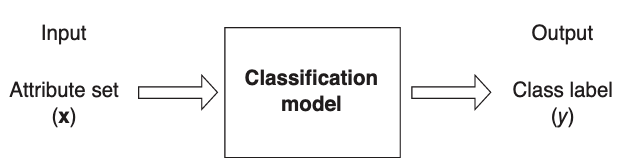
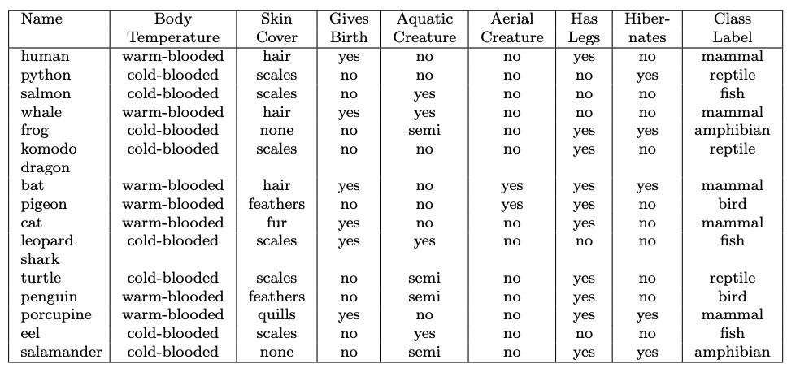
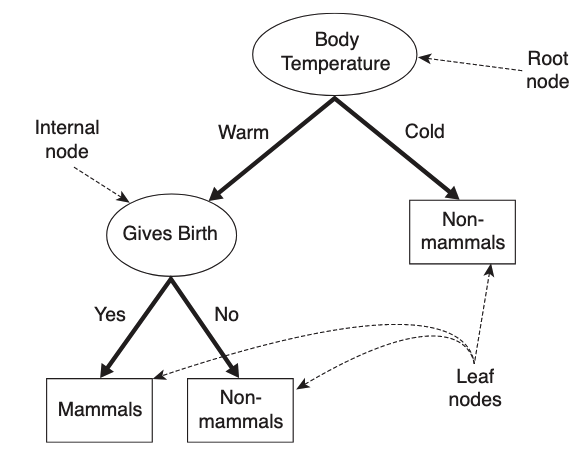
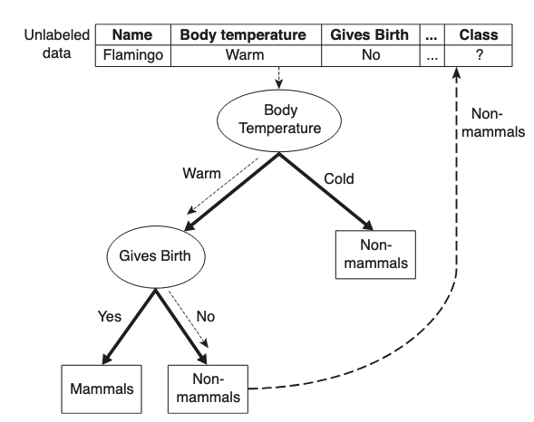
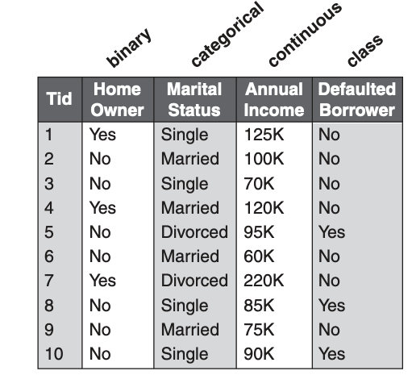
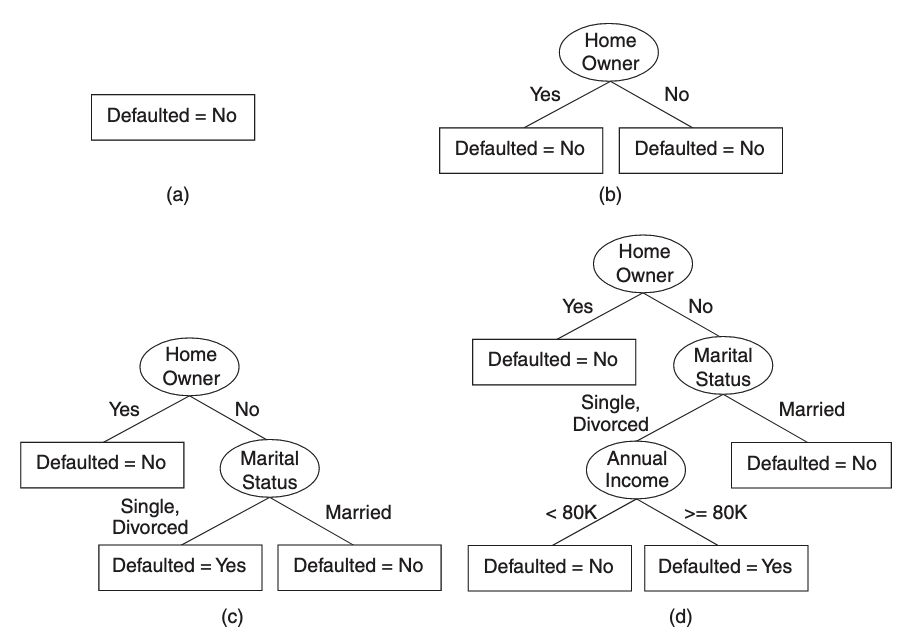
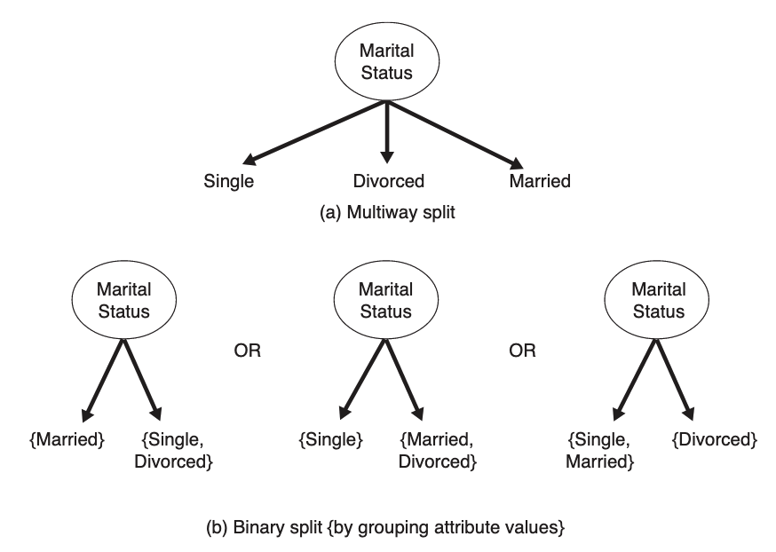

# 决策树

## 了解分类

分类（classification）是机器学习中一类算法，如下图所示，分类算法的核心任务就是对任何输入的数据，根据其特征，利用分类模型，预测该数据的类别标签。



对数据 $$(\pmb{x},y)$$ ，$$\pmb{x}$$ 有多个特征，$$y$$ 是该样本的标签。如下表，是一个关于脊椎动物的数据集，其中：mammal（哺乳动物）,bird, fish, reptile（爬行动物）, amphibian（两栖动物）就是样本的类别标签，其他项（列）则为样本的特征或者属性。



特征或属性的值可以是离散值，也可以是连续值，但是类别标签必须是离散值（这是用于分类和用于回归的数据之间的差异）。

**定义：分类**，即学习一个目标函数 $$f$$ ，能依据样本  $$\pmb{x}$$ 的属性预测一个对应的标签 $$y$$ 。

目标函数 $$f$$ 亦即分类模型。

适合于分类的数据集标签：

- 二元型
- 称名型$$^{[1]}$$

不适合分类模型的标签：

- 顺序型$$^{[1]}$$ 标签，例如对人的标签“高收入、中等收入、低收入），则不能有效地分类。
- 具有“子类——父类”关系的标签，例：人和猩猩都是“灵长动物”，是“哺乳动物”的子类

## 决策树$$^{[3]}$$

决策树（Decision Tree）是一种简单且用途广泛的非参数的有监督学习的算法，它包含分类和回归。以下重点介绍分类。

以对上述脊椎动物数据为例，如果要判断某一种脊椎动物的类别，可以用下图方式构建一个决策树。



1. Root node：根结点。是决策树的开始，选择一个合适的特征。根结点没有输入的边，可以有多个或者零个输出边。根结点包含样本全集。
2. Internal node：内部结点。每个内部结点有一个输入边，有两个或多个输出边。
3. Leaf node：叶结点，终端结点，叶子。有一个输入边，没有输出边。

叶结点对应于决策结果，其他每个结点则对应于一个属性（特征）测试；每个结点包含的样本集合根据属性测试的结果被划分到子结点中；根结点包含样本全集$$^{2}$$。

决策树中，每个叶结点就是一个类别标签。非终端结点，包括根结点和内部结点，都含有属性测试条件，用以划分各个样本（记录）。以上图为例，以属性“Body Temperature”为根结点，由此将样本划分为“冷血动物”（cold-blooded）和“恒温动物”（warm-blooded）。而“冷血动物”都不是哺乳动物，所以右侧的节点即为叶结点，对应一种类别标签“Non-mammals”。如果样本是恒温动物（Warm），则要看子节点，通过属性“Gives Birth”再划分。

按照上面的方式，直到确定某个样本最终的叶结点。从而能预测该样本的类别。

但是，对于数据集而言，有那么多个属性或特征，在根结点和每个内部结点，分别使用哪个属性？如下图，针对一个待预测的记录，按照虚线的路径完成了对其类别的预测。



如果在根结点和内部结点选择其他特征，则会有另外的预测过程。

### Hunt 算法（亨特算法）

Hunt 算法是一种最早出现的决策树算法，也是其他很多算法，如 ID3、C4.5 和 CART 的基础。

在 Hunt 的算法中，以递归方式建立决策树，将样本相继划分成比较纯的子集。所以“比较纯”，就是该子集中的样本，尽可能是同一类别的。

设 $$D_t$$ 表示训练集数据样本，与其对应的结点标记为 $$t$$ 。$y=\{y_1,y_2,\cdots,y_c\}$ 表示类别标签。

Hunt 算法的过程是：

1. 如果 $$D_t$$ 中的所有样本都属于同一个类 $$y_t$$ ，则 $$t$$ 是叶结点，其标签是 $$y_t$$ 。
2. 如果 $$D_t$$ 中的样本不属于同一个类，就要选择一个**属性测试条件**（attribute test condition），用以将数据集中的样本划分成更小的子集。针对每个测试条件的输出，均生成一个子结点，并将数据集 $$D_t$$ 中的记录也划分出子集。
3. 然后针对子结点递归上述算法。

以下表所示的数据集为例，演示 Hunt 算法的过程：

<center>表 1</center>



1. 默认所有的借款者人都能还贷，即 `Defaulted=No` （“借款人违约=否”，即借款人没有违约），如下图中的（a）所示，它构成了一个独立结点。
2. 如（b）所示，根结点含有两个类别的全部记录（样本），根据“Home Owner”这个属性测试条件的输出，将数据集划分为了两个更小的子集。为什么要首先选择这个属性测试？后面会讨论。现在姑且假设我们选择这个属性是最佳的划分。
3. 从上述数据集中可以看出，所有是“业主”（即 “Home Owner”的值是 “Yes”，表示拥有房产者）的，都能偿还贷款，即 “Defaulted=No”。因此根结点的左子结点为叶结点，并且标签是 `Defulted=No` 。
4. 对于右边的子结点，继续递归调用 Hunt 算法，如图（c）所示。一直到所有记录都属于同一个类别位置。（c）和（d）分别显示了每次递归调用的过程。



在上述过程中，每一步都会有叶结点生成，这其实是由于数据集中数据的“可以设计”，以及比较巧妙地安排了根结点和各个内部结点的顺序，在一般的情况不一定皆如此。因此就要考虑叶结点的产生条件，即递归返回$$^{[2]}$$：

- 当前结点包含的样本全属于同一了别，则无需再划分
- 当前属性集为空，或是所有样本在所有属性上取值相同，无法划分。则把当前结点标记为叶结点，并将其类别设定为该节点所含样本最多的类别。
- 当前结点包含的样本集合为空，不能划分。把当前结点标记为叶结点，将其类别设定为其父结点所含样本最多的类别。

- 创建子结点时，其所对应的数据集可能为空。

通过上述决策树的算法过程，如下问题是显而易见的：

1. 如何最优的属性测试条件，即最优划分的属性。上图中是从“Home Owner”开始的，其根据何在？
2. 何时终止决策树的生长。虽然可以在所有结点都达到前述“不能划分”状态时，决策树会终止，但是否可以在之前设置终止标准？

### 特征（属性）类型

在决策树算法中，根据属性测试条件，为不同类型的属性，产生不同的输出。

- 二元型，即该属性的值是二分类的数据，它产生两个输出结果。

- 称名型，此中类型的属性的值可以有多个，如下图所示。（a）中生成了多个划分，即每个值一个划分。另外，在有的算法中，比如 CART ，只能有两个划分，于是就要按照（b）部分“两两组合”形成三组划分，即对 $$k$$ 个属性，可以有 $$2^{k-1}-1$$ 中划分组合。

  

- 顺序型，根据顺序型属性的值，可以有两个划分，也可以是多划分。

- 连续型，根据设置区间范围，确定划分数量。

### 划分选择

决策树的关键在于如何选择最优划分属性。一般而言，随着划分过程不断进行，我们希望决策树的分支结点所包含的样本极可能属于同一类别，即结点的“纯度”（purity）越高越好，或者“不纯度”（impurity）越低越好。

**1. 信息增益**

继续使用前述“借贷偿还”数据，其中共计 10 个样本，标记为 “Defaulted=Yes” 的样本有 3 个。根据信息熵的定义$$^{[4]}$$：
$$
H(P)=-\sum_{i=1}^{n}p_i\text{log}p_i\tag{1}
$$
对于本数据集而言，以 “Defaulted” 的值为标准，可以计算该数据集 $$D$$ 的熵（也可以说是特征或者属性 “Defaulted” 的熵，因为这个特征的值是整个数据集每个样本的标签）。

样本标签为 “Defaulted=Yes” 的概率用此类样本占总样本数量的比例估计（即用频次估计）：$$p_1=\frac{3}{10}$$ ，则样本标签为 “Defaulted=No” 的概率可以估计为：$$p_2=\frac{7}{10}$$ 。

由此计算得到全体数据集 D 的信息熵（如下使用机器学习中常用的符号）：
$$
H(D)=-\sum_{i=1}^2p_i\text{log}_2p_i=-\left(\frac{3}{10}\text{log}_2\frac{3}{10}+\frac{7}{10}\text{log}_2\frac{7}{10}\right)=0.881\tag{2}
$$
熵描述了系统的**无序程度**，上述信息熵，则定量地描述了数据集的**不纯度**，信息熵越大，则数据集不纯度越高。比如：一个系统是由人组成，如果每个人都有各自的行为，且各自都不相同，那么这个系统就很混乱，也就是无序程度高，用信息熵来讲，就是系统“很不纯”，里面充斥着各色人等。如果组成系统的所有人，行动一致，整齐划一。那么这个系统就“很纯”了，也就很有秩序了，无序程度很低。或者说，这个数据集中只有一个类别，于是 $$p_i=1$$ ，则 $$H(D)=0$$ ，即不纯度最低。

如果以特征 “Home Owner” 为标准，将数据集划分为两部分，其中 “Home=Yes” 的样本构成了 $$D_1$$ 数据集，其样本数量表示为 $$|D_1|=3$$ ；同理，“Home=No” 所构成的数据集 $$D_2$$ 的样本数量 $$|D_2|=7$$ 。

那么，从这个角度讲，整个数据集 $$D$$ 的熵就是以 “Home Owner” 的划分为前提的条件熵（将此条件记作 $$Home$$ ），则对数据集 $$D$$ 的条件熵可以表示为$$^{[4]}$$：
$$
H(D|Home)=\sum_{j}p(Home)H(D|Home=D_j)\tag{3}
$$
其中

-  $$j$$ 表示根据 “Home Owner” 划分的数据集数量，在本例中一共有两个，即上述的 $$D_1$$ 和 $$D_2$$ ，于是 $$j=1,2$$

- $$p(Home)$$ 表示根据条件 “Home Owner” 得到的划分后的数据集概率，在本例中，对于 $$D_1$$ 和 $$D_2$$ 两个类别，其概率可用估计为：$$p(Home=D_j)=\frac{|D_j|}{|D|}$$ ，即 $$p(Home=D_1)=\frac{|D_1|}{|D|}=\frac{3}{10},p(Home=D_1)=\frac{|D_2|}{|D|}=\frac{7}{10}$$ 

- $$H(D|Home=D_j)$$ 表示划分出来的数据集 $$D_j$$ 后，数据集 $$D$$ 的熵，其中 $$j=1,2$$ 。即：$$H(D|Home=D_j)=-\sum_{i=1}^2p_{ji}\text{log}p_{ji}$$ ，显然 $$-\sum_{i=1}^2p_{ji}\text{log}p_{1i}=H(D_j)$$

注意：前面已经提到过，对特征 “Defaulted” 而言，它就代表了整个数据集 $$D$$ 的标签，所以，（3）是中对数据集 $$D$$ 的条件熵，也就是在已知了 “Home Owner” 特征之后的 “Defaulted” 特征的条件熵，即：$$H(D|Home)=H(Defaulted|Home)$$ 。

所以，一些机器学习的资料中，将此时的（3）式表述为“被划分后的两个数据集 $$D_1$$ 和 $$D_2$$ 的熵的加权求和”，即根据 “Home Owner” 划分后的数据集 $$D$$ 的熵是：
$$
H(D|Home)=\frac{|D_1|}{|D|}H(D_1)+\frac{|D_2|}{|D|}H(D_2)\tag{4}
$$
针对上述数据集而言，可以计算：
$$
\begin{split}
H(D|Home)&=\frac{|D_1|}{|D|}H(D_1)+\frac{|D_2|}{|D|}H(D_2)
\\
&=\frac{|D_1|}{|D|}\left(-\sum_{i=1}^2p_{1i}\text{log}_2p_{1i}\right)+\frac{|D_2|}{|D|}\left(-\sum_{i=1}^2p_{2i}\text{log}_2p_{2i}\right)
\end{split}\tag{5}
$$


其中 $$p_{ji},(j=1,2)$$ 代表在数据集 $$D_j,(j=1,2)$$ 中样本标签分别为“Yes”和“No”的概率，其估计值分别为：

$$\begin{split}&D_1:p_{11}=\frac{0}{3}=0,(\text{Default=Yes});p_{12}=\frac{3}{3}=1,(\text{Default=No})\\&D_2:p_{21}=\frac{3}{7},(\text{Default=Yes});p_{22}=\frac{4}{7},(\text{Default=No})\end{split}$$

将上述概率，代入到（5）式，则：
$$
\begin{split}
上接（5）式：\\
H(D|Home)&=-\left[\frac{3}{10}\left(0\text{log}_20+1\text{log}_21\right)+\frac{7}{10}\left(\frac{3}{7}\text{log}_2\frac{3}{7}+\frac{4}{7}\text{log}_2\frac{4}{7}\right)\right]
\\
&=0.690
\end{split}\tag{6}
$$
有了划分后的数据集 $$D$$ 的信息熵减少了，这说明它的不纯度下降了，或者说是“纯度”提升了。

对于给定的数据集 $$D$$ ，它的熵与依据某个条件划分之后的熵——条件熵——的差，称为“信息增益”$$^{[4]}$$ （Information Gain），即：$$IG(X,Y)=H(X)-H(X|Y)$$ ，故：
$$
\begin{split}
IG(D, Home)&= H(D)-H(D|Home)\quad(代入（5）式)\\
&=H(D)-\sum_{j=1}^K\frac{|D_j|}{|D|}H(D_j)
\end{split}\tag{7}
$$
根据（2）式和（6）式的计算结果，可以得到以 “Home Owner” 划分后的信息增益：
$$
IG(D,Home)=0.881-0.690=0.191\tag{8}
$$
信息增益越大，意味着使用该属性进行划分，所得到的“纯度提升”越大。

信息熵表示在知道某个条件后，某个随机变量的不确定的减少量。

例如，再以 “Marital Status” 划分，计算相应的信息增益：
$$
IG(D,Marital)=0.281\tag{9}
$$
比较（8）和（9）的结了果，发现根据 “Marital Status” 划分的信息增益更大，所以依据  “Marital Status” 划分比依据 “Home Owner” 划分更好。

**ID3决策树算法利用信息增益作为划分数据集的方法**。

**2. 信息增益率**

（7）式中所定义的信息增益，对特征（属性）的取值数量比较多的特征有利。为了减少此种影响，定义了**信息增益率**：
$$
{Gain\_ratio}(D,a)=\frac{Gain(D,a)}{IV(a)}\tag{10}
$$

- $$Gain(D,a)$$ 表示以属性 $$a$$ 为划分得到的信息增益，即（7）式

- $$IV(a)$$ 称为属性 $$a$$ 的**固有值**（Intrinsic Value），即属性 $$a$$ 的熵：
  $$
  IV(a)=-\sum_{j=1}^k\frac{|D_j|}{|D|}\text{log}_2\frac{|D_j|}{|D|}\tag{11}
  $$
  以表1 的数据为例：

  $$IV(Home)=-\left(\frac{3}{10}\text{log}_2\frac{3}{10}+\frac{7}{10}\text{log}_2\frac{7}{10}\right)=0.881$$

  $$IV(Marital)=-\left(\frac{4}{10}\text{log}_2\frac{4}{10}+\frac{4}{10}\text{log}_2\frac{4}{10}+\frac{2}{10}\text{log}_2\frac{2}{10}\right)=1.522$$

  结论：属性取值的数量越多，则固有值越大。

  根据（10）以及（8）和（9）的计算结果，得到：

  $$Gain\_ratio(D,Home)=\frac{0.191}{0.881}=0.217;\quad Gain\_ratio(D,Martial)=\frac{0.281}{1.522}=0.185$$

  结论：信息增益率对属性取值数量较少的属性有所偏好，即该属性的信息增益率较大。

**信息增益率应用于 C4.5 决策树算法中**，但是，并非直接选择增益率最大的作为候选划分属性，而是使用一个启发方法：先从候选划分属性中找出信息增益高于平均水平的属性，在从中选择信息增益率最高的。$$^{[2]}$$

**3. 基尼指数**

基尼指数（Gini Index）用于 CART（Classfification And Regression Tree，分类与回归树）决策树算法中选择划分的属性，其定义为：

设数据集 $$D$$ 有 $$L$$ 个分类（即标签），样本属于第 $$i$$ 个类别的概率为 $$p_i,(i=1,2,\cdots,k)$$ ，则数据集 $$D$$ 的基尼指数为：
$$
Gini(D)=1-\sum_{i=1}^Lp_i^2\tag{12}
$$
 其中 $$p_i$$ 用 $$p_i=\frac{|C_i|}{|D|}$$ 来估计，$$|C_i|$$ 表示某个类别的样本数量，$$|D|$$ 表示总样本数量。

以表1的数据为例，共有 2 个分类，且 $$|C_1|=3,(Defulted=Yes);|C_2|=7$$ ，则数据集 $$D$$ 的基尼系数为：

$$Gini(D)=1-\sum_{i=1}^2\frac{|C_i|}{|D|}=1-\left[\left(\frac{3}{10}\right)^2+\left(\frac{7}{10}\right)^2\right]=0.42$$

基尼指数反映了数据集中随机抽取两个样本，其类别标签不一致的概率。也就是，基尼指数越小，数据集的纯度越高。

如果利用特征 $$a$$ 将数据集 $$D$$ 划分为 $$K$$ 部分，于是仿照（4）式，可以计算此条件下的数据集 $$D$$ 的基尼指数，即为每部分 $$D_j,(j=1,\cdots,K)$$ 的基尼指数的加权和：
$$
Gini(D|a)=\sum_{j=1}^K\frac{|D_j|}{|D|}Gini(D_j)\tag{13}
$$
例如表一中的数据，分别按照 “Home Owner” 和 “Marital Status” 两个属性划分，得到：

$$Gini(D|Home)=\frac{3}{10}\left[1-\left((\frac{0}{3})^2+(\frac{3}{3})^2\right)\right]+\frac{7}{10}\left[1-\left((\frac{3}{7})^2+(\frac{4}{7})^2\right)\right]=0.343$$

$$Gini(D|Marital)=\frac{4}{10}\left[1-\left((\frac{2}{4})^2+(\frac{2}{4})^2\right)\right]+\frac{4}{10}\left[1-\left((\frac{4}{4})^2+(\frac{0}{4})^2\right)\right]+\frac{2}{10}\left[1-\left((\frac{1}{2})^2+(\frac{1}{2})^2\right)\right]=0.333$$

由于基尼系数小，纯度高，所以上述两个属性相比，选择 “Marital Status” 划分更优。

### 决策树算法简介

**1. ID3 决策树算法**（采用信息增益划分属性）和**C4.5决策树算法**（采用信息增益比划分属性）$$^{[5]}$$。

- 输入：
  - 训练数据集 $$D$$
  - 特征集 $$A$$
  - 特征信息增益阈值 $$\epsilon\gt0$$
- 输出：决策树 $$T$$
- 算法步骤：
  1. 若 $$D$$ 中所有样本均属于同一类别 $$C_k$$ ，则 $$T$$ 为单结点树，并将 $$C_k$$ 作为该结点的类标签，返回 $$T$$。（这是一种特殊情况，数据集中只有一个类别。）
  2. 若 $${A}=\phi$$ ，则 $$T$$ 为单结点树，将 $$D$$ 中的样本数最大的类 $$C_k$$ 作为该结点的类标签，返回 $$T$$。（这也是一种特殊情况，数据集的特征集合为空。）
  3. 否则，计算 $$g(D,A_i)$$ ，其中 $$A_i\in A$$ 为特征集合中的特征，选择信息增益（ID3）或者信息增益比（C4.5）最大的特征 $$A_g$$。
  4. 判断 $$A_g$$ 的信息增益或者信息增益比：
     1. 若 $$g(D,A_g)\lt\epsilon$$ ，则置 $$T$$ 为单节点树，将 $$D$$ 中样本数最大的类 $$C_k$$ 作为该结点的类标签，返回 $$T$$。
     2. 若 $$g(D,A_g)\ge\epsilon$$ ，则对 $$A_g$$ 特征的每个可能取值 $$a_i$$ ，根据 $$A_g=a_i$$ 将 D 划分为若干个非空子集 $$D_i$$ ，将 $$D_i$$ 中样本数最大的类作为标签，构建子结点，有子结点及其子结点构成 $$T$$，返回 $$T$$。
  5. 对第 $$i$$ 个子结点，以 $$D_i$$ 为训练集，以 $$A-\{A_g\}$$ 为特征集，递归递用用前面的步骤，得到子树 $$T_i$$ ，返回 $$T_i$$ 。

**2.  ID3 和 C4.5 分析**$$^{[5]}$$

- C4.5 算法继承了 ID3 的有点，并在以下几方面进行了改进：
  - 用信息增益比选择划分的属性，克服了用信息增益时偏向选择取值较多的属性之不足
  - 在树构造过程中进行剪枝
  - 能够完成对连续属性的离散化处理
  - 能够对不完整数据进行处理
- C4.5 算法：
  - 优点：产生的分类规则易于理解，准确率较高
  - 缺点：在树的构造过程中，需要对数据集进行多次的顺序扫描和排序，因为导致算法的低效
  - C4.5 适用于能够驻留内存的数据集，当训练集大到无法在内存容纳时，程序无法运行
  - C4.5 生成的是多叉树，即一个父结点有多个子结点。但是，在计算机中，二叉树的运算效率更高。
- 决策树可能只用到了特征集合中的部分特征
- 两个算法生成的树容易过拟合。
- 两个算法那都用了熵的计算，其中的对数运算耗时较大，特别是针对连续值时，还要有排序运算。

### 剪枝

对于训练集而言，决策树的学习过程中，为了能正确分类，必然会造成结点划分出现重复，这样将导致决策树模型分支过多。虽然对训练集而言是一个好模型，但它也由于兼顾了训练集数据的自身一些专有特点，而导致泛化能力减弱，这就是**过拟合**。

出现过拟合现象的原因，也可能是数据中的噪声或者缺少代表性的样本等原因。

对于决策树，解决过拟合的方法就是控制模型的复杂度，简化模型，即减少分支，将此操作形象地称之为**剪枝**。

对决策树的剪枝分如下两种：

- 先剪枝（或预剪枝$$^{[2]}$$）（prepruning）：即在决策树生成过程中，对每个结点在划分前进行估计，若当前结点的划分不能带来决策树泛化性能提升，则停止划分，并将当前结点作为叶结点。或者对结点的不纯度的度量设置一个阈值，低于该阈值则停止扩展该结点。先剪枝可能导致欠拟合。
- 后剪枝（post-pruning）：决策树完成之后，自底向上对非叶结点进行考察，若将该结点对应的子树替换为叶结点能提升决策树的泛化能力，则将该结点替换为叶结点$$^{[2]}$$。

后剪枝避免了最大限度避免欠拟合，泛化性能优于先剪枝，但计算量比较大。$$^{[2]}$$

对于泛化性能的衡量，在参考资料 [2] 中将用于训练的数据集采用“留出法”，将一部分留作“验证集”。并用验证集计算各个结点的预测精度，依次判断泛化性能。

另外，也可以考察决策树整体的损失函数或者代价函数。这种方法一般用之于后剪枝。

## CART 算法

对于决策树的两个经典算法 ID3 和 C4.5，前面已经介绍了它们的优缺点，其中有一个问题，是比较关键的，那就是计算量的问题。ID3 采用了“信息增益”，C4.5 采用了“信息增益率”，作为选择划分的标准量，但是，这两个量的计算中，都要计算对数，而对数运算耗时比较大。而与之相比，CART 算，采用的是“基尼指数”，将（12）式复制如下：
$$
Gini(D)=1-\sum_{i=1}^Lp_i^2\tag{12}
$$
将（12）式与（1）式的熵 $$H(P)=-\sum_{i=1}^{n}p_i\text{log}p_i$$ 的定义比较，利用对数的泰勒展开式：
$$
\text{ln}x=(x-1)-\frac{(x-1)^2}{2}+\frac{(x-1)^3}{3}-\cdots\tag{14}
$$
取一级近似，得：
$$
H(P)\approx-\sum_{i=1}^np_i(p_i-1)=\sum_{i=1}^n(p_i-p_i^2)=1-\sum_{i=1}^np_i^2\tag{15}
$$
（15）式将对数运算，近似的转化为求和运算，从而减少了计算量，于是将其定义为（12）式所示的基尼指数。

CART算法，全称：Classification And Regression Tree，简称：CART，翻译为：分类与回归树。这说明此算法可以实现分类，又可以实现回归。

- CART 分类树，使用基尼指数最小化策略，基尼指数跟熵一样，表示特征的不纯度（或者无序度），基尼指数越小，则不纯度越低。
- CART 回归树使用平方误差最小化策略。

## 连续值处理

前述内容中，默认所社驾到的特征都是离散型的。在现实中，也会遇到连续型的特征。对此的处理方法就是将其离散化，一种简单的方法是使用二分法（C4.5采用此方法）。

假设数据集 $$D$$ 的特征 $$A$$ 是连续型，且取值从小打到排序后为 $$a_1,a_2,\cdots,a_M$$ ，于是可以选择 $$M-1$$ 个划分点，依次为：$$\frac{a_1+a_2}{2},\frac{a_2+a_3}{2},\cdots,\frac{a_{M-1}+a_{M}}{2}$$ 。然后像离散特征值一样来考察这些划分点，选取最优的划分点进行样本集合的划分。

## 缺失值处理$$^{[2]}$$

解决两个问题：

1. 如何在特征的取值缺失的情况下进行划分特征的选择？

2. 在给定划分特征之后，如果样本在该特征上的值缺失，怎么确定样本属于那个类别？

### 问题1：选择特征

假设训练集数据 $$D$$ 和特征 $$A$$ ，用 $$\widetilde{D}$$ 表示 $$D$$ 中在属性 $$A$$ 上没有缺失值的样本子集。

是否选择特征 $$A$$ 作为划分，显然必须根据数据集 $$\widetilde{D}$$ 进行判断。

假设特征 $$A$$ 中可取的值有 $$\{a_1,a_2,\cdots,a_K\}$$ ，比如特征 $$性别$$ ，它的可取值就有 $$\{男, 女\}$$ 或者写成 $${1,0}$$ ，不包含缺失值。

在 $$\widetilde{D}$$ 中，特征 $$A$$ 的值是 $$a_i,(1\le i\le K)$$ 的样本组成的数据集，用 $$\widetilde{D}^i$$ 表示。

假设数据集 $$\widetilde{D}$$ 共有 $$M$$ 个类别 ，那么第 $$j$$ 个类别的样本构成的数据集合用 $$\widetilde{D}_j,(j=1,2,\cdots,M)$$ 。

根据上面的假设，可以有：
$$
\widetilde{D}=\cup_{j=1}^M\widetilde{D}_j\\
\widetilde{D}=\cup_{i=1}^K\widetilde{D}^i\tag{16}
$$
在前述讨论决策树的学习过程中，并没有说明每个样本的权重问题，其实是默认为每个样本的权重都是 1，即是平权的。

现在，假设对每个样本赋予权重，对于样本 $$\pmb{x}$$ ，其权重用 $$w_{\pmb{x}}$$ 表示。并定义：
$$
\rho=\frac{\sum_{\pmb{x}\in\widetilde{D}}w_{\pmb{x}}}{\sum_{\pmb{x}\in{D}}w_{\pmb{x}}}\tag{17}
$$
（17）式可以得到无缺失值的样本占所有样本的比例。
$$
\widetilde{p}_j=\frac{\sum_{\pmb{x}\in\widetilde{D}_j}w_{\pmb{x}}}{\sum_{\pmb{x}\in\widetilde{D}}w_{\pmb{x}}},(1\le{j}\le{M})\tag{18}
$$
（18）式表示在没有缺失值的样本数据集 $$\widetilde{D}$$ 中，第 $$j$$ 个类别所占的比例。
$$
\widetilde{r}_i=\frac{\sum_{\pmb{x}\in\widetilde{D}^i}w_{\pmb{x}}}{\sum_{\pmb{x}\in\widetilde{D}}w_{\pmb{x}}}\tag{19}
$$
（19）式表示在没有缺失值的样本数据集 $$\widetilde{D}$$ 中，属性 $$A$$ 上取值为 $$a_i$$ 的样本所占的比例。

根据（17）（18）（19）的定义，对信息增益的定义式（7）的定义推广为：
$$
\begin{split}
IG(D, A) &= \rho\times IG(\widetilde{D},A)
\\&=\rho\times\left(H(\widetilde{D})-\sum_{i=1}^K\widetilde{r}_iH(\widetilde{D}^i)\right)
\end{split}\tag{20}
$$
其中：$$H(\widetilde{D})=\sum_{j=1}^M\widetilde{p}_j\text{log}_2\widetilde{p}_j$$

### 问题2：给定划分特征后，确定有缺失值的样本的类别

如果样本 $$\pmb{x}$$ 在划分特征 $$A$$ 上取值已知，则将样本 $$\pmb{x}$$ 划入与其取值对应的子结点，且样本的权重在子结点中保持为 $$w_{\pmb{x}}$$ 。

如果样本 $$\pmb{x}$$ 在划分特征 $$A$$ 上取值未知，则将样本 $$\pmb{x}$$ 同时划入所有子结点，且样本的权重在特征的值 $$a_i$$ 对应的子结点中调整为 $$\widetilde{r}_iw_{\pmb{x}}$$ 。即让同一个样本，以不同的概率划入到不同的子结点。

C4.5 算法采用的就是上述解决方案。

## 实现案例

### 决策树分类

```python
from sklearn.datasets import load_iris
from sklearn import tree
iris = load_iris()
X, y = iris.data, iris.target
clf = tree.DecisionTreeClassifier()
clf = clf.fit(X, y)
```

在上面的模型中，没有指定用那种算法。在 `DecisionTreeClassifier` 的参数中，有一个参数：`criterion='gini'` ，表示用于指定划分的评价标准，

- `'gini'`，采用基尼指数，也就是 CART 分类算
- `'entropy'`  或 `log_loss` ，都是采用信息增益

此外，还有其他参数，都是用于对树进行各种限制，具体参考：https://scikit-learn.org/stable/modules/generated/sklearn.tree.DecisionTreeClassifier.html#sklearn.tree.DecisionTreeClassifier

将上面的决策树的决策过程，可以用下面方式显示出来：

```
from sklearn.tree import export_text
r = export_text(clf, feature_names=iris['feature_names'])
print(r)
```

### 决策树回归

在 sklearn 中，使用 `DecisionTreeRegressor` 类实现决策树回归。

https://scikit-learn.org/stable/modules/generated/sklearn.tree.DecisionTreeRegressor.html#sklearn.tree.DecisionTreeRegressor

案例如下：

```python
import numpy as np
from sklearn.tree import DecisionTreeRegressor
import matplotlib.pyplot as plt

# 创建随机数组成的数据集，且符合正弦函数
rng = np.random.RandomState(1)
X = np.sort(5 * rng.rand(80, 1), axis=0)
y = np.sin(X).ravel()
y[::5] += 3 * (0.5 - rng.rand(16))

# 训练模型
regr_1 = DecisionTreeRegressor(max_depth=2)   # 指定树的深度
regr_2 = DecisionTreeRegressor(max_depth=5)
regr_1.fit(X, y)
regr_2.fit(X, y)

# 预测
X_test = np.arange(0.0, 5.0, 0.01)[:, np.newaxis]
y_1 = regr_1.predict(X_test)
y_2 = regr_2.predict(X_test)

# 可视化
plt.figure()
plt.scatter(X, y, s=20, edgecolor="black", c="darkorange", label="data")
plt.plot(X_test, y_1, color="cornflowerblue", label="max_depth=2", linewidth=2)
plt.plot(X_test, y_2, color="yellowgreen", label="max_depth=5", linewidth=2)
plt.xlabel("data")
plt.ylabel("target")
plt.title("Decision Tree Regression")
plt.legend()
plt.show()
```

在 `DecisionTreeRegressor` 中有参数 `criterion=squared_error` ，默认采用均方误差策略最小化，或者说是评价划分准则，其它值可以参考官方文档说明。


## 参考资料

[1]. [统计学与心理学](http://math.itdiffer.com/chapter01.html)

[2]. 周志华. 机器学习[M]. 北京：清华大学出版社

[3]. Pang-Ning Tan. Introduction to Data Mining[M]. Pearson Education, Inc

[4]. 齐伟. 机器学习数学基础[M]. 北京：电子工业出版社

[5]. 华校专，王正林. Python大战机器学习[M]. 北京：电子工业出版社