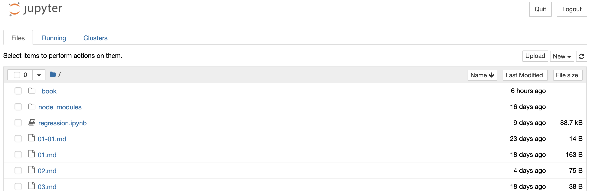
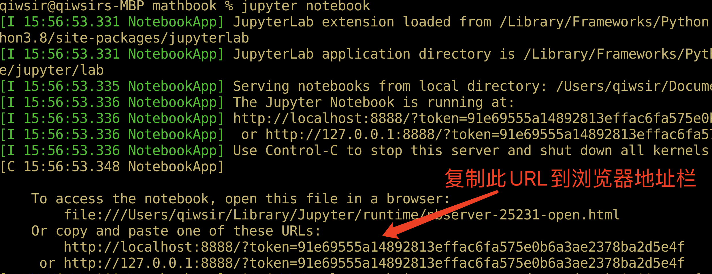
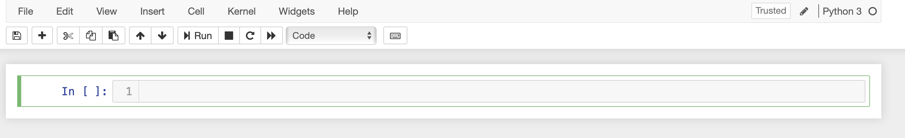
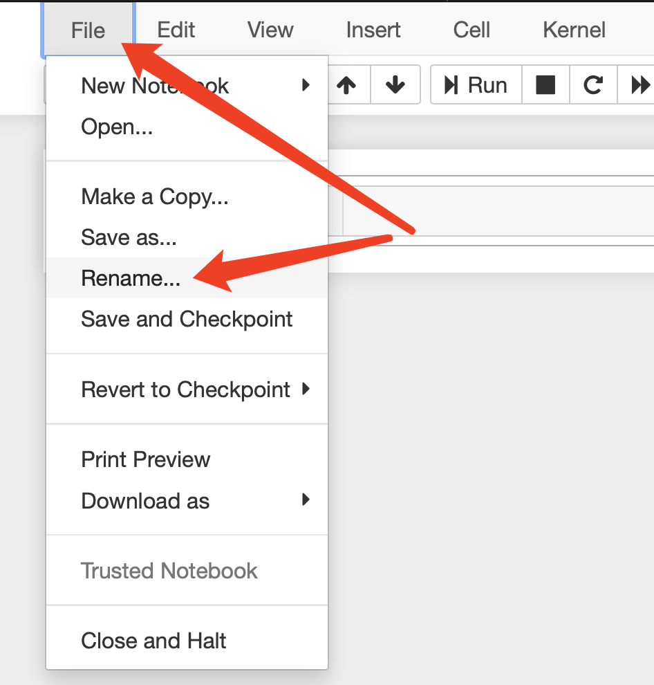
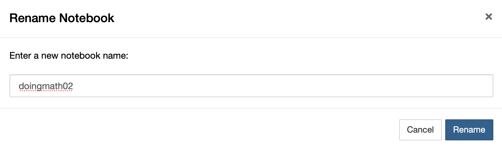
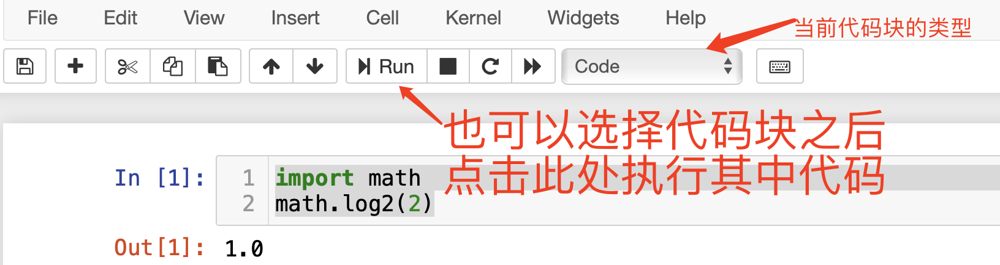
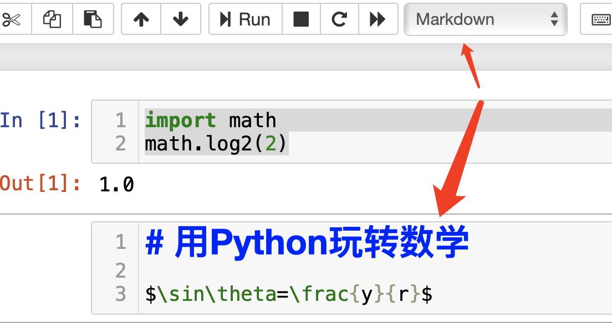
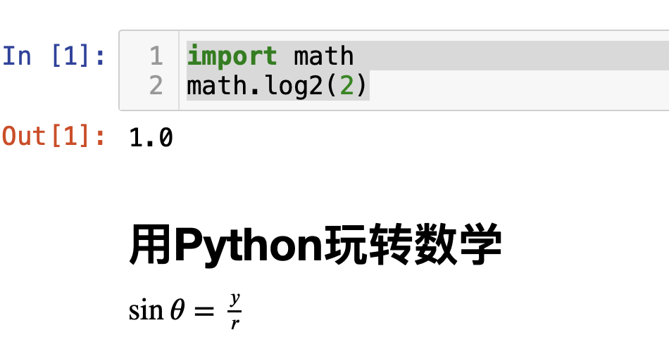

# Jupyter 简介

Jupyter是数据科学工程师经常用到的一种编辑器。

## 安装

官方网站：https://jupyter.org/

- 使用`pip`安装：

安装 JupyterLab

```python
pip install jupyterlab
```

JupyterLab是Jupyter的一个最新的版本。

此外，Jupyter还有一个版本，名为 NoteBook，也可以使用它。

```
pip install notebook
```

JupyterLab和NoteBook两者在基本功能上类似，可以选择其一使用。

- 使用`conda`安装

有的人喜欢使用`conda`维护有关模块，安装JupyterLab的方法是：

```
conda install -c conda-forge jupyterlab
```

本课程的演示中不使用`conda`。喜欢用的请自行在网上搜索有关资料。

## 启用

如果启动NoteBook，进入一个目录，一般要求，这个目录就是一个工作目录，用下面的方式启用NoteBook：

```
jupyter notebook
```

一般会自动打开默认浏览器，呈现如下图所示效果。



这里看到的目录或者文件，都来自启动NoteBook时所在的目录，即工作目录。

如果没有自动打开浏览器，可以在终端赋值下图所示的URL到浏览器地址栏。



## 应用

关于Jupyter的应用方法，网上的资料很多，可以参考。在本课程中，会随着应用，介绍一些用到的方法。

### 新建

如下图所示：


注意，选择一个适合的Python版本，特别是本地安装了多个版本的时候。

按照上图操作，点击“Python 3”之后，出现下图。



这样就新创建了一个Jupyter文件，它是一个扩展名为`.ipynb`的文件，有默认的文件名。

下面对当前文件改名。



然后弹出下面的对话框，里面原有的文件名是默认的，现在修改为`doingmath02`，并点击“Rename”按钮。



### 运行代码

在输入框中输入如下代码：

```python
import math
math.log2(2)
```

然后按 `shift`+`enter`组合键，执行这段代码，效果如下图。



图中的`In[1]`就是上面写入的代码，`Out[1]`中显示的是`In[1]`代码执行后的输出结果。

如上图所示，也可以点击“Run”按钮执行选中块的代码。

在上图中，还可以看到，当前块的类型是“Code”，点击那个下拉菜单，可以看到其他项目，比如，在下一个新的块中，选择“Markdown”，就可以在当前块中输入文本，并且可以用Markdown编辑符。



还是使用`shift+enter`的组合键，可以执行当前的Markdown块，就可以看到最终的效果。



### 执行系统指令

在当前的Jupyter中，也可以执行操作系统的指令。注意，要运行自己的操作系统的指令。我这里所用的是Mac OS操作系统。

```
!ls
```

`ls`是一个查看当前目录中文件和目录的指令，特别说明，这个命令在Linux系统和Mac OS系统中适用，如果所用的是windows系统，请用相应的指令（推荐参阅参考文献[1]）。

在Notebook中输入操作系统指令的时候，前面要增加`!`符号——英文的。

用`shift+enter`组合键执行，显示当前工作目录的所有内容列表。

执行下面的指令，可以安装Python的第三方模块，这与在终端执行安装指令是等效的。

```
!pip install package-name
```

## 在线环境

类似Jupyter这样的在线平台，国外的有Google的Colab，功能强大。地址：https://colab.research.google.com/

国内的，可以使用百度的AI Studio，地址：https://aistudio.baidu.com/

下面的视频中介绍了 AI Studio的介绍，供参考：

<iframe src="//player.bilibili.com/player.html?aid=711852170&bvid=BV1KD4y1m7hV&cid=228202605&page=1" scrolling="no" border="0" frameborder="no" framespacing="0" allowfullscreen="true"> </iframe>

原视频地址：https://www.bilibili.com/video/BV1KD4y1m7hV/


## 参考文献

[1]. [https://zh.wikipedia.org/wiki/MS-DOS命令列表](https://zh.wikipedia.org/wiki/MS-DOS%E5%91%BD%E4%BB%A4%E5%88%97%E8%A1%A8)

[2]. 跟老齐学Python：数据分析. 齐伟. 北京：电子工业出版社

