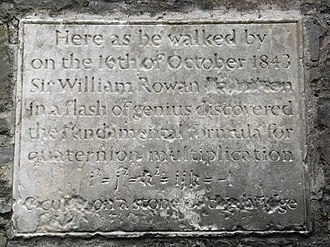

# 四元数、点积和叉积

*打开本页，如果不能显示公式，请刷新浏览器。*

《机器学习数学基础》第1章1.4节介绍了内积、点积的有关概念，特别辨析了内积空间、欧几里得空间；第4章4.1.1节介绍了叉积的有关概念；4.1.2节介绍了张量积（也称外积）的概念。

以上这些内容，在不同资料中，所用术语的含义会有所差别，读者阅读的时候，不妨注意，一般资料中，**都是在欧几里得空间探讨有关问题，并且是在三维的欧氏空间中**，其实质所指即相同。但是，如果不是在欧氏空间中，各概念、术语则不能混用。

下面从数学史的角度，参考有关文献，阐述 $$\mathbb{R}^3$$ 空间中点积和叉积的内容，目的借此深入理解《机器学习数学基础》中有关概念。

再次强调，以下讨论，是在**三维欧几里得空间**。

而对点积和叉积的探讨，不得不从四元数开始。

## 四元数

### Sir William Rowan Hamilton

威廉·卢云·哈密顿爵士（英語：Sir William Rowan Hamilton，1805年8月4日－1865年9月2日），爱尔兰数学家、物理学家和天文学家。

“哈密顿”这个名称，在物理学中经常会见到，因为哈密顿在1833年建立了经典力学的重新表述（与之对应的另外一个表述是[拉格朗日](./lagrangemulti.html)力学）$$^{[4]}$$ ，并且此成果也被应用在量子力学中。

在数学方面，哈密顿最著名的贡献在于发现了**四元数**，在如今的计算机图形学、控制理论、信号处理、轨道力学等领域，都有四元数的应用。

此外，哈密顿还是语言天才，参考文献[5]中列出了他所懂的语言，抄录如下：

> 哈密顿还精通多種語言。除了歐洲語言之外，他還懂得波斯語、希臘語、拉丁語、希伯來文、古代巴勒底的巴比倫文、印度梵語、佛教原典所用的巴利語、義大利語、法語、阿拉伯語、孟加拉語、巴基斯坦語、馬來語、梵文和中文等。。 

哈密顿

### 四元数定义

在复数 $$z=a+bi$$ 中，虚数单位 $$i^2 = -1$$ ，每个复数都可以视为平面上的一个点。

在三维欧几里得空间中，每个点可以用一个有序数 $$(a,b,c)$$ 表示，这些点之间可以进行加法运算，但能不能做乘法运算？这个问题哈密顿也曾思考。据记载$$^{[6]}$$ ，1843年10月16日，哈密顿与夫人在运河边散步，经过一座桥，突然领悟到了四元数的定义，现在那座桥旁还立有石碑。

Brougham桥旁的石碑，这里是哈密顿获得四元素灵感之地

> 石碑上的内容如下：
>
> >  Here as he walked by on the 16th of October 1843 Sir William Rowan Hamilton in a flash of genius discovered the fundamental formula for quaternion multiplication
> > $$i^2 = j^2 = k^2 = ijk = −1$$
> > & cut it on a stone of this bridge.

每个四元数（quaternion）都是 $$1,i,j,k$$ 的线性组合，即一个四元数表示为：

$$a+bi+cj+dk$$

其中，$$i^2=j^2=k^2=ijk=-1$$ ，$$a,b,c,d$$ 是实数。

四元数加法，与向量加法类似：

$$(a_1+b_1i+c_1j+d_1k)+(a_2+b_2i+c_2j+d_2k)=(a_1+a_2)+(b_1+b_2)i+(c_1+c_2)j+(d_1+d_2)k$$

### 四元数乘法

根据四元数定义中规定的 $$i^2=j^2=k^2=ijk=-1$$ ，可以进行虚数单位间的乘法计算，例如：

- $$ijk = -1$$ ，右乘 $$k$$ ，得：$$ijk^2=ij(-1)=-ij=-k$$ ，即 $$ij=k$$ 。
- $$ijk = -1$$ ，左乘 $$i$$ ，得：$$i^2jk=(-1)jk=-jk=-i$$ ，即 $$jk=i$$ 。
- 根据 $$jk=i$$ ，左乘 $$j$$ ，得：$$j^2k=ji$$ ，即 $$-k=ji$$ 。
- ......

可以得到如下乘法表：

| .    | $$1$$  | $$i$$  | $$j$$  | $$k$$  |
| ---- | ---- | ---- | ---- | ---- |
| $$1$$  | $$1$$  | $$i$$  | $$j$$  | $$k$$  |
| $$i$$  | $$i$$  | $$-1$$ | $$k$$  | $$-j$$ |
| $$j$$  | $$j$$  | $$-k$$ | $$-1$$ | $$i$$  |
| $$k$$  | $$k$$  | $$j$$  | $$-i$$ | $$-1$$ |

从上表中会发现，四元数的乘法显然不满足交换律，比如 $$ij=k$$ ，而 $$ji=-k$$ 。

两个四元数相乘：

$$\begin{split}(a_1+b_1i+c_1j+d_1k)(a_2+b_2i+c_2j+d_2k)&=&&a_1a_2+a_1b_2i+a_1c_2j+a_1d_2k+b_1a_2i+b_1b_2i^2+b_1c_2ij+b_1d_2ik\\& &&+c_1a_2+c_1b_2ji+c_1c_2j^2+c_1d_2jk+d_1a_2+d_1b_2ki+d_1c_2kj+d_1d_2k^2\\&=&&(a_1a_2-b_1b_2-c_1c_2-d_1d_2)\\& &&+(a_1b_2+b_1a_2+c_1d_2-d_1c_2)i\\& &&+(a_1c_2-b_1d_2+c_1a_2+d_1b_2)j\\& &&+(a_1d_2+b_1c_2-c_1b_2+d_1a_2)k\end{split} \tag{1.1}$$

标量与四元数相乘：

$$\alpha(a+bi+cj+dk)=\alpha a+\alpha bi+\alpha cj+\alpha dk$$

四元数的加法运算和标量乘法运算，符合向量空间的加法和乘法封闭，以及向量空间的8条运算法则（参阅《机器学习数学基础》第1章1.2.1节），故四元数的集合可视为一个定义于实数的四维向量空间：

$$\mathbb{H} = \{a+bi+cj+dk|a,b,c,d\in\mathbb{R},i^2=j^2=k^2=ijk=-1\}$$

此向量空间的基为 $$\{1,i,j,k\}$$ 。

### 共轭和逆

设 $$q=a+bi+cj+dk$$ ，

- 四元数的共轭定义为：$$q^*=a-bi-cj-dk$$ 。

- 绝对值（模，长度，norm）：$$|q|=\sqrt{qq^*}=\sqrt{q^*q}=\sqrt{a^2+b^2+c^2+d^2}$$  （此处使用了 $$qq^*=q^*q$$ 结论，证明见后续内容 ）

- $$q_1,q_2\in\mathbb{H}$$ ，则 $$(q_1q_2)^*=q_2^*q_1^*$$ ，且 $$|q_1q_2|=|q_1||q_2|$$ 。

  **证明**

  $$\begin{split}|q_1q_2|^2 &= (q_1q_2)(q_1q_2)^*\\ &= q_1q_2q_2^*q_1^*\\&=q_1|q_2|^2q_1^*\\&=q_1q_1^*|q_2|^2\\&=|q_1|^2|q_2|^2\end{split}$$

- 若 $$q\ne 0$$ ，定义逆元：$$q^{-1}=\frac{q^*}{|q|^2}$$

  **验证**

  $$q^{-1}q=qq^{-1}=1$$

  若 $$|q|=1$$ ，即 $$q$$ 是单位四元数，则 $$q^{-1}=q^*$$ 。

### 四元数表示：标量-向量

令 $$\pmb{i,j,k}$$ 是 $$\mathbb{R}^3$$ 的单位向量（标准正交基），四元数 $$q=a+bi+cj+dk$$ 可以表示为：

$$q=a+\pmb{v}$$

其中 $$a\in\mathbb{R}$$ ，$$\pmb{v} = b\pmb{i}+c\pmb{j}+d\pmb{k}\in\mathbb{R}^3$$ ，且 $$\pmb{i}^2=\pmb{j}^2=\pmb{k}^2=\pmb{ijk}=-1$$ 。

1878年，英国数学家 William Kingdon Clifford$$^{[7]}$$ 使用上述表示方式，计算两个四元数的乘积：

$$q_1q_2=(a_1+\pmb{v}_1)(a_2+\pmb{v}_2)=(a_1a_2-\pmb{v}_1\cdot\pmb{v}_2)+(a_1\pmb{v}_2+a_2\pmb{v}_1+\pmb{v}_1\times\pmb{v}_2) \tag{1.2}$$

**推导**

因为：

$$\pmb{v}_1\cdot\pmb{v}_2=b_1b_2+c_1c_2+d_1d_2$$

$$\pmb{v}_1\times\pmb{v}_2=\begin{vmatrix}i&j&k\\b_1&c_1&d_1\\b_2&c_2&d_2\end{vmatrix}=(c_1d_2-c_2d_1)i+(d_1b_2-d_2b_1)j+(b_1c_2-b_2c_1)k$$

代入（1.1）式，得：

$$\begin{split}q_1q_2 &= (a_1a_2-\pmb{v}_1\cdot\pmb{v}_2)+a_1(b_2i+c_2j+d_2k)+a_2(b_1i+c_1j+d_1k)+(c_1d_2-d_1c_2)i+(d_1b_2-d_2b_1)j+(b_1c_2-b_2c_1)k\\&=(a_1a_2-\pmb{v}_1\cdot\pmb{v}_2)+(a_1\pmb{v}_2+a_2\pmb{v}_1+\pmb{v}_1\times\pmb{v}_2)\end{split}$$

（1.2）式中，即有两个向量的点积和叉积。

很可惜，Clifford提出了点积和叉积之后，未及推广，英年早逝。

1901年，美国物理学家吉布斯（Josiah Willard Gibbs）的学生将他的课堂讲义整理成书，名为《向量分析》（Vector Analysis），通过这个著名的教科书，点积和叉积得以推广。

## 行列式与叉积

《机器学习数学基础》第4章4.1.1节中定义叉积，使用的是最常规的几何方法，下面根据参考文献[8]，从行列式角度来理解叉积。

设 $$\pmb{A}=[\pmb{a}\quad\pmb{b}\quad\pmb{c}]$$ ，有：

$$\langle\pmb{a}\times\pmb{b},\pmb{c}\rangle=\det(\pmb{a},\pmb{b},\pmb{c})\tag{2.1}$$

又因为：

$$\begin{split}\det(\pmb{a},\pmb{b},\pmb{c})&=\begin{vmatrix}a_1&b_1&c_1\\a_2&b_2&c_2\\a_3&b_3&c_3\end{vmatrix}\\&=c_1\begin{vmatrix}a_2&b_2\\a_3&b_3\end{vmatrix}-c_2\begin{vmatrix}a_1&b_1\\a_3&b_3\end{vmatrix}+c_3\begin{vmatrix}a_1&b_1\\a_2&b_2\end{vmatrix}\\&=c_1\begin{vmatrix}a_2&a_3\\b_2&b_3\end{vmatrix}+c_2\begin{vmatrix}a_3&a_1\\b_3&b_1\end{vmatrix}+c_3\begin{vmatrix}a_1&a_2\\b_1&b_2\end{vmatrix}\end{split}$$

所以：

$$\pmb{a}\times\pmb{b}=\left(\begin{vmatrix}a_2&a_3\\b_2&b_3\end{vmatrix},\begin{vmatrix}a_3&a_1\\b_3&b_1\end{vmatrix},\begin{vmatrix}a_1&a_2\\b_1&b_2\end{vmatrix}\right)^T\tag{2.2}$$

### 用行列式证明叉积性质

- 数量乘法结合律：$$(k\pmb{a})\times\pmb{b}=\pmb{a}\times(k\pmb{b})=k(\pmb{a}\times\pmb{b})$$

  $$\det(k\pmb{a},\pmb{b},\pmb{c})=\det(\pmb{a},k\pmb{b},\pmb{c})=k\det(\pmb{a},\pmb{b},\pmb{c})$$

  根据（2.1）式，得：

  $$\langle(k\pmb{a})\times\pmb{b},\pmb{c}\rangle=\langle\pmb{a}\times(k\pmb{b}),\pmb{c}\rangle=k\langle\pmb{a}\times\pmb{b},\pmb{c}\rangle$$

  $$\pmb{c}$$ 为任一向量

- 加法分配律：$$\pmb{a}\times(\pmb{x}+\pmb{y})=\pmb{a}\times\pmb{x}+\pmb{a}\times\pmb{y},(\pmb{x}+\pmb{y})\times\pmb{b}=\pmb{x}\times\pmb{b}+\pmb{y}\times\pmb{b}$$

  $$\det(\pmb{a},\pmb{x}+\pmb{y},\pmb{c})=\det(\pmb{a},\pmb{x},\pmb{c})+\det(\pmb{a},\pmb{y},\pmb{c})$$

  $$\det(\pmb{x}+\pmb{y},\pmb{b},\pmb{c})=\det(\pmb{x},\pmb{b},\pmb{c})+\det(\pmb{y},\pmb{b},\pmb{c})$$

  利用前面的性质，得证。

- 正交：$$\langle\pmb{a}\times\pmb{b},\pmb{a}\rangle=0$$ 且 $$\langle\pmb{a}\times\pmb{b},\pmb{b}\rangle=0$$ ，即 $$\pmb{a}\times\pmb{b}\bot\pmb{a}$$ 且 $$\pmb{a}\times\pmb{b}\bot\pmb{b}$$

  若行列式中有相同的两行，则行列式值等于零。所以：

  $$\langle\pmb{a}\times\pmb{b},\pmb{a}\rangle=\det(\pmb{a},\pmb{b},\pmb{a})=0$$

  $$\langle\pmb{a}\times\pmb{b},\pmb{b}\rangle=\det(\pmb{a},\pmb{b},\pmb{b})=0$$

- 反对称性：$$\pmb{a}\times\pmb{b}=-\pmb{b}\times\pmb{a}$$

  行列式的两行互相交换，行列式值更改符号，所以：

  $$\langle\pmb{a}\times\pmb{b},\pmb{c}\rangle=\det(\pmb{a},\pmb{b},\pmb{c})=-\det(\pmb{b},\pmb{a},\pmb{c})=-\langle\pmb{b}\times\pmb{a},\pmb{c}\rangle=\langle-\pmb{b}\times\pmb{a},\pmb{c}\rangle$$

- 循环不变性：$$\langle\pmb{a}\times\pmb{b},\pmb{c}\rangle=\langle\pmb{b}\times\pmb{c},\pmb{a}\rangle=\langle\pmb{c}\times\pmb{a},\pmb{b}\rangle$$

  行列式，交换两行两次，值不变。所以：

  $$\det(\pmb{a},\pmb{b},\pmb{c})=\det(\pmb{b},\pmb{c},\pmb{a})=\det(\pmb{c},\pmb{a},\pmb{b})$$

- 拉格朗日等式：$$\begin{Vmatrix}\pmb{a}\times\pmb{b}\end{Vmatrix}^2=\begin{Vmatrix}\pmb{a}\end{Vmatrix}^2\begin{Vmatrix}\pmb{b}\end{Vmatrix}^2-\langle\pmb{a},\pmb{b}\rangle^2$$

  设 $$\pmb{p}=\pmb{a}\times\pmb{b}$$ ，使用行列式可乘公式和上面的正交性：

  $$\begin{split}\langle\pmb{a}\times\pmb{b},\pmb{p}\rangle^2 &= |\pmb{a}\quad\pmb{b}\quad\pmb{p}|^2=\begin{vmatrix}\pmb{a}^T\\\pmb{b}^T\\\pmb{p}^T\end{vmatrix}\begin{vmatrix}\pmb{a}&\pmb{b}&\pmb{p}\end{vmatrix}\\ &= \begin{vmatrix}\begin{Vmatrix}\pmb{a}\end{Vmatrix}^2&\langle\pmb{a},\pmb{b}\rangle&0\\\langle\pmb{b},\pmb{a}\rangle&\begin{Vmatrix}\pmb{b}\end{Vmatrix}^2&0\\0&0&\begin{Vmatrix}\pmb{p}\end{Vmatrix}^2\end{vmatrix}\\ &= \begin{Vmatrix}\pmb{p}\end{Vmatrix}^2(\begin{Vmatrix}\pmb{a}\end{Vmatrix}^2\begin{Vmatrix}\pmb{b}\end{Vmatrix}^2-\langle\pmb{a},\pmb{b}\rangle^2)\end{split}$$

  又因为 $$\langle\pmb{a}\times\pmb{b},\pmb{p}\rangle=\begin{Vmatrix}\pmb{a}\times\pmb{b}\end{Vmatrix}^2=\begin{Vmatrix}\pmb{p}\end{Vmatrix}^2$$

如果，将 $$\langle\pmb{a},\pmb{b}\rangle=\begin{Vmatrix}\pmb{a}\end{Vmatrix}\begin{Vmatrix}\pmb{b}\end{Vmatrix}\cos\theta$$ 代入拉格朗日等式，可得：

$$\begin{Vmatrix}\pmb{a}\times\pmb{b}\end{Vmatrix}^2=\begin{Vmatrix}\pmb{a}\end{Vmatrix}^2\begin{Vmatrix}\pmb{b}\end{Vmatrix}^2(1-\cos^2\theta)=\begin{Vmatrix}\pmb{a}\end{Vmatrix}^2\begin{Vmatrix}\pmb{b}\end{Vmatrix}^2\sin^2\theta$$

即得：$$\begin{Vmatrix}\pmb{a}\times\pmb{b}\end{Vmatrix}=\begin{Vmatrix}\pmb{a}\end{Vmatrix}\begin{Vmatrix}\pmb{b}\end{Vmatrix}|\sin\theta|$$

## 参考文献

[1]. [线代启示录：内积与外积是怎么来的？](https://ccjou.wordpress.com/2015/12/30/%e5%85%a7%e7%a9%8d%e8%88%87%e5%a4%96%e7%a9%8d%e6%98%af%e6%80%8e%e9%ba%bc%e4%be%86%e7%9a%84%ef%bc%9f/)

[2]. [维基百科：点积](https://zh.wikipedia.org/wiki/%E7%82%B9%E7%A7%AF)

[3]. [张量积](./tensorproduct.html)

[4]. [维基百科：哈密顿力学](https://zh.wikipedia.org/wiki/%E5%93%88%E5%AF%86%E9%A1%BF%E5%8A%9B%E5%AD%A6)

[5]. [维基百科：威廉·哈密顿](https://zh.wikipedia.org/wiki/%E5%A8%81%E5%BB%89%C2%B7%E5%93%88%E5%AF%86%E9%A0%93)

[6]. [维基百科：History of quaternions](https://en.wikipedia.org/wiki/History_of_quaternions)

[7]. [维基百科：William Kingdon Clifford](https://en.wikipedia.org/wiki/William_Kingdon_Clifford)

[8]. [线代启示录：关于外积与行列式的关系](https://ccjou.wordpress.com/2013/06/25/%E7%AD%94%E5%BC%B5%E7%9B%9B%E6%9D%B1%E2%94%80%E2%94%80%E9%97%9C%E6%96%BC%E5%A4%96%E7%A9%8D%E8%88%87%E8%A1%8C%E5%88%97%E5%BC%8F%E7%9A%84%E9%97%9C%E4%BF%82/)