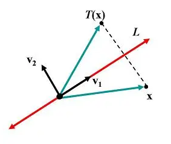
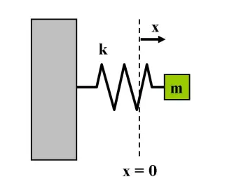
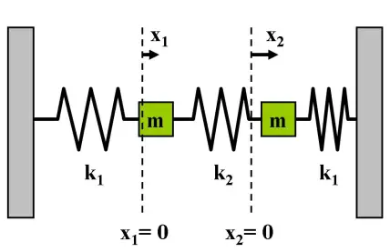

# 理解特征值和特征向量

*打开本页，如果不能显示公式，请刷新浏览器。*

## 以反射变换为例$$^{[1]}$$

$$\mathbb{V}$$ 和 $$\mathbb{W}$$ 是两个向量空间，有线性变换 $$\pmb{T}:\mathbb{V}\to\mathbb{W}$$ ，将输入向量 $$\pmb{x}\in\mathbb{V}$$ 映射到输出向量 $$\pmb{T}(\pmb{x})\in\mathbb{W}$$ 。

对于任意 $$\pmb{x,y}\in\mathbb{V}$$ 和标量 $$c$$ ，线性变换 $$\pmb{T}$$ 满足下列性质：

$$\begin{split}\pmb{T}(\pmb{x}+\pmb{y})&=\pmb{T}(\pmb{x})+\pmb{T}(\pmb{y})\\\pmb{T}(c\pmb{x})&=c\pmb{T}(\pmb{x})\end{split} \tag{1}$$

若 $$\mathbb{V}=\mathbb{W}$$ 也称 $$\pmb{T}$$ 为线性算子（算符）。

假设几何向量空间 $$\mathbb{R}^2$$ ，任一线性算子 $$\pmb{T}:\mathbb{R}^2\to\mathbb{R}^2$$ 都可以用 $$2\times 2$$ 实数矩阵 $$\pmb{A}$$ 表示：

$$\pmb{T}(\pmb{x})=\pmb{Ax}\tag{2}$$

其中 $$\pmb{x}\in\mathbb{R}^2$$ 。称 $$\pmb{A}$$ 是线性算子 $$\pmb{T}$$ 的变换矩阵或表示矩阵。

下面研究在二维几何空间的镜像反射变换（reflection）。对于向量 $$\pmb{x}=\begin{bmatrix}x_1\\x_2\end{bmatrix}$$ ，以x轴为镜面的反射变换：

$$\pmb{T}\left(\begin{bmatrix}x_1\\x_2\end{bmatrix}\right)=\begin{bmatrix}x_1\\-x_2\end{bmatrix}=x_1\begin{bmatrix}1\\0\end{bmatrix}+x_2\begin{bmatrix}0\\-1\end{bmatrix}=\begin{bmatrix}1&0\\0&-1\end{bmatrix}\begin{bmatrix}x_1\\x_2\end{bmatrix}$$

令 $$\pmb{D}=\begin{bmatrix}1&0\\0&-1\end{bmatrix}$$

称 $$\pmb{D}$$ 为标准反射矩阵。

更一般情况，求过原点的直线 $$L=\{t\pmb{v}_1|t\in\mathbb{R}\}$$ 的反射矩阵，即以此直线为镜面。

令 $$\pmb{v}_2$$ 表示直线 $$L$$ 的法向量，即 $$\pmb{v}_2\bot\pmb{v}_1$$ ，如下图所示：

则：

$$\begin{split}\pmb{T}(\pmb{v}_1)&=\pmb{v}_1=1\cdot\pmb{v}_1\\\pmb{T}(\pmb{v}_2)&=-\pmb{v}_2=（-1)\cdot\pmb{v}_2\end{split}\tag{3}$$

上面两个式子的形式相同，都是：

$$\pmb{T}(\pmb{v})=\lambda\pmb{v}\tag{4}$$

则称 $$\lambda$$ 为线性算子 $$\pmb{T}$$ 的特征值（eigenvalue），对应的非零向量 $$\pmb{v}$$ 为特征向量（eigenvector）。这两个量完全代表了线性算子 $$\pmb{T}$$ 的固有特征。

以（3）式为例，①特征向量 $$\pmb{v}_1,\pmb{v}_2$$ 经反射算子 $$\pmb{T}$$ 得到的像 $$\pmb{T}(\pmb{v}_i)$$ 属于子空间 $$span\{\pmb{v}_1,\pmb{v}_2\}$$ ，特征向量 $$\lambda_1,\lambda_2$$ 决定了 $$\pmb{T}(\pmb{v}_i)$$ 的伸缩倍数，正负号决定指向是否与原来相同；②除了特征空间 $$span\{\pmb{v}_1,\pmb{v}_2\}$$ ，其他不属于此子空间的非零向量皆不满足（4）式。

以上是以镜像发射变换为例。此外，线性算子 $$\pmb{T}$$ 还可以有其他意义。所以，没有一个确定的答案。

在（2）式中，表示矩阵 $$\pmb{A}$$ 用后面的方法得到，但是，（3）式中的镜像直线是一般的直线，不是x轴，无法用求表示矩阵 $$\pmb{D}$$ 方式计算出相应的表示矩阵。

下面探讨构建变换矩阵的方法。

将线性无关的特征向量组成 $$\mathbb{R}^2$$ 的一个基底 $$\pmb{\beta}=\{\pmb{v}_1,\pmb{v}_2\}$$ ，任一向量 $$\pmb{x}\in\mathbb{R}^2$$ 可唯一表示成：

$$\pmb{x}=c_1\pmb{v}_1+c_2\pmb{v}_2$$

其中 $$c_1,c_2$$ 可以合并写成向量 $$\pmb{x}$$ 参考基底 $$\pmb{\beta}$$ 的向量，记作：$$[\pmb{x}]_{\pmb{\beta}}=\begin{bmatrix}c_1\\c_2\end{bmatrix}$$

根据（3）式，可得：

$$\pmb{T}(\pmb{x})=\pmb{T}(c_1\pmb{v}_1+c_2\pmb{v}_2)=c_1\pmb{T}(\pmb{v}_1)+c_2\pmb{T}(\pmb{v}_2)=c_1\pmb{v}_1-c_2\pmb{v}_2\tag{5}$$

根据（5）式，可以写出 $$\pmb{T}(\pmb{x})$$ 参考基底 $$\pmb{\beta}$$ 的坐标向量：

$$[\pmb{T}(\pmb{x})]_{\pmb{\beta}}=\begin{bmatrix}c_1\\-c_2\end{bmatrix}=\begin{bmatrix}1&0\\0&-1\end{bmatrix}\begin{bmatrix}c_1\\c_2\end{bmatrix}=\pmb{D}[\pmb{x}]_{\pmb{\beta}}\tag{6}$$

由此可知：若参考特征向量构成的基底，所有镜像反射矩阵必可转换成标准反射矩阵 $$\pmb{D}$$ 。

又因为：

$$\pmb{x}=c_1\pmb{v}_1+c_2\pmb{v}_2=\begin{bmatrix}\pmb{v}_1&\pmb{v}_2\end{bmatrix}\begin{bmatrix}c_1\\c_2\end{bmatrix}=\pmb{S}[\pmb{x}]_{\pmb{\beta}}\tag{7}$$

若假设 $$\pmb{v}_1=\begin{bmatrix}2\\1\end{bmatrix}\pmb{v}_2=\begin{bmatrix}-1\\2\end{bmatrix}$$ ，则 $$\pmb{S}=\begin{bmatrix}\pmb{v}_1&\pmb{v}_2\end{bmatrix}=\begin{bmatrix}2&-1\\1&2\end{bmatrix}$$ 称为坐标变换矩阵。

因为 $$[\pmb{x}]_{\pmb{\beta}}=\pmb{S}^{-1}\pmb{x}$$ （由（7）式得），且 $$[\pmb{T}(\pmb{x})]_{\pmb{\beta}}=\pmb{S}^{-1}\pmb{T}(\pmb{x})$$ ，代入（6）式：

$$\pmb{S}^{-1}\pmb{T}(\pmb{x})=\pmb{D}\pmb{S}^{-1}\pmb{x}$$

两边同时左乘 $$\pmb{S}$$ ，得：

$$\pmb{T}(\pmb{x})=\pmb{SD}\pmb{S}^{-1}\pmb{x}=\pmb{Ax}\tag{8}$$

将上述过程，可以用如下示意图表示：

所以，$$\pmb{T}$$ 的变换矩阵为：

$$\pmb{A}=\pmb{SD}\pmb{S}^{-1}=\begin{bmatrix}2&-1\\1&2\end{bmatrix}\begin{bmatrix}1&0\\0&-1\end{bmatrix}\frac{1}{5}\begin{bmatrix}2&1\\-1&2\end{bmatrix}=\frac{1}{5}\begin{bmatrix}3&4\\4&-3\end{bmatrix}$$

## 自由振动系统$$^{[2]}$$

2021年5月20日深圳赛格大厦发生晃动，其元凶就是**卡门涡流** $$^{[3]}$$​​ 引起的共振，这与1940年坍塌的美国华盛顿州的塔科马海峡吊桥 $$^{[4]}$$​ 的原因相同。

下面就从特征值和特征向量的角度，理解自由振动系统的共振。

### 一个振子的简谐振动

如图所示，物体质量 m ，令 $$x(t)$$ 表示弹簧于 $$t$$ 时刻的长度，根据胡克定律，弹簧的弹力为：

$$f(x)=-kx$$

由牛顿第二定律可得：

$$m\ddot{x}=-kx$$

因为指数函数具有微分不变性，所以，上述微分方程的解为：

$$x(t)=ue^{at}$$

由此可得：$$\ddot{x}=a^2ue^{at}=a^2x$$ ，所以：$$ma^2x=-kx$$ ，$$a^2=-\frac{k}{m}$$ ，故：

$$a=\pm i\sqrt{\frac{k}{m}}$$

令 $$\omega=\frac{k}{m}$$ ，$$x(t)$$ 可表示为特解 $$e^{i\omega t}$$ 和 $$e^{-i\omega t}$$ 的线性组合：

$$x(t)=\alpha_1e^{i\omega t}+\alpha_2e^{-i\omega t}$$​

因为 $$x(t)$$ 是实函数，所以 $$\overline{x(t)}=x(t)$$ ，那么 $$\alpha_1$$ 和 $$\alpha_2$$ 是共轭复数，即 $$\alpha_2=\overline{\alpha_1}$$ 。

令 $$\alpha_1=\frac{1}{2}(c_1-ic_2)$$ ，$$c_1, c_2$$ 是实数，利用欧拉公式 $$e^{\pm i\theta}=\cos\theta\pm i\sin\theta$$ 可得：

$$\begin{split}x(t)&=\frac{1}{2}(c_1-ic_2)e^{i\omega t}+\frac{1}{2}(c_1+ic_2)e^{-i\omega t}\\&=\frac{1}{2}(c_1-ic_2)(\cos(\omega t)+i\sin(\omega t))+\frac{1}{2}(c_1+ic_2)(\cos(\omega t)-i\sin(\omega t))\\&=c_1\cos(\omega t)+c_2\sin(\omega t)\\&=\hat{c}\cos(\omega t-\phi)\end{split}$$

其中 $$\hat{c} = \sqrt{c_1^2+c_2^2}$$​ 表示振幅，$$\phi=\tan^{-1}(\frac{c_2}{c_1})$$ 是相位差，系数 $$c_1$$ 和 $$c_2$$ 由初始位置 $$x(0)$$ 和速度 $$\dot{x}(0)$$ 决定：

$$c_1 = x(0),\quad c_2=\frac{\dot{x}(0)}{\omega}$$​

简谐振子以物体的平衡位置为中心，在 $$x=a$$ 和 $$x=-a$$ 之间以 $$T=\frac{2\pi}{\omega}$$ 为周期振动。

$$\omega = \frac{2\pi}{T}=\sqrt{\frac{k}{m}}$$

当物体质量越小，或劲度系数 k 越大，则振动频率越高。

### 两个振子的振动系统

如图所示，令 $$x_1=0$$ 和 $$x_2=0$$​ 表示两个物体的平衡位置。

设从左向右，三个瘫痪的伸长量分别为 $$x_1, x_2-x_1, -x_2$$​ ，有方程：

$$\begin{split}m\ddot{x}_1&=-k_1x_1+k_2(x_2-x_1)=-(k_1+k_2)x_1+k_2x_2\\m\ddot{x}_2&=-k_2(x_2-x_1)+k_1(-x_2)=k_2x_1-(k_1+k_2)x_2\end{split}$$​

写成矩阵形式：

$$\begin{bmatrix}\ddot{x}_1\\\ddot{x}_2\end{bmatrix}+\begin{bmatrix}\frac{k_1+k_2}{m}&-\frac{k_2}{m}\\-\frac{k_2}{m}&\frac{k_1+k_2}{m}\end{bmatrix}\begin{bmatrix}x_1\\x_2\end{bmatrix}=\begin{bmatrix}0\\0\end{bmatrix}$$​

$$\ddot{\pmb{x}}+\pmb{Ax}=\pmb{0}$$​​​​​

其中，$$\pmb{x}=\begin{bmatrix}x_1\\x_2\end{bmatrix}$$ ，$$\pmb{A}=\begin{bmatrix}a&-b\\-b&a\end{bmatrix}$$ 是实对称矩阵，$$a=\frac{k_1+k_2}{m}, b=\frac{k_2}{m}$$ 。

上述方程的解为：$$\pmb{x}(t)=\pmb{u}e^{i\omega t}$$ 。又：

$$\ddot{\pmb{x}}=-\pmb{u}\omega^2e^{i\omega t}=-\omega^2\pmb{x}$$

所以：

$$\pmb{Ax}=\omega^2\pmb{x}$$

$$\omega^2$$ 是 $$\pmb{A}$$ 的特征值，$$\omega$$ 又称为固有频率（特征值也称为固有值）。特征多项式：

$$\det(\pmb{A}-\lambda\pmb{I})=\begin{vmatrix}a-\lambda&-b\\-b&a-\lambda\end{vmatrix}=(a-\lambda)^2-b^2$$

令上式为零，则得特征值：

$$\lambda_1=a+b=\frac{k_1+2k_2}{m}, \quad \lambda_2=a-b=\frac{k_1}{m}$$

其固有频率为 $$\omega_1=\sqrt{\lambda_1}=\sqrt{\frac{k_1+2k_2}{m}}$$ 和 $$\omega_2=\sqrt{\lambda_2}=\sqrt{\frac{k_1}{m}}$$ ，对应的特征向量：

$$\pmb{u}_1=\begin{bmatrix}1\\-1\end{bmatrix}, \quad \pmb{u}_2=\begin{bmatrix}1\\1\end{bmatrix}$$

则运动的位置 $$\pmb{x}(t)$$ 为：

$$\pmb{x}(t)=\alpha_1\pmb{u}_1e^{i\omega_1 t}+\alpha_2\pmb{u}_1e^{-i\omega_1 t}+\beta_1\pmb{u}_2e^{i\omega_2 t}+\beta_2\pmb{u}_2e^{-i\omega_2 t}$$

又因为 $$\pmb{x}(t)$$​ 是实向量函数，$$\alpha_2=\overline{\alpha_1},\beta_2=\overline{\beta_1}$$ ，可得：

$$\pmb{x}(t)=c_{11}\pmb{u}_1\cos(\omega_1 t)+c_{12}\pmb{u}_1\sin(\omega_1 t)+c_{21}\pmb{u}_2\cos(\omega_2 t)+c_{22}\pmb{u}_2\sin(\omega_2 t)$$

其中，$$c_{11},c_{12},c_{21},c_{22}$$ 都是实数。当 $$t=0$$ 时，

$$\begin{split}\pmb{x}(0)&=c_{11}\pmb{u}_1+c_{21}\pmb{u}_2\\\dot{x}(0)&=\omega_1c_{12}\pmb{u}_1+\omega_2c_{22}\pmb{u}_2\end{split}$$​

所以得到：

$$\begin{split}c_{11}&=\frac{1}{2}(x_1(0)-x_2(0))\\c_{21}&=\frac{1}{2}(x_1(0)+x_2(0))\\c_{12}&=\frac{1}{2\omega_1}(\dot{x}_1(0)-\dot{x}_2(0))\\c_{22}&=\frac{1}{2\omega_2}(\dot{x}_1(0)+\dot{x}_2(0))\end{split}$$​​

若两个物体在 $$t=0$$ 时静止，$$\dot{\pmb{x}}(0)=\pmb{0}$$ ，则 $$c_{12}=c_{22}=0$$ ，即得：

$$\pmb{x}(t)=c_{11}\pmb{u}_1\cos(\omega_1 t)+c_{21}\pmb{u}_2\cos(\omega_2 t)$$

两个物体的实际振动行为由初始位置决定，特征向量 $$\pmb{u}_1=\begin{bmatrix}1\\-1\end{bmatrix}, \quad \pmb{u}_2=\begin{bmatrix}1\\1\end{bmatrix}$$ 代表两种振型：

- 若 $$\pmb{x}(0)=r\pmb{u}_1$$ ，则 $$c_{11}=r$$ 且 $$c_{21}=0$$ ，故 $$\pmb{x}(t)=r\begin{bmatrix}1\\-1\end{bmatrix}\cos(\omega_1 t)$$​ ，这时两物体的振动频率为 $$\omega_1$$ ，相位差为 $$\pi$$ 。
- 若 $$\pmb{x}(0)=r\pmb{u}_2$$​​​​​ ，则 $$c_{11}=0$$​​​​​ 且 $$c_{21}=r$$​​​​​ ，故 $$\pmb{x}(t)=r\begin{bmatrix}1\\1\end{bmatrix}\cos(\omega_2 t)$$​​​​​ ，这时两物体的振动频率为 $$\omega_2$$​​​​​ ，相位差为 $$0$$​​​​​ 。

## 参考文献

[1]. [线代启示录：答Rich——关于特征值与特征向量的物理意义](https://ccjou.wordpress.com/2012/04/23/%e7%ad%94rich%e2%94%80%e2%94%80%e9%97%9c%e6%96%bc%e7%89%b9%e5%be%b5%e5%80%bc%e8%88%87%e7%89%b9%e5%be%b5%e5%90%91%e9%87%8f%e7%9a%84%e7%89%a9%e7%90%86%e6%84%8f%e7%be%a9/)

[2]. [线代启示录：自由振动系统的特征值与特征向量](https://ccjou.wordpress.com/2012/04/28/%E8%87%AA%E7%94%B1%E6%8C%AF%E5%8B%95%E7%9A%84%E7%89%B9%E5%BE%B5%E5%80%BC%E8%88%87%E7%89%B9%E5%BE%B5%E5%90%91%E9%87%8F/)

[3]. [维基百科：卡门涡流](https://zh.wikipedia.org/wiki/%E5%8D%A1%E9%97%A8%E6%B6%A1%E8%A1%97)

[4]. [维基百科：塔科马海峡吊桥](https://zh.wikipedia.org/wiki/%E5%A1%94%E7%A7%91%E9%A6%AC%E6%B5%B7%E5%B3%BD%E5%90%8A%E6%A9%8B)