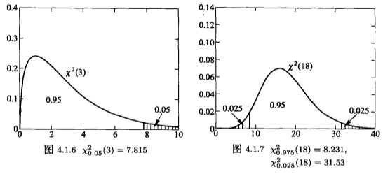

# 参数估计

*打开本页，如果没有显示公式，请刷新页面。*

## 1. 统计量

以下为《机器学习数学基础》第6章6.1节的补充资料。

在《机器学习数学基础》第6章6.1.2节，分别演示了**样本平均值**和**样本方差**的表达式，并对这两个统计量的结果进行了推导。特别是样本方差的计算方法。

下面摘录参考文献[1]对样本方差的另外一种证明方法。

设总体 $$X$$ 的样本 $$X_1,\cdots,X_n$$ ，其样本平均值为：

$$\hat{\mu} = \overline{X}$$

总体方差 $$Var(X)=\sigma^2$$ 的估计，即样本方差：

$$s^2=\frac{1}{n-1}\sum_{j=1}^n(X_j-\hat\mu)^2$$

对于确定的 $$j$$ ，因为 $$E(X_j-\hat\mu)=\mu-\mu=0$$ ，所以从 $$X_1,\cdots,X_n$$ 的独立性得到：

$$\begin{split}E(X_j-\hat\mu)^2 &= Var\left[X_j-\frac{1}{n}\sum_{i=1}^nX_i\right]\\&=Var\left[\left(1-\frac{1}{n}\right)X_j-\frac{1}{n}\sum_{i\ne j}X_i\right]\\&=\left(\frac{n-1}{n}\right)^2\sigma^2+\frac{1}{n^2}\sum_{i\ne j}\sigma^2\\&=\left[\left(\frac{n-1}{n}\right)^2+\frac{n-1}{n^2}\right]\sigma^2\\&=\frac{n-1}{n}\sigma^2\end{split}$$

于是得到：

$$E(s^2)=\frac{1}{n-1}\sum_{j=1}^nE(X_j-\hat\mu)^2=\frac{n}{n-1}\cdot\frac{n-1}{n}\sigma^2=\sigma^2$$

即样本方差 $$s^2$$ 是总体方差的无偏估计（*参阅《机器学习数学基础》第6章6.2.3节*）。

> **定义**    设 $$\hat\theta$$ 是 $$\theta$$ 的估计：
>
> 1. 如果 $$E(\hat\theta)=\theta$$ ，则称 $$\hat\theta$$ 是 $$\theta$$ 的无偏估计
> 2. 如果当样本量 $$n\to\infty$$ ，$$\hat\theta$$ 依概率收敛到 $$\theta$$ ，称 $$\hat\theta$$ 是 $$\theta$$ 的相合估计
> 3. 如果当样本量 $$n\to\infty$$ ，$$\hat\theta$$ 以概率 $$1$$ 收敛到 $$\theta$$ ，称 $$\hat\theta$$ 是 $$\theta$$ 的强相合估计

且：

- 样本均值是总体均值的强相合无偏估计
- 样本方差是总体方差的强相合无偏估计
- 样本标准差是总体标准差的强相合无偏估计

相关证明请参阅*《机器学习数学基础》第6章6.2.3节*。

## 2. 矩估计

设 $$x_1,\cdots,x_n$$ 是总体 $$X$$ 的样本，对于 $$k\ge1$$ ，称 

$$\hat\mu_k=\frac{1}{n}\sum_{i=1}^nx_i^k \tag{2.1}$$

为 $$\mu_k=E(X^k)$$ 的矩估计（moment estimator）。

> **定义**    设 $$X$$ 的分布函数含有参数 $$\pmb\theta=(\theta_1,\cdots,\theta_m)$$ ，$$X_1,\cdots,X_n$$ 是总体 $$X$$ 的样本，如果能得到：
>
> $$\begin{cases}\theta_1=g_1(\mu_1,\cdots,\mu_m)\\\vdots\\\theta_m=g_m(\mu_1,\cdots,\mu_m)\end{cases}\tag{2.2}$$
>
> 其中 $$\mu_k=E(X^k),k=1,2,\cdots,m$$ ，则称由
>
> $$\begin{cases}\hat\theta_1=g_1(\hat\mu_1,\cdots,\hat\mu_m)\\\vdots\\\hat\theta_m=g_m(\hat\mu_1,\cdots,\hat\mu_m)\end{cases}\tag{2.3}$$
>
> 定义的 $$\hat{\pmb\theta}=(\hat\theta_1,\cdots,\hat\theta_m)$$ 为 $$\pmb\theta$$ 的矩估计，称 $$\hat\theta_k$$ 为 $$\theta_k$$ 的矩估计，其中 $$\hat\mu_k$$ 是 $$\mu_k$$ 的矩估计。

矩估计没有充分利用总体分布的信息，故一般不如最大似然估计好。在机器学习中，也不使用这种估计方法。

## 3. 点估计

### 点估计的渐进性质

> **定理**    设 $$\theta\in\mathbb{R}$$ ，$$\hat\theta$$ 是 $$\theta$$ 的估计，实值函数 $$g(u)$$ 在点 $$\theta$$ 连续，则：
>
> 1. 如果 $$\hat\theta$$ 是 $$\theta$$ 的相合估计，则 $$g(\hat\theta)$$ 是 $$g(\theta)$$ 的相合估计；
> 2. 如果 $$\hat\theta$$ 是 $$\theta$$ 的强相合估计，则 $$g(\hat\theta)$$ 是 $$g(\theta)$$ 的强相合估计；
> 3. 如果 $$\hat\theta\sim AN(\theta, \frac{\sigma^2}{n})$$ ，则 $$\hat\theta$$ 依概率趋近 $$\theta$$ 。设 $$g'(\theta)\ne0$$ ，则：$$g(\hat\theta)\sim AN(g(\theta), \frac{[g'(\theta)\sigma]^2}{n})$$

定理证明，见参考文献[1]的56页，此处从略。

## 4. 区间估计

以下是《机器学习数学基础》第6章6.4节的相关补充资料。

### 单个正态总体的区间估计

**(1)  已知 $$\sigma$$ 时，$$\mu$$ 的置信区间**

设 $$Z\sim N(0,1)$$ ，对正数 $$\alpha\in(0,1)$$ ，有唯一的 $$z_{\alpha}$$ 使得

$$P(Z\ge z_{\alpha}) = \alpha$$

称 $$z_{\alpha}$$ 为标准正态分布 $$N(0,1)$$ 的**上 $$\alpha$$ 分位数**。

定义 $$Z=\frac{\overline{X}_n-\mu}{\sigma/\sqrt{n}}\sim N(0,1)$$ 为**枢轴量**。

> **定理**    如果 $$X_1,\cdots,X_n$$ 是总体 $$N(\mu,\sigma^2)$$ 的样本，$$\sigma$$ 已知，则 $$\mu$$ 的置信水平为 $$1-\alpha$$ 的（双侧）置信区间是：
>
> $$\left[\overline{X}-\frac{\sigma}{\sqrt{n}}z_{\alpha/2},\overline{X}+\frac{\sigma}{\sqrt{n}}z_{\alpha/2}\right]$$
>
> 置信区间的长度是：
>
> $$2\times\frac{\sigma}{\sqrt{n}}z_{\alpha/2}$$

**(2) 未知 $$\sigma$$ 时，$$\mu$$ 的置信区间**

用样本标准差 $$S=\sqrt{\frac{1}{n-1}\sum_{j=1}^n(X_j-\mu)^2}$$ 替代 $$\sigma$$ ，则枢轴量：

$$t=\frac{\overline{X}-\mu}{S/\sqrt{n}}\tag{4.1}$$

$$t$$ 是服从 $$n-1$$ 个自由度的 **t分布**，记作：$$t=\frac{\overline{X}-\mu}{S/\sqrt{n}}\sim t(n-1)$$

概率密度函数：

$$p(t)=\alpha_{n-1}\left(1+\frac{t^2}{n-1}\right)^{-n/2},\quad t\in(-\infty,\infty)$$

t分布的概率函数是偶函数

对于 $$t_m\sim t(m)$$ ，$$\alpha\in(0,1)$$ ，有唯一的 $$t_{\alpha}(m)$$ 使得

$$P(t_m\ge t_{\alpha}(m))=\alpha$$

称 $$t_{\alpha}(m)$$ 为 $$t(m)$$ 分布的上 $$\alpha$$ 分位数。

根据t分布的对称性（偶函数）：

$$P(t_m\ge t)=P(t_m\le -t)$$

所以：

$$P(|t_m|\ge t_{\alpha/2}(m))=P(t_m\ge t_{\alpha/2}(m))+P(t_m\le -t_{\alpha/2}(m))=\alpha/2+\alpha/2=\alpha$$

$$P(|t_m|\ge t_{\alpha/2}(m))=\alpha$$

得：

$$P(|t_m|\le t_{\alpha/2}(m))=1-\alpha \tag{4.2}$$

> **定理**    如果 $$X_1,\cdots,X_n$$ 是总体 $$N(\mu,\sigma^2)$$ 的样本，$$\sigma、\mu$$ 未知，则 $$\mu$$ 的置信水平为 $$1-\alpha$$ 的（双侧）置信区间是：
>
> $$\left[\overline{X}-\frac{S}{\sqrt{n}}t_{\alpha/2}(n-1),\overline{X}+\frac{S}{\sqrt{n}}z_{\alpha/2}(n-1)\right]\tag{4.3}$$

**证明**

对（4.1）式的枢轴量，对于置信水平 $$1-\alpha$$ ，由 $$t\sim t(n-1)$$ 和（4.2）式得：

$$P\left(\frac{|\overline{X}-\mu|}{S/\sqrt{n}}\le t_{\alpha/2}(n-1)\right)=P(|t_{n-1}|\le  t_{\alpha/2}(n-1))=1-\alpha$$

由于：

$$\{\frac{|\overline{X}-\mu|}{S/\sqrt{n}}\le t_{\alpha/2}(n-1)\}=\{\overline{X}-\frac{S}{\sqrt{n}}t_{\alpha/2}(n-1)\le\mu\le\overline{X}+\frac{S}{\sqrt{n}}t_{\alpha/2}(n-1)\}$$

故得到（4.3）结论。

证毕。

**(3) 方差 $$\sigma^2$$ 的置信区间**

定义数轴变量 

$$\chi^2=\frac{(n-1)S^2}{\sigma^2}=\frac{1}{\sigma^2}\sum_{j=1}^n(X_j-\overline{X})^2 \tag{4.4}$$

概率密度是：

$$p(u)=b_{n-1}u^{(n-3)/2}e^{-u/2}, u\ge0$$

其中 $$b_{n-1}$$ 是使得 $$p(u)$$ 的积分等于 $$1$$ 的常数。称 $$\chi^2$$ 服从 $$n-1$$ 个自由度的 $$\chi^2$$ 分布，记作：$$\chi^2\sim\chi^2(n-1)$$ 。

设 $$\chi^2_m\sim\chi^2(m)$$ ，对于 $$\alpha\in(0,1)$$ ，有唯一的 $$\chi^2_{\alpha}(m)$$ 使得：

$$P(\chi^2_m\ge \chi^2_{\alpha}(m))=\alpha$$

称 $$\chi^2_{\alpha}(m)$$ 为 $$\chi^2_m$$ 分布的上 $$\alpha$$ 分位数。于是有 $$P(\chi^2_m\le \chi^2_{\alpha}(m))=1-\alpha$$ （如下图）。

$$P(\chi^2_m\ge \chi^2_{\alpha/2}(m))=\alpha/2,\quad P(\chi^2_m\le \chi^2_{\alpha/2}(m))=1-\alpha/2 \tag{4.5}$$

由（4.4）式，可以直接计算：

$$\begin{split}&P\left(\frac{(n-1)S^2}{\chi^2_{\alpha/2}(n-1)}\right)\le\sigma^2\le\frac{(n-1)S^2}{\chi^2_{1-\alpha/2}(n-1)}\\=&P\left(\chi^2_{1-\alpha/2}(n-1)\le\frac{(n-1)S^2}{\sigma^2}\le\chi^2_{\alpha/2}(n-1)\right)\\=&P\left(\chi^2_{1-\alpha/2}(n-1)\le\chi^2_{n-1}\le\chi^2_{\alpha/2}(n-1)\right)\\=&P\left(\chi^2_{n-1}\ge\chi^2_{1-\alpha/2}(n-1)\right)-P\left(\chi^2_{n-1}\gt\chi^2_{\alpha/2}(n-1)\right)\\=&1-\frac{\alpha}{2}-\frac{\alpha}{2}\\=&1-\alpha\end{split}$$

于是得到如下定理

> **定理 **    设 $$X_1,\cdots,X_n$$ 是正态总体 $$N(\mu,\sigma^2)$$ 的样本，$$\mu$$ 和 $$\sigma^2$$ 未知，则 $$\sigma^2$$ 的置信水平为 $$1-\alpha$$ 的置信区间为：
>
> $$\left[\frac{(n-1)S^2}{\chi^2_{\alpha/2}(n-1)},\frac{(n-1)S^2}{\chi^2_{1-\alpha/2}(n-1)}\right]$$

### 两个正态总体的区间估计

**(1) 均值差 $$\mu_1-\mu_2$$ 的置信区间**

设总体 $$X\sim N(\mu_1,\sigma_1^2)$$ 和总体 $$Y\sim N(\mu_2,\sigma_2^2)$$ 独立，$$X_1,\cdots,X_n$$ 是 $$X$$ 的样本，$$Y_1,\cdots,Y_m$$ 是 $$Y$$ 的样本，它们相互独立。

则：

$$\overline{X}\sim N(\mu_1,\sigma_1^2/n), \quad \overline{Y}\sim N(\mu_2,\sigma^2_2/m)$$

从而：

$$\overline{X}-\overline{Y}\sim N(\mu_1-\mu_2,\sigma^2_1/n+\sigma^2_2/m)$$

于是得到：

$$Z=\frac{(\overline{X}-\overline{Y})-(\mu_1-\mu_2)}{\sqrt{\sigma^2_1/n+\sigma^2_2/m}}\sim N(0,1) \tag{4.6}$$

（1.1）已知 $$\sigma^2_1,\sigma^2_2$$ 时，对置信水平 $$1-\alpha$$ ，利用（4.6）式构造出 $$\mu_1-\mu_2$$ 的置信区间是：

$$\left[(\overline{X}-\overline{Y})-z_{\alpha/2}\sqrt{\frac{\sigma^2_1}{n}+\frac{\sigma^2_2}{m}},(\overline{X}-\overline{Y})+z_{\alpha/2}\sqrt{\frac{\sigma^2_1}{n}+\frac{\sigma^2_2}{m}}\right]$$

（1.2）已知 $$\sigma^2_1=\sigma^2_2$$ ，但不知道 $$\sigma^2_1,\sigma^2_2$$ 的具体值时，利用 $$E(S_1^2)=E(S^2_2)=\sigma^2_2$$ ，可以验证：

$$S_w^2=\frac{(n-1)S_1^2+(m-1)S_2^2}{n+m-2}$$

是 $$\sigma^2_1$$ 和 $$\sigma^2_2$$ 的无偏估计：$$E(S_w^2)=\sigma^2_1=\sigma^2_1$$ ，用 $$S_w^2$$ 代替（4.6）式中的 $$\sigma^2_1,\sigma^2_2$$ ，得到新的枢轴量及其分布：

$$T=\frac{(\overline{X}-\overline{Y})-(\mu_1-\mu_2)}{S_w\sqrt{1/n+1/m}}\sim t(n+m-2) \tag{4.7}$$

利用（4.7）式可以构造 $$\mu_1-\mu_2$$ 的置信水平为 $$1-\alpha$$ 的置信区间：

$$\left[(\overline{X}-\overline{Y})-t_{\alpha/2}S_w\sqrt{\frac{1}{n}+\frac{1}{m}},(\overline{X}-\overline{Y})+t_{\alpha/2}S_w\sqrt{\frac{1}{n}+\frac{1}{m}}\right]$$

其中 $$t_{\alpha/2}=t_{\alpha/2}(n+m-2)$$ 。

**(2) 方差比 $$\sigma^2_1/\sigma^2_2$$ 的置信区间**

设总体 $$X\sim N(\mu_1,\sigma^2_1)$$ 和总体 $$Y\sim N(\mu_2,\sigma_2^2)$$ 独立，$$X_1,\cdots,X_n$$ 是 $$X$$ 的样本，$$Y_1,\cdots,Y_m$$ 是 $$Y$$ 的样本，它们相互独立。可得枢轴量：

$$F=\frac{S_1^2/S_2^2}{\sigma^2_1/\sigma^2_2} \tag{4.8}$$ 

的概率密度是：

$$p(u)=c\left(1+\frac{n-1}{m-1}u\right)^{-(n+m-2)/2}u^{(n-3)/2},\quad u\ge 0$$

其中 $$c$$ 是使 $$p(u)$$ 的积分等于 $$1$$ 的常数。$$F$$ 服从自由度为 $$n-1$$ 和 $$m-1$$ 的 $$F$$ 分布，记作：$$F\sim F(n-1, m-1)$$ 。对正数 $$\alpha\in(0,1)$$ ，有唯一的 $$F_{\alpha}(n-1,m-1)$$ 使得：

$$P(F\gt F_{\alpha}(n-1, m-1))=\alpha$$

这是称 $$F_{\alpha}(n-1, m-1)$$ 为 $$F(n-1, m-1)$$ 分布的上 $$\alpha$$ 分位数。

利用枢轴量（4.8）式可得 $$\sigma^2_1/\sigma^2_2$$ 的置信水平为 $$1-\alpha$$ 的置信区间是：

$$\left[\frac{S_1^2/S_2^2}{F_{\alpha/2}}, \frac{S_1^2/S_2^2}{F_{1-\alpha/2}}\right]$$

**证明**

$$\begin{split}&P\left(\frac{S_1^2/S_2^2}{F_{\alpha/2}}\le\frac{\sigma_1^2}{\sigma_2^2}\le\frac{S_1^2/S_2^2}{F_{1-\alpha/2}}\right)\\=&P\left(F_{1-\alpha/2}\le\frac{S_1^2/S_2^2}{\sigma^2_1/\sigma^2_2}\le F_{\alpha/2}\right)\\=&P(F\ge F_{1-\alpha/2}-P(F\gt F_{\alpha/2}\\=&1-\alpha/2-\alpha/2=1-\alpha\end{split}$$

证毕。

### 非正态总体和比例 p 的置信区间

**(1) 正态逼近法**

若总体不是正态分布，但有较大的样本量，通常要求 $$n\ge 30$$ ，则 $$\frac{\overline{X}-\mu}{\sigma/\sqrt{n}}$$ 近似服从标准正态分布，即可得：

$$P\left(|\overline{X}-\mu|\le\frac{\sigma z_{\alpha/2}}{\sqrt{n}}\right)\approx 1-\alpha$$

于是：

- 已知标准差 $$\sigma$$ 时，在置信水平 $$1-\alpha$$ 下，总体均值 $$\mu$$ 的近似置信区间仍然是：$$\left[\overline{X}-\frac{\sigma}{\sqrt{n}}z_{\alpha/2},\overline{X}+\frac{\sigma}{\sqrt{n}}z_{\alpha/2}\right]$$
- 当 $$\sigma$$ 未知时，对较大的 $$n$$ ，$$S$$ 是 $$\sigma$$ 的强相合估计，所以 $$\frac{\overline{X}-\mu}{S/\sqrt{n}}$$ 近似服从 $$N(0,1)$$ 分布，此时均值 $$\mu$$ 的置信水平为 $$1-\alpha$$ 的近似置信区间是：$$\left[\overline{X}-\frac{S}{\sqrt{n}}z_{\alpha/2},\overline{X}+\frac{S}{\sqrt{n}}z_{\alpha/2}\right]$$

**(2) 比例 p 的置信区间**

设 $$X_1,\cdots,X_n$$ 是两点分布 $$\Beta(1,p)$$ 的样本，$$\hat{p}=\overline{X}$$ 是 $$p$$ 的最大似然估计。对置信水平 $$1-\alpha$$ ，当 $$n$$ 较大（至少：$$5\le n\hat{p}\le n-5$$ ），$$p$$ 的近似置信区间是：

$$\left[\frac{b-\sqrt{b^2-4ac}}{2a},\frac{b+\sqrt{b^2-4ac}}{2a}\right]$$

其中 $$a=1+\frac{z^2_{\alpha/2}}{n}, b=2\hat{p}+\frac{z^2_{\alpha/2}}{n},c=\hat{p}^2$$

**证明**

## 参考文献

[1]. 数理统计. 何书元. 北京：高等教育出版社. 2012.1，第1版