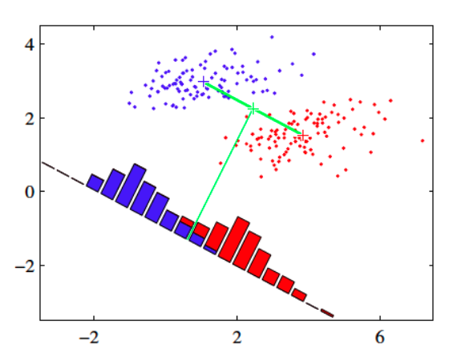

有朋友问：为什么感觉对机器学习和神经网络，似乎总是隔着一层纱那样，不清晰，虽然能跑代码，但总是不放心，不知道自己做的是否有根据。
这是因为：你和机器学习之间，缺少了一个数学。

# 费雪的线性判别分析

## 缘起

对于线性判别分析的介绍，在网上或者有关书籍中，均能找到不少资料。但是，诸多内容中，未能将线性判别分析完整地讲解，要么缺失较为严格的数学推理，要么对线性判别分析的理解偏颇。

本文作者根据个人所学，参考有关文献，将线性判别分析给予梳理，供大家参考。

## 费雪的线性判别分析

英国统计学家费雪（Ronald Fisher）提出的专门为含有两个类别样本的有监督的降维方法，称为“**费雪的线性判别分析**（Fisher Linear Discriminant Analysis）。

费雪的线性判别分析基本思想是（如图1所示）：

图 1

- 类内散度最小
- 类间散度最大

获得数据在某直线（超平面）上的投影。

多数资料中介绍的线性判别分析的时候，都是按照上述费雪所提出的线性判别分析思想讲解的。

本文也首先介绍上述基本思想，而后引申出相关思考。

**注意：以下内容是以数学推导为主，对此方面如读者有感不足，请参阅：《机器学习数学基础》的书籍或视频课程**

## 二分类的样本数据

设数据样本 $$\{\pmb{x}_1,\cdots,\pmb{x}_n\}\in\mathbb{R}^d$$ ，样本大小为 $$n$$ ，特征数（维数）是 $$d$$ 。

假设此样本分为两类，类别 $$C_1$$ ，样本数为 $$n_1$$ ；类别 $$C_2$$ ，样本数量为 $$n_2$$ 。$$n=n_1+n_2$$ 。

## 问题：投影可能重叠

有一条直线 L ，用单位向量 $$\pmb{w}$$ （$$\begin{Vmatrix}\pmb{w}\end{Vmatrix}^2=\pmb{w}^{\text{T}}\pmb{w}=1$$）表示此直线的方向。

若将样本中的任意一个向量 $$\pmb{x}$$ 向此直线投影，得到投影量 $$y\pmb{w}$$ ，其中 $$y$$ 表示投影量的大小。

由于 $$\pmb{x}-y\pmb{w}$$ 与 $$\pmb{w}$$ 正交，即：$$\pmb{w}^{\text{T}}(\pmb{x}-y\pmb{w})=0$$ ，所以：
$$
y=\frac{\pmb{w}^{\text{T}}\pmb{x}}{\pmb{w}^{\text{T}}\pmb{w}}=\pmb{w}^{\text{T}}\pmb{x}\tag{1}
$$
故样本中每个数据 $$\pmb{x}_1,\cdots,\pmb{x}_n$$ 在直线 L 上的投影大小 $$y_1,\cdots,y_n$$ 为：
$$
y_i=\pmb{w}^{\text{T}}\pmb{x}_i,\quad(1\le i\le n)\tag{2}
$$
$$\pmb{x}_1,\cdots,\pmb{x}_n$$ 所在的空间称为 $$x$$ 空间，投影 $$y_1,\cdots,y_n$$ 所在的空间称为 $$y$$ 空间。

根据（2）式结果，可以得到 $$y$$ 空间的每个类别样本的投影大小的平均数：
$$
\hat{m}_j=\frac{1}{n_j}\sum_{i\in C_j}y_i=\frac{1}{n_j}\sum_{i\in C_j}\pmb{w}^{\text{T}}\pmb{x}_i=\pmb{w}^{\text{T}}\left(\frac{1}{n_j}\sum_{i\in C_j}\pmb{x}_i\right),\quad(j=1,2)\tag{3}
$$
令 $$\pmb{m}_j=\frac{1}{n_j}\sum_{i\in C_j}\pmb{x}_i$$ （$$j=1,2$$），代表 $$x$$ 空间的某个类别的所有样本的平均数向量（样本平均），故（3）式可以继续表示为：
$$
\hat{m}_j = \pmb{w}^{\text{T}}\pmb{m}_j,\quad(j=1,2)\tag{4}
$$
（4）式即表示将 $$x$$ 空间的每个类别的样本平均（即向量 $$\pmb{m}_j$$ ，表示该类别的中心），投影到直线 L ，得到了 $$y$$  空间上每个类别样本投影的平均数（即 $$\hat{m}_j$$ ，表示该类别样本投影的中心）。

于是得到两个类别样本中心投影的距离：
$$
|\hat{m}_2-\hat{m}_1|=|\pmb{w}^{\text{T}}\pmb{m}_2-\pmb{w}^{\text{T}}\pmb{m}_1|=|\pmb{w}^{\text{T}}(\pmb{m}_2-\pmb{m}_1)|\tag{5}
$$
（5）式说明，每个类别样本投影的中心的距离（ $$|\hat{m}_2-\hat{m}_1|$$ ）等于样本中心的距离（即 $$|\pmb{m}_2-\pmb{m}_1|$$）的投影 $$|\pmb{w}^{\text{T}}(\pmb{m}_2-\pmb{m}_1)|$$ 。

数据点与数据点之间的距离，表征了数据的分散程度，统计学中使用方差衡量数据的分散程度 （样本方差： $$s^2=\frac{1}{n-1}\sum_{i=1}^n(x_i-\overline{x})^2$$ ）$$^{[2]}$$ 。因此，可以使用 $$(\hat{m}_2-\hat{m}_1)^2$$ 度量不同类别的样本投影的中心的分散程度，并将其命名为**类间散度**（Between-class scatter），即：
$$
(\hat{m}_2-\hat{m}_1)^2=\left(\pmb{w}^{\text{T}}(\pmb{m}_2-\pmb{m}_1)\right)^2\tag{6}
$$
散度与方差有相同的地方，都表示了数据相对平均值的分散程度。下图左边表示了散度较大，右边较小。

下面使用拉格朗日乘数法 $$^{[3]}$$，找到适合的 $$\pmb{w}$$ ，使得 $$\left(\pmb{w}^{\text{T}}(\pmb{m}_2-\pmb{m}_1)\right)^2$$ 最大化。
$$
\begin{split}
minimize\quad &-\left(\pmb{w}^{\text{T}}(\pmb{m}_2-\pmb{m}_1)\right)^2\\
subject\quad to\quad&\pmb{w}^{\text{T}}\pmb{w}=1
\end{split}\tag{7}
$$
定义拉格朗日函数：
$$
\begin{split}
L(\lambda,\pmb{w})&=-\left(\pmb{w}^{\text{T}}(\pmb{m}_2-\pmb{m}_1)\right)^2+\lambda(\pmb{w}^{\text{T}}\pmb{w}-1)
\\
&=-\pmb{w}^{\text{T}}(\pmb{m}_2-\pmb{m}_1)(\pmb{m}_2-\pmb{m}_1)^{\text{T}}\pmb{w}+\lambda(\pmb{w}^{\text{T}}\pmb{w}-1)
\end{split}\tag{8}
$$
其中 $$\lambda$$ 是拉格朗日乘数。计算 $$\frac{\partial L}{\partial\pmb{w}}$$ ：
$$
\frac{\partial L}{\partial\pmb{w}}=-2(\pmb{m}_2-\pmb{m}_1)(\pmb{m}_2-\pmb{m}_1)^{\text{T}}\pmb{w}+2\lambda\pmb{w}\tag{9}
$$
令 $$\frac{\partial L}{\partial\pmb{w}}=0$$ ，则：
$$
\pmb{w}=\frac{1}{\lambda}(\pmb{m}_2-\pmb{m}_1)(\pmb{m}_2-\pmb{m}_1)^{\text{T}}\pmb{w}\tag{10}
$$
因为 $$\frac{1}{\lambda}(\pmb{m}_2-\pmb{m}_1)^{\text{T}}\pmb{w}$$ 是数量，所以：
$$
\pmb{w}\propto(\pmb{m}_2-\pmb{m}_1)\tag{11}
$$
这说明直线 L 的方向与两个类别的样本中心的距离矢量方向平行。

但是，如果按照（11）式的方式确定直线 L 方向，样本的投影有可能出现图 1 所示的重叠现象。

从降维的角度看，假设是将高维数据降到一维，上图演示的降维效果并不会有利于后续分类过程。

对此，费雪提出，应该兼顾类别之间和同一类别之内的样本投影的方差：

- 不同类别之间的样本投影的方差越大越好
- 同一类之内的样本投影的方差越小越好

这样，在直线上的投影，不同类别之间的中心的投影的距离就尽可能大；同一类别之内的样本的投影间就尽可能聚集在一起。

## 费雪准则

两个类别的样本数据的平均数，表示每个类别的样本数据的中心：
$$
\pmb{m}_j=\frac{1}{n_j}\sum_{i\in C_j}\pmb{x}_i,\quad(j=1,2)\tag{12}
$$
以下将 $$\pmb{m}_j$$ 表述为两个类别分别在 $$X$$ 空间的平均数向量。

在直线 L 上，两个类别的样本投影的平均数，表示每个类别的样本数据投影的中心：
$$
\hat{m}_j=\frac{1}{n_j}\sum_{i\in C_j}y_i=\frac{1}{n_j}\sum_{i\in C_j}\pmb{w}^{\text{T}}\pmb{x}_i=\pmb{w}^{\text{T}}\left(\frac{1}{n_j}\sum_{i\in C_j}\pmb{x}_i\right)=\pmb{w}^{\text{T}}\pmb{m}_j,\quad(j=1,2)\tag{13}
$$
以下将 $$\hat{m}_j$$ 表述为在 $$y$$ 空间的平均数。

仿照方差的定义形式，定义 $$y$$ 空间衡量类别内数据投影相对投影中心的分散程度的量：$$y$$ 空间**类内散度**（Within-calss scatter）：
$$
\hat{s}_j^2=\sum_{i\in C_k}(y_i-\hat{m}_j)^2,\quad(j=1,2)\tag{14}
$$
前述（6）式定义了 $$y$$ 空间的**类间散度**：
$$
(\hat{m}_2-\hat{m}_1)^2=\left(\pmb{w}^{\text{T}}(\pmb{m}_2-\pmb{m}_1)\right)^2\tag{15}
$$
根据费雪的思想，既要实现 $$y$$ 空间的类间散度最大化，同时又要实现 $$y$$ 空间的类内散度最小化。也就是实现下述函数最大化：
$$
J(\pmb{w})=\frac{(\hat{m}_2-\hat{m}_1)^2}{\hat{s}_1^2+\hat{s}_2^2}\tag{16}
$$

## 散度矩阵

以下分别写出 $$X$$ 空间的类内、类间散度的矩阵表示形式，分别称为散度矩阵：

- $$X$$ 空间的类内散度矩阵：
  $$
  \pmb{S}_j=\sum_{i\in C_j}(\pmb{x}_i-\pmb{m}_j)(\pmb{x}_i-\pmb{m}_j)^\text{T},\quad(j=1,2)\tag{17}
  $$
  
- $$X$$ 空间整体的类内散度矩阵：
  $$
  \pmb{S}_W=\pmb{S}_1+\pmb{S}_2\tag{18}
  $$
  
- $$X$$ 空间的类间散度矩阵：
  $$
  \pmb{S}_B=(\pmb{m}_2-\pmb{m}_1)(\pmb{m}_2-\pmb{m}_1)^\text{T}\tag{19}
  $$
  

  其中 $$\pmb{m}_{j},(j=1,2)$$ 见（12）式。

根据（14）式和（2）、（13）式，$$y$$ 空间的类内散度 $$\hat{s}^2_j$$ 等于：
$$
\begin{split}
\hat{s}_j^2 &= \sum_{i\in C_k}(y_i-\hat{m}_j)^2,\quad(j=1,2)
\\
&=\sum_{i\in C_j}(\pmb{w}^\text{T}\pmb{x}_i-\pmb{w}^\text{T}\pmb{m}_j)^2\quad(将（2）（13）式代入)
\\
&=\sum_{i\in C_k}\pmb{w}^\text{T}(\pmb{x}_i-\pmb{m}_j)(\pmb{x}_i-\pmb{m}_j)^\text{T}\pmb{w}
\\
&=\pmb{w}^\text{T}\left(\sum_{i\in C_k}(\pmb{x}_i-\pmb{m}_j)(\pmb{x}_i-\pmb{m}_j)^\text{T}\right)\pmb{w}\quad(将（17）式代入，得到下步结果)
\\
&=\pmb{w}^\text{T}\pmb{S}_j\pmb{w}
\end{split}\tag{20}
$$
故：
$$
\hat{s}_1^2+\hat{s}_2^2=\pmb{w}^\text{T}\pmb{S}_1\pmb{w}+\pmb{w}^\text{T}\pmb{S}_2\pmb{w}=\pmb{w}^\text{T}\pmb{S}_W\pmb{w}\tag{21}
$$
$$y$$ 空间的类间散度 $$(\hat{m}_2-\hat{m}_1)^2$$ 等于：
$$
\begin{split}
(\hat{m}_2-\hat{m}_1)^2&=(\pmb{w}^{\text{T}}\pmb{m}_2-\pmb{w}^{\text{T}}\pmb{m}_1)^2\quad(根据（13）式)
\\
&=\pmb{w}^{\text{T}}(\pmb{m}_2-\pmb{m}_1)(\pmb{m}_2-\pmb{m}_1)^\text{T}\pmb{w}
\\
&=\pmb{w}^{\text{T}}\pmb{S}_B\pmb{w}\quad(将（19）式代入后)
\end{split}\tag{22}
$$
于是，（16）式的费雪准则，可以用（21）式和（22）式的结果表示为：
$$
J(\pmb{w})=\frac{\pmb{w}^\text{T}\pmb{S}_B\pmb{w}}{\pmb{w}^\text{T}\pmb{S}_W\pmb{w}}\tag{23}
$$
由（17）和（18）式可知，$$\pmb{S}_W$$ 是半正定矩阵，如果样本大小 $$n$$ 大于维数 $$d$$ （这种情况比较常见），则 $$\pmb{S}_W$$ 一般为正定，且可逆。

由（19）式可知，$$\pmb{S}_B$$ 是半正定矩阵，若 $$\pmb{m}_2\ne\pmb{m}_1$$ ，则 $$\text{rank}\pmb{S}_B=1$$ 。

## 最优化问题求解

对（23）式的最大化求解，可以有多种方法：

- 法1：直接计算 $$\frac{\partial J}{\partial\pmb{w}}=0$$ 求解
- 法2：用线性代数方法：因为（23）式也称为**广义瑞利商**，故可以根据冠以特征值求解
- 法3：拉格朗日乘数法：参考资料 [1] 中使用的这个方法，但推导过程不详细。

### 法1：

最直接的思路：
$$
\begin{split}
\frac{\partial J}{\partial\pmb{w}}&=\frac{\partial}{\partial\pmb{w}}\left(\frac{\pmb{w}^\text{T}\pmb{S}_B\pmb{w}}{\pmb{w}^\text{T}\pmb{S}_W\pmb{w}}\right)
\\
&=(\pmb{w}^\text{T}\pmb{S}_W\pmb{w})\frac{\partial(\pmb{w}^\text{T}\pmb{S}_B\pmb{w})}{\partial\pmb{w}}-(\pmb{w}^\text{T}\pmb{S}_B\pmb{w})\frac{\partial(\pmb{w}^\text{T}\pmb{S}_W\pmb{w})}{\partial\pmb{w}}=0
\end{split}\tag{24}
$$
所以，得到（以下使用了矩阵导数，请见参考资料 [2] ）：
$$
(\pmb{w}^\text{T}\pmb{S}_W\pmb{w})2\pmb{S}_B\pmb{w}-(\pmb{w}^\text{T}\pmb{S}_B\pmb{w})2\pmb{S}_W\pmb{w}=0\tag{25}
$$
上式两侧同时除以 $$\pmb{w}^\text{T}\pmb{S}_W\pmb{w}$$ ，得：
$$
\begin{split}
\left(\frac{\pmb{w}^\text{T}\pmb{S}_W\pmb{w}}{\pmb{w}^\text{T}\pmb{S}_W\pmb{w}}\right)\pmb{S}_B\pmb{w}-\left(\frac{\pmb{w}^\text{T}\pmb{S}_B\pmb{w}}{\pmb{w}^\text{T}\pmb{S}_W\pmb{w}}\right)\pmb{S}_W\pmb{w}&=0
\\
\pmb{S}_B\pmb{w}-J\pmb{S}_W\pmb{w}&=0\quad(将（23）式代入)
\\
\pmb{S}_B\pmb{w}&=J\pmb{S}_W\pmb{w}
\end{split}\tag{26}
$$
对（26）式最后结果等号两边同时左乘 $$\pmb{S}^{-1}_W$$ （其中 $$J$$ 是标量函数），得：
$$
\begin{split}
&\pmb{S}_W^{-1}\pmb{S}_B\pmb{w}=J\pmb{S}_W^{-1}\pmb{S}_W\pmb{w}
\\
&J\pmb{w}=\pmb{S}_W^{-1}\pmb{S}_B\pmb{w}
\\
&J\pmb{w}=\pmb{S}_W^{-1}(\pmb{m}_2-\pmb{m}_1)(\pmb{m}_2-\pmb{m}_1)^\text{T}\pmb{w}
\end{split}\tag{27}
$$
又因为上式中的 $$(\pmb{m}_2-\pmb{m}_1)^\text{T}\pmb{w}$$ 是标量，故令：$$c=(\pmb{m}_2-\pmb{m}_1)^\text{T}\pmb{w}$$ ，则上式进一步写成：
$$
\begin{split}
&J\pmb{w}=c\pmb{S}^{-1}_W(\pmb{m}_2-\pmb{m}_1)
\\
&\pmb{w}=\frac{c}{J}\pmb{S}^{-1}_W(\pmb{m}_2-\pmb{m}_1)
\end{split}\tag{28}
$$
由此，可知：直线 L 的方向 $$\pmb{w}$$ 满足：
$$
\pmb{w}\propto\pmb{S}^{-1}_W(\pmb{m}_2-\pmb{m}_1)\tag{29}
$$
此时能够实现费雪准则的要求，即 $$J(\pmb{w})$$ 最大化。

这样，就找到了最佳投影的直线（或超平面），从而实现了最佳降维的目的。

### 法2$$^{[6]}$$：

由（18）和（19）式可知，$$\pmb{S}_B^\text{T}=\pmb{S}_B$$ 、$$\pmb{S}_W^\text{T}=\pmb{S}_W$$ ，即 $$\pmb{S}_B$$ 和 $$\pmb{S}_W$$ 都是实对称矩阵，亦即厄米矩阵，故（23）式可以看做广义瑞利商$$^{[4]}$$ 。

从而对 $$J(\pmb{w})$$ 的最大化问题，等价于广义特征值问题$$^{[4]}$$，如下述方程：
$$
\pmb{S}_B\pmb{w}=\lambda\pmb{S}_W\pmb{w}\tag{30}
$$
因为 $$\pmb{S}_W$$ 可逆，故：
$$
\pmb{S}_W^{-1}\pmb{S}_B\pmb{w}=\lambda\pmb{w}\tag{31}
$$
又因为 $$\pmb{S}_W^{-1}$$ 和 $$\pmb{S}_B$$ 都是半正定矩阵，所以 $$\pmb{S}_W^{-1}\pmb{S}_B$$ 的特征值 $$\lambda$$ 是非负数，则特征向量 $$\pmb{w}$$ 是实特征向量。

于是，可以对（30）式等号两边同时左乘 $$\pmb{w}^\text{T}$$ ，得：
$$
\pmb{w}^\text{T}\pmb{S}_B\pmb{w}=\lambda\pmb{w}^\text{T}\pmb{S}_W\pmb{w}\tag{32}
$$
将（32）式代入到（23）式，可得：
$$
J(\pmb{w})=\lambda\tag{33}
$$
由此可知，只要找出最大的特征值，即可得到 $$J(\pmb{w})$$ 的最大值。

又因为 $$\text{rank}(\pmb{S}_W^{-1}\pmb{S}_B)=\text{rank}\pmb{S}_B=1$$ ，则说明（31）式中的 $$\pmb{S}_W^{-1}\pmb{S}_B$$只有一个大于零的特征值。

将（19）式中的 $$\pmb{S}_B$$ 代入到（31）式中，得：
$$
\pmb{S}_W^{-1}(\pmb{m}_2-\pmb{m}_1)(\pmb{m}_2-\pmb{m}_1)^\text{T}\pmb{w}=\lambda\pmb{w}\tag{34}
$$
上式中的 $$(\pmb{m}_2-\pmb{m}_1)^\text{T}\pmb{w}$$ 是标量，故令：$$c=(\pmb{m}_2-\pmb{m}_1)^\text{T}\pmb{w}$$ ，则上式进一步写成：
$$
\pmb{w}=\frac{c}{\lambda}\pmb{S}_W^{-1}(\pmb{m}_2-\pmb{m}_1)\tag{35}
$$
从而得到与（29）式同样的结论和解释。

### 法3：

对于（23）式，因为分子分母都有 $$\pmb{w}$$ ，故 $$J(\pmb{w})$$ 与 $$\pmb{w}$$ 的长度无关，可以设 $$\pmb{w}^\text{T}\pmb{S}_W\pmb{w}=1$$ ，则对（23）式的最大化问题，即转化为$$^{[1]}$$：
$$
\begin{split}
min\quad&-\pmb{w}^\text{T}\pmb{S}_B\pmb{w}
\\
subject\quad to\quad&\pmb{w}^\text{T}\pmb{S}_W\pmb{w}=1
\end{split}\tag{36}
$$

根据拉格朗日乘数法$$^{[5]}$$：
$$
L(\pmb{w},\lambda)=-\pmb{w}^\text{T}\pmb{S}_B\pmb{w}+\lambda(\pmb{w}^\text{T}\pmb{S}_W\pmb{w}-1)\tag{37}
$$
 计算 $$\frac{\partial L}{\partial\pmb{w}}$$ ：
$$
\begin{split}
\frac{\partial L}{\partial\pmb{w}}&=-\frac{\partial(\pmb{w}^\text{T}\pmb{S}_B\pmb{w})}{\partial\pmb{w}}+\lambda\frac{\partial(\pmb{w}^\text{T}\pmb{S}_W\pmb{w}-1)}{\partial\pmb{w}}
\\
&=-(\pmb{S}_B+\pmb{S}_B^\text{T})\pmb{w}+\lambda(\pmb{S}_W+\pmb{S}_W^{\text{T}})\pmb{w}
\\
&=-2\pmb{S}_B\pmb{w}+2\lambda\pmb{S}_W\pmb{w}\quad(\because\quad\pmb{S}_B^\text{T}=\pmb{S}_B 、\pmb{S}_W^\text{T}=\pmb{S}_W)
\end{split}\tag{38}
$$
令：$$\frac{\partial L}{\partial\pmb{w}}=0$$ ，则：
$$
\pmb{S}_B\pmb{w}=\lambda\pmb{S}_W\pmb{w}\tag{39}
$$
因为 $$\pmb{S}_W$$ 可逆，所以有：$$\pmb{S}_W^{-1}\pmb{S}_B\pmb{w}=\lambda\pmb{w}$$ ，再将（19）式的 $$\pmb{S}_B$$ 代入此时，得到：
$$
\pmb{S}_W^{-1}(\pmb{m}_2-\pmb{m}_1)(\pmb{m}_2-\pmb{m}_1)^\text{T}\pmb{w}=\lambda\pmb{w}\tag{40}
$$
这与（34）式雷同，只不过（40）中的 $$\lambda$$ 是拉格朗日乘数，但形式一样，故可得：
$$
\pmb{w}\propto\pmb{S}^{-1}_W(\pmb{m}_2-\pmb{m}_1)\tag{41}
$$
与（29）同样的结果。

在以上讨论中，使用三种方法找到了 $$\pmb{w}$$ 的方向，虽然一般资料不如本文如此细致地讲解其来源，但也通常能给出最终结论。至此，事实上实现的是数据的**降维**（注意区别于 PCA），并没有实现对数据属于哪一个类别的“判别分析”。

当找到了 $$\pmb{w}$$ 方向之后，假设有数据 $$\pmb{x}$$ ，要判断属于哪一个类别，必须要有阈值 $$w_0$$ ，即：

- 当 $$\pmb{w}^\text{T}\pmb{x}\le-w_0$$ 时，$$\pmb{x}$$ 属于 $$C_1$$ 类
- 否则，属于 $$C_2$$ 类

而 $$w_0$$ 是多少？这在费雪的线性判别分析中并未提及。所以需要进一步探讨。

后续文章，会揭示 $$w_0$$ 是多少，并进而实现对数据所述类别的**判别分析**。

--------

## 计算判别阈值

如果要判别某个样本属于哪一类，上述的阈值 $$w_0$$ 必须要求出来，求解方法有两种：

1. 贝叶斯方法。此方法在另外一篇《线性判别分析》中详解
2. 最小二乘法。此处演示此方法的求解过程

### 最小二乘法$$^{[6]}$$

将两个类别的线性边界写作：
$$
g(\pmb{x}_i)=\pmb{w}^\text{T}\pmb{x}_i+w_0\tag{42}
$$
相应的最小平方误差函数：
$$
E=\frac{1}{2}\sum_{i=1}^n\left(g(\pmb{x}_i)-r_i\right)^2=\frac{1}{2}\sum_{i=1}^n\left(\pmb{w}^\text{T}\pmb{x}_i+w_0-r_i\right)^2\tag{43}
$$
其中，$$r_i$$ 是样本数据的类别标签，即样本类别的真实值。若 $$i\in C_1$$ ，则 $$r_i$$ 为正例，否则为负例，不妨分别假设两个类别的标签分别是：$$r_{i,i\in C_1}=\frac{n}{n_1},r_{i,i\in C_2}=-\frac{n}{n_2}$$

将（43）式分别对 $$w_0$$ 和 $$\pmb{w}$$ 求导：
$$
\frac{\partial E}{\partial w_0}=\sum_{i=1}^n(\pmb{w}^\text{T}\pmb{x}_i+w_0-r_i)\tag{44}
$$

$$
\frac{\partial E}{\partial\pmb{w}}=\sum_{i=1}^n(\pmb{w}^\text{T}\pmb{x}_i+w_0-r_i)\pmb{x}_i\tag{45}
$$

令（44）式为零，即：
$$
\begin{split}
&\frac{\partial E}{\partial w_0}=\sum_{i=1}^n(\pmb{w}^\text{T}\pmb{x}_i+w_0-r_i)=0
\\
&\sum_{i=1}^n(\pmb{w}^\text{T}\pmb{x}_i)+\sum_{i=1}^nw_0-\sum_{i=1}^nr_i=0
\\
&\sum_{i=1}^n(\pmb{w}^\text{T}\pmb{x}_i)+nw_0-\sum_{i=1}^nr_i=0
\end{split}\tag{46}
$$
所以：
$$
\begin{split}
w_0 &= -\frac{1}{n}\sum_{i=1}^n(\pmb{w}^\text{T}\pmb{x}_i)+\frac{1}{n}\sum_{i=1}^nr_i
\\
&=-\pmb{w}^\text{T}\left(\frac{1}{n}\sum_{i=1}^n\pmb{x}_i\right)+\frac{1}{n}\sum_{i=1}^nr_i
\end{split}\tag{47}
$$
其中：

- $$\frac{1}{n}\sum_{i=1}^n\pmb{x}_i$$ 是样本平均值（向量），记作 $$\pmb{m}$$
- 前述（43）式后令 $$r_{i,i\in C_1}=\frac{n}{n_1},r_{i,i\in C_2}=-\frac{n}{n_2}$$ ，则 $$\frac{1}{n}\sum_{i=1}^nr_i=\frac{1}{n}(n_1\frac{n}{n_1}-n_2\frac{n}{n_2})=0$$

所以，（47）最终得：
$$
w_0=-\pmb{w}^\text{T}\pmb{m}\tag{48}
$$
而对于 $$\pmb{w}$$ ，在前述最优化求解中，已经得到：$$\pmb{w}\propto\pmb{S}^{-1}_W(\pmb{m}_2-\pmb{m}_1)$$ ，（如（41）式），又因为 $$\pmb{w}$$ 的长度不影响边界，故可直接令：
$$
\pmb{w}=\pmb{S}^{-1}_W(\pmb{m}_2-\pmb{m}_1)\tag{49}
$$
于是，可以用：
$$
\pmb{w}^{\text{T}}\pmb{x}\le\pmb{w}^{\text{T}}\pmb{m}\tag{50}
$$
作为判别标准。

### 检验

若 $$\pmb{x}=\pmb{m}_1$$ ，很显然，此样本属于 $$C_1$$ 类，利用（50）式对此结论进行检验：
$$
\begin{split}
\pmb{w}^{\text{T}}\pmb{x}-\pmb{w}^{\text{T}}\pmb{m}&=\pmb{w}^{\text{T}}(\pmb{x}-\pmb{m})=\pmb{w}^{\text{T}}(\pmb{m}_1-\pmb{m})
\\
&=(\pmb{S}^{-1}_W(\pmb{m}_2-\pmb{m}_1))^\text{T}(\pmb{m}_1-\pmb{m})\quad(将（49）式代入)
\\
&=(\pmb{m}_2-\pmb{m}_1)^\text{T}(\pmb{S}^{-1}_W)^\text{T}(\pmb{m}_1-\pmb{m})
\end{split}\tag{51}
$$

- 由（18）式知：$$\pmb{S}_W^{\text{T}}=\pmb{S}_W\Longrightarrow(\pmb{S}_W^{-1})^\text{T}=\pmb{S}_W^{-1}$$ 
- $$\pmb{m}=\frac{1}{n}\sum_{i=1}^n\pmb{x}_i=\frac{1}{n}(n_1\pmb{m}_1+n_2\pmb{m}_2)$$

于是，（51）式继续计算如下：
$$
\begin{split}
\pmb{w}^{\text{T}}\pmb{x}-\pmb{w}^{\text{T}}\pmb{m}
&=(\pmb{m}_2-\pmb{m}_1)^\text{T}\pmb{S}^{-1}_W(\pmb{m}_1-\frac{1}{n}(n_1\pmb{m}_1+n_2\pmb{m}_2))
\\&=(\pmb{m}_2-\pmb{m}_1)^\text{T}\pmb{S}^{-1}_W(\frac{n_2}{n}\pmb{m}_1-\frac{n_2}{n}\pmb{m}_2)
\\&=-\frac{n_2}{n}(\pmb{m}_2-\pmb{m}_1)^\text{T}\pmb{S}^{-1}_W(\pmb{m}_2-\pmb{m}_1)\lt0
\end{split}\tag{52}
$$
$$\pmb{S}_W^{-1}$$ （半）正定。

所以，检验成功。

### 用最小二乘法计算 $$\pmb{w}$$

在（45）式中，得到了 $$\frac{\partial E}{\partial\pmb{w}}$$ ，令它等于零，则可以计算 $$\pmb{w}$$ ，但是步骤比较繁琐，以下仅供参考。

由（17）式可得：
$$
\begin{split}
\pmb{S}_j&=\sum_{i\in C_j}(\pmb{x}_i-\pmb{m}_j)(\pmb{x}_i-\pmb{m}_j)^\text{T},\quad(j=1,2)
\\
&=\sum_{i\in C_j}\pmb{x}\pmb{x}_i^\text{T}-\pmb{m}_j\sum_{i\in C_j}\pmb{x}_i^\text{T}-\sum_{i\in C_j}\pmb{x}_i\pmb{m}_j^\text{T}+n_j\pmb{m}_j\pmb{m}_j^\text{T}
\\
&=\sum_{i\in C_j}\pmb{x}\pmb{x}_i^\text{T}-\pmb{m}_j(n_j\pmb{m}_j)-(n_j\pmb{m}_j)\pmb{m}_j^\text{T}+n_j\pmb{m}_j\pmb{m}_j^\text{T}
\\
&=\sum_{i\in C_j}\pmb{x}\pmb{x}_i^\text{T}-\pmb{m}_j(n_j\pmb{m}_j)
\end{split}\tag{53}
$$
所以：
$$
\pmb{S}_W=\pmb{S}_1+\pmb{S}_2=\sum_{i=1}^n\pmb{x}\pmb{x}_i^\text{T}-n_1\pmb{m}_1\pmb{m}_1-n_2\pmb{m}_2\pmb{m}_2\tag{54}
$$
令（45）式的 $$\frac{\partial E}{\partial\pmb{w}}=0$$ ，即：
$$
\begin{split}
&\sum_{i=1}^n(\pmb{w}^\text{T}\pmb{x}_i+w_0-r_i)\pmb{x}_i=0
\\
&\sum_{i=1}^n(\pmb{w}^\text{T}\pmb{x}_i-\pmb{w}^\text{T}\pmb{m}-r_i)\pmb{x}_i=0\quad(将（48）式代入)
\\
&\sum_{i=1}^n(\pmb{w}^\text{T}\pmb{x}_i-\pmb{w}^\text{T}\pmb{m})\pmb{x}_i=\sum_{i=1}^nr_i\pmb{x}_i
\\
&\sum_{i=1}^n\pmb{x}_i(\pmb{x}_i^\text{T}-\pmb{m}^\text{T})\pmb{w}=\sum_{i=1}^nr_i\pmb{x}_i
\end{split}\tag{55}
$$
下面对上式等号左右两边分别计算：
$$
\begin{split}
左边&=\sum_{i=1}^n\pmb{x}_i(\pmb{x}_i^\text{T}-\pmb{m}^\text{T})\pmb{w}
\\&=\left(\sum_{i=1}^n\pmb{x}_i\pmb{x}_i^\text{T}-\sum_{i=1}^n\pmb{x}_i\pmb{m}^\text{T}\right)\pmb{w}
\\&=\left(\sum_{i=1}^n\pmb{x}_i\pmb{x}_i^\text{T}-n\pmb{mm}^\text{T}\right)\pmb{w}
\\&=\left(\sum_{i=1}^n\pmb{x}_i\pmb{x}_i^\text{T}-\frac{1}{n}(n_1\pmb{m}_1+n_2\pmb{m}_2)(n_1\pmb{m}_1+n_2\pmb{m}_2)^\text{T}\right)\pmb{w}
\\&=\left(\sum_{i=1}^n\pmb{x}_i\pmb{x}_i^\text{T}-n_1\pmb{m}_1\pmb{m}_1^\text{T}-n_2\pmb{m}_2\pmb{m}_2^\text{T}+\frac{n_1n_2}{n}(\pmb{m}_2-\pmb{m}_1)(\pmb{m}_2-\pmb{m}_1)^\text{T}\right)\pmb{w}
\\&=\left(\pmb{S}_W+\frac{n_1n_2}{n}\pmb{S}_B\right)\pmb{w}\quad(代入（54）式和（19）式)
\\
右边&=\sum_{i=1}^nr_i\pmb{x}_i
\\&=\frac{n}{n_1}\sum_{i\in C_1}\pmb{x}_i-\frac{n}{n_2}\sum_{i\in C_2}\pmb{x}_i
\\&=n(\pmb{m}_1-\pmb{m}_2)
\\\\
\therefore&\quad \left(\pmb{S}_W+\frac{n_1n_2}{n}\pmb{S}_B\right)\pmb{w}=n(\pmb{m}_1-\pmb{m}_2)
\\
&\pmb{S}_W\pmb{w}+\frac{n_1n_2}{n}\pmb{S}_B\pmb{w}=n(\pmb{m}_1-\pmb{m}_2)
\\
\pmb{S}_W\pmb{w}&=-\frac{n_1n_2}{n}(\pmb{m}_2-\pmb{m}_1)(\pmb{m}_2-\pmb{m}_1)^\text{T}\pmb{w}+n(\pmb{m}_1-\pmb{m}_2)
\\&=\left(-\frac{n_1n_2}{n}(\pmb{m}_2-\pmb{m}_1)(\pmb{m}_2-\pmb{m}_1)^\text{T}\pmb{w}-n\right)(\pmb{m}_2-\pmb{m}_1)
\\\\
\therefore\quad\pmb{w}&=\pmb{S}^{-1}_W\left(-\frac{n_1n_2}{n}(\pmb{m}_2-\pmb{m}_1)(\pmb{m}_2-\pmb{m}_1)^\text{T}\pmb{w}-n\right)(\pmb{m}_2-\pmb{m}_1)

\end{split}\tag{56}
$$
因为 $$\left(-\frac{n_1n_2}{n}(\pmb{m}_2-\pmb{m}_1)(\pmb{m}_2-\pmb{m}_1)^\text{T}\pmb{w}-n\right)$$ 是标量，所以：
$$
\pmb{w}\propto\pmb{S}^{-1}_W(\pmb{m}_2-\pmb{m}_1)\tag{57}
$$

## 多类别判别分析$$^{[6]}$$

需要将上述两个类别下的类内散度和类间散度矩阵推广到多类别。

**1. 多类别的类内散度矩阵**

（18）式定义了 $$x$$ 空间两个类别的类内散度矩阵，将其定义方式可以直接推广到多类别的类内散度矩阵：
$$
\pmb{S}_W=\sum_{j=1}^k\pmb{S}_j\tag{58}
$$
其中：

- $$\pmb{S}_j=\sum_{i\in C_j}(\pmb{x}_i-\pmb{m}_j)(\pmb{x}_i-\pmb{m}_j)^\text{T},\quad{j=1,2,\cdots,k}$$ ，
- 且 $$\pmb{m}_j=\frac{1}{n_j}\sum_{i\in C_j}\pmb{x}_i\quad{j=1,\cdots,k}$$ ，共计有 $$k$$ 个类别。
- $$n=n_1+\cdots+n_k$$ 表示总样本数等于每个类别样本数的和

**2. 多类别的类间散度矩阵**

多类别的类间散度矩阵，不能由（19）式直接推广。

令 $$\pmb{m}$$ 表示 $$x$$ 空间的全体样本的平均数（向量），即：
$$
\pmb{m}=\frac{1}{n}\sum_{i=1}^n\pmb{x}_i=\frac{1}{n}\sum_{j=1}^k\sum_{i\in C_j}\pmb{x}_i=\frac{1}{n}\sum_{j=1}^k(n_j\pmb{m}_j)\tag{59}
$$
对于所有的样本，仿照样本（有偏）方差的定义，可以定义针对 $$x$$ 空间的所有样本的 **Total scatter matrix**（参考资料 [1] 中称为“全局散度矩阵”。愚以为，由于此概念是针对当前全体样本而言，如果用“全局”一词，容易引起与“总体”的错误联系，是否可译为：**全体样本散度矩阵**）：
$$
\pmb{S}_T=\sum_{i=1}^n(\pmb{x}_i-\pmb{m})(\pmb{x}_i-\pmb{m})^\text{T}\tag{60}
$$
将（（60）式进一步写成：
$$
\begin{split}
\pmb{S}_T&=\sum_{i=j}^k\sum_{i\in C_j}(\pmb{x}_i-\pmb{m}_j+\pmb{m}_j-\pmb{m})(\pmb{x}_i-\pmb{m}_j+\pmb{m}_j-\pmb{m})^\text{T}
\\&=\sum_{j=1}^k\sum_{i\in C_j}(\pmb{x}_i-\pmb{m}_j)(\pmb{x}_i-\pmb{m}_j)^\text{T}+\sum_{j=1}^k\sum_{i\in C_j}(\pmb{m}_j-\pmb{m})(\pmb{m}_j-\pmb{m})^\text{T}\\&+\sum_{j=1}^k\sum_{i\in C_j}(\pmb{x}_i-\pmb{m}_j)(\pmb{m}_j-\pmb{m})^\text{T}+\sum_{j=1}^k(\pmb{m}_j-\pmb{m})\sum_{i\in C_j}(\pmb{x}_i-\pmb{m}_j)^\text{T}
\end{split}\tag{61}
$$
因为：

- 由（58）式可得：$$\sum_{j=1}^k\sum_{i\in C_j}(\pmb{x}_i-\pmb{m}_j)(\pmb{x}_i-\pmb{m}_j)^\text{T}=\pmb{S}_W$$
- $$\sum_{j=1}^k\sum_{i\in C_j}(\pmb{m}_j-\pmb{m})(\pmb{m}_j-\pmb{m})^\text{T}=\sum_{j=1}^kn_j(\pmb{m}_j-\pmb{m})(\pmb{m}_j-\pmb{m})^\text{T}$$
- 因为  $$\sum_{i\in C_j}(\pmb{x}_i-\pmb{m}_j)=0$$ （每个样本与平均数的差求和，结果为 0 ），故得： $$\sum_{j=1}^k\sum_{i\in C_j}(\pmb{x}_i-\pmb{m}_j)(\pmb{m}_j-\pmb{m})^\text{T}=\sum_{j=1}^k(\pmb{m}_j-\pmb{m})\sum_{i\in C_j}(\pmb{x}_i-\pmb{m}_j)^\text{T}=0$$

所以，（61）式为：
$$
\begin{split}
\pmb{S}_T &= \pmb{S}_W+\sum_{j=1}^kn_j(\pmb{m}_j-\pmb{m})(\pmb{m}_j-\pmb{m})^\text{T}
\end{split}\tag{62}
$$
令：
$$
\pmb{S}_B=\sum_{j=1}^kn_j(\pmb{m}_j-\pmb{m})(\pmb{m}_j-\pmb{m})^\text{T}\tag{63}
$$
即为**多类别的类间散度矩阵**。

对于（63）式，如果 $$k=2$$ ，即为二类别下的类间散度矩阵：
$$
\begin{split}
\pmb{S}_{B_2}&=n_1(\pmb{m}_1-\pmb{m})(\pmb{m}_1-\pmb{m})^\text{T}+n_2(\pmb{m}_2-\pmb{m})(\pmb{m}_2-\pmb{m})^\text{T}
\\
\because&\quad\pmb{m}_1-\pmb{m}=\pmb{m}_1-\frac{1}{n}(n_1\pmb{m}_1+n_2\pmb{m}_2)=\frac{n_2}{n}(\pmb{m}_1-\pmb{m}_2)
\\
&\quad\pmb{m}_2-\pmb{m}=\pmb{m}_2-\frac{1}{n}(n_1\pmb{m}_1+n_2\pmb{m}_2)=\frac{n_1}{n}(\pmb{m}_1-\pmb{m}_2)
\\
\therefore&\quad\pmb{S}_{B_2}=\frac{n_1n_2}{n}(\pmb{m}_2-\pmb{m}_1)(\pmb{m}_2-\pmb{m}_1)^\text{T}
\end{split}\tag{64}
$$
（64）式最终得到的二类别下的类间散度矩阵和（19）式相比，多了系数 $$\frac{n_1n_2}{n}$$ ，因为它是常数，不会影响对 $$J(\pmb{w})$$ 最大化求解。

**3. 多类别样本下的费雪准则**

假设由 $$q$$ 个单位向量 $$\pmb{w}_1,\cdots,\pmb{w}_q$$ 作为 $$x$$ 空间样本数据 $$\pmb{x}\in\mathbb{R}^d$$ 投影的超平面（直线）方向，得到：
$$
y_l = \pmb{w}_l^\text{T}\pmb{x},\quad(l=1,\cdots,q)\tag{65}
$$
写成矩阵形式：
$$
\pmb{y}=\begin{bmatrix}y_1\\\vdots\\y_q\end{bmatrix}=\begin{bmatrix}\pmb{w}_1^\text{T}\pmb{x}\\\vdots\\\pmb{w}_q^\text{T}\pmb{x}\end{bmatrix}=\begin{bmatrix}\pmb{w}_1&\cdots&\pmb{w}_q\end{bmatrix}^\text{T}\pmb{x}=\pmb{W}^\text{T}\pmb{x}\tag{66}
$$
其中 $$\pmb{W}=\begin{bmatrix}\pmb{w}_1&\cdots&\pmb{w}_q\end{bmatrix}$$ 是 $$d\times q$$ 矩阵。

由此，得到了 $$x$$ 空间的样本 $$\pmb{x}_1,\cdots,\pmb{x}_n$$ 投影到 $$\pmb{w}_l,(1\le l\le q)$$ 上的投影，即得到 $$y$$ 空间的数据 $$\pmb{y}_i,(i=1,\cdots,n)$$ ：
$$
\pmb{y}_i=\pmb{W}^\text{T}\pmb{x}_i,\quad(i=1,\cdots,n)\tag{67}
$$

仿照 $$x$$ 空间计算平均值（向量）的方法，计算 $$y$$ 空间投影数据的平均值：
$$
\hat{\pmb{m}}_j=\frac{1}{n_j}\sum_{i\in C_j}\pmb{y}_i=\frac{1}{n_j}\sum_{i\in C_j}\pmb{W}^\text{T}\pmb{x}_i=\pmb{W}^\text{T}\pmb{m}_j, \quad(j=1,\cdots,k)\tag{68}
$$

$$
\hat{\pmb{m}}=\frac{1}{n}\sum_{j=1}^kn_j\hat{\pmb{m}}_j=\frac{1}{n}\sum_{j=1}^kn_j\pmb{W}^\text{T}\pmb{m}_j=\pmb{W}^\text{T}\pmb{m}\tag{69}
$$

从而定义 $$y$$ 空间的类内散度矩阵和类间散度矩阵
$$
\hat{\pmb{S}}_W=\sum_{j=1}^k\sum_{i\in C_j}(\pmb{y}_i-\hat{\pmb{m}}_j)(\pmb{y}_i-\hat{\pmb{m}}_j)^\text{T}\tag{70}
$$

$$
\hat{\pmb{S}}_B=\sum_{j=1}^kn_j(\hat{\pmb{m}}_j-\hat{\pmb{m}})({\hat{\pmb{m}}}_j-\hat{\pmb{m}})^\text{T}\tag{71}
$$

将（67）（68）代入到（70），得到：
$$
\begin{split}
\hat{\pmb{S}}_W &=\sum_{j=1}^k\sum_{i\in C_k}(\pmb{W}^\text{T}\pmb{x}_i-\pmb{W}^\text{T}\pmb{m}_j)(\pmb{W}^\text{T}\pmb{x}_i-\pmb{W}^\text{T}\pmb{m}_j)^\text{T}
\\&=\sum_{j=1}^k\sum_{i\in C_k}\pmb{W}^\text{T}(\pmb{x}_i-\pmb{m}_j)(\pmb{x}_i-\pmb{m}_j)^\text{T}\pmb{W}
\\&=\pmb{W}^\text{T}\pmb{S}_W\pmb{W}\quad(根据（58）式)
\end{split}\tag{72}
$$
将（68）（69）带入到（71），得到：
$$
\begin{split}
\hat{\pmb{S}}_B&=\sum_{j=1}^kn_j(\pmb{W}^\text{T}\pmb{m}_j-\pmb{W}^\text{T}\pmb{m})(\pmb{W}^\text{T}\pmb{m}_j-\pmb{W}^\text{T}\pmb{m})^\text{T}
\\&=\sum_{j=1}^kn_j\pmb{W}^\text{T}(\pmb{m}_j-\pmb{m})(\pmb{m}_j-\pmb{m})^\text{T}\pmb{W}
\\&=\pmb{W}^\text{T}\pmb{S}_B\pmb{W}\quad(根据（63）式)
\end{split}\tag{73}
$$
由此，多类别下的费雪准则，其目标函数有两种表示方式：

- 第一种：用矩阵的迹表示
  $$
  J_1(\pmb{W})=\text{trace}\left(\hat{\pmb{S}}^{-1}_W\hat{\pmb{S}}_B\right)=\text{trace}\left((\pmb{W}^\text{T}\pmb{S}_W\pmb{W})^{-1}(\pmb{W}^\text{T}\pmb{S}_B\pmb{W})\right)\tag{74}
  $$
  
- 第二种：用行列式表示
  $$
  J_2(\pmb{W})=\frac{|\hat{\pmb{S}}_B|}{|\hat{\pmb{S}}_W|}=\frac{|\pmb{W}^\text{T}\pmb{S}_B\pmb{W}|}{|\pmb{W}^\text{T}\pmb{S}_W\pmb{W}|}\tag{75}
  $$

不论以上哪种形式，最终均可得到如下最优化条件：
$$
\pmb{S}_B\pmb{w}_l=\lambda_l\pmb{S}_W\pmb{w}_l,\quad(l=1,\cdots,q)\tag{76}
$$
由上式得：$$\pmb{S}^{-1}_W\pmb{S}_B\pmb{w}_l=\lambda_l\pmb{w}_l$$ 。参考（30）式之后的推导，$$\lambda_l$$ 为广义特征值，$$\pmb{w}_l$$ 是广义特征向量。以（74）式为例，可得如下结论（详细推导过程，请见参考资料 [7] 中的推导过程）
$$
J_1(\pmb{W})=\lambda_1+\cdots+\lambda_q\tag{77}
$$
因特征值非负，故 $$q=\text{rank}(\hat{\pmb{S}}^{-1}_W\hat{\pmb{S}}_B)$$ 。

又因为 $$\hat{\pmb{m}}$$ 是 $$\hat{\pmb{m}}_1,\cdots,\hat{\pmb{m}}_k$$ 的线性组合，故：
$$
\text{rank}(\hat{\pmb{S}}^{-1}_W\hat{\pmb{S}}_B)=\text{rank}(\hat{\pmb{S}}_B)=\text{dim}\text{ span}\{\hat{\pmb{m}}_1-\hat{\pmb{m}},\cdots,\hat{\pmb{m}}_k-\hat{\pmb{m}}\}\le k-1\tag{78}
$$
 故 $$q\le k-1$$ 。

给定包含 $$k\ge2$$ 个类别的样本，多类别判别分析所能产生有效线性特征总数最多是 $$k-1$$ ，即降维的最大特征数。

## 参考资料

[1]. 周志华. 机器学习. 北京：清华大学出版社

[2]. 齐伟. 机器学习数学基础. 北京：电子工业出版社

[3]. [拉格朗日乘数法](http://math.itdiffer.com/lagrangemulti.html)

[4]. [广义特征值与极小极大原理](https://web.xidian.edu.cn/qlhuang/files/20150705_225137.pdf)。以下为此参考文献部分内容摘抄：

1、定义：设 $$\pmb{A}$$ 、$$\pmb{B}$$ 为 $$n$$ 阶方阵，若存在数 $$\lambda$$ ，使得方程 $$\pmb{Ax}=\lambda\pmb{Bx}$$ 存在
非零解，则称 $$\lambda$$ 为 $$\pmb{A}$$ 相对于 $$\pmb{B}$$ 的广义特征值，$$\pmb{x}$$ 为 $$\pmb{A}$$ 相对于 $$\pmb{B}$$ 的属于
广义特征值 $$\lambda$$ 的特征向量。

- 当 $$\pmb{B}＝\pmb{I}$$（单位矩阵）时，广义特征值问题退化为标准特征值问题。

- 特征向量是非零的

- 广义特征值的求解

  $$(\pmb{A}-\lambda\pmb{B})\pmb{x}=\pmb{0}$$ 或者 $$( \lambda\pmb{B}-\pmb{A})\pmb{x}=\pmb{0}$$

  特征方程：$$\text{det}(\pmb{A}-\lambda\pmb{B})=0$$

  求得 $$\lambda$$ 后代回原方程 $$\pmb{Ax}=\lambda\pmb{Bx}$$ 可求出 $$\pmb{x}$$

2、等价表述

$$\pmb{B}$$ 正定，且可逆，即 $$\pmb{B}^{-1}$$ 存在，则：$$\pmb{B}^{-1}\pmb{Ax}=\lambda\pmb{x}$$ ，广义特征值问题化为了标准特征值问题。

3、广义瑞丽商

若 $$\pmb{A}$$、$$\pmb{B}$$ 为 $$n$$ 阶厄米矩阵（Hermitian matrix，或译为“艾米尔特矩阵”、“厄米特矩阵”等），且 $$\pmb{B}$$ 正定，则：

$$R(\pmb{x})=\frac{\pmb{x}^\text{H}\pmb{Ax}}{\pmb{x}^\text{H}\pmb{Bx}},(\pmb{x}\ne0)$$ 为 $$\pmb{A}$$ 相对于 $$\pmb{B}$$ 的瑞丽商。

[5]. 谢文睿，秦州. 机器学习公式详解. 北京：人民邮电出版社

[6]. [线代启示录：费雪的判别分析与线性判别分析](https://ccjou.wordpress.com/2014/03/14/%E8%B2%BB%E9%9B%AA%E7%9A%84%E5%88%A4%E5%88%A5%E5%88%86%E6%9E%90%E8%88%87%E7%B7%9A%E6%80%A7%E5%88%A4%E5%88%A5%E5%88%86%E6%9E%90/)
