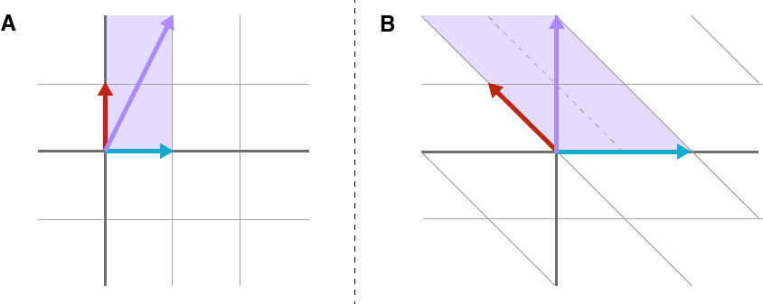
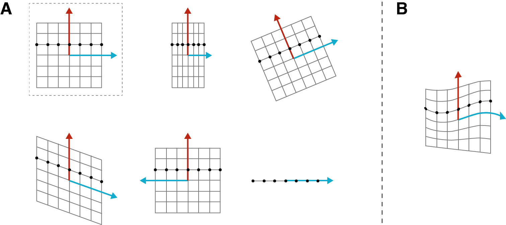
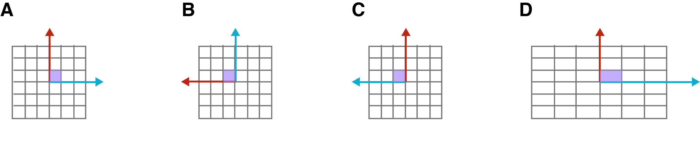
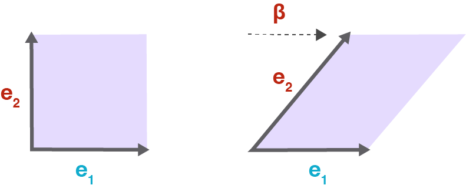
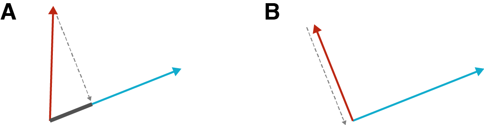
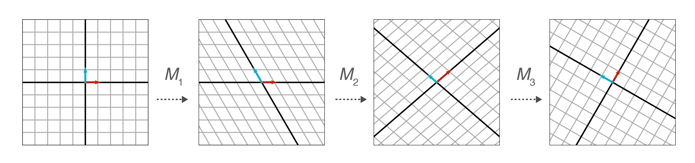

# 从几何角度理解矩阵

矩阵变换是线性代数中的主要内容，如何理解它？本文以几何角度，理解线性变换中的矩阵，能帮助学习者对其建立直观音箱。

注：以下讨论中仅限于实数矩阵范围。

## 作为线性变换的矩阵

在线性代数中，线性方程组的形式是：

$$\pmb{b} = \pmb{Ax}$$

其中 $$\pmb{b}\in\mathbb{R}^m$$​​​​​​ ，$$\pmb{A}\in\mathbb{R}^{m\times n}$$​​​​​​ ，$$\pmb{x}\in\mathbb{R}^n$$​​​​​​ 。上式表示 $$m$$​​​​​​ 个线性方程组，$$n$$​​​​​​ 个未知量，$$\pmb{A}$$​​​​​​ 是系数矩阵，$$\pmb{x}$$​​​​​​ 是线性方程组的解。除了这个观点之外，还可以认为矩阵 $$\pmb{A}$$​​​​​​ 是实现 $$\mathbb{R}^n\to\mathbb{R}^m$$​​​​​​ 的线性变换 $$f$$​​​​​​ 。

我认为，研究矩阵如何实现线性变换，最简单的方式是观察它的列向量，矩阵的列向量表示标准基的 $$\mathbb{R}^n\to\mathbb{R}^m$$​​ 的映射。例如，$$\mathbb{R}^3$$​​ 中的标准基是：

$$\pmb{e}_1=\begin{bmatrix}1\\0\\0\end{bmatrix},\pmb{e}_2=\begin{bmatrix}0\\1\\0\end{bmatrix},\pmb{e}_3=\begin{bmatrix}0\\0\\1\end{bmatrix}$$

根据定义，$$\mathbb{R}^3$$​ 中的每个向量都可以写成标准基的线性组合：

$$\pmb{x}=\begin{bmatrix}x_1\\x_2\\x_3\end{bmatrix}=x_1\begin{bmatrix}1\\0\\0\end{bmatrix}+x_2\begin{bmatrix}0\\1\\0\end{bmatrix}x_3\begin{bmatrix}0\\0\\1\end{bmatrix}$$​

现在让我们看看，用矩阵乘以标准基中的一个向量，会发生什么，例如 $$\pmb{Ae}_2$$​​ ：

$$\overbrace{\vphantom{\begin{bmatrix}0\\0\\0\end{bmatrix}}\left[\begin{array}{c|c|c}1 & \color{#bc2612}{2} & 0 \\ -5 & \color{#bc2612}{3} &1\end{array}\right]}^{\pmb{A}} \overbrace{\begin{bmatrix}0 \\ 1 \\ 0\end{bmatrix}}^{\pmb{e}_2}=\begin{bmatrix}0 + \color{#bc2612}{2} + 0 \\ 0 + \color{#bc2612}{3} + 0\end{bmatrix}=\begin{bmatrix}\color{#bc2612}{2} \\ \color{#bc2612}{3}\end{bmatrix}$$​

也就是说，矩阵 $$\pmb{A}$$​​​​​​​ 的第二个列向量告诉我们，它将 $$\mathbb{R}^3$$​​​​​​​ 的第二个基向量映射到 $$\mathbb{R}^2$$​​​​​​​ 。如果将 $$\mathbb{R}^3$$​​​​​​​ 的基向量组成 $$3\times3$$​​​​​​​ 的矩阵，通过矩阵乘法，$$\mathbb{R}^3$$​​​​​​​ 的基向量映射到 $$\mathbb{R}^2$$​​​​​​​ 。

$$\left[\begin{array}{c|c|c}
1 & 2 & 0 \\ -5 & 3 & 1
\end{array}\right]
\left[\begin{array}{c|c|c}
\color{#11accd}{1} & \color{#bc2612}{0} & \color{#807504}{0} \\
\color{#11accd}{0} & \color{#bc2612}{1} & \color{#807504}{0} \\
\color{#11accd}{0} & \color{#bc2612}{0} & \color{#807504}{1}
\end{array}\right]
=
\left[\begin{array}{c|c|c}
\color{#11accd}{1} & \color{#bc2612}{2} & \color{#807504}{0}
\\
\color{#11accd}{-5} & \color{#bc2612}{3} & \color{#807504}{1}
\end{array}\right]$$

以上式子等号右侧的矩阵，每一列就是 $$\mathbb{R}^3$$​​​ 的基映射到 $$\mathbb{R}^2$$​​​ 后的基向量，也可以记作 $$f(\pmb{e}_1)=\begin{bmatrix}1\\-5\end{bmatrix},f(\pmb{e}_2)=\begin{bmatrix}2\\3\end{bmatrix},f(\pmb{e}_3)=\begin{bmatrix}0\\1\end{bmatrix}$$​​​​ 。

假设 $$\mathbb{R}^3$$​​​​​ 中的向量 $$\pmb{x}=\begin{bmatrix}1.2\\1.5\\-2\end{bmatrix}$$​​​​​ ，如果计算 $$\pmb{Ax}$$​​​​​ ，即表示将向量 $$\pmb{x}$$​​​​​ 映射到 $$\mathbb{R}^2$$​​​​​ 中，即：

$$\overbrace{
\vphantom{\begin{bmatrix}0\\0\\0\end{bmatrix}}
\left[\begin{array}{c|c|c}
1 & 2 & 0 \\ -5 & 3 & 1
\end{array}\right]}^{\pmb{A}}
\overbrace{
\vphantom{\begin{bmatrix}0\\0\\0\end{bmatrix}}
\begin{bmatrix}
1.2 \\ 1.5 \\ -2
\end{bmatrix}}^{\pmb{x}}
=
\overbrace{
\vphantom{\begin{bmatrix}0\\0\\0\end{bmatrix}}
\begin{bmatrix}
4.2 \\ -3.5
\end{bmatrix}}^{f(\pmb{x})}
$$​​​      (1)

此外，还可以用向量 $$\pmb{x}$$​ 的系数与 $$f(\pmb{e}_1),f(\pmb{e}_2),f(\pmb{e}_3)$$​ 的线性组合，表示映射后的 $$\mathbb{R}^2$$​ 中的向量：

$$1.2
\overbrace{\begin{bmatrix}
1 \\ -5
\end{bmatrix}}^{f(\pmb{e}_1)}
+
1.5
\overbrace{\begin{bmatrix}
2 \\ 3
\end{bmatrix}}^{f(\pmb{e}_2)}
-
2
\overbrace{\begin{bmatrix}
0 \\ 1
\end{bmatrix}}^{f(\pmb{e}_3)}
=
\begin{bmatrix}
1.2 + 3 + 0 \\
-6 + 4.5 - 2
\end{bmatrix}
=
\overbrace{\begin{bmatrix}
4.2 \\-3.5
\end{bmatrix}}^{f(\pmb{x})}
$$​​    (2)

比较（1）式和（2）式，很酷！

上面两个式子可以帮助我们理解矩阵乘法，即将向量映射到转换矩阵 $$\pmb{A}$$​​​​ 的列空间（列向量张成的空间），$$f(\pmb{x})$$​​​​ 恰为矩阵 $$\pmb{A}$$​​​​​ 的列向量的线性组合，系数为向量 $$\pmb{x}$$ 的元素。

以线性变换或者映射的角度理解矩阵，是线性代数的关键。

线性变换 $$f:\mathbb{R}^n\to\mathbb{R}^m$$​​​​ 意味着将 $$\mathbb{R}^n$$​​​​ 中的向量 $$\pmb{x}$$​​​​ 映射成为 $$\mathbb{R}^m$$​​​ 的向量，它是 $$\mathbb{R}^m$$​​​ 基的线性组合，能表示为矩阵与向量的乘积。

$$\pmb{x} = x_1\pmb{e}_1+x_2\pmb{e}_2+\cdots+x_n\pmb{e}_n$$

$$\begin{split}f(\pmb{x})&=f(x_1\pmb{e}_1+x_2\pmb{e}_2+\cdots+x_n\pmb{e}_n)\\&=f(x_1\pmb{e}_1)+f(x_2\pmb{e}_2)+\cdots+f(x_n\pmb{e}_n)\\&=x_1f(\pmb{e}_1)+x_2f(\pmb{e}_2)+\cdots+x_nf(\pmb{e}_n)\\&=\begin{bmatrix}f(\pmb{e}_1)&f(\pmb{e}_2)&\cdots&f(\pmb{e}_n)\end{bmatrix}\pmb{x}\end{split}$$​​​

## 从几何角度理解

从几何角度理解矩阵所具有的线性变换特点，能更直观感受到其中的奇妙。以 $$2\times2$$​​​​ 级矩阵为例，它实现了 $$\mathbb{R}^2\to\mathbb{R}^2$$​​​​ 的线性变换，例如用下述的矩阵 $$\pmb{A}$$​​​​ 对向量 $$\pmb{x}=\begin{bmatrix}1\\2\end{bmatrix}$$​​​​ 进行变换，即：

$$\pmb{Ax}=\overbrace{\begin{bmatrix}2&-1\\0&1\end{bmatrix}}^{\pmb{A}}\overbrace{\begin{bmatrix}1\\2\end{bmatrix}}^{\pmb{x}}=\overbrace{\begin{bmatrix}0\\2\end{bmatrix}}^{f(\pmb{x})}$$​​​​​​​

以图示的方式，如下图所示，A 部分表示向量 $$\pmb{x}$$​​​​​​​ 是 $$\mathbb{R}^2$$​​​​​​​ 的标准正交基的线性组合，B 部分表示经过转换之后的向量 $$f(\pmb{x})$$​​​​​​ 在以矩阵 $$\pmb{A}$$​​​​​​ 的列向量为基的 $$\mathbb{R}^2$$​​​​​​ 中的基向量的线性组合，即 $$\pmb{Ax}$$​​​​​​ 表示经过线性变换之后，在 $$\pmb{A}$$​​​​​​ 的列向量张成的向量空间中的向量。

注意观察，上图中 A 以方格为单位，B 的平行四边形网格表示了变换后的空间。可以想象，通过矩阵，不仅可以实现对向量的变换，也能够对 $$\mathbb{R}^n$$​ 中所有的 $$m\times n$$​​ 矩阵进行变换。

## 线性变换的类型

矩阵能够实现的线性变换包括旋转、反射、伸缩、剪切、投影等。如下图所示，A 部分第一行最左为变换前的 $$\mathbb{R}^2$$​​ 空间的图形，向右依次表示：沿 x  轴压缩、旋转；第二行从左向右依次表示：向 $\mathbb{R}$​​ 的投影、基于 y 轴的反射、剪切。B 部分则表示的是 $$\mathbb{R}^2$$​​ 中的非线性变换。

线性函数是 1 次或更少次的多项式，这意味着变量的变化率恒定。因此，不能用线性变换表示的空间的形变，即若 $$\mathbb{R}^n$$​​​​ 中均匀分布的点在 $$\mathbb{R}^m$$​​​ 中若不均匀了（如上图 B 所示），就不能使用线性变换。

下面讨论几种特殊矩阵的变换，为了简化问题，仅以 $$n\times n$$​ 矩阵为例。

### 对角矩阵

对角矩阵乘以一个向量，其形式如下：

$$\begin{bmatrix}
\color{#11accd}{\alpha_1} & & & & \\
& \ddots & & & \\
& & \color{#bc2612}{\alpha_i} & & \\
& & & \ddots & \\
& & & & \color{#807504}{\alpha_n}
\end{bmatrix}
\begin{bmatrix}
x_1 \\ \vdots \\ x_i \\ \vdots \\ x_n
\end{bmatrix}
=
x_1 \begin{bmatrix}
\color{#11accd}{\alpha_1} \\ \phantom{\vdots} \\ \phantom{\vdots} \\ \phantom{\vdots} \\ \phantom{\vdots}
\end{bmatrix}
+
\dots
+
x_i \begin{bmatrix}
\phantom{\vdots} \\ \phantom{\vdots} \\ \color{#bc2612}{\alpha_i} \\ \phantom{\vdots} \\ \phantom{\vdots}
\end{bmatrix}
+
\dots
+
x_n \begin{bmatrix}
\phantom{\vdots} \\ \phantom{\vdots} \\ \phantom{\vdots} \\ \phantom{\vdots} \\ \color{#807504}{\alpha_n}
\end{bmatrix}$$

这意味着通过对角矩阵能够指定向量中的某个元素发生特定变换。如下图所示，如果 $$\alpha_i\gt1$$​​​​ ，则向量中对应的第 $$i$$​​​​​ 个元素会被拉伸（变大）；如果 $$\alpha_i\lt0$$​​​​ ，则能令第 $$i$$​​​​ 个元素实现反射。通过对角矩阵不能实现剪切变换。

上图中 A 的单位方格表示标准基下的形状；B 旋转 $$90°$$​​ ；C 基于 y 轴反射；D 实现了沿横轴方向的拉伸 。

注意，当 $$\forall i, \alpha_i = 1$$​​​ ，对角矩阵是单位矩阵，对应着没有变换时的标准基。其行列式为 $$1$$​​ ，不会改变向量子空间。

### 剪切矩阵

此类矩阵的命名即源于它的作用效果，在形式上可与对角矩阵进行比较，注意其中的 $$\beta$$​ 。

$$\begin{bmatrix}
\alpha_1 & \dots & \color{#bc2612}{\beta} & & \\
& \ddots & \vdots & & \\
& & \color{#bc2612}{\alpha_i} & & \\
& & & \ddots & \\
& & & & \alpha_n
\end{bmatrix}
\begin{bmatrix}
x_1 \\ \vdots \\ x_i \\ \vdots \\ x_n
\end{bmatrix}
=
x_1 \begin{bmatrix}
\color{#11accd}{\alpha_1} \\ \phantom{\vdots} \\ \phantom{\vdots} \\ \phantom{\vdots} \\ \phantom{\vdots}
\end{bmatrix}
+
\dots
+
x_i \begin{bmatrix}
\color{#bc2612}{\beta} \\ \phantom{\vdots} \\ \color{#bc2612}{\alpha_i} \\ \phantom{\vdots} \\ \phantom{\vdots}
\end{bmatrix}
+
\dots
+
x_n \begin{bmatrix}
\phantom{\vdots} \\ \phantom{\vdots} \\ \phantom{\vdots} \\ \phantom{\vdots} \\ \color{#807504}{\alpha_n}
\end{bmatrix}$$

如果没有 $$\beta$$​​​​​​ ，则向量中的 $$x_1$$​​​​​​ 被拉伸为 $$\alpha_1$$​​​​​​​ 倍；当有了 $$\beta$$​​​​​​ 后，变换后的向量的第一个元素是 $$\beta$$​​​​​​ 和 $$\alpha_1$$​​​​​​ 的线性组合。其效果可以用下面的二维图示表示，原来的单位方格在一个维度上实现了剪切。

前面曾经使用过的矩阵 $$\pmb{A}=\begin{bmatrix}2&-1\\0&1\end{bmatrix}$$​ 也是剪切矩阵。

### 正交矩阵

正交矩阵是行向量和列向量正交的方阵，且行向量和列向量都是单位向量。以 $$\pmb{a}_i$$​​​​ 表示矩阵 $$\pmb{A}$$​​​​ 的第 $$i$$​​​​ 列向量。根据正交定义，如果两个向量的点积等于 $$0$$​​​​​ ，则这两个向量正交。用几何的方式表示，如下图所示，将一个向量投影到另一个向量方向上，如果两个向量不正交，投影的长度就是两个向量点积的结果（如下图 A 所示），下图中 B 显示两个向量正交，则投影的长度为 $$0$$​​​​ ，即两个向量点积结果为 $$0$$​​​​ 。

即：$$\pmb{a}_i^{\rm{T}}\pmb{a}_j=0,i\ne j$$​​​ 。又由于是单位向量，$$\pmb{a}_i^{\rm{T}}\pmb{a}_i=1$$​​​ 。从而对于正交矩阵 $$\pmb{A}\in\mathbb{R}^{n\times n}$$​​​ ，有：

$$\pmb{AA}^{\operatorname{T}}=\pmb{A}^{\operatorname{T}}\pmb{A}=\pmb{I}_n$$​​

可以把行和列写出来，就更直观了：

$$\pmb{A}^{\top} \pmb{A}
=
\left[\begin{array}{c}
\pmb{a}_1^{\top}
\\
\hline
\pmb{a}_2^{\top}
\\
\hline
\vdots
\\
\hline
\pmb{a}_n^{\top}
\end{array}\right]
\left[
\begin{array}{c|c|c|c}
\pmb{a}_1 & \pmb{a}_2 & \dots & \pmb{a}_n
\end{array}
\right]
=
\begin{bmatrix}
1 & & & \\
& 1 & & \\
& & \ddots & \\
& & & 1
\end{bmatrix}
= \pmb{I}_n$$​​​​

从几何角度讲，正交矩阵能够旋转或翻转向量，但不能拉伸或压缩。如果更严谨地研究正交矩阵，需要了解如下几项性质。

**1. 保持角度**

设矩阵 $$\pmb{V}$$​​​​ 的列向量集合是 $$\{\pmb{v}_1,\pmb{v}_2,\cdots,\pmb{v}_n\}$$​​​​ ，矩阵 $$\pmb{A}$$​​​​ 是单位正交矩阵，线性变换 $$\pmb{AV}$$​​​​ 并不改变列向量两两之间的夹角。

对于其中的列向量 $$\pmb{v}_i$$​​​​ 和 $$\pmb{v}_j$$​​​​ 其中 $$i\ne j$$​​​​ ，它们的点积是 $$\pmb{v}_i\cdot\pmb{v}_j$$​​​​ 。

$$\begin{align}
\pmb{Av}_i \cdot \pmb{Av}_j
&= (\pmb{Av}_i)^{\top} (\pmb{Av}_j)
\\
&= \pmb{v}_i^{\top} \pmb{A}^{\top} A \pmb{v}_j
\\
&= \pmb{v}_i^{\top} \pmb{v}_j
\\
&= \pmb{v}_i \cdot \pmb{v}_j
\end{align}$$

即：原矩阵的列向量之间的夹角经过单位正交矩阵映射之后依然保留。

**2. 保持长度**

针对矩阵 $$\pmb{V}$$​​ 的列向量，经单位正交矩阵 $$\pmb{A}$$​​ 映射后，列向量的长度不变。

假设 $$\pmb{v}$$​​ 是矩阵 $$\pmb{V}$$​​ 的一个列向量，则：

$$\begin{align}
\lVert \pmb{Av} \lVert_2^2
&= \pmb{Av} \cdot \pmb{Av}
\\
&= (\pmb{Av})^{\top} (\pmb{Av})
\\
&= \pmb{v}^{\top} \pmb{A}^{\top} \pmb{Av}
\\
&= \pmb{v}^{\top} \pmb{v}
\\
&= \pmb{v} \cdot \pmb{v}
\\
&= \lVert \pmb{v} \rVert_2^2
\end{align}$$​​

即：原矩阵的列向量的长度经过单位正交矩阵映射之后依然保留。

**3. 保持面积**

单位正交矩阵 $$\pmb{A}$$​ 的行列式：

$$1 = \det(\pmb{I}_n) = \det(\pmb{A}^{\top} \pmb{A}) = \det(\pmb{A}^{\top}) \det(\pmb{A}) = (\det(\pmb{A}))^2$$

所以，$$\det(\pmb{A})=\pm1$$

- 当 $$\det(\pmb{A})=1$$ 时，单位正交矩阵 $$\pmb{A}$$​​ 是一个旋转矩阵。
- 当 $$\det(\pmb{A})=-1$$​​​ 时，单位正交矩阵 $$\pmb{A}$$​​​ 是旋转反射矩阵（rotoreflection），即旋转之后再反射，也称为瑕旋转（improer fotation）。

于是，如果用 $$\pmb{A}$$​​​​ 对另外的矩阵进行映射，该矩阵的行列式可视为 n 维多面体（如果是 $$2\times2$$​​​​ 矩阵的行列式，则是平面），其多面体的表面积在映射之后依然保持。

## 线性函数

如果 $$f$$​​ 和 $$g$$​​ 是线性的，则 $$f(g(x))$$​​​ 也是线性的。由此可以用矩阵的乘法表示矩阵的变换。由奇异值分解$$^{[3]}$$​​ ：

$$\pmb{A}=\pmb{U\Sigma V}^{\top}$$​​

其中 $$\pmb{A}\in \mathbb{R}^{m\times n},\pmb{U}\in \mathbb{R}^{m\times m}, \pmb{V}\in \mathbb{R}^{N\times n}$$​​ ，$$\pmb{\Sigma}\in \mathbb{R}^{m\times n}$$​​​ 是正交对角矩阵。

可知，任何矩阵变换都可以分解成由单位矩阵和对角矩阵组成的简单矩阵变换。

下面以实现旋转变换的 $$2\times2$$​ 矩阵 $$\pmb{R}$$​ 为例，对其进行奇异值分解。

$$\overbrace{\begin{bmatrix}
	\cos(\theta) & -\sin(\theta) \\
	\sin(\theta) & \cos(\theta)
\end{bmatrix}}^{\pmb{R}} = \pmb{M}_1\pmb{M}_2 \pmb{M}_3$$​​​

$$\pmb{M}_1 = \begin{bmatrix}
	1 & \alpha \\
	0 & 1
\end{bmatrix}
\qquad
\pmb{M}_2 = \begin{bmatrix}
	1 & 0 \\
	\beta & 1
\end{bmatrix}
\qquad
\pmb{M}_3 = \begin{bmatrix}
	1 & \gamma \\
	0 & 1
\end{bmatrix}$$

利用三角函数的知识，可知：$$\alpha=-\tan(\frac{\theta}{2}), \beta=\sin(\theta), \gamma = -\tan(\frac{\theta}{2})$$​​​ 。下图中假设 $$\theta=\frac{\pi}{3}$$​​​ ，演示了上述三个矩阵分别对最左侧的原始向量所实现的旋转变换。

附：下面是对上述旋转变换的矩阵 $$\mathbb{R}$$​ 进行奇异值分解后所得矩阵的计算过程。

根据上述分解形式，首先计算 $$\pmb{M}_1\pmb{M}_2$$​ ：

$$\overbrace{\begin{bmatrix}
	1 & \alpha \\
	0 & 1
\end{bmatrix}
\begin{bmatrix}
	1 & 0 \\
	\beta & 1
\end{bmatrix}}^{\pmb{M}_1\pmb{M}_2}
=
\begin{bmatrix}
	1 + \alpha \beta & \alpha \\
	\beta & 1
\end{bmatrix}$$​​

再计算 $$\pmb{M}_1\pmb{M}_2\pmb{M}_3$$​ ：

$$\overbrace{\begin{bmatrix}
	1 + \alpha \beta & \alpha \\
	\beta & 1
\end{bmatrix}
\begin{bmatrix}
	1 & \gamma \\
	0 & 1
\end{bmatrix}}^{\pmb{M}_1 \pmb{M}_2 \pmb{M}_3}
=
\begin{bmatrix}
    1 + \alpha \beta  & \gamma + \alpha \beta \gamma + \alpha \\
	\beta & \beta \gamma + 1
\end{bmatrix}$$​

根据前述定义的旋转矩阵，得：

$$\begin{bmatrix}
    \cos(\theta) & - \sin(\theta) \\
    \sin(\theta) & \cos(\theta)
\end{bmatrix}
=
\begin{bmatrix}
    1 + \alpha \beta  & \gamma + \alpha \beta \gamma + \alpha \\
	\beta & \beta \gamma + 1
\end{bmatrix}$$

从而：

$$\beta=\sin(\theta)$$​​​

$$\begin{align}
\cos(\theta) &= 1 + \alpha \beta
\\
&= 1 + \alpha \sin(\theta)
\\
\alpha &= \frac{\cos(\theta) - 1}{\sin(\theta)}
\\
&= -\frac{1 - \cos(\theta)}{\sin(\theta)}
\\
&= - \tan\Big(\frac{\theta}{2}\Big)
\end{align}$$

$$\begin{align}
\cos(\theta) &= \beta \gamma + 1
\\
&= \sin(\theta) \gamma + 1
\\
\frac{\cos(\theta) - 1}{\sin(\theta)} &= \gamma
\\
\gamma &= - \frac{1 - \cos(\theta)}{\sin(\theta)}
\\
&= - \tan\Big(\frac{\theta}{2}\Big)
\end{align}$$​

## 结论

本文对线性变换从几何角度给予阐述，有利于更直观地理解线性变换的有关概念。在学习线性代数时，这是一种很重要的学习和思考方法。

## 参考文献

[1]. [A Geometrical Understanding of Matrices](http://gregorygundersen.com/blog/2018/10/24/matrices/?&continueFlag=219df8fa5d92e2a41b6fa4af489909e2)

[2]. [维基百科：瑕旋转](https://zh.wikipedia.org/wiki/%E7%91%95%E6%97%8B%E8%BD%89)

[3]. 齐伟. 机器学习数学基础. 电子工业出版社