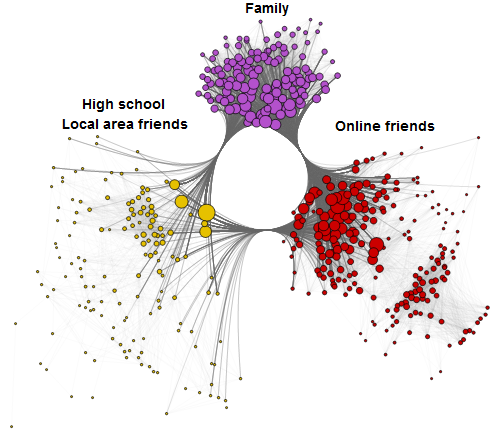
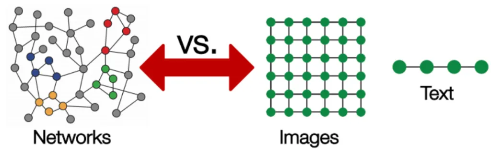
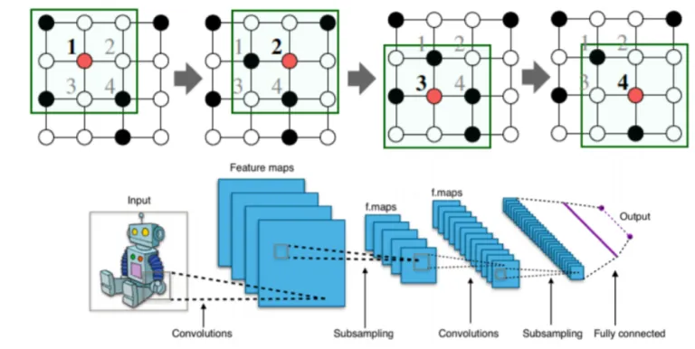
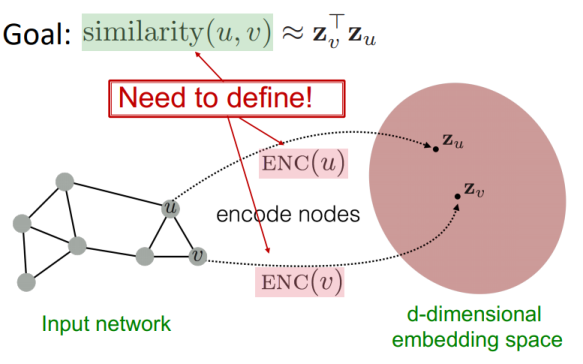
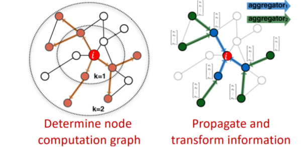
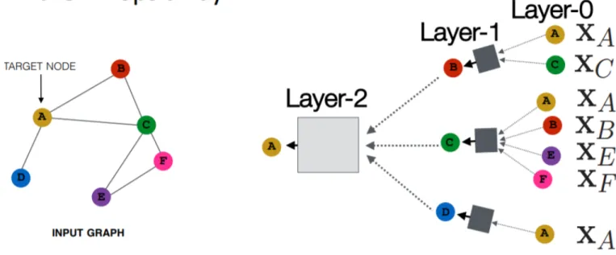
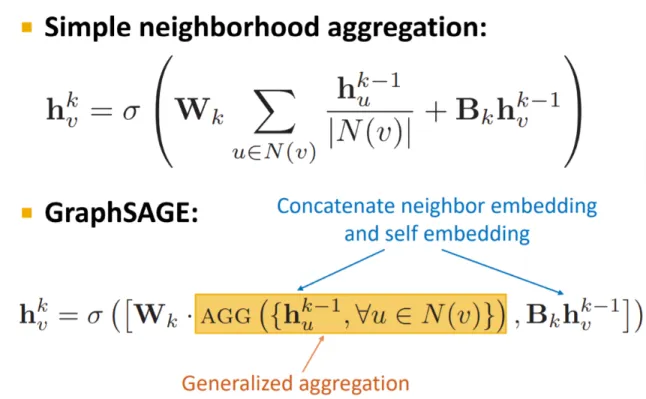

# 图神经网络及其应用概述

神经网络已经成功地应用在模式识别、数据挖掘等领域，不论目标检测、机器翻译、语音合成，都用 CNN、RNN 或自动编码机实现了端到端的应用。

深度学习适合于挖掘欧几里得空间数据的隐藏模式，比如图像、文本、视频等。但是，如果 面对非欧几里得空间的数据，典型的就是图（graph）所表示的复杂关系以及对象之间的互动，深度学习还使用吗？

传统的深度学习模型不适用于图数据，但是，人们发明了**图神经网络**（Graph Neural Networks，GNN）。

## 什么是图

图（Graph）是 GNN 的重要基础，在《机器学习数学基础》的 2.7 节专门介绍了用矩阵表示图的方法，本微信公众号有内容选读，请读者参阅：[邻接矩阵](https://mp.weixin.qq.com/s/u2Tj8RWRhrXk31FdRu5kZg)，更多内容，请参阅《机器学习数学基础》（电子工业出版社）

计算机科学中的图是一种数据结构，即**图数据**，它由节点（nodes，或 vertices）和边（edges）构成。

通常用符号 $G$ 表示图数据，并定义为 $$G=(V,E)$$ ，其中 $$V$$ 表示节点集合、$E$ 表示连接节点的边的集合。图可以划分为有向图和无向图两类。

在现实生活中，图的最典型案例就是社交媒体，如下图所示。每个用户都可以视为节点，用户之间的关系作为边。



在数学上，用邻接矩阵表示图，如果有 $$n$$ 个节点，则邻接矩阵 $$\pmb{A}$$ 是 $$n\times n$$ 的矩阵（详见：[邻接矩阵](https://mp.weixin.qq.com/s/u2Tj8RWRhrXk31FdRu5kZg)，登录 http://math.itdiffer.com 查阅更多内容）。如果一个节点有多个特征，则又构建一个 $$n\times f$$ 的节点特征矩阵 $$\pmb{X}$$ ，其中 $$f$$ 是每个节点的特征个数。

### 分析图的难点

图数据的复杂性对传统的机器学习是一项挑战。传统的机器学习或深度学习工具，比较适用于简单类型数据，比图像，它的结构是不变的，我们可以将其认为是固定的网格图；文本则为序列，可视为线性图。而对于更一般的图，也更复杂，每个节点会有不同数量的边，亦即有不同的节点与其相邻。



## 图神经网络

图神经网络（GNN）是一类深度学习方法，它在图数据上表现优异，能够实现对节点、边或图的预测。

通过 GNN 能够实现传统的卷积（CNN）所做不了的业务。

### CNN 对图数据无可奈何

如你所知，CNN 擅长于处理图像，如图像归类、图像识别、目标检测等，因此它在计算机视觉上用途广泛。这也是 CNN 流行的原因。

CNN 背后的核心概念是卷积和池化层，通过一组内核形式的感受野来识别空间局部特征。



卷积如何对规则网格的图像进行运算？在二维图像上滑动卷积算子窗口，该滑动窗口对应某个函数，通过此函数将窗口内的节点映射到一个数字上，并且通过很多层，最终得到了局部特征。

卷积算子将中心节点及其相邻节点的信息聚合起来，产生了一个新的值。由于网格图像的结构相同，在二维图像上任何部分都适用于此原则，因此卷积算子窗口能在图像上“滑动”。

但是，图数据则不然。图数据没有固定的节点排列顺序，每个节点的邻居数量也是可以变化的。因此，上面所描述的卷积算子就不能自由地“滑动”以聚合信息了。

## 图深度学习基础

图论中有节点嵌入的概念，即将节点映射到一个 $$d$$ 维的嵌入空间（是一个低维空间，不是图的实际维度）。

设 $$\pmb{u}$$ 和 $$\pmb{v}$$ 是图的两个节点，$$\pmb{x_u}$$ 和 $$\pmb{x_v}$$ 分别是两个节点相应的特征向量。

假设定义了两个编码器函数 $$Enc(\pmb{u})$$ 和 $$Enc(\pmb{v})$$ ，分别将两个节点的特征向量转化为 $$\pmb{z_u}$$ 和 $$\pmb{z_v}$$ 。

注意，这里使用欧几里得空间距离近似地判断两个向量的相似度。

上述过程如下图所示：



将图中的节点映射到低维嵌入空间，其目标是得到与原数据中相似关系等价的节点，即映射之后节点间的相对相似性不变。

**现在要解决的问题是如何构建编码器函数。**

如下图所示，在计算图（computational graph，关于“计算图”的更多内容，请参阅：http://math.itdiffer.com 有关章节）中，对于红色的节点 $i$ ，可以观察到与它直接相邻的节点，以及它的邻居的邻居。通过计算图，可以看到所有可能的连接。



通过计算图，不仅可以把握图的结构，同时也能提取特征信息。之后就可以进行聚合，这是神经网络的基本操作。


上图中的灰色正方形表示神经网络，通过它聚合后，数据的阶不变（order-invariant），因为所使用的函数是实现求和、平均、最值等运算的排列不变函数（permutation-invariant functions），即输入的顺序改变不会影响输出的值。

首先看看 GNN 的前向传播算法，它实现了神经网络中数据从输入到输出的过程。



每个节点有一个特征向量，如 $$\pmb{X_A}$$ 是节点 $$\pmb{A}$$ 的特征向量。对 GNN 而言，其输入就是这些特征向量（如上图中的 $$\pmb{X_A}$$ 和 $$\pmb{X_C}$$ ），经过正方形表示的神经网络 Layer-1 层，完成一次聚合，将输出结果输入到下一层。

注意，输入的节点以其特征为代表，例如节点 C，在输入层中，显示的是其特征。后续各层亦如此。

在上述计算图中，前向传播过程可以设计为一下三步：

1. 激活输入层：

   $$\pmb{h}_v^0=\pmb{X}_v(feature\quad vector)$$

2. 网络中的其他层：

   $$\pmb{h}_v^k=\pmb{\sigma}\left(\pmb{W}_k\sum\frac{h_u^{k-1}}{|N(\pmb{v})|}+\pmb{B}_k\pmb{h}_v^{k-1}\right),其中k=1,2,\cdots,k-1$$

   上式的组成部分含义如下：

   - 第一项 $$\pmb{W}_k\sum\frac{h_u^{k-1}}{|N(\pmb{v})|}$$ 表示对所有节点求平均；
   - 第二项 $$\pmb{B}_k\pmb{h}_v^{k-1}$$ 中的 $$\pmb{B}_k$$ 表示偏置；
   - 函数 $$\pmb{\sigma}$$ 是一个非线性激活函数，以上两项的和作为其参数。

3. 输出层（最后的层）

   $$\pmb{z}_v=\pmb{h}_v^k$$

   表示 k 层之后的输出。

当然，在训练模型之前，还要定义损失函数。

模型的训练，可以用有监督和无监督两类：

- 有监督训练：比如节点分类，区分正常或异常节点等，适用于有监督的任务。
- 无监督训练：只用到图的结构。无监督损失函数可以是基于图中节点近似度的损失，也可以是随机游走。

以上，简要了解了节点嵌入的基本思想，接下里要重点讨论图卷积网络（Graph Convolutional Network，GCN）

回顾一下，在本节中，我们描述了通过聚合邻域信息来生成节点嵌入的基本思想。

## 图卷积网络

GCN 最早是由 Bruna 在其论文“Spectral Networks and Deep Locally  Connected Networks on Graphs”中作为针对图数据的神经网络方法而提出。

最简单的 GCN 有以下组成：

- 图卷积
- 线性层
- 非线性激活

一般按顺序执行，最终组成一个神经网络层。对于一个完整的 GCN，可以由一个或多个层组成。

在 Python 中，可以用 PyTorch 很容易构建 GCN。

```python
import torch
from torch import nn

class GCN(nn.Module):
    def __init__(self, *sizes):
        super().__init__()
        self.layers = nn.ModuleList([
            nn.Linear(x, y) for x, y in zip(sizes[:-1], sizes[1:])
        ])
    def forward(self, vertices, edges):
        # ----- 构建邻接矩阵 -----
        # 从自我连接开始
        adj = torch.eye(len(vertices))
        # 边包含连接的定点: [vertex_0, vertex_1] 
        adj[edges[:, 0], edges[:, 1]] = 1 
        adj[edges[:, 1], edges[:, 0]] = 1
        
        # ----- 前向数据传递 -----
        for layer in self.layers:
            vertices = torch.sigmoid(layer(adj @ vertices))
 
        return vertices
```

### GraphSAGE

Hamilton 提出的 GraphSAGE (Hamilton et al, NIPS 2017) 是动态图的典型代表。利用它，不需要预训练，就可以预测一个新嵌入的点。为此，GraphSAGE 采用了归纳学习。它根据节点的特征和邻域学习聚合函数，这些函数可以诱导新的节点嵌入。



注意与之前的区别，这里不再是求和后就将此前项丢掉，而是使用通用的聚合函数。之前，使用的是均值聚合函数 $${\rm{AGG}}=\sum_{\pmb{u}\in N(\pmb{v})}\frac{\pmb{h}_u^{k-1}}{|N(\pmb{v})|}$$ ——只是从邻居那里获取消息并将它们相加，然后根据邻居的数量对其进行归一化。 现在，采用池化方法，或者可以用像 LSTM 这样的深度神经网络。


## GNN 应用

任何地方都可以看到图结构数据。下面列出几项 GNN 的应用场景：

1. 节点分类：此类任务的目标是通过邻居的标签确定节点标签。一般这类问题通过半监督学习实现（半监督学习，即只有一部分数据被标注）。
2. 图分类：即将整个图划分为不同类别，如图像分类，但是目标变为图域。图分类的应用范围很广，从在生物信息学中确定蛋白质是否是酶，到在 NLP 或社交网络分析中对文档进行分类。
3. 图可视化：是数学和计算机科学的一个研究领域，是几何图论和信息可视化的交叉。其核心是图数据的可视化表示，揭示数据中可能存在的结构和异常，并帮助用户通过可视化方式理解图数据。
4. 连接预测：算法已经理解了图中两个实体的关系，基于此预测与其他实体之间的关系，特别是在社交媒体中，预测用户之间的关系，从而推荐有关信息。
5. 图聚类：指的是对图数据进行聚类。一种是对图中的节点聚类；另外一种是将图视为一个对象，对其聚类。

## GNN 应用领域列表

此表来自参考资料 [1] ，本文不再翻译，仅供参考。

| Application                                                  | Deep Learning                                                | Description                                                  |
| ------------------------------------------------------------ | ------------------------------------------------------------ | ------------------------------------------------------------ |
| Text classification                                          | Graph convolutional network/ graph attention network         | A classic application of GNNs in NLP is Text Classification. GNNs utilize the inter-relations of  documents or words to infer document labels. GCN and GAT models are  applied to solve this task. They convert text to graph-of-words, and  then use graph convolution operations to convolve the word graph. They  show through experiments that the graph-of-words representation of texts has the advantage of capturing non-consecutive and long-distance  semantics |
| Neural machine translation                                   | Graph convolutional network/ gated graph neural network      | The neural machine  translation (NMT) is considered a sequence-to-sequence task. One of  GNN’s common applications is to incorporate semantic information into  the NMT task. To do this, we utilize the Syntactic GCN on syntax-aware  NMT tasks. We can also use the GGNN in NMT. It converts the syntactic  dependency graph into a new structure by turning the edges into  additional nodes and thus edges labels can be represented as embeddings |
| Relation extraction                                          | Graph LSTM/ graph convolutional network                      | Relation Extraction is the  task of extracting semantic relations from the text, which usually occur between two or more entities. Traditional systems treat this task as a  pipeline of two separated tasks, i.e., named entity recognition (NER)  and relation extraction, but new studies show that end-to-end modeling  of entity and relation is important for high performance since relations interact closely with entity information |
| Image classification                                         | Graph convolutional network/ gated graph neural network      | Image classification is a  basic computer vision task. Most of the models provide attractive  results when given a huge training set of labeled classes. The focus now is towards getting these models to perform well on zero-shot and  few-shot learning tasks. For that, GNN appears quite appealing.  Knowledge graphs can provide the necessary information to guide the ZSL  (Zero-shot learning) task |
| Object detection<br>Interaction detection<br/>Region classification<br/>Semantic segmentation | Graph attention network<br/>Graph neural network<br/>Graph CNN<br/>Graph LSTM/ gated graph neural network/ graph CNN/ graph neural network | There are other applications  of computer vision tasks like object detection, interaction detection,  and region classification. In object detection, GNNs are used to  calculate RoI features; in interaction detection, GNN is message-passing tools between humans and objects; in region classification, GNNs  perform reasoning on graphs that connect regions and classes |
| Physics                                                      | Graph neural network/ graph networks                         | Modeling real-world physical systems is one of the most basic aspects of understanding human intelligence. By representing objects as nodes and  relations as edges, we can perform GNN-based reasoning about objects,  relations, and physics in an effective way. Interaction networks can be  trained to reason about the interactions of objects in a complex  physical system. It can make predictions and inferences about various  system properties in domains such as collision dynamics |
| Molecular fingerprints                                       | Graph convolutional network                                  | Molecular fingerprints are feature vectors that represent molecules. ML  models predict the properties of a new molecule by learning from example molecules that use fixed-length fingerprints as inputs. GNNs can  replace the traditional means that give a fixed encoding of the molecule to allow the generation of differentiable fingerprints adapted to the  task for which they are required |
| Protein interface prediction                                 | Graph convolutional network                                  | This is a challenging problem with important applications in drug  discovery. The proposed GCN-based method respectively learns ligand and  receptor protein residue representation and merges them for pairwise  classification. At a molecular level, the edges can be the bonds between atoms in a molecule or interactions between amino-acid residues in a  protein. On a large scale, graphs can represent interactions between  more complex structures such as proteins, mRNA, or metabolites |
| Combinatorial optimization                                   | Graph convolutional network/ graph neural network/ graph attention network | Combinatorial optimization (CO) is a topic that consists of finding an  optimal object from a finite set of objects. It is the base of many  important applications in finance, logistics, energy, science, and  hardware design. Most CO problems are formulated with graphs. In a  recent work by DeepMind and Google, graph nets are used for two key  subtasks involved in the MILP solver: joint variable assignment and  bounding the objective value. Their neural network approach is faster  than existing solvers on big datasets |
| Graph generation                                             | Graph convolutional network/ graph neural network/ LSTM /RNN/ relational-GCN | Generative models for real-world graphs have drawn significant attention for their important applications including modeling social  interactions, discovering new chemical structures, and constructing  knowledge graphs. The GNN based model learns node embeddings for each  graph independently and matches them using attention mechanisms. This  method offers good performance compared to standard relaxation-based  techniques |


## 结论

最近几年，图神经网络发展迅速，成为了解决实际问题的强有力的工具。值得拥有。

## 参考资料

1. https://neptune.ai/blog/graph-neural-network-and-some-of-gnn-applications
2. 齐伟.机器学习数学基础[M].北京:电子工业出版社（本书于2022年初出版，有关内容请参阅：http://math.itdiffer.com）