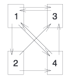
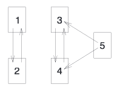

# 价值250亿美元的特征向量——Google背后的线性代数

原文标题：THE $$25,000,000,000 EIGENVECTOR THE LINEAR ALGEBRA BEHIND GOOGLE

原文地址：https://www.rose-hulman.edu/~bryan/googleFinalVersionFixed.pdf

作者：

- KURT BRYAN：Department  of  Mathematics,  Rose-Hulman  Institute  of  Technology,  Terre  Haute,  IN  47803;  email:kurt.bryan@rose-hulman.edu; phone: 812) 877-8485; fax: (812)877-8883.
- TANYA LEISE：Mathematics  and  Computer  Science  Department,  Amherst  College,  Amherst,  MA  01002;   email:tleise@amherst.edu; phone: (413)542-5411; fax: (413)542-2550.

注：在翻译过程中，为了便于阅读，并考虑到中文表述习惯，对原文的某些表述在未改变原意的前提下，进行了适当重构，包括数学表达形式。

## 1. 概述

Google在1990年代末发布，它与当时的其他搜索引擎不同之处在于，总是能够将最匹配的“好东西”放在前面。在别的搜索引擎那里，你总要一屏一屏地找，很多都是跟你搜索不相关的，幸运的话能找到所要的网页。Google之所以那么神奇，部分原因在于它所使用的PageRank算法，此算法能够定量地评估每个网页的重要性，从而建立起了对网页的排名，这样就能首先向用户展示最重要——最相关和最有用的页面。

若要设计出吸引人们大量访问的网页，就非常有必要知道 PageRank 算法是怎么计算网页重要性的，只有这样才能让 Google 把该网页呈现在人们搜索的结果中，让更多人看到。事实上，由于 Google搜索引擎的重要性，它的网页排名系统对互联网的发展已经产生了深远的影响。本文旨在解释 Google 的网页排名的核心算法思想。这其实是线性代数在实际业务中令人兴奋的应用。

像 Google 这样的搜索引擎必须做好以下三个基本事情：

1. 抓取所有能够公开访问的网页。
2. 对上面的数据进行索引，以便能有效地搜索到相关的关键词或句子
3. 评估数据库中每个页面的重要性，当用户搜索相关信息时，可以根据重要性呈现页面

本文将聚焦于上面的第3步，对于互联网中的网页，如果有意义地定量化确定每个页面的“重要性”。

搜索结果中链接的排列，网页的重要性不是唯一因素，但是重要因素。除了 PageRank 算法之外，还有其他成功的网页排名算法。有兴趣的读者可以去搜索一下，会找到大量内容，这里仅仅介绍入门的内容（例如，参考文献[9]中有大量的参考书目）。参考文献[6]介绍了 Google 网页排名的基本过程，参考文献[3]和[9]则比较深入地进行了阐述。在参考文献[5]中还附有非常具体的示例。参考文献[4, 11, 14]中包含了关于 PageRank 算法更详细的内容以及对基本原理的解释。此外，有关搜索引擎的基本原理和其他排名算法的内容，请参阅文献[2, 8]，参考文献[12, 13]中列出了一些的网络搜索方法。

## 2. 网页排名公式

图2.1. 只有4个网页的网络示例，从网页A到网页B的箭头标识从网页A到网页B的一个链接

### 2.1. 基本思想

在对网页的重要性进行定量评估中，会用使用“重要性分数”（importance score）和“分数”（score）两个术语。任何网页的重要性分数都是一个非负实数。对给定网页打分的基本思想是，依据该网页与其他网页的链接。从一个网页链接到指定网页，称为反向链接（backlinks），如同民主投票，到某网页的链接越多，其分数越高。

假设互联网中的网页数为 $$n$$ ，每个网页的索引是一个整数 $$k, 1\le k\le n$$ 。如图2.1所示，如果一个箭头从网页A指向网页B，就表示从网页A链接到网页B。这样所有网页就构成了一个有向图。设 $$x_k$$ 为网页 $$k$$ 的重要性分数，$$x_k$$ 是非负数，若 $$x_j\gt x_k$$ ，则说明网页 $$j$$ 比网页 $$k$$ 重要（ $$x_j=0$$ 表示网页 $$j$$ 的重要性分数最小）。

对重要性分数 $$x_k$$ 赋值的最简单方法是依据网页 $$k$$ 的反向链接数，以图2.1中的网络为例，$$x_1=2,x_2=1,x_3=3,x_4=2$$ ，即网页 $$3$$ 最重要，网页 $$1$$ 和网页 $$4$$ 次之，网页 $$2$$ 最不重要。对网页 $$k$$ 的一个链接就是其重要性的一票。

这种方法忽视了排名算法的一个重要问题，从一个重要网页链接到网页 $$k$$ 所对应的重要性分数应该高于从一个不重要网页链接到此网页的重要性分数。例如，如果你的个人网站首页能够从雅虎链接过来，那么就比从 www.itdiffer.com（原文的网址是 www.kurtbryan.com，并且此网址与作者无关。此处译者修改为当前网站，此网站是译者的个人网站，当然是寂寂无名的一个网站）链接过来要重要得多（注：在作者的网络应用范围，雅虎是一个大型网站，读者可以将其对应为国内的其他大型网站）。以图2.1为例，网页 $$1$$ 和网页 $$4$$ 的都有两个反向链接，但是网页 $$1$$ 的反向链接中有一个来自网页 $$3$$ ，网页 $$3$$ 是这个网络中最重要的网页；而网页 $$4$$ 的另外一个反向链接来自最不重要的网页 $$2$$ 。那么，由此应该判断网页 $$1$$ 的重要性应该高于网页 $$4$$ 。

综合上述内容，首先计算网页 $$j$$ 的分数，即所有链接到网页 $$j$$ 的页面分数的总和。以图2.1为例，网页 $$1$$ 的分数为 $$x_1=x_3+x_4$$ 。而 $$x_3$$ 和 $$x_4$$ 的值也与 $$x_1$$ 有关（如 $$x_3=x_1+x_2+x_4$$ ），所以这种计分方法似乎存在一种“自我引用”的问题，但是我们不得不使用的方法，当然还要进行改进。跟选举一样，我们并不希望简单一个人仅仅通过简单多数票胜出。同样，对网页的分数，也不能仅凭超链接的数量。如果网页 $$j$$ 中含有 $$n_j$$ 个超链接，其中有一个链接到网页 $$k$$ ，那么，网页 $$k$$ 由此获得的分数为 $$x_j/n_j$$ ，而不是 $$x_j$$ 。也就是说，“每一票”的分数为网页分数乘以权重，即除以该网页的向外超链接总数。设网络总计 $$n$$ 个网页，$$L_k\subset\{1,2,\cdots,n\}$$ 为网页 $$k$$ 的反向链接数集合，则网页 $$k$$ 的分数为：

$$x_k=\sum_{j\in L_k}\frac{x_j}{n_j}\tag{2.1}$$

其中 $$n_j$$ 为网页 $$j$$ 中向外的超链接数，如果 $$j\in L_k$$ ，则 $$n_j$$ 是正数且网页 $$j$$ 至少有一个链接到网页 $$k$$ 。这里不计算网页自己链接到自己的数量，在“民主的网络”中，不能自己给自己投票。

下面就用这种方法来计算图2.1仅有四个网页的网络中每个网页的分数。对网页 $$1$$ ，网页 $$3$$ 和网页 $$4$$ 对其有反向链接，而网页 $$3$$ 只有 $$1$$ 个向外的超链接，网页 $$4$$ 有 $$2$$ 个向外的超链接，故 $$x_1=x_3/1+x_4/2$$ 。同样，还可以分别得到 $$x_2=x_1/3, x_3=x_1/3+x_2/2+x_4/2, x_4=x_1/3+x_2/2$$ 。写成线性方程组形式：

$$\begin{split}x_1 &= x_3/1+x_4/2\\x_2 &= x_1/3 \\ x_3&=x_1/3+x_2/2+x_4/2\\ x_4&=x_1/3+x_2/2\end{split}$$

令 $$\pmb{x}=\begin{bmatrix}x_1\\x_2\\x_3\\x_4\end{bmatrix}$$ ，则上述线性方程组可以用矩阵方式改写为 $$\pmb{Ax}=\pmb{x}$$ 形式，其中矩阵 $$\pmb{A}$$ 是：

$$\pmb{A}=\begin{bmatrix}0&0&1&\frac{1}{2}\\\frac{1}{3}&0&0&0\\\frac{1}{3}&\frac{1}{2}&0&\frac{1}{2}\\\frac{1}{3}&\frac{1}{2}&0&0\end{bmatrix}\tag{2.2}$$

对于方阵 $$\pmb{A}$$ ，其特征向量 $$\pmb{x}$$ 对应的特征值是 $$1$$ 。此处方阵 $$\pmb{A}$$ 称为给定网络的**链接矩阵**（link matrix）。

更一般地，在网络中没有悬空节点（dangling nodes，即网页没有向外的超链接）的情况下，链接矩阵 $$\pmb{A}$$ 必须有等于 $$1$$ 的特征值。假设网络有 $$n$$ 个网页，根据（2.1）式，如果网页 $$j$$ 有超链接到网页 $$i$$ ，则可得到 $$\pmb{A}$$ 中的一项 $$A_{ij}=1/n_j$$ ，否则 $$A_{ij}=0$$ 。这样，方阵 $$\pmb{A}$$ 的第 $$j$$ 列就是由 $$1/n_j$$ 或 $$0$$ 构成，且每列的各项和为 $$1$$ 。

基于上述内容，将进行下述定义，作为研究马尔科夫链的基础。

**定义 2.1**

如果一个方阵的所有项都是非负数，且每列的和为 $$1$$ ，则此方阵称为**列随机矩阵**（column-stochastic matrix）。

前面提到的没有悬空节点的方阵 $$\pmb{A}$$ 即为列随机矩阵。

**定理 1**

列随机矩阵具有值为 $$1$$ 的特征值。

**证明**

设 $$\pmb{A}$$ 是 $$n\times n$$ 的列随机矩阵，$$\pmb{e}$$ 表示一个 $$n$$ 维列向量，且各项的和为 $$1$$ 。所以：

$$\pmb{A}^T\pmb{e}=\pmb{e}$$

即 $$1$$ 是 $$\pmb{A}^T$$ 的特征值。又因为 $$\pmb{A}$$ 和 $$\pmb{A}^T$$ 具有相同的特征值，故 $$\pmb{A}$$ 具有值为 $$1$$ 的特征值。

证毕。

在下述内容中，我们会用 $$V_1(\pmb{A})$$ 表示列随机矩阵 $$\pmb{A}$$ 的以 $$1$$ 为特征值的特征空间。

### 2.2. 不足

用（2.1）是给网站排序，也会存在一些困难，这里探讨两点：排名不唯一和有悬空节点的网站。

**2.2.1. 排名不唯一**

在上述探讨的网站排名中，$$V_1(\pmb{A})$$ 的维度等于 $$1$$ ，因此有唯一特征向量 $$\pmb{x}$$ ，且 $$\sum_ix_i=1$$ ，并用之表示网页的重要性分数。此结论对于图2.1所示的网络，或者更一般的具有强链接的网络（依靠有限步数从一个网页到另外任何一个网页）是成立的。

但是，很不幸，链接矩阵 $$\pmb{A}$$ 并非总能唯一地表示网站排名。

设如图2.2所示网络，还有两个子网，子网 $$W_1$$ 含网页 $$1$$ 和网页 $$2$$ ，子网 $$W_2$$ 含网页 $$3、4、5$$ 。其对应的链接矩阵是：

图2.2 有5个网页的网络，包括2个子网

$$\pmb{A}=\begin{bmatrix}0&1&0&0&0\\1&0&0&0&0\\0&0&0&1&\frac{1}{2}\\0&0&1&0&\frac{1}{2}\\0&0&0&0&0\end{bmatrix}$$

对于此矩阵，其特征空间 $$V_1(\pmb{A})$$ 是 $$2$$ 维的，例如该空间的一组基向量 $$\pmb{x}=\begin{bmatrix}\frac{1}{2}\\\frac{1}{2}\\0\\0\\0\end{bmatrix},\pmb{y}=\begin{bmatrix}0\\0\\\frac{1}{2}\\\frac{1}{2}\\0\end{bmatrix}$$ ，这两向量的任意线性组合也都在 $$V_1(\pmb{A})$$ 内，例如 $$\frac{3}{4}\pmb{x}+\frac{1}{4}\pmb{y}=\begin{bmatrix}\frac{3}{8}\\\frac{3}{8}\\\frac{1}{8}\\\frac{1}{8}\\0\end{bmatrix}$$ 。但是，这里搞不清楚应该用哪个特征向量表示排名了。

对于图2.2所示的网络，所对应的矩阵 $$\dim(V_1(\pmb{A}))\gt1$$ ，并非偶然。假设有一个网络 $$W$$ ，并且是由无向图构成，假设有 $$r$$ 个互不相连的子网 $$W_1,W_2,\cdots,W_r$$ ，则 $$\dim(V_1(\pmb{A}))\ge r$$ ，从而没有唯一的重要性分数向量 $$\pmb{x}\in V_1(\pmb{A})$$ 使得 $$\sum_ix_i=1$$ 。即：如果一个网络 $$W$$ 有 $$r$$ 个自网络 $$W_1,W_2,\cdots,W_r$$ ，那么将无法找到一个可以比较一个子网和另外一个子网中页面的页面分数。

## 参考文献

[1]. A. Berman and R. Plemmons, *Nonnegative Matrices in the Mathematical Sciences*,  Academic Press, NewYork, 1979.

[2]. M. W. Berry and M. Browne, *Understanding Search Engines: Mathematical Modeling and Text Retrieval*, Second Edition, SIAM, Philadelphia, 2005.

[3]. M. Bianchini, M. Gori, and F. Scarselli, *Inside PageRank*, ACM Trans. Internet Tech., 5 (2005), pp. 92–128.

[4]. S.  Brin  and  L.  Page, *The  anatomy  of  a  large-scale  hypertextual  web  search  engine*, http://www−db.stanford.edu/∼backrub/google.html (accessed August 1, 2005).

[5]. A. Farahat, T. Lofaro, J. C. Miller, G. Rae, and L.A. Ward, *Authority Rankings from HITS, PageRank,and SALSA: Existence, Uniqueness, and Effect of Initialization*, SIAM J. Sci. Comput., 27 (2006), pp.1181-1201.

[6]. A. Hill, *Google Inside Out*, Maximum PC, April 2004, pp. 44-48.

[7]. S. Kamvar, T. Haveliwala, and G. Golub, *Adaptive methods for the computation of PageRank*, Linear Algebra Appl., 386 (2004), pp. 51–65.

[8]. A. N. Langville and C. D. Meyer, *A survey of eigenvector methods of web information retrieval*, SIAMReview, 47 (2005), pp. 135-161.

[9]. A. N. Langville and C. D. Meyer, *Deeper inside PageRank*, Internet Math., 1 (2005), pp. 335–380.

[10]. C. D. Meyer, *Matrix Analysis and Applied Linear Algebra*, SIAM, Philadelphia, 2000.

[11]. Cleve Moler, *The world’s largest matrix computation*, http://www.mathworks.com/company/newsletters/newsnotes/clevescorner/oct02cleve.html (accessed August 1, 2005).

[12]. Mostafa, J., *Seeking better web searches*, Sci. Amer., 292 (2005), pp. 66-73.

[13], Sara Robinson, *The Ongoing search for efficient web search algorithms*, SIAM News, 37 (Nov 2004).

[14]. Ian Rogers, *The Google Pagerank algorithm and how it works*, http://www.iprcom.com/papers/pagerank/ (accessed August 1, 2005).

[15]. W. J. Stewart, *An Introduction to the Numerical Solution of Markov Chains*, Princeton University Press,Princeton, 1994.