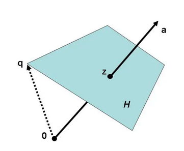

# 超平面

在《机器学习数学基础》285页-286页，根据伯努利分布，推导出了 logistic 函数，并得到了286页的（5.3.16）式：
$$
\log\frac{P(C_1)|\pmb{x}}{1-P(C_1)|\pmb{x}}=\pmb{w}^{\text{T}}\pmb{x}+w_0\tag{5.3.16}
$$

将此式用于探讨线性判别分析，则有 $\pmb{w}^\text{T}\pmb{x}+w_0=0$ ，在二维空间中，这表示的是直线，如果针对多维空间，则是超平面（hyperlane）。

## 1. 超平面的另一种定义方式

### 1.1 代数定义

对于三维空间中平面，如果推广到 $\mathbb{R}^n$ 空间，即有线性方程组：
$$
\pmb{a}^{\text{T}}\pmb{x}=d\tag{1}
$$
的解所形成的集合（其中 $\pmb{a}=\begin{bmatrix}a_1\\\vdots\\a_n\end{bmatrix},\pmb{x}=\begin{bmatrix}x_1\\\vdots\\x_n\end{bmatrix}$ ，$d$  是实数）就构成了超平面，其向量表达式可以写成：
$$
{H}=\{\pmb{x}\in\mathbb{R}^n|\pmb{a}^{\text{T}}\pmb{x}=d\}\tag{2}
$$

### 1.2 几何定义

设 $W$ 是 $\mathbb{R}^n$ 的一个子空间，$W$ 自原点平移 $\pmb{q}$ 之后所得到的集合 $S$ 称为仿射空间$^{[1]}$，如下图所示。记作：
$$
S=W+\pmb{q}=\{\pmb{w}+\pmb{q} \mid \pmb{w} \in W\}\tag{3}
$$
 

在 $\mathbb{R}^n$ 中，超平面是一个维数等于 $n-1$ 的仿射空间，或者说，除了 $\mathbb{R}^n$ 本身，超平面是具有最大维数的仿射空间。

以上两个定义具有等价性。

## 参考资料

[1]. 仿射变换[DB/OL]. https://lqlab.readthedocs.io/en/latest/math4ML/linearalgebra/affine.html