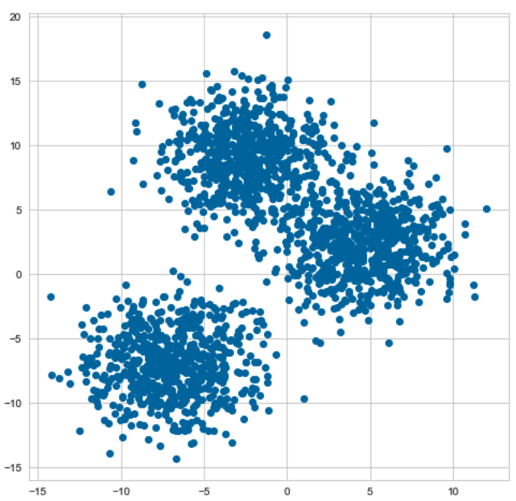
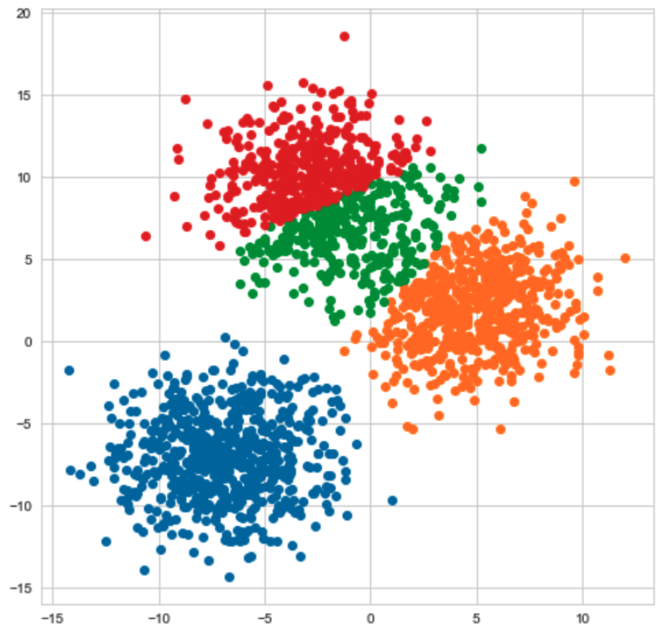
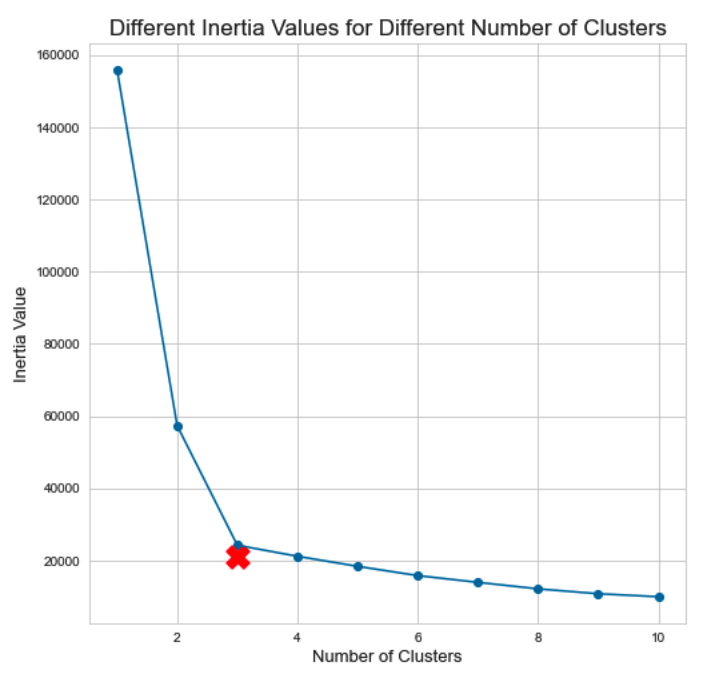
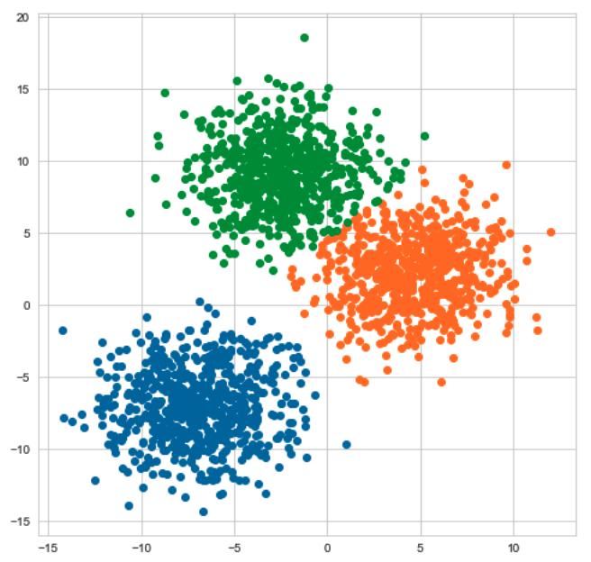
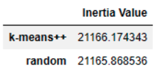

# 确定聚类算法中的超参数

聚类是无监督学习的方法，它用于处理没有标签的数据，功能强大，在参考资料 [1] 中已经介绍了几种常用的算法和实现方式。其中 K-均值（K-Means）算法是一种常用的聚类方法，简单且强大。

K-均值算法首先要定义簇的数量，即所谓的 k ——这是一个超参数。另外还需要定义初始化策略，比如随机指定 k 个簇的初始质心。但是如何更科学地确定这些参数，关系到 K-均值算法聚类结果的好坏。例如，分析网络用户的上网行为，假设收集到一些关于用户在网上的行为数据，要对这些数据进行聚类，那么应该有多少个聚类呢，也就是 k 应该是多少？如果是监督学习，由于数据集中有标签，可以利用训练集训练模型，让后用测试集评估模型的好坏，包括初始设置的各项超参数。但是，现在我们使用的数据集没有标签，这种方法在无监督学习中不再适用了。那么，这时候的超参数应该怎么设置？

对于 K-均值算法而言，可以通过惯性（Inertia）解决这个问题，找到最佳的聚类数量 k。

## 惯性

惯性的定义如下所示：
$$
\sum_{i=1,\mu\in C_k}^n\begin{Vmatrix}x_i-\mu_j\end{Vmatrix}^2
$$
其中 $$\mu_j$$ 为数据点 $$x_i$$ 所在簇 $$C_k$$ 的质心（关于簇的质心或中心，详见参考资料 [1] 的介绍）。或者说，惯性就是簇内的样本与质心的距离（偏差）的平方和。惯性表示了聚类的一致性程度，它的值越小，则样本之间的一致性程度越高。

## 寻找最佳簇数

下面以一个示例，说明如何确定最佳的聚类数量。使用 Scikit-Learns 的  `make_blobs` 函数创建了一个具有二维特征的数据集。

必要的准备：

```python
import sys
import pandas as pd
import numpy as np
import seaborn as sns
import matplotlib.pyplot as plt
%matplotlib inline
plt.rcParams['figure.figsize'] = [8,8]
sns.set_style("whitegrid")
colors = plt.rcParams['axes.prop_cycle'].by_key()['color']

# 去掉 scikit-learns 的各种警告
import warnings
warnings.filterwarnings("ignore", category=DeprecationWarning)

def plot_data(X, kmeans_model=None, num_clusters=0, colors=colors):
    '''
    可视化地显示数据的聚类效果
    '''
    if num_clusters == 0:
        plt.scatter(X[:, 0], X[:, 1], c=colors[0])
    else:
        # 循环聚类的簇
        for cluster in range(num_clusters):
            plt.scatter(X[kmeans_model.labels_ == cluster, 0], X[kmeans_model.labels_ == cluster, 1],
                        c=colors[cluster])
    plt.show()
```

创建数据集，并可视化显示：

```python
from sklearn.datasets import make_blobs
n_samples = 2000
n_features = 2
centers = 3
cluster_std = 2.5
X, y = make_blobs(n_samples=n_samples, n_features=n_features, centers=centers, 
                  cluster_std=cluster_std, random_state=42)
plot_data(X)
```



通过观察，可以断定，这个数据集中有 3 簇，因此 K-均值的最佳聚类数应该是 3。当然，我们还是假装不知道。

如果用  `KMeans` 模型，并假设  `n_clusters=4` ，会得到如下所示结果：

```python
from sklearn.cluster import KMeans
kmeans_model = KMeans(n_clusters=4, init="k-means++")
kmeans_model.fit(X)
plot_data(X, kmeans_model, num_clusters=4)
```



从图示中会发现，如果设定为 4 个聚类，显然不适合。

为了找到最适合的簇数，可以用下面所示的方法：绘制惯性的曲线，使用肘部方法找到最适合的值。

```python
inertia_list = []
for num_clusters in range(1, 11):
    kmeans_model = KMeans(n_clusters=num_clusters, init="k-means++")
    kmeans_model.fit(X)
    inertia_list.append(kmeans_model.inertia_)
    
# 绘制惯性曲线
plt.plot(range(1,11),inertia_list)
plt.scatter(range(1,11),inertia_list)
plt.scatter(3, inertia_list[3], marker="X", s=300, c="r")
plt.xlabel("Number of Clusters", size=13)
plt.ylabel("Inertia Value", size=13)
plt.title("Different Inertia Values for Different Number of Clusters", size=17)
```



图中红色 X 号即为拐点，由此可知最佳聚类数值是 3。图中显示，如果簇的数量增加增加，惯性的值会继续减小，这致使聚类内包含的样本点进一步减少。过多的聚类会导致模型的性能下降，也会导致不理想的聚类结果。假设对用户进行了一次聚类分析，并且有许多小的簇。当某个个小簇的客户购买某件商品时，就只能针对少数其他潜在的买家进行推荐。但是，如果簇中的用户是一个大的一致性集合时，就可以直接针对更多的潜在买家。

因此，在本例中，最佳的聚类数是 3。按照这个值，训练模型，并可视化：

```python
kmeans_model = KMeans(n_clusters=3, init="k-means++")
kmeans_model.fit(X)
plot_data(X, kmeans_model, num_clusters=3)
```



## 寻找最优的初始化策略

在  `KMeans` 模型中，有一个参数  `init` ，用它可以设置初始质心的策略，也是一个超参数。它的值怎么确定，下面继续使用惯性。一般我们会在  `k-means++` 和  `random` 两个值中进行选择，假设现在就如此。我们可以为每种初始化策略训练一个 K-均值模型，并比较其惯性值。获得较小惯性值的策略可作为最优策略。

```python
init_list = ["k-means++", "random"]
inertia_list = []
for init in init_list:
    kmeans_model = KMeans(n_clusters=4, init=init)
    kmeans_model.fit(X)
    inertia_list.append(kmeans_model.inertia_)
results = pd.DataFrame(data=inertia_list, columns=["Inertia Value"], index=init_list)
results
```



由输出结果可知，当  `init='random'` 时，惯性值较小，可以用选用这个初始化策略。

## 参考资料

[1] 聚类[DB/OL]. http://math.itdiffer.com/clustering.html , 2022.10.31.