# K 近邻学习

“孟母三迁”的故事，就是找好的邻居，现在叫做学区。也就是“近朱者赤近墨者黑”。

在以下讨论中，我们将训练集的数据和测试样本，都抽象为空间的“点”，即称为“数据点”。当然，此数据点并不局限于一维、二维或者三维，也包含更高维度。

所谓“K 近邻”，就是将测试数据点与训练集数据点之间的距离从小打到排序之后，前“K”个训练集数据点，作为测试数据点的“邻居”。如果 $$K=1$$ ，那么就是最近的那个“邻居”数据点，即称为**最近邻**。

## 最近邻

如何找“最近邻”？即最近邻算法。

最近邻（Nearest Neightbors）算法是一种基于邻居的（neighbors-based）的算法，即针对一个数据点，找到它的邻居。显然这是一种无监督的学习，这种算法是其他算法的基础，基于此可以进一步实现有监督的分类和回归。

最近邻方法的原理：根据距离，找到数据点周围的样本（“邻居”）。如果邻居的数量：

- 是用户指定的，就是 **K 近邻**，K-nearest Neighbors, 简称：KNN，即指定 K 值。
- 也可以基于半径指定邻居范围，即基于半径的近邻学习。

### 最近邻算法

最近邻算法，通俗讲就是找“邻居”的方法，有：`Ball-Tree` 和 `KD-Tree` 两种。

### KD-Tree$$^{[3]}$$

1. 二叉树搜索

   假设有数据 $$X=\{3,5,7,2,4,6,1\}$$ ，如果构建成二叉树，如下图所示：

   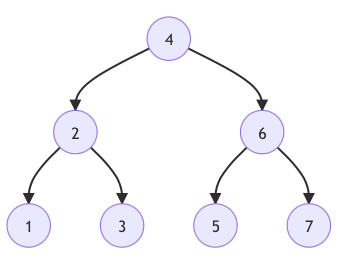

   二叉树的每一个结点左子树上所有结点都小于该结点，而右子树的所有结点都大于该结点。

   假设 $$y=2.1$$ ，试找出 $$X$$ 中各个数据点与 $$y$$ 之间距离最近的“邻居”。

   **方法1：** 线性搜索，即计算 $$X$$ 中的每个数据点与 $$y$$ 之间的距离，$$e_i=|x_i-y|$$ ，然后比较 $$e_i,i=1,2\cdots,7$$ 的大小，找出其中最小值（$$e_m$$），则找到了与 $$y$$ 最近的“邻居”。这种方法要比较 7 次。

   **方法2：** 利用上图的二叉树。

   - 将 $$y$$ 与 $$x=4$$ 进行比较，它们之间的距离 $$e_4=|4-2.1|=1.9$$ ，且 $$y\lt4$$ ，则进入左子树。
   - 将 $$y$$ 与 $$x=2$$ 进行比较，它们之间的距离 $$e_2=|2-2.1|=0.1\lt e_4$$ ，且 $$y\gt2$$ ，则进入右子树。
   - 将 $$y$$ 与 $$x=3$$ 进行比较，它们之间的距离 $$e_3=|3-2.1|=0.9$$ 。又因为 $$e_2<e_3$$ ，所以最小距离是 $$e_2$$ ，即 $$x=2$$ 是与 $$y=2.1$$ 最近的“邻居”

   此方法用 3 次即找到了最近邻居。

   但是二叉搜索树仅仅是针对一维数据的搜索方法，如果要应用到多维数据，就要进行改进。

2. KD-Tree

   KD-Tree 是二叉树在 K 维空间的扩展（其中 D 表示 dimension）。

   假设有数据：$$X=\{(3,7),(2,6),(0,5),(1,8),(7,5),(5,4),(6,7)\}$$ ，这是一个二维数据。仿照上面的二叉树，简历二维的“二叉树”，基本方法是：**交替根据两个维度进行划分**。

   - 如下图所示，将上述数据绘制到平面直角坐标系中，有 x 和 y 两个维度。

     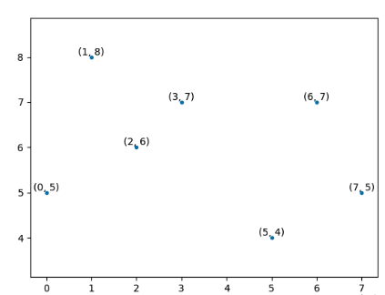

   - 按照 x 轴（即第一个维度），找出结点，即 x 方向的中间值，所对应结点是 $$(3,7)$$ ，如下图所示，将数据分为了左右两部分。

     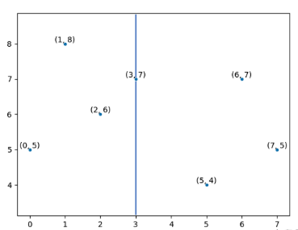

   - 按照 y 轴（第二个维度），分别在上图左右两部分，找出结点，即 y 方向的中间值，所对应结点是 $$(2,6)$$ 和 $$(7,5)$$ 。如下图所示。

     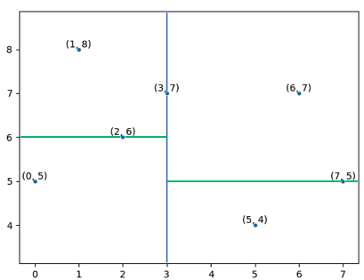

   - 再回到 x 轴，将上图进行划分，最终得到如下结果：

     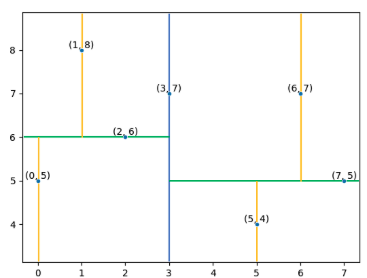

   经过上述过程之后，最终上图中黄色线上的点构成了二叉树上的叶结点，并得到如下图所示的二维二叉树。

   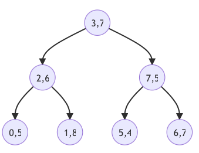

   以上通过维度的交替构建 KD-Tree，只是一种方法。此外，还可以通过**最大方差**法构建，即计算各个维度的方差，选择方差最大的维度进行划分。显然，用最大方差法构建，比较适合于各个维度上数据方差相差较大的情况。

   构建了 KD-Tree 之后，查找数据点的最近邻居，假设 $$\pmb{p}=(5, 5.5)$$ ：

   - 计算 $$\pmb{p}$$ 与根结点 $$(3,7)$$ 的距离 $$d_1=\sqrt{(5-3)^2+(5.5-7)^2}=2.5$$ ，并且 $$p_x=5\gt3$$ ，进入右子树。如下图所示，即二分法，进入右侧区域。

     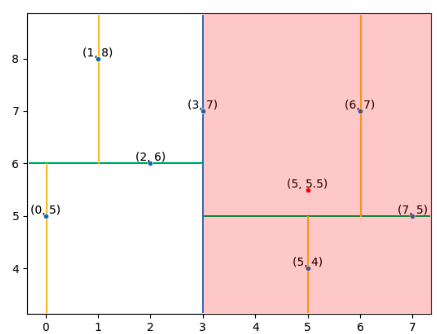

   - 计算 $$\pmb{p}$$ 与结点 $$(7,5)$$ 的距离 $$d_2=\sqrt{(5-7)^2+(5.5-5)^2}=2.06\lt d_1$$ ，并且 $$p_y=5.5\gt5$$ ，进入右子树。如下图所示。

       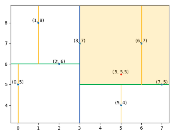

   - 计算 $$\pmb{p}$$ 与根结点 $$(6,7)$$ 的距离 $$d_3=\sqrt{(5-6)^2+(5.5-7)^2}=1.8\lt d_2$$ 。此时已经到了叶结点。如下图所示，当前找到的最近邻的点是 $$(6,7)$$ 。

     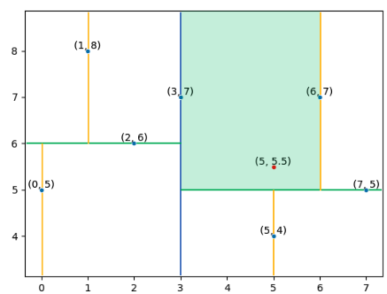

   - 但是，并不能认为最终的结果就是上述所找到的点，还要**回溯** ，看看其他区域是否有最近邻。回溯的方法是：以 $$\pmb{p}$$ 为圆心，以上面所得 $$d_3$$ 为半径画圆。如下图所示。圆与过 $$(7,5)$$ 点的线相交，即要进入到另外一侧搜索，次计算 $$\pmb{p}$$ 与左子树的点 $$(5,4)$$ 之间的距离 $$d_4=\sqrt{(5-5)^2+(5.5-4)^2}=1.5\lt d_3$$ 。

     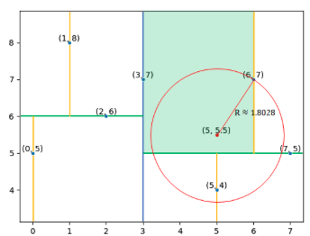

   - 继续回溯，以 $$\pmb{p}$$ 为圆心，以上面所得 $$d_4$$ 为半径画圆。如下图所示。此时圆不再与其他分割线有焦点，因此认为 $$(5,4)$$ 是点 $$\pmb{p}$$ 的最近邻。

     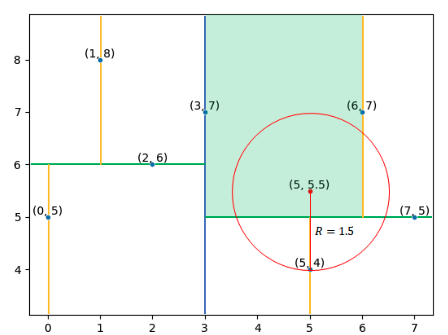

在 scikit-learn 中提供了实现上述 KD-Tree 的方法。

```python
from sklearn.neighbors import KDTree
import numpy as np
# 创建上面演示的数据集
X = np.array([[3,7], [2,6], [7,5], [0,5], [1,8], [5,4], [6,7]])
tree = KDTree(X)  # k=1
dist, ind = tree.query([[5,5.5]], k=1)

# dist # 最近邻的距离
## array([[1.5]])
#ind   # 最近邻的索引
##array([[5]])
```

上述使用的 `KDTree` ，不仅可以找出最近邻（k=1），也可以根据指定的 k 值，找出任意个数的近邻。

KD-Tree 算法的平均的时间复杂度为 $$O(\log N)$$ ，其中 $$N$$ 是样本数。KD-Tree 适合 $$N$$ 远大于维度（即 KD 中的 K）的情形，如果样本数量和维度接近，则搜索效率近似于线性扫描。

### Ball-Tree

Ball-Tree 也是构造二叉树。

以数据 $$X=\{[1,2], [5,3], [7,9], [1,6], [9,2], [8,4], [4,4], [5,7]\}$$ 为例$$^{[4]}$$。

1. 将所有数据点绘制到坐标系中，并找出最小外接圆，即用一个最小的圆，把所有点都包含在内。也就是要找到圆心 $$O_a$$

2. 然后找出所有数据点之间，相距最远的两个点，并根据其他点与这两个点的距离，将所有的点划分为两类。并进一步找出分别涵盖这两个类别数据点的最小外接圆，分别用 $$O_b$$ 和 $$O_c$$ 表示。

3. 在上述两个圆内，再次重复之前的步骤，不断找到更小的圆。最终效果如下图所示：

   

   这样就构造了 Ball-Tree 。

搜索方法：

- 假设圆 $$O_x$$ 的半径是 $$r_x$$ 。

- 有数据点 $$\pmb{p}$$ ，查找范围用 $$r_p$$ 表示，即一个以 $$\pmb{p}$$ 为圆心，以 $$r_p$$ 为半径的圆。计算 $$\pmb{p}$$ 与圆心 $$O_x$$ 的距离 $$L$$ ，根据 $$L$$ 与 $$r_x+r_p$$ 的关系判断两个圆是否相交。

  - 如果相交，则向下搜索

  - 如果不相交，则回到上一结点（直到根结点），再转到另外一侧。如下图。直到没有任何相交的圆时，即不能继续搜索，则得到了最近邻结点。

    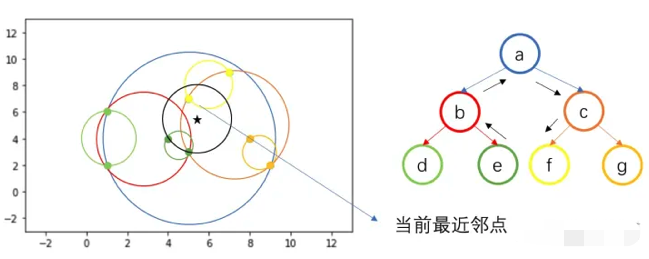

如果使用 scikit-learn 中的 `BALLTree` 模型，可以这样实现：

```python
>>> from sklearn.neighbors import BallTree
# X 是前面所创建的数组 X = np.array([[3,7], [2,6], [7,5], [0,5], [1,8], [5,4], [6,7]])
>>> tree = BallTree(X)   
>>> dist, ind = tree.query([[5, 5.5]], k=1)
>>> dist
array([[1.5]])
>>> ind
array([[5]])
```

与之前结果一致。

如果要搜索多个近邻，修改 `tree.query()` 中的参数 `k` 的值即可。

## 分类和回归

找到了近邻之后，并没有结束。找近邻的目的是什么：近朱者赤近墨者黑。如果邻居数据是有标签的，就可以根据邻居通过分类和回归算法对新的数据进行预测。

### 一个案例

假设准备租房，正好你的同事告诉你，他的邻居打算出租他的房子（记作房子 H），并且现在他还没有在任何地方把出租信息发布出去，也就是不知道准确的租金。这种情况下，是否能估算出该房间的租金？

首先了解一下同事的房子租金，假设是 1200元/月。H 的租金，应该也在这个数字左右。但是，H 和同事的房子并不完全相同（比如朝向、面积、装修和家居等），因此，还应该找一些其他数据。

通过查询，在于 H 的同一个小区内且楼层一样，还有四个房子，出租的租金分别是 1,200 元、1,210 元、1,210 元和 1,215 元。

另外， 还有其他位于同一楼层但在不同小区的，租金分别为 1,400 元、1,430 元、1,500 元和 1,470 元。

根据上面的信息，估计 H 的租金，会更接近多少？ 1,210 元。

这就是 K 近邻算法的基本思路！它根据新数据与现有数据的接近程度对新数据进行分类或回归。

### 基本概念

在上述案例中，已经知道每间房子的租金，也就是数据是有标签的，或者被标注的，因此 KNN 是一种**监督学习**算法。

租金，是连续值，也就是 KNN 用于**回归**问题。

如果根据租金进一步将房子分为不同的等级，这时候就有了离散型的标签，那么，如果预测要租的房子术语哪个等级，就是用 KNN 进行**分类**。

在已知的房子和租金数据中，还有可能某些房子的租金跟其他的差别太大，如果把每个房子都看做一个数据点，那么租金太高或太低的房子与其他房子之间，距离就会太远，这时可以用 KNN **检测异常值**。

KNN 是非参数的学习算法，即不对基础数据进行任何假设。在现实世界中，多数数据并没有严格遵循某种理论假设，比如之前提到过的数据符合某种概率分布。

KNN 的基本工作机制，可以概括为$$^{[2]}$$：

- 给定测试样本，基于某种距离度量找出训练集中与其最靠近的 K 个训练样本
- 基于这 K 个“邻居”样本的信息进行预测
  - 分类问题：“投票法”，即选择这 K 个样本中出现最多的类别标记作为预测结果
  - 回归问题：“平均法”，即将 K 个样本的实值输出标记的平均值作为预测结果；还可以基于距离远近进行加权平均或加权投票，距离越近的样本权重越大。

KNN 算法中最重要的是计算一个新的数据点（待预测）与其他训练集数据点之间的距离$$^{[1]}$$：

- 闵可夫斯基距离（Minkowski）
- 欧几里得距离（Euclidean）
- 曼哈顿距离（Manhattan）

### k 近邻回归

以回归任务为例，假设有下图所示的一些数据点：

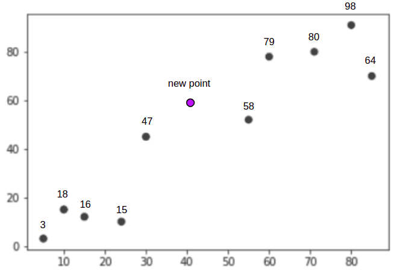

每个点旁边的数字，表示它的标签，是连续值（此处其实是该点所对应向量的长度）。预测点 `new point` 的标签是多少？

使用 KNN 算法，通过计算各点与 `new point` 点的距离，若令 K=3，即选在与 `new point` 最近的 3 个数据点，如下图所示：

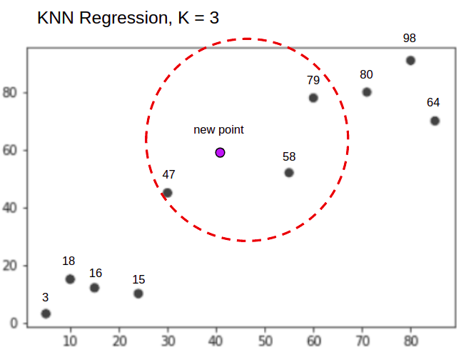

使用“平均法”，则：

$$new\_point=\frac{w\times47+w\times58+w\times79}{3}$$

其中 $$w$$ 是距离权重，若令 $$w=1$$ ，则 $$new\_point=61.33$$

Scikit-learn 中提供了实现 K 近邻回归的模型

```
class sklearn.neighbors.KNeighborsRegressor(n_neighbors=5, *, weights='uniform', algorithm='auto', leaf_size=30, p=2, metric='minkowski', metric_params=None, n_jobs=None)
```

- `n_neighbors`：指定近邻的数量，即 K 值

- `weights`：指定投票权重类型，默认是 `uniform` 。

  - `uniform`：所有“邻居”的权重相同。
  - `distance`：权重与距离成反比，越近的“邻居”对待估计数据点有更大的影响。
  - `[callable]`：用户定义的函数，接受距离数组，返回同样形状的权重数组。

- `algorithm`：指定计算近邻的算法，默认值是 `auto`，即自动选择最合适的算法，其它值：

  - `ball_tree`：使用 BallTree 算法
  - `kd_tree` ：使用 KDTree 算法
  - `brute` ：使用暴力搜索法
- `leaf_size` ：指定 BallTree 或者 KDTree 的叶结点数量。它影响数的构建和查询速度
- `metric`：默认值 `'minkowski'` ，指定距离的度量。
- `p` ：在 `metric='minkowski'` 时，`p=1` 为曼哈顿距离；`p=2` 为欧几里得距离。

### 案例1

1. 导入数据

```python
from sklearn.datasets import load_boston
from sklearn.model_selection import train_test_split

X, y = load_boston(return_X_y=True)
train_data, test_data, train_target, test_target = train_test_split(X, y, test_size=0.25)
print(train_data.shape)
print(test_data.shape)
print(train_target.shape)
print(test_target.shape)
```

2. 训练

```python
from sklearn.neighbors import KNeighborsRegressor

neigh = KNeighborsRegressor(n_neighbors=5)
neigh.fit(train_data, train_target)

neigh.score(test_data, test_target)
```


### K 近邻分类

以分类任务为例，如下图所示，有红色（red）和紫色（purple）两个类别的数据。

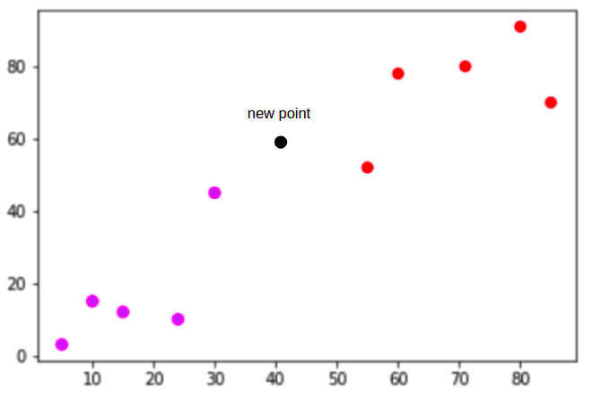

其中有一个点 `new point` ，判断它属于哪个类别？

还是先计算各点与 `new point` 之间的距离，然后令 K=3，即选择 3 个近邻的点，如下图所示：

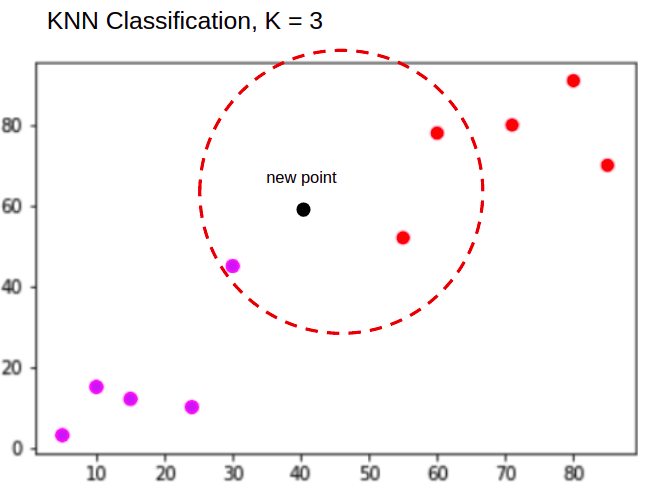

使用“投票法”，在上图 3 个点中，有两个是红色的，所以，`new point` 是红色的。

由上述示例可以体会到，K 近邻学习的所谓训练，就是把样本保存起来，训练时间开销为零，当有新的测试数据之后再进行处理。这种学习称为“积极学习”或“懒惰学习”（lazy learning）。与之对应的，就是在训练阶段要对样本进行学习处理，比如线性回归、贝叶斯分类等，称为“消极学习”或“急切学习”（eager learning）。$$^{[2]}$$

以 scikit-learn 的 KNN 分类算法为例：

```python
class sklearn.neighbors.KNeighborsClassifier(n_neighbors=5, *, weights='uniform', algorithm='auto', leaf_size=30, p=2, metric='minkowski', metric_params=None, n_jobs=None)
```

参数含义同前。

### 案例2

1. 加载数据

   ```python
   from sklearn import datasets
   
   #Load dataset
   wine = datasets.load_wine()
   
   # 显示数据集概况
   print(wine.DESCR)
   ```

   ```python
   wine.data[:5]
   ```

   ```python
   # 查看标签
   wine.target
   ```

2. 划分数据集

   ```python
   from sklearn.model_selection import train_test_split
   
   X_train, X_test, y_train, y_test = train_test_split(wine.data, wine.target, test_size=0.3) 
   ```

3. 训练模型

   ```python
   from sklearn.neighbors import KNeighborsClassifier
   
   knn = KNeighborsClassifier(n_neighbors=5)  # K=5
   
   knn.fit(X_train, y_train)
   
   y_pred = knn.predict(X_test)
   ```

   ```python
   # 评估
   from sklearn import metrics
   
   print("Accuracy:",metrics.accuracy_score(y_test, y_pred))
   # 0.7222
   ```

   更改 K 的值为 7

   ```python
   knn = KNeighborsClassifier(n_neighbors=7)  # K=7
   knn.fit(X_train, y_train)
   y_pred = knn.predict(X_test)
   print("Accuracy:",metrics.accuracy_score(y_test, y_pred))
   # 0.704
   ```

对于用于 KNN 算法的数据，应该都是量化的数值。另外，对数据应该进行标准差标准化处理，例如上述使用的数据集，各特征方差相差比较大。同样是 K=7，如果做规范化处理，则会提高拟合优度的值。

```python
from sklearn.preprocessing import StandardScaler

scaler = StandardScaler()
scaler.fit(X_train)

X_train = scaler.transform(X_train)
X_test = scaler.transform(X_test)
```

```python
knn.fit(X_train, y_train)    # K=7

y_pred = knn.predict(X_test)
print("Accuracy:",metrics.accuracy_score(y_test, y_pred))

# 0.981
```

## 评价

KNN 是一种易于掌握的算法。是一种非参数模型。 

它需要大量内存来存储整个训练数据集以进行预测。

KNN 对于维数大的数据集并不理想。


## 参考资料

[1] 齐伟. 机器学习数学基础[M]. 北京:电子工业出版社, 2022:38-45.

[2] 周志华. 机器学习[M]. 北京:清华大学出版社, 2018:225.

[3] KD-Tree 详解：从原理到编程实现[DB/OL]. https://blog.csdn.net/qq_42688495/article/details/124049811 ,2022.10.10.

[4] KNN 里面的两种优化的数据结构[DB/OL]. https://www.zhihu.com/question/30957691 ,2022.10.10.
