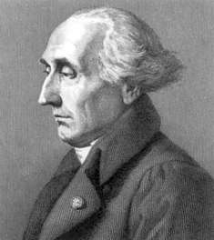

# 拉格朗日乘数法

*打开本页，如果没有显示公式，请刷新页面。*

在数学中的最优化问题中，拉格朗日乘数法（以数学家约瑟夫·拉格朗日命名）是一种寻找多元函数在其变量受到一个或多个条件的约束时的极值的方法。

## 拉格朗日$$^{[1]}$$

约瑟夫·拉格朗日伯爵（法語：Joseph Lagrange，1736年1月25日－1813年4月10日），法国籍意大利裔数学家和天文学家。拉格朗日曾为普鲁士的腓特烈大帝在柏林工作了20年，被腓特烈大帝称做「欧洲最伟大的数学家」，后受法国国王路易十六的邀请定居巴黎直至去世。拉格朗日一生才华横溢，在数学、物理和天文等领域做出了很多重大的贡献。他的成就包括著名的拉格朗日中值定理，创立了拉格朗日力学等等。

拉格朗日是18世纪一位十分重要的科学家，在数学、力学和天文学三个学科中都有历史性的重大贡献，但他主要是数学家。他最突出的贡献是在把数学分析的基础脱离几何与力学方面起了决定性的作用，使数学的独立性更为清楚，而不仅是其他学科的工具。同时在使天文学力学化、力学分析化上也起了历史性作用，促使力学和天文学（天体力学）更深入发展。在他的时代，分析学等分支刚刚起步，欠缺严密性和标准形式，但这不足以妨碍他取得大量的成果。 

拉格朗日的《分析力学》（Mécanique analytique），是艾萨克·牛顿之后的一部重要的经典力学著作。书中运用变分原理和分析的方法，建立起完整和谐的力学体系，使力学分析化。他在序言中宣称：力学已经成为分析的一个分支。1782年给拉普拉斯的信中他说：“我几乎写完《分析力学论述》（Traité de Mécanique Analytique），但不知何时出版”最终，经过拉普拉斯等多人评审，该书于1788年在巴黎出版。

法国18世纪后期到19世纪初数学界著名的三个人物：拉格朗日、拉普拉斯（Pierre-Simon marquis de Laplace）和勒讓德（Adrien-Marie Legendre）。因为他们三位的姓氏的第一个字母为「L」，又生活在同一时代，所以人们称他们为「三L」。

> 一个人的贡献和他的自负严格地成反比，这似乎是品行上的一个公理。
>
> ——拉格朗日

## 拉格朗日乘数法

### 局部极值

设目标函数 $$f(x_1,\cdots,x_n)$$ 为定义于 $$\mathbb{R}^n$$ 的连续可导实函数，$$n$$ 维实向量 $$\pmb{x}=\begin{bmatrix}x_1\\\vdots\\x_n\end{bmatrix}$$ 。设 $$\pmb{\epsilon} = \begin{bmatrix}\epsilon_1\\\vdots\\\epsilon_n\end{bmatrix}$$ 为一个微小向量，则 $$f(\pmb{x}+\pmb{\epsilon})$$ 在 $$\pmb{x}$$ 的泰勒展开：

$$f(\pmb{x}+\pmb{\epsilon}) = f(\pmb{x}) +\sum_{i=1}^n\frac{\partial f}{\partial x_i}(\pmb{x})\epsilon_i + \frac{1}{2}\sum_{i=1}^n\sum_{j=1}^n\frac{\partial^2 f}{\partial x_i \partial x_j}(\pmb{x})\epsilon_i\epsilon_j + \cdots \tag{2.1}$$

用梯度表示 $$\frac{\partial f}{\partial x_i}$$ ，即：

$$\nabla f = \frac{\partial f}{\partial\pmb{x}}=\begin{bmatrix}\frac{\partial f}{\partial x_1}\\\vdots\\\frac{\partial f}{\partial x_n}\end{bmatrix}$$

并以 $$\pmb{H}=[h_{ij}]_{n\times n}$$ 表示黑塞矩阵（参见《机器学习数学基础》第4章4.2.3节）。

则（2.1）式可以表示为：

$$f(\pmb{x}+\pmb{\epsilon}) = f(\pmb{x}) + \nabla f(\pmb{x})^T\pmb{\epsilon} + \frac{1}{2}\pmb{\epsilon}^T\pmb{H}(\pmb{x})\pmb{\epsilon} + \pmb{O}(\begin{Vmatrix}\pmb{\epsilon}\end{Vmatrix}^3) \tag{2.2}$$

其中 $$\pmb{O}(\begin{Vmatrix}\pmb{\epsilon}\end{Vmatrix}^3)$$ 代表误差。

因为 $$\pmb{\epsilon}$$ 是微小向量，所以忽略二次以上的所有项，故：

$$f(\pmb{x}+\pmb{\epsilon}) \approx f(\pmb{x}) + \nabla f(\pmb{x})^T\pmb{\epsilon} \tag{2.3}$$

设 $$\begin{Vmatrix}\pmb{\epsilon}\end{Vmatrix}$$ 固定，若 $$\pmb{\epsilon} = k\nabla f(\pmb{x})$$ 且 $$k\gt 0$$ ，则 $$\nabla f(\pmb{x})^T\pmb{\epsilon}$$ 有最大值。即梯度 $$\nabla f(\pmb{x})$$ 指向目标函数 $$f$$ 在点 $$\pmb{x}$$ 的最陡上升方向。

如果 $$\nabla f(\pmb{x^*})=\pmb{0}$$ ，称 $$\pmb{x^*}$$ 点是一个驻点（stationary point） 。

显然，驻点即为 $$f$$ 的极值（极大或者极小）存在的必要条件。

- 若 $$\pmb{H}(\pmb{x}^*)$$ 是正定的，则 $$\pmb{x}^*$$ 为一个局部极小值；
- 若 $$\pmb{H}(\pmb{x}^*)$$ 是负定的，则 $$\pmb{x}^*$$ 为一个局部极大值；
- 若 $$\pmb{H}(\pmb{x}^*)$$ 是未定的，则 $$\pmb{x}^*$$ 为一个鞍点。

### 单一约束条件$$^{[2]}$$

$$\begin{split}minimize \quad &f(\pmb{x})\\ subject\quad to \quad&g(\pmb{x})=0\end{split}$$

其中 $$\pmb{x}\in\mathbb{R}^n$$ 。

约束条件 $$g(\pmb{x})=0$$ 可认为是 $$\mathbb{R}^n$$ 上的一个超曲面。设 $$g(\pmb{x})$$ 是连续可导函数，对于超曲面上的一点 $$\pmb{x}$$ ，仿照（2.2）式的泰勒展开式：

$$g(\pmb{x}+\pmb{\epsilon}) = g(\pmb{x}) + \nabla g(\pmb{x})^T\pmb{\epsilon} + \pmb{O}(\begin{Vmatrix}\pmb{\epsilon}\end{Vmatrix}^2) \tag{2.4}$$

如果 $$\pmb{x}+\pmb{\epsilon}$$ 也在此超平面上，即 $$g(\pmb{x}+\pmb{\epsilon})=g(\pmb{x})=0$$ ，忽略微小误差，可得：$$\nabla g(\pmb{x})^T\pmb{\epsilon}=0$$ 。

下图以 $$\mathbb{R}^3$$ 为例，$$\pmb{\epsilon}$$ 位于点 $$\pmb{x}$$ 的切平面，$$\nabla g(\pmb{x})^T\pmb{\epsilon}=0$$ 表示 $$\nabla g(\pmb{x})$$ 是超曲面 $$g(\pmb{x})=0$$ 于点 $$\pmb{x}$$ 的法向量。因此，过点 $$\pmb{x}$$ 的切平面即为法向量 $$\nabla g(\pmb{x})$$ 的正交补，记作 $$span\{\nabla g(\pmb{x})\}^{\bot}$$ 。

根据《机器学习数学基础》第3章3.4.4节对正交投影以及[直和与投影](./directsum.html)的有关知识，可以计算梯度 $$\nabla f$$ 于切平面的正交投影。

$$\nabla\hat{f}=\nabla{f} - \left(\frac{\nabla{f}^T\nabla{g}}{\begin{Vmatrix}\nabla{g}\end{Vmatrix}^2}\right)\nabla{g} \tag{2.5}$$

当 $$\nabla\hat{f}=0$$ 时有局部最小值，故存在一个标量 $$\lambda$$ ，使得 $$\nabla{f}=-\lambda\nabla{g}$$ 。

定义**拉格朗日函数**：

$$L(\pmb{x},\lambda)=f(\pmb{x})+\lambda g(\pmb{x}) \tag{2.6}$$

存在局部极小值的必要条件：

$$\nabla_{\pmb{x}}L = \frac{\partial L}{\partial{\pmb{x}}}=\nabla{f}+\lambda\nabla{g}=\pmb{0} \tag{2.6}$$

$$\nabla_{\lambda}L=\frac{\partial L}{\partial \lambda}=g(\pmb{x})=0 \tag{2.7}$$

（2.6）式为定常方程，（2.7）式为约束条件。

由以上两式可以得到拉格朗日函数 $$L(\pmb{x},\lambda)$$ 的驻点 $$\pmb{x}^*$$ 以及 $$\lambda$$ 的值。若 $$\lambda=0$$ ，则 $$\nabla f(\pmb{x}^*)=\pmb{0}$$ ，这时目标函数 $$f$$ 的驻点 $$\pmb{x}^*$$ 同时满足约束条件 $$g(\pmb{x}^*)=0$$ 。

### 示例

$$\begin{split}x_1,x_2 \in\mathbb{R}^2\\minimize \quad &x_1^2+x_2^2\\subject\quad to \quad &x_1+x_2=1\end{split}$$

**解**

拉格朗日函数：

$$L(x_1,x_2,\lambda)=x_1^2+x_2^2+\lambda(x_1+x_2-1)$$

其中，$$\lambda$$ 是拉格朗日乘数，则：

$$\begin{split}\frac{\partial L}{\partial x_1}=2x_1+\lambda=0\\\frac{\partial L}{\partial x_2}=2x_2+\lambda=0\\\frac{\partial L}{\partial\lambda}=x_1+x_2-1=0\end{split}$$

解得一个驻点：$$(x_1^*, x_2^*）=(\frac{1}{2},\frac{1}{2})$$ ，即为最小值，对应的 $$\lambda=-1$$

## 参考文献

[1]. [维基百科：约瑟夫·拉格朗日](https://zh.wikipedia.org/wiki/%E7%BA%A6%E7%91%9F%E5%A4%AB%C2%B7%E6%8B%89%E6%A0%BC%E6%9C%97%E6%97%A5)

[2]. [https://ccjou.wordpress.com/2012/05/30/lagrange-乘數法/](https://ccjou.wordpress.com/2012/05/30/lagrange-%E4%B9%98%E6%95%B8%E6%B3%95/)

