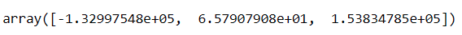

# 机器学习的线性代数基础概念

*打开本页，如果没有显示公式，请刷新页面。*

此处简要罗列在机器学习中所用到的线性代数基础概念，供快速学习参考。相关内容的详细讲授，均以发表在《机器学习数学基础》一书中，请参阅。

## 矩阵

线性代数的基础概念，常用于线性方程组求解和线性映射中。

## 向量

是 $$n\times1$$ 的矩阵，即只有一列。

## 矩阵乘法

两个矩阵相乘，可以认为是第一个矩阵的行与第二个矩阵的列分别点积。

## 矩阵转置

设 $$\pmb{A}\in\mathbb{R}^{m\times n}$$ ， $$\pmb{B}\in\mathbb{R}^{m\times n}$$ ，其中 $$b_{ij}=a_{ji}$$ ，则称两个矩阵互为转置矩阵，即 $$\pmb{B}=\pmb{A}^{\rm{T}}$$

## 逆矩阵

对于方阵 $$\pmb{A}\in\mathbb{R}^{n\times n}$$ ，有方阵 $$\pmb{B}\in\mathbb{R}^{n\times n}$$ ，使得 $$\pmb{AB}=\pmb{BA}=\pmb{I}_n$$ 成立，则 $$\pmb{A}$$ 称为可逆矩阵，记作 $$\pmb{A}^{-1}$$ 。

## 正交矩阵

对于方阵 $$\pmb{A}\in\mathbb{R}^{n\times n}$$ ，若满足 $$\pmb{AA}^{\rm{T}}=\pmb{I}_n=\pmb{A}^{\rm{T}}\pmb{A}$$ （其中 $$\pmb{A}^{-1}=\pmb{A}^{\rm{T}}$$ ），且列是单位向量，则称之为单位正交矩阵。

## 对角矩阵

对于方阵 $$\pmb{A}\in\mathbb{R}^{n\times n}$$ ，当元素满足：

$$a_{ij}\begin{cases}=0，(i\ne j)\\\ne 0，(i=j)\end{cases}$$

则此矩阵是对角矩阵。

## 正规方程

利用最小二乘法，可以得到如下解：

$$\pmb{\theta}=(\pmb{X}^{\rm{T}}\pmb{X})^{-1}\pmb{X}^{\rm{T}}\pmb{y}$$

用 Python 实现：

```python
import numpy as np Features
x = np.array([[2, 1834, 1],[3, 1534, 2],[2, 962, 3]])
y = [8500, 9600, 258800]

# x 转置
transpose_x = x.transpose()

# x 转置之后与 x 相乘
multi_transpose_x_to_x = np.dot(transpose_x, x)

# 求解
inverse_of_multi_transpose_x_to_x = np.linalg.inv(multi_transpose_x_to_x)

multiplication_transposed_x_y = np.dot(transpose_x, y)

theta = np.dot(inverse_of_multi_transpose_x_to_x, multiplication_transposed_x_y)

theta
```

输出：



## 线性方程和线性回归

例如（以下示例中的数据源：https://github.com/towardsai/tutorials/blob/master/linear-algebra-for-ml-and-deep-learning/house_price.csv）

```python
import pandas as pd
import numpy as np

df = pd.read_csv('house_price.csv')

print(df.head())

def get_mean(value):
    total = sum(value)
    length = len(value)
    mean = total/length
    return mean

def get_variance(value):
    mean = get_mean(value)
    mean_difference_square = [pow((item - mean), 2) for item in value]
    variance = sum(mean_difference_square)/float(len(value)-1)
    return variance

def get_covariance(value1, value2):
    value1_mean = get_mean(value1)
    value2_mean = get_mean(value2)
    values_size = len(value1)
    covariance = 0.0
    for i in range(0, values_size):
        covariance += (value1[i] - value1_mean) * (value2[i] - value2_mean)
        
    return covariance / float(values_size - 1)

def linear_regression(df):

    X = df['square_feet']
    Y = df['price']
    m = len(X)

    square_feet_mean = get_mean(X)
    price_mean = get_mean(Y)
    
    #variance of X
    square_feet_variance = get_variance(X)
    price_variance = get_variance(Y)
    
    covariance_of_price_and_square_feet = get_covariance(X, Y)
    w1 = covariance_of_price_and_square_feet / float(square_feet_variance)
    w0 = price_mean - w1 * square_feet_mean
    
    # prediction --> Linear Equation
    prediction = w0 + w1 * X
    
    df['price (prediction)'] = prediction
    return df['price (prediction)']


    predicted = linear_regression(df)

    print(predicted)
```

## 范数

向量的范数，就是向量的长度或大小。通项为：

$$\begin{Vmatrix}\pmb{x}\end{Vmatrix}=\left(\sum_{i=1}^n|\pmb{x}_i|^p\right)^{1/p}$$

其中：$$p$$ 即为范数的阶，例如，

- $$p=1$$ ，$$\begin{Vmatrix}\pmb{x}\end{Vmatrix}_1=\left(\sum_{i=1}^n|\pmb{x}_i|\right)$$ 即为 $$l_1$$ 范数，也称为曼哈顿范数。用于机器学习正则化之中，称为 Lasso 正则化，或者 L1 正则化。
- $$p=2$$ ，$$\begin{Vmatrix}\pmb{x}\end{Vmatrix}_2=\left(\sum_{i=1}^n|\pmb{x}_i|^2\right)^{1/2}$$ 即为 $$l_2$$ 范数，也称为欧几里得范数。用于机器学习正则化之中，称为 Ridge ，或者 L2 正则化，一般表达式为 $$\frac{\lambda}{2}\begin{Vmatrix}\pmb{x}\end{Vmatrix}^2_2=\frac{\lambda}{2}\sum_{i=1}^n\pmb{x}_i^2$$

## 特征抽取和特征选择

所谓特征抽取，即根据原特征，映射一组新的特征，且能代表原特征的主要属性。

所谓特征选择，即建立一个代表原特征的子集。

特征抽取的主要方法：

- 主成分分析（Principal Componet Analysis, PCA）
- 线性判别分析（Linear Discriminant Analysis, LDA）

## 协方差矩阵

方差定义：

$$\sigma^2=\frac{1}{n}\sum_{i=1}^n(x_i-\overline{x})^2=\frac{1}{n}\sum_{i=1}^n(x_i-\overline{x})(x_i-\overline{x})$$

协方差定义：

$${\rm{Cov}}(x,y)=\frac{1}{n}\sum_{i=1}^n(x_i-\overline{x})(y_i-\overline{y})$$

协方差矩阵：

$$\begin{split}{\rm{Cov}}(\Sigma)&=\begin{bmatrix}Cov(x_1,x_1) &Cov(x_1,x_2)&\cdots&Cov(x_1,x_m)\\Cov(x_2,x_1) &Cov(x_2,x_2)&\cdots&Cov(x_2,x_m)\\\vdots&\vdots&\ddots&\vdots\\Cov(x_m,x_1) &Cov(x_m,x_2)&\cdots&Cov(x_m,x_m)\end{bmatrix}\\&=\frac{1}{n}(\pmb{X}-\overline{\pmb{X}})(\pmb{X}-\overline{\pmb{X}})^{\rm{T}}\end{split}$$

其中，$$\pmb{X}=\begin{bmatrix}x_1\\x_2\\\vdots\\x_n\end{bmatrix}$$

## 特征值和特征向量

详见《机器学习数学基础》

## 正交

向量 $$\pmb{v}$$ 和 $$\pmb{w}$$ 正交，则 $$\pmb{v}\cdot\pmb{w}=0$$ 。反之亦然。

