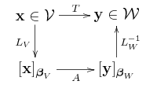

# 线性映射

《机器学习数学基础》的第1章1.3.2节、第2章2.2.3节均介绍了与线性映射、线性变换有关的内容，并指出矩阵就是两个向量空间的线性变换的表达形式。

本文以一个示例，讲解如何理解线性变换，并且以此进一步理解最小二乘法。

## 1. 以示例理解

以参考文献 [1] 中提供的示例，说明矩阵与线性变换的关系。

设向量空间 $\mathbb{P}_2$ 是二次函数 $p(t)=a_0+a_1t+a_2t^2$ 的集合，基为 $\pmb{\beta}=[\pmb{v}_1,\pmb{v}_2,\pmb{v}_3]$ ，向量 $\pmb{v}_j=t^{j-1},(j=1,2,3)$ 。

$p(t)$ 可以用 $\pmb{\beta}$ 表示：

$$
p(t)=a_0\pmb{v}_1+a_1\pmb{v}_2+a_2\pmb{v}_3\tag{1.1}
$$

则其坐标向量为：

$$
[p]_{\pmb{\beta}}=\begin{bmatrix}a_0\\a_1\\a_2\end{bmatrix}
$$

假设有如下线性变换：

$$
q(t)=\pmb{T}(p(t))=p(t+1) \tag{1.2}
$$

根据线性变换的加法和数量乘法封闭性，可得：

$$
\begin{split}q(t)&=T(a_0\pmb{v}_1+a_1\pmb{v}_2+a_3\pmb{v}_3)\\&=a_0\pmb{T}(\pmb{v}_1)+a_1\pmb{T}(\pmb{v}_2)+a_2\pmb{T}(\pmb{v}_3)\end{split}\tag{1.3}
$$

上式可以理解为：向量 $\pmb{v}_j$ 经 $\pmb{T}$ 的映射后结果为 $\pmb{T}(\pmb{v}_j)$ （此结果称为像），即：

$$
\begin{split}&\pmb{T}(\pmb{v}_1)=\pmb{T}(t^0)=(1+t)^0=1=\pmb{v}_1\\&\pmb{T}(\pmb{v}_2)=\pmb{T}(t^1)=(1+t)^1=\pmb{v}_1+\pmb{v}_2\\&\pmb{T}(\pmb{v}_3)=\pmb{T}(t^2)=(1+t)^2=1+2t+t^2=\pmb{v}_1+2\pmb{v}_2+\pmb{v}_3\end{split} \tag{1.4}
$$
 

上述系数可以写成：

$$
[\pmb{T}(\pmb{\beta})]=\begin{bmatrix}1&0&0\\1&1&0\\1&2&1\end{bmatrix}\tag{1.5}
$$

将（1.4）代入（1.3）式，得：

$$
q(t)=a_0\pmb{v}_1+a_1(\pmb{v}_1+\pmb{v}_2)+a_2(\pmb{v}_1+2\pmb{v}_2+\pmb{v}_3)=(a_0+a_1+a_2)\pmb{v}_1+(a_1+2a_2)\pmb{v}_2+a_2\pmb{v}_3
$$

所以 $q(t)$ 的坐标向量为：

$$
[q]_{\pmb{\beta}}=\begin{bmatrix}a_0+a_1+a_2\\a_1+2a_2\\a_2\end{bmatrix}
$$

可以通过“矩阵乘法”将 $[q]_{\pmb{\beta}}$ 和 $[p]_{\pmb{\beta}}$ 联系起来：

$$
[q]_{\pmb{\beta}}=\begin{bmatrix}1&1&1\\0&1&2\\0&0&1\end{bmatrix}\begin{bmatrix}a_0\\a_1\\a_2\end{bmatrix}=[\pmb{T}]_{\pmb{\beta}}[p]_{\pmb{\beta}}\tag{1.6}
$$

其中 $[\pmb{T}]_{\pmb{\beta}}$ 称为线性变换 $\pmb{T}$ 基于基 $\pmb{\beta}$ 的**表示矩阵**。

对比（1.5）和（1.6）式，发现 $[\pmb{T}]_{\pmb{\beta}}$ 和 $[\pmb{T}(\pmb{\beta})]$ 互为转置矩阵。

## 2. 线性变换与矩阵

线性变换 $\pmb{T}:\mathbb{V}\to\mathbb{W},\dim\mathbb{V}=n,\dim\mathbb{W}=m$ ，$\pmb{\beta}_{\mathbb{V}}=[\pmb{v}_1,\cdots,\pmb{v}_n]$ 是向量空间 $\mathbb{V}$ 的基，$\pmb{\beta}_{\mathbb{W}}=[\pmb{w}_1,\cdots,\pmb{w}_m]$ 是向量空间 $\mathbb{W}$ 的基。

线性映射 $\pmb{y}=\pmb{T}(\pmb{x})$ 对应矩阵乘法 $[\pmb{y}]_{\pmb{\beta}_{\mathbb{W}}}=\pmb{A}[\pmb{x}]_{\pmb{\beta}_{\mathbb{V}}}$ ，其中 $m\times n$ 阶线性变换表示矩阵 $\pmb{A}$ 的第 $j$ 列即为 $\pmb{T}(\pmb{v}_j)$ 基于 $\pmb{\beta}_{\mathbb{W}}$ 的坐标向量 $[\pmb{T}(\pmb{v}_j)]_{\pmb{\beta}_{\mathbb{W}}}$ ：

$$
\pmb{A}=\begin{bmatrix}[\pmb{T}(\pmb{v}_1)]_{\pmb{\beta}_{\mathbb{W}}}&\cdots&[\pmb{T}(\pmb{v}_j)]_{\pmb{\beta}_{\mathbb{W}}}&[\pmb{T}(\pmb{v}_n)]_{\pmb{\beta}_{\mathbb{W}}}\end{bmatrix}
$$

$\pmb{T}$ 与线性变换的表示矩阵 $\pmb{A}$ 的关系，如下图所示：

图中的 $\pmb{L}_{\mathbb{V}}:\mathbb{V}\to\mathbb{R}^n,\pmb{L}_{\mathbb{W}}:\mathbb{W}\to\mathbb{R}^m$ 表示向量在对应基中的映射，即将向量分别映射为相应向量空间中的坐标（以相应的基）。

## 3. 解释最小二乘$^{[2]}$

《机器学习数学基础》第3章3.6.1节专门介绍了**正规方程**的推导（如下所示的（3.1）式，即为正规方程），并且由此引出最小二乘法。

$$
\pmb{A}^T\pmb{A}\hat{\pmb{x}}=\pmb{A}^T\pmb{b} \tag{3.1}
$$

正规方程（3.1）的解即为 $\pmb{Ax}=\pmb{b}$ 的最小二乘近似解（ $\pmb{A}$ 是 $m\times n$ 矩阵）。

如果 $\pmb{A}$ 的列向量线性无关，则 $rank\pmb{A}=n$ ，称 $\pmb{A}$ 满秩。

此时，$N(\pmb{A})=\{\pmb{0}\}$ ，行空间 $C(\pmb{A}^T)$ 充满整个 $\mathbb{R}^n$ 。

因为 $rank\pmb{A}=rank(\pmb{A}^T\pmb{A})$ ，则 $\pmb{A}^T\pmb{A}$ （ $n$ 阶方阵）是可逆的，由此可知（3.1）存在唯一的最小二乘近似解：

$$
\hat{\pmb{x}}=(\pmb{A}^T\pmb{A})^{-1}\pmb{A}^T\pmb{b} \tag{3.2}
$$

则最小误差平方的投影向量：

$$
\pmb{p}=\pmb{A}\hat{\pmb{x}}=\pmb{A}(\pmb{A}^T\pmb{A})^{-1}\pmb{A}^T\pmb{b}
$$

正交投影矩阵为：

$$
\pmb{P}=\pmb{A}(\pmb{A}^T\pmb{A})^{-1}\pmb{A}^T \tag{3.3}
$$

向量 $\pmb{b}$ 和误差 $\pmb{e}$ 的关系：

因为 $(\pmb{I}-\pmb{P})^2 = \pmb{I}-2\pmb{P}+\pmb{P}^2=\pmb{I}-2\pmb{P}+\pmb{P}=\pmb{I}-\pmb{P}$

$\pmb{I}-\pmb{P}$ 也是一个投影矩阵，且：$(\pmb{I}-\pmb{P})\pmb{b}=\pmb{b}-\pmb{Pb}=\pmb{b}-\pmb{p}=\pmb{e}$

因此，向量 $\pmb{b}$ 经 $\pmb{I}-\pmb{P}$ 正交投影至 $\pmb{e}\in\N(\pmb{A}^T)$ 。

**总结：**

从线性变换角度，理解最小二乘：

- 向量 $\pmb{b}\in\mathbb{R}^m$ 经正交投影矩阵 $\pmb{P}=\pmb{A}(\pmb{A}^T\pmb{A})^{-1}\pmb{A}^T$ 映射至列空间 $C(\pmb{A})$ 的投影向量 $\pmb{b}$ ：$\pmb{b}\overset{\pmb{P}}{\to}\pmb{p}$
- 向量 $\pmb{b}\in\mathbb{R}^m$ 经正交投影矩阵 $\pmb{I}-\pmb{P}$ 映射至左零空间 $N(\pmb{A}^T)$ 的最小误差向量 $\pmb{e}$ ： $\pmb{b}\overset{\pmb{I}-\pmb{P}}{\longrightarrow}\pmb{e}$ 
- 向量 $\pmb{b}\in\mathbb{R}^m$ 经变换矩阵 $(\pmb{A}^T\pmb{A})^{-1}\pmb{A}^T$ 映射到行空间 $C(\pmb{A}^T)$ 的最小平方近似解 $\hat{\pmb{x}}$ ：$\pmb{b}\overset{(\pmb{A}^T\pmb{A})^{-1}\pmb{A}^T}{\longrightarrow}\hat{\pmb{x}}$ 
- 最小二乘解 $\hat{\pmb{x}}$ 经矩阵 $\pmb{A}$ 映射至列空间 $C(\pmb{A})$ 的投影向量 $\pmb{p}$ ：$\hat{\pmb{x}}\overset{\pmb{A}}{\to}\pmb{p}$ 

因此，将向量 $\pmb{b}$ 映射至投影向量 $\pmb{p}$ 的正交投影矩阵 $\pmb{P}$ 可以理解为两个线性变换的复合：

$$
\pmb{b}\overset{(\pmb{A}^T\pmb{A})^{-1}\pmb{A}^T}{\longrightarrow}\hat{\pmb{x}}\overset{\pmb{A}}{\to}\pmb{p}
$$

注意，以上讨论的前提，$\pmb{A}$ 的列向量线性无关，否则 $\pmb{A}^T\pmb{A}$ 不是可逆矩阵，如果不可逆，则不存在唯一的最小二乘近似解。

## 参考文献

[1]. [https://ccjou.wordpress.com/2010/08/11/線性變換表示矩陣/](https://ccjou.wordpress.com/2010/08/11/%e7%b7%9a%e6%80%a7%e8%ae%8a%e6%8f%9b%e8%a1%a8%e7%a4%ba%e7%9f%a9%e9%99%a3/)

[2]. [https://ccjou.wordpress.com/2009/10/28//從線性變換解釋最小平方近似/](https://ccjou.wordpress.com/2009/10/28/%e5%be%9e%e7%b7%9a%e6%80%a7%e8%ae%8a%e6%8f%9b%e8%a7%a3%e9%87%8b%e6%9c%80%e5%b0%8f%e5%b9%b3%e6%96%b9%e8%bf%91%e4%bc%bc/)

