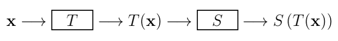
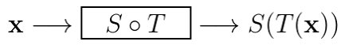

# 对矩阵乘法的深入理解

*打开本页，如果没有显示公式，请刷新页面。*

本文是对《机器学习数学基础》第2章2.1.5节矩阵乘法内容的补充和扩展。通过本节内容，在原书简要介绍矩阵乘法的基础上，能够更全面、深入理解矩阵乘法的含义。

在2.1.5节中，给出了矩阵乘法最基本的定义，令矩阵 $$\pmb{A} = (a_{ij})_{m\times r}$$ 和矩阵 $$\pmb{B}=(b_{ij})_{r\times n}$$ 相乘，定义乘积 $$\pmb{AB}$$ 中 $$(\pmb{AB})_{ij}$$ 为：

$$(\pmb{AB})_{ij}=\begin{bmatrix}a_{i1}&\cdots&a_{ir}\end{bmatrix}\begin{bmatrix}b_{1j}\\\cdots\\b_{rj}\end{bmatrix}=a_{i1}b_{1j}+\cdots+a_{1r}b_{rj}$$

这种定义的方法便于手工计算——手工计算，在计算机流行的现在，并非特别重要。所以，现在更应该深入理解矩阵乘法的数学含义，所以，再拓展如下内容。

## 以列向量作为计算单元

### 定义 $$\pmb{Ax}$$

以列向量表示矩阵 $$\pmb{A}=\begin{bmatrix}\pmb{a}_1&\cdots&\pmb{a}_n\end{bmatrix}$$ ，设一维列向量 $$\pmb{x}=\begin{bmatrix}x_1\\\vdots\\x_2\end{bmatrix}$$ 。

矩阵与向量的乘法 $$\pmb{Ax}$$ 定义为 $$\pmb{A}$$ 的列向量 $$\pmb{a}_1,\cdots, \pmb{a}_n$$ 的线性组合，$$x_1,\cdots,x_2$$ 为组合的系数或权重，即：

$$\pmb{Ax}=\begin{bmatrix}\pmb{a}_1&\cdots&\pmb{a}_n\end{bmatrix}\begin{bmatrix}x_1\\\vdots\\x_2\end{bmatrix}=\pmb{a}_1x_1+\cdots+\pmb{a}_nx_n$$

按照习惯，把标量写在向量前面（左边）：

$$\pmb{Ax}=x_1\pmb{a}_1+\cdots+x_n\pmb{a}_n \tag{1.1}$$

根据这种定义，比较容易理解线性方程与子空间、线性无关等有关概念。

**例1**

$$\pmb{Ax}=0$$ ，如果只有平凡解，即 $$\pmb{x}=0$$ ，根据（1.1）式可知，$$\pmb{A}$$ 的列向量线性无关（关于线性相关和线性无关的概念，请参阅《机器学习数学基础》第1章1.2.3节）。

**例2**

对于 $$\pmb{Ax}=\pmb{b}$$ 有解的充要条件，根据（1.1）式可知：

$$x_1\pmb{a}_1+\cdots+x_n\pmb{a}_n=\pmb{b}$$

即 $$\pmb{b}$$ 是 $$\pmb{a}_1,\cdots,\pmb{a}_n$$ 的线性组合，所以 $$\pmb{b}$$ 应该属于 $$\pmb{A}$$ 的列空间。

### 定义 $$\pmb{AB}$$

利用（1.1）式的理解，可以显示 $$T(x)=\pmb{Ax}$$ 是一个线性变换$$^{[2]}$$ 。

设线性变换 $$T:\mathbb{F}^p\to\mathbb{F}^n$$ 和 $$S:\mathbb{F}^n\to\mathbb{F}^m$$ ，将它们连接在一起，如下图所示：



其中 $$\pmb{x}\in\mathbb{F}^p, T(\pmb{x})\in\mathbb{F}^n,S(T(\pmb{x}))\in\mathbb{F}^n$$ 。用 $$S\circ T$$ 表示复合线性变换（即符合函数，参阅[函数](b-1-01.md)），即：

$$(S\circ T)(\pmb{x})=S(T(\pmb{x}))$$

可以表示为下图：



设线性变换 $$T$$ 的矩阵为 $$n\times p$$ 阶矩阵 $$B$$ ，线性变换 $$S$$ 的矩阵为 $$m\times n$$ 解矩阵 $$A$$ ，则：

$$S(T(\pmb{x}))=\pmb{A}(\pmb{Bx})$$

所以，符合线性变换 $$S\circ T$$ 的矩阵有 $$\pmb{A}$$ 和 $$\pmb{B}$$ 来决定。

若定义：$$\pmb{P}=\pmb{AB}$$ ，即矩阵乘法。

令 $$\pmb{B}$$ 的列向量为 $$\pmb{b}_1,\cdots,\pmb{b}_p$$ ，根据（1.1）式定义，可得：

$$\pmb{Bx} = \begin{bmatrix}\pmb{b}_1&\cdots&\pmb{b}_p\end{bmatrix}\begin{bmatrix}x_1\\\vdots\\x_p\end{bmatrix}=x_1\pmb{b}_1+\cdots+x_p\pmb{b}_p$$

则对于任意 $$\pmb{x}\in\mathbb{F}^p$$ ，有：

$$\begin{split}\pmb{A}(\pmb{Bx})&=\pmb{A}(x_1\pmb{b}_1+\cdots+x_p\pmb{b}_p)\\&=\pmb{A}(x_1\pmb{b}_1)+\cdots+\pmb{A}(x_p\pmb{b}_p)\\&=x_1(\pmb{Ab}_1)+\cdots+x_p(\pmb{Ab}_p)\\&=\begin{bmatrix}\pmb{Ab}_1&\cdots\pmb{Ab}_p\end{bmatrix}\begin{bmatrix}x_1\\\vdots\\x_p\end{bmatrix}\\&=\begin{bmatrix}\pmb{Ab}_1&\cdots\pmb{Ab}_p\end{bmatrix}\pmb{x}\end{split}$$

令上式等于 $$(\pmb{AB})\pmb{x}$$ ，由于 $$\pmb{x}$$ 是一个任意向量，所以：

$$\pmb{AB} = \begin{bmatrix}\pmb{Ab}_1&\cdots\pmb{Ab}_p\end{bmatrix} \tag{1.2}$$

所以，有 $$\pmb{Px}=\pmb{A}(\pmb{Bx})$$ 。由此可知，$$S\circ T$$ 的矩阵即为 $$\pmb{AB}$$ ，并且说明亦为线性变换。

## 以行向量作为计算单元

对于（1.2）式，去转置，得：

$$\begin{split}(\pmb{AB})^T &= \begin{bmatrix}\pmb{Ab}_1&\cdots\pmb{Ab}_p\end{bmatrix}^T\\&=\begin{bmatrix}(\pmb{Ab_1})^T\\\vdots\\(\pmb{Ab}_p)^T\end{bmatrix}\\&=\begin{bmatrix}\pmb{b_1}^T\pmb{A}^T\\\vdots\\\pmb{b}_p^T\pmb{A}^T\end{bmatrix}\end{split}$$

又因为：$$(\pmb{AB})^T=\pmb{B}^T\pmb{A}^T$$ ，故：

$$\pmb{B}^T\pmb{A}^T=\begin{bmatrix}\pmb{b_1}^T\pmb{A}^T\\\vdots\\\pmb{b}_p^T\pmb{A}^T\end{bmatrix}$$

如果将 $$\pmb{B}^T$$ 和 $$\pmb{A}^T$$ 分别用 $$\pmb{A}$$ 和 $$\pmb{B}$$ 代替，则可得以行为计算单元的矩阵乘法。

定义 $$\pmb{AB}$$ 的第 $$i$$ 行等于 $$\pmb{B}$$ 的行向量的线性组合，$$row_i(\pmb{A})$$ 的对应元即组合权重为：

$$row_i(\pmb{AB})=row_i(\pmb{A})\pmb{B}$$

或者写作：

$$\pmb{AB}=\begin{bmatrix}row_1(\pmb{A})\\\vdots\\row_m(\pmb{A})\end{bmatrix}\pmb{B}=\begin{bmatrix}row_1(\pmb{A})\cdot\pmb{B}\\\vdots\\row_m(\pmb{A})\cdot\pmb{B}\end{bmatrix}$$

在一般情况下，都是用列向量作为计算单元，用行向量的时候较少，除非特别说明或者某些特别用途。

## 以行列展开

对于两个矩阵的乘法 $$\pmb{AB}$$ ，还可以表示成多个矩阵的和：

$$\begin{split}\pmb{AB}&=\begin{bmatrix}\pmb{a}_1&\cdots\pmb{a}_n\end{bmatrix}\begin{bmatrix}row_1(\pmb{B})\\\vdots\\row_n(\pmb{B})\end{bmatrix}\\&=\pmb{a}_1row_1(\pmb{B})+\cdots+\pmb{a}_nrow_n(\pmb{B})\end{split}$$

这种方式的展开计算，在矩阵分解中会有重要应用（参阅《机器学习数学基础》第3章3.5.2节特征分解）。

设 $$\pmb{A}$$ 是实对称矩阵，则 $$\pmb{A}=\pmb{UDU}^T$$ ，其中 $$\pmb{D}$$ 为对角矩阵，$$\pmb{D}=diag(d_1,\cdots,d_n)$$ ，有：

$$\begin{split}\pmb{A}&=\pmb{UDU}^T\\&=\begin{bmatrix}\pmb{u}_1&\cdots&\pmb{u}_n\end{bmatrix}\begin{bmatrix}d_1&\cdots&0\\0&\ddots&0\\0&\cdots&d_n\end{bmatrix}\begin{bmatrix}\pmb{u}_1^T\\\vdots\\\pmb{u}_n^T\end{bmatrix}&=\begin{bmatrix}d_1\pmb{u}_1&\cdots&d_n\pmb{u}_n\end{bmatrix}\begin{bmatrix}\pmb{u}_1^T\\\vdots\\\pmb{u}_n^T\end{bmatrix}\\&=d_1\pmb{u}_1\pmb{u}_1^T+\cdots+d_n\pmb{u}_n\pmb{u}_n^T\end{split}$$

此外，还可以分块矩阵为单元，实现矩阵乘法计算，而事实上，上述以行或者列向量作为计算单元，亦可视为分块矩阵。此处不单独演示分块矩阵的计算。

在以上几种对矩阵乘法的理解中，其本质是采用不同的计算单元。这有助于我们将其他有关概念综合起来，从而加深对矩阵乘法的含义理解。

关于矩阵乘法的计算，除了手工计算之外，在《机器学习数学基础》中有详细的用Python实现计算的各种方法，也可以参阅[3]了解有关计算实现函数。

## 参考文献

[1]. [https://ccjou.wordpress.com/2009/03/11/矩陣乘積的現代觀點/](https://ccjou.wordpress.com/2009/03/11/%e7%9f%a9%e9%99%a3%e4%b9%98%e7%a9%8d%e7%9a%84%e7%8f%be%e4%bb%a3%e8%a7%80%e9%bb%9e/)

[2]. [https://ccjou.wordpress.com/2015/07/28/基本矩陣運算的定義/](https://ccjou.wordpress.com/2015/07/28/%E5%9F%BA%E6%9C%AC%E7%9F%A9%E9%99%A3%E9%81%8B%E7%AE%97%E7%9A%84%E5%AE%9A%E7%BE%A9/)

[3]. 跟老齐学Python：数据分析. 齐伟. 北京：电子工业出版社

