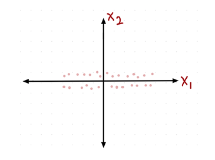
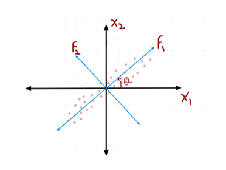
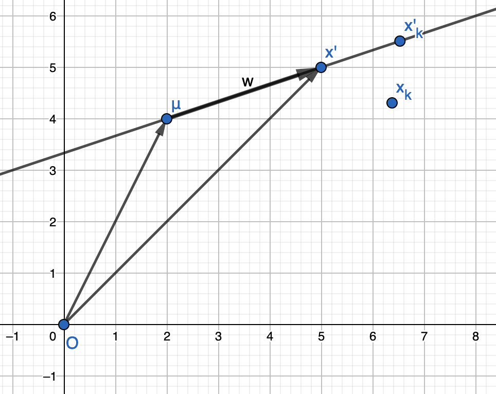
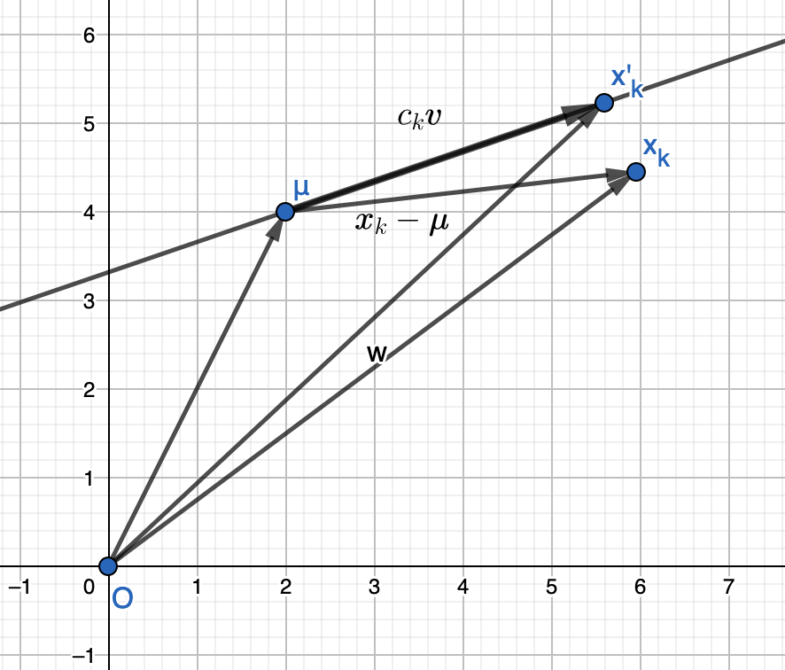
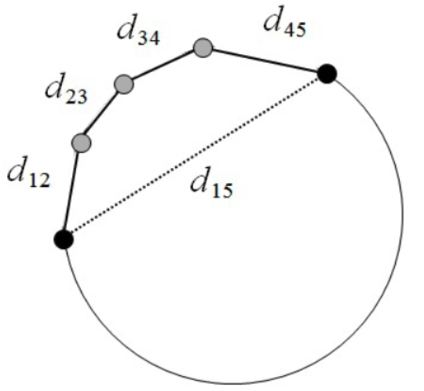

# 主成分分析

*打开本页，如果不能显示公式，请刷新页面。*

## 基本概念

**主成分分析**（Principal Components Analysis, PCA）是一种统计分析、简化数据集的方法。它利用正交变换来对一系列可能相关的变量的观测值进行线性变换，从而投影为一系列线性无关的变量的值，这些不相关变量称为**主成分**（Principal Components）$$^{[1]}$$ 。

主成分分析经常用于减少数据集的维数（降维），同时保留数据集中对方差贡献最大的特征。

主成分分析有*卡尔·皮尔逊*（Karl Pearson）$$^{[2]}$$ 于1901年提出，后经*哈罗德·霍特林*（Harold Hotelling）$$^{[3]}$$ 独立发展并命名。

在信号处理中，主成分分析也称为**离散K-L转换**（Discrete Karhunen-Loeve Transform，KLT）。

## 降维

实现数据集降维的方法有多种，它们分别依赖不同的统计量：

- 主成分分析（Principal Component Analysis，PCA）（线性降维）：方差
- 多维标度（Multidimensional Scaling，MDS）（非线性降维）：距离
- ISOMap（非线性降维）：测地距离 $$^{[5]}$$
- 局部线性嵌入（Local Linear Embedding，LLE）：local geometry
- 拉普拉斯映射（Laplacian Eigenmaps）（非线性降维）：基于图
- 线性判别分析（Linear Discriminant Analysis，LDA）：类间的距离（有监督）

简而言之，降维的目的就是找到能够代表原始数据的维，且此时的维数要小于原始数据的维数。

如下图所示，分布在二维空间中的点表示一个数据集，此数据集有两个特征 $$X_1$$ 和 $$X_2$$ ，通过观察发现，如果将二维数据点投影到特征 $$X_1$$ 方向上，则投影后的数据最大限度地接近于原二维空间的数据，或者说 $$X_1$$ 可以作为从二维空间降到一维空间后的一维空间的基。

图 1

很显然，在二维空间中，特征 $$X_1$$ 比 $$X_2$$ 的样本方差更大。换言之，找到了最大方差的样本，忽略较小方差的样本，能最小化信息丢失（关于信息的度量，请参阅参考资料【4】第7章有关内容）。

若二维空间的数据是下图分布样式，那么就不能降维到 $$X_1$$ 或者 $$X_2$$ ，而是要找到其他的基，依据上述所发现的基本原理：找到方差最大的样本分布方向，可已经 $$F_1$$ 作为降维后的空间的基。

图 2

## PCA 数学原理$$^{[6]}$$

假设样本数量为 $$n$$ ，维数为 $$p$$ 的数据集 $$\pmb{X}=\begin{bmatrix}x_{11}&\cdots&x_{1p}\\\vdots&\ddots&\vdots\\x_{n1}&\cdots&x_{np}\end{bmatrix}$$ 。每一行表示一个数据点，其中第 $$k$$ 行即为第 $$k$$ 个数据点，用向量 $$\pmb{x}_k$$ 表示，此向量共有 $$p$$ 个维度（亦即 $$p$$ 个特征），则 $$\pmb{x}_k\in\mathbb{R}^p$$ 。

如果想要用一个向量 $$\pmb{a}$$ 代表整个数据集 $$\pmb{X}$$ ，可以使用最小二乘法来找这个向量（即最小均方误差）。

$$E_0(\pmb{a})=\frac{1}{n-1}\sum_{k=1}^n\begin{Vmatrix}\pmb{x}_k-\pmb{a}\end{Vmatrix}^2$$

注意，上式中以 $$n-1$$ 为分母，请参阅参考资料 [4] 的 6.1.2 节“统计量”有关介绍。

上式其实是要寻找一个中心向量，该中心向量能够使得上式有最小的均方误差。根据参考资料 [4] 的 6.1.2 节内容可以猜测，该中心向量应该是所有数据点的样本平均，即：

$$\pmb{\mu} = \frac{1}{n}\sum_{k=1}^n\pmb{x}_k$$

下面证明上述猜测：

$$\begin{split}E_0(\pmb{a})&=\frac{1}{n-1}\sum_{k=1}^n\begin{Vmatrix}\pmb{x}_k-\pmb{a}\end{Vmatrix}^2\\&=\frac{1}{n-1}\sum_{k=1}^n\begin{Vmatrix}(\pmb{x}_k-\pmb{\mu})+(\pmb{\mu}-\pmb{a})\end{Vmatrix}^2\\&=\frac{1}{n-1}\left(\sum_{k=1}^n\begin{Vmatrix}(\pmb{x}_k-\pmb{\mu}\end{Vmatrix}^2+\sum_{k=1}^n\begin{Vmatrix}\pmb{\mu}-\pmb{a}\end{Vmatrix}^2+2\sum_{k=1}^n(\pmb{x}_k-\pmb{\mu})^{\rm{T}}(\pmb{\mu}-\pmb{a})\right)\\&=\frac{1}{n-1}\left(\sum_{k=1}^n\begin{Vmatrix}(\pmb{x}_k-\pmb{\mu}\end{Vmatrix}^2+n\begin{Vmatrix}\pmb{\mu}-\pmb{a}\end{Vmatrix}^2+2\left(\sum_{k=1}^n\pmb{x}_k-n\pmb{\mu}\right)^{\rm{T}}(\pmb{\mu}-\pmb{a})\right)\end{split}$$

上式运算中的 $$\pmb{\mu}$$ 是样本均值，由于 $$\pmb{\mu} = \frac{1}{n}\sum_{k=1}^n\pmb{x}_k$$ ，所以 $$\sum_{k=1}^n\pmb{x}_k-n\pmb{\mu}=0$$ ，即上式最后一项等于 0 。

又因为 $$\begin{Vmatrix}\pmb{\mu}-\pmb{a}\end{Vmatrix}^2\ge0$$ ，所以：

$$E_0(\pmb{a})\ge\frac{1}{n-1}\sum_{k=1}^n\begin{Vmatrix}\pmb{x}_k-\pmb{\mu}\end{Vmatrix}^2$$

当 $$\pmb{a}=\pmb{\mu}$$ 时，取等号式。这样就得到Lee代表数据集的中心向量，即样本平均 $$\pmb{\mu}$$ ，注意，此处的样本平均是刻画所有数据点的向量 $$\pmb{x}_k,k=1,2,\cdots,n$$ 的集中量。

表示一个样本的数据点 $$\pmb{x}_k$$ 与样本均值 $$\pmb{\mu}$$ 的差 $$\pmb{x}_k-\pmb{\mu}$$ ，称为该数据点的**偏差**（deviation）。

在样本空间中，假设有一条直线（记作：L）过样本均值 $$\pmb{\mu}$$ ，如下图所示。那么直线 L 上的任意一点（可能是一个样本点，也可能不是）$$\pmb{x}'$$ 与 $$\pmb{\mu}$$ 的关系是：$$\pmb{x}'-\pmb{\mu}=\pmb{w}$$ ，其中 $$\pmb{w}$$ 是沿着直线 L 的向量。若设 $$\pmb{w}=c\pmb{v}$$ ，其中 $$\pmb{v}$$ 是与向量 $$\pmb{w}$$ 同方向，且 $$\begin{Vmatrix}\pmb{v}\end{Vmatrix}=1$$ ，通常称之为**指向向量**；$$c$$ 是一个标量，表示数据点 $$\pmb{x}'$$ 与样本均值 $$\pmb{\mu}$$ 之间的距离（如下图所示）。

图 3

于是直线 L 上的任意一个数据点可以表示为：

$$\pmb{x}'=\pmb{\mu}+\pmb{w}=\pmb{\mu}+c\pmb{v}$$

假设样本空间中的数据点 $$\pmb{x}_k$$ ，如果要在直线 L 上找一个非常接近于它的数据点（记作：$$\pmb{x}'_k$$ ），由参考资料【4】第3章3.4.4节“投影”内容可知， $$\pmb{x}'_k$$  应该是 $$\pmb{x}_k$$ 在直线 L 上的他投影。

为了对上述推论有深刻理解，下面根据参考资料【4】的3.4.4节和参考资料【6】的有关内容，对上述结论给予证明。

假设 $$\pmb{v}$$ 给定，即直线 L 的方向是确定的。

数据点 $$\pmb{x}_k$$ 的偏差为：$$\pmb{x}_k-\pmb{\mu}$$ ，如下图所示，它与 $$c_k\pmb{v}$$ 越接近，则 $$\pmb{x}'_k$$ 与 $$\pmb{x}_k$$ 也越接近，即通过调解 $$c_k$$ ，使得 $$c_k\pmb{v}\approx\pmb{x}_k-\pmb{\mu}$$ 。

图 4

根据前述的经验，最佳近似的系数 $$c_1,\cdots,c_n$$ 可以通过最小二乘求得：

$$\begin{split}E_1(\{c_k\},\pmb{v})&=\frac{1}{n-1}\sum_{k=1}^n\begin{Vmatrix}\pmb{x}'_k-\pmb{x}_k\end{Vmatrix}^2\quad(其中：\pmb{x}'_k=\pmb{\mu}+c_k\pmb{v})\\&=\frac{1}{n-1}\sum_{k=1}^n\begin{Vmatrix}(\pmb{\mu}+c_k\pmb{v})-\pmb{x}_k\end{Vmatrix}^2\\&=\frac{1}{n-1}\sum_{k=1}^n\begin{Vmatrix}c_k\pmb{v}-(\pmb{x}_k-\pmb{\mu})\end{Vmatrix}^2\\&=\frac{1}{n-1}\left(\sum_{k=1}^nc_k^2\begin{Vmatrix}\pmb{v}\end{Vmatrix}^2-2\sum_{k=1}^nc_k\pmb{v}^{\rm{T}}(\pmb{x}_k-\pmb{\mu})+\sum_{k=1}^n\begin{Vmatrix}\pmb{x}_k-\pmb{\mu}\end{Vmatrix}^2\right)\end{split}$$

又因为 $$\begin{Vmatrix}\pmb{v}\end{Vmatrix}=1$$ ，所以上式为：

$$E_1(\{c_k\},\pmb{v})=\frac{1}{n-1}\left(\sum_{k=1}^nc_k^2-2\sum_{k=1}^nc_k\pmb{v}^{\rm{T}}(\pmb{x}_k-\pmb{\mu})+\sum_{k=1}^n\begin{Vmatrix}\pmb{x}_k-\pmb{\mu}\end{Vmatrix}^2\right)$$

为了计算上式的极值，需要计算偏导数 $$\frac{\partial E_1}{\partial c_k}$$ ，并令其为 0 ：

$$\frac{\partial E_1}{\partial c_k}=\frac{1}{n-1}(2c_k-2\pmb{v}^{\rm{T}}(\pmb{x}_k-\pmb{\mu}))=0$$

解得：

$$c_k = \pmb{v}^{\rm{T}}(\pmb{x}_k-\pmb{\mu}),(k=1,\cdots,n)$$

$$c_k$$ 是 $$\pmb{v}$$ 和 $$\pmb{x}_k-\pmb{\mu}$$ 的点积，即数据点相对样本均值的偏差 $$\pmb{x}_k-\pmb{\mu}$$ 在直线 L 上的投影大小，此投影的向量为 $$c_k\pmb{v}$$ 。此时所得到的 $$\pmb{x}'_k$$ 最接近数据点 $$\pmb{x}_k$$ 。也就是说，如果要将数据点 $$\pmb{x}_k$$ 降维到一维空间的直线 L 上，通过 $$\pmb{x}_k-\pmb{\mu}$$ 向直线 L 的正交投影得到对应的数据点 $$\pmb{x}'_k=\pmb{\mu}+c_k\pmb{v}$$ 。

以上考虑的是在直线 L 确定的情况下，数据点通过向其上投影，得到了最近似的在直线 L 上的数据点。下面再研究如何确定直线 L 的方向，即指向向量 $$\pmb{v}$$ 的方向。所使用方法还是通过 $$E_1$$ 最小化，由前述计算所得到的 $$E_1(\{c_k\},\pmb{v})$$ ，将已经得到的 $$c_k$$ 代入到该式中：

$$\begin{split}E_1(\pmb{v})&=\frac{1}{n-1}\left(\sum_{k=1}^nc_k^2-2\sum_{k=1}^nc_k\pmb{v}^{\rm{T}}(\pmb{x}_k-\pmb{\mu})+\sum_{k=1}^n\begin{Vmatrix}\pmb{x}_k-\pmb{\mu}\end{Vmatrix}^2\right)\\&=\frac{1}{n-1}\left(\sum_{k=1}^nc_k^2-2\sum_{k=1}^nc_k^2+\sum_{k=1}^n\begin{Vmatrix}\pmb{x}_k-\pmb{\mu}\end{Vmatrix}^2\right)\quad(\because c_k=\pmb{v}^{\rm{T}}(\pmb{x}_k-\pmb{\mu}))\\&=-\frac{1}{n-1}\sum_{k=1}^nc_k^2+\frac{1}{n-1}\sum_{k=1}^n\begin{Vmatrix}\pmb{x}_k-\pmb{\mu}\end{Vmatrix}^2\\&=-\frac{1}{n-1}\sum_{k=1}^n\left(\pmb{v}^{\rm{T}}(\pmb{x}_k-\pmb{\mu})\right)^2+\frac{1}{n-1}\sum_{k=1}^n\begin{Vmatrix}\pmb{x}_k-\pmb{\mu}\end{Vmatrix}^2\\&=-\frac{1}{n-1}\sum_{k=1}^n\pmb{v}^{\rm{T}}(\pmb{x}_k-\pmb{\mu})(\pmb{x}_k-\pmb{\mu})^{\rm{T}}\pmb{v}+\frac{1}{n-1}\sum_{k=1}^n\begin{Vmatrix}\pmb{x}_k-\pmb{\mu}\end{Vmatrix}^2\\&=-\pmb{v}^{\rm{T}}\left(\frac{1}{n-1}\sum_{k=1}^n(\pmb{x}_k-\pmb{\mu})(\pmb{x}_k-\pmb{\mu})^{\rm{T}}\right)\pmb{v}+\frac{1}{n-1}\sum_{k=1}^n\begin{Vmatrix}\pmb{x}_k-\pmb{\mu}\end{Vmatrix}^2\end{split}$$

根据点积运算的交换律，有 $$\pmb{v}\cdot(\pmb{x}_k-\pmb{\mu})=(\pmb{x}_k-\pmb{\mu})\cdot\pmb{v}$$ ，即 $$\pmb{v}^{\rm{T}}(\pmb{x}_k-\pmb{\mu})=(\pmb{x}_k-\pmb{\mu})^{\rm{T}}\pmb{v}$$ ，并将此结论应用于上述推导中。

令：

$$\pmb{S}=\frac{1}{n-1}\sum_{k=1}^n(\pmb{x}_k-\pmb{\mu})(\pmb{x}_k-\pmb{\mu})^{\rm{T}}$$

有参考资料【4】第5章5.5.4节“协方差矩阵”可知，上述为样本数据的协方差矩阵。

注意，在下面的计算中，将上面表示的数据集 $$\pmb{X}$$ 做适当变化，主要是为了适应向量的表示，将每个数据点向量用列向量的形式表示：

$$\pmb{x}_1=\begin{bmatrix}x_{11}\\x_{12}\\\vdots\\x_{1p}\end{bmatrix},\pmb{x}_2=\begin{bmatrix}x_{21}\\x_{22}\\\vdots\\x_{2p}\end{bmatrix},\cdots,\pmb{x}_n=\begin{bmatrix}x_{n1}\\x_{n2}\\\vdots\\x_{np}\end{bmatrix}$$

样本均值 $$\pmb{\mu}$$ 也用列向量的形式表示：

$$\pmb{\mu}=\begin{bmatrix}\mu_{1}\\\mu_{2}\\\vdots\\\mu_{p}\end{bmatrix}$$

其中 $$p$$ 是维数，$$n$$ 是样本数。

用矩阵运算，将 $$\pmb{S}=\frac{1}{n-1}\sum_{k=1}^n(\pmb{x}_k-\pmb{\mu})(\pmb{x}_k-\pmb{\mu})^{\rm{T}}$$ 用上述向量具体表示，目的是观察每个元素的特点。

$$\begin{split}\pmb{S}'&=\sum_{k=1}^n(\pmb{x}_k-\pmb{\mu})(\pmb{x}_k-\pmb{\mu})^{\rm{T}}\\&=\begin{bmatrix}x_{11}-\mu_1&x_{21}-\mu_1&\cdots&x_{n1}-\mu_1\\x_{12}-\mu_2&x_{22}-\mu_2&\cdots&x_{n2}-\mu_2\\\vdots&\vdots&\ddots&\vdots\\x_{1p}-\mu_p&x_{2p}-\mu_p&\cdots&x_{np}-\mu_p\end{bmatrix}\begin{bmatrix}x_{11}-\mu_1&x_{21}-\mu_1&\cdots&x_{n1}-\mu_1\\x_{12}-\mu_2&x_{22}-\mu_2&\cdots&x_{n2}-\mu_2\\\vdots&\vdots&\ddots&\vdots\\x_{1p}-\mu_p&x_{2p}-\mu_p&\cdots&x_{np}-\mu_p\end{bmatrix}^{\rm{T}}\\&=\begin{bmatrix}s_{11}'&s_{12}'&\cdots&s_{1p}'\\s_{21}'&s_{22}'&\cdots&s_{2p}'\\\vdots&\vdots&\ddots&\vdots\\s_{p1}'&s_{p2}'&\cdots&s_{pp}'\end{bmatrix}\end{split}$$

其中：

$$\begin{split}s_{11}'&=(x_{11}-\mu_1)^2+(x_{21}-\mu_1)^2+\cdots+(x_{n1}-\mu_1)^2\\s_{12}'&=(x_{11}-\mu_1)(x_{12}-\mu_2)+(x_{21}-\mu_1)(x_{22}-\mu_2)+\cdots+(x_{n1}-\mu_1)(x_{n2}-\mu_2)\\&\vdots\\s_{1p}'&=(x_{11}-\mu_1)(x_{1p}-\mu_p)+(x_{21}-\mu_1)(x_{2p}-\mu_p)+\cdots+(x_{n1}-\mu_1)(x_{np}-\mu_p)\\s_{21}'&=(x_{12}-\mu_2)(x_{11}-\mu_1)+(x_{22}-\mu_2)(x_{21}-\mu_1)+\cdots+(x_{n2}-\mu_2)(x_{n1}-\mu_1)\\s_{22}'&=(x_{12}-\mu_2)^2+(x_{22}-\mu_2)^2+\cdots+(x_{n2}-\mu_2)^2\\&\vdots\\s_{2p}'&=(x_{12}-\mu_2)(x_{1p}-\mu_p)+(x_{22}-\mu_2)(x_{2p}-\mu_p)+\cdots+(x_{n2}-\mu_2)(x_{np}-\mu_p)\\&\vdots\\s_{p1}'&=(x_{1p}-\mu_p)(x_{11}-\mu_1)+(x_{2p}-\mu_p)(x_{21}-\mu_1)+\cdots+(x_{np}-\mu_p)(x_{n1}-\mu_1)\\s_{p2}'&=(x_{1p}-\mu_p)(x_{12}-\mu_2)+(x_{2p}-\mu_p)(x_{22}-\mu_2)+\cdots+(x_{np}-\mu_p)(x_{n2}-\mu_2)\\&\vdots\\s_{pp}'&=(x_{1p}-\mu_p)^2+(x_{2p}-\mu_p)^2+\cdots+(x_{np}-\mu_p)^2\end{split}$$

显然，矩阵 $\pmb{S}'$ 的第 $$i$$ 行第 $$j$$ 列元素 $$s_{ij}'$$ 为：

$$\begin{split}s_{ij}'&=(x_{1i}-\mu_i)(x_{1j}-\mu_j)+(x_{2i}-\mu_i)(x_{2j}-\mu_j)+\cdots+(x_{ni}-\mu_i)(x_{nj}-\mu_j)\\&=\sum_{k=1}^n(x_{ki}-\mu_i)(x_{kj}-\mu_j)\end{split}$$

其中 $$i,j$$ 分别为样本的两个特征（或属性、变量）。 

所以，矩阵 $$\pmb{S}$$ 的 $$(i,j)$$ 元表示第 $$i$$ 个特征（或第 $$i$$ 个属性、变量）与第 $$j$$ 个特征的样本协方差：

$$s_{ij}=\frac{1}{n-1}\sum_{k=1}^n(x_{ki}-\mu_i)(x_{kj}-\mu_j)$$

其中 $$x_{ki}$$ 是第 $$k$$ 个数据点的第 $$i$$ 个特征，即 $$\pmb{x}_k$$ 的第 $$i$$ 个值，$$\mu_i=\frac{1}{n}\sum_{k=1}^nx_{ki}$$ 是第 $$i$$ 个特征的样本数据的平均值，即 $$\pmb{\mu}$$ 的第 $$i$$ 个值。

显然 $$s_{ij}=s_{ji}$$ ，故矩阵 $$\pmb{S}$$ 是一个 $$p\times p$$ 的对称矩阵（ $$p$$ 是数据集的维数）。

矩阵 $$\pmb{S}$$ 称为**样本协方差矩阵**。

如果用熟悉的方差和协方差符号表示，则为：

$$\begin{split}\pmb{S}&=\frac{1}{n-1}\pmb{S}'\\&=\begin{bmatrix}\frac{1}{n-1}s_{11}'&\frac{1}{n-1}s_{12}'&\cdots&\frac{1}{n-1}s_{1p}'\\\frac{1}{n-1}s_{21}'&\frac{1}{n-1}s_{22}'&\cdots&\frac{1}{n-1}s_{2p}'\\\vdots&\vdots&\ddots&\vdots\\\frac{1}{n-1}s_{p1}'&\frac{1}{n-1}s_{p2}'&\cdots&\frac{1}{n-1}s_{pp}'\end{bmatrix}\\&=\begin{bmatrix}{\rm{Var}}(\pmb{p}_1)&{\rm{Cov}}(\pmb{p}_1,\pmb{p}_2)&\cdots&{\rm{Cov}} (\pmb{p}_1,\pmb{p}_p)\\{\rm{Cov}}(\pmb{p}_2,\pmb{p}_1)&{\rm{Var}}(\pmb{p}_2)&\cdots&{\rm{Cov}}(\pmb{p}_2,\pmb{p}_p)\\\vdots&\vdots&\ddots&\vdots\\{\rm{Cov}}(\pmb{p}_p,\pmb{p}_1)&{\rm{Cov}}(\pmb{p}_p,\pmb{p}_2)&\cdots&{\rm{Var}}(\pmb{p}_p)\end{bmatrix}\end{split}$$

其中 $$\pmb{p}_i,(i=1,2,\cdots,p)$$ 是数据集中每个特征的数值。

所以，样本协方差矩阵 $$\pmb{S}$$ 的对角线是由样本数据集每个特征的样本方差构成；其他元素是由两两特征间的样本协方差构成，且有 $${\rm{Cov}}(\pmb{p}_i,\pmb{p}_j)={\rm{Cov}}(\pmb{p}_j,\pmb{p}_i),(i\ne j;i=1,\cdots,p;j=1,\cdots,p)$$ 。

假设 $$\pmb{y}$$ 是一个 $$p$$ 维向量，则有：

$$\begin{split}\pmb{y}^{\rm{T}}\pmb{Sy}&=\frac{1}{n-1}\pmb{y}^{\rm{T}}\sum_{k=1}^n(\pmb{x}_k-\pmb{\mu})(\pmb{x}_k-\pmb{\mu})^{\rm{T}}\pmb{y}\\&=\frac{1}{n-1}\sum_{k=1}^n\left(\pmb{y}^{\rm{T}}(\pmb{x}_k-\pmb{\mu})\right)^2\ge0\end{split}$$

由此可知，协方差矩阵 $$\pmb{S}$$ 是半正定矩阵。

再来观察前述得到的 $$E_1(\pmb{v})$$ ：

$$\begin{split}E_1(\pmb{v})&=-\pmb{v}^{\rm{T}}\left(\frac{1}{n-1}\sum_{k=1}^n(\pmb{x}_k-\pmb{\mu})(\pmb{x}_k-\pmb{\mu})^{\rm{T}}\right)\pmb{v}+\frac{1}{n-1}\sum_{k=1}^n\begin{Vmatrix}\pmb{x}_k-\pmb{\mu}\end{Vmatrix}^2\\&=-\pmb{v}^{\rm{T}}\pmb{Sv}+\frac{1}{n-1}\sum_{k=1}^n\begin{Vmatrix}\pmb{x}_k-\pmb{\mu}\end{Vmatrix}^2\end{split}$$

在上式中，$$\frac{1}{n-1}\sum_{k=1}^n\begin{Vmatrix}\pmb{x}_k-\pmb{\mu}\end{Vmatrix}^2$$ 是数据集的样本方差（详见参考资料【4】第6章），它是一个常数。

于是，实现 $$E_1(\pmb{v})$$ 的最小化，转化为了 $$\pmb{v}^{\rm{T}}\pmb{Sv}$$ 的最大化，即转变为如下的最优化问题：

$$\begin{split}maximize&:\pmb{v}^{\rm{T}}\pmb{Sv}\\subject\quad to &:\begin{Vmatrix}\pmb{v}\end{Vmatrix}=1 \end{split}$$

**解法：拉格朗日乘数法**$$^{[7]}$$

根据拉格朗日乘数法，定义拉格朗日函数：

$$L(\pmb{v}, \lambda)=\pmb{v}^{\rm{T}}\pmb{Sv}-\lambda(\pmb{v}^{\rm{T}}\pmb{v}-1)$$

其中 $$\lambda$$ 是未定的拉格朗日乘数。计算上式的梯度并设为 0 （求导公式，请参阅参考文献【4】的第4章4.2.4节“矩阵导数”）：

$$\frac{\partial L}{\partial\pmb{v}}=2\pmb{Sv}-2\lambda\pmb{v}=0$$

可得：$$\pmb{Sv}=\lambda\pmb{v}$$

由此可知，直线 L 的指向向量 $$\pmb{v}$$ 样本协方差矩阵 $$\pmb{S}$$ 的特征向量。

由参考资料【8】中正定矩阵的性质2可知，对于半正定矩阵 $$\pmb{S}$$ 有非负的特征值，故可设其特征值为 $$\lambda_1\ge\lambda_2\ge\cdots\lambda_p\ge0$$ 。

至此，可以得到如下**结论**：

选择对打特征值 $$\lambda_1$$ 所对应的特征向量作为 $$\pmb{v}$$ ，从而确定了直线 L 的方向，并通过 $$\pmb{x}_k-\pmb{\mu}$$ 在此直线上的正交投影 $$c_k=\pmb{v}^{\rm{T}}(\pmb{x}_k-\pmb{\mu})$$ 得到代表该数据集的一维数据，即降维到只有一个维度。

**举例**

以图1所示的数据为例，假设由该数据，得到了协方差矩阵 $$\pmb{S}=\begin{bmatrix}95&1\\1&5\end{bmatrix}$$ ，利用参考资料【4】第3章3.1.1节介绍的用程序计算特征值和特征向量的方法，可得：

$$\begin{split}\lambda_1&=95.011,&&\pmb{v}_1=\begin{bmatrix}0.9999\\0.0111\end{bmatrix}\\\lambda_2&=4.989,&&\pmb{v}_2=\begin{bmatrix}-0.0111\\0.9999\end{bmatrix}\end{split}$$ 

按照前述结论，可以将 $$\pmb{v}_1$$ 方向可以作为降维数据的主方向，它非常接近于图1中的 $$X_1$$ 方向。

对于图2，其数据的协方差矩阵可假设为 $$\pmb{S}=\begin{bmatrix}50&40\\50&40\end{bmatrix}$$ ，计算得到特征值和特征向量：

$$\begin{split}\lambda_1=90,&\pmb{v}_1=\begin{bmatrix}\frac{1}{\sqrt{2}}\\\frac{1}{\sqrt{2}}\end{bmatrix}\\\lambda_2=10,&\pmb{v}_2=\begin{bmatrix}-\frac{1}{\sqrt{2}}\\\frac{1}{\sqrt{2}}\end{bmatrix}\end{split}$$

特征向量 $$\pmb{v}_1$$ 方向即为图2所示的 $$F_1$$ 方向。

以上是将数据集降维到一维空间，这种降维后所得到的的数据相对原数据集而言，略显“粗糙”，如果要求更高精度的近似，可以将 $$p$$ 维数据集降维到 $$r$$ 维度，其中 $$r\le p$$ ，此时考虑 $$\mathbb{R}^r$$ 中的数据点：

$$\pmb{x}'=\pmb{\mu}+z_1\pmb{v}_1+\cdots+z_r\pmb{v}_r=\pmb{\mu}+\sum_{j=1}^rz_{j}\pmb{v}_j$$

其中 $$r\le p$$ 。

目标是要寻找一组单位正交集 $$\{\pmb{v}_1,\cdots, \pmb{v}_r\}$$ ，即 $$\pmb{v}_i^{\rm{T}}\pmb{v}_j=\delta_{ij}=\begin{cases}1,(i=j)\\0,(i\ne j)\end{cases}$$ ，此处的 $$\delta$$ 称为**克罗内克函数**（Kronecker Delta）。为此，还是通过最小化均方误差实现：

$$E_r(\{\pmb{v}_j\})=\sum_{k=1}^n\begin{Vmatrix}\left(\pmb{\mu}+\sum_{j=1}^rz_{kj}\pmb{v}_j\right)-\pmb{x}_k\end{Vmatrix}^2$$

根据前面的推导过程可知，系数 $$z_{kj}$$ 是数据点的偏差 $$\pmb{x}_k-\pmb{\mu}$$ 向单位向量 $$\pmb{v}_j$$ 的正交投影量，即 $$z_{kj}=\pmb{v}_j^{\rm{T}}(\pmb{x}_k-\pmb{\mu})$$ 。类似于之前的推导，可得：

$$\begin{split}E_r(\{\pmb{v}_j\})&=\sum_{k=1}^n\begin{Vmatrix}\left(\pmb{\mu}+\sum_{j=1}^rz_{kj}\pmb{v}_j\right)-\pmb{x}_k\end{Vmatrix}^2\\&=\sum_{k=1}^n\begin{Vmatrix}\sum_{j=1}^rz_{kj}\pmb{v}_j-(\pmb{x}_k-\pmb{\mu})\end{Vmatrix}^2\\&=\sum_{k=1}^n\begin{Vmatrix}\sum_{j=1}^rz_{kj}\pmb{v}_j\end{Vmatrix}^2-2\sum_{k=1}^n\sum_{j=1}^rz_{kj}\pmb{v}_j^{\rm{T}}(\pmb{x}_k-\pmb{\mu})+\sum_{k=1}^n\begin{Vmatrix}\pmb{x}_k-\pmb{\mu}\end{Vmatrix}^2\\&=\sum_{k=1}^n\sum_{j=1}^nz_{kj}^2-2\sum_{k=1}^n\sum_{j=1}^rz_{kj}^2+\sum_{k=1}^n\begin{Vmatrix}\pmb{x}_k-\pmb{\mu}\end{Vmatrix}^2 \quad(\because z_{kj}=\pmb{v}_j^{\rm{T}}(\pmb{x}_k-\pmb{\mu}))\\&=-\sum_{k=1}^n\sum_{j=1}^r\left(\pmb{v}_j^{\rm{T}}(\pmb{x}_k-\pmb{\mu})\right)^2+\sum_{k=1}^n\begin{Vmatrix}\pmb{x}_k-\pmb{\mu}\end{Vmatrix}^2\\&=-\sum_{j=1}^r\pmb{v}_j^{\rm{T}}\left(\sum_{k=1}^n(\pmb{x}_k-\pmb{\mu})(\pmb{x}_k-\pmb{\mu})^{\rm{T}}\right)\pmb{v}_j+\sum_{k=1}^n\begin{Vmatrix}\pmb{x}_k-\pmb{\mu}\end{Vmatrix}^2\end{split}$$

由样本协方差矩阵：$$\pmb{S}=\frac{1}{n-1}\sum_{k=1}^n(\pmb{x}_k-\pmb{\mu})(\pmb{x}_k-\pmb{\mu})^{\rm{T}}$$ ，得：

$$E_r(\{\pmb{v}_j\})=-(n-1)\sum_{j=1}^r\pmb{v}_j^{\rm{T}}\pmb{Sv}_j+\sum_{k=1}^n\begin{Vmatrix}\pmb{x}_k-\pmb{\mu}\end{Vmatrix}^2$$

将最小化 $$E_r(\{\pmb{v}_j\})$$ 转化为最大化 $$\sum_{j=1}^r\pmb{v}_j^{\rm{T}}\pmb{Sv}_j$$ ，即：

$$\begin{split}maximize&:\sum_{j=1}^r\pmb{v}_j^{\rm{T}}\pmb{Sv}_j\\subject\quad to &:\begin{Vmatrix}\pmb{v}_i^{\rm{T}}\pmb{v}_j\end{Vmatrix}=1 \end{split}$$

仍然使用拉格朗日乘数法，定义拉格朗日函数：

$$L(\{\pmb{v}_j\},\{\lambda_{ij}\})=\sum_{j=1}^r\pmb{v}_j^{\rm{T}}\pmb{Sv}_j-\sum_{i=1}^r\sum_{j=1}^r\lambda_{ij}(\pmb{v}_i^{\rm{T}}\pmb{v}_j-\delta_{ij})$$

其中 $$\{\lambda_{ij}\}$$ 是待定的拉格朗日乘数。

计算梯度，并令其等于 0 ：

$$\frac{\partial L}{\partial\pmb{v}_j}=2\pmb{Sv}_j-2\lambda_{jj}\pmb{v}_j-\sum_{i\ne j}(\lambda_{ij}+\lambda_{ji})\pmb{v}_i,(j=1,\cdots,r)$$

当 $$i\ne j$$ 时，设 $$\lambda_{ij}+\lambda_{ji}=0$$ ，则：

$$\pmb{Sv}_j=\lambda_{jj}\pmb{v}_j,(j=1,\cdots,r)$$

当 $$\pmb{v}_1,\cdots,\pmb{v}_r$$ 是样本协方差矩阵 $$\pmb{S}$$ 的最大 $$r$$ 个特征值 $$\lambda_1,\cdots,\lambda_r$$ 的对应特征向量时（单位正交），目标函数：

$$\sum_{j=1}^r\pmb{v}_j^{\rm{T}}\pmb{Sv}_j=\sum_{j=1}^r\lambda_j\pmb{v}^{\rm{T}}_j\pmb{v}_j=\sum_{j=1}^r\lambda_j$$

有最大值。

在参考资料【9】和【10】中有两项证明，对应用此结论而提供了更坚实的数学支持。

以上，用 $$\pmb{x}'=\pmb{\mu}+z_1\pmb{v}_1+\cdots+z_r\pmb{v}_r$$ 近似数据点 $$\pmb{x}_k$$ ，样本协方差矩阵 $$\pmb{S}$$ 的特征向量 $$\{\pmb{v}_1,\cdots,\pmb{v}_r\}$$ 描述了数据集的主要成分，因此称为**主成分**。特征值 $$\lambda_j$$ 是主成分 $$\pmb{v}_j$$ 的系数 $$z_j$$ 的方差。

下面首先看 $$z_j$$ 的样本平均数是多少：

$$\begin{split}\overline{z}_j&=\frac{1}{n}\sum_{k=1}^nz_{kj}\\&=\frac{1}{n}\sum_{k=1}^n\pmb{v}_j^{\rm{T}}(\pmb{x}_k-\pmb{\mu})\\&=\frac{1}{n}\pmb{v}_j^{\rm{T}}\left(\sum_{k=1}^n\pmb{x}_k-n\pmb{\mu}\right)\\&=0\end{split}$$

在计算 $$z_j$$ 的样本方差：

$$\begin{split}s_{z_j}^2&=\frac{1}{n-1}\sum_{k=1}^nz_{kj}^2\\&=\frac{1}{n-1}\sum_{k=1}^n\left(\pmb{v}_j^{\rm{T}}(\pmb{x}_k-\pmb{\mu})\right)\left((\pmb{x}_k-\pmb{\mu})^{\rm{T}}\pmb{v}_j\right)\\&=\pmb{v}_j^{\rm{T}}\left(\frac{1}{n-1}\sum_{k=1}^n(\pmb{x}_k-\pmb{\mu})(\pmb{x}_k-\pmb{\mu})^{\rm{T}}\right)\pmb{v}_j\\&=\pmb{v}_j^{\rm{T}}\pmb{Sv}_j\\&=\lambda_j\pmb{v}_j^{\rm{T}}\pmb{v}_j\\&=\lambda_j\end{split}$$

所以，特征值 $$\lambda_i$$ 表示主成分 $$\pmb{v}_j$$ 的权值。

此外，主成分系数 $$z_i$$ 与 $$z_j$$ 线性无关，即样本协方差 $$s_{z_iz_j} = 0$$ ，其计算如下（当 $$i\ne j$$ 时）：

$$\begin{split}s_{z_iz_j}&=\frac{1}{n-1}\sum_{k=1}^nz_{ki}z_{kj}\\&=\frac{1}{n-1}\sum_{k=1}^n\left(\pmb{v}_i^{\rm{T}}(\pmb{x}_k-\pmb{\mu})\right)\left((\pmb{x}_k-\pmb{\mu})^{\rm{T}}\pmb{v}_j\right)\\&=\pmb{v}_i^{\rm{T}}\pmb{Sv}_j\\&=\lambda_j\pmb{v}_i^{\rm{T}}\pmb{v}_j=0\end{split}$$

**总结：**对样本个数为 $$n$$ ，维数是 $$p$$ 的数据集 $$\{\pmb{x}_1,\cdots,\pmb{x}_n\}$$ 进行主成分分析，其步骤如下：

1. 计算样本平均 $$\pmb{\mu}=\frac{1}{n}\sum_{k=1}^n\pmb{x}_k$$ ，并得到由每个样本点偏差组成的 $$n\times p$$ 矩阵 $$\pmb{X}$$ ：

   $$\pmb{X}=\begin{bmatrix}(\pmb{x}_1-\pmb{\mu})^{\rm{T}}\\(\pmb{x}_2-\pmb{\mu})^{\rm{T}}\\\vdots\\(\pmb{x}_n-\pmb{\mu})^{\rm{T}}\end{bmatrix}=\begin{bmatrix}x_{11}-\mu_1&x_{12}-\mu_2&\cdots&x_{1p}-\mu_p\\x_{21}-\mu_1&x_{22}-\mu_2&\cdots&x_{2p}-\mu_p\\\vdots&\vdots&\ddots&\vdots\\x_{n1}-\mu_1&x_{n2}-\mu_2&\cdots&x_{np}-\mu_p\end{bmatrix}$$

   计算样本协方差矩阵 $$\pmb{S}_{p\times p}$$ ：

   $$\pmb{S}=\frac{1}{n-1}\sum_{k=1}^n(\pmb{x}_k-\pmb{\mu})(\pmb{x}_k-\pmb{\mu})^{\rm{T}}=\frac{1}{n-1}\pmb{X}^{\rm{T}}\pmb{X}$$

2. 将 $$\pmb{S}$$ 正交对角化为：

   $$\pmb{S}=\pmb{V\Lambda V}^{\rm{T}}$$

   其中：

   - $$\pmb{\Lambda}={\rm{diag}}(\lambda_1,\cdots,\lambda_p)$$ 是特征值矩阵，$$\lambda_1\ge\cdots\ge\lambda_p\ge0$$ 表示主成分的权值；
   - $$\pmb{V}=\begin{bmatrix}\pmb{v}_1&\cdots&\pmb{v}_p\end{bmatrix}$$ 是单位正交特征向量构成的 $$p\times p$$ 级的正交主成分矩阵，$$\pmb{V}^{\rm{T}}\pmb{V}=\pmb{VV}^{\rm{T}}=\pmb{I}_p$$ 。

3. 计算主成分系数矩阵 $$\pmb{Z}_{n\times p}=[z_{kj}]$$ ，其中 $$z_{kj}=(\pmb{x}_k-\pmb{\mu})^{\rm{T}}\pmb{v}_j$$ ：

   $$\pmb{Z}=\begin{bmatrix}(\pmb{x}_1-\pmb{\mu})^{\rm{T}}\\(\pmb{x}_2-\pmb{\mu})^{\rm{T}}\\\vdots\\(\pmb{x}_n-\pmb{\mu})^{\rm{T}}\end{bmatrix}\begin{bmatrix}\pmb{v}_1&\cdots\pmb{v}_p\end{bmatrix}=\pmb{XV}$$

   上式等号两边右乘 $$\pmb{V}^{\rm{T}}$$ ，得：

   $$\pmb{X}=\pmb{ZV}^{\rm{T}}$$

   即：数据点 $$\pmb{x}_k$$ 的主成分分解式为：

   $$\pmb{x}_k=\pmb{\mu}+\sum_{j=1}^pz_{kj}\pmb{v}_j,(k=1,\cdots,n)$$

   主成分系数 $$z_{k1},\cdots,z_{kp}$$ 是偏差 $$\pmb{x}_k-\pmb{\mu}$$ 以单位正交向量 $$\pmb{V}=\{\pmb{v}_1,\cdots,\pmb{v}_p\}$$ 为基的坐标。

注意的问题：

- 在原始数据集中，如果某个特征的方差较大，则主成分方向会受其影响严重，此时，通常按照如下方式对数据给予处理：

  1. 在进行 PCA 之前，对数据进行标准差标准化处理：

     $$\begin{split}\widetilde{\pmb{X}}&=\begin{bmatrix}(\pmb{x}_1-\pmb{\mu})^{\rm{T}}\\(\pmb{x}_2-\pmb{\mu})^{\rm{T}}\\\vdots\\(\pmb{x}_n-\pmb{\mu})^{\rm{T}}\end{bmatrix}\begin{bmatrix}1/s_1&0&\cdots&0\\0&1/s_2&\cdots&0\\\vdots&\vdots&\ddots&\vdots\\0&0&\cdots1/s_p\end{bmatrix}\\&=\begin{bmatrix}(x_{11}-\mu_1)/s_1&(x_{12}-\mu_2)/s_2&\cdots&(x_{1p}-\mu_p)/s_p\\(x_{21}-\mu_1)/s_1&(x_{22}-\mu_2)/s_2&\cdots&(x_{2p}-\mu_p)/s_p\\\vdots&\vdots&\ddots&\vdots\\(x_{n1}-\mu_1)/s_1&(x_{n2}-\mu_2)/s_2&\cdots&(x_{np}-\mu_p)/s_p\end{bmatrix}\end{split}$$

     其中 $$s_i^2$$ 是第 $$i$$ 个特征的样本方差，即 $$s_i^2=\frac{1}{n-1}\sum_{k=1}^n(x_{ki}-\mu_i)^2$$ 。

  2. 经过标准化之后，再计算 $$\widetilde{\pmb{X}}$$ 的协方差矩阵：
  
     $$\pmb{R}=\frac{1}{n-1}\widetilde{\pmb{X}}^{\rm{T}}\widetilde{\pmb{X}}$$
  
     此矩阵也是相关系数矩阵（详见参考资料【4】第5章5.5.2节），$$\pmb{R}$$ 的 $$(i,j)$$ 元是第 $$i$$ 个特征与第 $$j$$ 个特征的相关系数。
  
     又因为：
  
     $$\sum_{j=1}^p\lambda_j={\rm{trace}}\pmb{\Lambda}={\rm{trace}}(\pmb{V}^{\rm{T}}\pmb{RV})={\rm{trace}}(\pmb{RVV}^{\rm{T}})={\rm{trace}}\pmb{R}=p$$
  
     即数据集的总方差等于维数 $$p$$ 。（以上计算中使用了 $${\rm{trace}}(\pmb{AB})={\rm{trace}}(\pmb{BA})$$ ，且 $$\pmb{R}$$ 的主对角线元素都是 1 。）
  
- 在应用上述方法进行实际的数值计算时，特别是计算 $$\frac{1}{n-1}\pmb{X}^{\rm{T}}\pmb{X}$$ 时，会遇到麻烦，解决方法请延伸阅读参考资料【11】。

## 注意

PCA 是一种线性方法，如果对于非线性的数据，则不能直接使用上述方法。

## 参考资料

1. [维基百科：主成分分析](https://zh.wikipedia.org/wiki/%E4%B8%BB%E6%88%90%E5%88%86%E5%88%86%E6%9E%90)

2. [Kal Pearson](https://zh.wikipedia.org/wiki/%E5%8D%A1%E5%B0%94%C2%B7%E7%9A%AE%E5%B0%94%E9%80%8A)

3. [Harold Hotelling](https://zh.wikipedia.org/wiki/%E5%93%88%E7%BE%85%E5%BE%B7%C2%B7%E9%9C%8D%E7%89%B9%E6%9E%97)

4. 齐伟. 机器学习数学基础. 电子工业出版社

5. 测地距离（geodesic distance），是图论中的术语，指图中两节点间的最短路径。注意区分于几何空间中的欧几里得距离。如下图所示：

   

   $$d_{15}$$ 表示图中两点之间的欧几里得距离，$$d_{12}+d_{23}+d_{34}+d_{45}$$ 为两点之间的测地距离。

6. [线代启示录：主成分分析](https://ccjou.wordpress.com/2013/04/15/%e4%b8%bb%e6%88%90%e5%88%86%e5%88%86%e6%9e%90/)

7. [拉格朗日乘数法](./lagrangemulti.html)

8. [正定矩阵](./positive_definite.html)

9. 考虑下面的式子：

   $$\pmb{Sv}_j=\lambda_{jj}\pmb{v}_j+\frac{1}{2}\sum_{i\ne j}(\lambda_{ij}+\lambda_{ji})\pmb{v}_i,(j=1,\cdots,r)$$

   令 $$\pmb{V}=\begin{bmatrix}\pmb{v}_1&\cdots&\pmb{v}_r\end{bmatrix}$$ ，且：

   $$\pmb{M}=\begin{bmatrix}\lambda_{11}&\cdots&\frac{\lambda_{1r}+\lambda_{r1}}{2}\\\vdots&\ddots&\vdots\\\frac{\lambda_{1r}+\lambda_{r1}}{2}&\cdots&\lambda_{rr}\end{bmatrix}$$

   则前述方程用矩阵形式表示：

   $$\pmb{SV}=\pmb{VM}$$

   因为 $$\pmb{V}$$ 的列向量是单位正交向量，即 $$\pmb{V}^{\rm{T}}\pmb{V}=\pmb{I}_r$$ 。上式等号两侧左乘 $$\pmb{V}^{\rm{T}}$$ ，得：

   $$\pmb{V}^{\rm{T}}\pmb{SV}=\pmb{M}$$ 

   下面正面，对于任何 $$\pmb{V}$$ 和 $$\pmb{M}$$ ，只要满足以上条件，就有一个相同的目标函数值：

   $$\sum_{j=1}^r\pmb{v}_j^{\rm{T}}\pmb{Sv}_j=\trace(\pmb{V}^{\rm{T}}\pmb{SV})$$

   将对称矩阵 $$\pmb{M}$$ 正交对角化为：$$\pmb{D}=\pmb{Q}^{\rm{T}}\pmb{MQ}$$ ，其中 $$\pmb{Q}$$ 是正交矩阵，$$\pmb{Q}^{\rm{T}}\pmb{Q}=\pmb{QQ}^{\rm{T}}=\pmb{I}_r$$ ，$$\pmb{D}={\rm{diag}}(\lambda_1,\cdots,\lambda_r)$$ 。

   对 $$\pmb{V}^{\rm{T}}\pmb{SV}=\pmb{M}$$ 左乘 $$\pmb{Q}^{\rm{T}}$$ 、右乘 $$\pmb{Q}$$ ，可得：

   $$\begin{split}\pmb{Q}^{\rm{T}}\pmb{V}^{\rm{T}}\pmb{SV}\pmb{Q}&=\pmb{Q}^{\rm{T}}\pmb{MQ}\\(\pmb{VQ})^{\rm{T}}\pmb{S}(\pmb{VQ})&=\pmb{D}\end{split}$$

   令 $$\widetilde{\pmb{V}}=\pmb{VQ}$$ ，则：

   $$\widetilde{\pmb{V}}^{\rm{T}}\pmb{S}\widetilde{\pmb{V}}=\pmb{D}$$

   因为 $$\widetilde{\pmb{V}}^{\rm{T}}\widetilde{\pmb{V}}=(\pmb{VQ})^{\rm{T}}(\pmb{VQ})=\pmb{Q}^{\rm{T}}\pmb{V}^{\rm{T}}\pmb{VQ}=\pmb{Q}^{\rm{T}}\pmb{Q}=\pmb{I}_r$$ ，所以 $$\widetilde{\pmb{V}}$$ 的也有单位正交向量，则 $$\widetilde{\pmb{V}}$$ 和 $$\pmb{D}$$ 也是一组解。

   $${\rm{trace}}(\pmb{V}^{\rm{T}}\pmb{SV})={\rm{trace}}(\pmb{Q}\widetilde{\pmb{V}}^{\rm{T}}\pmb{S}\widetilde{\pmb{V}}\pmb{Q}^{\rm{T}})={\rm{trace}}(\widetilde{\pmb{V}}^{\rm{T}}\pmb{S}\widetilde{\pmb{V}}\pmb{Q}\pmb{Q}^{\rm{T}})={\rm{trace}}(\widetilde{\pmb{V}}^{\rm{T}}\pmb{S}\widetilde{\pmb{V}})$$

   从而证明：$$\pmb{V}$$ 和 $$\widetilde{\pmb{V}}$$ 所含的两组单位正交向量集合有相同的目标函数值 $${\rm{trace}}(\pmb{D})=\sum_{j=1}^r\lambda_j$$

10. 假设单位向量 $$\pmb{v}_1$$ 是令 $$\pmb{v}_1^{\rm{T}}\pmb{Sv}_1$$ 最大化的向量，满足：

    $$\pmb{Sv}_1=\lambda_1\pmb{v}_1$$ 

    下面找出下一个单位向量 $$\pmb{v}_2$$ ，且满足 $$\pmb{v}_2^{\rm{T}}\pmb{v}_1=0$$ ，即与 $$\pmb{v}_1$$ 正交。

    定义拉格朗日函数：

    $$L(\pmb{v}_2,\alpha,\beta)=\pmb{v}_2^{\rm{T}}\pmb{Sv}_2-\alpha(\pmb{v}_2^{\rm{T}}\pmb{v}_2-1)-\beta\pmb{v}_2^{\rm{T}}\pmb{v}_1$$

    其中，$$\alpha,\beta$$ 是拉格朗日乘数。计算梯度，并设为 0 ：

    $$\frac{\partial L}{\partial\pmb{v}_2}=2\pmb{Sv}_2-2\alpha\pmb{v}_2-\beta\pmb{v}_1=\pmb{0}$$

    $$\pmb{Sv}_2=\alpha\pmb{v}_2+\frac{1}{2}\beta\pmb{v}_1$$

    上式左乘 $$\pmb{v}_1^{\rm{T}}$$ ，可得：

    $$\pmb{v}_1^{\rm{T}}\pmb{Sv}_2=\alpha\pmb{v}_1^{\rm{T}}\pmb{v}_2+\frac{1}{2}\beta\pmb{v}_1^{\rm{T}}\pmb{v}_1=\frac{\beta}{2}$$

    又因为：

    $$\pmb{v}_1^{\rm{T}}\pmb{Sv}_2=(\pmb{Sv}_1)^{\rm{T}}\pmb{v}_2=(\lambda_1\pmb{v}_1)^{\rm{T}}\pmb{v}_2=\lambda_1\pmb{v}_1^{\rm{T}}\pmb{v}_2=0$$

    所以：$$\beta=0$$

    即：$$\pmb{Sv}_2=\alpha\pmb{v}_2$$

    显然 $$\alpha=\lambda_2$$ ，$$\pmb{v}_2$$ 是对应的单位特征向量。

    同理可以推导 $$r=3,4,\cdots$$ 等情况。
    
11. [比较 SVD 和 PCA](./svdvspca.html)

