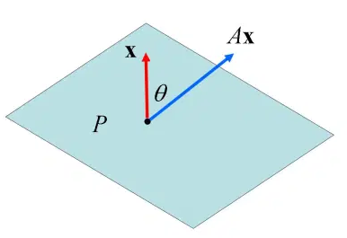

# 正定矩阵

## 定义

令 $\pmb{A}$ 为一个 $n\times n$ 实对称矩阵，当且仅当对所有 $n$ 维非零向量 $\pmb{x}$ ，都有：

$$
\pmb{x}^{\rm{T}}\pmb{Ax}\gt0
$$
则称 $\pmb{A}$ 为**正定**（positive definite）；若上述条件为：

$$
\pmb{x}^{\rm{T}}\pmb{Ax}\ge0
$$
则称 $\pmb{A}$ 为**半正定**（positive semidefinite）.

### 分析

在上述关于正定矩阵的定义中，之所以强调 $\pmb{A}$ 是实对称矩阵，是因为任何一个实数方阵，都可以表示为一个实对称矩阵与一个反对称矩阵的和，即 $\pmb{A}=\pmb{B}+\pmb{C}$ （称为**卡氏分解**），其中：

$$
\begin{split}\pmb{B}=\frac{1}{2}(\pmb{A}+\pmb{A}^{\rm{T}})\\\pmb{C}=\frac{1}{2}(\pmb{A}-\pmb{A}^{\rm{T}}) \end{split}
$$
计算可验证：$\pmb{B}=\pmb{B}^{\rm{T}}$ 、$\pmb{C}=-\pmb{C}^{\rm{T}}$ 。所以，$\pmb{B}$ 是对称矩阵，$\pmb{C}$ 是反对称矩阵（反对称矩阵，也称为“斜对称矩阵”$^{[2]}$）。

考虑：

$$
\pmb{x}^{\rm{T}}\pmb{Ax}=\pmb{x}^{\rm{T}}(\pmb{B}+\pmb{C})\pmb{x}=\pmb{x}^{\rm{T}}\pmb{Bx}+\pmb{x}^{\rm{T}}\pmb{Cx}
$$
因为：

$$
\pmb{x}^{\rm{T}}\pmb{Cx}=(\pmb{x}^{\rm{T}}\pmb{Cx})^{\rm{T}}=\pmb{x}^{\rm{T}}\pmb{C}^{\rm{T}}\pmb{x}=-\pmb{x}^{\rm{T}}\pmb{Cx}
$$
故 $\pmb{x}^{\rm{T}}\pmb{Cx} = 0$ ，因此

$$
\pmb{x}^{\rm{T}}\pmb{Ax}=\pmb{x}^{\rm{T}}\pmb{Bx}
$$
即二次型 $\pmb{x}^{\rm{T}}\pmb{Ax}$ 可用对称部分表示。

### 几何意义

- 若 $n=1$ ，则矩阵 $\pmb{A}$ 和向量 $\pmb{x}$ 都退化为标量 $a、x$ ，对任意非零的 $x$ ，有：$xax=ax^2\gt0$ 。

  显然 $a$ 是正数，完整地说，$a$ 是正定的。

- 若 $n\gt1$ ，$\pmb{Ax}$ 与 $\pmb{x}$ 之间的夹角 $\theta$ 的余弦为 $\cos\theta = \frac{\pmb{x}^{\rm{T}}(\pmb{Ax})}{\begin{Vmatrix}\pmb{x}\end{Vmatrix}\begin{Vmatrix}\pmb{Ax}\end{Vmatrix}}$ 。

  $\pmb{Ax}$ 与 $\pmb{x}$ 点积为正值，则 $\theta \lt 90°$ ，如下图所示，$\pmb{x}$ 为超平面 $P$ 的法向量，正定矩阵 $\pmb{A}$ 保证变换后的向量 $\pmb{Ax}$ 与原向量 $\pmb{x}$ 都位于超平面 $P$ 的同一侧。

  

对称正定矩阵的对角化形式 $\pmb{A}=\pmb{Q\Lambda Q}^{\rm{-1}}$ 的几何解释：

- $\pmb{A}\sim\pmb{\Lambda}$ ，$\pmb{A}$ 参考有序基 $\{\pmb{q}_1,\cdots,\pmb{q}_n\}$ 的变换矩阵即为对角矩阵 $\pmb{\Lambda}$ 。由于每个主对角元素都大于零，对称正定矩阵具有分别拉伸各主轴（即特征向量方向）的功能，而伸缩量即为特征值。
- 还可以认为连续执行了三个线性变换：
  1. $\pmb{Q}^{-1}$ ：旋转变换
  2. $\pmb{\Lambda}$：拉伸变换
  3. $\pmb{Q}$ ：逆旋转变换

## 定理

若 $\pmb{A}$ 是一个实对称正定矩阵，则 $\pmb{A}$ 的特征值皆为正，反之亦然。

**证明**

（1）$\pmb{A}$ 是实对称正定矩阵，令 $\pmb{A}=\pmb{Q\Lambda Q}^{\rm{T}}$ ，其中 $\pmb{\Lambda} = \rm{diag}(\lambda_1,\cdots,\lambda_n)$ ，$\lambda_i$ 是 $\pmb{A}$ 的特征值。

设 $\pmb{Q}=\begin{bmatrix}\pmb{q}_1&\cdots&\pmb{q}_n\end{bmatrix}$ 的所有列都是单范正交特征向量。

因为 $\pmb{A}$ 正定，所以：

$$
\pmb{q}_i^{\rm{T}}\pmb{Aq}_i=\pmb{q}_i^{\rm{T}}(\lambda_i\pmb{q}_i)=\lambda_i(\pmb{q}_i^{\rm{T}}\pmb{q}_i)=\lambda_i\gt0
$$
（2）设 $\lambda_i\gt0,(i=1,\cdots,n)$ 。令 $\pmb{y}=\pmb{Q}^{\rm{T}}\pmb{x}=\pmb{Q}^{-1}\pmb{x}$ 。因为 $\pmb{x} = \pmb{Qy}$ ，$\pmb{y}$ 必定为非零向量，则：

$$
\pmb{x}^{\rm{T}}\pmb{Ax}=\pmb{x}^{\rm{T}}\pmb{Q\Lambda Q}^{\rm{T}}\pmb{x}=\pmb{y}^{\rm{T}}\pmb{\Lambda y}=\lambda_1y_1^2+\cdots+\lambda_ny_n^2\gt0
$$

## 性质

- **性质1：正定矩阵的每一个主子阵都是正定的**

**证明**

为了证明此性质，首先引入一种符号记法。

令 $S$ 为 $\{1,2,\cdots,n \}$ 的子集，$S^{\rm{c}}$ 表示 $S$ 的补集，$|S|$ 表示集合 $S$ 的元素数，称为基数（cardinal number）。对于所有 $i\in S^{\rm{c}}$ ，将 $n\times n$ 阶矩阵 $\pmb{A}$ 的第 $i$ 行与第 $i$ 列同时删除，可得到一个 $|S|\times |S|$ 阶主子阵（principal submatrix），以 $\pmb{A}_S$ 表示。例如：

$$
\pmb{A}=\begin{bmatrix}5&-1&3&-1\\-1&2&-2&-1\\3&-2&3&1\\-1&-1&1&6\end{bmatrix}
$$
下面几个都是主子阵：

$$
\pmb{A}_{\{1,3,4\}}=\begin{bmatrix}5&3&-1\\3&3&1\\-1&1&6\end{bmatrix},\quad \pmb{A}_{\{2,4\}}=\begin{bmatrix}2&-1\\-1&6\end{bmatrix}\quad\pmb{A}_{\{3\}}=\begin{bmatrix}3\end{bmatrix}
$$
对于向量 $\pmb{x}\in\mathbb{R}^n$ ，用 $\pmb{x}_{S}$ 表示删除了 $S$ 的补集元素后得到的向量，显然 $\pmb{x}_S$ 是 $|S|$ 维向量。

对于任何 $k\in S^{\rm{c}}$ ，令 $\pmb{x}$ 的第 $k$ 个元为零，则：

$$
\pmb{x}_S^{\rm{T}}\pmb{A}_S\pmb{x}_S=\pmb{x}^{\rm{T}}\pmb{Ax}\gt0
$$
由于 $\pmb{x}_S\ne0$ 是任意的，所以 $\pmb{A}_S$ 是正定的。

- **性质2：正定矩阵的特征值皆为正数**

**证明**

设 $\lambda$ 为正定矩阵 $\pmb{A}$ 的一个特征值，对于特征向量 $\pmb{x}\ne0$ ，则：

$$
\pmb{x}^{\rm{T}}\pmb{Ax}=\pmb{x}^{\rm{T}}\lambda\pmb{x}=\lambda\pmb{x}^{\rm{T}}\pmb{x}
$$
则：$\lambda=\frac{\pmb{x}^{\rm{T}}\pmb{Ax}}{\pmb{x}^{\rm{T}}\pmb{x}}$ ，分子分母都是正数，故 $\lambda\gt0$ 。

**拓展**

由性质2可知：设 $\lambda_i\gt0$  是正定矩阵 $\pmb{A}$ 的特征值，则 $\pmb{A}$ 可逆， $\pmb{A}^{-1}$ 和 $\pmb{A}^{\rm{T}}$ 也是正定矩阵，且：

$$
\begin{split}\rm{det}\pmb{A}&=\lambda_1\lambda_2\cdots\lambda_n\gt0\\\rm{trace}\pmb{A}&=\lambda_1+\lambda_2+\cdots+\lambda_n\gt0\end{split}
$$
结合性质1，每个主子阵 $\pmb{A}_S$ 亦有类似性质。

- 性质3：正定矩阵的主元（pivot）都是正数
- 性质4：正定矩阵 $\pmb{A}$ 可以表示为 $\pmb{A}=\pmb{B}^{\rm{T}}\pmb{B}$ ，$\pmb{B}$ 是一个可逆矩阵

## 判别

- 若 $n\times n$ 矩阵 $\pmb{A}$ 的特征值都是正数，则 $\pmb{A}$ 是正定矩阵
- 若 $n\times n$ 矩阵 $\pmb{A}$ 的轴（主元）都是正数，则 $\pmb{A}$ 是正定矩阵 
- 若 $n\times n$ 矩阵 $\pmb{A}$ 的领先主子阵的行列式都是正数，则 $\pmb{A}$ 是正定矩阵
- 若 $n\times n$ 矩阵 $\pmb{A}$ 可表示为 $\pmb{A}=\pmb{B}^{\rm{T}}\pmb{B}$ ，$\pmb{B}$ 是一个可逆矩阵，则 $\pmb{A}$ 是正定矩阵

## 参考文献

[1]. [特殊矩阵-六：正定矩阵](https://ccjou.wordpress.com/2009/10/01/%e7%89%b9%e6%ae%8a%e7%9f%a9%e9%99%a3-%e5%85%ad%ef%bc%9a%e6%ad%a3%e5%ae%9a%e7%9f%a9%e9%99%a3/)

[2]. 反对称矩阵：指满足 $\pmb{A}^{\text{T}}=-\pmb{A}$ 的矩阵，或者，对于矩阵 $\pmb{A}=(a_{ij})$ ，各元素的关系为 $a_{ij}=-a{ji}$ ，例如下面的矩阵就是一个反对称矩阵：
$$
\begin{bmatrix}0&2&-1\\-2&0&-4\\1&4&0\end{bmatrix}
$$
反对称矩阵特性：

- 反对称矩阵自身相乘的积是对称矩阵
- 对任意矩阵 $\pmb{A}$ ，$\pmb{A}^{\text{T}}-\pmb{A}$ 是反对称矩阵
- 若 $\pmb{A}$ 是反对称矩阵，$\pmb{x}$ 是向量，则 $\pmb{x}^{\text{T}}\pmb{Ax}=0$
- 反对称矩阵的主对角线匀速必是零，所以其迹为零