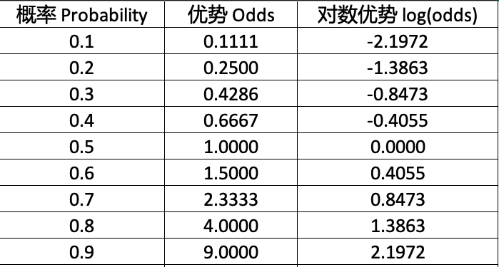

# Probability 和 Odds 的比较

## 中文翻译

- Probability，译为“**概率**”，这是公认的，也是概率论教材中普遍采用的翻译。另外，还有“几率”、“机率”等翻译，皆为此单词的中文译名。
- Odds，翻译为“**优势**”。对此单词，有诸多译名，比如“赔率”、“几率”（周志华教授的《机器学习》一书中用此翻译）、“比值比”、“发生比”等。此处，采信“优势”的翻译（感谢苏州大学唐煜教授指导）。

## 计算方法

### 概率 Probability

概率，在统计学中有严格的定义，请参阅参考资料 [1] 。

以抛硬币为例，正面朝上的概率为：

$$p=\frac{\{H\}}{\{H,T\}}=\frac{1}{2}=0.5$$

### 优势 Odds

Odds are not Probabilities.

用概率计算优势：

$$\text{odds}=\frac{p}{1-p}$$ ，其中 $$p$$ 是概率。

 以下链接的视频，对 Odds 以及对其求对数，进行了非常细致的讲解，可供参考。

https://weibo.com/tv/show/1034:4801344125730898?from=old_pc_videoshow

对数优势，即计算 $$\text{log}(\text{odds})=\text{log}\frac{p}{1-p}$$ ，通常是以 $$e$$ 为底的对数。

这样做的结果是让本来不具有对称性的“优势”值，变为具有对称性。如下表所示。

## 参考资料

[1]. 齐伟. 机器学习数学基础. 北京：电子工业出版社