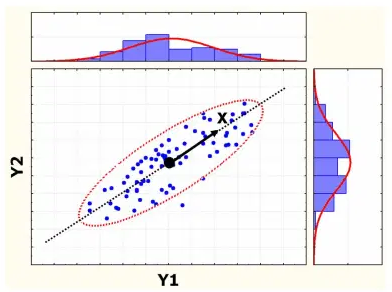

# 二次型

*打开本页，如果没有显示公式，请刷新页面。*

## 定义

令 $$\pmb{A}=[a_{ij}]$$ 为 $$n\times n$$ 阶实矩阵，$$\pmb{x}=\begin{bmatrix}x_1\\\vdots\\x_n\end{bmatrix}$$ 为 $$n$$ 维实向量，具有以下形式的实函数称为二次型（quadritic form）:

$$f(\pmb{x})=\pmb{x}^{\rm{T}}\pmb{Ax} \tag{1}$$

- 二次型 $$\pmb{x}^{\rm{T}}\pmb{Ax}$$ 是一个标量

- 任意二次型 $$\pmb{x}^{\rm{T}}\pmb{Ax}$$ 都可以转化为等价的 $$\pmb{x}^{\rm{T}}\pmb{Bx}$$ ，其中 $$\pmb{B}$$ 是一个实对称矩阵。

  **证明**

  $$\begin{split}\pmb{x}^{\rm{T}}\pmb{Ax} &= \sum_{i=1}^n\sum_{j=1}^na_{ij}x_ix_j\\&=\sum_{i=1}^n\sum_{j=1}^n\frac{1}{2}(a_{ij}+a_{ji})x_ix_j\\&=\pmb{x}^{\rm{T}}\left[\frac{1}{2}(\pmb{A}+\pmb{A}^{\rm{T}})\right]\pmb{x}\end{split}$$

  令 $$\pmb{B}=\frac{1}{2}(\pmb{A}+\pmb{A}^{\rm{T}})$$ ，则 $$\pmb{A}$$ 与 $$\pmb{B}$$ 有相同的二次型，且 $$\pmb{B}$$ 是对称矩阵。

在二次型的基础上，可以建立正定矩阵的概念。

> 若 $$\pmb{A}$$ 是一个实对称矩阵，且任一 $$\pmb{x}\ne\pmb{0}$$ 满足 $$\pmb{x}^{\rm{T}}\pmb{Ax}\gt0$$ ，称 $$\pmb{A}$$ 是正定的。

## 二次型最大化

设 $$\pmb{A}$$ 是一个实对称矩阵，最大化 $$\pmb{x}^{\rm{T}}\pmb{Ax}$$ ，$$\pmb{x}$$ 满足 $$\begin{Vmatrix}\pmb{x}\end{Vmatrix}^2=\pmb{x}^{\rm{T}}\pmb{x}=1$$ 。

**证明**

法1：

这是一个有约束最优化问题，可以用拉格朗日乘数法 $$^{[2]}$$ 解决。

$$L(\pmb{x},\lambda)=\pmb{x}^{\rm{T}}\pmb{Ax}-\lambda(\pmb{x}^{\rm{T}}\pmb{x}-1)$$

产生极值的必要条件是 $$\pmb{x}$$ 是 $$L$$ 的一个驻点 $$^{[3]}$$ 。因为 $$\pmb{A}^{\rm{T}}=\pmb{A}$$ ，则有：

$$\pmb{0}=\nabla_{\pmb{x}}L = 2(\pmb{Ax}-\lambda\pmb{x})$$

实对称矩阵的特征值必为实数，因此，使二次型最大化的向量 $$\pmb{x}$$ 即为对应最大特征值的特征向量。

法2：

利用实对称矩阵是正交可对角化的性质来分解二次型。

设 $$\pmb{A}=\pmb{Q\Lambda Q}^{\rm{T}}$$ ，$$\pmb{Q}$$ 是正交特征向量矩阵，$$\pmb{Q}^{\rm{T}}=\pmb{Q}^{\rm{-1}}$$ ，$$\pmb{\Lambda}=\rm{diag}(\lambda_1,\cdots,\lambda_n)$$ 。

令 $$\pmb{y}=\pmb{Q}^{\rm{T}}\pmb{x}$$ ，则：

$$\pmb{x}^{\rm{T}}\pmb{Ax}=\pmb{x}^{\rm{T}}\pmb{Q\Lambda Q}^{\rm{T}}\pmb{x}=\pmb{y}^{\rm{T}}\pmb{\Lambda y}=\lambda_1y_1^2+\lambda_2y_2^2+\cdots+\lambda_ny_n^2$$

因为 $$\pmb{Q}$$ 是正交矩阵，$$\begin{Vmatrix}\pmb{y}\end{Vmatrix}=\begin{Vmatrix}\pmb{Q}^{\rm{T}}\pmb{x}\end{Vmatrix}=\begin{Vmatrix}\pmb{x}\end{Vmatrix}=1$$

$$\pmb{y}^{\rm{T}}\pmb{\Lambda y}$$ 的最大值即为 $$\pmb{A}$$ 的最大特征值。

## 主成分分析

主成分分析（principal components analysis，PCA）是二次型最大化的应用。

设：$$\pmb{y}=\begin{bmatrix}Y_1\\Y_2\\\vdots\\Y_n\end{bmatrix}$$

协方差矩阵的元素为：

$$\sum_{ij}=\rm{cov}(Y_i,Y_j)=E[(Y_i-\mu_i)(Y_j-\mu_j)]$$

其中 $$\mu_i=E[Y_i]$$ 为 $$Y_i$$ 的期望值。因此 $$\sum_{ij}=\sum_{ji}$$ ，协方差矩阵是对称矩阵。

$$\pmb\sum=E[(\pmb{y}-E(\pmb{y}))(\pmb{y}-E(\pmb{y}))^{\rm{T}}]$$

设 $$E(Y_i)=0$$ ，则协方差矩阵可化简为：

$$\pmb\sum=E[\pmb{yy}^\rm{T}]$$

主成分分析的目的在于寻找单位向量 $$\pmb{x}$$ 使随机变量 $$\pmb{y}$$ 在 $$\pmb{x}$$ 方向的投影具有最大值。因为 $$\pmb{y}$$ 的期望值为 $$0$$ ，$$\pmb{x}$$ 为常数向量，所以可以有：

$$E[\pmb{x}^{\rm{T}}\pmb{y}]=\pmb{x}^{\rm{T}}E[\pmb{y}]=\pmb{x}^{\rm{T}}\pmb{0}=0$$

所以：$$\rm{var}\{\pmb{x}^{\rm{T}}\pmb{y}\}=E[(\pmb{x}^{\rm{T}}\pmb{y})^2]$$

对于任意非零 $$\pmb{x}$$ ，$$\rm{var}\{\pmb{x}^{\rm{T}}\pmb{y}\}\ge0$$ 。等号右侧展开：

$$\rm{var}\{\pmb{x}^{\rm{T}}\pmb{y}\}=E[(\pmb{x}^{\rm{T}}\pmb{y})(\pmb{y}^{\rm{T}}\pmb{x})]=\pmb{x}^{\rm{T}}E[\pmb{yy}^{\rm{T}}]\pmb{x}=\pmb{x}^{\rm{T}}\pmb{\sum}\pmb{x}\ge0$$

协方差矩阵 $$\pmb\sum$$ 是半正定矩阵，故其特征值不为负，对应 $$\pmb\sum$$ 最大特征值的特征向量指向最大投影方差的方向，如下图：

**注：**此处仅仅将主成分分析作为二次型的应用给予简要说明，如果要深入理解主城分析的数学原理，请参阅参考资料【4】。

## 参考资料

[1]. [现代启示录：二次型与正定矩阵](https://ccjou.wordpress.com/2009/10/21/%e4%ba%8c%e6%ac%a1%e5%9e%8b%e8%88%87%e6%ad%a3%e5%ae%9a%e7%9f%a9%e9%99%a3/)

[2]. [拉格朗日乘数](./lagrangemulti.html)

[3]. [驻点](./optimization.html)

[4]. [主成分分析](./pca.html)