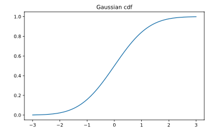
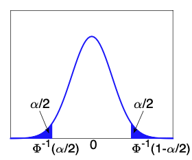

# 随机变量

*打开本页，如果不能显示公式，请刷新页面。*

在概率论，一个试验由下列三个概念组成 $$^{[3]}$$ ：

1. 样本空间 $$\Omega$$ 包含所有可能的实验结果，
2. 定义于 $$\Omega$$ 的所有事件，
3. 每一个事件的概率。

现实问题中，实验结果常被赋予可度量的性质。例如，考虑投掷一枚硬币 100 次，结果 $$\omega$$ 可用 $$H$$ (正面) 与 $$T$$ (反面) 所组成的长度为 $$100$$ 的字串表示。这个实验的样本空间 $$\Omega$$ 有 $$2^{100}$$ 个字串 (元素)。假设我们关心出现正面的次数，令函数 $$f(\omega)$$ 等于字串 $$\omega$$ 所含的 $$H$$ 的数量，例如，$$f(TT\cdots T)=0$$ ，$$f(HT\cdots T)=1$$ ，$$f(HH\cdots H)=100$$ 。函数 $$f$$ 的值域为 $$\{0,1,\ldots,100\}$$ 。对于 $$0\le k\le 100$$ ，存在 $$\binom{100}{k}$$ 个字串 $$\omega_i$$ 使得 $$f(\omega_i)=k$$ ，其中 $$\binom{100}{k}$$ 代表从 $$100$$ 个元素选取 $$k$$ 个元素的组合数。因此，$$\sum_{k=0}^{100}\binom{100}{k}=2^{100}$$ 。在建立概率模型时，以函数 $$f$$ 的值域取代样本空间有两个明显的好处：

- 第一，函数 $$f$$ 由我们所考虑的问题决定，据此建立的模型呈现问题情境。
- 第二，函数 $$f$$ 的值域是数组成的集合故而便利计算。我们在试验的样本空间 $$\Omega$$ 上制定的函数 $$f$$ 引申出概率学的一个核心概念，称为**随机变量** (random variable)。

随机变量 $$X$$ 是一个函数 $$X:\Omega\to\mathbb{R}$$。对于实验结果 $$\omega$$ ，$$X(\omega)$$ 表示所指定的一个数，$$X$$ 表示 $$\omega\to X(\omega)$$ 的指定规则。

随机变量一词很容易引起误解，称为「随机函数」比较恰当，原因是 $$X$$ 本身并非实验结果，而是 $$X$$ 的输入变量是一个实验结果。随机变量的值域设为实数，仅为配合多数的应用，并不具强制性。为了与一般的函数有所区隔，我们不以通用的函数记号 $$f$$ 表示随机变量。近代概率论或统计学常以斜体大写字母 $$X$$ 表示随机变量，而其实，它是一个向量。

## 离散随机变量

样本空间 $$\mathcal{X}$$​​ 有限或无限可数，则其随机变量 $$X$$ 称为离散随机变量。

**概率质量函数**（probability mass function, pmf）：

$$p(x)=P(X=x)$$

## 连续随机变量

**累积分布函数**（Cumulative distribution function, cdf）：

事件 $$A=(X\le a), B=(X\le b), C=(a\lt X\le b)$$ ，其中 $$a\lt b$$ ，则有 $$B=A\cup C$$ ，所有：

$$P(B)=P(A)+P(C)\Rightarrow P(C)=P(B)-P(A)$$

用随机变量定义累积分布函数：$$P(x)=P(X\le x)$$ ，则上式改写为：

$$P(a\lt X\le b)=P(b)-P(a)$$

例如，标准正态分布 $$N(x|0,1)$$ 的 cdf 图像（此 cdf 通常记作：$$\Phi(x)$$ ）：

**概率密度函数**（Probability density function, pdf）：

$$p(x)=\frac{d}{dx}P(x)$$

若已知 pdf ，计算连续随机变量的概率（有限区间）：

$$P(a\lt X\le b)=\int_{a}^bp(x)dx=P(b)-P(a)$$

**分位数**（quantile）

如果累积分布函数 $$P$$ 严格单调递增，则它有一个逆函数，称为 **cdf 逆**，或者**百分位函数**（ppf），或者**分位函数**。

如果 $$P$$ 是 $$X$$ 的累积分布函数，对于 $$P(X\le x_q)=q$$ 的逆是 $$P^{-1}(q)$$ ，称为 $$P$$ 的第 $$q$$ 分位。

- $$P^{-1}(0.5)$$ 是分布的中位数
- $$P^{-1}(0.25), P^{-1}(0.75)$$ 分别是上四分位和下四分位

例如标准正态分布 $$\Phi=N(0, 1)$$ ，点 $$\Phi^{-1}(\alpha/2)$$ 以左表示含 $$\alpha/2$$ 的概率质量。如下图所示

## 定理

**定理 1：**设 $$F(x)=P(X\le x)$$ 是 $$X$$ 的分布函数，则：

（1）$$F$$ 单调不减右连续；

（2）$$P(X\lt x)=F(x-), P(X= x)=F(x)-F(x-)$$ ； 

（3）$$\lim_{x\to\infty}F(x)=F(\infty)=1$$ ，$$\lim_{x\to-\infty}F(x)=F(-\infty)=0$$ ；

（4）$$F$$ 在点 $$x$$ 连续的充分必要条件是 $$P(X=x)=0$$

**证明**$$^{[2]}$$

（1）对 $$x\lt y$$ ，由 $$\{X\le x\}\sub\{X\le y\}$$ 得到：

$$F(x)=P(X\le x)\le P(X\le y)=F(y)$$

证明右连续。因为 $$F(x+\delta)$$ 关于 $$\delta$$ 单调有界，所以当 $$\delta\downarrow0$$ 时有极限，并且该极限等于其子序列的极限，集合 $$\{X\le x+1/n\}$$ 越小，所以用概率的连续性得到：

$$\begin{split}\lim_{\delta\downarrow0}F(x+\delta)&=\lim_{n\to\infty}F(x+1/n)\\&=\lim_{n\to\infty}P(X\le x+1/n)\\&=P(\cap_{n=1}^{\infty}\{X\le x+1/n\})\\&=P(X\le x)=F(x)\end{split}$$

说明 $$F(x)$$ 是右连续函数。

（2）因为 $$F(x-\delta)$$ 关于 $$\delta$$ 单调有界，所以当 $$\delta\downarrow0$$ 时有极限，并且该极限等于其子序列的极限，又因为 $$n$$ 越大，集合 $$X\le x-1/n$$ 越大，所以用概率的连续性得到：

$$\begin{split}F(x-)&=\lim_{x\to\infty}F(x-1/n)\\&=\lim_{n\to\infty}P（X\le x-1/n)\\&=P(\cup_{n=1}^{\infty}\{X\le x-1/n\})=P(X\lt x)\end{split}$$

且有 $$P(X=x)=P(X\le x)-P(X\lt x)=F(x)-F(x-)$$

（4）可由（2）得出。

## 参考资料

[1]. Kevin P. Murphy. *Probabilistic Machine Learning An Introduction*[M]:43-44. The MIT Press.

[2]. 概率引论. 何书元. 北京：高等教育出版社. 2012.1，第1版

[3]. [概率论的基本概念](./probability_term.html)
