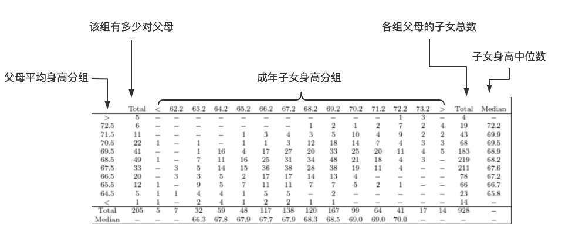
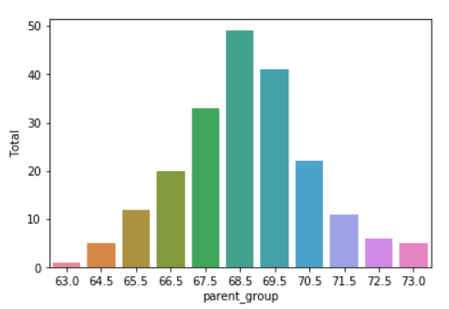
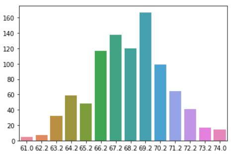
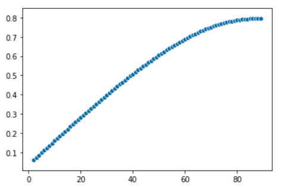
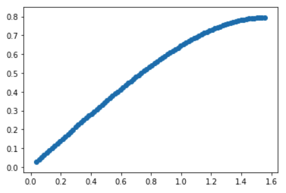
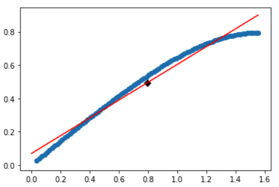
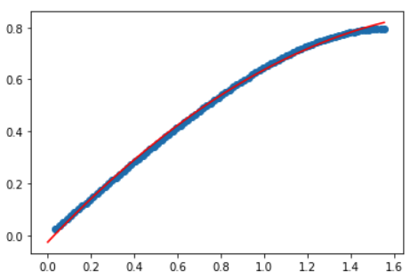
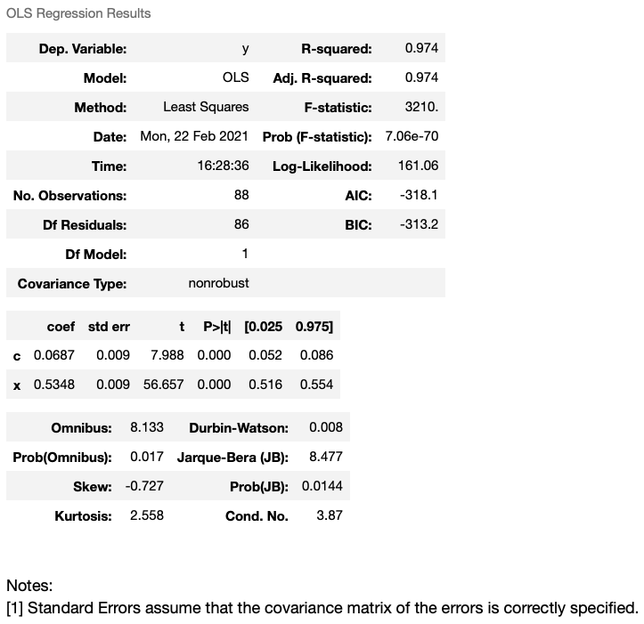
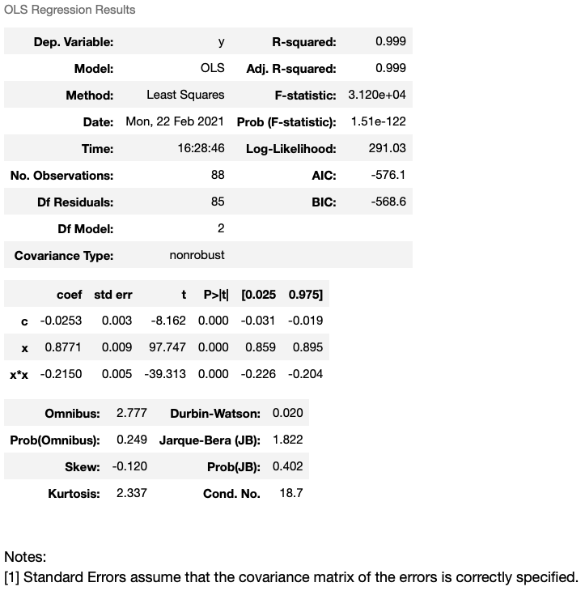

# 回归分析

*打开本页，如果没有显示公式，请刷新页面。*

在统计学中，经常要研究变量之间的关系。变量之间存在两种关系：

- 确定性，即变量之间可用函数关系来表达。比如：力（F）、质量（m）、加速度（a），这三个变量之间的关系可以用 F=ma 表示，就是熟知的牛顿第二定律。也可以说，经典物理基本思想，就是寻找宇宙世界的确定性的关系——上帝不掷骰子。
- 非确定性，即变量之间如果存在关系，通过统计学找到它们之间的相关关系，而非因果关系。比如有经济学家研究发现“女生夏天所穿裙子越短，经济越好”，在这个“研究成果”中，“裙子的长度”与“经济状况”之间，就不是因果关系，而是相关关系。统计结果展示的都是相关关系，相关关系是否能揭示因果性？还需要进一步研究。

回归分析是研究相关关系的一种数学工具，能够帮助我们从一个变量取得的值去估计另一个变量所取的值。

## 高尔顿的研究

最早对回归问题进行研究的是英国遗传学家高尔顿爵士（[Sir Francis Galton](https://en.wikipedia.org/wiki/Francis_Galton)）。1886年，他研究亲子身高的时候发现，父母与子女的身高虽然有相关性，但子女的身高具有“回归平均值”（regression toward the mean）的现象——简称“回归均值”。

<center></center>

<center>Sir Francis Galton (1822–1911)</center>

我们比较熟悉的“巨人”篮球明星姚明，据有关资料称姚明身高2米26，他的夫人叶莉身高1米90$$^{[1]}$$，不少人就此盼望他们的女儿会更高。根据高尔顿的研究，虽然高父母的子女身高一般也高，但往往比父母要矮。

高尔顿提出的“回归均值”，不仅是一个统计学概念，还表明从分布的边缘往中心移动是一个无可避免、持续不断的动态过程，从而致使正态分布成为与此过程一致的结果$$^{[2]}$$。英国统计学家皮尔逊（Karl Pearson）曾这样称赞高尔顿的工作：

> 高尔顿对我们的科学观念发动一场革命，修正了我们的科学哲学，甚至校订了人生$$^{[3]}$$。

下面的表格，是高尔顿研究亲子身高所用的数据（单位：英寸）$$^{[4]}$$：





- 最左边一列，表示“父母平均身高分组”。左起第二列（Total）表示对应分组中有多少对父母，例如“父母平均身高分组”中的 $$71.5$$ ，对应“Total”列中的 $$11$$ ，意味着在该分组中有 $$11$$ 对父母。用图像表示这两组数据的关系（注：以下数据中，$$73$$ 表示大于 $$72.5$$ 的组，$$63$$ 表示小于 $$64.5$$ 的组）。

  ```python
  import pandas as pd
  import seaborn as sns
  
  df = pd.DataFrame({'parent_group':[73, 72.5, 71.5, 70.5, 69.5, 68.5, 67.5, 66.5, 65.5, 64.5, 63], 
                     "Total":[5, 6, 11, 22, 41, 49, 33, 20, 12, 5, 1]})
  sns.barplot(x="parent_group", y="Total", data=df)
  ```

  输出图像

  

  从图像结果可知，所研究的父母身高是呈正态分布。

- 用类似的方法，还可以研究“成年子女身高分组”中每组人数（上述数据表中底起第二行“Total”）的分布特点。

  ```python
  child_df = ({'group':[61, 62.2, 63.2, 64.2, 65.2, 66.2, 67.2, 68.2, 69.2, 70.2, 71.2, 72.2, 73.2, 74],
              'Total':[5, 7, 32, 59, 48, 117, 138, 120, 167, 99, 64, 41, 17, 14]})
  sns.barplot(x='group', y='Total', data=child_df)
  ```

  输出图像

  

  亦为正态分布。

- 再从数据表中数据分布特点，从左下角到右上角，呈对角分布，说明父母与子女的身高具有正相关性，

- 但是，如果比较数据表中最右一列“子女身高中位数”和最左列“父母平均身高分组”，会发现，在父母平均身高组 $$68.5$$ 及其以上的行中，子女的身高中位数小于父母平均身高；在此组以下的行中，子女的身高中位数大于父母的平均身高。这就呈现了“回归均值”的现象。

为什么会出现“回归均值”现象？高尔顿做了解释，他认为“孩子的遗传一部分得自父母，一部分得自祖先。一般而言，族谱向上追溯愈久远，祖先人数愈多，也更加多样化，最后就跟采自任何种族，人数一样多的任意样本，没有什么差别”$$^{[5]}$$ 。从现代的角度来看，高尔顿的解释并不正确，因为子女从父母那里得到遗传基因，祖先的遗传是通过父母遗传给子女的。那么，身高“回归均值”的现象应该如何解释？我想这已经超出了本文所探讨的范围，最具说服力的解释应该由专门的遗传学研究者做出。

如果从统计学角度，可以这样解释$$^{[5]}$$——也仅仅是从数量关系上进行解释，而非因果性解释。

设数据样本 $$\{x_i, y_i\}$$ ，$$x_i$$ 表示父母的身高，$$y_i$$ 表示子女的升高，根据线性回归，可得：

$$\frac{\hat{y}-\overline{y}}{\sigma_y}=\rho\frac{x-\overline{x}}{\sigma_x}$$

其中 $$\rho$$ 为 $$x_i$$ 和 $$y_i$$ 的相关系数。通常 $$-1\lt\rho\lt1$$ ，所以子女的身高相对平均值的差不会超过父母身高相对均值的差。但，这个结论的前提是已经承认了“回归均值”现象，依据 $$y=\alpha+\beta x$$ 线性回归的假设而得到结论，并非因果性上的完全解释。

## 相关性

回归分析，研究的是变量之间的相关性。

### 样本相关系数

抽样调查数据、科学实验数据或者生产中得到的数据，在统计学中统称为**观测数据**或**样本**。样本的数量称为**样本量**。

通常用 $$(x_i, y_i),(i=1,2,\cdots,n)$$ 表示 $$n$$ 个样本。对于固定的 $$i$$ ，$$x_i$$ 和 $$y_i$$ 或来自相同的个体，或是同一次试验的观测数据。

其他常用符号$$^{[10]}$$：

- 样本均值：$$\overline{x}=\frac{1}{n}\sum_{i=1}^nx_i, \overline{y}=\frac{1}{n}\sum_{i=1}^ny_i$$
- 样本方差：$$s_x^2=\frac{1}{n-1}\sum_{i=1}^n(x_i-\overline{x})^2,s_y^2=\frac{1}{n-1}\sum_{i=1}^n(y_i-\overline{y})^2$$ 
- 样本标准差：$$s_x=\sqrt{s_x^2},s_y=\sqrt{s_y^2}$$ ，此处和上面一条中的 $$s$$ 也可以用符号 $$\sigma$$ 表示
- 样本协方差：$$s_{xy}=\frac{1}{n-1}\sum_{i=1}^n(x_i-\overline{x})(y_i-\overline{y})$$
- 样本 $$\{x_i\}$$ 和 $$\{y_i\}$$ 的相关系数：$$\rho_{xy}=\frac{s_{xy}}{s_xs_y}$$ ，其中 $$s_xs_y\ne0$$

*注意，样本方差和样本标准差的计算中，分母是 $$n-1$$ ，不是 $$n$$ 。对此的推导过程，请参阅《机器学习数学基础》第6章6.1.2节。*

> **定义**    设 $$\rho_{xy}$$ 是 $$\{x_i\}$$ 和 $$\{y_i\}$$ 的相关系数：
>
> 1. 当 $$\rho_{xy}\gt0$$ ，称 $$\{x_i\}$$ 和 $$\{y_i\}$$ **正相关**；
> 2. 当 $$\rho_{xy}\lt0$$ ，称 $$\{x_i\}$$ 和 $$\{y_i\}$$ **负相关**；
> 3. 当 $$\rho_{xy}=0$$ ，称 $$\{x_i\}$$ 和 $$\{y_i\}$$ **不相关**。

相关系数 $$\rho_{xy}$$ 具有如下性质：

- 在区间 $$[-1,1]$$ 中取值；
- 当 $$|\rho_{xy}|=1$$ 时，样本 $$(x_i,y_i)(i=1,2,\cdots,n)$$ 在同一条直线上；
- 当 $$\rho_{xy}$$ 接近 $$1$$ 时，$$x$$ 增加，$$y$$ 也倾向于增加，样本数据分散在一条上升的直线附件；
- 当 $$\rho_{xy}$$ 接近 $$-1$$ 时，$$x$$ 增加，$$y$$ 也倾向于减少，样本数据分散在一条下降的直线附件。

在实际问题中，通常：

- 当 $$|\rho_{xy}|\ge0.8$$ 时，认为 $$\{x_i\}$$ 和 $$\{y_i\}$$ 高度相关；
- 当 $$0.5\le|\rho_{xy}|\lt0.8$$ 时，认为 $$\{x_i\}$$ 和 $$\{y_i\}$$ 中度相关；
- 当 $$0.3\le|\rho_{xy}|\lt0.5$$ 时，认为 $$\{x_i\}$$ 和 $$\{y_i\}$$ 低度相关；
- 当 $$|\rho_{xy}|\lt0.3$$ 时，认为 $$\{x_i\}$$ 和 $$\{y_i\}$$ 相关性极弱。

### 相关性检验$$^{[10]}$$

如果随机向量 $$[X_i,Y_i](i=1,2,\cdots,n)$$ 相互独立，并且和 $$[X,Y]$$ 同分布，则称 $$[X_i,Y_i]$$ 是总体 $$[X,Y]$$ 的 **样本**，称相应的观测值 $$(x_i, y_i),(i=1,2,\cdots,n)$$ 为总体 $$[X,Y]$$ 的**样本观测值**。

随机变量 $$X$$ 和 $$Y$$ 相关系数（*参阅《机器学习数学基础》第5章5.5.2节*）：

$$\rho_{XY}=\frac{E[(X-E[X])(Y-E[Y])]}{\sqrt{Var(X)Var(Y)}}$$

样本相关系数：

$$\rho_{xy}=\frac{s_{xy}}{s_xs_y}$$

> **定理**    设 $$(x_i, y_i),(i=1,2,\cdots,n),n\gt2$$ 是总体 $$[X,Y]$$ 的样本观测值，如果 $$[X,Y]$$ 服从联合正态分布，则在 $$H_0:\rho_{XY}=0$$ 下：
>
> $$T=\rho_{xy}\sqrt{\frac{n-2}{1-\rho_{xy}^2}}\sim t(n-2)$$
>
> （此定理的证明，请参阅参考文献[10]中的习题8.1.6的答案（301页）)

在实际问题中，有时需要检验：

$$H_0:\rho_{XY}=0\quad vs\quad H_1:\rho_{XY}\ne0$$

如果拒绝 $$H_0$$ ，则认为 $$X,Y$$ 是相关的。

若 $$H_0$$ 成立，$$|\rho_{xy}|$$ 取值较小，从而 $$|T|$$ 取值较小，于是上述假设检验的显著性水平为 $$\alpha$$ 的拒绝域是：

$$|T| \gt t_{\alpha/2}(n-2)$$

## 线性回归

当 $$\{x_i\}$$ 和 $$\{y_i\}$$ 高度相关时，样本观测值会分散在一条直线附件。这条直线叫做**回归直线**。

显然，此处的“回归”已经不是高尔顿所研究的“回归均值”的回归含义了。

### 函数形式

设随机变量 $$Y$$ 和 $$X$$ 之间存在相关关系，在实际问题中，我们通过观测，能够得到一系列的数据 $$(x_i, y_i),(i=1,2,\cdots,n)$$ ，也就是 $$(X,Y)$$ 的具体值，即样本。一般来讲，观测行为是可控的，所以 $$X$$ 的值不是“随机”，而是可控或可精确测量的，于是它就等同于普通的变量了，可以用小写字母 $$x$$ 表示。

于是，模型所反映的就是随机变量 $$Y$$（因变量）与自变量 $$x$$ 之间的关系$$^{[6]}$$。

对应于自变量 $$x$$ ，理论上 $$Y$$ 会有一个分布——注意前面已经假设它们之间有相关关系，虽然这个分布我们还不知道，可以假设为 $$F(Y)$$ ，但找到这个分布太麻烦了。

于是，我们做了一种近似处理，以 $$Y$$ 的期望 $$E(Y)$$ 代替 $$F(Y)$$ 。

若 $$E(Y)$$ 存在，它的值随着 $$x$$ 的取值而变化，是 $$x$$ 的函数，记作：$$\mu(x)$$ 。

那么，如何知道 $$\mu(x)$$ 的具体形式？就需要通过样本数据 $$(x_i, y_i),(i=1,2,\cdots,n)$$ 进行估计。例如下面的数据，这些数据是我用一种神秘方法创建的，假设是通过精密仪器做的物理实验，并观测到的实验数据。

```python
alpha0

# 输出
array([ 2,  3,  4,  5,  6,  7,  8,  9, 10, 11, 12, 13, 14, 15, 16, 17, 18,
       19, 20, 21, 22, 23, 24, 25, 26, 27, 28, 29, 30, 31, 32, 33, 34, 35,
       36, 37, 38, 39, 40, 41, 42, 43, 44, 45, 46, 47, 48, 49, 50, 51, 52,
       53, 54, 55, 56, 57, 58, 59, 60, 61, 62, 63, 64, 65, 66, 67, 68, 69,
       70, 71, 72, 73, 74, 75, 76, 77, 78, 79, 80, 81, 82, 83, 84, 85, 86,
       87, 88, 89])
       
beta

# 输出
array([0.06004102, 0.0724812 , 0.08491049, 0.09732699, 0.10972878,
       0.12211393, 0.13448049, 0.14682649, 0.15914995, 0.17144884,
       0.18372111, 0.19596471, 0.20817751, 0.22035739, 0.23250217,
       0.24460963, 0.25667753, 0.26870357, 0.28068541, 0.29262065,
       0.30450686, 0.31634154, 0.32812215, 0.33984607, 0.35151064,
       0.36311313, 0.37465073, 0.38612059, 0.39751977, 0.40884525,
       0.42009395, 0.4312627 , 0.44234825, 0.45334726, 0.46425633,
       0.47507195, 0.4857905 , 0.49640832, 0.5069216 , 0.51732646,
       0.52761893, 0.53779493, 0.54785028, 0.55778069, 0.56758179,
       0.57724908, 0.58677799, 0.59616384, 0.60540183, 0.61448709,
       0.62341465, 0.63217944, 0.64077631, 0.64920002, 0.65744528,
       0.66550669, 0.67337881, 0.68105615, 0.68853316, 0.69580427,
       0.70286386, 0.70970633, 0.71632606, 0.72271745, 0.72887493,
       0.73479299, 0.74046617, 0.7458891 , 0.7510565 , 0.75596322,
       0.76060426, 0.76497477, 0.76907007, 0.77288572, 0.77641746,
       0.77966131, 0.78261353, 0.78527068, 0.7876296 , 0.78968748,
       0.7914418 , 0.79289044, 0.79403158, 0.79486383, 0.79538614,
       0.79559786, 0.79549871, 0.79508883])
```

要想得到反应`alpha0`和`beta`之间关系的 $$\mu(x)$$ 的具体函数形式，应该首先绘制它们的散点图。

```python
import seaborn as sns
sns.scatterplot(x=alpha0, y=beta)
```

输出图像：



再根据专业知识，猜测函数形式。

然后用本实验的其他观测数据进行验证。

在无数个 $$\mu(x)$$ 的具体形式中，以线性函数最为简单——不讨论常函数形式。

之所以要找一个最简单的进行讨论，是因为我们解决问题的基本思想，就是从简单开始，逐步尝试；再者，我们还认同这样一种思想：复杂问题可以分解为局部的简单问题，将每个简单问题解决了，作为整体的复杂问题就解决了——有人称这是机械唯物主义。不管怎样，这种“分而治之”的分治法，是现在科学技术领域行之有效的基本方法和思想。

所以，就从简单的线性回归模型开始，并且这种模型，也是符合前面所提及的两个变量高度相关的模型。其函数形式为：

$$\pmb{y}=\beta_0+\beta_1\pmb{X}+\epsilon \tag{1}$$

令 $$Y$$ 是一维向量 $$\pmb{y}$$ ，$$\epsilon$$ 表示随机误差，它是人不可控的，任何观测（比如物理学中的测量）都会有误差，并且假设

 $$\epsilon\sim N(0, \sigma^2)$$ 。

如果以样本 $$(x_i, y_i),(i=1,2,\cdots,n)$$ 为例，即 $$\pmb{X}=x$$ ，（1）式可以进一步简化为：

$$y=\beta_0+\beta_1{x}+\epsilon \tag{2}$$

（2）式所表示的函数中，只有一个自变量，这样的线性回归模型称为**一元线性回归模型**，是线性回归模型中最简单的一种。则：

$$E(y|x) = \beta_0+\beta_1{x}$$

$$Var(y|x)=\sigma^2$$

这里的参数 $$\beta_0,\beta_1,\sigma^2$$ 都未知，$$\epsilon$$ 不可观测。需要利用观测到的样本数据，估计出未知参数。这在机器学习中，就是训练（学习）过程。参数确定之后，即得到了一个机器学习模型。

### 最小二乘法

**《机器学习数学基础》第3章3.6节**对此方法进行了专门阐述，请参考（此书2021年5月由电子工业出版社出版）。这里引用书中的（3.6.6）式和（3.6.7）式：

$$\pmb{X\beta}=\pmb{y}\tag{3.6.6}$$

$$\pmb{X}^T\pmb{X\hat{\beta}}=\pmb{X}^T\pmb{y} \tag{3.6.7}$$

（3.6.7）式是（3.6.6）式的正规方程，由它可以得到参数 $$\pmb{\beta}$$ 的估计值 $$\pmb{\hat{\beta}}$$ 。对照（2）式，$$\pmb\beta=\begin{bmatrix}\beta_0\\\beta_1\end{bmatrix}$$ 。

此外，在**《机器学习数学基础》第4章4.3.2节**，从最优化角度对最小二乘法进行了探讨。并在4.3.3节，运用最小二乘法解决线性回归问题，也得到了（3.6.7）式的正规方程。

### 最大似然估计

《机器学习数学基础》第6章6.2.2节，运用最大似然估计法，得到了线性回归模型中权重（即（2）式中的 $$\beta_1$$ ）和偏置（即（2）式中的 $$\beta_0$$ ）的值，此外，还估计了方差 $$\sigma^2$$ 。

在《机器学习数学基础》中对线性回归的讨论，根据有普遍性。这里参考文献[6]，只演示一元线性回归的参数估计和假设检验等问题，目的是：

- 以最简单的模型为基础，进一步理解《机器学习数学基础》中的一般性推导
- 以一元线性回归为例，了解统计模型和机器学习模型的异同

设 $$y\sim N(\beta_0+\beta_1x, \sigma^2)$$ ，其中 $$\beta_0, \beta_1, \sigma^2$$ 都是不依赖于 $$x$$ 的未知参数。

（2）式中的随机误差 $$\epsilon = y-(\beta_0+\beta_1x)$$ ，由于设 $$y$$ 正态分布，所以：

$$y=\beta_0+\beta_1x+\epsilon, \quad\epsilon\sim N(0, \sigma^2) \tag{3}$$

$$\beta_0$$ 、$$\beta_1$$ 称为回归系数。

对于某观测数据 $$(x_i, y_i),(i=1,2,\cdots,n)$$ ，根据（3）式和最大似然估计（请参阅《机器学习数学基础》第6章6.2节），可得：

$$\begin{split}L&=\prod_{i=1}^n\frac{1}{\sigma\sqrt{2\pi}}\exp\left[-\frac{1}{2\sigma^2}(y_i-\beta_0-\beta_1x_i)^2\right]\\&=\left(\frac{1}{\sigma\sqrt{2\pi}}\right)^n\exp\left[-\frac{1}{2\sigma^2}\sum_{i=1}^n(y_i-\beta_0-\beta_1x_i)^2\right]\end{split}$$

要取得 $$L$$ 的最大值，只需要取（4）式的最小值：

$$Q(\beta_0, \beta_1)=\sum_{i=1}^n(y_i-\beta_0-\beta_1x_i)^2) \tag{4}$$

去 $$Q$$ 对 $$\beta_0,\beta_1$$ 的偏导数，并令为 $$0$$ ：

$$\begin{cases}\frac{\partial Q}{\partial\beta_0}=-2\sum_{i=1}^n(y_i-\beta_0-\beta_1x_i)=0\\\frac{\partial Q}{\partial\beta_1}=-2\sum_{i=1}^n(y_i-\beta_0-\beta_1x_i)x_i=0\end{cases}\tag{5}$$

解得：

$$\begin{cases}n\beta_0+\left(\sum_{i=1}^nx_i\right)\beta_1=\sum_{i=1}^ny_i\\(\sum_{i=1}^nx_i)\beta_0+(\sum_{i=1}^nx_i^2)\beta_0=\sum_{i=1}^nx_iy_i\end{cases}\tag{6}$$

对于观测数据，$$x_i$$ 不完全相同，所以（6）式的系数行列式：

$$\begin{vmatrix}n&\sum_{i=1}^nx_i\\\sum_{i=1}^nx_i&\sum_{i=1}^nx_i^2\end{vmatrix}=n\sum_{i=1}^nx_i^2-(\sum_{i=1}^nx_i)^2=n\sum_{i=1}^n(x_i-\overline{x})^2\ne0$$

故（6）式有唯一解，即 $$\beta_0,\beta_1$$ 的估计值为：

$$\begin{cases}\hat{\beta_1}=\frac{n\sum_{i=1}^nx_iy_i-(\sum_{i=1}^nx_i)(\sum_{i=1}^ny_i)}{n\sum_{i=1}^nx_i^2-(\sum_{i=1}^nx_i)^2} \\ \hat{\beta_0}=\frac{1}{n}\sum_{i=1}^ny_i-\frac{\hat{\beta_1}}{n}\sum_{i=1}^nx_i=\overline{y}-\hat{\beta_1}\overline{x}\end{cases}\tag{7}$$

其中 $$\overline{x}=\frac{1}{n}\sum_{i=1}^nx_i, \overline{y}=\frac{1}{n\sum_{i=1}^ny_i}$$ 。

于是得到经验回归方程：

$$\hat{y}=\hat{\beta}_0+\hat{\beta}_1x \tag{8}$$

将（7）式中的 $$\hat{\beta}_0$$ 代入到（8）式，得：

$$\hat{y}=\overline{y}+\hat{\beta}_1(x-\overline{x})\tag{9}$$

（8）式说明一元线性回归图像是一条直线，（9）式说明样本值 $$(x_i, y_i)$$ 的回归直线必然通过散点图的中心 $$(\overline{x}, \overline{y})$$ 。

如果使用前述的样本方差和和协方差等符号，可以将（7）式改写为：

$$\begin{cases}\hat{\beta}_1=\frac{x_{xy}}{s_x^2}\\\hat{\beta}_0=\overline{y}=\beta_1\overline{x} \tag{10}\end{cases}$$

至此，已经得到一元线性回归模型的回归系数。对于上述过程：

- 如果利用训练集数据 $$(x_i, y_i)$$ ，得到了 $$\beta_0,\beta_1$$ 的估计值，即（8）式，就可以用它对其它 $$x_j$$ 进行预测，得到对应的预测值 $$\hat{y}_j$$ 。这就是机器学习的学习过程和最终目的。对模型的评价，也就是参数的好坏，可以利用测试集数据，对预测结果进行评估，例如使用scikit-learn中的评估函数实现。
- 从如果将（8）式作为统计模型，为了确认所得估计参数的，需要进一步通过假设检验来确定。另外，在统计模型中，参数 $$\sigma^2$$ 作为统计量，也需要估计。

以上二者比较，显示了一元线性回归方程分别作为统计模型和机器学习模型的差异。

### 用程序实现参数估计

如果使用最小二乘法实现一元线性回归系数估计，即（10）式的结果，可以使用`statsmodels`中提供`OLS`，即“普通最小二乘法（Ordinary Least Squares）”。

使用的数据就是前面绘制散点图使用的`alpha0`和`beta`。现在稍微透露一下这两组数据的含义，这两组输入来自于光的折射实验（虚拟的），其中`alpha0`表示入射角（角度为单位），`beta`表示折射角（弧度为单位），为了单位统一，将`alpha0`的角度转化为弧度。

```python
alpha = alpha0*np.pi/180
```

不过，上面的操作不用真正实现。因为已经透露了天机，那么就应该将上述两组实验数据产生方法展示出来（但是，我们还要假装不知道样本之间的关系）：

```python
import numpy as np
import pandas as pd
import matplotlib.pyplot as plt
alpha = np.arange(2,90)*np.pi/180+np.random.rand()/10
beta = np.arcsin(np.sin(alpha)/1.4)

fig, ax = plt.subplots()
ax.scatter(alpha, beta)
```

输出图像：



然后用上述数据，利用`statsmodels`中的·.OLS`得到一元线性回归模型。

```python
import statsmodels.api as sm
X = pd.DataFrame({'c': np.ones(len(alpha)), 'x': alpha})
model = sm.OLS(beta, X)
r = model.fit()
r.params

# 输出
c    0.068711
x    0.534783
dtype: float64
```

现在所得到的两个输出值，一个是偏置 $$\beta_0=0.068711$$ ，另外一个是 $$\beta_1=0.534783$$ ，即所得到的的一元线性回归方程是：

$$y =  0.068711 + 0.534783x$$

```python
coe = r.params
fig, ax = plt.subplots()

ax.scatter(alpha, beta)

x = np.linspace(0, alpha[-1], 100)
y = coe['c'] + coe['x']*x
ax.plot(x,y, color='red')

x_mean = np.mean(alpha)
y_mean = np.mean(beta)
ax.scatter(x_mean, y_mean, marker="D", color='black')
```

输出图像：



图中的黑色菱形点，对应着（9）式所说明的意义。

从对图示的观察可知，如果用现在所得到的一元线性回归模型作为机器学习模型，对于数据`(alpha, beta)`而言，并不是一个好模型。

> **定理**    设 $$(x_i,Y_i)(i=1,2,\cdots,n)$$ 满足一元线性回归模型 $$Y_i=\beta_0+\beta_1x_i+\epsilon$$ ，对于 $$\hat\beta_0,\hat\beta_1,\hat\sigma^2$$ ，有：
>
> 1. $$\hat\beta_1\sim N(\beta_1, \frac{\sigma^2}{l_{xx}})$$
> 2. $$\hat\beta_0\sim N\left(\beta_0, \left[\frac{1}{n}+\frac{\overline{x}^2}{l_{xx}}\right]\sigma^2\right)$$
> 3. $$\frac{n-2}{\sigma^2}\hat\sigma^2 \sim\chi^2(n-2)$$
> 4. $$\overline{Y},\hat\beta_1,\hat\sigma^2$$ 相互独立
> 5. $$\frac{\hat\beta_1-\beta_1}{\hat\sigma/\sqrt{l_{xx}}}$$
>
> 其中，$$l_{xx}=\sum_{i=1}^n(x_i-\overline{x})^2=(n-1)s_x^2$$

（上述定理的证明，请参阅参考文献[6]的263页和参考文献[10]的225页。）

除了估计回归系数之外，在严格的统计学中，还要估计 $$\sigma^2$$ ，并进行相关的假设检验，并给出置信区间。这些内容通常依据上述定理中各参数分布特点解决。

### 拟合二次曲线

像上面图示显示，所得到的模型与原数据集的分布差别较大，称为“欠拟合”。这说明我们选择的模型有问题。观察散点图，可能会想到，应该使用：

$$y = \beta_0+\beta_1x+\beta_2x^2$$ 

对于这种模型，其图像不是直线，但依然可以使用最小二乘法实现拟合。

```python
X2 = pd.DataFrame({'c': np.ones(len(alpha)), 'x': alpha, 'x*x':alpha*alpha})
r2 = sm.OLS(beta, X2).fit()
r2.params

# 输出
c     -0.025320
x      0.877092
x*x   -0.214953
dtype: float64
```

得到系数之后，看一看结果如何：

```python
coe = r2.params
fig, ax = plt.subplots()

ax.scatter(alpha, beta)

x = np.linspace(0, alpha[-1], 100)
y = coe['c'] + coe['x']*x + coe['x*x']*x*x
ax.plot(x,y, color='red')
```

输出图像：



观察发现，现在的模型与原数据集的分布，拟合得很好，除了在右上角偏差似乎大点——天空中的一小朵乌云。

然而，直觉观察不能代替严谨的评估。

对于前面训练所得到的`r`和`r2`两个模型，`statsmodels`中为它们提供的方法，查看有关评估结果。

```python
r.summary()
```

输出：



```python
r2.summary()
```

输出：



上面输出结果，就是对模型的统计评估结果。各项的含义分别是$$^{[8]}$$：

| Element          | Description                    |
| ---------------- | ------------------------------ |
| Dep. Variable    | 模型中的响应变量               |
| Model            | 用于训练的模型名称             |
| Method           | 模型的参数用什么方法计算       |
| No. Observations | 观测数据的数量，即样本数量     |
| DF Residuals     | 残差的自由度                   |
| DF Model         | 模型中参数的个数（不含常数项） |
| **R-squared**      | [判定系数](http://en.wikipedia.org/wiki/Coefficient_of_determination)，也称为“拟合度”。回归结果逼近真实值的统计量，范围在 $$[0,1]$$ 之间，越大表示模型拟合得越好 |
| **Adj. R-squared** | 根据观察次数和残差的自由度调整以上值 |
| F-statistic        | 模型训练有效度。 模型的均方误差除以残差的均方误差 |
| Prob (F-statistic) | 零假设下，得到上述统计量的概率 |
| Log-likelihood     | 似然函数对数                    |
| AIC                | 赤池信息准则（[Akaike Information Criterion](http://en.wikipedia.org/wiki/Akaike_information_criterion)，简称：AIC）$$^{[9]}$$ 。 根据观察次数和模型的复杂性调整对数似然度。 |
| BIC                | 贝叶斯信息准则（[Bayesian Information Criterion](http://en.wikipedia.org/wiki/Bayesian_information_criterion)），类似AIC，但是如果模型参数更多，会提高惩罚项权重。 |
| coef                       | 回归系数估计值             |
| std err                    | 回归系数估计值的标准误差 |
| t                          | t检验值。度量统计学上重要程度的量。 |
| `P > t`          | P值。零假设是回归系数为0，通常小于0.05，拒绝零假设，即自变量和相应变量之间存在统计上的显著相关。 |
| [95.0% Conf. Interval] | 95%置信区间的上下限。 |
| Skew      | 偏度。以均值为中心的数据对称性的度量。 正态分布的误差应围绕均值对称分布。 |
| Kurtosis      | 峰度。分布形状的度量。 比较接近均值的数据量和远离均值的数据量（尾部）。 |
| Omnibus       | D’Angostino检验。 它提供了偏度和峰度的组合统计检验。 |
| Prob(Omnibus) | 将上面结果转换为概率    |
| Jarque-Bera   | 对偏度和峰度的另外一种检验。 |
| Prob (JB)     | 上面统计量结果转换为概率 |
| Durbin-Watson | 自相关检验。在时间序列分析中通常很重要 |
| Cond. No      | 多重共线性检验（如果与多个参数拟合，则参数彼此相关） |

如此，即可实现统计中的线性回归模型构建。

从上面的评估结果中可以看到，目前用二次曲线拟合，已经能够在相当好的程度上体现了两个变量之间的关系——特别强调，现在我们得到的是相关关系。

那么，相关关系是否就是因果关系？尚需进一步研究。


## 机器学习中的回归


## 参考文献

[1]. [https://baike.baidu.com/item/姚沁蕾/531809](https://baike.baidu.com/item/姚沁蕾/531809)

[2]. [https://ccjou.wordpress.com/2014/06/10/回歸均值/](https://ccjou.wordpress.com/2014/06/10/%e5%9b%9e%e6%ad%b8%e5%9d%87%e5%80%bc/)

[3]. Peter L Bernstein, *Against the Gods:The Remarkable Story of Risk*, 1996. 原文是 “Galton had created a revolution in our scientific ideas  [that] has modified our philosophy of science and even of life itself.”

[4]. Francis Galton, Regression towards mediocrity in hereditary stature, *Journal of the Anthropological Institute*, 15, pp 246-263 ,1886.

[5]. [Regression toward the mean](http://en.wikipedia.org/wiki/Regression_toward_the_mean) 原文是 “A child inherits partly from his parents, partly from his  ancestors. Speaking generally, the further his genealogy goes back, the  more numerous and varied will his ancestry become, until they cease to  differ from any equally numerous sample taken at haphazard from the race at large.” 

[6]. 概率论与数理统计. 盛骤等. 北京：高等教育出版社. 2008.6，第4版

[7]. 机器学习数学基础. 齐伟. 北京：电子工业出版社. （预计2021年5月出版）

[8]. https://www.datarobot.com/blog/ordinary-least-squares-in-python/

[9]. 赤池信息准则（AIC）是预测误差的估计值，是给定数据集的统计模型的相对质量。AIC估计给定模型丢失的相对信息量：模型丢失的信息越少，该模型的质量越高。AIC是由日本统计学家Hirotugu Akaike制定的。现在，它构成了统计基础范例的基础，并且也广泛用于统计推断。https://en.wikipedia.org/wiki/Akaike_information_criterion

[10]. 数理统计. 何书元. 北京：高等教育出版社. 2012.1，第1版


