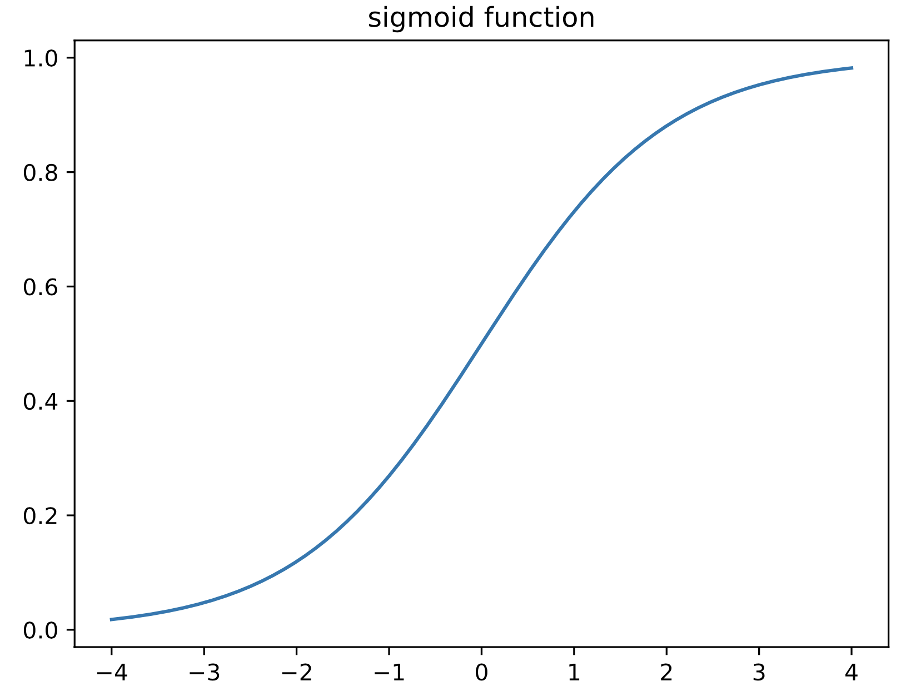
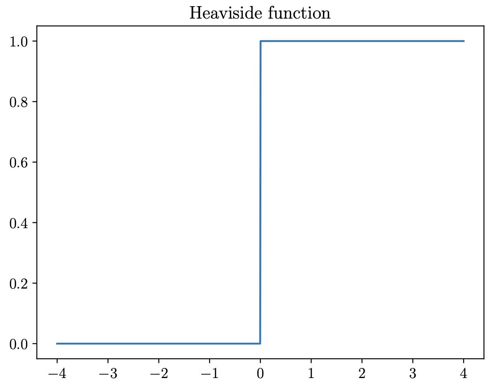

# Sigmoid 函数和 Logistic 回归

Sigmoid 函数和 Logistic 回归是与伯努利分布有关的函数，关于伯努利分布的基本内容，参阅《机器学习数学基础》。

## Sigmoid 函数

Sigmoid 函数也称为 logistic 函数。

若根据给定的输入 $$\pmb{x}\in\mathcal{X}$$ ，预测二值输出 $$y\in\{0,1\}$$ ，可以通过条件概率分布：

$$p(y|\pmb{x},\pmb{\theta})={\rm{Ber}}(y|f(\pmb{x};\pmb{\theta}))$$

其中 $$f(\pmb{x};\pmb{\theta})$$​ 是预测的输出分布函数，它可以有很多不同的具体形式。为了避免使用 $$0\le f(\pmb{x};\pmb{\theta})\le1 $$​ 约束条件，可以改一个无约束的函数，​即：

$$p(y|\pmb{x},\pmb{\theta})={\rm{Ber}}(y|\sigma(f(\pmb{x};\pmb{\theta})))$$

上式的函数 $$\sigma(\cdot)$$ 就是**sigmoid 函数**或**logistic 函数**，其具体函数形式如下：

$$\sigma(\alpha)=\frac{1}{1+e^{-\alpha}}$$

其中 $$\alpha=f(\pmb{x};\pmb{\theta})$$ ，其函数曲线如下图所示，即为 S 形状。

易知，上述函数的值域是 $$[0,1]$$​​​ ，它符合作为概率的输出值范围（所以，伯努利参数有一个有效值）。换个角度看，Sigmoid 函数也可以看成是**亥维赛阶梯状函数**（Heaviside step function）的“柔软化”。如下，是亥维赛阶梯函数定义和图示。

$$H(\alpha)=\mathbb{I}(\alpha\gt0)$$​​

将 Sigmoid 函数代入到前面所定义的伯努利分布 $$p(y|\pmb{x},\pmb{\theta})={\rm{Ber}}(y|\sigma(f(\pmb{x};\pmb{\theta})))$$ 中，得：

$$p(y=1|\pmb{x};\pmb{\theta})=\frac{1}{1+e^{-\alpha}}=\frac{e^{\alpha}}{1+e^{\alpha}}=\sigma(\alpha)$$

$$p(y=0|\pmb{x};\pmb{\theta})=1-\frac{1}{1+e^{-\alpha}}=\frac{e^{-\alpha}}{1+e^{-\alpha}}=\frac{1}{1+e^{\alpha}}=\sigma(-\alpha)$$​

上式中的 $$\alpha$$​​​ 称为**对数几率**（log odds）：$$\log\frac{p}{1-p}$$​ ，其中 $$p=p(y=1|\pmb{x};\pmb{\theta})$$​ ，即：

$$\log\frac{p}{1-p}=\log\left(\frac{e^{\alpha}}{1+e^{\alpha}}\cdot\frac{1+e^{\alpha}}{1}\right)=\log(e^{\alpha})=\alpha$$​​

**注：**正是因为上述原因，logistic 函数不能翻译为“逻辑函数”，也因此，在周志华的《机器学习》一书中，将 logistic 回归译为“对数几率回归”。

因此，对数几率 $$\alpha$$​ 与 $$p$$ 之间形成的映射关系，称为 **logistic 函数**，其函数形式为：

$$p={\rm{logistic}}(\alpha)=\sigma(\alpha)=\frac{e^{\alpha}}{1+e^\alpha}$$

取上式的逆（反函数），得到的函数称为 **logit 函数**，显然此函数值域是 $$[0,1]$$：

$$\alpha={\rm{logit}}(p)=\sigma^{-1}(\alpha)=\log\left(\frac{p}{1-p}\right)$$

以下关于 Sigmoid 函数的性质和有关计算：

$$\begin{split}\sigma(x)&:=\frac{1}{1+e^{-x}}=\frac{e^x}{1+e^x}\\\frac{d}{dx}\sigma(x)&=\sigma(x)(1-\sigma(x))\\1-\sigma(x)&=\sigma(-x)\\\sigma^{-1}(p)&=\log\left(\frac{p}{1-p}\right):={\rm{logit}}(p)\\\sigma_+(x)&:=\log(1+e^x):={\rm{softplus}}(x)\\\frac{d}{dx}\sigma_+(x)&=\sigma(x)\end{split}$$​​​

## logistic 回归

令 $$f(\pmb{x};\pmb{\theta})=\pmb{w}^\top\pmb{x}+b$$ ，即使用线性模型进行预测，代入 $$p(y|\pmb{x},\pmb{\theta})={\rm{Ber}}(y|\sigma(f(\pmb{x};\pmb{\theta})))$$ 中，得到：

$$p(y|\pmb{x},\pmb{\theta})={\rm{Ber}}(y|\sigma(\pmb{w}^\top\pmb{x}+b))$$​

考虑 $$y=1$$ ，则：

$$p(y=1|\pmb{x};\pmb{\theta})=\sigma(\pmb{w}^\top\pmb{x}+b)=\frac{1}{1+e^{-(\pmb{w}^\top\pmb{x}+b)}}$$

上式称为 **logistic 回归**（周志华在《机器学习》中译为“对数几率回归”）。

