# 支持向量机

支持向量机（Support Vector Machine，SVM）是一种有监督的学习方法。它是一种二分类模型，当采用了核技巧之后，也可以用于非线性分类。也能应用于回归任务。

不同类型的支持向量机，解决不同的问题$$^{[3]}$$。

- 线性支持向量机（也称为“硬间隔支持向量机”）可分情况：当训练数据线性可分时，通过硬间隔最大化，学得一个线性可分支持向量机。
- 线性支持向量机（也称为“软间隔支持向量机”）不可分情况：当训练集数据近似线性可分时，通过软间隔最大化，学得一个线性支持向量机。
- 非线性支持向量机：当训练数据不可分时，通过使用核技巧以及软间隔最大化，学得一个非线性支持向量机。

## 预备知识：超平面

超平面（Hyperplane）是 n 维空间中的 n-1 维的子空间，它可以把线性空间分割为不相交的两部分。比如一条直线是一维的，它把平面分成两部分；一个平面是二维的，它把三维空间分成两部分。

以二维空间 $$\mathbb{R}^2$$ 为例，假设直线 $$L$$ 上有一点 $$\pmb{y}=\begin{bmatrix}x\\y\end{bmatrix}$$ ，则此点满足：
$$
ax+by+d=0\tag{1}
$$
若令 $$\pmb{w}=\begin{bmatrix}a\\b\end{bmatrix}$$ ，则（1）式可写成：
$$
\begin{bmatrix}a\\b\end{bmatrix}^{\text{T}}\begin{bmatrix}x\\y\end{bmatrix}+d=0
$$
即：
$$
\pmb{w}^\text{T}\pmb{y}+d=0\\
\pmb{w}\cdot\pmb{y}+d=0\tag{2}
$$
取直线 $$L$$ 上一点 $$\pmb{p}=\begin{bmatrix}p_1\\p_2\end{bmatrix}$$ ，由（2）式可得：
$$
\pmb{w}\cdot\pmb{p}+d=0
\\d=-\pmb{w}\cdot\pmb{p}
$$
将上述结果代入（2）式，得：
$$
\pmb{w}\cdot\pmb{y}-\pmb{w}\cdot\pmb{p}=0\\
\pmb{w}\cdot(\pmb{y}-\pmb{p})=0\tag{3}
$$
由于 $$\pmb{y}$$ 和 $$\pmb{p}$$ 两个点都是直线 $$L$$ 上的点，则 $$\pmb{y}-\pmb{p}$$ 沿着直线（在直线上），如下图所示。由（3）式可知，向量 $$\pmb{w}$$ 与 $$\pmb{y}-\pmb{p}$$ 的点积等于零，说明这两个向量正交$$^{[2]}$$ ，下图中表示出了 $$\pmb{w}$$ 的方向。于是，称 $$\pmb{w}$$ 为直线 $$L$$ 的法向量，即垂直于直线 $$L$$ 的向量。

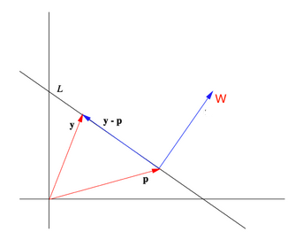

同理，在三维空间 $$\mathbb{R}^3$$ 中，平面 $$P$$ 上的点 $$\pmb{y}=\begin{bmatrix}x\\y\\z\end{bmatrix}$$ ，满足：
$$
ax+by+cz+d=0\tag{4}
$$
令 $$\pmb{w}=\begin{bmatrix}a\\b\\c\end{bmatrix}$$ ，（1）式改写为：
$$
\begin{split}
\begin{bmatrix}a\\b\\c\end{bmatrix}^\text{T}\begin{bmatrix}x\\y\\z\end{bmatrix}+d=0
\\
\pmb{w}^\text{T}\pmb{y}+d=0
\\
\pmb{w}\cdot\pmb{y}+d=0
\end{split}\tag{5}
$$
对平面 $$P$$ 上另外一点 $$\pmb{p}=\begin{bmatrix}p_1\\p_2\\p_3\end{bmatrix}$$ ，有：$$d=-\pmb{w}\cdot\pmb{p}$$ ，于是：
$$
\pmb{w}\cdot\pmb{y}-\pmb{w}\cdot\pmb{p}=0\\
\pmb{w}\cdot(\pmb{y}-\pmb{p})=0\tag{6}
$$
由（6）式可知，$$\pmb{y}-\pmb{p}$$ 在平面 $$P$$ 内，向量 $$\pmb{w}$$ 与平面垂直，是平面的法向量。

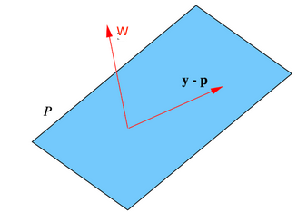

将上述结论推广到 $$\mathbb{R}^n$$ ，并且有向量 $$\pmb{w}\ne0$$ ，则称满足：
$$
\pmb{w}\cdot(\pmb{y}-\pmb{p})=0\tag{7}
$$
的向量 $$\pmb{y}\in\mathbb{R}^n$$ 的集合为过点 $$\pmb{p}$$ 的**超平面**（hyperplane）。其中 $$\pmb{w}$$ 称为超平面的**法向量**，（7）式则称为**法方程**（正规方程）。

## 最大间隔超平面

如下图所示，一个数据集中的样本，用图中的两种图形表示。显然，这个数据集是线性可分的，可以找出很多个超平面，把两类数据集分开$$^{[4]}$$。

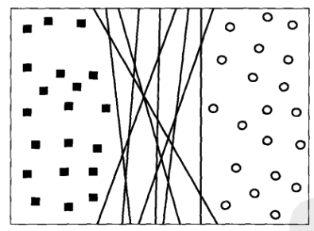

但是，以不同的超平面对样本进行分类，所得到的的分类器的泛化能力不同。

如下图所示，选两个超平面 $$B_1$$ 和 $$B_2$$ ，因为通过超平面能够实现分类，所以也将其称为**决策边界**。从图中可以看出来，对于当前样本而言，两个决策边界都能够将样本准确无误地划分开。对于每个决策边界 $$B_i$$ 都对应着一对差平面，分别记作 $$b_{i1}$$ 和 $$b_{i2}$$ 。其中 $$b_{i1}$$ 是这样得到的：平行移动一个和决策边界平行的超平面，直到触到最近的一个方块（某个类别中的样本）为止；类似地，得到还可以得到 $$b_{i2}$$ 超平面。这两个超平面之间的距离称为分类器的**间隔**（或者“边缘”，margin）。

从直觉上看，显然间隔大的时候，分类器的鲁棒性更强，亦即泛化能力更强。如果间隔比较下，任何轻微的扰动，比如出现了某些噪声，都会影响分类结果。

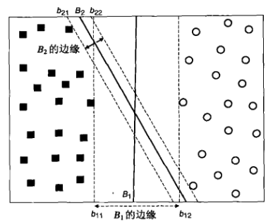

在统计学中，给出了线性分类器的间隔与其泛化误差之间的关系：
$$
R\le R_e+\varphi\left(\frac{h}{N},\frac{\log(\eta)}{N}\right)\tag{8}
$$
其中 $$R_e$$ 为分类器的训练误差，$$N$$ 为训练集样本数量，$$h$$ 为模型的复杂度（即能力，capacity），$$\varphi$$ 是 $$h$$ 的单调增函数。由（8）式得到了在概率 $$1-\eta$$ 下的分类器泛化误差的上界。 这就是**结构风险最小化**（Structural risk minimization，SRM）理论。

## 线性支持向量机：可分情况

线性 SVM 分类器，就是寻找最大间隔的超平面，故亦称为**最大间隔分类器**（Maximal Margin Classfier）。

### 1. 线性决策边界

假设一个二分类问题的训练集 $$N$$ 个样本：$$(\pmb{x}_i,y_i),~(i=1,2,\cdots,N)$$ ，其中 $$\pmb{x}_i=\begin{bmatrix}x_{i1}\\x_{i2}\\\vdots\\x_{id}\end{bmatrix}$$ 对应于第 $$i$$ 个样本的属性集，即维度是 $$d$$ 。为了方便，令 $$y_i\in\{-1,1\}$$ 表示类别标签。那么，线性分类器的决策边界，即超平面，可以写成：
$$
\pmb{w}\cdot\pmb{x}+b=0\tag{9}
$$
其中 $$\pmb{w}$$ 和 $$\pmb{b}$$ 是模型的参数。

由（7）式可知，（9）式中的 $$\pmb{w}$$ 是垂直于决策边界的法向量。

如下图所示，对于决策边界上方的样本 $$\pmb{x}_s$$ ，显然有：
$$
\pmb{w}\cdot\pmb{x}_s+b=k,~(k\gt0)\tag{10}
$$
同样，对于决策边界下方的样本 $$\pmb{x}_c$$ ，则有：
$$
\pmb{w}\cdot\pmb{x}_c+b=k^\prime,~(k^\prime\lt0)\tag{11}
$$
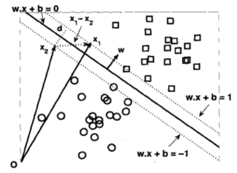

如果将两个类别分别用 $$+1$$ 和 $$-1$$ 表示，即：
$$
y=\begin{cases}+1,~若~\pmb{w}\cdot\pmb{x}+b\gt0\\-1,~若~\pmb{w}\cdot\pmb{x}+b\lt0\end{cases}\tag{12}
$$

### 2. 线性分类器的间隔

对于决策边界两边的两个平行的超平面（上图中的虚线所示），通过调整 $$\pmb{w}$$ 和 $$b$$ 两个参数，可以表示如下：
$$
\begin{split}
&b_{i1}:~\pmb{w}\cdot\pmb{x}+b=+1\\
&b_{i2}:~\pmb{w}\cdot\pmb{x}+b=-1
\end{split}\tag{13}
$$
决策边界的间隔有上述两个超平面之间的距离决定。如何得到此间隔？令 $$\pmb{x}_1$$ 是 $$b_{i1}$$ 上的一个数据点， $$\pmb{x}_2$$ 是 $$b_{i2}$$ 上的一个数据点，如上图所示，将这两个点代入（13）式，得到：
$$
\begin{split}
\pmb{w}\cdot\pmb{x}_1+b=+1\\
\pmb{w}\cdot\pmb{x}_2+b=-1\\
\end{split}
$$
两式相减，得到：
$$
\begin{split}
\pmb{w}\cdot(\pmb{x}_1-\pmb{x}_2)=2
\end{split}
$$
若令 $$d$$ 表示两个超平面 $$b_{i1}$$ 和 $$b_{i2}$$ 之间的距离（如上图所示），则上式转化为（点积的意义$$^{[2]}$$）：
$$
\begin{Vmatrix}\pmb{w}\end{Vmatrix}\times d =2
$$

$$
d=\frac{2}{\begin{Vmatrix}\pmb{w}\end{Vmatrix}}\tag{14}
$$

### 3. 学习线性 SVM 模型

由前述分析可知，如果训练 SVM 模型，必须要通过训练集数据，估计出决策边界（9）式的参数 $$\pmb{w}$$ 和 $$b$$ ，此参数必须满足如下两个条件：
$$
\begin{split}
&\pmb{w}\cdot\pmb{x}_i+b\ge1,~&&如果~y_i=1\\
&\pmb{w}\cdot\pmb{x}_i+b\le-1,~&&如果~y_i=-1
\end{split}\tag{15}
$$
也可以把（15）用下面的方式，写的更紧凑：
$$
y_i(\pmb{w}\cdot\pmb{x}_i+b)\ge1,~(i=1,2,\cdots,N)\tag{16}
$$
按照之前的分析，SVM 的一个要求是（14）式最大（间隔最大化），亦即等价于函数 $$f(\pmb{w})=\frac{\begin{Vmatrix}w\end{Vmatrix}^2}{2}$$ 最小化。用数学化语言表述：

$$
\begin{split}&\min_{\pmb{w},b}\frac{1} {2}\begin{Vmatrix}\pmb{w}\end{Vmatrix}^2
\\
s.t.\quad &y_i(\pmb{w}\cdot\pmb{x}_i+b)\ge1,~(i=1,2,\cdots,N)\end{split}\tag{17}
$$

很显然，当 $$\pmb{w}=0$$ 时，（17）式中的目标函数（第一个条件）成立，但此时违背了下面的约束条件，因为 $$b$$ 没有可行的解，故 $$\pmb{w}\ne0$$ .

目标函数是二次的，且约束在参数 $$\pmb{w}$$ 和 $$b$$ 上是线性的，因此上述问题是一个凸优化问题，可以通过拉格朗日乘数法求解$$^{[5]}$$ 。

定义拉格朗日函数：
$$
L(\pmb{w},b,\pmb{\lambda})=\frac{1}{2}\begin{Vmatrix}\pmb{w}\end{Vmatrix}^2-\sum_{i=1}^N\lambda_i(y_i(\pmb{w}\cdot\pmb{x}_i+b)-1)\tag{18}
$$
其中，$$\lambda_i$$ 是拉格朗日乘数，并假设 $$\lambda_i\ge0$$ 。对 $$L(\pmb{w},b,\pmb{\lambda})$$ 求关于 $$\pmb{w}$$ 和 $$b$$ 的偏导，并令它们等于零：
$$
\begin{split}
&\frac{\partial L}{\partial\pmb{w}}=\pmb{w}-\sum_{i=1}^N\lambda_iy_i\pmb{x}_i=0
\\
&\frac{\partial L}{\partial b}=\sum_{i=1}^N\lambda_iy_i=0
\end{split}
$$
解得：
$$
\begin{split}
\pmb{w}=\sum_{i=1}^N\lambda_iy_i\pmb{x}_i
\\
\sum_{i=1}^N\lambda_iy_i=0
\end{split}\tag{19}
$$
注意，拉格朗日乘数是未知的，此时还不能根据（19）式得到参数 $$\pmb{w}$$ 和 $$b$$ 。

如果（17）式中的约束条件只有等号，没有不等式，可以利用该等式约束得到 $$N$$ 个方程，在加上（19）式中的两个方程，从而可以解出 $$\pmb{w}$$ 、$$b$$ 和 $$\lambda_i$$ 。注意，等式约束的拉格朗日乘数是可以取任意值的自由参数。

但是，（17）式中还含有不等式，对于不等式约束，一种常用的处理方法是把它变换成一组等式约束。即：
$$
\begin{split}
&\lambda_i\ge0\\
&\lambda_i\left[y_i(\pmb{w}\cdot\pmb{x}_i+b)-1\right]=0
\end{split}\tag{20}
$$
上述称为 Karuch-Kuhn-Tucher（KKT）条件。

虽然在（20）式第二个等式中，都是角标 $$i$$ ，但并不意味着拉格朗日乘数的数量和训练集样本的数量一样多。在这个等式约束中可以看到：

- 除非样本点满足 $$y_i(\pmb{w}\cdot\pmb{x}_i+b)=1$$ ，否则拉格朗日乘数 $$\lambda_i$$ 必然为零。
- 对于 $$\lambda_i\gt0$$ 的样本点，必然落在了超平面 $$b_{i1}$$ 或 $$b_{i2}$$ 上，即满足（13）式中的一项。这样的样本点，称为**支持向量**。不在这两个超平面上的数据点肯定满足 $$\lambda_i=0$$ 。（19）式还表明，决策边界的参数 $$\pmb{w}$$ 和 $$b$$ 仅依赖这些支持向量。

于是，将（18）式的拉格朗日函数，可以变换为仅包含拉格朗日乘数 $$\lambda_i$$ 的函数，这就是**对偶问题**（Dual Problem）。

将（19）式的结果代入到（18）式，得到如下对偶公式：
$$
\begin{split}
L_D&=\frac{1}{2}\sum_{i=1}^N\sum_{j=1}^N\lambda_i\lambda_jy_iy_j(\pmb{x}_i\cdot\pmb{x}_j)-\sum_{i=1}^N\lambda_i\left[y_i\left(\sum_{j=1}^n\lambda_jy_j\pmb{x}_j\cdot\pmb{x}_i+b\right)-1\right]
\\&=\frac{1}{2}\sum_{i=1}^N\sum_{j=1}^N\lambda_i\lambda_jy_iy_j(\pmb{x}_i\cdot\pmb{x}_j)-\sum_{i=1}^N\sum_{j=1}^N\lambda_i\lambda_jy_iy_j(\pmb{x}_i\cdot\pmb{x}_j)-b\sum_{i=1}^N\lambda_iy_i+\sum_{i=1}^N\lambda_i
\\&=-\frac{1}{2}\sum_{i=1}^N\sum_{j=1}^N\lambda_i\lambda_jy_iy_j(\pmb{x}_i\cdot\pmb{x}_j)+\sum_{i=1}^N\lambda_i
\end{split}\tag{21}
$$
（21）式的对偶拉格朗日函数和（18）式的原拉格朗日函数相比，区别如下：

- 对偶拉格朗日函数仅涉及拉格朗日乘数和训练集数据，而原拉格朗日函数中除了拉格朗日常数，还有决策边界的参数。但是，二者的解是等价的。
- （21）式的二次项前面有一个符号，这说明对（18）式的最小化问题转化为了对（21）式的最大化问题。

于是问题转化为：
$$
\begin{split}
&\max_{\pmb{\lambda}}\left(-\frac{1}{2}\sum_{i=1}^N\sum_{j=1}^N\lambda_i\lambda_jy_iy_j(\pmb{x}_i\cdot\pmb{x}_j)+\sum_{i=1}^N\lambda_i\right)
\\&s.t.~\sum_{i=1}^N\lambda_iy_i=0
\\&\qquad\lambda_i\ge0,~i=1,2,\cdots,N
\end{split}\tag{22}
$$
根据（22）式，通过数值计算计算出，可以找到一组 $$\lambda_i$$ ，即找出 $$\pmb{\lambda}$$ ，然后通过（19）式的第一个等式求得 $$\pmb{w}$$ ，
$$
\pmb{w}=\sum_{i=1}^N\lambda_iy_i\pmb{x}_i
$$
前述已经讲到，支持向量决定了决策边界的参数，此时 $$\lambda_i\gt0$$ ，由（20）式的第二个等式，可得：
$$
y_i(\pmb{w}\cdot\pmb{x}_i+b)-1=0\\
y_i\pmb{w}\cdot\pmb{x}_i+y_ib-1=0
$$
因为：$$y_i^2=1$$ ，所以：
$$
y_i\pmb{w}\cdot\pmb{x}_i+y_ib-y_i^2=0\\
\pmb{w}\cdot\pmb{x}_i+b-y_i=0
$$
可以求得 $$b$$ ，
$$
b=y_i-\pmb{w}\cdot\pmb{x}_i=y_i-\sum_{j=1}^N\lambda_jy_j\pmb{x}_j\cdot\pmb{x}_i
$$
于是得到决策边界超平面：
$$
\left(\sum_{i=1}^N\lambda_iy_i\pmb{x}_i\cdot\pmb{x}\right)+b=0\tag{23}
$$
亦或决策函数：
$$
\begin{split}
f(\pmb{x})&=\text{sign}(\pmb{w}\cdot\pmb{x}+b)\\&=\text{sign}\left(\sum_{i=1}^N\lambda_iy_i\pmb{x}_i\cdot\pmb{x}+b\right)
\end{split}\tag{24}
$$
注意，上述只是理论上求解的过程，在实际的数值计算中，由于计算规模正比于训练样本数量，会在实际任务中造成很大开销，为此，研究者提出了很多高效算法，比如 SMO，参考资料 [6] 中对此有较为详细的介绍。

### 4. 实践案例

首先考虑线性可分的二分类数据，按照下面的方式创建这个数据集： 

1. 引入所有相关的模块。

   ```python
   from sklearn.datasets import make_blobs, make_moons
   from sklearn.pipeline import make_pipeline
   from sklearn.preprocessing import StandardScaler, PolynomialFeatures
   from sklearn.svm import LinearSVC, SVC
   
   import matplotlib.pyplot as plt
   %matplotlib inline
   
   from mlxtend.plotting import plot_decision_regions
   import numpy as np
   ```

2. 创建有一个具有两个类别的数据集。

   ```python
   X, y = make_blobs(n_samples=100, centers=2, n_features=2, random_state=42)
   ```

3. 使用 scikit-learn 拟合一个线性 SVM。注意，我们在训练模型之前对数据进行了归一化处理，因为 SVM 对特征的尺度非常敏感。

   ```python
   pipe = make_pipeline(StandardScaler(), LinearSVC(C=1, loss="hinge"))
   pipe.fit(X, y)
   ```

4. 编写一个实现数据可视化的函数。

   ```python
   def plot_svm(clf, X):
       decision_function = pipe.decision_function(X)
       support_vector_indices = np.where((2 * y - 1) * decision_function <= 1)[0]
       support_vectors = X[support_vector_indices]
       
       plt.figure(figsize=(8, 8))
       plot_decision_regions(X, y, clf=pipe, legend=0, 
                             colors="skyblue,xkcd:goldenrod")
       plt.scatter(support_vectors[:, 0], support_vectors[:, 1], s=200,
                   linewidth=1, facecolors='none', edgecolors='r')
       
       ax = plt.gca()
       xlim = ax.get_xlim()
       ylim = ax.get_ylim()
       xx, yy = np.meshgrid(np.linspace(xlim[0], xlim[1], 50),
                            np.linspace(ylim[0], ylim[1], 50))
       Z = pipe.decision_function(np.c_[xx.ravel(), yy.ravel()])
       Z = Z.reshape(xx.shape)
       plt.contour(xx, yy, Z, colors='k', levels=[-1, 0, 1], alpha=0.5,
                   linestyles=['--', '-', '--'])
   ```

5. 用自定义的函数 `plot_svm()` 对前述模型 `pip` 和数据集 `X` 绘图，并输出下图所示图像。

   ```python
   plot_svm(pipe, X)
   ```

   输出图像：

   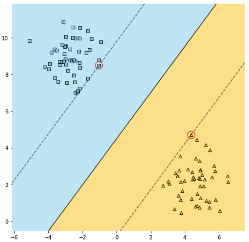

   

   上图中用红色圆圈标记出的样本点，在间隔边界上，这个数据点所对应的向量，称为**支持向量**，因为它们支持或决定了间隔的位置。即使我们在间隔外增加一些新的样本点，它也不会改变此间隔的位置。

## 线性支持向量机：不可分情况

前面讨论的数据集是线性可分的，但是如果，遇到非线性可分的问题，如何解决？如下图所示：

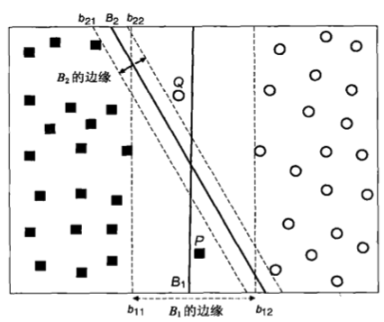

虽然 $$B_1$$ 决策边界的间隔大于 $$B_2$$ 决策边界的间隔，但是，$$B_1$$ 并没有对训练集完全正确分类，如图中 P 和 Q 所示。而进一步思考，虽然 $$B_2$$ 正确分类，但是如果 P 和 Q 是噪音，这个分类器还有比较好的泛化能力吗？相比 $$B_1$$ 不容易出现过拟合。但是，如果根据（23）或（24）式，只能得到类似 $$B_2$$ 的决策边界。

之所以出现上图中的纠结之处，原因就在于，这里的数据集，并不是严格地“线性可分”。

为此，要对（23）式进行修正，即为 **软间隔**（Soft Margin）方法，与之对比，前述可称为**硬间隔**方法。

为此，可以放松不等式的约束，以适应非线性可分问题，于是引入**松弛变量**（Slack Variable）$$\xi\gt0$$ ：
$$
\begin{split}
&\pmb{w}\cdot\pmb{x}_i+b\ge1-\xi_i,\quad&&~如果~y_i=1
\\&\pmb{w}\cdot\pmb{x}_i+b\le-1+\xi_i,\quad&&~如果~y_i=-1
\end{split}\tag{25}
$$
其中，$$\forall~i:\xi_i\gt0$$ 。

如下图所示，假设有样本点 P，显然它不符合（15）式的约束。

设 $$\pmb{w}\cdot\pmb{x}+b=-1+\xi$$ 是一条过点 P，且平行于决策边界的直线，可以证明它与超平面 $$\pmb{w}\cdot\pmb{x}+b=-1$$ 之间的距离为 $$\xi\begin{Vmatrix}\pmb{w}\end{Vmatrix}$$ 。因此，松弛变量 $$\xi$$ 提供了决策边界在样本 P 上的误差估计。

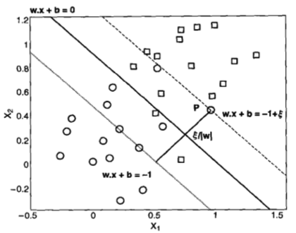

引入松弛变量之后，就可以修改目标函数（原来的目标函数 $$f(\pmb{w})=\frac{\begin{Vmatrix}\pmb{w}\end{Vmatrix}^2}{2}$$ ）为：
$$
f(\pmb{w})=\frac{\begin{Vmatrix}\pmb{w}\end{Vmatrix}^2}{2}+C\left(\sum_{i=1}^N\xi_i\right)^k
$$
其中 $$C$$ 和 $$k$$ 是用户指定的参数，表示对误分样本的乘法，为了简化，常常设 $$k=1$$ 。参数 $$C$$ 则根据对模型性能需要选择。

于是仿照（17）式，线性不可分的线性支持向量机的学习问题就是求解凸二次规划问题：
$$
\begin{split}
&\min_{\pmb{w},b,\pmb{\xi}}\left(\frac{\begin{Vmatrix}\pmb{w}\end{Vmatrix}^2}{2}+C\sum_{i=1}^N\xi_i\right)
\\s.t.~&y_i(\pmb{w}\cdot\pmb{x}_i+b)\ge1-\xi_i~,\quad &&i=1,2,\cdots,N
\\&\xi_i\ge0~,\quad &&i=1,2,\cdots,N
\end{split}
$$
于是，被约束的优化问题的拉格朗日函数可以写成如下形式：
$$
L_P=L(\pmb{w},b,\pmb{\lambda},\pmb{x}_i,\pmb{\mu})=\frac{1}{2}\begin{Vmatrix}\pmb{w}\end{Vmatrix}^2+C\sum_{i=1}^N\xi_i-\sum_{i=1}^N\lambda_i\left[y_i(\pmb{w}\cdot\pmb{x}_i+b)-1+\xi_i\right]-\sum_{i=1}^N\mu_i\xi_i\tag{26}
$$

- 前两项，是需要最小化的目标函数；
- 第三项表示与松弛变量相关的不等式约束；
- 最后一项是要求 $$\xi_i$$ 的值非负。

（26）式中的 $$\lambda_i$$ 和 $$\mu_i$$ 都是拉格朗日乘数。

利用如下的 KKT 条件，可以将不等式约束变换成等式约束： 
$$
\begin{split}
&\xi_i\ge0,~\lambda_i\ge0,~\mu_i\ge0
\\&\lambda_i[y_i(\pmb{w}\cdot\pmb{x}_i+b)-1+\xi_i]=0
\\&\mu_i\xi_i=0
\end{split}\tag{27}
$$
其中，拉格朗日乘数 $$\lambda_i$$ 是非零的当且仅当样本数据点位于直线 $$\pmb{w}\cdot\pmb{x}_i+b=\pm{1}$$ 上或 $$\xi_i\gt0$$ 。

另一方面，对于许多误分类的样本（即满足 $$\xi_i\gt0$$ ），则 $$\mu_i$$ 都为零。 

令（26）式的 $$L_P$$ 关于 $$\pmb{w},~b$$ 和 $$\xi$$ 的一阶导数为零，得到如下结果： 
$$
\begin{split}
&\frac{\partial L}{\partial w_j}=w_j-\sum_{i=1}^N\lambda_iy_ix_{ij}=0~\Rightarrow~w_j=\sum_{i=1}^N\lambda_iy_ix_{ij}
\\&\frac{\partial L}{\partial b}=-\sum_{i=1}^N\lambda_iy_i=0~\Rightarrow~\sum_{i=1}^N\lambda_iy_i=0\\&\frac{\partial L}{\partial\xi_i}=C-\lambda_i-\mu_i=0~\Rightarrow~\lambda_i+\mu_i=C\end{split}\tag{28}
$$


将（28）式代入拉格朗日函数（26）式中，得到如下对偶拉格朗日函数： 
$$
\begin{split}
L_D&=&&\frac{1}{2}\sum_{ij}\lambda_i\lambda_jy_iy_j\pmb{x}_i\cdot\pmb{x}_j+C\sum_i\xi_i
\\& &&-\sum_i\lambda_i\left[y_i\left(\sum_j\lambda_jy_j\pmb{x}_i\cdot\pmb{x}_j+b\right)-1+\xi_i\right]
\\& &&-\sum_i(C-\lambda_i)\xi_i
\\&=&&\sum_{i=1}^N\lambda_i-\frac{1}{2}\sum_{i,j}\lambda_i\lambda_jy_iy_j\pmb{x}_i\cdot\pmb{x}_j\end{split}\tag{29}
$$
此处的（29）式与前述线性可分的对偶拉格朗日函数（21）式形式相同。但施加于拉格朗日乘数 $$\lambda_i$$ 上的约束与在线性可分情况下略微不同。

- 在线性可分情况下，拉格朗日乘数必须是非负的，即 $$\lambda_i\ge0$$ 。
- 此处，由（28）式第三个约束条件可知，要求 $$\lambda_i$$ 不应该超过 $$C$$ （由于 $$\mu_i$$ 和 $$\lambda_i$$ 都是非负的）。因此，非线性可分数据的拉格朗日乘数被限制在 $$0\le\lambda_i\le C$$ 。 

于是得到对偶问题：
$$
\begin{split}
&\max_{\pmb{\lambda}}\left(\sum_{i=1}^N\lambda_i-\frac{1}{2}\sum_{i,j}\lambda_i\lambda_jy_iy_j\pmb{x}_i\cdot\pmb{x}_j\right)
\\s.t.~&\sum_{i=1}^N\lambda_iy_i=0
\\&0\le\lambda_i\le C~,\quad i=1,2,\cdots,N
\end{split}\tag{30}
$$
接下来仿照前述（22）式的求解方法，得到拉格朗日乘数 $$\lambda_i$$ ，进而得到决策边界的参数 $$\pmb{w}$$ 和 $$b$$ ，确定决策边界和决策函数。

## 非线性支持向量机 

前面所述，构建了一个线性的决策边界，从而把训练集样本划分到它们各自的类别中。

但现实的数据中，并非都是以线性边界作为决策边界的，如下图所示。方块所代表的数据点和圆圈所代表的数据点，显然不能用线性边界划分。

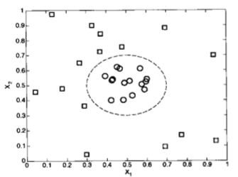

### 1. 属性变换

解决上图决策边界问题，一种思路是“画曲为直”，即将数据从原来的坐标空间 $$\pmb{x}$$ 变换到一个新的坐标空间 $$\pmb{\Phi}(\pmb{x})$$ ，从而可以在变换后的坐标空间中使用一个线性的决策边界来划分样本。 

以上图为例，在二维空间中，有两个类别的数据点分布：一部分在中心附近，另一部分远离中心分布，用数学表达式表示为： 
$$
y(x_1,x_2)=\begin{cases}1\quad&如果~\sqrt{(x_1-0.5)^2+(X_2-0.5)^2}\gt0.2\\-1\quad&否则\end{cases}
$$
因此，数据集的决策边界可以表示为： 
$$
\sqrt{(x_1-0.5)^2+(x_2-0.5)^2}=0.2
$$
 进一步写成二次方程形式： 
$$
x_1^2-x_1+x_2^2-x_2=-0.46
$$
下面用一个非线性变换 $$\pmb{\Phi}$$ ，将数据从原来的特征空间映射到一个新的特征空间，在这个空间下，决策边界应该是线性的。假设选择如下变换：
$$
\pmb{\Phi}:(x_1,x_2)~\to~(x_1^2,x_2^2,\sqrt{2}x_1,\sqrt{2}x_2,\sqrt{2}x_1x_2,1)\tag{31}
$$
在变换后的空间中，找到参数 $$\pmb{w}=(w_0,w_1,\cdots,w_5)$$ ，使得：
$$
w_5x_1^2+w_4x_2^2+w_3\sqrt{2}x_1+w_2\sqrt{2}x_2+w_1\sqrt{2}x_1x_2+w_0=0
$$
例如，对刚才给定的数据，以 $$x_1^2-x_1$$ 和 $$x_2^2-x_2$$ 为坐标绘图，得到如下图所示结果，显示在变换后空间中数据点的分布，显然可以构建一个线性的决策边界进行分类。 

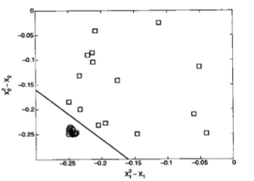

这种方法的潜在问题是，对于高维数据，可能产生“维数灾难”。避免的方法就是使用核技巧。 

### 2. 学习非线性 SVM 模型

对数据集进行属性变换，会存在如下问题：

- 不清楚应该使用什么类型的映射函数，才可以确保在变换后的空间构建线性决策边界。一种选择是把数据变换到无限空间中，但这样的高维空间可能很难处理。
- 即使知道合适的映射函数，在高维特征空间中解约束优化问题仍然是计算代价很高的任务。

假设存在一个合适的函数 $$\pmb{\Phi}(\pmb{x})$$ 来变换给定的数据集，在变换后的空间中，线性决策边界具有下面的形式： $$\pmb{w}\cdot\pmb{\Phi}(\pmb{x})+b=0$$ 

非线性支持向量机的学习任务表述为：
$$
\begin{split}&\min_{\pmb{w}}\frac{1}{2}\begin{Vmatrix}\pmb{w}\end{Vmatrix}^2
\\s.t.~&y_i(\pmb{w}\cdot\pmb{\Phi}(\pmb{x}_i)+b)\ge1,\quad i=1,2\cdots,N\end{split}\tag{32}
$$

（32）式与（17）式类似，主要区别在于，此处的学习任务是在变换后的属性 $$\pmb{\Phi}(\pmb{x})$$ ，而不是在原有的属性 $$\pmb{x}$$ 上执行的。

仿照前面对线性支持向量机的求解过程，可以写出对偶拉格朗日函数： 
$$
L_D=\sum_{i=1}^N\lambda_i-\frac{1}{2}\sum_{i,j}\lambda_i\lambda_jy_iy_j\pmb{\Phi}(\pmb{x}_i)\cdot\pmb{\Phi}(\pmb{x}_j)\tag{33}
$$
使用二次规划技术得到 $$\lambda_i$$ 后，就可以通过下面的方程得到参数 $$\pmb{w}$$ 和 $$b$$：
$$
\begin{split}
&\pmb{w}=\sum_i\lambda_iy_i\pmb{\Phi}(\pmb{x}_i)
\\
&\lambda_i\left[y_i\left(\sum_j\lambda_jy_j\pmb{\Phi}(\pmb{x}_j)+b\right)-1\right]=0
\end{split}\tag{34}
$$
 最后得到决策函数：
$$
f(\pmb{z})=\text{sign}(\pmb{w}\cdot\pmb{\Phi}(\pmb{z})+b)=\text{sign}\left(\sum_{i=1}^N\lambda_jy_j\pmb{\Phi}(\pmb{x}_i)\cdot\pmb{\Phi}(\pmb{z})+b\right)\tag{35}
$$
 在上述两个式子中，都涉及到 $$\pmb{\Phi}(\pmb{x}_i)\cdot\pmb{\Phi}(\pmb{x}_j)$$ 的计算。这种计算，可能导致维灾难问题。对这个问题的解决方法是使用**核技巧**（Kernel Trick）  

### 3. 核技巧

两个向量的点积运算结果，可以用来度量它们间的相似度。比如，余弦相似度，就是两个向量单位化后的向量的点积：
$$
\cos\theta=\frac{\pmb{u}\cdot\pmb{v}}{\begin{Vmatrix}\pmb{u}\end{Vmatrix}\begin{Vmatrix}\pmb{v}\end{Vmatrix}}=\frac{\pmb{u}}{\begin{Vmatrix}\pmb{u}\end{Vmatrix}}\cdot\frac{\pmb{v}}{\begin{Vmatrix}\pmb{v}\end{Vmatrix}}
$$
类似地，也可将 $$\pmb{\Phi}(\pmb{x}_i)\cdot\pmb{\Phi}(\pmb{x}_j)$$ 看做两个数据点 $$\pmb{x}_i$$ 和 $$\pmb{x}_j$$ 在变换后的空间中的相似度度量。

核技巧是一种使用原特征集合计算变换后的空间中的相似度的方法。以（31）式的映射 $$\pmb{\Phi}$$ 为例，两个输入向量 $$\pmb{u}$$ 和 $$\pmb{v}$$ 在变换后的空间中的点积可以写成：
$$
\begin{split}
\pmb{\Phi}(\pmb{u})\cdot\pmb{\Phi}(\pmb{v})&=(u_1^2,u_2^2,\sqrt{2}u_1,\sqrt{2}u_2, \sqrt{2}u_1u_2,1)\cdot(v_1^2,v_2^2,\sqrt{2}v_1,\sqrt{2}v_2, \sqrt{2}v_1v_2,1)
\\&=u_1^2v_1^2+u_2^2v_2^2+2u_1v_1+2u_2v_2+2u_1u_2v_1v_2+1
\\&=(\pmb{u}\cdot\pmb{v}+1)^2
\end{split}
$$
这说明，变换后的空间中的点积可以用原空间中的相似度函数表示：
$$
K(\pmb{u},\pmb{v})=\pmb{\Phi}(\pmb{u})\cdot\pmb{\Phi}(\pmb{v})=(\pmb{u}\cdot\pmb{v}+1)^2\tag{36}
$$
像（36）式中，在原特征空间中计算的相似度函数 $$K$$ 称为**核函数**（Kernel Function）。

核技巧有助于处理非线性支持向量机的一些问题：

- 在非线性 SVM 中使用的核函数，必须满足 Mercer 定理，因此不需要知道映射函数 $$\pmb{\Phi}$$ 的确切形式。Mercer 定理确保核函数可以用某高维空间中两个输入向量的点积表示。SVM 核的变换后空间，也称为**再生核希尔伯特空间**（Reproducing Kernel Hilbert Space，RKHS）。
- 相对于使用变换后的特征集 $$\pmb{\Phi}(\pmb{x})$$ ，使用核函数计算点积的开销更小。
- 由于计算在原空间进行，故避免了维数灾难问题。

如果将（36）式的核，应用到本小节开始的数据集中，根据（35）式，分类决策函数可以写成：
$$
\begin{split}
f(\pmb{z}) &= \text{sign}\left(\sum_{i=1}^N\lambda_iy_i\pmb{\Phi}(\pmb{x}_i)\pmb{\Phi}(\pmb{z})+b\right)
\\&=\text{sign}\left(\sum_{i=1}^N\lambda_iy_iK(\pmb{x}_i,\pmb{z})+b\right)
\\&=\text{sign}\left(\sum_{i=1}^N\lambda_iy_i(\pmb{x}_i\cdot\pmb{z}+1)^2+b\right)
\end{split}\tag{37}
$$
其中 $$b$$ 是从（34）式第二个等式得到的参数。于是得到了一个以（36）式为核函数的决策函数，其决策边界效果如下图所示：

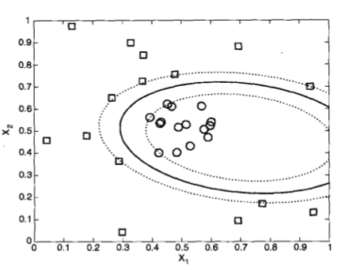

此结果与真实的决策编辑很接近。

常用的核函数：

- 多项式核函数：$$K(\pmb{x},\pmb{z})=(\pmb{x}\cdot\pmb{z}+1)^p$$
- 高斯核函数：$$K(\pmb{x},\pmb{z})=\exp\left(-\frac{\begin{Vmatrix}\pmb{x}-\pmb{z}\end{Vmatrix}^2}{2\sigma^2}\right)$$
- Sigmoid 核函数：$$K(\pmb{x},\pmb{z})=\tanh(\gamma(\pmb{x}\cdot\pmb{z})+r)$$

### 4. Mercer 定理

核函数 $$K$$ 可以表示为：
$$
K(\pmb{u},\pmb{v})=\Phi(\pmb{u})\cdot\Phi(\pmb{v})
$$
当且仅当对于任意满足 $$\int g(x)^2dx$$ 为有限值的函数 $$g(x)$$ ，则：
$$
\int K(x,y)g(x)g(y)dxdy\ge0
$$
满足此定理的核函数称为正定核函数。

### 5. 应用案例

**1. 高维空间更有可分性****

先了解一种强大思想观点：在高维空间中，数据更有可能线性可分。

```python
x1 = np.array([-3, -2, -1, 0, 1, 2, 3])
x2 = x1 ** 2
aux = np.zeros(shape=x1.shape)
y = np.array([0, 0, 1, 1, 1 ,0, 0])

plt.figure(figsize = (12, 6))
plt.subplot(1, 2, 1)
plt.scatter(x1[y == 1], aux[y == 1], c=['xkcd:lightish blue'], 
            edgecolor="black", s=250)
plt.scatter(x1[y == 0], aux[y == 0], c=['xkcd:terra cotta'], 
            edgecolor="black", s=250)
plt.axis("equal")
plt.gca().spines['top'].set_visible(False)
plt.gca().spines['right'].set_visible(False)
plt.yticks([])
plt.xlabel("x1", fontsize=15)
plt.title("One feature: data linearly unseparable", fontsize=15)
plt.subplot(1, 2, 2)
plt.scatter(x1[y == 1], x2[y == 1], c=['xkcd:lightish blue'], 
            edgecolor="black", s=250)
plt.scatter(x1[y == 0], x2[y == 0], c=['xkcd:terra cotta'], 
            edgecolor="black", s=250)
plt.axis("equal")
plt.gca().spines['top'].set_visible(False)
plt.gca().spines['right'].set_visible(False)
plt.xlabel("x1", fontsize=15)
plt.ylabel("x2 = x1^2", fontsize=15)
plt.plot([-4, 4], [2.5, 2.5], linestyle='--', lw=3, color='black')
plt.title("Two features: data linearly separable", fontsize=15)
plt.tight_layout(7)
plt.show()
```

输出：

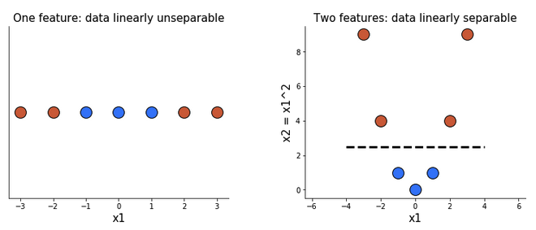

如上图中所示，当只有一个特征 x1 时，这些点不能用一条直线分割开。再添加另一个特征 x2（x2 等于 x1 的平方），就可以很容易地将这两类数据分开了。

**2. 多项式核**

增加更多特征的一种方法是在一定程度上使用原有特征的多项式组合。例如，有两个特征 A 和 B，一个 2 次的多项式将产生 6 个特征: 1（指数为 0 的任何特征），A, B, A²，B²，和 AB。我们可以使用 scikit-learn 的`PolynomialFeatures()`很容易地手动添加这些特征：

```python
X, y = make_moons(n_samples=100, noise=0.1, random_state=42)
pipe = make_pipeline(StandardScaler(), 
                     PolynomialFeatures(degree=3), 
                     LinearSVC(C=5))
pipe.fit(X, y)
plot_svm(pipe, X)
```

输出结果：

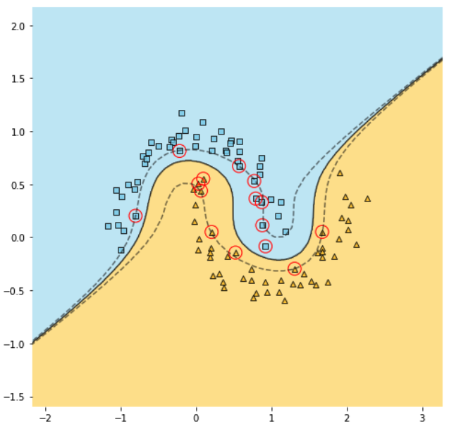

也可以用下面的方式，更简便地使用多项式核。

```python
X, y = make_moons(n_samples=100, noise=0.1, random_state=42)
pipe = make_pipeline(StandardScaler(), SVC(kernel="poly", degree=3, C=5, coef0=1))
pipe.fit(X, y)

plot_svm(pipe, X)
```

输出结果。

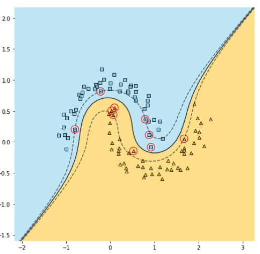

以上两种方法得到的结果类似。由此可知，使用核函数的好处在于，通过指定较高的指数值（上例中 `degree=3`），提高了数据在高维空间中实现线性可分的可能性，且不降低模型的训练时间。

对于上面通过 `make_moos()` 创建的“月牙形”数据，从散点图可以清楚地看出，3 次的多项式就足以支持分类任务了。然而，对于更复杂的数据集，可能需要使用更高的指数。这就是核技巧威力之所在。

**3. 高斯RBF核**

另一种用于增加数据特征的方法就是向其中增加相似性特征。相似性特征度量了现有特征的值与一个中心的距离。

例如：有一个数据集，这个数据集只有一个特征 x1。我们想要新增两个相似特征，就选择两个“中心”，比如，从这个单一特征中选择的两个参考值作为“中心”，分别是 -1 和 1 为例（如下图的左图，图中的 landmark 即所选择的“中心”）。然后，对于 x1 的每个值，计算它距离第一个中心的 -1 的距离。所有计算结果，就构成了新的相似性特征 x2。然后进行同样的操作，将 x1 的值与第二个中心 1 进行比较，得到新的特征 x3。现在我们甚至不需要最初的特征 x1 了！这两个新的相似性特征就能够将数据分离。

每一个样本点到中心的距离，一种常用的计算法方法是使用高斯径向基函数（RBF）定义：
$$
RBF(\pmb{x})=\exp(-\gamma\begin{Vmatrix}\pmb{x}-\text{landmark}\end{Vmatrix}^2)\tag{38}
$$
（38）式中的 $$\pmb{x}$$ 为数据集样本（观察值），$$\gamma$$ 是一个参数，此处令 $$\gamma=0.3$$ 。以上图中左侧图为例，根据（38）式，计算 $$-3$$ 与 $$-1$$ 的距离：
$$
RBF(-3,-1)=\exp(-0.3\times|-3-(-1)|^2)=0.30
$$
这个值作为 x2 特征的值。

同样，计算 $$-3$$ 与 $$1$$ 的距离，得：
$$
RBF(-3,1)=\exp(-0.3\times|-3-(1)|^2)=0.01
$$
这个值作为 x3 特征的值。

于是将一维特征 x1 中的值 $$-3$$ ，根据高斯 RBF 核，升到二维特征 x2 和 x3，对应的数值为 $$(0.30, 0.01)$$ ，将此数据在二维坐标系中用点表示出来（如上图中右侧的图示）。

用同样方法，将一维特征 x1 中的其他各点，都变化为二维特征的数据，最终得到上图中右侧图示结果。从图中我们可以直接观察到，到维度提升之后，各个数据点能够用线性方法给予分类了。

```python
def gaussian_rbf (x, landmark, gamma):
    return np.exp(-gamma * (x - landmark) ** 2)
    
x1 = np.array([-3, -2, -1, 0, 1, 2, 3])
landmarks = [-1, 1]
x2 = np.array([gaussian_rbf(x, landmarks[0], 0.3) for x in x1])
x3 = np.array([gaussian_rbf(x, landmarks[1], 0.3) for x in x1])
aux = np.zeros(shape=x1.shape)
y = np.array([0, 0, 1, 1, 1 ,0, 0])

plt.figure(figsize = (12, 6))
plt.subplot(1, 2, 1)
plt.scatter(x1[y == 1], aux[y == 1], c=['xkcd:lightish blue'], 
            edgecolor="black", s=250)
plt.scatter(x1[y == 0], aux[y == 0], c=['xkcd:terra cotta'], 
            edgecolor="black", s=250)
plt.plot([landmarks[0], landmarks[0]], [2.5, 0.5], linestyle='--', lw=3, color='gray')
plt.plot([landmarks[1], landmarks[1]], [2.5, 0.5], linestyle='--', lw=3, color='gray')
plt.annotate("1st landmark", (landmarks[0] - 1.2, 2.8), fontsize=12, color='gray')
plt.annotate("2nd landmark", (landmarks[1] - 0.8, 2.8), fontsize=12, color='gray')
plt.axis("equal")
plt.gca().spines['top'].set_visible(False)
plt.gca().spines['right'].set_visible(False)
plt.yticks([])
plt.xlabel("x1", fontsize=15)
plt.title("Original single feature:\ndata linearly unseparable", fontsize=15)
plt.subplot(1, 2, 2)

plt.scatter(x2[y == 1], x3[y == 1], c=['xkcd:lightish blue'], 
            edgecolor="black", s=250)
plt.scatter(x2[y == 0], x3[y == 0], c=['xkcd:terra cotta'], 
            edgecolor="black", s=250)
plt.axis("equal")
plt.gca().spines['top'].set_visible(False)
plt.gca().spines['right'].set_visible(False)
plt.xlabel("x2 = distance from 1st landmark", fontsize=15)
plt.ylabel("x3 = distance from 2nd landmark", fontsize=15)
plt.plot([0, 1], [1, 0], linestyle='--', lw=3, color='black')
plt.title("Two similarity features:\ndata linearly separable", fontsize=15)
plt.tight_layout(7)
plt.show()
```

输出结果：

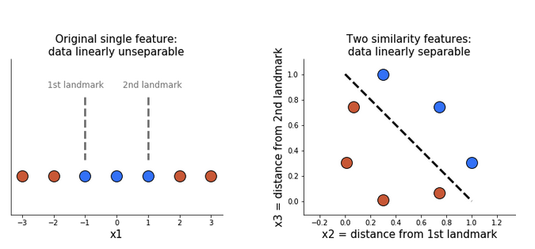

在上面的例子中，所选择的一维特征中的两个参考值（“中心”，（1）式中的 `landmark` ），其实有运气的成分。在实践中，可能需要大量的这样的“中心”，从而得到许多新的相似性特征。但是这样的操作将大大降低 SVM的速度——除非我们借助核技巧！

类似于多项式核，RBF 核看起来好像是对原始特征的每个值上都要指定一个“中心”，但实际上不需要真的这样做。让我们用“月牙形”的数据来验证一下。

```python
X, y = make_moons(n_samples=100, noise=0.1, random_state=42)
pipe = make_pipeline(StandardScaler(), SVC(kernel="rbf", gamma=0.3, C=5))
pipe.fit(X, y)

plot_svm(pipe, X)
```

输出结果：

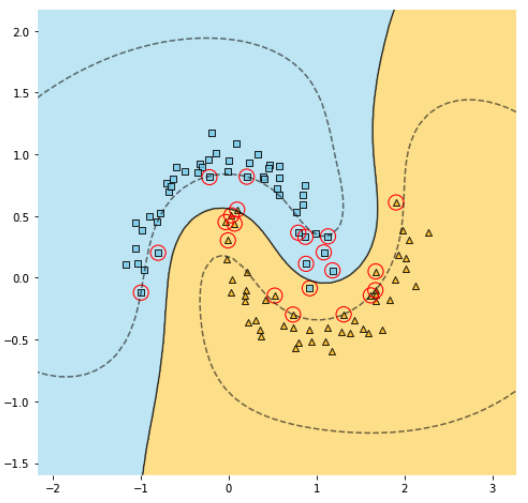

从图中可以看出，决策边界看起来相当不错，但是，注意一些分类错误的样本。我们可以通过调整 $$\gamma$$ 参数来解决问题。$$\gamma$$ 参数可以充当正则项——参数越小，决策边界越平滑，但要防止过拟合。上面的情况下，实际上是欠拟合，所以，要令 $$\gamma=0.5$$ 。

```python
X, y = make_moons(n_samples=100, noise=0.1, random_state=42)
pipe = make_pipeline(StandardScaler(), SVC(kernel="rbf", gamma=0.5, C=5))
pipe.fit(X, y)

plot_svm(pipe, X)
plt.show()
```

输出结果：

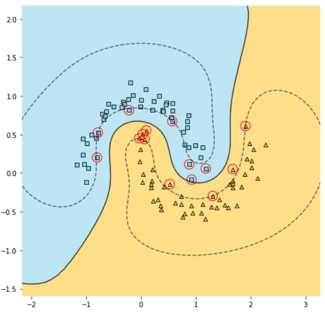

现在，就实现了对“月牙形”数据的正确分类。

## 支持向量回归

支持向量机不仅可以解决分类问题，也可解决回归问题。

设训练集样本 $$D=\{(\pmb{x}_1,y_1),\cdots,(\pmb{x}_N,y_N\}$$ ，对于样本 $$(\pmb{x}_i, y_i)$$ 根据模型 $$f(\pmb{x}_i)$$ 输出预测值，与真实 $$y_i$$ 之间计算损失。

支持向量回归（Support Vector Regression，SVR）的基本思路是：设 $$f(\pmb{x}_i)$$ 与 $$y_i$$ 之间的偏差是 $$\epsilon$$ ：

- 当 $$|f(\pmb{x}_i)-y_i|\gt\epsilon$$ 时，计算损失；

- 当 $$|f(\pmb{x}_i)-y_i|\le\epsilon$$ 时，认为预测正确。

SVR 问题可以表述为$$^{[3,6]}$$：
$$
\min_{\pmb{w},b}\left(\frac{1}{2}\begin{Vmatrix}\pmb{w}\end{Vmatrix}^2+C\sum_{i=1}^Nl_{\epsilon}(f(\pmb{x}_i)-y_i)\right)\tag{39}
$$

其中 $$C$$ 为惩罚常数（正则化常数），$$l_{\epsilon}$$ 是损失函数（$$\epsilon$$-不敏感损失函数）：
$$
l_{\epsilon}(z)=\begin{cases}0,&~if~|z|\le\epsilon\\|z|-\epsilon,&\text{otherwise.} \end{cases}
$$
再引入松弛变量 $$\xi_i$$ 和 $$\hat{\xi}_i$$ ，将（39）式改写为：
$$
\min_{\pmb{w},b,\xi_i,\hat{\xi}_i}\left(\frac{1}{2}\begin{Vmatrix}\pmb{w}\end{Vmatrix}^2+C\sum_{i=1}^N(\xi_i+\hat{\xi}_i)\right)\tag{40}
$$

$$
\begin{split}
s.t.\quad &f(\pmb{x}_i)-y_i\le\epsilon+\xi_i
\\&y_i-f(\pmb{x}_i)\le\epsilon+\hat{\xi}_i
\\&\xi_i\ge0,~\hat{\xi}_i\ge0,~i=1,2,\cdots,N
\end{split}
$$

引入拉格朗日乘数：$$\mu_i\ge0,\hat{\mu}_i\ge0,\lambda_i\ge0,\hat{\lambda}_i\ge0$$ ，由拉格朗日乘数法可得（40）式的拉格朗日函数：
$$
\begin{split}
L_P = &\frac{1}{2}\begin{Vmatrix}\pmb{w}\end{Vmatrix}^2+C\sum_{i=1}^N(\xi_i+\hat{\xi}_i)-\sum_{i=1}^N\mu_i\xi_i-\sum_{i=1}^N\hat{\mu}_i\hat{\xi}_i
\\&+\sum_{i=1}^N\lambda_i(f(\pmb{x}_i)-y_i-\epsilon-\xi_i)+\sum_{i=1}^N\hat{\lambda}_i(y_i-f(\pmb{x}_i)-\epsilon-\hat{\xi}_i)
\end{split}\tag{41}
$$
将决策函数 $$f(\pmb{x})=\pmb{w}\cdot\pmb{x}+b$$ 代入（41）式，再根据 $$L_P$$ 对 $$\pmb{w},b,\pmb{\xi},\hat{\pmb{\xi}}_i$$ 求偏导数，并令其为零，可得：
$$
\begin{split}
&\pmb{w}=\sum_{i=1}^N(\hat{\lambda}_i-\lambda_i)\pmb{x}_i
\\&0=\sum_{i=1}^N(\hat{\lambda}_i-\lambda_i)
\\&C=\lambda_i+\mu_i
\\&C=\hat{\lambda}_i+\hat{\mu}_i
\end{split}\tag{42}
$$
将（42）式代入到（41）式，即可得到 SVR 的对偶问题：
$$
\begin{split}
&\max_{\pmb{\lambda},\hat{\pmb{\lambda}}}\left(\sum_{i=1}^N[y_i(\hat{\lambda}_i-\lambda_i)-\epsilon(\hat{\lambda}_i+\lambda_i)]-\frac{1}{2}\sum_{i=1}^N\sum_{j=1}^N(\hat{\lambda}_i-\lambda_i)(\hat{\lambda}_j-\lambda_j)\pmb{x}_i\cdot\pmb{x}_j\right)
\\s.t.~&\sum_{i=1}^N(\hat{\lambda}_i-\lambda_i)=0
\\&0\le\hat{\lambda}_i,\lambda_i\le C
\end{split}\tag{43}
$$
上述过程中，需要满足 KKT 条件，即：
$$
\begin{cases}
&\lambda_i(f(\pmb{x}_i)-y_i-\epsilon-\xi_i)=0
\\&\hat{\lambda}_i(y_i-f(\pmb{x}_i)-\epsilon-\hat{\xi}_i)=0
\\&\lambda_i\hat{\lambda}_i=0
\\&\xi_i\hat{\xi}_i=0
\\&(C-\lambda_i)\xi_i=0
\\&(C-\hat{\lambda}_i)\hat{\xi}_i=0
\end{cases}\tag{44}
$$
由（44）式可知：

- 当且仅当 $$f(\pmb{x}_i)-y_i-\epsilon-\xi_i=0$$ 时，$$\lambda_i$$ 取非零值
- 当且仅当 $$y_i-f(\pmb{x}_i)-\epsilon-\hat{\xi}_i=0$$ 时，$$\hat{\lambda}_i$$ 取非零值

即样本数据 $$(\pmb{x}_i,y_i)$$ 不在 $$\epsilon$$-间隔带中，相应的 $$\lambda_i$$ 和 $$\hat{\lambda}_i$$ 才能取非零值。

此外，$$f(\pmb{x}_i)-y_i-\epsilon-\xi_i=0$$ 和 $$y_i-f(\pmb{x}_i)-\epsilon-\hat{\xi}_i=0$$ 不能同时成立，故 $$\lambda_i$$ 和 $$\hat{\lambda}_i$$ 至少有一个为零。

将（42）式中的 $$\pmb{w}$$ 代入到决策函数中，得到 SVR 的形式：
$$
f(\pmb{x})=\sum_{i=1}^N(\hat{\lambda}_i-\lambda_i)\pmb{x}_i\cdot\pmb{x}+b\tag{45}
$$
能使（45）式中 $$\hat{\lambda}_i-\lambda_i\ne0$$ 的样本即为 SVR 的支持向量，它们必须落在 $$\epsilon$$-间隔带之外。

由（44）式可知，对每个样本 $$(\pmb{x}_i,y_i)$$ 都有 $$(C-\lambda_i)\xi_i=0$$ 且 $$\lambda_i(f(\pmb{x}_i)-y_i-\epsilon-\xi_i)=0$$ ，于是，在得到 $$\lambda_i$$ 后，若 $$0\lt\lambda_i\lt C$$ ，则必有 $$\xi_i=0$$ ，进而得：
$$
b=y_i+\epsilon-\sum_{j=1}^N(\hat{\lambda}_j-\lambda_j)\pmb{x}_j\cdot\pmb{x}_i\tag{46}
$$
更进一步，如果使用核技巧，给定核函数 $$K(\pmb{x}_i,\pmb{x}_j)$$ ，则 SVR 可以表示为：
$$
f(\pmb{x})=\sum_{i=1}^N(\hat\lambda_i-\lambda_i)K(\pmb{x}_i,\pmb{x}_j)+b\tag{47}
$$


## 总结

- SVM通过寻找与数据尽可能远的线性决策边界来进行分类。SVM在处理线性可分数据时很有效，但在其他方面效果极差。
- 为了使非线性数据变得线性可分（从而便于使用 SVM），我们可以向数据中添加更多的特征，因为在高维空间中，数据线性可分的概率增加了。
- 对现有特征的多项式组合，即多项式特征，以及通过样本和参考值距离所得到的相似特征，是数据集中常用的所增加的新特征。
- 如果增加了太多的特征，可能会减慢模型的速度。
- 核技巧是一种明智的策略，它利用了一些数学特性，以便得到相同的结果，貌似添加了额外的特征，但执行速度并没有减慢。
- 多项式和 RBF 核（假装）分别添加了多项式和相似性特征。


## 参考资料

[1] Michał Oleszak. SVM Kernels: What Do They Actually Do?[DB/OL]. https://towardsdatascience.com/svm-kernels-what-do-they-actually-do-56ce36f4f7b8 ,2022.10.17.

[2] 齐伟. 机器学习数学基础[M]. 电子工业出版社, 2022.

[3] 华校专. Python 大战机器学习[M]. 电子工业出版社, 2017.

[4] Pang-Ning Tan 等. 数据挖掘导论[M]. 人民邮电出版社, 2011.

[5] 拉格朗日乘数法[DB/OL]. http://math.itdiffer.com/lagrangemulti.html .

[6] 周志华. 机器学习[M]. 清华大学出版社, 2018.