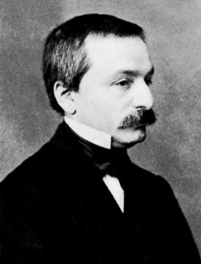

# 张量和张量积

*打开本页，如果没有显示公式，请刷新页面。*

《机器学习数学基础》第4章4.1.2节介绍了张量和张量积

**张量积**（tensor product），又称**克罗内克积**（Kronecker product）。

利奥波德·克罗内克（德语：Leopold Kronecker，1823年12月7日－1891年12月29日），德国数学家与逻辑学家，出生于西里西亚利格尼茨（现属波兰的莱格尼察），卒于柏林。他认为算术与数学分析都必须以整数为基础，他曾说：“**上帝创造了整数，其余都是人做的工作**”（Bell 1986, 477页）。这与数学家格奥尔格·康托尔的观点相互对立。克罗内克是恩斯特·库默尔的学生和终身挚友$$^{[1]}$$。 

## 张量积定义

设 $$\pmb{A}=(a_{ij})_{m\times n}$$ ，$$\pmb{B}$$ 为 $$p\times q$$ 矩阵，张量积 $$\pmb{A}\bigotimes\pmb{B}$$ 为 $$mp\times nq$$ 阶矩阵，定义为：

$$\pmb{A}\bigotimes\pmb{B}=\begin{bmatrix}a_{11}\pmb{B}&\cdots&a_{1n}\pmb{B}\\\vdots&\ddots&\vdots\\a_{m1}\pmb{B}&\cdots&a_{mn}\pmb{B}\end{bmatrix}$$

## 运算和性质

### 性质

- （1）$$\pmb{A}\bigotimes(\pmb{B}\bigotimes\pmb{C})=(\pmb{A}\bigotimes\pmb{B})\pmb{C}$$

- （2）$$(\pmb{A}\bigotimes\pmb{B})^k=\pmb{A}^k\bigotimes\pmb{B}^k$$
- （3）$$\pmb{A}\bigotimes(\pmb{B}+\pmb{C})=(\pmb{A}\bigotimes\pmb{B})+(\pmb{A}\bigotimes\pmb{C})$$
- （4）$$(\pmb{A}+\pmb{B})\bigotimes\pmb{C}=(\pmb{A}\bigotimes\pmb{C})+(\pmb{B}\bigotimes\pmb{C})$$
- （5）$$(k\pmb{A})\bigotimes\pmb{B}=\pmb{A}\bigotimes(k\pmb{B})=k(\pmb{A}\bigotimes\pmb{B})$$
- （6）$$(\pmb{A}\bigotimes\pmb{B})^*=\pmb{A}^*\bigotimes\pmb{B}^*$$

注意：张量积通常不符合交换律，$$\pmb{A}\bigotimes\pmb{B}$$ 通常不等于 $$\pmb{B}\bigotimes\pmb{A}$$ 。

### 混合乘积运算

- （7）若 $$\pmb{AC}$$ 和 $$\pmb{BD}$$ 存在，则：$$(\pmb{A}\bigotimes\pmb{B})(\pmb{C}\bigotimes\pmb{D})=\pmb{AC}\bigotimes\pmb{BD}$$

**证明**

根据定义，可得：

$$(\pmb{A}\bigotimes\pmb{B})(\pmb{C}\bigotimes\pmb{B})=\begin{bmatrix}a_{11}\pmb{B}&\cdots&a_{1n}\pmb{B}\\\vdots&\ddots&\vdots\\a_{m1}\pmb{B}&\cdots&a_{mn}\pmb{B}\end{bmatrix}\begin{bmatrix}c_{11}\pmb{D}&\cdots&c_{1p}\pmb{D}\\\vdots&\ddots&\vdots\\c_{n1}\pmb{D}&\cdots&c_{np}\pmb{D}\end{bmatrix}\overset{def}{=}\begin{bmatrix}\pmb{E}_{11}&\cdots&\pmb{E}_{1p}\\\vdots&\ddots&\vdots\\\pmb{E}_{m1}&\cdots&\pmb{E}_{mp}\end{bmatrix}$$

对于 $$\pmb{E}_{ij}$$ 有：

$$\pmb{E}_{ij}=\sum_{k=1}^na_{ik}\pmb{B}c_{kj}\pmb{D}=\left(\sum_{k=1}^na_{ik}c_{kj}\right)\pmb{BD}=(\pmb{AC})_{ij}(\pmb{BD})=((\pmb{AC})\bigotimes(\pmb{BD}))_{ij}$$

所以：$$\pmb{E}=\pmb{AC}\bigotimes\pmb{BD}$$

证毕。

- （8）若 $$\pmb{A}$$ 为 $$m$$ 阶方阵，$$\pmb{B}$$ 为 $$n$$ 阶方阵，则：

  $$\begin{split}(\pmb{A}\bigotimes\pmb{I}_n)(\pmb{I}_m\bigotimes\pmb{B})=\pmb{A}\bigotimes\pmb{B}\\(\pmb{I}_m\bigotimes\pmb{B})(\pmb{A}\bigotimes\pmb{I}_n)=\pmb{A}\bigotimes\pmb{B}\end{split}$$

**证明**

根据性质（7）直接计算：

$$(\pmb{A}\bigotimes\pmb{I}_n)(\pmb{I}_m\bigotimes\pmb{B})=(\pmb{AI}_m)\bigotimes(\pmb{I}_n\pmb{B})=\pmb{A}\bigotimes\pmb{B}$$

$$(\pmb{I}_m\bigotimes\pmb{B})(\pmb{A}\bigotimes\pmb{I}_n)=(\pmb{I}_m\pmb{A})\bigotimes(\pmb{BI}_n)=\pmb{A}\bigotimes\pmb{B}$$

证毕。

- （9）如果 $$\pmb{A}$$ 和 $$\pmb{B}$$ 都是可逆矩阵，则：$$(\pmb{A}\bigotimes\pmb{B})^{-1}=\pmb{A}^{-1}\bigotimes\pmb{B}^{-1}$$

**证明**

根据性质（7）计算：

$$(\pmb{A}\bigotimes\pmb{B})(\pmb{A}^{-1}\bigotimes\pmb{B}^{-1})=(\pmb{AA}^{-1})\bigotimes(\pmb{BB}^{-1})=\pmb{I}_m\bigotimes\pmb{I}_n=\pmb{I}$$

## 特征值

设 $$\pmb{A}$$ 为 $$m$$ 阶方阵，$$\pmb{B}$$ 为 $$n$$ 阶方阵，且：

$$\begin{split}\pmb{Ax}_i=\lambda_i\pmb{x}_i,\quad(i=1,\cdots,m)\\\pmb{By}_j=\mu_j\pmb{y}_j,\quad(j=1,\cdots,n)\end{split}$$

则：

$$\begin{split}(\pmb{A}\bigotimes\pmb{B})(\pmb{x}_i\bigotimes\pmb{y}_j)&=\lambda_i\mu_j(\pmb{x}_i\bigotimes\pmb{y}_j)\\(\pmb{A}\bigotimes\pmb{I}_n+\pmb{I}_m\bigotimes\pmb{B})(\pmb{x}_i\bigotimes\pmb{y}_j)&=(\lambda_i+\mu_j)(\pmb{x}_i\bigotimes\pmb{y}_j)\end{split}$$

**证明**

根据混合乘积运算性质（7），可以计算：

$$\begin{split}(\pmb{A}\bigotimes\pmb{B})(\pmb{x}_i\bigotimes\pmb{y}_j)&=(\pmb{Ax}_i)\bigotimes(\pmb{By}_j)=(\lambda_i\pmb{x}_i)\bigotimes(\mu_j\pmb{y}_j)\\&=(\lambda_i\mu_j)(\pmb{x}_i\bigotimes(\pmb{y}_j)\quad(根据性质（5）得)\end{split}$$

又因为 $$\pmb{I}_n\pmb{y}_j=\pmb{y}_j$$ 、$$\pmb{I}_m\pmb{x}_i=\pmb{x}_i$$ ，根据上式结果，可得：

$$(\pmb{A}\bigotimes\pmb{I}_n)(\pmb{x}_i\bigotimes\pmb{y}_j)=\lambda_i(\pmb{x}_i\bigotimes\pmb{y}_j)$$

$$(\pmb{I}_m\bigotimes\pmb{B})(\pmb{x}_i\bigotimes\pmb{y}_j)=\mu_i(\pmb{x}_i\bigotimes\pmb{y}_j)$$

上面两式相加，并应用性质（4）可得：

$$(\pmb{A}\bigotimes\pmb{I}_n+\pmb{I}_m\bigotimes\pmb{B})(\pmb{x}_i\bigotimes\pmb{y}_j)=(\lambda_i+\mu_j)(\pmb{x}_i\bigotimes\pmb{y}_j)$$

根据：矩阵特征值之和等于迹，特征值之积等于行列式（见《机器学习数学基础》第3章3.1.2节），有：

$$Tr(\pmb{A}\bigotimes\pmb{B})=\sum_{i=1}^m\sum_{j=1}^n\lambda_i\mu_j=\left(\sum_{i=1}^m\lambda_i\right)\left(\sum_{j=1}^n\right)=Tr(\pmb{A})\cdot Tr(\pmb{B})$$

$$|\pmb{A}\bigotimes\pmb{B}|=\prod_{1\le i\le m,1\le{j}\le{n}}\lambda_i\mu_j=\left(\prod_{i=1}^m\lambda_i\right)^n(\prod_{j=1}^n\mu_j)^m=|\pmb{A}|^n|\pmb{B}|^m$$

## 参考文献

[1]. [维基百科：利奥波德·克罗内克](https://zh.wikipedia.org/wiki/%E5%88%A9%E5%A5%A5%E6%B3%A2%E5%BE%B7%C2%B7%E5%85%8B%E7%BD%97%E5%86%85%E5%85%8B)