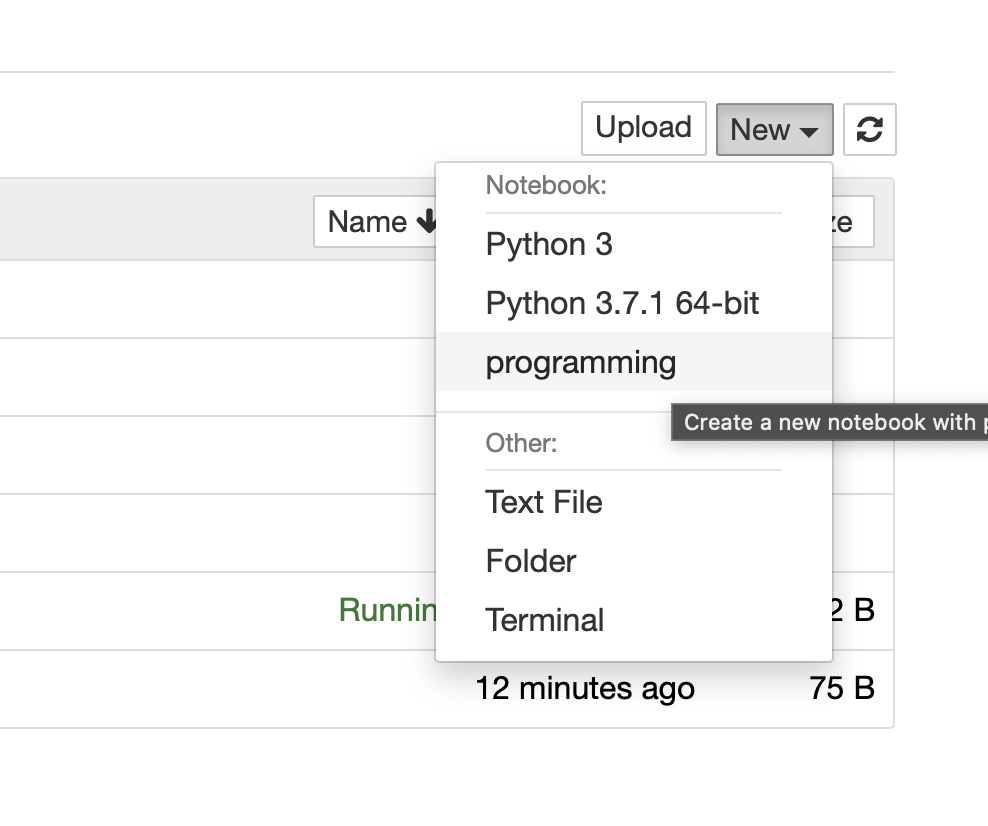

# 操作技巧

## 虚拟环境

```shell
# programming 是虚拟环境目录名称
qiwsir@qiwsirs-MBP python -m venv programming  

# 进入虚拟环境目录
qiwsir@qiwsirs-MBP % cd programming   

# 启动虚拟环境
qiwsir@qiwsirs-MBP programming % source ./bin/activate

# 退出
qiwsir@qiwsirs-MBP programming % deactivate
```


## 在虚拟环境中启动 Jupyter notebook

进入虚拟环境之后，安装：

```shell
(programming) qiwsir@qiwsirs-MBP programming % pip install --upgrade pip
(programming) qiwsir@qiwsirs-MBP programming % pip install ipykernel

# 以下的 programming 是呈现在 Jupyter 中的名称
(programming) qiwsir@qiwsirs-MBP programming % python -m ipykernel install -
-name programming
```

然后启动 jupyter notebook

```shell
(programming) qiwsir@qiwsirs-MBP programming % jupyter notebook
```

在 “New” 中看到 programming（前面取的名称），选择。如下图：



即可在 Jupyter notebook 中进入虚拟环境