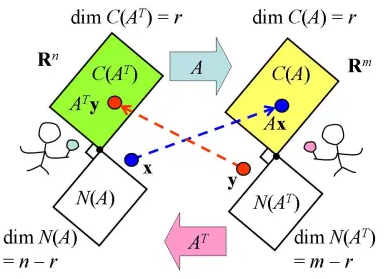

# 转置矩阵

*打开本页，若未显示公式，请刷新页面。*

《机器学习数学基础》第2章2.3.2节介绍了转置矩阵的基本概念，并且在之后的有关问题探讨中，经常会用到转置矩阵。此处在书中介绍的基础上，并综合其他有关知识，深入阐述对转置矩阵的理解。

以线性变换角度理解转置矩阵的意义$$^{[1]}$$ 。

矩阵 $$\pmb{A}$$ 为 $$m\times n$$ ，从线性变换的角度来看：

$$\begin{split}\pmb{A}&:\mathbb{R}^n\to\mathbb{R}^m\\\pmb{A}^{\rm{T}}&:\mathbb{R}^m\to\mathbb{R}^n\end{split}$$​

如下图所示：

在“[秩—零化度定理](./basetheory.html)”中，对 $$\pmb{A}$$​ 和 $$\pmb{A}^{\rm{T}}$$​ 的列空间维数关系有所阐述，请参考。

## 转置矩阵的定义

结合上图，设 $$\pmb{x},\pmb{A}^{\rm{T}}\pmb{y}\in\mathbb{R}^n；\pmb{y},\pmb{Ax}\in\mathbb{R}^m$$​ 。因为：

$$(\pmb{Ax})^{\rm{T}}\pmb{y}=\pmb{x}^{\rm{T}}\pmb{A}^{\rm{T}}\pmb{y}=\pmb{x}^{\rm{T}}(\pmb{A}^{\rm{T}}\pmb{y})$$

可得：$$\mathbb{R}^m$$ 中的向量 $$\pmb{Ax}$$ 与 $$\pmb{y}$$ 的点积等于 $$\mathbb{R}^n$$ 中的向量 $$\pmb{x}$$ 与 $$\pmb{A}^{\rm{T}}\pmb{y}$$ 的点积$$^{[2]}$$ 。

以上的性质，称为**伴随**（adjoint），利用这个性质定义转置矩阵：

> 设 $$m\times n$$ 的实矩阵 $$\pmb{A}$$ ，则转置矩阵 $$\pmb{A}^T$$ 应满足：$$(\pmb{Ax})^{\rm{T}}\pmb{y}=\pmb{x}^{\rm{T}}(\pmb{A}^{\rm{T}}\pmb{y})$$

## 参考文献

[1]. [线代启示录：转置矩阵的意义](https://ccjou.wordpress.com/2010/05/20/%e8%bd%89%e7%bd%ae%e7%9f%a9%e9%99%a3%e7%9a%84%e6%84%8f%e7%be%a9/)

[2]. 关于内积和点积的详细内容，请参阅[《机器学习数学基础》](http://math.itdiffer.com)第1章1.4.2节。

